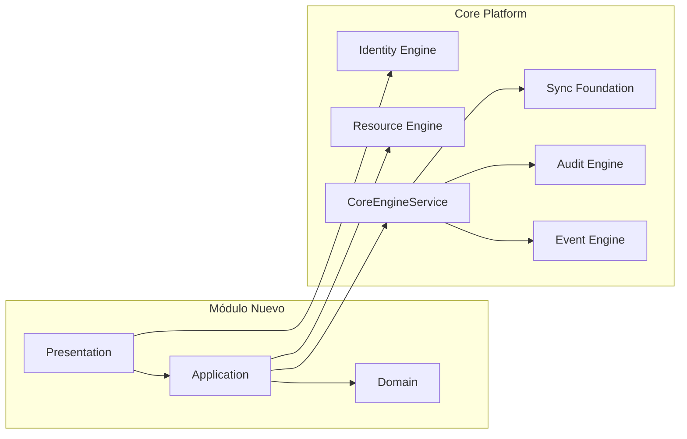

# AGROERP Enterprise Platform Standard (AEPS)

**Versión:** 1.0  
**Estado:** Oficial — Constitución técnica obligatoria  
**Audiencia:** Desarrolladores, arquitectos, QA, DevOps, integradores y sistemas de IA  
**Aplicabilidad:** Todo módulo, motor, servicio, plugin, pantalla o integración de AGROERP

---

## 0. Propósito y autoridad

AEPS es el **estándar único** que gobierna cómo se diseñan, desarrollan, documentan, prueban, despliegan y mantienen todos los componentes de AGROERP.

### Reglas de cumplimiento

| Regla | Descripción |
|-------|-------------|
| **R1 — Sin excepciones silenciosas** | Ningún componente se integra a la plataforma sin cumplir AEPS |
| **R2 — Documentación = contrato** | Si no está documentado según AEPS, no existe oficialmente |
| **R3 — Eventos obligatorios** | Toda mutación de estado genera evento + auditoría |
| **R4 — Multi-tenant siempre** | Toda entidad de negocio lleva `organizationId` |
| **R5 — Offline-first donde aplique** | Campo y sync deben seguir el patrón de la plataforma |
| **R6 — Seguridad por defecto** | Denegar por defecto; permitir explícitamente vía RBAC + PBAC |
| **R7 — Extensibilidad** | Preferir metadata y recursos genéricos sobre tablas rígidas |
| **R8 — Trazabilidad** | Correlation ID en toda cadena request → evento → auditoría |

### Relación con otros documentos

| Documento | Rol |
|-----------|-----|
| `APOS.md` | **Sistema operativo** — orquestación, registries, lifecycle, observabilidad |
| `EXTENSION_PLUGIN_FRAMEWORK.md` | **Framework de extensión** — packages, manifest, lifecycle, seguridad, marketplace |
| `GOVERNANCE_ENTERPRISE_CONTROL_LAYER.md` | **Gobierno empresarial** — auditoría, compliance, riesgo, control financiero, seguridad |
| `INTEGRATION_ECOSYSTEM_LAYER.md` | **Integración ecosistema** — hub, APIs, webhooks, IoT, fintech, conectores |
| `DATA_PLATFORM_ANALYTICS_LAYER.md` | **Plataforma analítica** — lake, warehouse, BI, Metrics Engine, Feature Store |
| `DATA_GOVERNANCE_PLATFORM.md` | **Gobierno de datos** — MDM, calidad, lineage, seguridad, Data Catalog |
| `ARCHITECTURE.md` | Visión y decisiones arquitectónicas |
| `AEPS.md` (este) | **Norma obligatoria de implementación** |
| `{MODULE}_ENGINE.md` | Especificación de cada motor |
| `DATABASE.md` | Modelo de datos del núcleo |
| `EVENTS.md` | Sistema de eventos |

**Precedencia:** En caso de conflicto, **AEPS prevalece** sobre documentos de módulo en materia de implementación; **APOS prevalece** en materia de orquestación y operación de plataforma. Los cambios a AEPS o APOS requieren revisión de arquitectura.

---

## 1. Arquitectura de módulos

Todo módulo o motor de AGROERP **debe** declarar formalmente los siguientes elementos antes de escribir código de producción.

### 1.1 Plantilla obligatoria de módulo

Cada módulo entrega un archivo `docs/{MODULE}_ENGINE.md` (o `{DOMAIN}_MODULE.md`) con estas secciones:

```markdown
# {Nombre del Módulo}

## 1. Objetivo
Qué problema empresarial resuelve y qué NO resuelve (alcance negativo).

## 2. Alcance
Funcionalidades incluidas / excluidas / roadmap.

## 3. Dependencias
- Motores core requeridos (Identity, Resource, Metadata, Events…)
- Módulos de negocio
- Servicios externos (S3, Redis, FCM…)

## 4. Eventos que publica
| Evento | Aggregate | Cuándo |

## 5. Eventos que consume
| Evento | Handler | Efecto |

## 6. APIs
Tabla de endpoints con permisos.

## 7. Permisos
resource:action registrados en SYSTEM_PERMISSIONS.

## 8. Recursos
Tipos Resource asociados (si aplica).

## 9. Configuración
Organization.settings / module.config JSON.

## 10. Auditoría
Qué se audita y con qué granularidad.

## 11. Offline
Estrategia sync: pull/push, externalId, conflictos.

## 12. Reportes
Reportes/KPIs que expone o alimenta.

## 13. KPIs
Métricas de negocio del módulo.

## 14. Integraciones
Webhooks, APIs externas, service accounts.

## 15. Pruebas
Cobertura mínima y escenarios críticos.
```

### 1.2 Estructura de código (Clean / Hexagonal)

```
backend/src/core/{module}/
├── domain/              # Entidades, value objects, ports (interfaces)
├── application/         # Casos de uso, servicios, DTOs
├── infrastructure/      # Prisma, Redis, S3, adaptadores externos
└── presentation/        # Controllers REST, guards específicos
```

**Regla de dependencia:**

```
presentation → application → domain ← infrastructure
```

El dominio **nunca** importa infraestructura ni frameworks.

### 1.3 Tipos de componentes

| Tipo | Prefijo ruta API | Ejemplo | Registro |
|------|------------------|---------|----------|
| **Motor Core** | `/api/v1/{engine}` | Event Engine, Identity Engine | `app.module.ts` |
| **Módulo de negocio** | `/api/v1/{domain}` | Producers, Contracts | EPF Extension Package → Plugin Registry |
| **Capacidad transversal** | Middleware/Guard global | Tenant, Auth, Audit | Core Engine |
| **Integración** | `/api/v1/integrations/{id}` | Webhooks, ETL | Service Account |

### 1.4 Principios de diseño

1. **Modular Monolith** — un despliegue, bounded contexts claros, extracción futura a microservicios si el volumen lo exige.
2. **Resource Model primero** — entidades simples extienden `Resource`; tablas dedicadas solo con justificación (performance, relaciones N:N complejas, GIS pesado).
3. **Metadata-driven** — campos configurables vía Metadata Engine / Form Engine, no hardcodeados.
4. **Event-driven** — comunicación entre módulos preferentemente por eventos, no acoplamiento directo de servicios.
5. **Idempotencia** — operaciones de sync, webhooks y handlers deben tolerar reintentos.

### 1.5 Diagrama de integración de módulo



**Obligatorio:** Toda mutación pasa por `CoreEngineService` (o equivalente documentado) para emitir evento + auditoría + sync queue.

---

## 2. Modelo de datos

### 2.1 Reglas obligatorias

| Regla | Estándar | Ejemplo |
|-------|----------|---------|
| **Identificadores** | `UUID` v4/v7, tipo `uuid` en PostgreSQL | `@id @default(uuid()) @db.Uuid` |
| **Primary Key** | Siempre `id`, nunca claves compuestas como PK | Excepto tablas de unión pura |
| **Multi-tenant** | `organizationId` NOT NULL en tablas de negocio | `@map("organization_id")` |
| **Timestamps** | `createdAt`, `updatedAt` en `timestamptz` UTC | `@db.Timestamptz` |
| **Soft delete** | `deletedAt` nullable en entidades mutables | Nunca `DELETE` físico en producción |
| **Versionado** | `version Int @default(1)` para optimistic locking | Incrementar en cada update |
| **Auditoría de autor** | `createdBy`, `updatedBy` cuando aplique | FK → `users` |
| **Atributos dinámicos** | `jsonb` con validación por Metadata Engine | `attributes`, `metadata`, `profile` |
| **Sync offline** | `externalId` opcional, único por org | Idempotencia cliente |
| **Estado sync** | `syncStatus` en entidades sincronizables | `synced`, `pending`, `conflict` |

### 2.2 Convenciones de nomenclatura

| Capa | Convención | Ejemplo |
|------|------------|---------|
| Tablas PostgreSQL | `snake_case`, plural | `form_submissions` |
| Columnas | `snake_case` | `organization_id` |
| Prisma models | `PascalCase` singular | `FormSubmission` |
| Prisma fields | `camelCase` + `@map` | `organizationId` → `organization_id` |
| Enums Prisma | `snake_case` valores | `active`, `field_agent` |
| Índices | `idx_{tabla}_{columnas}` | `idx_resources_org_type` |
| FK | `{tabla}_{columna}_fkey` | Automático Prisma |

### 2.3 JSONB — uso permitido

| Campo | Uso | Validación |
|-------|-----|------------|
| `attributes` | Datos de negocio dinámicos del Resource | Metadata Engine |
| `metadata` | Datos técnicos, tags, flags | Schema JSON opcional del módulo |
| `settings` | Configuración de org/módulo | Documentar schema en módulo |
| `preferences` | Preferencias de usuario | Schema libre acotado |
| `definition` | Schemas de forms/workflows | Versionado explícito |
| `conditions` | Políticas PBAC | Policy Engine |
| `payload` | Eventos | Tipado en `@agroerp/shared` |

**Prohibido:** Almacenar en JSONB lo que deba ser indexado frecuentemente sin índice GIN/BTREE expreso.

### 2.4 Relaciones

| Tipo | Regla |
|------|-------|
| **1:N** | FK en el lado N |
| **N:N** | Tabla de unión con PK compuesta o `id` propio |
| **Jerarquía** | `parentId` self-reference + índice |
| **Polimórfica** | `{entity}Type` + `{entity}Id` + índice compuesto |
| **Cascada** | `onDelete: Cascade` solo en tablas de unión; `Restrict` en negocio |

### 2.5 Índices obligatorios

Toda tabla de negocio debe tener como mínimo:

```sql
-- Aislamiento tenant + consultas frecuentes
CREATE INDEX idx_{table}_org ON {table} (organization_id) WHERE deleted_at IS NULL;

-- Soft delete filtering
-- Incluir WHERE deleted_at IS NULL en índices parciales cuando >10% son borrados
```

Índices adicionales según patrones de consulta documentados en el módulo.

### 2.6 Row-Level Security (RLS)

```sql
ALTER TABLE {table} ENABLE ROW LEVEL SECURITY;
CREATE POLICY tenant_isolation ON {table}
  USING (organization_id = current_setting('app.current_org_id')::uuid);
```

`TenantMiddleware` ejecuta `SET app.current_org_id` por request autenticado.

### 2.7 Migraciones

| Regla | Descripción |
|-------|-------------|
| **Herramienta** | Prisma Migrate en producción; `db push` solo en desarrollo |
| **Nombrado** | `YYYYMMDDHHMMSS_descripcion` |
| **Reversibilidad** | Toda migración debe tener plan de rollback documentado |
| **Datos** | Seeds separados de migraciones estructurales |
| **Breaking** | Cambios breaking requieren versión de API nueva |

### 2.8 Cuándo crear tabla dedicada vs Resource

| Usar `Resource` | Usar tabla dedicada |
|-----------------|---------------------|
| Entidad configurable por metadata | >1M registros con queries complejas |
| Campos mayormente dinámicos | Relaciones N:N con atributos en unión |
| Prototipo de dominio | Requisitos GIS intensivos |
| Plugin experimental | Constraints únicos compuestos complejos |

**Justificación obligatoria** en documentación del módulo si se elige tabla dedicada.

---

## 3. APIs

### 3.1 Convención REST

| Elemento | Estándar |
|----------|----------|
| **Base URL** | `https://{host}/api/v1` |
| **Recursos** | Sustantivos plurales en `kebab-case` | `/form-submissions` |
| **IDs** | UUID en path | `/resources/{id}` |
| **Acciones no-CRUD** | Sub-recursos o verbos POST | `/sessions/{id}/revoke` |
| **Content-Type** | `application/json` |
| **Charset** | UTF-8 |

### 3.2 Métodos HTTP

| Método | Uso | Idempotente |
|--------|-----|-------------|
| `GET` | Lectura, listados | Sí |
| `POST` | Creación, acciones | No* |
| `PUT` | Reemplazo completo | Sí |
| `PATCH` | Actualización parcial | No |
| `DELETE` | Soft delete | Sí |

*POST con `externalId` o `Idempotency-Key` debe ser idempotente en operaciones de sync.

### 3.3 Versionado

```
/api/v1/...   ← versión actual
/api/v2/...   ← breaking changes; v1 soportada mínimo 12 meses
```

- Versión en URL path (no header) para claridad en clientes móviles.
- Cambios aditivos (nuevos campos opcionales) no requieren nueva versión.
- Cambios breaking: eliminar campos, cambiar tipos, cambiar semántica de errores.

### 3.4 Formato de respuesta exitosa

**Entidad única:**
```json
{
  "id": "550e8400-e29b-41d4-a716-446655440000",
  "organizationId": "...",
  "createdAt": "2026-07-01T10:00:00.000Z",
  "updatedAt": "2026-07-01T10:00:00.000Z",
  "version": 1
}
```

**Listado paginado:**
```json
{
  "data": [ ... ],
  "meta": {
    "page": 1,
    "pageSize": 25,
    "total": 1420,
    "totalPages": 57
  }
}
```

### 3.5 Paginación

| Parámetro | Tipo | Default | Máximo |
|-----------|------|---------|--------|
| `page` | integer ≥ 1 | 1 | — |
| `pageSize` | integer | 25 | 100 |
| `cursor` | string | — | Para sync/event feeds |

**Sync/Event feeds:** cursor-based con `globalSequence` o `cursor` opaco — no offset.

### 3.6 Filtros y ordenamiento

```
GET /resources?type=farm&status=active&parentId={uuid}
GET /resources?sort=-createdAt,name
GET /resources?q=roble
```

| Parámetro | Descripción |
|-----------|-------------|
| `q` | Búsqueda full-text (cuando esté disponible) |
| `sort` | Campo; prefijo `-` = descendente |
| `{field}` | Filtro exacto por campo indexado |
| `{field}[gte]` | Rangos en campos de fecha/número |

Filtros no documentados en OpenAPI están **prohibidos** en APIs públicas.

### 3.7 Formato de errores

Estructura estándar (RFC 7807 inspirado):

```json
{
  "statusCode": 403,
  "error": "Forbidden",
  "message": "Access denied: purchase:create",
  "code": "ACCESS_DENIED",
  "correlationId": "abc-123-def",
  "timestamp": "2026-07-01T10:00:00.000Z",
  "path": "/api/v1/purchases"
}
```

| HTTP | Uso |
|------|-----|
| `400` | Validación de entrada |
| `401` | No autenticado / token inválido |
| `403` | Autenticado pero sin permiso (RBAC/PBAC) |
| `404` | Recurso no encontrado (o sin acceso — no revelar existencia) |
| `409` | Conflicto de versión / duplicado |
| `422` | Regla de negocio violada |
| `429` | Rate limit excedido |
| `500` | Error interno (sin detalles en producción) |

### 3.8 Headers obligatorios

| Header | Dirección | Descripción |
|--------|-----------|-------------|
| `Authorization` | Request | `Bearer {jwt}` |
| `X-Correlation-Id` | Request/Response | UUID; generar si ausente |
| `X-Device-Id` | Request (mobile) | Identificador persistente |
| `X-Device-Trusted` | Request (mobile) | `true` si dispositivo autorizado |
| `X-App-Version` | Request (mobile) | Semver de la app |
| `X-Platform` | Request | `web`, `android`, `api` |
| `Accept-Language` | Request | `es`, `en` (i18n) |
| `Idempotency-Key` | Request (POST sync) | UUID para reintentos seguros |

### 3.9 Documentación OpenAPI / Swagger

| Requisito | Estándar |
|-----------|----------|
| **Generación** | Decoradores `@nestjs/swagger` en todos los controllers |
| **Tags** | Agrupar por módulo: `Identity — Roles (RBAC)` |
| **Schemas** | DTOs con `@ApiProperty` / `@ApiPropertyOptional` |
| **Seguridad** | `@ApiBearerAuth()` en endpoints protegidos |
| **Publicación** | `/api` (Swagger UI) en dev; spec JSON exportable en CI |
| **Contrato** | Cambios de API actualizan spec antes del merge |

### 3.10 Seguridad en APIs

- Todo endpoint (excepto `/health`, `/auth/login`, `/auth/register`) requiere JWT válido.
- `@RequirePermissions('resource:action')` en cada operación.
- PBAC evaluado vía `AuthorizationService` en `PermissionsGuard`.
- Validación de entrada con `class-validator` en todos los DTOs.
- Sanitización de salida — nunca exponer `passwordHash`, `clientSecret`, tokens.

### 3.11 Rate limiting

| Contexto | Límite inicial | Ventana |
|----------|----------------|---------|
| Login | 10 intentos | 15 min / IP |
| API autenticada | 1000 req | 1 min / user |
| Sync batch | 60 req | 1 min / device |
| Webhooks salientes | 100 req | 1 min / integración |

Implementación: Redis sliding window (futuro API Gateway). Responder `429` con header `Retry-After`.

---

## 4. Eventos

### 4.1 Principios

1. **Toda mutación de estado genera un evento** — sin excepciones en core y módulos de negocio.
2. **Eventos son inmutables** — append-only; nunca UPDATE ni DELETE.
3. **At-least-once delivery** — handlers deben ser idempotentes.
4. **Event Store es fuente de verdad** para auditoría, sync y reconstrucción.

### 4.2 Contrato obligatorio de evento

```typescript
interface DomainEvent {
  // Identidad
  id: string;                      // UUID
  organizationId: string;          // Tenant

  // Aggregate
  aggregateType: string;           // 'Resource' | 'User' | 'Form' | ...
  aggregateId: string;             // UUID de la entidad
  eventType: string;               // PascalCase: 'ResourceCreated'
  version: number;                 // Secuencia por aggregate

  // Datos
  payload: Record<string, unknown>; // Solo datos del dominio
  metadata: EventMetadata;          // Contexto técnico

  // Tiempo
  occurredAt: Date;                // Cuándo ocurrió en el dominio
  recordedAt?: Date;               // Cuándo se persistió (automático)
}

interface EventMetadata {
  userId?: string;
  deviceId?: string;
  correlationId: string;           // OBLIGATORIO — trazabilidad E2E
  causationId?: string;            // Evento padre
  source: 'web' | 'android' | 'api' | 'system';
  ipAddress?: string;
  userAgent?: string;
  priority?: 'low' | 'normal' | 'high' | 'critical';
  idempotencyKey?: string;         // Para sync/webhooks
}
```

### 4.3 Nomenclatura

| Elemento | Convención | Ejemplo |
|----------|------------|---------|
| Event Type | PascalCase, verbo pasado | `FormSubmitted` |
| Aggregate Type | PascalCase, sustantivo | `FormSubmission` |
| Constante TS | SCREAMING_SNAKE en `EVENT_TYPES` | `FORM_SUBMITTED` |
| Registro | `@agroerp/shared` | Export centralizado |

### 4.4 Prioridad

| Prioridad | Uso | SLA procesamiento |
|-----------|-----|-------------------|
| `critical` | Seguridad, bloqueo, revocación | < 1s |
| `high` | Workflows, aprobaciones | < 5s |
| `normal` | CRUD estándar | < 30s |
| `low` | Analytics, notificaciones | Best effort |

### 4.5 Idempotencia

| Mecanismo | Cuándo |
|-----------|--------|
| `idempotencyKey` en metadata | Sync push, webhooks |
| `externalId` en entidad | Creaciones desde mobile |
| Tabla `processed_events` | Handlers async |
| Check `event.id` duplicado | Event Store append |

### 4.6 Registro de eventos por módulo

Al crear un módulo, registrar en:

1. `shared/src/index.ts` → `EVENT_TYPES`, `AGGREGATE_TYPES`
2. `docs/{MODULE}_ENGINE.md` → tabla de eventos
3. `docs/EVENTS.md` → catálogo global (o auto-generado en CI)

### 4.7 Publicación

```
Mutación → Transacción DB → CoreEngineService.emit()
         → INSERT events → INSERT audit_logs → sync_queue
         → (post-commit) Redis Stream publish
```

Nunca publicar al bus antes del commit de la transacción.

---

## 5. Seguridad

### 5.1 Modelo de seguridad AGROERP

```
Autenticación (¿quién eres?) → JWT + Sesión
Autorización RBAC (¿qué puedes hacer?) → Roles + Permisos
Autorización PBAC (¿cuándo/dónde/cómo?) → Políticas
Auditoría (¿qué hiciste?) → Audit + Events
```

Referencia: `IDENTITY_ENGINE.md`

### 5.2 Autenticación

| Componente | Estándar |
|------------|----------|
| Access Token | JWT, 15 min, HS256/RS256 |
| Refresh Token | 7 días, rotación en cada uso |
| Sesión | Registro en BD con `jti`, revocable |
| Claims JWT | `sub`, `email`, `orgId`, `roles`, `permissions`, `sessionId`, `jti`, `userType` |
| Password | bcrypt cost ≥ 12 |
| Service Account | `clientId` + `clientSecret` hasheado |

### 5.3 Autorización

**Formato permiso:** `{resource}:{action}`

Acciones estándar: `create`, `read`, `update`, `delete`, `approve`, `reject`, `sign`, `export`, `import`, `audit`, `admin`, `sync`, `publish`, `submit`, `push`

**Evaluación:**
```
Acceso = RBAC permite AND PBAC no deniega AND scope válido
```

### 5.4 MFA (preparado)

Campos reservados en `User.metadata`:
```json
{ "mfa": { "enabled": false, "method": null, "enrolledAt": null } }
```

Endpoints futuros: `/auth/mfa/enroll`, `/auth/mfa/verify`. Hasta entonces, documentar como roadmap.

### 5.5 Dispositivos

| Campo | Descripción |
|-------|-------------|
| `device_fingerprint` | Hash único del dispositivo |
| `trusted` | Aprobado por administrador |
| `revoked_at` | Revocación remota |
| `last_sync_at` | Última sincronización |

Políticas PBAC pueden exigir `device_trusted` o `device_registered`.

### 5.6 Tokens y revocación

- Logout revoca sesión actual.
- Lock de usuario revoca todas las sesiones.
- Admin puede `revoke` sesión individual o `revoke-all`.
- JWT invalidado verificando sesión activa en `JwtStrategy`.

### 5.7 Logs de seguridad

Registrar obligatoriamente:
- Login exitoso / fallido
- Logout
- Cambio de contraseña / rol / permiso
- Revocación de sesión / dispositivo
- Acceso denegado (403) en operaciones sensibles
- Creación/revocación de API keys

Retención mínima: **2 años** en producción.

---

## 6. Frontend Web

> Estado: estándares definidos; implementación UI en evolución.

### 6.1 Stack

| Capa | Tecnología |
|------|------------|
| Framework | React 18+ |
| Build | Vite |
| Estado servidor | TanStack Query |
| Routing | React Router |
| UI | Design system propio (`packages/ui`) |
| Mapas | MapLibre GL JS |
| i18n | react-i18n / i18next |
| Forms dinámicos | Form Renderer (paridad con backend) |

### 6.2 Estructura

```
frontend/src/
├── app/           # Providers, routes, layout
├── features/      # Un folder por dominio funcional
├── shared/        # Componentes, hooks, API client
└── assets/
```

### 6.3 Componentes

| Categoría | Estándar |
|-----------|----------|
| **Atómicos** | Button, Input, Badge, Icon — sin lógica de negocio |
| **Moleculares** | FormField, SearchBar, Pagination |
| **Organismos** | DataTable, DynamicForm, MapView, DashboardCard |
| **Templates** | ListPage, DetailPage, WizardPage |

Props tipadas con TypeScript. Sin `any` en componentes compartidos.

### 6.4 Layout

```
┌─────────────────────────────────────────────┐
│ TopBar (org, user, notifications, sync)     │
├──────────┬──────────────────────────────────┤
│ Sidebar  │ Content Area                     │
│ (nav)    │  ┌─ Breadcrumb ────────────────┐ │
│          │  │ Page Title    [Actions]     │ │
│          │  ├─────────────────────────────┤ │
│          │  │                             │ │
│          │  │  Content                    │ │
│          │  │                             │ │
│          │  └─────────────────────────────┘ │
└──────────┴──────────────────────────────────┘
```

### 6.5 Responsive

| Breakpoint | Ancho | Comportamiento |
|------------|-------|----------------|
| `sm` | < 640px | Sidebar colapsado, tablas → cards |
| `md` | 640–1024px | Sidebar overlay |
| `lg` | > 1024px | Layout completo |

### 6.6 Tablas de datos

Obligatorio en listados empresariales:
- Paginación server-side
- Ordenamiento por columna
- Filtros persistentes en URL (`?status=active&page=2`)
- Export CSV/Excel en acciones (cuando el módulo lo soporte)
- Selección múltiple para acciones batch
- Estado vacío con CTA
- Loading skeleton (no spinners bloqueantes)

### 6.7 Formularios

- Validación client-side espejando backend
- Formularios dinámicos vía Form Engine — **nunca** hardcodear campos de negocio
- Errores de campo inline + resumen superior
- Autosave en drafts cuando `allowDraft: true`
- Confirmación en acciones destructivas

### 6.8 Mapas

- MapLibre GL con estilo configurable por org
- Capas: fincas (polígono), puntos, tracks, geofence
- Editor de geometría con snap y validación
- Coordenadas siempre WGS84 (EPSG:4326) en API

### 6.9 Dashboards

- Widgets configurables por rol
- KPIs con período seleccionable
- Actualización: polling o WebSocket (futuro)
- Export de dashboard a PDF

### 6.10 Temas

| Modo | Uso |
|------|-----|
| Light | Default oficina |
| Dark | Operación nocturna / campo |
| High contrast | Accesibilidad |

Variables CSS centralizadas. Colores semánticos: `--color-success`, `--color-danger`, `--color-warning`.

### 6.11 Accesibilidad (WCAG 2.1 AA)

- Contraste mínimo 4.5:1
- Navegación por teclado completa
- `aria-label` en iconos
- Focus visible
- Textos alternativos en imágenes

### 6.12 Internacionalización

- Idiomas obligatorios: `es` (default), `en`
- Claves i18n: `{module}.{screen}.{element}`
- Fechas/números según locale del usuario
- RTL preparado (futuro)

---

## 7. Android

Referencia implementada: `ANDROID_FIELD_APP.md`

### 7.1 Stack

| Capa | Tecnología |
|------|------------|
| Lenguaje | Kotlin |
| UI | Jetpack Compose |
| Arquitectura | Clean Architecture + MVVM |
| DI | Hilt |
| DB local | Room |
| Red | Retrofit + OkHttp |
| Background | WorkManager |
| GPS | FusedLocationProvider |
| Imágenes | Coil |

### 7.2 Capas

```
presentation/  →  ViewModel  →  UseCase  →  Repository
                                              ├─ Remote (API)
                                              └─ Local (Room)
```

**Reglas:**
- ViewModel no accede a Room/API directamente
- UseCase = una acción de negocio
- Repository decide fuente (local/remoto)
- Domain no depende de Android framework

### 7.3 Room — tablas estándar por app

| Tabla | Propósito |
|-------|-----------|
| `session` | Tokens y datos de sesión cifrados |
| `sync_queue` | Outbox de operaciones |
| `sync_state` | Cursor de pull |
| `local_events` | Eventos pendientes de sync |
| `{entity}_cache` | Cache de entidades del módulo |
| `media_files` | Archivos multimedia pendientes de upload |

### 7.4 Sync

Orden obligatorio en `SyncEngine.syncAll()`:
1. Refresh JWT
2. Upload media/files
3. Push entidades con `externalId`
4. Pull eventos (cursor)
5. Re-bootstrap metadata/forms

### 7.5 Multimedia

- Fotos: JPEG comprimido, max 2MB por defecto
- Firma: PNG local → upload antes de submission
- Video/audio: cola separada, upload en background
- Almacenamiento: app-private, nunca galería pública sin permiso

### 7.6 GPS

- Precisión mínima configurable (`maxAccuracyMeters` en form schema)
- Track: punto cada N segundos o N metros
- Permisos runtime obligatorios con explicación al usuario
- Fallback: última posición conocida con flag `stale: true`

### 7.7 Caché

| Dato | TTL | Invalidación |
|------|-----|--------------|
| Forms bootstrap | Hasta sync | Evento `FormPublished` |
| User permissions | Sesión | Re-login |
| Resources | 24h | Pull de eventos |

### 7.8 Navegación

- Navigation Compose con rutas tipadas
- Deep links para notificaciones (futuro)
- Back stack preservado en rotación

### 7.9 Manejo de errores

| Tipo | UX |
|------|-----|
| Sin red | Banner persistente + modo offline |
| 401 | Refresh automático; si falla → login |
| 403 | Mensaje claro, no reintentar |
| 409 conflict | Pantalla de resolución |
| 500 | Reintento con backoff + reporte |

### 7.10 UX offline

- Indicador global de estado sync (pending count)
- Operaciones locales instantáneas (< 100ms perceived)
- Cola visible al usuario ("3 envíos pendientes")
- Sync manual + automático (WorkManager cada 15 min con red)

---

## 8. GIS

### 8.1 Sistema de referencia

| Estándar | Uso |
|----------|-----|
| **EPSG:4326** (WGS84) | API, GeoJSON, almacenamiento PostGIS |
| **EPSG:3857** | Solo renderizado web (tiles) |
| Altitud | Metros sobre el elipsoide, opcional |

**Prohibido** mezclar CRS sin transformación explícita documentada.

### 8.2 Tipos geométricos

| Tipo | PostGIS | Uso AGROERP |
|------|---------|-------------|
| Point | `geometry(Point, 4326)` | GPS, marcadores |
| LineString | `geometry(LineString, 4326)` | Tracks, rutas |
| Polygon | `geometry(Polygon, 4326)` | Fincas, lotes, geofence |
| MultiPolygon | `geometry(MultiPolygon, 4326)` | Fincas compuestas |

### 8.3 Formato en API (GeoJSON)

```json
{
  "type": "Point",
  "coordinates": [-74.0817, 4.6097],
  "properties": {
    "accuracy": 12.5,
    "altitude": 2600,
    "capturedAt": "2026-07-01T10:00:00Z",
    "source": "android_gps"
  }
}
```

**Orden de coordenadas:** `[longitude, latitude]` (GeoJSON estándar).

### 8.4 Tracks

- Serie temporal de puntos → `LineString` al cerrar track
- Metadata: `pointCount`, `startedAt`, `endedAt`, `distanceMeters`
- Particionado por fecha en tablas de alto volumen

### 8.5 Geofencing

```sql
SELECT ST_Contains(farm.geometry, ST_SetSRID(ST_MakePoint(:lng, :lat), 4326))
```

Usado en: validación de forms, políticas PBAC, alertas de campo.

### 8.6 Capas de mapa

| Capa | Fuente | Offline |
|------|--------|---------|
| Base | MapTiler / OSM | Cache de tiles MBTiles |
| Fincas | API `/locations` | Simplificación + cache |
| Tracks | API `/location-tracks` | Solo local hasta sync |
| Heatmap | Analytics (futuro) | No |

### 8.7 Formatos de intercambio

| Formato | Soporte | Uso |
|---------|---------|-----|
| GeoJSON | Nativo | API, web, Android |
| KML | Import/Export | Google Earth, QGIS |
| Shapefile (.shp) | Import | Migración legacy SIG |
| WKT | Debug/admin | Consultas PostGIS |

### 8.8 Offline Maps

- Región de operación definida por org (bounding box)
- Tiles precacheados en Android (MBTiles)
- Geometrías de fincas en SQLite como GeoJSON simplificado
- Sync de geometrías vía pull de eventos `LocationCaptured`

---

## 9. Reportes

Todo módulo que genere información analítica debe soportar el estándar de reportes.

### 9.1 Formatos obligatorios

| Formato | Librería sugerida | Uso |
|---------|-------------------|-----|
| PDF | Puppeteer / PDFKit | Impresión formal, firmas |
| Excel | ExcelJS | Análisis, pivot |
| CSV | Nativo | Integración, BI |
| Impresión | CSS `@media print` | Web directa |

### 9.2 Estructura de reporte

```typescript
interface ReportDefinition {
  id: string;
  moduleId: string;
  name: string;
  description: string;
  parameters: ReportParameter[];   // Filtros configurables
  columns: ReportColumn[];
  defaultSort: string;
  permissions: string[];         // Quién puede ejecutar
  schedulable: boolean;
}
```

### 9.3 Filtros estándar

Todo reporte debe aceptar como mínimo:
- Rango de fechas (`from`, `to`)
- `organizationId` (automático por tenant)
- Filtros de scope (finca, región, usuario) según permisos

### 9.4 Programación

```json
{
  "schedule": "0 6 * * 1",
  "timezone": "America/Bogota",
  "format": "pdf",
  "recipients": ["manager@org.com"],
  "parameters": { "region": "REG-ANT" }
}
```

### 9.5 Exportación y compartir

- Download directo (sync)
- Email con adjunto (async job)
- Link temporal firmado (S3 presigned, TTL 24h)
- Auditoría de cada export (`ReportExported` event)

### 9.6 KPIs

Todo módulo documenta en su spec:
- Definición del KPI (fórmula)
- Fuente de datos (tabla/evento)
- Frecuencia de actualización
- Umbral de alerta (opcional)

---

## 10. Logging

### 10.1 Categorías

| Categoría | Nivel | Destino | Retención |
|-----------|-------|---------|-----------|
| **Técnico** | debug–error | stdout / Loki | 30 días |
| **Funcional** | info | stdout + DB | 1 año |
| **Seguridad** | info–warn | stdout + DB inmutable | 2 años |
| **Sync** | info–debug | stdout + DB | 90 días |
| **Auditoría** | info | `audit_logs` + events | 2+ años |

### 10.2 Formato estructurado (JSON)

```json
{
  "timestamp": "2026-07-01T10:00:00.000Z",
  "level": "info",
  "category": "security",
  "message": "User logged in",
  "correlationId": "abc-123",
  "organizationId": "...",
  "userId": "...",
  "deviceId": "...",
  "module": "identity",
  "action": "auth.login",
  "duration_ms": 145,
  "metadata": {}
}
```

### 10.3 Reglas

| Regla | Descripción |
|-------|-------------|
| **No secrets** | Nunca loguear passwords, tokens, API keys |
| **PII mínima** | Email solo en logs de seguridad autorizados |
| **Correlation ID** | En todo log de request |
| **Error stack** | Solo en logs técnicos, no en respuesta API |
| **Niveles prod** | `info` default; `debug` solo con flag |

### 10.4 Logs funcionales obligatorios

- Creación/actualización/eliminación de entidades de negocio
- Transiciones de workflow
- Sync completado / conflicto detectado
- Exportación de reportes
- Cambios de configuración de org

---

## 11. Testing

### 11.1 Pirámide de pruebas

```
        ╱ E2E ╲          Pocos, críticos
       ╱───────╲
      ╱ Integr. ╲        APIs, DB, eventos
     ╱───────────╲
    ╱   Unitarias  ╲     Lógica pura, engines
```

### 11.2 Cobertura mínima por módulo

| Tipo | Cobertura | Obligatorio |
|------|-----------|-------------|
| Unitarias (domain/application) | ≥ 80% | Sí |
| Integración (API + DB) | Endpoints críticos 100% | Sí |
| E2E | Flujos principales | Sí (≥ 3 por módulo) |
| Offline (Android) | Sync + conflictos | Sí si hay mobile |
| Performance | Baseline documentado | Módulos >100K registros |
| Seguridad | OWASP top 10 básico | Sí |

### 11.3 Herramientas

| Capa | Herramienta |
|------|-------------|
| Backend unit | Jest |
| Backend integration | Jest + Supertest + Testcontainers (PostgreSQL) |
| Web unit | Vitest |
| Web E2E | Playwright |
| Android unit | JUnit + MockK |
| Android instrumented | Espresso / Compose Testing |
| API contract | Schemathesis / Dredd contra OpenAPI |
| Load | k6 (baseline por módulo crítico) |

### 11.4 Escenarios obligatorios

**Todo módulo prueba:**
1. CRUD feliz con permisos correctos
2. 403 sin permiso
3. 403 con permiso pero PBAC deny (si aplica)
4. 409 en conflicto de versión
5. Soft delete no aparece en listados
6. Evento emitido con payload correcto
7. Audit log generado
8. Aislamiento multi-tenant (org A no ve org B)

**Módulos offline además:**
9. Creación con `externalId` idempotente
10. Sync batch parcial (algunos fallan)
11. Conflicto LWW o resolución documentada

### 11.5 Datos de prueba

- Factories con `@faker-js/faker`
- Seed dedicado `prisma/seed.test.ts`
- Nunca datos de producción en tests
- Cleanup tras cada suite de integración

---

## 12. Observabilidad

### 12.1 Métricas (Prometheus)

| Métrica | Tipo | Labels |
|---------|------|--------|
| `http_requests_total` | Counter | method, route, status, org |
| `http_request_duration_seconds` | Histogram | method, route |
| `events_appended_total` | Counter | eventType, org |
| `sync_queue_depth` | Gauge | org |
| `sync_conflicts_total` | Counter | org, entityType |
| `auth_login_failures_total` | Counter | org, reason |
| `db_query_duration_seconds` | Histogram | operation |

### 12.2 Trazas (OpenTelemetry)

- Trace por request HTTP
- Spans: middleware → guard → service → DB → event emit
- Propagación de `correlationId` como trace ID
- Export a Jaeger / Tempo en producción

### 12.3 Alertas

| Alerta | Condición | Severidad |
|--------|-----------|-----------|
| API error rate | 5xx > 1% por 5 min | Critical |
| Login failures | > 50/min por org | Warning |
| Sync queue backlog | > 1000 pendientes | Warning |
| DB connections | > 80% pool | Critical |
| Event handler lag | > 60s | Warning |

### 12.4 Health Checks

```
GET /health          → { status: "ok", version, uptime }
GET /health/ready    → DB + Redis + S3 connectivity
GET /health/live     → Process alive
```

### 12.5 Dashboards operativos

Paneles obligatorios en Grafana (o equivalente):
- API latency p50/p95/p99
- Requests por org
- Event throughput
- Sync status por org
- Error budget (SLO 99.5%)

---

## 13. DevOps

### 13.1 Contenedores

| Servicio | Imagen base | Notas |
|----------|-------------|-------|
| API | `node:20-alpine` | Multi-stage build |
| Web | `nginx:alpine` | Static assets |
| PostgreSQL | `postgis/postgis:16-3.4` | Dev + prod managed |
| Redis | `redis:7-alpine` | Cache + bus |

### 13.2 CI/CD Pipeline

```yaml
# Flujo obligatorio en PR
1. Lint (ESLint, Prettier, ktlint)
2. Typecheck (tsc --noEmit)
3. Unit tests
4. Integration tests (Testcontainers)
5. Build (backend + web + android assembleDebug)
6. OpenAPI diff (breaking change detection)
7. Security scan (npm audit, Trivy)
8. Deploy staging (auto en merge a develop)
9. Deploy production (manual approval en main)
```

### 13.3 Variables de entorno

| Variable | Requerida | Descripción |
|----------|-----------|-------------|
| `DATABASE_URL` | Sí | PostgreSQL connection |
| `REDIS_URL` | Sí | Redis connection |
| `JWT_SECRET` | Sí | Min 32 chars |
| `JWT_EXPIRES_IN` | No | Default `15m` |
| `S3_ENDPOINT` | Sí | MinIO / AWS |
| `S3_BUCKET` | Sí | Bucket por ambiente |
| `NODE_ENV` | Sí | `development`, `staging`, `production` |

**Reglas:**
- Nunca commitear `.env`
- `.env.example` documentado y actualizado
- Secrets en vault (AWS Secrets Manager / HashiCorp) en prod

### 13.4 Migraciones en despliegue

```
1. Backup DB automático pre-migrate
2. prisma migrate deploy
3. Health check ready
4. Rolling deploy de API
5. Rollback: imagen anterior + migrate resolve (si reversible)
```

### 13.5 Backups

| Recurso | Frecuencia | Retención |
|---------|------------|-----------|
| PostgreSQL | Diario + WAL continuo | 30 días |
| S3 files | Versionado habilitado | 90 días |
| Event Store | Incluido en PG backup | 30 días |

RPO: 1 hora. RTO: 4 horas (producción).

### 13.6 Versionado de plataforma

**Semver:** `MAJOR.MINOR.PATCH`

| Cambio | Incremento |
|--------|------------|
| Breaking API / AEPS | MAJOR |
| Nuevo módulo / feature | MINOR |
| Bugfix | PATCH |

Tag git: `v{version}` en cada release de producción.

---

## 14. Documentación

### 14.1 Documentos obligatorios por módulo

| Documento | Ubicación | Contenido |
|-----------|-----------|-----------|
| Especificación del motor | `docs/{MODULE}_ENGINE.md` | Secciones §1.1 |
| ADR (si hay decisión nueva) | `docs/adr/ADR-NNN.md` | Contexto, decisión, consecuencias |
| OpenAPI | Generado / `openapi/` | Contrato API |
| README del módulo | `backend/src/core/{module}/README.md` | Quick start dev |
| Changelog | `CHANGELOG.md` (raíz) | Por versión |

### 14.2 Contenido mínimo de especificación

1. **Arquitectura** — diagrama de componentes
2. **Modelo de datos** — tablas/campos o Resource types
3. **Casos de uso** — actores, flujos, pre/post condiciones
4. **Reglas de negocio** — numeradas (RN-001, RN-002…)
5. **Eventos** — publica/consume con payloads de ejemplo
6. **APIs** — tabla completa con permisos
7. **Diagramas** — secuencia para flujos críticos (Mermaid)
8. **Riesgos** — técnicos y de negocio con mitigación
9. **Roadmap** — qué está fuera de alcance actual
10. **Manual técnico** — cómo extender/configurar

### 14.3 Documentación para IA

Todo documento debe:
- Usar tablas y ejemplos JSON concretos
- Definir términos en glosario si son específicos del dominio
- Listar archivos/paths relevantes
- Indicar qué está implementado vs roadmap
- Referenciar AEPS para reglas transversales (no duplicar)

### 14.4 Glosario transversal

| Término | Definición |
|---------|------------|
| **Motor** | Capacidad core reutilizable (Identity, Events…) |
| **Módulo** | Dominio de negocio (Producers, Contracts…) |
| **Resource** | Entidad genérica extensible |
| **Aggregate** | Entidad raíz de consistencia en eventos |
| **Scope** | Restricción contextual de acceso |
| **PBAC** | Policy-Based Access Control |
| **Outbox** | Cola local de operaciones pendientes de sync |

---

## 15. Checklist de calidad

Todo módulo **debe aprobar este checklist** antes de integrarse a `main`.

### 15.1 Diseño

- [ ] Documento `{MODULE}_ENGINE.md` completo (§1.1)
- [ ] ADR si introduce decisión arquitectónica nueva
- [ ] Dependencias declaradas y sin ciclos
- [ ] Justificación si usa tabla dedicada en lugar de Resource

### 15.2 Datos

- [ ] `organizationId` en todas las entidades de negocio
- [ ] `deletedAt` en entidades mutables
- [ ] `version` para optimistic locking
- [ ] Índices documentados y creados
- [ ] Migración Prisma con rollback plan
- [ ] RLS habilitado (si aplica)

### 15.3 API

- [ ] Endpoints bajo `/api/v1`
- [ ] DTOs con validación `class-validator`
- [ ] Swagger completo
- [ ] `@RequirePermissions` en cada operación
- [ ] Formato de error estándar (§3.7)
- [ ] Paginación en listados
- [ ] Sin secrets en respuestas

### 15.4 Eventos y auditoría

- [ ] Toda mutación emite evento vía CoreEngineService
- [ ] Event types registrados en `@agroerp/shared`
- [ ] Payload y metadata documentados
- [ ] `correlationId` propagado
- [ ] Audit log generado automáticamente
- [ ] Handlers async son idempotentes

### 15.5 Seguridad

- [ ] Permisos registrados en `SYSTEM_PERMISSIONS`
- [ ] Seed actualizado con permisos del módulo
- [ ] PBAC considerado (políticas de ejemplo si aplica)
- [ ] Tests de 403 sin permiso y cross-tenant

### 15.6 Offline (si aplica)

- [ ] `externalId` soportado
- [ ] Endpoint sync batch documentado
- [ ] Estrategia de conflictos definida
- [ ] Android/web alineados con protocolo sync

### 15.7 Testing

- [ ] Tests unitarios ≥ 80% en application/domain
- [ ] Tests integración en endpoints críticos
- [ ] Escenarios §11.4 cubiertos
- [ ] CI verde

### 15.8 Observabilidad

- [ ] Logs estructurados con correlationId
- [ ] Métricas clave identificadas
- [ ] Health check no degradado

### 15.9 DevOps

- [ ] `.env.example` actualizado
- [ ] Docker build exitoso
- [ ] Migración probada en staging

### 15.10 Documentación

- [ ] Casos de uso documentados
- [ ] Reglas de negocio numeradas
- [ ] Diagrama de secuencia en flujo principal
- [ ] Riesgos y mitigaciones
- [ ] Roadmap de lo no implementado
- [ ] Referencia cruzada a AEPS

---

## Apéndice A — Módulos actuales y estado AEPS

| Módulo | Doc | Estado |
|--------|-----|--------|
| Platform Core | `CORE_ENGINE.md` | Implementado |
| Identity Engine | `IDENTITY_ENGINE.md` | Implementado |
| Event Engine | `EVENTS.md` | Implementado |
| Resource Engine | `CORE_ENGINE.md` | Implementado |
| Metadata Engine | `CORE_ENGINE.md` | Implementado |
| Dynamic Forms | `FORM_ENGINE.md` | Implementado |
| Android Offline | `ANDROID_FIELD_APP.md` | Implementado |
| Sync Foundation | `SYNC.md` | Implementado |
| Master Data Engine | `MASTER_DATA_ENGINE.md` | Catálogos documentados (ver DGMP) |
| Coffee Domain Platform | `COFFEE_DOMAIN.md` | Dominio cafetero completo (CDP v2.0) |
| Operations Command Center | `OPERATIONS_COMMAND_CENTER.md` | Coordinación operativa (OCC v1.0) |
| Coffee Supply Agreement Engine | `COFFEE_SUPPLY_AGREEMENT_ENGINE.md` | Acuerdos y cupos (CSAE v1.0) |
| Coffee Procurement Engine | `COFFEE_PROCUREMENT_ENGINE.md` | Abastecimiento y compra en campo (CPE v1.0) |
| Coffee Quality Intelligence Engine | `COFFEE_QUALITY_INTELLIGENCE_ENGINE.md` | Calidad e inteligencia cafetalera (CQIE v1.0) |
| Coffee Inventory & Traceability Engine | `COFFEE_INVENTORY_TRACEABILITY_ENGINE.md` | Inventario y trazabilidad (CITE v1.0) |
| Coffee Settlement & Financial Engine | `COFFEE_SETTLEMENT_FINANCIAL_ENGINE.md` | Liquidación y finanzas productor (CSFE v1.0) |
| Coffee Logistics & Supply Chain Execution Engine | `COFFEE_LOGISTICS_SUPPLY_CHAIN_ENGINE.md` | Logística y ejecución física (CLSE v1.0) |
| Producer Relationship Management Platform | `PRODUCER_RELATIONSHIP_MANAGEMENT_PLATFORM.md` | Relación productor 360° (PRM v1.0) |
| Farm & Territory Intelligence Platform | `FARM_TERRITORY_INTELLIGENCE_PLATFORM.md` | Catastro y territorio agrícola (FTIP v1.0) |
| Agronomic Intelligence & Technical Assistance Platform | `AGRONOMIC_INTELLIGENCE_TECHNICAL_ASSISTANCE_PLATFORM.md` | Asistencia técnica agronómica (AITAP v1.0) |
| Enterprise Document, Media & Knowledge Platform | `ENTERPRISE_DOCUMENT_MEDIA_KNOWLEDGE_PLATFORM.md` | ECM, multimedia y conocimiento (EDMKP v1.0) |
| Agro Intelligence, Automation & Decision Platform | `AGRO_INTELLIGENCE_AUTOMATION_DECISION_PLATFORM.md` | IA, automatización y decisiones (AIADP v1.0) |

## Apéndice B — Registro de cambios AEPS

| Versión | Fecha | Cambios |
|---------|-------|---------|
| 1.0 | 2026-07-01 | Versión inicial — constitución técnica |

---

> **Este documento es ley técnica en AGROERP.**  
> Ante duda, consultar AEPS. Ante cambio necesario, proponer revisión de versión con ADR.
