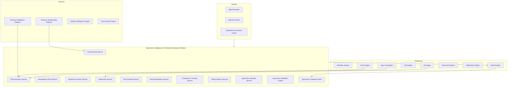
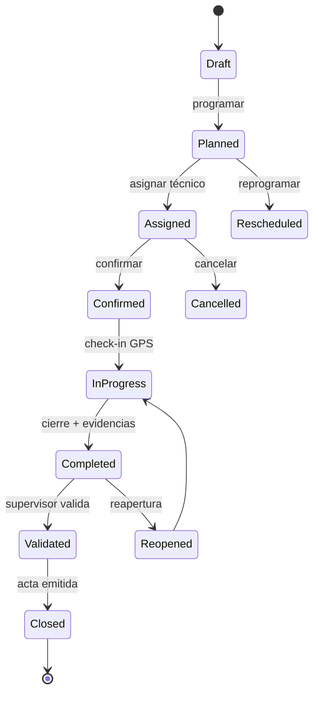

# AGROERP — Agronomic Intelligence & Technical Assistance Platform (AITAP)

**Versión:** 1.0  
**Estado:** Oficial — Especificación de la plataforma de inteligencia agronómica y asistencia técnica  
**Audiencia:** Extensionismo, agronomía, sanidad vegetal, certificación, operaciones, arquitectura, auditoría  
**Naturaleza:** Plataforma empresarial de dominio — **no es un módulo de visitas ni un formulario**

---

## 0. Propósito y autoridad

La **Agronomic Intelligence & Technical Assistance Platform (AITAP)** administra **toda la asistencia técnica agrícola** de AGROERP: planificación y ejecución de visitas, planes de manejo, actividades agrícolas, diagnósticos, plagas y enfermedades, recomendaciones técnicas, captura en campo offline, indicadores agronómicos e inteligencia de soporte. Es el **centro de conocimiento técnico** de la plataforma.

| Pregunta | Documento que responde |
|----------|------------------------|
| ¿Qué procesos de campo y extensión existen? | `COFFEE_DOMAIN.md` (CDP §4.1–4.4, procesos visita) |
| ¿Catálogos visitas y campo? | `MASTER_DATA_ENGINE.md` (`field.*`, `farm.*`, `process.*`) |
| ¿Productor y relación? | `PRODUCER_RELATIONSHIP_MANAGEMENT_PLATFORM.md` (PRM) |
| ¿Territorio y finca/lote? | `FARM_TERRITORY_INTELLIGENCE_PLATFORM.md` (FTIP) |
| ¿Definición de formularios? | `FORM_ENGINE.md` |
| ¿Sync offline? | `SYNC.md`, `ANDROID_FIELD_APP.md` |
| ¿Calidad comercial / laboratorio? | `COFFEE_QUALITY_INTELLIGENCE_ENGINE.md` (CQIE) |
| **¿Cómo se planifica, ejecuta y evalúa la asistencia técnica?** | **Este documento (AITAP)** |

### Jerarquía documental

```
PRODUCER_RELATIONSHIP_MANAGEMENT_PLATFORM.md  → Productor, lifecycle (PRM)
FARM_TERRITORY_INTELLIGENCE_PLATFORM.md       → Finca, lote, GIS (FTIP)
AGRONOMIC_INTELLIGENCE_TECHNICAL_ASSISTANCE_PLATFORM.md → Asistencia técnica (AITAP)
FORM_ENGINE.md                                → Instrumentos de captura
COFFEE_QUALITY_INTELLIGENCE_ENGINE.md         → Calidad comercial/laboratorio (CQIE)
OPERATIONS_COMMAND_CENTER.md                  → Monitoreo cobertura técnica
AEPS.md                                       → Implementación técnica
```

**Regla de oro:** Toda **visita técnica, plan de manejo, actividad agronómica, diagnóstico y recomendación** se registra en AITAP. El PRM **referencia** visitas en la línea de tiempo del productor; el FTIP **recibe** geo de actividades; el Form Engine **captura** datos estructurados — AITAP **orquesta el conocimiento técnico**.

### Distinción crítica

| Sistema | Responsabilidad |
|---------|-----------------|
| **Formulario / Form Engine** | Definición y submission de datos |
| **Módulo visitas CRUD** | Registro aislado sin planes ni seguimiento |
| **AITAP** | Ciclo completo asistencia técnica + inteligencia agronómica |
| **PRM** | Relación productor; timeline consume eventos AITAP |
| **FTIP** | Territorio; recibe actividades georreferenciadas |
| **CQIE** | Dictamen calidad comercial y laboratorio |

### Principios inviolables

| # | Principio | Descripción |
|---|-----------|-------------|
| A1 | **Visit as agronomic session** | Visita = sesión técnica con diagnóstico + recomendaciones |
| A2 | **Plan-driven assistance** | Planes de manejo guían actividades y seguimiento |
| A3 | **Recommendation traceability** | Toda recomendación tiene responsable, plazo y cumplimiento |
| A4 | **Territory-scoped** | Actividades y diagnósticos anclados a FTIP lot/farm |
| A5 | **Offline-first execution** | Visita completa sin red; sync determinista |
| A6 | **Evidence bundle** | Foto, video, audio, GPS, firma — paquete auditable |
| A7 | **Event per transition** | Cada cambio significativo publica evento |
| A8 | **Configurable activities** | Tipos actividad vía catálogo, no código |
| A9 | **Separation field vs lab** | AITAP diagnóstico campo; CQIE dictamen comercial |
| A10 | **Commodity-extensible** | Core abstracto; café = primera implementación |

### Alcance

| Incluye | No incluye |
|---------|------------|
| Planificación y ejecución visitas | UI técnico / mapa |
| Planes de manejo agronómico | Lifecycle productor (PRM) |
| Actividades agrícolas registradas | Polígonos catastrales (FTIP) |
| Diagnósticos fitosanitarios/nutricionales | Catación laboratorio (CQIE) |
| Plagas, enfermedades, seguimiento | Compra en campo (CPE) |
| Recomendaciones y cumplimiento | Definición JSON forms (Form Engine) |
| Indicadores y KPIs agronómicos | |
| IA agronómica (casos de uso) | |

---

## 1. Visión y arquitectura funcional

### 1.1 Visión

AITAP es el **cerebro agronómico** de AGROERP — comparable en espíritu a:

| Referencia | Capacidad análoga |
|------------|-------------------|
| Cropin / FarmERP advisory | Asistencia técnica digital |
| Conservis field intelligence | Actividades y planes |
| FAO Farmer Field School platforms | Extensionismo estructurado |
| IPM (Manejo Integrado Plagas) systems | Diagnóstico + tratamiento + seguimiento |
| Digital agronomy notebooks | Bitácora técnica |
| Precision ag recommendation engines | Planes por zona de manejo |

### 1.2 Arquitectura conceptual



### 1.3 Componentes lógicos

| Componente | Responsabilidad |
|------------|-----------------|
| **Visit Planning Service (VPS)** | Planificación, programación, asignación técnico |
| **Visit Execution Service (VES)** | Ejecución visita, check-in/out, cierre |
| **Management Plan Service (MPS)** | Planes fertilización, fitosanitario, renovación, etc. |
| **Agronomic Activity Service (ACS)** | Registro actividades agrícolas |
| **Diagnostic Service (DGS)** | Diagnósticos cultivo, suelo, infraestructura |
| **Pest Disease Service (PDS)** | Plagas, enfermedades, incidencia, severidad |
| **Recommendation Service (RCS)** | Recomendaciones técnicas y priorización |
| **Compliance Tracking Service (CMP)** | Seguimiento cumplimiento recomendaciones |
| **Field Evidence Service (EVD)** | Fotos, videos, audios, firmas, archivos |
| **Agronomic Indicator Service (IND)** | KPIs agronómicos materializados |
| **Agronomic Validation Engine (VAL)** | GPS, protocolos, elegibilidad visita |
| **Agronomic Projection Store (PRJ)** | Vistas consolidadas finca/lote/técnico |

---

## 2. Gestión de visitas

### 2.1 Tipos de visita

| Tipo | Código | Descripción |
|------|--------|-------------|
| Planificada rutinaria | `scheduled_routine` | Calendario extensión |
| Seguimiento | `follow_up` | Post-recomendación o hallazgo |
| Extraordinaria | `extraordinary` | Urgencia sanitaria, queja, alerta |
| Inicial vinculación | `initial_linking` | Alta productor PRM |
| Auditoría | `audit` | BPA, certificación, interna |
| Pre-cosecha | `pre_harvest` | Estimación, preparación |
| Post-cosecha | `post_harvest` | Evaluación manejo |
| Capacitación | `training` | Grupal en finca |

Catálogo: `field.visit_type` (extensible por org).

### 2.2 Ciclo de vida visita



### 2.3 TechnicalVisit (visita técnica)

| Atributo | Descripción |
|----------|-------------|
| `visitId` | UUID |
| `visitNumber` | Humano |
| `organizationId` | Tenant |
| `visitTypeCode` | `field.visit_type` |
| `visitStatusCode` | `field.visit_status` |
| `visitCategory` | `routine`, `follow_up`, `extraordinary`, `audit` |
| `producerId` | PRM |
| `farmUnitId` | FTIP |
| `lotUnitIds` | Array FTIP — lotes visitados |
| `managementZoneIds` | Opcional FTIP |
| `plannedDate` | |
| `plannedTimeWindow` | |
| `assignedTechnicianId` | |
| `backupTechnicianId` | |
| `objectiveCodes` | `field.visit_objective` |
| `priority` | `low`, `normal`, `high`, `urgent` |
| `parentVisitId` | Seguimiento de visita anterior |
| `followUpOfRecommendationId` | |
| `checkInAt` | |
| `checkInGeo` | Point — obligatorio |
| `checkOutAt` | |
| `checkOutGeo` | |
| `gpsTrackGeo` | LineString recorrido |
| `durationMin` | |
| `offlineCaptured` | bool |
| `externalId` | Sync idempotencia |
| `workflowInstanceId` | |
| `validatedBy` | Supervisor |
| `validatedAt` | |
| `closedAt` | |
| `actDocumentId` | Acta PDF Document Engine |
| `notes` | |

### 2.4 VisitPlan (planificación)

| Atributo | Descripción |
|----------|-------------|
| `planId` | UUID |
| `organizationId` | |
| `planName` | Ej. "Cobertura Q2 2026" |
| `campaignCode` | `trade.campaign` |
| `periodStart` / `periodEnd` | |
| `targetCoveragePct` | % productores a visitar |
| `status` | `draft`, `approved`, `active`, `closed` |
| `createdBy` | |
| `approvedBy` | |

### 2.5 VisitScheduleEntry (programación)

| Atributo | Descripción |
|----------|-------------|
| `scheduleId` | UUID |
| `planId` | Opcional |
| `visitId` | Cuando se materializa |
| `producerId` | |
| `farmUnitId` | |
| `scheduledDate` | |
| `technicianId` | |
| `priority` | |
| `status` | `pending`, `scheduled`, `rescheduled`, `cancelled` |
| `rescheduleReason` | |
| `cancelReason` | |
| `suggestedRouteOrder` | IA opcional |

### 2.6 Operaciones de visita

| Operación | Descripción | Evento |
|-----------|-------------|--------|
| Planificar | Crear en plan o ad-hoc | `VisitPlanned` |
| Programar | Fecha y ventana | `VisitScheduled` |
| Asignar técnico | Cartera / territorio | `TechnicianAssigned` |
| Reprogramar | Nueva fecha + motivo | `VisitRescheduled` |
| Cancelar | Motivo obligatorio | `VisitCancelled` |
| Check-in | GPS en finca | `VisitStarted` |
| Ejecutar | Formularios + diagnósticos | `VisitInProgress` |
| Check-out | Cierre campo | `VisitCheckOut` |
| Validar | Supervisor | `VisitValidated` |
| Cerrar | Acta generada | `VisitClosed` |
| Reabrir | Corrección auditada | `VisitReopened` |

---

## 3. Planes de manejo

### 3.1 ManagementPlan (plan de manejo)

| Atributo | Descripción |
|----------|-------------|
| `planId` | UUID |
| `planNumber` | |
| `organizationId` | |
| `planTypeCode` | Ver §3.2 |
| `planName` | |
| `producerId` | |
| `farmUnitId` | |
| `lotUnitIds` | Alcance |
| `campaignCode` | |
| `validFrom` / `validUntil` | |
| `status` | `draft`, `pending_approval`, `active`, `suspended`, `completed`, `cancelled` |
| `objectives` | Texto / JSON |
| `createdByTechnicianId` | |
| `approvedBy` | |
| `workflowInstanceId` | |
| `sourceVisitId` | Visita origen |
| `version` | |
| `parentPlanId` | Revisión plan anterior |
| `compliancePct` | Proyección |
| `estimatedCostTotal` | |
| `notes` | |

### 3.2 Tipos de plan de manejo

| Tipo | Código | Contenido típico |
|------|--------|------------------|
| Fertilización | `fertilization` | Análisis suelo, dosis, fechas |
| Fitosanitario | `phytosanitary` | IPM, productos, calendario |
| Renovación | `renovation` | Variedad, densidad, cronograma |
| Podas | `pruning` | Tipo poda, frecuencia, lote |
| Manejo sombra | `shade_management` | Raleo, especies, densidad |
| Conservación suelos | `soil_conservation` | Curvas nivel, cobertura, barreras |
| Manejo hídrico | `water_management` | Drenaje, reservorios, riego |
| Cosecha | `harvest` | Ventanas, madurez, logística |
| Personalizado | `custom` | Metadata org |

### 3.3 ManagementPlanLine (línea / actividad planificada)

| Atributo | Descripción |
|----------|-------------|
| `lineId` | UUID |
| `planId` | |
| `lineNumber` | |
| `activityTypeCode` | `agronomic.activity_type` |
| `description` | |
| `lotUnitId` | |
| `scheduledDate` | |
| `scheduledWindow` | |
| `inputs` | JSON — fertilizante, producto, dosis |
| `estimatedCost` | |
| `responsibleParty` | productor, técnico, contratista |
| `status` | `pending`, `scheduled`, `executed`, `skipped`, `overdue` |
| `linkedActivityId` | AgronomicActivity ejecutada |
| `linkedRecommendationId` | |

### 3.4 Reglas de planes

| Regla | Descripción |
|-------|-------------|
| AITAP-PLN-01 | Plan activo requiere aprobación workflow si incluye fitosanitarios restringidos |
| AITAP-PLN-02 | Plan renovación debe alinear con `CropStand` FTIP |
| AITAP-PLN-03 | Modificación plan vigente genera nueva versión |
| AITAP-PLN-04 | Cumplimiento plan = Σ líneas ejecutadas / total |

---

## 4. Actividades agrícolas

### 4.1 AgronomicActivity (actividad agrícola)

| Atributo | Descripción |
|----------|-------------|
| `activityId` | UUID |
| `externalId` | Offline |
| `organizationId` | |
| `activityTypeCode` | Catálogo configurable |
| `activityDate` | Fecha ejecución |
| `producerId` | |
| `farmUnitId` | FTIP |
| `lotUnitId` | FTIP |
| `managementZoneId` | Opcional |
| `visitId` | Si registrada en visita |
| `planLineId` | Si de plan manejo |
| `performedBy` | productor, técnico, cuadrilla |
| `performerIds` | Array |
| `areaHa` | Área tratada |
| `quantity` | JSON — kg fertilizante, L producto, plantas |
| `inputsUsed` | JSON detalle insumos |
| `equipmentUsed` | |
| `weatherConditions` | |
| `gpsGeo` | Point o Polygon aplicación |
| `evidenceBundleId` | |
| `costActual` | |
| `notes` | |
| `recordedBy` | Técnico que registra |
| `recordedAt` | |
| `status` | `recorded`, `verified`, `disputed` |

### 4.2 Catálogo actividades (extensible)

| Categoría | Actividades ejemplo |
|-----------|---------------------|
| Establecimiento | siembra, resiembra, renovación |
| Nutrición | fertilización, correctivos, bioinsumos |
| Sanidad | control malezas, plagas, enfermedades |
| Manejo cultivo | poda, deschuponado, raleo sombra |
| Cosecha | cosecha, recolección |
| Postcosecha | beneficio, secado |
| Conservación | curvas nivel, mulch, terrazas |
| Custom | cualquier `agronomic.activity_type` org |

---

## 5. Diagnósticos

### 5.1 AgronomicDiagnosis (diagnóstico)

| Atributo | Descripción |
|----------|-------------|
| `diagnosisId` | UUID |
| `visitId` | |
| `producerId` | |
| `farmUnitId` | |
| `lotUnitId` | |
| `diagnosisType` | `crop`, `nutritional`, `phytosanitary`, `soil`, `processing`, `infrastructure`, `environmental` |
| `diagnosisCode` | Catálogo |
| `overallScore` | 0–100 o escala org |
| `riskLevel` | `low`, `medium`, `high`, `critical` |
| `phenologicalStageCode` | `farm.phenological_stage` |
| `observations` | Texto |
| `criteriaResults` | JSON checklist |
| `gpsGeo` | |
| `evidenceBundleId` | |
| `performedBy` | |
| `performedAt` | |
| `aiAssisted` | bool |
| `aiConfidence` | Si clasificación imagen |

### 5.2 Dimensiones de diagnóstico

| Dimensión | Indicadores ejemplo café |
|-----------|-------------------------|
| Estado cultivo | vigor, floración, carga fruto |
| Nutricional | deficiencias N, K, Ca; clorosis |
| Fitosanitario | broca, roya, ojo de gallo |
| Suelo | erosión, compactación, materia orgánica |
| Beneficiadero | higiene, aguas residuales |
| Infraestructura | secador, bodega finca |
| Ambiental | buffer, agroquímicos cerca agua |
| Riesgo global | compuesto |

---

## 6. Plagas y enfermedades

### 6.1 PestDiseaseRecord

| Atributo | Descripción |
|----------|-------------|
| `recordId` | UUID |
| `visitId` | |
| `diagnosisId` | |
| `farmUnitId` | |
| `lotUnitId` | |
| `pestDiseaseCode` | Catálogo — broca, roya, etc. |
| `category` | `pest`, `disease`, `weed`, `deficiency` |
| `incidenceLevel` | % plantas/mazorcas afectadas |
| `severityLevel` | `low`, `medium`, `high`, `critical` |
| `affectedAreaHa` | |
| `affectedAreaGeo` | Polygon opcional |
| `sampleCount` | Muestras evaluadas |
| `economicThresholdExceeded` | bool |
| `photoUrls` / `videoUrls` | |
| `gpsGeo` | |
| `recommendedTreatment` | Texto / ref plan fitosanitario |
| `treatmentProductCodes` | |
| `followUpRequired` | |
| `followUpDate` | |
| `followUpVisitId` | |
| `resolutionStatus` | `open`, `treated`, `resolved`, `chronic` |
| `resolutionNotes` | |
| `resolvedAt` | |

### 6.2 Seguimiento IPM

```
Detección → Diagnóstico → Recomendación → Actividad tratamiento
    → Visita seguimiento → Resolución / escalamiento
```

---

## 7. Recomendaciones técnicas

### 7.1 TechnicalRecommendation

| Atributo | Descripción |
|----------|-------------|
| `recommendationId` | UUID |
| `visitId` | Origen |
| `producerId` | |
| `farmUnitId` | |
| `lotUnitId` | |
| `recommendationTypeCode` | `field.recommendation_type` |
| `title` | |
| `description` | |
| `priority` | `low`, `normal`, `high`, `critical` |
| `targetDate` | Fecha objetivo cumplimiento |
| `responsibleParty` | `producer`, `technician`, `both` |
| `responsibleUserId` | |
| `estimatedCost` | |
| `currencyCode` | |
| `status` | `open`, `in_progress`, `completed`, `overdue`, `cancelled`, `not_applicable` |
| `linkedPlanLineId` | |
| `linkedActivityTypeCode` | |
| `issuedBy` | Técnico |
| `issuedAt` | |
| `acknowledgedByProducer` | bool |
| `producerSignatureUrl` | |

### 7.2 RecommendationCompliance (cumplimiento)

| Atributo | Descripción |
|----------|-------------|
| `complianceId` | UUID |
| `recommendationId` | |
| `assessedAt` | |
| `assessedBy` | |
| `complianceStatus` | `full`, `partial`, `none`, `not_verified` |
| `compliancePct` | |
| `evidenceBundleId` | Fotos evidencia cumplimiento |
| `linkedActivityId` | Actividad que cumple |
| `followUpVisitId` | |
| `notes` | |

### 7.3 Generación por visita

Cada visita cerrada puede producir **0..N** recomendaciones con prioridad y seguimiento automático en agenda (`VisitScheduleEntry` tipo follow_up).

---

## 8. Captura en campo y evidencias

### 8.1 FieldEvidenceBundle

| Atributo | Descripción |
|----------|-------------|
| `bundleId` | UUID |
| `entityType` | visit, diagnosis, activity, pest, recommendation |
| `entityId` | |
| `photos` | Array {url, gps, timestamp, photoTypeCode} |
| `videos` | Array |
| `audios` | Array — notas voz |
| `files` | Array adjuntos |
| `signatures` | Array {url, signerRole, gps} |
| `polygons` | Array — área afectada, aplicación |
| `formSubmissionIds` | Form Engine |
| `capturedOffline` | |
| `syncedAt` | |
| `deviceId` | |

### 8.2 Integración Form Engine

| Uso | Descripción |
|-----|-------------|
| Protocolo visita | Formulario por `visitTypeCode` |
| Diagnóstico específico | Formulario anidado |
| Checklist BPA | Auditoría |
| Captura dinámica | Metadata Engine atributos |

AITAP **referencia** `formSubmissionId`; no define schemas (Form Engine).

### 8.3 Requisitos captura (CDP)

| Requisito | Validación AITAP |
|-----------|------------------|
| Check-in GPS en perímetro finca | VAL + GIS + FTIP |
| EXIF/GPS en fotos | EVD |
| Firma productor cierre visita | Workflow según tipo |
| Polígono área afectada | Opcional plagas severas |

---

## 9. Modo offline

### 9.1 Principios (SYNC.md)

| Principio | Implementación AITAP |
|-----------|---------------------|
| **Offline-complete visit** | Visita entera en cola local |
| **externalId** | Idempotencia por dispositivo |
| **Deterministic sync** | Mismo payload = mismo resultado |
| **Conflict resolution** | Estrategia por entidad |

### 9.2 Estrategias de conflicto

| Entidad | Estrategia default | Alternativa |
|---------|-------------------|-------------|
| TechnicalVisit en progreso | `device_wins` | — |
| Visit cerrada en servidor | `server_wins` | Workflow reapertura |
| AgronomicActivity | `merge` si no solapan | |
| Recommendation status | `server_wins` + notificación | |
| Evidence media | `append` | Nunca borrar |

### 9.3 Cola offline Android

```
VisitDraft → CheckIn → Submissions → Diagnoses → Activities
    → Recommendations → Evidence upload → CheckOut → Sync batch
```

Estado sync: `platform.sync_status` — pending, synced, conflict.

---

## 10. Indicadores agronómicos

### 10.1 AgronomicIndicatorSnapshot

| Atributo | Descripción |
|----------|-------------|
| `snapshotId` | UUID |
| `scopeType` | `producer`, `farm`, `lot`, `technician`, `org` |
| `scopeId` | |
| `calculatedAt` | |
| `estimatedProductionKg` | Campaña |
| `actualProductionKg` | CPE + FTIP HarvestRecord |
| `productivityKgHa` | |
| `avgCropAgeYears` | FTIP CropStand |
| `nutritionalIndex` | De diagnósticos |
| `phytosanitaryIndex` | De plagas/enfermedades |
| `recommendationCompliancePct` | |
| `technologyLevelIndex` | Prácticas adoptadas |
| `sustainabilityIndex` | Ambiental + conservación |
| `visitFrequencyDays` | Promedio entre visitas |
| `openRecommendationsCount` | |
| `openPestRecordsCount` | |

### 10.2 Fuentes de cálculo

| Indicador | Fuentes |
|-----------|---------|
| Producción estimada | Diagnóstico + IA + historial |
| Producción real | CPE, FTIP |
| Productividad | kg / ha FTIP |
| Cumplimiento recomendaciones | CMP |
| Nivel tecnológico | Actividades vs plan óptimo |
| Sostenibilidad | Diagnóstico ambiental + FTIP recursos |

---

## 11. Integración Workflow Engine

| Proceso | Pasos | Aprobadores |
|---------|-------|-------------|
| Creación visita extraordinaria | Solicitud → aprobación | Coordinador extensión |
| Asignación técnico fuera zona | Excepción | Supervisor |
| Aprobación plan manejo | Borrador → revisión → activo | Agrónomo jefe |
| Plan fitosanitario restringido | Validación adicional | Sanidad vegetal |
| Validación visita | Campo → supervisor | Supervisor zona |
| Cierre visita | Checklist → acta | Automático + excepción |
| Reapertura visita | Solicitud → autorización | Supervisor |
| Escalamiento plaga crítica | Alerta → plan emergencia | Gerencia técnica |

---

## 12. Eventos de dominio

Namespace: `agronomic.*` + `coffee.agronomic.*`

| Evento | Trigger |
|--------|---------|
| `VisitPlanned` | Planificación |
| `VisitScheduled` | Programación |
| `TechnicianAssigned` | Asignación |
| `VisitRescheduled` | Reprogramación |
| `VisitCancelled` | Cancelación |
| `VisitStarted` | Check-in |
| `VisitCompleted` | Check-out campo |
| `VisitValidated` | Supervisor OK |
| `VisitClosed` | Acta emitida |
| `VisitReopened` | Reapertura |
| `ManagementPlanCreated` | Nuevo plan |
| `ManagementPlanApproved` | Activo |
| `PlanLineOverdue` | Alerta |
| `AgronomicActivityRecorded` | Actividad |
| `DiagnosisRecorded` | Diagnóstico |
| `PestDiseaseDetected` | Plaga/enfermedad |
| `PestDiseaseResolved` | Resolución |
| `RecommendationIssued` | Nueva recomendación |
| `RecommendationOverdue` | Vencida |
| `RecommendationComplied` | Cumplida |
| `AgronomicIndicatorsUpdated` | Snapshot |
| `AgronomicRiskElevated` | IA o umbral |
| `FieldEvidenceSynced` | Offline sync |

---

## 13. Integraciones

| Motor / Plataforma | Dirección | Uso |
|--------------------|-----------|-----|
| **PRM** | Bidireccional | ProducerId, timeline visitas, lifecycle inicial |
| **FTIP** | Bidireccional | Farm/lot, GPS validación, actividades geo |
| **Form Engine** | AITAP consume | Submissions |
| **GIS Engine** | AITAP consume | Geofencing, distancia, polígonos |
| **Sync Foundation** | Bidireccional | Offline Android |
| **Workflow Engine** | Bidireccional | Aprobaciones |
| **Event Engine** | AITAP publica | Proyecciones, OCC |
| **Document Engine** | AITAP consume | Actas, reportes |
| **Notification Engine** | AITAP publica | Recordatorios visita, recomendaciones |
| **Identity Engine** | AITAP consume | Técnicos, permisos `agronomic:*` |
| **CQIE** | CQIE ← AITAP | Alertas sanidad → muestra lab si aplica |
| **CPE** | CPE consume | Visita previa compra (política) |
| **CSAE** | CSAE consume | Cumplimiento BPA contractual |
| **OCC** | OCC consume | Cobertura visitas, backlog |
| **AI Engine** | AI ↔ AITAP | Predicciones, clasificación imagen |
| **FTIP** | AITAP → FTIP | TerritoryVisitLink actualizado |
| **CLSE** | Opcional | Coordinación visita + logística |
| **Audit Engine** | AITAP publica | Trail técnico |

### 13.1 Handoff PRM ↔ AITAP

```
PRM lifecycle → initial_linking visit
  → AITAP TechnicalVisit scheduled
  → ejecución → diagnóstico
  → PRM timeline actualizado vía evento VisitClosed
```

### 13.2 Handoff AITAP ↔ FTIP

```
AITAP VisitStarted (check-in)
  → FTIP TerritoryVisitLink actualizado
  → actividades con lotUnitId + gpsGeo
  → FTIP CropStandHistory si renovación/cosecha
```

### 13.3 Handoff AITAP ↔ CQIE

| AITAP | CQIE |
|-------|------|
| Plaga severa broca | Sugerencia muestra recepción |
| Diagnóstico campo | No reemplaza dictamen comercial |
| Alerta calidad potencial | Evento `QualitySampleSuggested` |

---

## 14. Reportes

| ID | Reporte | Audiencia |
|----|---------|-----------|
| AITAP-RPT-01 | Visitas realizadas periodo | Extensión, gerencia |
| AITAP-RPT-02 | Visitas pendientes / vencidas | Coordinadores |
| AITAP-RPT-03 | Recomendaciones abiertas | Técnicos |
| AITAP-RPT-04 | Cumplimiento recomendaciones | Gerencia |
| AITAP-RPT-05 | Diagnósticos por tipo y riesgo | Sanidad |
| AITAP-RPT-06 | Mapa plagas y enfermedades | OCC, sanidad |
| AITAP-RPT-07 | Infraestructura postcosecha | Extensión |
| AITAP-RPT-08 | Comparativo productividad visitada vs no | IA / gerencia |
| AITAP-RPT-09 | Planes de manejo activos y cumplimiento | Agronomía |
| AITAP-RPT-10 | Cobertura por técnico / zona | RRHH extensión |
| AITAP-RPT-11 | Actividades agrícolas por campaña | Operaciones |
| AITAP-RPT-12 | Actas de visita consolidadas | Auditoría |
| AITAP-RPT-13 | Bitácora finca/lote | Técnico |
| AITAP-RPT-14 | Impacto económico recomendaciones | Finanzas / gerencia |

---

## 15. KPIs

| KPI | Definición |
|-----|------------|
| **Cobertura de visitas** | % productores activos visitados en periodo |
| **Tiempo promedio entre visitas** | Días entre visitas por productor |
| **Cumplimiento de planes** | % líneas plan ejecutadas a tiempo |
| **Reducción plagas** | Δ incidencia periodo vs anterior |
| **Incremento productividad** | Δ kg/ha productores con asistencia |
| **Cumplimiento técnico** | % recomendaciones cumplidas |
| **Impacto económico** | Beneficio estimado vs costo asistencia |
| **Visitas a tiempo** | % dentro ventana programada |
| **Tasa validación supervisor** | % visitas validadas sin devolución |
| **Backlog visitas pendientes** | Count por zona |
| **Índice sanidad cartera** | Promedio phytosanitaryIndex |
| **Adopción nivel tecnológico** | technologyLevelIndex trend |

---

## 16. Alertas configurables

| ID | Alerta |
|----|--------|
| AITAP-ALT-01 | Visita programada en 24h sin confirmación |
| AITAP-ALT-02 | Visita vencida sin ejecutar |
| AITAP-ALT-03 | Recomendación vencida sin cumplimiento |
| AITAP-ALT-04 | Plaga umbral económico superado |
| AITAP-ALT-05 | Productor activo sin visita > N días |
| AITAP-ALT-06 | Plan manejo línea vencida |
| AITAP-ALT-07 | Check-in GPS fuera perímetro finca |
| AITAP-ALT-08 | Visita pendiente validación > N días |
| AITAP-ALT-09 | Conflicto sync offline sin resolver |
| AITAP-ALT-10 | Riesgo agronómico crítico (IA) |
| AITAP-ALT-11 | Seguimiento IPM vencido |
| AITAP-ALT-12 | Certificación BPA en riesgo por diagnóstico |

---

## 17. Inteligencia artificial

| Caso | Entrada | Salida | Principio |
|------|---------|--------|-----------|
| **Predicción plagas** | Clima, historial, fenología | Probabilidad brote | Priorizar visitas |
| **Predicción enfermedades** | Humedad, variedad, incidencia | Riesgo roya | Alerta sanidad |
| **Predicción productividad** | Diagnósticos, edad, manejo | kg/ha estimado | Plan cosecha |
| **Recomendaciones automáticas** | Diagnóstico + protocolos | Draft TechnicalRecommendation | Técnico aprueba |
| **Clasificación fotografías** | Imagen hoja/fruto | pestDiseaseCode + confidence | Asistencia diagnóstico |
| **Generación planes manejo** | Diagnóstico + plantilla | Draft ManagementPlan | Agrónomo aprueba |
| **Priorización visitas** | Riesgo, cobertura, distancia | Ranking schedule | Coordinador asigna |
| **Análisis riesgo agronómico** | Multidimensional | riskLevel compuesto | OCC dashboard |
| **Resumen acta narrativa** | Form submissions | Texto acta | Document Engine |
| **Detección anomalía visita** | Duración, GPS, fotos | Fraude/error alerta | Auditoría |

IA **no cierra visitas ni emite recomendaciones finales** sin técnico humano (salvo política org explícita workflow).

---

## 18. Escalabilidad multi-commodity

| Capa | Café | Cacao / otros |
|------|------|---------------|
| Core AITAP | Visit, plan, activity, diagnosis | Igual |
| Plagas/enfermedades | broca, roya | monilia, escoba bruja |
| Planes manejo | poda, deschuponado | poda cacao |
| Formularios | Protocolo café | Plugin forms |
| Indicadores | kg café/ha | Rendimiento commodity |

```yaml
pluginId: agro.coffee.agronomic_intelligence
commodity: coffee
resourceTypes:
  - coffee.technical_visit
  - coffee.management_plan
  - coffee.agronomic_activity
dependsOn:
  - agro.core.agronomic_intelligence
  - agro.coffee.territory_intelligence
eventNamespace: coffee.agronomic
```

---

## 19. Riesgos

| Categoría | Riesgo | Mitigación |
|-----------|--------|------------|
| Operativo | Visita ficticia sin GPS | Geofencing obligatorio |
| Agronómico | Recomendación incorrecta | Supervisor validación |
| Legal | Fitosanitario sin registro | Workflow productos restringidos |
| Datos | Pérdida evidencia offline | Sync redundante, cola persistente |
| Integración | Duplicar visitas PRM/AITAP | AITAP autoritativo; PRM eventos |
| Calidad | Confundir AITAP con CQIE | Distinción documentada |
| Privacidad | Audio/video productor | Consentimiento, retención DGMP |

---

## 20. Roadmap evolutivo

| Fase | Entregables | Dependencias |
|------|-------------|--------------|
| **F1 — Visitas** | TechnicalVisit, planning, execution, GPS | PRM, FTIP, GIS |
| **F2 — Offline** | Sync visita completa | Sync, Android |
| **F3 — Diagnósticos** | AgronomicDiagnosis, evidence | Form Engine |
| **F4 — Recomendaciones** | RCS, compliance | Workflow |
| **F5 — Planes manejo** | ManagementPlan + lines | F3 |
| **F6 — Actividades** | AgronomicActivity | FTIP |
| **F7 — Plagas** | PestDiseaseRecord, IPM | F3 |
| **F8 — Indicadores** | Snapshots, KPIs | CPE, FTIP |
| **F9 — IA** | Clasificación imagen, priorización | AI Engine |
| **F10 — Integración CQIE** | Alertas sanidad | CQIE |
| **F11 — Multi-commodity** | Plugin cacao | APOS |

---

## 21. Checklist de cumplimiento

- [ ] AITAP única fuente visitas técnicas y planes manejo
- [ ] PRM consume eventos — no duplica ejecución visita
- [ ] Check-in GPS obligatorio contra FTIP
- [ ] Offline completo con externalId
- [ ] Recomendaciones con cumplimiento trazable
- [ ] Distinción AITAP vs CQIE documentada
- [ ] Form Engine para captura — AITAP orquesta
- [ ] Workflow en planes y visitas extraordinarias
- [ ] Eventos agronomic.* en catálogo APOS
- [ ] Permisos `agronomic:*` Identity
- [ ] OCC cobertura y backlog integrado
- [ ] Registro plugin APOS multi-commodity

---

## 22. Conclusión

La **Agronomic Intelligence & Technical Assistance Platform (AITAP)** es el **estándar técnico oficial** de AGROERP. Proporciona:

- **Gestión integral de visitas** — planificación, programación, asignación, reprogramación, cancelación, seguimiento, auditoría, historial
- **8+ tipos de planes de manejo** configurables
- **Actividades agrícolas** extensibles con registro territorial
- **Diagnósticos multidimensionales** con nivel de riesgo
- **Plagas y enfermedades** con IPM y seguimiento
- **Recomendaciones técnicas** con cumplimiento y evidencias
- **Captura campo completa** — foto, video, audio, firma, GPS, polígonos, forms offline
- **10 indicadores agronómicos** materializados
- **23+ eventos** de dominio
- **14 reportes**, **12 KPIs**, **12 alertas**
- **10 casos de IA** agronómica
- **Extensión multi-commodity** vía plugin APOS

**No es un formulario ni un módulo de visitas** — es el **centro de conocimiento técnico** que transforma la extensión rural en inteligencia agronómica accionable.

---

*Documento elaborado para AGROERP — Agronomic Intelligence & Technical Assistance Platform v1.0.*  
*Jerarquía:* `PRM` + `FTIP` → **`AGRONOMIC_INTELLIGENCE_TECHNICAL_ASSISTANCE_PLATFORM.md`** → `CQIE` / operaciones  
*Próximo paso recomendado:* Fase F1 — TechnicalVisit + Visit Planning + integración PRM/FTIP/GIS.
