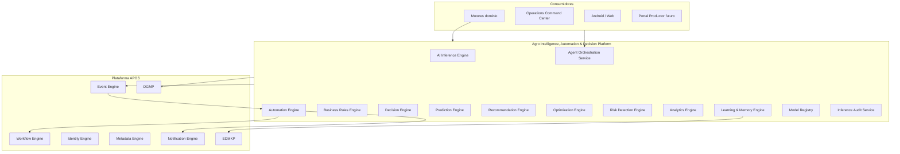

# AGROERP — Agro Intelligence, Automation & Decision Platform (AIADP)

**Versión:** 1.0  
**Estado:** Oficial — Especificación de la plataforma de inteligencia, automatización y decisiones  
**Audiencia:** Arquitectura, producto, operaciones, data science, gerencia, auditoría, compliance  
**Naturaleza:** Plataforma transversal del OS — **no es un módulo de IA ni un chatbot aislado**

---

## 0. Propósito y autoridad

La **Agro Intelligence, Automation & Decision Platform (AIADP)** es el **cerebro inteligente oficial de AGROERP**: automatiza procesos, analiza datos, aprende del historial empresarial, ejecuta reglas y decisiones, genera predicciones y recomendaciones, detecta riesgos, optimiza operaciones y asiste a usuarios mediante agentes especializados. Toda la plataforma **se apoya en AIADP** para decisiones asistidas y automatización configurable.

| Pregunta | Documento que responde |
|----------|------------------------|
| ¿Orquestación eventos? | Event Engine (APOS) |
| ¿Procesos con aprobación humana? | `WORKFLOW_ENGINE.md` |
| ¿Validación de datos? | `DATA_GOVERNANCE_PLATFORM.md` (DVE) |
| ¿Políticas IA, auditoría inferencias, compliance? | `GOVERNANCE_ENTERPRISE_CONTROL_LAYER.md` (GECL) |
| ¿Feature Store y datasets ML? | `DATA_PLATFORM_ANALYTICS_LAYER.md` (DPAL) |
| ¿Casos IA por motor dominio? | Specs CPE, AITAP, CSFE… (consumen AIADP) |
| **¿Cómo se automatiza, predice, decide y asiste globalmente?** | **Este documento (AIADP)** |

### Jerarquía documental

```
APOS.md                                          → OS, registros, eventos
DATA_GOVERNANCE_PLATFORM.md                      → Calidad dato, DVE, lineage
DATA_PLATFORM_ANALYTICS_LAYER.md                   → Feature Store, datasets ML (DPAL)
AGRO_INTELLIGENCE_AUTOMATION_DECISION_PLATFORM.md → Cerebro IA + automatización (AIADP)
GOVERNANCE_ENTERPRISE_CONTROL_LAYER.md           → AI governance, auditoría, compliance (GECL)
ENTERPRISE_DOCUMENT_MEDIA_KNOWLEDGE_PLATFORM.md  → Memoria documental (EDMKP)
Motores de dominio (PRM, CPE, CSFE, AITAP…)      → Consumen capacidades AIADP
AEPS.md                                          → Implementación técnica
```

**Regla de oro:** Ninguna **decisión automática de impacto financiero, legal o de bloqueo operativo** se ejecuta sin **regla publicada**, **auditoría de inferencia** y **política de gobernanza** (humano-en-el-loop o workflow según umbral). AIADP **propone y automatiza lo permitido**; Workflow Engine **aprueba lo crítico**.

### Distinción crítica

| Sistema | Responsabilidad |
|---------|-----------------|
| **Chatbot genérico** | Conversación sin contexto negocio |
| **ML notebook / modelo suelto** | Inferencia sin gobierno |
| **Workflow Engine** | Procesos humanos, tareas, aprobaciones |
| **DVE (DGMP)** | Validación integridad dato |
| **AIADP** | IA + automatización + reglas negocio + decisiones + predicciones + agentes |
| **Motores dominio** | Ejecutan negocio; invocan AIADP |

### Principios inviolables

| # | Principio | Descripción |
|---|-----------|-------------|
| I1 | **Platform brain, not silo** | Capacidades centralizadas; motores consumen APIs/eventos |
| I2 | **Event-driven automation** | Automatizaciones disparadas por Event Engine |
| I3 | **Auditable inference** | Toda IA/regla/decisión → `InferenceAuditLog` |
| I4 | **Human-in-the-loop default** | Auto-ejecución solo con política explícita |
| I5 | **Rules before black box** | Reglas determinísticas preferidas cuando suficientes |
| I6 | **Certified data for ML** | Solo datos `certified` DGMP para entrenamiento |
| I7 | **Agent context isolation** | Agente solo ve permisos Identity del rol |
| I8 | **Model registry** | Modelos versionados, desplegables sin cambiar arquitectura |
| I9 | **Fallback deterministic** | Si modelo falla → regla o degradación segura |
| I10 | **Commodity-extensible** | Core agnóstico; café = primer conjunto modelos/reglas |

### Alcance

| Incluye | No incluye |
|---------|------------|
| 10 motores lógicos (IA, automatización, reglas…) | UI chat / dashboards |
| Agentes especializados por rol | Ejecución compra/pago (CPE/CSFE) |
| Automatizaciones no-code IF-THEN | Definición BPMN (Workflow) |
| Modelos predictivos y registry | Entrenamiento infra MLOps detalle |
| Memoria empresarial (RAG) | Almacenamiento docs (EDMKP) |
| Asistentes generativos | |
| Detección riesgos y anomalías | |

---

## 1. Visión y arquitectura funcional

### 1.1 Visión

AIADP es el **sistema cognitivo y autónomo controlado** de AGROERP — comparable en espíritu a:

| Referencia | Capacidad análoga |
|------------|-------------------|
| IBM ODM + Watson | Decision management + IA |
| Salesforce Einstein + Flow | Predicción + automatización |
| Microsoft Power Platform + Copilot | Low-code automation + asistente |
| Camunda + DMN | Decisiones + procesos |
| Palantir Foundry | Análisis + decisiones operativas |
| Agribusiness decision support | Recomendaciones campo y comercial |

### 1.2 Arquitectura conceptual



### 1.3 Los diez motores lógicos

| Motor | Sigla | Responsabilidad |
|-------|-------|-----------------|
| **AI Inference Engine** | AIE | LLM, visión, NLP, embeddings |
| **Automation Engine** | AUE | IF-THEN event-driven sin código |
| **Business Rules Engine** | BRE | Reglas negocio determinísticas |
| **Decision Engine** | DME | Tablas decisión DMN-style |
| **Prediction Engine** | PRE | Modelos ML forecasting |
| **Recommendation Engine** | REC | Sugerencias accionables |
| **Optimization Engine** | OPT | OR, rutas, asignaciones |
| **Risk Detection Engine** | RSK | Riesgo, fraude, anomalías |
| **Analytics Engine** | ANA | Tendencias, segmentación, comparativos |
| **Learning & Memory Engine** | LRN | Memoria empresarial, RAG, feedback |

---

## 2. Agentes especializados

### 2.1 IntelligenceAgent (agente)

| Atributo | Descripción |
|----------|-------------|
| `agentId` | UUID |
| `agentCode` | Catálogo |
| `agentName` | |
| `agentType` | Ver §2.2 |
| `organizationId` | |
| `description` | |
| `systemPromptTemplate` | Instrucciones base |
| `allowedTools` | APIs/motores invocables |
| `allowedRoles` | Identity roles |
| `dataScope` | `own`, `zone`, `org` |
| `knowledgeBaseRefs` | EDMKP collections |
| `modelProfileId` | LLM/ML default |
| `maxAutoActions` | Límite automatización |
| `status` | `active`, `disabled` |
| `version` | |

### 2.2 Catálogo de agentes

| Agente | Código | Contexto principal | Capacidades |
|--------|--------|-------------------|-------------|
| **Agrónomo** | `agent.agronomist` | AITAP, FTIP | Visitas, diagnósticos, planes |
| **Comprador** | `agent.buyer` | CPE, CSAE, PRM | Compras, cupos, precios |
| **Supervisor** | `agent.supervisor` | OCC, todos | Aprobaciones, excepciones |
| **Gerente** | `agent.manager` | KPIs agregados | Decisiones estratégicas |
| **Bodega** | `agent.warehouse` | CITE | Stock, despachos, mermas |
| **Calidad** | `agent.quality` | CQIE | Dictámenes, NC, laboratorio |
| **Finanzas** | `agent.finance` | CSFE | Pagos, liquidez, cartera |
| **Logística** | `agent.logistics` | CLSE | Rutas, flota, entregas |
| **Auditor** | `agent.auditor` | Audit trail | Compliance, hallazgos |
| **Administrador** | `agent.admin` | Config org | Parámetros, usuarios |
| **Productor** | `agent.producer` | Portal futuro | Consultas propias limitadas |

### 2.3 AgentSession

| Atributo | Descripción |
|----------|-------------|
| `sessionId` | UUID |
| `agentId` | |
| `userId` | |
| `startedAt` | |
| `contextEntityType` | producer, farm, purchase… |
| `contextEntityId` | |
| `messages` | Historial conversación |
| `actionsTaken` | Automatizaciones sugeridas/ejecutadas |
| `auditLogIds` | |

**Invariante:** Agente respeta PBAC Identity — no eleva permisos.

---

## 3. Motor de automatización

### 3.1 AutomationDefinition (automatización no-code)

| Atributo | Descripción |
|----------|-------------|
| `automationId` | UUID |
| `automationCode` | |
| `organizationId` | |
| `name` | |
| `description` | |
| `status` | `draft`, `active`, `paused`, `archived` |
| `triggerType` | `event`, `schedule`, `threshold`, `manual` |
| `triggerConfig` | JSON — eventType, cron, condición |
| `conditions` | JSON array — IF clauses |
| `actions` | JSON array — THEN clauses |
| `priority` | |
| `effectiveFrom` / `until` | |
| `createdBy` | |
| `version` | |
| `requiresApproval` | bool — acciones críticas |

### 3.2 Ejemplo automatización

```yaml
automationCode: contract_quota_95_alert
trigger:
  type: event
  eventType: coffee.agreement.quotaConsumed
conditions:
  - field: quotaUtilizationPct
    op: gte
    value: 95
actions:
  - type: notify
    target: assignedBuyer
    template: quota_near_limit
  - type: create_task
    workflow: review_contract_renewal
    assignee: supervisor
  - type: update_dashboard
    widget: commercial_alerts
  - type: publish_event
    eventType: intelligence.automationExecuted
```

### 3.3 Tipos de acción

| Acción | Descripción |
|--------|-------------|
| `notify` | Notification Engine |
| `create_task` | Workflow Engine instancia |
| `start_workflow` | Workflow |
| `publish_event` | Event Engine |
| `update_projection` | OCC / PRJ |
| `assign_resource` | Técnico, comprador, vehículo |
| `create_recommendation` | REC |
| `call_webhook` | Integration Catalog |
| `set_flag` | Metadata en entidad |
| `escalate` | Supervisor chain |

### 3.4 AutomationExecution

| Atributo | Descripción |
|----------|-------------|
| `executionId` | UUID |
| `automationId` | |
| `triggeredAt` | |
| `triggerPayload` | Event snapshot |
| `conditionsMet` | bool |
| `actionsExecuted` | JSON resultado |
| `status` | `success`, `partial`, `failed`, `skipped` |
| `durationMs` | |
| `errorMessage` | |

---

## 4. Motor de reglas y decisiones

### 4.1 BusinessRule (regla negocio — BRE)

Distinto de **DVE** (validación dato). Reglas operativas y comerciales.

| Atributo | Descripción |
|----------|-------------|
| `ruleId` | UUID |
| `ruleCode` | |
| `organizationId` | |
| `domain` | `procurement`, `finance`, `logistics`, `agronomic` |
| `name` | |
| `conditionExpression` | JSON / DSL |
| `actionExpression` | JSON |
| `priority` | Mayor primero |
| `effectiveFrom` / `until` | |
| `status` | `draft`, `active`, `retired` |
| `version` | |

### 4.2 DecisionTable (motor decisiones — DME)

Estilo DMN para decisiones tabulares.

| Atributo | Descripción |
|----------|-------------|
| `decisionId` | UUID |
| `decisionCode` | |
| `inputs` | Schema inputs |
| `outputs` | Schema outputs |
| `rules` | Array {conditions, output} |
| `hitPolicy` | `unique`, `first`, `collect` |
| `version` | |

### 4.3 Ejemplo decisión

```
Decisión: elegibilidad_prima_organico
Inputs: certificationStatus, deliveryKg, qualityScore
Output: premiumPct

IF cert=active AND quality>=84 AND kg>=500 → premiumPct=5
IF cert=active AND quality>=80 → premiumPct=3
ELSE → premiumPct=0
```

Integración: CSAE, CSFE SettlementRule invocan DME/BRE vía AIADP.

---

## 5. Motor de predicciones

### 5.1 PredictionModel (model registry)

| Atributo | Descripción |
|----------|-------------|
| `modelId` | UUID |
| `modelCode` | |
| `modelName` | |
| `modelType` | `regression`, `classification`, `time_series`, `survival`, `llm` |
| `domain` | production, quality, finance, logistics, disease |
| `commodityCode` | coffee, general |
| `version` | semver |
| `trainingDataRef` | Lineage DGMP |
| `features` | Schema |
| `metrics` | accuracy, MAPE, F1… |
| `status` | `training`, `staging`, `production`, `retired` |
| `deployedAt` | |
| `fallbackRuleId` | Si inferencia falla |

### 5.2 PredictionJob / PredictionResult

| Campo | Descripción |
|-------|-------------|
| `jobId` | Batch o realtime |
| `modelId` | |
| `scopeType` | producer, farm, lot, org |
| `scopeId` | |
| `predictedAt` | |
| `horizon` | 30d, 90d, campaign |
| `prediction` | JSON valor(es) |
| `confidence` | 0–1 |
| `explanation` | SHAP / factores (opcional) |
| `modelVersion` | |

### 5.3 Modelos predictivos soportados

| Modelo | Entrada típica | Salida | Consumidor |
|--------|----------------|--------|------------|
| Producción | FTIP, AITAP, histórico | kg campaña | PRM, CSAE |
| Calidad | CQIE, variedad, manejo | score esperado | CQIE, CSFE |
| Cosecha | fenología, clima futuro | fecha ventana | AITAP, CLSE |
| Incumplimiento | CSAE, entregas | probabilidad | CSAE, OCC |
| Financiero | CSFE, cartera | flujo caja, mora | CSFE, OCC |
| Logístico | CLSE, demanda | retraso, costo | CLSE |
| Enfermedad | clima, incidencia | riesgo brote | AITAP |
| Climático | API externa futura | precipitación, estrés | AITAP, FTIP |

---

## 6. Motor de recomendaciones y optimización

### 6.1 Recommendation

| Atributo | Descripción |
|----------|-------------|
| `recommendationId` | UUID |
| `recommendationType` | visit_priority, purchase_timing, payment_schedule, route, audit_target… |
| `targetEntityType` | |
| `targetEntityId` | |
| `title` | |
| `description` | |
| `priority` | |
| `confidence` | |
| `source` | `rule`, `ml`, `llm`, `optimization` |
| `suggestedActions` | JSON |
| `status` | `pending`, `accepted`, `rejected`, `expired`, `auto_applied` |
| `assignedToUserId` | |
| `expiresAt` | |
| `feedbackScore` | Aprendizaje |

### 6.2 OptimizationRequest / Result

| Tipo | Ejemplo |
|------|---------|
| **Rutas visita** | OR sobre fincas, tiempo, prioridad AITAP |
| **Rutas logísticas** | CLSE vehículos, paradas |
| **Asignación técnico** | Territorio + carga |
| **Calendario pagos** | CSFE liquidez + SLA |
| **Inventario** | CITE rebalanceo bodegas |

| Atributo | Descripción |
|----------|-------------|
| `optimizationId` | |
| `problemType` | `route`, `assignment`, `schedule` |
| `constraints` | JSON |
| `objective` | min_cost, max_coverage |
| `solution` | JSON |
| `improvementPct` | vs baseline |

---

## 7. Motor de detección de riesgos y análisis

### 7.1 RiskAssessment

| Atributo | Descripción |
|----------|-------------|
| `assessmentId` | UUID |
| `riskType` | financial, compliance, fraud, agronomic, logistics, quality |
| `scopeType` | producer, purchase, shipment, org |
| `scopeId` | |
| `riskLevel` | low, medium, high, critical |
| `riskScore` | 0–100 |
| `factors` | JSON explicativo |
| `detectedAt` | |
| `source` | rules, ml, anomaly |
| `status` | open, mitigated, accepted |
| `recommendedActions` | |

### 7.2 AnomalyDetection

| Atributo | Descripción |
|----------|-------------|
| `anomalyId` | UUID |
| `anomalyType` | purchase_pattern, weight_variance, gps, payment |
| `entityType` | |
| `entityId` | |
| `severity` | |
| `detectedAt` | |
| `baseline` | JSON |
| `observed` | JSON |
| `status` | |

### 7.3 Analytics Engine — capacidades

| Análisis | Descripción |
|----------|-------------|
| **Segmentación automática** | Clustering productores/fincas |
| **Tendencias** | Series temporales KPIs |
| **Anomalías** | Desviación estadística |
| **Comparativos históricos** | Campaña vs campaña |
| **Geoespacial** | GIS + densidad eventos |
| **Comportamiento** | Patrones compra, visita |
| **Financiero** | Cartera, concentración |

---

## 8. Decisiones automáticas permitidas

| Decisión | Motor | Auto-ejecución | Humano requerido si |
|----------|-------|----------------|---------------------|
| Asignación técnico visita | OPT + AUE | Sí configurable | Sobrecarga / fuera zona |
| Priorización visitas | REC + PRE | Sugerencia | Siempre aprobación agenda |
| Detección incumplimiento | RSK + BRE | Alerta | Bloqueo compra → workflow |
| Detección fraude | RSK + AIE | Alerta | Siempre investigación |
| Recomendación compra | REC | Sugerencia | Confirmación comprador |
| Recomendación rutas | OPT | Sugerencia | Conductor aprueba |
| Recomendación pagos | REC + PRE | Sugerencia | Tesorería aprueba |
| Recomendación auditorías | RSK | Tarea workflow | Auditor asigna |
| Priorización riesgos | RSK | Dashboard OCC | — |

---

## 9. Asistentes e IA generativa

### 9.1 AssistantCapability (por dominio)

| Asistente | Dominio | Ejemplos |
|-----------|---------|----------|
| Compras | CPE, CSAE | "¿Cupos disponibles García?" |
| Inventario | CITE | "Stock oro zona norte" |
| Calidad | CQIE | "Dictámenes pendientes hoy" |
| Visitas | AITAP | "Resumir última visita finca X" |
| Reportes | Reporting | "Generar informe compras mes" |
| Configuración | Admin | "Política humedad actual" |
| Administración | Identity | "Usuarios zona sur" |

### 9.2 IA generativa (AIE)

| Caso | Entrada | Salida |
|------|---------|--------|
| Resumir visita | Form submissions + notas | Narrativa acta |
| Generar recomendaciones | Diagnóstico | Draft TechnicalRecommendation |
| Generar reportes | Query + datos | Narrativa + gráficos ref |
| Responder preguntas | RAG memoria | Respuesta citada |
| Analizar fotografías | Imagen | Clasificación plaga/calidad |
| Analizar documentos | PDF EDMKP | Extracción campos |
| Explicar indicadores | KPI + contexto | Explicación natural language |

### 9.3 Guardrails generativa

| Guardrail | Descripción |
|-----------|-------------|
| AIADP-GEN-01 | No ejecutar pagos sin workflow |
| AIADP-GEN-02 | Citar fuentes EDMKP/KB en respuestas |
| AIADP-GEN-03 | PII masking según rol |
| AIADP-GEN-04 | Token limits y cost tracking por org |

---

## 10. Memoria empresarial (Learning & Memory Engine)

### 10.1 EnterpriseMemoryEntry

| Atributo | Descripción |
|----------|-------------|
| `memoryId` | UUID |
| `memoryType` | `document_chunk`, `protocol`, `rule`, `case`, `lesson`, `conversation` |
| `sourceType` | edmkp, aitap, automation, user_feedback |
| `sourceId` | |
| `content` | Texto indexado |
| `embeddingRef` | Vector store |
| `metadata` | tags, commodity, domain |
| `trustLevel` | `official`, `operational`, `inferred` |
| `indexedAt` | |

### 10.2 Fuentes de aprendizaje

| Fuente | Uso |
|--------|-----|
| Historial operacional | Event projections |
| Documentos EDMKP | RAG asistentes |
| Protocolos KB | Respuestas agrónomo |
| Reglas BRE/DME | Explicabilidad |
| Procesos Workflow | Patrones aprobación |
| Casos anteriores | Similar case retrieval |
| Buenas prácticas | Artículos KB |
| Feedback usuario | Fine-tuning recomendaciones |

### 10.3 FeedbackLoop

| Atributo | Descripción |
|----------|-------------|
| `feedbackId` | |
| `inferenceId` | |
| `userId` | |
| `rating` | thumbs / 1-5 |
| `correction` | Texto opcional |
| `usedForRetraining` | bool |

---

## 11. Auditoría de inferencia

### 11.1 InferenceAuditLog

| Atributo | Descripción |
|----------|-------------|
| `auditId` | UUID |
| `inferenceType` | `ml`, `llm`, `rule`, `decision`, `automation` |
| `engineCode` | AIE, BRE, PRE… |
| `modelId` / `ruleId` / `automationId` | |
| `inputSnapshot` | Hash + ref |
| `outputSnapshot` | |
| `confidence` | |
| `latencyMs` | |
| `userId` | Si asistido |
| `agentId` | |
| `occurredAt` | |
| `costUnits` | Tokens / compute |
| `approvedBy` | Si auto→human |

**Invariante:** Toda salida AIADP que afecte decisión operativa genera audit log.

---

## 12. Integración plataforma

| Componente | Relación AIADP |
|------------|----------------|
| **Event Engine** | Trigger automatizaciones; publica `InferenceCompleted` |
| **Workflow Engine** | Acciones automatización; aprobación decisiones críticas |
| **Identity Engine** | Scope agentes; permisos `intelligence:*` |
| **Metadata Engine** | Schemas automatizaciones y reglas |
| **Notification Engine** | Acciones notify |
| **DGMP** | Datos certified; lineage modelos |
| **EDMKP** | RAG documentos; OCR text |
| **OCC** | Consume riesgos, predicciones, automatizaciones |
| **Reporting Engine** | Reportes IA usage |

### 12.1 Integración motores dominio

| Motor | Capacidades AIADP consumidas |
|-------|------------------------------|
| **PRM** | Segmentación, churn, valor productor |
| **FTIP** | Teledetección, productividad espacial |
| **AITAP** | Plagas, visitas, planes manejo IA |
| **CPE** | Fraude, anomalías compra |
| **CSAE** | Incumplimiento, cupos |
| **CQIE** | Predicción calidad |
| **CITE** | Demanda, mermas anómalas |
| **CSFE** | Flujo caja, mora, pagos |
| **CLSE** | Rutas, retrasos |
| **EDMKP** | Clasificación, OCR, resumen |

Patrón: motor publica evento → AIADP evalúa reglas/automatizaciones → recomendación/evento/workflow.

---

## 13. Gobernanza y seguridad

| Política | Descripción |
|----------|-------------|
| Feature flags por org | IA opcional por tenant |
| Model approval | staging → production workflow |
| Bias monitoring | DGMP quality dimensions |
| Data residency | Modelos por región si aplica |
| Producer agent | Solo datos propios |
| Rate limits | Por org y agente |

---

## 14. Eventos de dominio

Namespace: `intelligence.*`

| Evento | Trigger |
|--------|---------|
| `AutomationTriggered` | Trigger recibido |
| `AutomationExecuted` | Acciones completadas |
| `RuleEvaluated` | BRE |
| `DecisionResolved` | DME |
| `PredictionGenerated` | PRE |
| `RecommendationCreated` | REC |
| `RecommendationAccepted` | Usuario |
| `OptimizationCompleted` | OPT |
| `RiskDetected` | RSK |
| `AnomalyDetected` | ANA |
| `InferenceCompleted` | Cualquier motor |
| `AgentSessionStarted` | Asistente |
| `ModelDeployed` | MREG |
| `FeedbackReceived` | LRN |

---

## 15. Reportes

| ID | Reporte |
|----|---------|
| AIADP-RPT-01 | Recomendaciones generadas periodo |
| AIADP-RPT-02 | Automatizaciones ejecutadas |
| AIADP-RPT-03 | Predicciones por modelo |
| AIADP-RPT-04 | Precisión modelos (MAPE, F1) |
| AIADP-RPT-05 | Uso IA por org/rol |
| AIADP-RPT-06 | Impacto económico estimado |
| AIADP-RPT-07 | Riesgos detectados y mitigados |
| AIADP-RPT-08 | Anomalías y fraude |
| AIADP-RPT-09 | Tiempo ahorrado automatización |
| AIADP-RPT-10 | Auditoría inferencias muestra |

---

## 16. KPIs

| KPI | Definición |
|-----|------------|
| **Automatizaciones exitosas** | % ejecuciones success |
| **Tiempo ahorrado** | Horas estimadas vs manual |
| **Predicciones acertadas** | % dentro margen error |
| **Procesos optimizados** | Count OPT con mejora >0 |
| **Reducción errores** | Δ incidencias post-AIADP |
| **Adopción recomendaciones** | % accepted |
| **Cobertura modelos** | Dominios con modelo production |
| **Latencia inferencia P95** | ms |
| **Costo IA por org** | tokens/compute |
| **ROI estimado** | Beneficio / costo plataforma |

---

## 17. Alertas configurables

| ID | Alerta |
|----|--------|
| AIADP-ALT-01 | Modelo precisión bajo umbral |
| AIADP-ALT-02 | Automatización fallida N veces |
| AIADP-ALT-03 | Riesgo crítico detectado |
| AIADP-ALT-04 | Anomalía fraude compra |
| AIADP-ALT-05 | Predicción incumplimiento alta |
| AIADP-ALT-06 | Agente acción bloqueada permisos |
| AIADP-ALT-07 | Costo IA org > presupuesto |
| AIADP-ALT-08 | Modelo sin retrain > N días |
| AIADP-ALT-09 | Feedback negativo recurrente |
| AIADP-ALT-10 | Fallback regla activado frecuente |

---

## 18. Escalabilidad de modelos

### 18.1 Model Registry — plug-in sin cambiar arquitectura

```yaml
modelPlugin:
  modelCode: coffee.production.forecast_v2
  framework: sklearn | pytorch | onnx | external_api
  inputSchema: agro.prediction.production_input
  outputSchema: agro.prediction.production_output
  deploymentTarget: realtime | batch
  eventOnComplete: intelligence.predictionGenerated
```

Nuevos modelos: registrar en MREG → desplegar → enrutar PRE sin cambio motores dominio.

### 18.2 Estrategias escala

| Estrategia | Uso |
|------------|-----|
| Batch nocturno | Predicciones masivas campaña |
| Realtime API | Fraude, scoring compra |
| Edge (futuro) | Clasificación imagen offline |
| Model ensemble | Combinar reglas + ML |

---

## 19. Riesgos

| Categoría | Riesgo | Mitigación |
|-----------|--------|------------|
| Operativo | Auto-decisión incorrecta | Human-in-the-loop, umbrales |
| Legal | IA en contratos/pagos | Workflow obligatorio |
| Sesgo | Modelo discrimina | DGMP bias monitoring |
| Seguridad | Agente filtra datos | PBAC estricto |
| Reputación | Alucinación LLM | RAG + citas + guardrails |
| Técnico | Model drift | Retrain schedule, métricas |
| Dependencia | Vendor LLM lock-in | Abstracción AIE multi-provider |

---

## 20. Roadmap evolutivo

| Fase | Entregables | Dependencias |
|------|-------------|--------------|
| **F1 — Reglas y automatización** | BRE, AUE, event triggers | Event Engine |
| **F2 — Decisiones** | DME tablas | Metadata |
| **F3 — Auditoría** | InferenceAuditLog | Audit |
| **F4 — Predicciones** | MREG, PRE batch | DGMP |
| **F5 — Recomendaciones** | REC | Motores dominio |
| **F6 — Optimización** | OPT rutas | GIS, CLSE, AITAP |
| **F7 — Riesgos** | RSK, anomalías | OCC |
| **F8 — Agentes** | AGT agrónomo, comprador | Identity, EDMKP |
| **F9 — Generativa** | AIE RAG, resúmenes | EDMKP, LRN |
| **F10 — Memoria** | LRN feedback loops | |
| **F11 — Multi-commodity** | Modelos cacao | APOS plugins |

---

## 21. Checklist de cumplimiento

- [ ] AIADP registrado en APOS Service Registry
- [ ] Automatizaciones vía Event Engine — no polling ad-hoc
- [ ] Toda inferencia auditada
- [ ] Distinción BRE vs DVE (DGMP) documentada
- [ ] Distinción AIADP vs Workflow documentada
- [ ] Agentes respetan Identity PBAC
- [ ] Modelos en registry versionados
- [ ] Fallback determinístico configurado
- [ ] Eventos intelligence.* en catálogo APOS
- [ ] Permisos `intelligence:*` Identity
- [ ] Feature flags por org
- [ ] Motores dominio migran casos IA a AIADP

---

## 22. Conclusión

La **Agro Intelligence, Automation & Decision Platform (AIADP)** es el **cerebro oficial de AGROERP**. Proporciona:

- **10 motores lógicos** — IA, automatización, reglas, decisiones, predicciones, recomendaciones, optimización, riesgos, análisis, aprendizaje
- **11 agentes especializados** con contexto y permisos propios
- **Automatizaciones no-code** event-driven configurables
- **9+ tipos decisiones automáticas** gobernadas
- **8+ modelos predictivos** extensibles vía registry
- **7 análisis avanzados** — segmentación, tendencias, anomalías, geo, comportamiento
- **7 asistentes** de dominio + **7 casos IA generativa**
- **Memoria empresarial** — historial, documentos, protocolos, casos, feedback
- **10 reportes**, **10 KPIs**, **10 alertas**
- **Escalabilidad** de modelos sin cambiar arquitectura

**No es solo IA** — es la **plataforma unificada de inteligencia, automatización y decisiones** que convierte AGROERP en un sistema que aprende, anticipa y actúa con gobierno empresarial.

---

*Documento elaborado para AGROERP — Agro Intelligence, Automation & Decision Platform v1.0.*  
*Nota:* Reemplaza/centraliza el roadmap **AI Engine** y **Automation rules engine** de APOS como especificación autoritativa.  
*Próximo paso recomendado:* Fase F1 — Automation Engine + Business Rules Engine + integración Event Engine.
