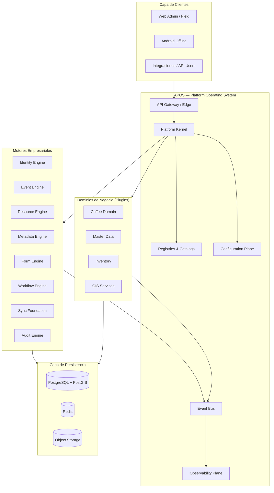
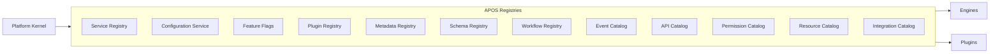
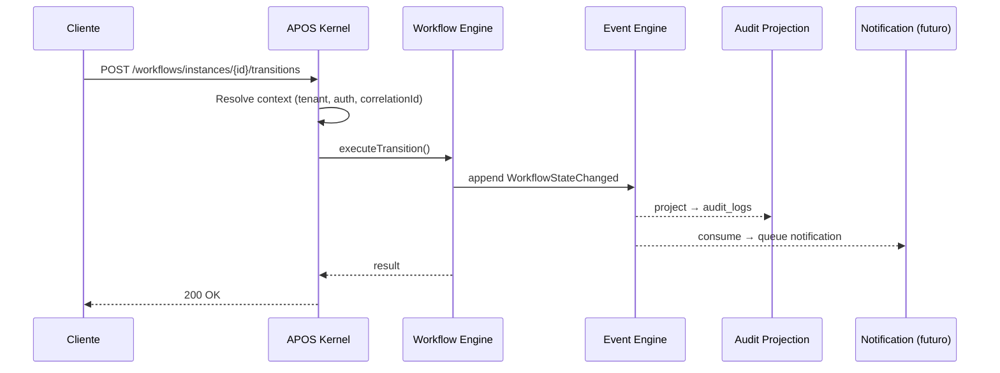
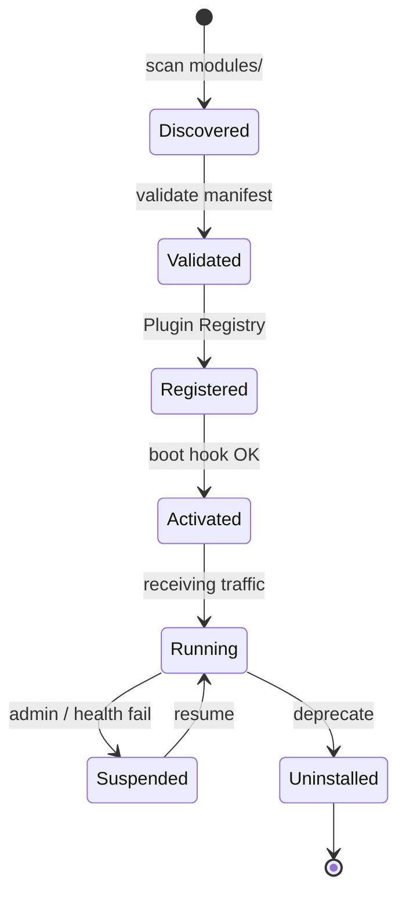
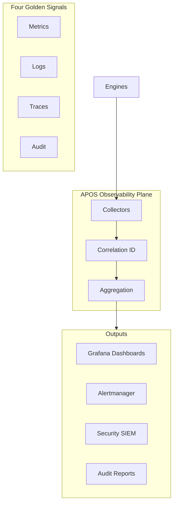
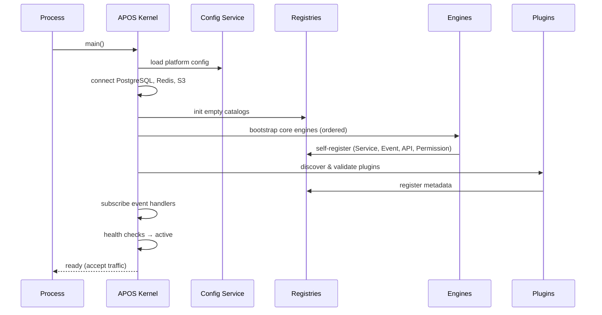
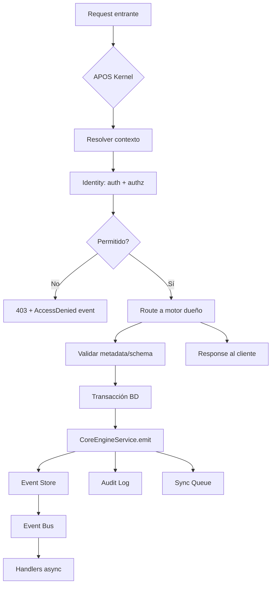
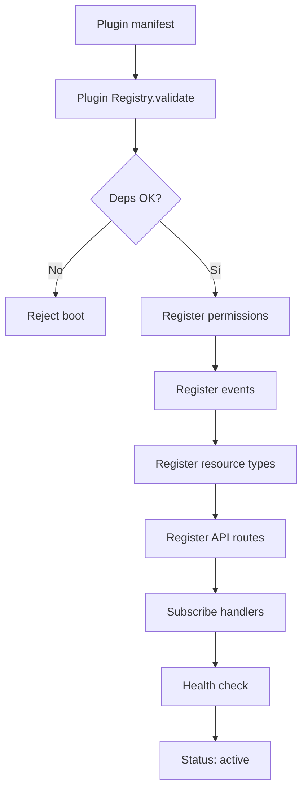
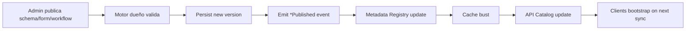

# AGROERP Platform Operating System (APOS)

**Versión:** 1.0  
**Estado:** Oficial — Constitución de orquestación de plataforma  
**Audiencia:** Arquitectos, tech leads, SRE, desarrolladores, integradores, sistemas de IA  
**Naturaleza:** Sistema operativo interno de AGROERP — **no es un módulo, servicio ni microservicio**

---

## 0. Propósito y autoridad

APOS es la **capa de orquestación** que coordina todos los motores empresariales, dominios de negocio, clientes (Web, Android, integraciones) y capacidades transversales de AGROERP.

Si AEPS responde *«cómo se construye cada pieza»*, APOS responde *«cómo viven, se descubren, se comunican, se configuran, se observan y evolucionan todas las piezas juntas»*.

### Jerarquía documental

```
┌─────────────────────────────────────────────────────────────┐
│  APOS.md                        → Orquestación, registries    │
│  AEPS.md                        → Estándares implementación   │
│  COFFEE_DOMAIN.md               → Dominio negocio cafetero    │
│  OPERATIONS_COMMAND_CENTER.md   → Coordinación operativa
  COFFEE_SUPPLY_AGREEMENT_ENGINE.md → Acuerdos y cupos (CSAE)
  COFFEE_PROCUREMENT_ENGINE.md     → Compra y abastecimiento (CPE)
  COFFEE_QUALITY_INTELLIGENCE_ENGINE.md → Calidad e inteligencia (CQIE)
  COFFEE_INVENTORY_TRACEABILITY_ENGINE.md → Inventario y trazabilidad (CITE)
  COFFEE_SETTLEMENT_FINANCIAL_ENGINE.md  → Liquidación y finanzas productor (CSFE)
  COFFEE_LOGISTICS_SUPPLY_CHAIN_ENGINE.md → Logística y ejecución física (CLSE)
  PRODUCER_RELATIONSHIP_MANAGEMENT_PLATFORM.md → Relación productor 360° (PRM)
  FARM_TERRITORY_INTELLIGENCE_PLATFORM.md    → Catastro y territorio (FTIP)
  AGRONOMIC_INTELLIGENCE_TECHNICAL_ASSISTANCE_PLATFORM.md → Asistencia técnica (AITAP)
  ENTERPRISE_DOCUMENT_MEDIA_KNOWLEDGE_PLATFORM.md → ECM y conocimiento (EDMKP)
  AGRO_INTELLIGENCE_AUTOMATION_DECISION_PLATFORM.md → IA y decisiones (AIADP)
  EXTENSION_PLUGIN_FRAMEWORK.md     → Framework extensión y plugins (EPF)
  GOVERNANCE_ENTERPRISE_CONTROL_LAYER.md → Gobierno, control y cumplimiento (GECL)
  INTEGRATION_ECOSYSTEM_LAYER.md    → Integración y ecosistema externo (IEL)
  DATA_PLATFORM_ANALYTICS_LAYER.md  → Plataforma datos y analítica (DPAL) │
│  ARCHITECTURE.md                → Visión y decisiones macro   │
│  {ENGINE}.md                    → Especificación cada motor   │
└─────────────────────────────────────────────────────────────┘
```

| Documento | Rol | Precedencia en… |
|-----------|-----|-----------------|
| **APOS** | Sistema operativo — comunicación, discovery, lifecycle | Orquestación, operación, extensibilidad |
| **AEPS** | Constitución técnica — calidad, APIs, datos, tests | Implementación de componentes |
| **ARCHITECTURE** | Visión — stack, ADRs, diagramas macro | Decisiones estratégicas |

**Regla de oro:** Ningún motor o dominio se integra a AGROERP sin registrarse en los **catálogos APOS** y sin cumplir **AEPS**.

---

## 1. Visión: AGROERP como plataforma operativa

AGROERP no es una aplicación ERP tradicional. Es una **plataforma de extensión** comparable en espíritu a:

| Plataforma referencia | Analogía APOS |
|----------------------|---------------|
| Salesforce Platform | Metadata-driven + AppExchange (Plugin Registry) |
| ServiceNow | Event-driven workflows + CMDB (Resource Catalog) |
| SAP BTP | Service mesh + destination service (Service Registry) |
| Microsoft Power Platform | Connectors + Dataverse (Resource + Metadata) |
| ArcGIS Enterprise | Portal de servicios geoespaciales (GIS Registry) |
| AWS | Control plane + service discovery + observability |

### Principios del OS

| # | Principio | Descripción |
|---|-----------|-------------|
| P1 | **Kernel mínimo, extensión máxima** | El núcleo provee orquestación; el negocio vive en plugins y metadata |
| P2 | **Eventos como sistema nervioso** | Toda mutación significativa publica evento; los motores reaccionan, no se acoplan |
| P3 | **Metadata sobre código** | Schemas, forms, workflows, permisos configurables sin redeploy |
| P4 | **Multi-tenant nativo** | Aislamiento por organización en datos, eventos, config y observabilidad |
| P5 | **Offline como ciudadano de primera clase** | Sync, colas y idempotencia son servicios del OS |
| P6 | **Observable por diseño** | Métricas, trazas, logs y auditoría unificados |
| P7 | **Fail-safe, no fail-open** | Sin registro → sin ejecución; sin permiso → denegado |
| P8 | **Evolución sin ruptura** | Versionado, compatibilidad y migración son responsabilidad del OS |

---

## 2. Modelo conceptual

El modelo conceptual describe **qué es APOS** sin atarse a tecnología.



### Entidades conceptuales del OS

| Entidad | Definición |
|---------|------------|
| **Motor (Engine)** | Capacidad transversal reutilizable registrada permanentemente en el kernel |
| **Dominio (Domain Plugin)** | Extensión de negocio que consume motores y publica metadata propia |
| **Recurso (Resource)** | Entidad genérica de negocio gobernada por Resource + Metadata Engine |
| **Evento (Event)** | Hecho inmutable que describe un cambio de estado |
| **Catálogo (Catalog)** | Registro autoritativo de capacidades disponibles en la plataforma |
| **Contexto de ejecución** | Tenant + usuario + dispositivo + correlationId + permisos efectivos |
| **Proyección (Projection)** | Vista derivada de eventos (audit, sync feed, notificaciones, KPIs) |

### Kernel vs System Services

| Capa | Componentes | Responsabilidad |
|------|-------------|-----------------|
| **Kernel** | CoreEngineService, TenantMiddleware, RequestContext, Module Bootstrap | Orquestar mutación → evento → auditoría → sync |
| **System Services** | Registries, Config, Feature Flags, Health, Queue, Cache | Servicios del OS accesibles por todos los motores |
| **Engines** | Identity, Event, Resource, Metadata, Form, Workflow… | Capacidades especializadas |
| **Domain Layer** | Coffee, Producers, Contracts… | Lógica agroindustrial |

---

## 3. Modelo lógico

El modelo lógico define **cómo se organizan los componentes** y sus contratos.

### 3.1 Mapa lógico de motores (estado actual)

| Motor | Doc | Estado | Rol en APOS |
|-------|-----|--------|-------------|
| Platform Core | `CORE_ENGINE.md` | Implementado | Kernel de mutación |
| Identity Engine | `IDENTITY_ENGINE.md` | Implementado | Seguridad, RBAC/PBAC, sesiones |
| Event Engine | `EVENTS.md` | Implementado | Event Store + Bus |
| Resource Engine | `CORE_ENGINE.md` | Implementado | Entidad genérica universal |
| Metadata Engine | `CORE_ENGINE.md` | Implementado | Schemas dinámicos |
| Dynamic Form Engine | `FORM_ENGINE.md` | Implementado | Captura configurable |
| Workflow Engine | `WORKFLOW_ENGINE.md` | Implementado | BPM genérico |
| Sync Foundation | `SYNC.md` | Implementado | Offline-first |
| Audit Engine | `CORE_ENGINE.md` | Implementado | Proyección de auditoría |
| Android Offline | `ANDROID_FIELD_APP.md` | Implementado | Cliente de campo |
| Master Data Engine | `MASTER_DATA_ENGINE.md` | Documentado | Catálogos empresariales |
| Data Governance Platform | `DATA_GOVERNANCE_PLATFORM.md` | Documentado | Gobierno y MDM |
| Coffee Domain Platform | `COFFEE_DOMAIN.md` | Documentado | Dominio cafetero |
| Operations Command Center | `OPERATIONS_COMMAND_CENTER.md` | Documentado | Coordinación operativa |
| Coffee Supply Agreement Engine | `COFFEE_SUPPLY_AGREEMENT_ENGINE.md` | Documentado | Acuerdos comerciales y cupos |
| Coffee Procurement Engine | `COFFEE_PROCUREMENT_ENGINE.md` | Documentado | Compra y abastecimiento en campo |
| Coffee Quality Intelligence Engine | `COFFEE_QUALITY_INTELLIGENCE_ENGINE.md` | Documentado | Calidad, catación, dictámenes, NC/CAPA |
| Coffee Inventory & Traceability Engine | `COFFEE_INVENTORY_TRACEABILITY_ENGINE.md` | Documentado | Inventario event-sourced y trazabilidad |
| Coffee Settlement & Financial Engine | `COFFEE_SETTLEMENT_FINANCIAL_ENGINE.md` | Documentado | Liquidación, pagos y cartera productor |
| Coffee Logistics & Supply Chain Execution Engine | `COFFEE_LOGISTICS_SUPPLY_CHAIN_ENGINE.md` | Documentado | Transporte, rutas, despachos, custodia |
| Producer Relationship Management Platform | `PRODUCER_RELATIONSHIP_MANAGEMENT_PLATFORM.md` | Documentado | Lifecycle, expediente y relación productor |
| Farm & Territory Intelligence Platform | `FARM_TERRITORY_INTELLIGENCE_PLATFORM.md` | Documentado | Catastro, polígonos, recursos, territorio |
| Agronomic Intelligence & Technical Assistance Platform | `AGRONOMIC_INTELLIGENCE_TECHNICAL_ASSISTANCE_PLATFORM.md` | Documentado | Visitas, planes manejo, diagnósticos agronómicos |
| Enterprise Document, Media & Knowledge Platform | `ENTERPRISE_DOCUMENT_MEDIA_KNOWLEDGE_PLATFORM.md` | Documentado | ECM, multimedia, conocimiento |
| Agro Intelligence, Automation & Decision Platform | `AGRO_INTELLIGENCE_AUTOMATION_DECISION_PLATFORM.md` | Documentado | IA, automatización, reglas, decisiones |
| Extension & Plugin Framework | `EXTENSION_PLUGIN_FRAMEWORK.md` | Documentado | Extensibilidad sin modificar core |
| Governance & Enterprise Control Layer | `GOVERNANCE_ENTERPRISE_CONTROL_LAYER.md` | Documentado | Gobierno, auditoría, compliance, seguridad |
| Integration & Ecosystem Layer | `INTEGRATION_ECOSYSTEM_LAYER.md` | Documentado | Hub integración, conectores, ecosistema externo |
| Data Platform & Analytics Layer | `DATA_PLATFORM_ANALYTICS_LAYER.md` | Documentado | Lake, warehouse, BI, métricas, Feature Store |
| GIS Engine | `ARCHITECTURE.md` | Parcial | Servicios geoespaciales |
| Report Engine / Analytics | `DATA_PLATFORM_ANALYTICS_LAYER.md` | Documentado | BI, métricas, reportes async |

### 3.2 Los doce registros de APOS

APOS administra la plataforma mediante **doce registros autoritativos**:



---

#### 3.2.1 Service Registry

**Propósito:** Inventario vivo de todos los motores y servicios internos.

| Campo | Descripción |
|-------|-------------|
| `serviceId` | Identificador único (`agro.identity`, `agro.workflow`) |
| `version` | Semver del motor |
| `status` | `active`, `degraded`, `disabled`, `deprecated` |
| `healthEndpoint` | `/health/ready` del componente |
| `dependencies` | Servicios requeridos para operar |
| `capabilities` | Lista de operaciones expuestas |
| `owner` | Equipo responsable |

**Descubrimiento:** En fase monolith → registro en memoria al boot (`ModuleRegistry`). En fase distribuida → Consul / Kubernetes services / service mesh.

**Regla:** Un motor no recibe tráfico de otros motores si no está `active` en Service Registry.

---

#### 3.2.2 Configuration Service

**Propósito:** Configuración centralizada multi-nivel.

| Nivel | Almacén | Ejemplo |
|-------|---------|---------|
| **Platform** | Env vars + `platform_config` Resource | `JWT_EXPIRES_IN`, límites globales |
| **Organization** | `Organization.settings` JSONB | timezone, locale, branding |
| **Module** | Plugin config en Plugin Registry | umbrales de calidad café |
| **User** | `User.preferences` | tema, notificaciones |

**Jerarquía de resolución:** `User` → `Organization` → `Module` → `Platform` → default.

**Hot reload:** Cambios de org/module sin restart; cambios de platform requieren rolling deploy.

---

#### 3.2.3 Feature Flags

**Propósito:** Activar/desactivar capacidades sin redeploy.

| Campo | Descripción |
|-------|-------------|
| `flagKey` | `workflow.engine.v2`, `ai.quality-prediction` |
| `scope` | `platform`, `organization`, `user`, `percentage` |
| `default` | `false` en producción para features nuevas |
| `expiresAt` | Obligatorio para flags temporales |

**Evaluación:** En kernel, antes de routing a motor opcional. Integración futura: LaunchDarkly / Unleash / tabla `feature_flags`.

---

#### 3.2.4 Plugin Registry

**Propósito:** Registrar dominios de negocio extensibles. Es el **registro runtime** del **Extension & Plugin Framework (EPF)** — ver `EXTENSION_PLUGIN_FRAMEWORK.md` para el contrato completo (manifest, lifecycle, seguridad, marketplace, 12 tipos de extensión).

```typescript
// Contrato conceptual (no implementación)
interface AgroErpPlugin {
  id: string;                    // "agro.coffee.contracts"
  version: string;
  displayName: string;
  dependencies: PluginDependency[];
  resourceTypes: string[];
  permissions: PermissionDefinition[];
  eventHandlers: EventHandlerRegistration[];
  apiRoutes?: RouteRegistration[];
  migrations?: MigrationManifest[];
  healthCheck?: () => Promise<HealthStatus>;
}
```

**Lifecycle:** `registered` → `validated` → `activated` → `suspended` → `uninstalled`

**Validación al cargar:**
1. Dependencias satisfechas (versiones compatibles)
2. Permisos declarados existen en Permission Catalog
3. Eventos publicados registrados en Event Catalog
4. Schemas referenciados existen en Schema Registry

---

#### 3.2.5 Metadata Registry

**Propósito:** Índice de toda metadata configurable activa por organización.

| Entrada | Fuente |
|---------|--------|
| Resource schemas | Metadata Engine |
| Form definitions | Form Engine |
| Workflow definitions | Workflow Engine |
| Catalogs / master data | Master Data Engine |
| GIS layer definitions | GIS Engine (futuro) |

**Operaciones:**
- `resolve(resourceType, orgId)` → schema activo
- `listByModule(moduleId, orgId)` → metadata del plugin
- `invalidate(cacheKey)` → bust cache tras publicación

---

#### 3.2.6 Schema Registry

**Propósito:** Versiones autoritativas de estructuras de datos.

| Schema Type | Versionado | Validación |
|-------------|------------|------------|
| Resource schema | Por `resourceType` + version | Metadata Engine |
| Form schema | Por `formKey` + version | Form Engine |
| Workflow definition | Por `workflowKey` + version | Workflow Engine |
| Event payload | Por `eventType` + version | Event Catalog |
| API request/response | Por OpenAPI version | API Catalog |

**Compatibilidad:** Solo cambios aditivos en minor; breaking en major con período de deprecación.

---

#### 3.2.7 Workflow Registry

**Propósito:** Índice de definiciones de proceso publicadas.

| Campo | Descripción |
|-------|-------------|
| `workflowKey` | Identificador estable |
| `publishedVersion` | Versión activa por org |
| `resourceType` | Recurso asociado (opcional) |
| `triggerEvents` | Eventos que auto-inician instancia |

**Integración:** Workflow Engine es el motor; Workflow Registry es el catálogo APOS que otros motores consultan.

---

#### 3.2.8 Event Catalog

**Propósito:** Catálogo maestro de todos los tipos de evento de la plataforma.

| Campo | Descripción |
|-------|-------------|
| `eventType` | PascalCase (`ResourceCreated`) |
| `aggregateType` | Entidad raíz |
| `schemaVersion` | Versión del payload |
| `publisher` | Motor o plugin que lo emite |
| `subscribers` | Handlers registrados |
| `priority` | critical / high / normal / low |
| `retentionDays` | Política de retención |

**Fuente de verdad:** `@agroerp/shared` → `EVENT_TYPES` + documentación en `{ENGINE}.md`.

**Regla APOS:** Publicar un evento no catalogado → warning en dev, bloqueo en prod.

---

#### 3.2.9 API Catalog

**Propósito:** Inventario de todas las APIs expuestas.

| Campo | Descripción |
|-------|-------------|
| `path` | `/api/v1/workflows/instances` |
| `method` | HTTP verb |
| `permissions` | Permisos requeridos |
| `owner` | Motor responsable |
| `openapiRef` | Puntero a spec |
| `rateLimit` | Límite por tenant/user |
| `deprecated` | Fecha de sunset |

**Generación:** OpenAPI desde NestJS Swagger → export en CI → API Catalog actualizado.

---

#### 3.2.10 Permission Catalog

**Propósito:** Registro central de todos los permisos `resource:action`.

| Campo | Descripción |
|-------|-------------|
| `resource` | `workflow`, `farm`, `purchase` |
| `action` | `create`, `approve`, `sync` |
| `scope` | `org`, `own`, `farm` |
| `moduleId` | Plugin que lo introduce |
| `description` | Texto para UI admin |

**Fuente:** `SYSTEM_PERMISSIONS` en `@agroerp/shared` + permisos de plugins al registrarse.

**Integración Identity Engine:** Permission Catalog es lectura; Identity Engine es ejecución (RBAC/PBAC).

---

#### 3.2.11 Resource Catalog

**Propósito:** Tipos de recurso conocidos y su metadata asociada.

| Campo | Descripción |
|-------|-------------|
| `resourceType` | `farm`, `producer`, `form_submission` |
| `label` | Nombre humano |
| `schemaRef` | Schema Registry |
| `workflowRefs` | Workflows aplicables |
| `moduleId` | Plugin propietario |
| `gisEnabled` | Si soporta geometría |

**Regla:** Crear resources de tipo no catalogado → permitido en dev; requiere registro en prod.

---

#### 3.2.12 Integration Catalog

**Propósito:** Conectores externos y service accounts. Es el **registro runtime** del **Integration & Ecosystem Layer (IEL)** — ver `INTEGRATION_ECOSYSTEM_LAYER.md` para el marco completo (hub, dominios, contratos, marketplace, IoT, fintech).

| Entidad | Descripción |
|---------|-------------|
| Service Account | Identity Engine — M2M |
| Webhook subscription | URL + eventos + secret |
| External API connector | SAP, scales, weather APIs |
| ETL pipeline | Import/export batch |

---

### 3.3 Comunicación entre motores

APOS define **tres modos de comunicación** — prohibido acoplamiento directo sin contrato:

| Modo | Cuándo | Mecanismo | Acoplamiento |
|------|--------|-----------|--------------|
| **Síncrono (query)** | Lectura, validación inmediata | Llamada a servicio in-process / HTTP interno | Bajo si usa interface/port |
| **Asíncrono (event)** | Mutaciones, side effects, notificaciones | Event Bus (Redis Streams) | Mínimo |
| **Batch (sync)** | Offline, ETL, reportes | Sync queue + cursor | Medio — idempotente |



**Reglas de comunicación:**

1. **Mutación** → siempre vía motor dueño → siempre emite evento
2. **Reacción** → vía Event Handler registrado en Plugin Registry
3. **Consulta cross-motor** → vía interface inyectada (DI) o API interna documentada
4. **Nunca** importar servicio de aplicación de otro motor sin export explícito en Service Registry

### 3.4 Intercambio de metadata

```
Plugin publica resourceType
    → Schema Registry (Metadata Engine)
    → Resource Catalog
    → Permission Catalog (permisos del tipo)
    → Workflow Registry (si aplica)
    → Form Engine (forms asociados)
    → API Catalog (endpoints CRUD)
```

**Invalidación de cache:** Al publicar schema/form/workflow → Metadata Registry emite `MetadataPublished` → motores suscritos invalidan cache.

---

## 4. Modelo físico

### 4.1 Fase actual — Modular Monolith

```
┌─────────────────────────────────────────────────────────────┐
│  Single NestJS Process (port 3080)                          │
│  ┌─────────────────────────────────────────────────────┐   │
│  │ APOS Kernel + All Engines + Domain Modules           │   │
│  └─────────────────────────────────────────────────────┘   │
│  In-process DI · Shared PostgreSQL · Redis Event Bus        │
└─────────────────────────────────────────────────────────────┘
```

| Aspecto | Implementación actual |
|---------|----------------------|
| Service Discovery | NestJS Module imports + `ModuleRegistry` (futuro) |
| DI | NestJS IoC container |
| Event Bus | Redis Streams (post-commit) |
| Config | `.env` + `Organization.settings` |
| Health | `/health`, `/health/ready` |

### 4.2 Fase evolutiva — Platform Cells

```
┌──────────────┐  ┌──────────────┐  ┌──────────────┐
│ Identity Cell│  │  Data Cell   │  │ Workflow Cell│
│ (stateless)  │  │ Resource+Meta│  │ (stateless)  │
└──────┬───────┘  └──────┬───────┘  └──────┬───────┘
       │                 │                 │
       └─────────────────┼─────────────────┘
                         │
              ┌──────────▼──────────┐
              │   APOS Control Plane  │
              │ Registries · Config   │
              │ Observability · Bus   │
              └──────────┬────────────┘
                         │
              ┌──────────▼──────────┐
              │ PostgreSQL · Redis    │
              │ S3 · PostGIS          │
              └─────────────────────┘
```

**Criterio de extracción a cell:** Motor con >30% CPU, equipo independiente, o requisito de escala autónoma.

### 4.3 Topología de datos

| Store | Responsable APOS | Contenido |
|-------|------------------|-----------|
| PostgreSQL OLTP | Data Plane | Entidades, Event Store, Audit |
| PostGIS | GIS Plane | Geometrías |
| Redis | Control Plane | Bus, cache, rate limits, sessions (futuro) |
| S3 / MinIO | Media Plane | Archivos, exports, offline tiles |
| Elasticsearch (futuro) | Search Plane | Full-text, analytics |

---

## 5. Patrones operativos del OS

### 5.1 Service Discovery

| Fase | Mecanismo |
|------|-----------|
| **MVP (actual)** | Registro estático en `app.module.ts` + exports NestJS |
| **Fase 2** | `PlatformModuleRegistry` en boot con health aggregation |
| **Fase 3** | DNS/K8s services + health-based routing |
| **Fase 4** | Service mesh (Istio/Linkerd) con mTLS interno |

**Contrato de registro:**
```json
{
  "serviceId": "agro.workflow",
  "version": "1.0.0",
  "interfaces": ["WorkflowInstancesService", "WorkflowDefinitionsService"],
  "events": { "publishes": ["WorkflowStarted"], "subscribes": ["ResourceCreated"] },
  "health": "/health/ready"
}
```

### 5.2 Dependency Injection

| Regla | Descripción |
|-------|-------------|
| Motores exportan **ports** (interfaces), no implementaciones concretas cross-module |
| Plugins reciben dependencias vía constructor injection |
| `CoreEngineService` es dependencia obligatoria para toda mutación |
| `AuthorizationService` es port de Identity para guards |

### 5.3 Plugin Loading



**Boot hook del plugin:**
1. Registrar permisos → Permission Catalog
2. Registrar eventos → Event Catalog
3. Registrar resource types → Resource Catalog
4. Registrar API routes → API Catalog
5. Registrar event handlers → Event Bus consumer groups
6. Health check inicial

### 5.4 Lifecycle Management

| Estado del motor/plugin | Tráfico | Eventos |
|-------------------------|---------|---------|
| `starting` | Rechazado (503) | Buffer |
| `active` | Normal | Full |
| `degraded` | Limitado | Full |
| `draining` | Solo lectura | Publish only |
| `stopped` | Rechazado | No |

### 5.5 Health Monitoring

| Check | Endpoint | Criterio |
|-------|----------|----------|
| Liveness | `/health/live` | Proceso responde |
| Readiness | `/health/ready` | DB + Redis + S3 OK |
| Deep | `/health/deep` | Todos los motores activos |

**Agregación APOS:** Dashboard con estado de cada motor del Service Registry.

### 5.6 Caching

| Capa | Contenido | TTL | Invalidación |
|------|-----------|-----|--------------|
| L1 — In-process | Metadata schemas, permissions | 60s | Event `*Published` |
| L2 — Redis | Bootstrap payloads, org config | 5–15 min | Explicit bust |
| L3 — Client | Android Room, Web TanStack Query | Hasta sync | Pull cursor |

**Regla:** Nunca cachear sin estrategia de invalidación documentada.

### 5.7 Synchronization

Orquestación APOS del flujo offline (ver `SYNC.md`):

```
Client outbox → API Gateway → Sync Foundation
    → validate idempotency (externalId)
    → route to owning engine
    → CoreEngineService.emit
    → update syncStatus
    → return cursor
```

**Motores con sync:** Resource, Form, Workflow (transition queue).

### 5.8 Queue Management

| Cola | Motor | Garantía |
|------|-------|----------|
| `sync_queue` | Sync Foundation | At-least-once |
| `workflow_transition_queue` | Workflow Engine | At-least-once |
| `workflow_notifications` | Notification (futuro) | At-least-once |
| `stream:events:{orgId}` | Event Bus | At-least-once |
| `stream:dlq:{orgId}` | Event Bus | Dead letters |

### 5.9 Retry Policies

| Contexto | Reintentos | Backoff | DLQ |
|----------|------------|---------|-----|
| Event handler | 3 | Exponencial 1s→30s | Sí |
| Sync push | 5 | Exponencial + jitter | Manual resolve |
| Webhook outbound | 3 | 5s, 30s, 5min | Sí |
| Notification delivery | 3 | 1min, 10min, 1h | Sí |

### 5.10 Circuit Breaker

| Dependencia | Umbral apertura | Half-open | Fallback |
|-------------|-----------------|-----------|----------|
| Redis Event Bus | 5 fallos / 30s | 1 request | Sync write to PG outbox |
| S3 upload | 3 fallos / 60s | 1 request | Queue local retry |
| External API | 5 fallos / 60s | 3 requests | Degraded mode + alert |
| AI inference (futuro) | 3 fallos / 30s | 1 request | Rule-based fallback |

### 5.11 Fallback

| Escenario | Fallback |
|-----------|----------|
| Metadata cache miss | Read from PostgreSQL |
| Permission cache miss | Resolve via Identity Engine |
| Notification service down | Queue en BD, retry later |
| GIS tile server down | Cached MBTiles offline |
| AI unavailable | Reglas determinísticas documentadas |

### 5.12 Rate Limiting

| Capa | Límite | Scope |
|------|--------|-------|
| Edge / Gateway | 1000 req/min | Por user |
| Login | 10 / 15min | Por IP |
| Sync batch | 60 / min | Por device |
| Report export | 10 / hora | Por org |
| Webhook | 100 / min | Por integración |

Implementación: Redis sliding window en API Gateway (futuro); actualmente documentado en AEPS.

---

## 6. Observabilidad unificada

APOS centraliza cuatro pilares:



### 6.1 Métricas (por motor)

| Métrica estándar | Labels |
|------------------|--------|
| `agro_http_requests_total` | service, route, status, org |
| `agro_events_published_total` | eventType, publisher |
| `agro_event_handler_duration_seconds` | handler, status |
| `agro_sync_queue_depth` | org, status |
| `agro_workflow_instances_active` | org, workflowKey |
| `agro_plugin_health` | pluginId, status |

### 6.2 Logs

| Categoría | Destino | Retención |
|-----------|---------|-----------|
| Técnico | stdout → Loki | 30 días |
| Funcional | stdout + BD | 1 año |
| Seguridad | SIEM + BD inmutable | 2+ años |
| Sync | stdout + sync logs | 90 días |

**Formato obligatorio:** JSON estructurado con `correlationId`, `organizationId`, `serviceId` (AEPS §10).

### 6.3 Trazas

- OpenTelemetry SDK en kernel
- Propagación: HTTP header → `correlationId` → evento `metadata`
- Span por: middleware → guard → service → DB → event publish

### 6.4 Auditoría

- **No es log** — es proyección legal/operativa inmutable
- Toda mutación vía `CoreEngineService` → `audit_logs` + Event Store
- APOS garantiza que ningún motor escribe auditoría por canal alternativo
- Marco empresarial unificado: `GOVERNANCE_ENTERPRISE_CONTROL_LAYER.md` (GECL) — AuditRecord, retención, compliance

### 6.5 Alertas

| Alerta | Condición | Severidad |
|--------|-----------|-----------|
| PlatformDegraded | Any engine not `active` | Critical |
| EventBusLag | > 60s behind | Warning |
| SyncBacklog | > 1000 pending | Warning |
| ErrorRateHigh | 5xx > 1% / 5min | Critical |
| AuthAnomaly | > 50 failed logins/min/org | Critical |

---

## 7. Procesos del sistema operativo

### 7.1 Boot Process



**Orden de boot de motores (obligatorio):**

| Orden | Motor | Razón |
|-------|-------|-------|
| 1 | Database / Config | Dependencia base |
| 2 | Event Engine | Otros motores emiten eventos |
| 3 | Identity Engine | Auth en cada request |
| 4 | Metadata Engine | Validación de resources |
| 5 | Resource Engine | Entidad central |
| 6 | Audit + Sync | Proyecciones del kernel |
| 7 | Form + Workflow | Dependen de resource + identity |
| 8 | Domain Plugins | Dependen de todo lo anterior |

### 7.2 Shutdown Process

1. Marcar estado `draining` en Service Registry
2. Rechazar nuevas requests (503 + `Retry-After`)
3. Esperar requests in-flight (timeout 30s)
4. Flush event bus buffers
5. Completar sync queue en proceso
6. Cerrar conexiones DB/Redis
7. Exit 0

**Graceful shutdown:** SIGTERM handler obligatorio en producción.

### 7.3 Recovery Process

| Fallo | Detección | Recuperación |
|-------|-----------|--------------|
| Proceso crash | K8s / systemd restart | Boot sequence |
| DB connection lost | Health check fail | Reconnect + pool reset |
| Event handler fail | DLQ growth | Replay from DLQ |
| Sync conflict | `syncStatus: conflict` | Manual/auto resolve |
| Partial deploy | Version mismatch | Rollback (ver §7.6) |

### 7.4 Disaster Recovery

| Métrica | Objetivo |
|---------|----------|
| **RPO** | 1 hora (WAL continuo) |
| **RTO** | 4 horas (producción) |

**Procedimiento:**
1. Restaurar PostgreSQL desde backup + WAL
2. Restaurar S3 desde versionado
3. Redis: reconstruir cache (no crítico)
4. Boot APOS en modo `recovery`
5. Replay eventos pendientes desde outbox
6. Validar integridad de catalogs
7. Abrir tráfico gradualmente (canary)

### 7.5 Startup Sequence (clientes)

| Cliente | Secuencia |
|---------|-----------|
| **Web** | Auth → permissions → org config → metadata bootstrap |
| **Android** | Auth/refresh → forms bootstrap → workflows bootstrap → sync pull |
| **Integration** | Service account token → API Catalog discovery → webhook register |

### 7.6 Version Compatibility

| Artefacto | Esquema de versión | Compatibilidad |
|-----------|-------------------|----------------|
| Platform | Semver `MAJOR.MINOR.PATCH` | MAJOR breaking |
| Motor | Semver independiente | Declarar en Service Registry |
| Plugin | Semver + `requiresPlatform: ">=1.2.0"` | Validar en boot |
| API | `/api/v1`, `/api/v2` | v1 soportada 12 meses post-v2 |
| Event payload | `schemaVersion` en Event Catalog | Aditivo en minor |
| DB schema | Prisma migrations | Rollback plan obligatorio |

**Matriz de compatibilidad (ejemplo):**

| Platform | Identity | Workflow | Plugin coffee |
|----------|----------|----------|---------------|
| 1.0.x | 1.0.x | 1.0.x | >= 0.1.0 |
| 1.1.x | 1.0.x–1.1.x | 1.0.x | >= 0.1.0 |
| 2.0.x | 2.0.x | 1.x.x | >= 1.0.0 |

### 7.7 Migration Strategy

| Tipo | Responsable | Proceso |
|------|-------------|---------|
| DB schema | APOS + Prisma | `migrate deploy` con backup previo |
| Event schema | Event Catalog | Dual-write → migrate consumers → deprecate |
| API breaking | API Catalog | Nueva versión URL + sunset header |
| Plugin upgrade | Plugin Registry | Blue-green por org (feature flag) |
| Metadata schema | Schema Registry | Nueva version; resources mantienen `schemaVersion` |

---

## 8. Orquestación por capacidad

### 8.1 Eventos

APOS es el **director de orquesta** del sistema nervioso:

- Catalogación → Event Catalog
- Publicación → Event Engine (post-commit)
- Distribución → Redis Streams consumer groups
- Proyección → Audit, Sync, Notifications, Analytics
- Trazabilidad → `correlationId` end-to-end

### 8.2 Recursos

- Resource Catalog define tipos conocidos
- Metadata Registry valida `attributes`
- Workflow Registry asocia procesos
- Sync Foundation mantiene `syncStatus`

### 8.3 Permisos

- Permission Catalog (declarativo)
- Identity Engine (ejecución RBAC + PBAC)
- APOS kernel inyecta contexto antes de cada operación

### 8.4 Documentos

- Files → Resource Engine (`file` type) + S3
- Workflow attachments → Workflow Engine
- Report exports → DPAL BI layer → S3 presigned (EDMKP)

### 8.5 Notificaciones

```
WorkflowTransition
    → WorkflowNotificationQueued (evento)
    → Notification Engine (consumer)
    → channel router (internal/email/push/sms/whatsapp/webhook)
    → delivery + retry + audit
```

### 8.6 Automatización

| Trigger | Motor |
|---------|-------|
| Evento de dominio | Workflow auto-start (Workflow Registry trigger) |
| SLA vencido | Timer job → Workflow escalation (futuro) |
| Regla PBAC | Identity Policy Engine |
| Regla de negocio | AIADP Business Rules Engine |
| Automatización event-driven | AIADP Automation Engine |
| IA / predicción / recomendación | AIADP (`AGRO_INTELLIGENCE_AUTOMATION_DECISION_PLATFORM.md`) |
| IA (legacy ref) | AIADP → evento → workflow |

### 8.7 Inteligencia, automatización y decisiones

APOS posiciona **AIADP** (`AGRO_INTELLIGENCE_AUTOMATION_DECISION_PLATFORM.md`) como **cerebro del OS**, no como feature suelta:

- Registrado en Service Registry
- Consume eventos; publica `InferenceCompleted`, `AutomationExecuted`
- Feature flag por org
- Fallback a reglas determinísticas (BRE)
- Auditoría de cada inferencia (`InferenceAuditLog`)
- Agentes especializados con scope Identity

### 8.8 GIS (roadmap)

- GIS Registry dentro de Metadata Registry
- Capas, estilos, geofences por org
- Integración Resource Engine (`locationId`)
- Offline tiles vía Integration Catalog

### 8.9 Reportes (roadmap)

- Report definitions en Metadata Registry
- Ejecución async vía queue
- Export a S3 → Integration Catalog (email, webhook)
- KPIs alimentados por Event projections

---

## 9. Flujos de orquestación

### 9.1 Flujo universal de mutación



### 9.2 Flujo de registro de plugin



### 9.3 Flujo de publicación de metadata



---

## 10. Buenas prácticas APOS

### Para arquitectos

1. Diseñar dominios como plugins, no como código acoplado al kernel
2. Toda capacidad nueva pasa por los doce registros
3. Preferir eventos sobre llamadas síncronas cross-domain
4. Documentar compatibilidad de versiones antes de extraer a cell

### Para desarrolladores de motores

1. Exportar interfaces claras; registrar en Service Registry
2. Emitir solo eventos catalogados
3. Nunca mutar sin `CoreEngineService`
4. Publicar health check propio
5. Declarar dependencias explícitas

### Para desarrolladores de plugins

1. Entregar manifest completo (`AgroErpPlugin`)
2. No acceder a tablas de otros plugins directamente
3. Usar Resource Engine para entidades simples
4. Registrar permisos antes de exponer APIs

### Para operaciones (SRE)

1. Monitorear Service Registry como fuente de verdad operativa
2. Alertar en DLQ growth y sync backlog
3. Ejecutar DR drill trimestral
4. Validar backup restore, no solo backup creation

### Para IA / automatización

1. Leer APOS + AEPS + Event Catalog antes de generar código
2. Verificar registro en catálogos al proponer nuevas capacidades
3. No inventar eventos no catalogados

---

## 11. Checklist de integración APOS

Todo motor o plugin **debe aprobar** antes de considerarse parte oficial de la plataforma.

### Registro

- [ ] Registrado en **Service Registry** con version y health endpoint
- [ ] Permisos en **Permission Catalog**
- [ ] Eventos publicados en **Event Catalog**
- [ ] APIs en **API Catalog** (OpenAPI)
- [ ] Resource types en **Resource Catalog** (si aplica)
- [ ] Schemas en **Schema Registry**
- [ ] Workflows en **Workflow Registry** (si aplica)

### Comunicación

- [ ] Mutaciones vía `CoreEngineService`
- [ ] Handlers async idempotentes
- [ ] Sin imports directos prohibidos cross-domain
- [ ] `correlationId` propagado

### Operación

- [ ] Health checks implementados
- [ ] Métricas estándar expuestas
- [ ] Logs JSON estructurados con `serviceId`
- [ ] Retry policy documentada
- [ ] Fallback documentado para dependencias externas

### Lifecycle

- [ ] Compatible con boot sequence documentado
- [ ] Graceful degradation si dependencia falla
- [ ] Version manifest con `requiresPlatform`
- [ ] Migration plan si hay breaking changes

### Documentación

- [ ] `{ENGINE}.md` completo (plantilla AEPS §1.1)
- [ ] Referencia cruzada a APOS
- [ ] Diagrama de secuencia del flujo principal

---

## 12. Roadmap APOS

### Fase 1 — Foundation (actual → 6 meses)

| Entrega | Estado |
|---------|--------|
| CoreEngineService como kernel | ✅ Implementado |
| Event Store + Audit + Sync | ✅ Implementado |
| Motores: Identity, Resource, Metadata, Form, Workflow | ✅ Implementado |
| Documentación AEPS + APOS | ✅ Este documento |
| `PlatformModuleRegistry` en código | 🔲 Pendiente |
| Feature Flags tabla + API | 🔲 Pendiente |
| API Catalog auto-generado en CI | 🔲 Pendiente |

### Fase 2 — Control Plane (6–12 meses)

| Entrega | Descripción |
|---------|-------------|
| Notification Engine | Delivery multi-canal |
| Metadata Registry service | Cache unificado + invalidación |
| Admin UI — Platform Console | Vista de registries, health, flags |
| Event Catalog UI | Explorador de eventos |
| DLQ replay tooling | Operaciones |
| Redis permission cache | Escala Identity |

### Fase 3 — Scale Plane (12–24 meses)

| Entrega | Descripción |
|---------|-------------|
| API Gateway dedicado | Rate limit, WAF, mTLS |
| Extract Identity Cell | Primer bounded context distribuido |
| Service mesh | mTLS inter-service |
| Elasticsearch | Search + analytics projections |
| DPAL BI / Reports | Async reports |
| GIS Engine completo | Layers, geofence service |

### Fase 4 — Intelligence Plane (24+ meses)

| Entrega | Descripción |
|---------|-------------|
| AIADP | Inferencia y automatización registrada en APOS |
| AIADP Automation & Rules | Automatización y reglas más allá de workflows |
| Multi-region active-passive | DR avanzado |
| Marketplace de plugins | EPF §10 + Plugin Registry público |

---

## 13. Glosario APOS

| Término | Definición |
|---------|------------|
| **APOS** | AGROERP Platform Operating System — capa de orquestación |
| **Kernel** | CoreEngineService + middleware de contexto |
| **Cell** | Bounded context desplegable independientemente |
| **Catalog** | Registro autoritativo de capacidades |
| **Control Plane** | Registries, config, flags, health |
| **Data Plane** | Motores que mutan/consultan datos de negocio |
| **Projection** | Vista derivada de eventos |
| **Plugin** | Extensión de dominio registrada |
| **Engine** | Motor empresarial transversal |

---

## 14. Apéndice — Inventario de motores y registros

| Motor | Service ID | Registros que alimenta |
|-------|------------|------------------------|
| Identity | `agro.identity` | Permission Catalog, Service Registry |
| Event | `agro.events` | Event Catalog |
| Resource | `agro.resource` | Resource Catalog, API Catalog |
| Metadata | `agro.metadata` | Schema Registry, Metadata Registry |
| Form | `agro.form` | Schema Registry, API Catalog |
| Workflow | `agro.workflow` | Workflow Registry, Event Catalog |
| Sync | `agro.sync` | Service Registry |
| Audit | `agro.audit` | Event Catalog (consumer) |

---

## 15. Registro de cambios

| Versión | Fecha | Cambios |
|---------|-------|---------|
| 1.0 | 2026-07-01 | Versión inicial — constitución APOS |

---

> **APOS es el sistema operativo de AGROERP.**  
> Ningún motor opera aislado; todos son procesos del OS, coordinados por catálogos, eventos y el kernel de plataforma.  
> Ante duda arquitectónica de orquestación, consultar APOS. Ante duda de implementación, consultar AEPS.
