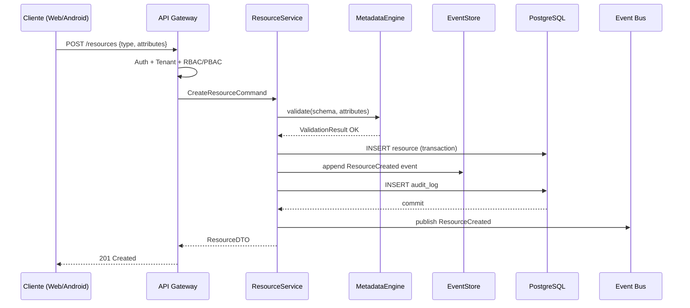
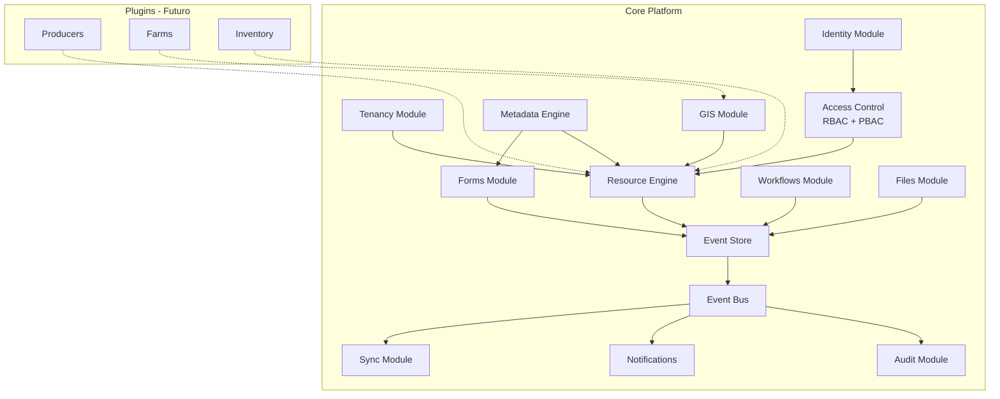

# AGROERP — Arquitectura General

## 1. Visión arquitectónica

AGROERP es una **plataforma de extensión**, no una aplicación monolítica de negocio.  
El núcleo (core) provee capacidades transversales; los módulos agroindustriales se registran como plugins.

```
┌─────────────────────────────────────────────────────────────────────────────┐
│                         CAPA DE PRESENTACIÓN                                │
│  ┌──────────────┐  ┌──────────────┐  ┌──────────────┐  ┌──────────────────┐ │
│  │ Web Admin    │  │ Web Field    │  │ Android App  │  │ Integraciones    │ │
│  │ (React)      │  │ (React PWA)  │  │ (Kotlin)     │  │ (Webhooks/API)   │ │
│  └──────┬───────┘  └──────┬───────┘  └──────┬───────┘  └────────┬─────────┘ │
└─────────┼─────────────────┼─────────────────┼──────────────────┼──────────┘
          │                 │                 │                  │
          └─────────────────┴────────┬────────┴──────────────────┘
                                     │ HTTPS / gRPC (futuro)
┌────────────────────────────────────┼────────────────────────────────────────┐
│                         API GATEWAY / BFF                                   │
│  Rate limiting · Auth · Tenant resolution · API versioning · OpenAPI        │
└────────────────────────────────────┼────────────────────────────────────────┘
                                     │
┌────────────────────────────────────┼────────────────────────────────────────┐
│                    MODULAR MONOLITH (NestJS)                                │
│                                                                             │
│  ┌─────────────────────────────────────────────────────────────────────┐   │
│  │                        CORE PLATFORM                                 │   │
│  │  Identity │ Tenancy │ RBAC/PBAC │ Resource Engine │ Metadata Engine │   │
│  │  Forms │ Workflows │ Files │ GIS │ Notifications │ Audit │ Sync API  │   │
│  └─────────────────────────────────────────────────────────────────────┘   │
│                                                                             │
│  ┌──────────────┐ ┌──────────────┐ ┌──────────────┐ ┌──────────────────┐ │
│  │ Plugin:      │ │ Plugin:      │ │ Plugin:      │ │ Plugin:          │ │
│  │ Producers    │ │ Farms/GIS    │ │ Inventory    │ │ Coffee Contracts │ │
│  │ (futuro)     │ │ (futuro)     │ │ (futuro)     │ │ (futuro)         │ │
│  └──────────────┘ └──────────────┘ └──────────────┘ └──────────────────┘ │
│                                                                             │
│  ┌─────────────────────────────────────────────────────────────────────┐   │
│  │                     EVENT BUS (Redis Streams)                        │   │
│  │  ResourceCreated · FormSubmitted · WorkflowCompleted · FileUploaded│   │
│  └─────────────────────────────────────────────────────────────────────┘   │
└────────────────────────────────────┼────────────────────────────────────────┘
                                     │
┌────────────────────────────────────┼────────────────────────────────────────┐
│                         CAPA DE PERSISTENCIA                                │
│  ┌──────────────┐  ┌──────────────┐  ┌──────────────┐  ┌──────────────────┐ │
│  │ PostgreSQL   │  │ PostGIS      │  │ Event Store  │  │ S3 (Files)       │ │
│  │ (OLTP)       │  │ (Geometrías) │  │ (particionado)│  │                  │ │
│  └──────────────┘  └──────────────┘  └──────────────┘  └──────────────────┘ │
│  ┌──────────────┐  ┌──────────────┐                                          │
│  │ Redis        │  │ Elasticsearch│  (futuro: búsqueda full-text)           │
│  │ (cache/bus)  │  │ (analytics)  │                                          │
│  └──────────────┘  └──────────────┘                                          │
└─────────────────────────────────────────────────────────────────────────────┘
```

## 2. Clean / Hexagonal Architecture (por módulo)

Cada módulo (core o plugin) sigue la misma estructura:

```
module/
├── domain/           # Entidades, value objects, reglas de negocio, ports (interfaces)
│   ├── entities/
│   ├── value-objects/
│   ├── events/
│   ├── repositories/   # interfaces (ports)
│   └── services/
├── application/      # Casos de uso, DTOs, orquestación
│   ├── commands/
│   ├── queries/
│   ├── handlers/
│   └── dto/
├── infrastructure/   # Adaptadores: DB, S3, Redis, externos
│   ├── persistence/
│   ├── messaging/
│   └── adapters/
└── presentation/     # Controllers REST, GraphQL (futuro), WebSocket
    ├── http/
    └── guards/
```

**Regla de dependencia:** `presentation → application → domain ← infrastructure`

El dominio **nunca** importa de infraestructura.

## 3. Conceptos centrales del núcleo

### 3.1 Resource Model (entidad genérica)

Toda entidad de negocio futura es un `Resource` con:

| Campo | Descripción |
|-------|-------------|
| `id` | UUID v7 (ordenable temporalmente) |
| `organizationId` | Aislamiento multi-tenant |
| `resourceType` | Tipo dinámico: `producer`, `farm`, `lot`, etc. |
| `schemaVersion` | Versión del schema de metadata |
| `attributes` | JSONB — campos dinámicos validados por Metadata Engine |
| `status` | Estado configurable por tipo |
| `parentId` | Jerarquía (finca → lote) |
| `locationId` | Referencia GIS opcional |
| `version` | Optimistic locking |
| `createdAt/updatedAt/deletedAt` | Soft delete + auditoría |

Los módulos **no crean tablas propias** para entidades simples; extienden `Resource`.  
Tablas dedicadas solo cuando hay requisitos de performance o relaciones complejas.

### 3.2 Metadata Engine (Dynamic Schema)

```json
{
  "resourceType": "farm",
  "version": 3,
  "fields": [
    {
      "key": "area_hectares",
      "type": "decimal",
      "label": "Área (ha)",
      "required": true,
      "validation": { "min": 0, "max": 10000 }
    },
    {
      "key": "crop_type",
      "type": "catalog",
      "catalogId": "crop-types",
      "required": true
    },
    {
      "key": "boundary",
      "type": "geometry",
      "geometryType": "Polygon"
    }
  ],
  "states": ["active", "inactive", "archived"],
  "permissions": { "read": ["field_agent"], "write": ["admin"] }
}
```

### 3.3 Event Store

Cada mutación de estado produce un evento inmutable:

```json
{
  "id": "evt_01HXYZ...",
  "organizationId": "org_abc",
  "aggregateType": "Resource",
  "aggregateId": "res_123",
  "eventType": "ResourceUpdated",
  "payload": { "changes": { "status": ["active", "inactive"] } },
  "metadata": {
    "userId": "usr_456",
    "deviceId": "dev_789",
    "correlationId": "corr_abc",
    "causationId": "evt_prev",
    "source": "android",
    "ip": "10.0.0.1"
  },
  "version": 5,
  "occurredAt": "2026-07-01T10:30:00Z"
}
```

**Usos:** auditoría, sync offline, proyecciones, IA, automatización.

### 3.4 Plugin / Module System

```typescript
interface AgroErpModule {
  id: string;                          // "agro.producers"
  version: string;
  resourceTypes: ResourceTypeDefinition[];
  formTemplates?: FormTemplate[];
  workflowTemplates?: WorkflowTemplate[];
  permissions: PermissionDefinition[];
  eventHandlers?: EventHandlerRegistration[];
  syncFilters?: SyncFilter[];
}
```

Los plugins se registran en `ModuleRegistry` al arrancar.  
El core valida dependencias y versiones compatibles.

## 4. Multi-tenancy

**Estrategia:** Row-Level Security (RLS) en PostgreSQL + `organizationId` en toda query.

```
Request → JWT (org_id claim) → TenantMiddleware → RLS policy activa
```

| Nivel | Implementación |
|-------|----------------|
| Aislamiento de datos | `organizationId` + RLS |
| Aislamiento de archivos | Prefijo S3: `{org_id}/...` |
| Aislamiento de eventos | Filtro por `organizationId` |
| Configuración | `Organization.settings` JSONB |
| Sub-tenancy (futuro) | `Organization.parentId` jerárquico |

## 5. Seguridad

### 5.1 Autenticación

- **OAuth2 / OIDC** (Keycloak o Auth0 en prod; implementación propia en MVP)
- JWT access token (15 min) + refresh token (7 días, rotación)
- Claims: `sub`, `org_id`, `roles[]`, `permissions[]`, `device_id`

### 5.2 Autorización (RBAC + PBAC)

```
Permiso concedido = Role tiene Permission AND Policy.evaluate(context) == ALLOW
```

**Policy context:**
```json
{
  "user": { "id", "roles", "organizationId" },
  "resource": { "type", "ownerId", "attributes", "location" },
  "action": "read|write|delete|approve",
  "environment": { "ip", "deviceTrusted", "geoFence" }
}
```

Ejemplo PBAC: *"field_agent puede editar FormSubmission solo si está dentro del geofence de la finca asignada"*.

### 5.3 Control de dispositivos

- Registro de dispositivo Android con fingerprint
- `Device.trusted` + `Device.lastSyncAt`
- Revocación remota de dispositivos
- Certificado pinning en app móvil

### 5.4 Auditoría

100% de mutaciones → `AuditLog` + `Event`.  
Incluye: quién, qué, cuándo, desde dónde, valor anterior/nuevo.

## 6. GIS

| Capacidad | Implementación |
|-----------|----------------|
| Puntos GPS | `Location` con `geometry Point` (PostGIS) |
| Polígonos fincas | `Location` con `geometry Polygon` |
| Geofencing | PostGIS `ST_Contains(polygon, point)` |
| Tracking | `LocationTrack` (serie temporal, particionada) |
| Mapas cliente | MapLibre GL (web + Android) |
| Tiles | MapTiler / self-hosted |

Formularios pueden incluir campos `type: "location"` o `type: "geometry"`.

## 7. Workflows configurables

```
Workflow (definición) → WorkflowInstance (ejecución) → Tasks
```

Estados, transiciones y asignaciones definidos en JSON.  
Cada transición emite `WorkflowStateChanged` al Event Store.

## 8. Escalabilidad

| Aspecto | Estrategia |
|---------|------------|
| Millones de registros | Particionado por `organizationId` + tiempo en events |
| Lecturas | Read replicas PostgreSQL + Redis cache |
| Archivos | CDN sobre S3 |
| Eventos | Particiones mensuales, retención configurable |
| Sync | Cursor-based pagination por `event.version` |
| Extracción a microservicios | Por bounded context (Identity, Sync, GIS) |

## 9. Diagrama de flujo: creación de recurso



## 10. Diagrama de componentes del núcleo



## 11. Decisiones técnicas (ADR resumidas)

| # | Decisión | Alternativas descartadas | Razón |
|---|----------|--------------------------|-------|
| ADR-001 | Modular Monolith (NestJS) | Microservicios desde día 1 | Velocidad MVP, menos ops; extracción posterior |
| ADR-002 | PostgreSQL + PostGIS | MongoDB, MySQL | ACID, JSONB, GIS nativo, RLS |
| ADR-003 | Resource Model genérico | Tabla por entidad | Extensibilidad sin migraciones por módulo |
| ADR-004 | Event Sourcing parcial | Solo audit log | Sync offline + reproducción de estado |
| ADR-005 | Redis Streams como bus | Kafka (MVP) | Suficiente para monolith; Kafka en escala |
| ADR-006 | UUID v7 | UUID v4, auto-increment | Ordenable, distribuido, sin colisiones |
| ADR-007 | Kotlin + Room (Android) | Flutter, React Native | Offline robusto, ecosistema maduro GIS |
| ADR-008 | OpenAPI First | Code-first | Contratos estables para web + mobile + integraciones |
| ADR-009 | Optimistic locking | Pessimistic | Mejor para sync offline y concurrencia |
| ADR-010 | Soft delete universal | Hard delete | Auditoría y recuperación |

## 12. MVP técnico funcional (Fase 1)

Alcance del primer MVP implementable:

- [ ] Monorepo con estructura base
- [ ] Core: Organization, User, Role, Permission
- [ ] Auth JWT + refresh tokens
- [ ] Resource CRUD con metadata schema básico
- [ ] Event Store (append + query por aggregate)
- [ ] AuditLog automático
- [ ] Forms: definición + submission
- [ ] Files: upload a S3/MinIO
- [ ] Location: punto y polígono (PostGIS)
- [ ] Sync API: `/sync/pull` y `/sync/push` con cursor
- [ ] Web admin mínimo: login + listado recursos
- [ ] Android: login + formulario offline + sync
- [ ] Docker Compose para desarrollo local
- [ ] OpenAPI spec publicada

**Fuera de MVP:** plugins de negocio, IA, GeoServer, Kubernetes prod.
