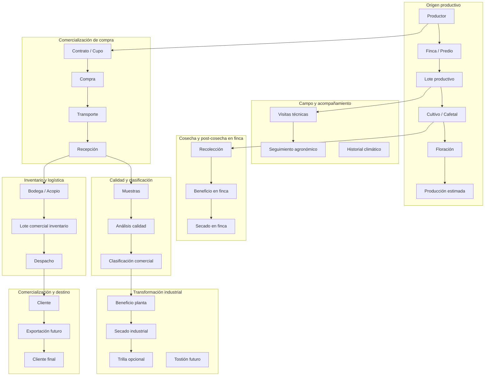
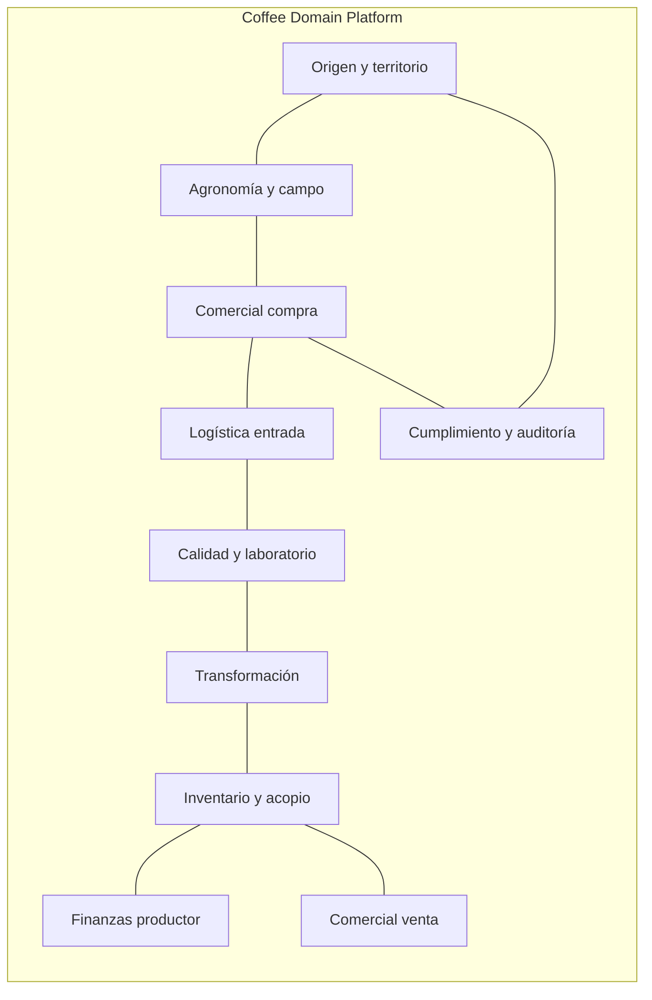
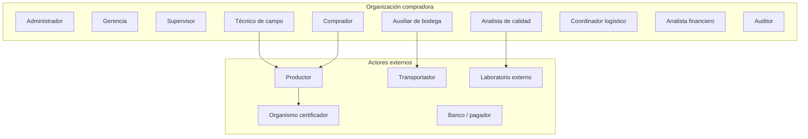
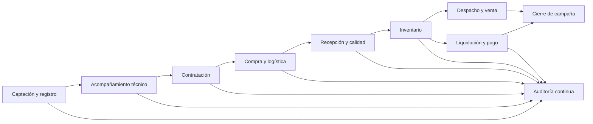
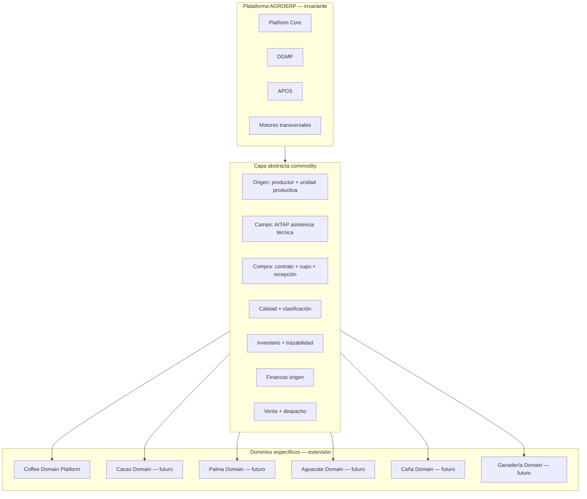

# AGROERP — Coffee Domain Platform (CDP)

**Documento maestro del dominio cafetero**  
**Versión:** 2.0  
**Alcance:** Empresa compradora, procesadora y comercializadora de café — operación directa con productores, transformación, calidad, inventario y comercialización  
**Estado:** Estándar oficial — base para todos los motores de negocio cafetero  
**Audiencia:** Producto, arquitectura, desarrollo, operaciones, gerencia, calidad, comercio exterior y auditoría  
**Naturaleza:** Conocimiento de negocio — **sin código, sin APIs, sin pantallas**

---

## 0. Contexto y propósito

### 0.1 Perfil de la empresa objetivo

AGROERP modela una **empresa integrada del café** — compradora, procesadora y comercializadora — adaptable a distintos modelos operativos:

| Arquetipo | Capacidades principales |
|-----------|-------------------------|
| **Compradora / Trader** | Contratos, cupos, compra directa, acopio, calidad, liquidación y pago al productor |
| **Procesadora** | Beneficio húmedo/seco, secado, clasificación, trilla (opcional), lotes comerciales |
| **Comercializadora** | Inventario comercial, despachos, clientes, contratos de venta, exportación (futuro) |
| **Integrada** | Cadena completa: finca → compra → transformación → venta → cliente final |

La empresa:

- Compra café en **cereza, pergamino húmedo, pergamino seco u oro** según configuración país/empresa.
- Opera con **contratos de compra**, cupos, precios de referencia y políticas por zona, perfil de taza y certificación.
- Despliega **técnicos de campo** para acompañamiento agronómico, diagnóstico, levantamiento y validación documental.
- Recibe café en **centros de acopio / bodegas**, ejecuta **control de calidad**, clasifica, almacena y despacha.
- Puede operar **beneficios propios o de terceros**, secaderos, plantas de trilla y (futuro) tostión.
- Debe operar en **zonas rurales con conectividad limitada**, con trazabilidad documental, geográfica y legal.
- Debe ser **configurable por país** (documentos, impuestos, unidades, regulaciones) sin cambiar el modelo de dominio.

### 0.1.1 Relación con la plataforma AGROERP

| Documento / Motor | Rol respecto al CDP |
|-------------------|---------------------|
| `APOS.md` | Orquestación de módulos cafetero, registries, feature flags por país |
| `EXTENSION_PLUGIN_FRAMEWORK.md` | Contrato Extension Package para módulos `agro.coffee.*` |
| `GOVERNANCE_ENTERPRISE_CONTROL_LAYER.md` | Auditoría, compliance exportación, control financiero cafetero |
| `INTEGRATION_ECOSYSTEM_LAYER.md` | Bancos, aduanas, IoT, satélite, ERP externos, comercio |
| `DATA_PLATFORM_ANALYTICS_LAYER.md` | Lake, warehouse, BI, KPIs oficiales, Feature Store |
| `DATA_GOVERNANCE_PLATFORM.md` | Golden records, calidad, lineage, catálogo de entidades cafeteras |
| `MASTER_DATA_ENGINE.md` | 104 catálogos transversales (variedades, defectos, certificaciones…) |
| `FORM_ENGINE.md` | Instrumentos de captura (visitas, recepción, calidad) |
| `WORKFLOW_ENGINE.md` | Aprobaciones (contratos, excepciones, despachos, pagos) |
| `IDENTITY_ENGINE.md` | Roles, scopes territoriales, delegaciones de campo |
| Resource / Event / Metadata Engine | Persistencia, eventos de dominio, schemas extensibles |
| Android Offline Foundation | Operación de campo sin conectividad |

**Regla de oro:** Todo motor de negocio cafetero futuro debe **trazar** entidades, procesos, reglas y eventos definidos en este documento.

### 0.2 Principios de modelado

Este documento define el **dominio de negocio**, no la implementación técnica. Todo módulo futuro de AGROERP debe:

1. Reutilizar el **Resource Engine**, **Form Engine**, **Event Store** y **Audit** del core.
2. Representar entidades de negocio como **recursos tipados** con metadata, estados y relaciones.
3. Registrar **eventos de dominio** en cada transición relevante.
4. Soportar **captura offline** en campo (visitas, compras preliminares, evidencias).
5. Mantener **trazabilidad** desde finca → lote → compra → inventario → despacho → pago.

### 0.3 Glosario mínimo

| Término | Definición |
|---------|------------|
| **Pergamino** | Café con cascara removida, aún con pergamino (húmedo o seco según proceso) |
| **Cereza** | Fruto maduro del cafeto |
| **Beneficio** | Proceso de transformación (despulpado, fermentación, secado, etc.) |
| **Lote productivo** | Unidad agronómica dentro de una finca con identidad propia de variedad/edad/manejo |
| **Cupo** | Cantidad máxima comprometida de compra en un contrato o campaña |
| **Taza** | Evaluación sensorial del café (SCA, perfil comercial) |
| **Trazabilidad** | Capacidad de rastrear origen, manipulación y destino de un volumen de café |
| **Lote comercial** | Unidad de stock homogénea post-clasificación/trilla para venta o exportación |
| **Beneficio húmedo** | Despulpado, fermentación (opcional), lavado y entrega a secado |
| **Beneficio seco** | Trilla, clasificación por tamaño/densidad, remoción de defectos |
| **Floración** | Etapa fenológica del cafeto; base para estimación de cosecha |
| **Cupo** | Volumen máximo comprometido de compra en contrato o campaña |
| **Golden record** | Registro maestro autoritativo del productor/finca (DGMP) |

### 0.4 Cadena de valor del café

La cadena de valor modela el flujo completo desde el origen productivo hasta el cliente final. Cada etapa es un **subdominio** con entidades, procesos, eventos y reglas propias, enlazadas por **trazabilidad**.



#### 0.4.1 Etapas de la cadena — definición operativa

| # | Etapa | Descripción | Actores típicos | Salida principal |
|---|-------|-------------|-----------------|------------------|
| 1 | **Productor** | Persona natural/jurídica titular de la producción | Técnico, Comprador | Expediente productor |
| 2 | **Finca** | Unidad territorial con identidad geográfica | Técnico, Productor | Ficha territorial + GPS |
| 3 | **Lote / Parcela** | Subdivisión agronómica (variedad, edad, densidad) | Técnico | Lote productivo activo |
| 4 | **Cultivo / Cafetal** | Estado del cafetal por campaña en un lote | Técnico | Registro agronómico |
| 5 | **Floración** | Registro fenológico; predice ventana de cosecha | Técnico | Fecha estimada cosecha |
| 6 | **Producción estimada** | Volumen esperado (kg cereza/pergamino) | Técnico, IA (futuro) | Proyección por lote/campaña |
| 7 | **Recolección** | Corte y recolección del fruto | Productor, Técnico | Registro de cosecha |
| 8 | **Beneficio (finca/planta)** | Transformación húmeda: despulpado, fermentación, lavado | Productor, Operario beneficio | Pergamino húmedo o cereza entregada |
| 9 | **Secado** | Reducción de humedad (sol, mecánico, mixto) | Productor, Operario | Pergamino seco |
| 10 | **Almacenamiento (finca)** | Bodega finca pre-entrega | Productor | Stock finca |
| 11 | **Transporte** | Movimiento finca → acopio/planta | Transportador | Guía, evidencias |
| 12 | **Compra** | Transacción comercial de adquisición | Comprador | Orden / compra registrada |
| 13 | **Recepción** | Ingreso físico con pesaje oficial | Bodega | Ticket báscula, lote inventario |
| 14 | **Calidad** | Análisis físico y sensorial | Analista calidad | Dictamen |
| 15 | **Clasificación** | Homologación por perfil comercial, certificación, destino | Calidad, Bodega | Lote comercial clasificado |
| 16 | **Trilla** (opcional) | Remoción de pergamino → oro exportable | Planta trilla | Lote oro |
| 17 | **Tostión** (futuro) | Transformación para mercado interno/especialidad | Tostador | Lote tostado |
| 18 | **Inventario comercial** | Stock trazable en bodega/planta | Bodega | Posición inventario |
| 19 | **Comercialización** | Venta a cliente nacional/regional | Comercial | Orden de venta |
| 20 | **Exportación** (futuro) | Documentación aduanera, contenedor, destino | Comercio exterior | Embarque |
| 21 | **Cliente final** | Consumidor o industria destino | — | Trazabilidad E2E cerrada |

#### 0.4.2 Granularidad de trazabilidad por etapa

| Nivel | Alcance | Cuándo usar |
|-------|---------|-------------|
| **L0 — Productor** | Solo identidad comercial | Compras spot sin origen finca |
| **L1 — Finca** | Origen territorial | Contratos estándar |
| **L2 — Lote productivo** | Origen agronómico | Certificaciones, especialidad |
| **L3 — Cosecha / día** | Recolección por fecha | Microlotes, competiciones |
| **L4 — Árbol / cuadrante** (opcional) | Máxima granularidad | Geisha, parcelas premium |

La política de granularidad es **configurable por organización, certificación y tipo de contrato**.

### 0.5 Arquitectura de subdominios (bounded contexts)



| Subdominio | Entidades núcleo | Procesos núcleo |
|------------|------------------|-----------------|
| **Origen y territorio** | Productor (PRM), Finca/Lote/GPS (FTIP) — `PRODUCER_RELATIONSHIP_MANAGEMENT_PLATFORM.md`, `FARM_TERRITORY_INTELLIGENCE_PLATFORM.md` | Registro, actualización territorial |
| **Agronomía y campo** | Visita, Floración, Cosecha, Clima | Visitas, seguimiento, estimación |
| **Comercial compra** | Campaña, Contrato, Cupo, Compra | Contratación, compra, cupos |
| **Logística entrada** | Transporte, Recepción, Guía | Recolección, transporte, recepción |
| **Calidad y laboratorio** | Muestra, Análisis, Dictamen | Control calidad, clasificación |
| **Transformación** | Orden beneficio, Secado, Trilla | Beneficio, secado, trilla |
| **Inventario y acopio** | Bodega, Lote inventario, Movimiento | Inventario, despacho |
| **Finanzas productor** | Liquidación, Pago, Anticipo | Liquidación, pago |
| **Comercial venta** | Cliente, Orden venta, Lote comercial | Comercialización, exportación |
| **Cumplimiento** | Certificación, Auditoría, Alerta | Auditorías, cumplimiento |

### 0.6 Flexibilidad multi-país y multi-empresa

El CDP separa **conceptos universales del café** de **parametrización local**:

| Universal (dominio) | Local (configuración) |
|---------------------|----------------------|
| Productor, Finca, Compra, Calidad | Tipo documento identidad, NIT/RUT/CC |
| Cadena trazabilidad | Impuestos, retenciones, facturación |
| Estados y transiciones | Moneda, unidad de peso (kg/lb) |
| Reglas de negocio (plantilla) | Umbrales humedad, tablas descuento |
| Eventos de dominio | Calendario campaña, festivos pago |

**Mecanismo:** Metadata Engine + catálogos MDM + reglas DVE (DGMP) — sin duplicar el modelo de dominio por país.

---

## 1. Actores del negocio

### 1.1 Mapa de actores



---

### 1.2 Administrador del sistema

**Responsabilidades**
- Configuración global de la organización, sedes, bodegas, campañas cafeteras y parámetros del negocio.
- Gestión de usuarios, roles, permisos y políticas de acceso.
- Definición de formularios dinámicos, flujos de aprobación y plantillas documentales.
- Supervisión de integraciones, respaldos y continuidad operativa.

**Permisos generales**
- Acceso total a configuración, usuarios, catálogos maestros y reportes ejecutivos.
- Aprobación de excepciones de negocio de alto impacto (anulaciones, reaperturas, ajustes masivos).
- Consulta de auditoría completa.

**Procesos donde participa**
- Parametrización inicial del ERP.
- Apertura/cierre de campaña cafetera.
- Resolución de conflictos de sincronización y excepciones críticas.
- Gobierno de datos maestros.

---

### 1.3 Gerencia / Dirección comercial y operativa

**Responsabilidades**
- Definir metas de compra, precios máximos, políticas por zona y estrategia de certificaciones.
- Aprobar contratos de alto volumen o condiciones especiales.
- Monitorear KPIs, riesgos de cumplimiento y rentabilidad por origen.

**Permisos generales**
- Lectura ejecutiva de todos los módulos.
- Aprobación de contratos, cupos extraordinarios y descuentos fuera de política.
- Acceso a tableros, KPIs y alertas estratégicas.

**Procesos donde participa**
- Planeación de campaña.
- Aprobación comercial.
- Revisión de desempeño regional.
- Decisiones de suspensión o reactivación de productores/contratos.

---

### 1.4 Supervisor de campo / Supervisor comercial

**Responsabilidades**
- Coordinar rutas, agendas y asignación de técnicos y compradores por zona.
- Revisar y aprobar visitas, hallazgos y recomendaciones técnicas.
- Validar consistencia entre información de finca y operaciones comerciales.
- Escalar incidencias de fraude, incumplimiento o riesgo reputacional.

**Permisos generales**
- Lectura y aprobación de visitas, formularios y actualizaciones de productores/fincas en su zona.
- Reasignación de tareas de campo.
- Consulta de contratos, compras y calidad de su territorio.

**Procesos donde participa**
- Planificación de visitas.
- Aprobación de levantamientos de información.
- Seguimiento a productores críticos.
- Control de cumplimiento de rutas y sincronización de equipos de campo.

---

### 1.5 Técnico de campo

**Responsabilidades**
- Ejecutar visitas técnicas en finca según agenda y protocolos.
- Levantar información agronómica, sanitaria, productiva y de buenas prácticas.
- Capturar evidencias (foto, video, audio, firma, GPS).
- Registrar recomendaciones, planes de mejora y seguimiento de compromisos previos.

**Permisos generales**
- Crear y editar visitas asignadas (offline).
- Consultar productores, fincas y lotes de su cartera.
- Enviar formularios dinámicos y evidencias.
- No puede aprobar compras ni modificar contratos sin delegación.

**Procesos donde participa**
- Visita técnica inicial y de seguimiento.
- Diagnóstico de plagas, rendimiento y estado de cultivo.
- Validación de georreferenciación de fincas y lotes.
- Actualización de información productiva en campo.

---

### 1.6 Comprador / Agente de compra

**Responsabilidades**
- Negociar y registrar intenciones y órdenes de compra con productores.
- Verificar vigencia de contrato, cupo disponible, perfil de calidad esperado y documentación.
- Coordinar recepción programada y condiciones de entrega.
- Gestionar relacionamiento comercial con la cartera asignada.

**Permisos generales**
- Crear pre-órdenes y órdenes de compra dentro de política.
- Consultar saldos de contrato, historial de calidad y precios vigentes.
- Solicitar excepciones comerciales al supervisor/gerencia.
- Captura offline de acuerdos preliminares sujetos a confirmación.

**Procesos donde participa**
- Negociación y registro de compra.
- Asignación de volumen a contrato/campaña.
- Coordinación de recepción.
- Seguimiento de entregas pendientes.

---

### 1.7 Auxiliar de bodega / Jefe de acopio

**Responsabilidades**
- Recibir físicamente el café, registrar peso, humedad inicial, estado del grano y documentos de transporte.
- Generar movimientos de inventario de entrada.
- Ubicar material en silos, pilas o áreas de acopio.
- Preparar traslados internos y despachos autorizados.

**Permisos generales**
- Registrar recepciones y movimientos de inventario en su bodega.
- Imprimir/generar tickets de ingreso y etiquetas de lote de acopio.
- No modifica contratos ni precios comerciales.

**Procesos donde participa**
- Recepción de compra.
- Ingreso a inventario.
- Traslado interno.
- Preparación de despacho.
- Conteos cíclicos y ajustes operativos (con aprobación).

---

### 1.8 Analista de calidad

**Responsabilidades**
- Tomar muestras representativas según protocolo.
- Registrar análisis físico (defectos, humedad, rendimiento exportable) y sensorial (taza).
- Clasificar café por perfil comercial y determinar homologaciones o rechazos.
- Emitir dictámenes que condicionan pago, descuentos o reprocesos.

**Permisos generales**
- Crear y cerrar análisis de calidad.
- Asociar resultados a compras, lotes de acopio y muestras.
- Solicitar re-muestreo o segregación.

**Procesos donde participa**
- Control de calidad en recepción.
- Evaluación de muestras de contrato.
- Homologación de perfiles de taza.
- Liberación o retención de inventario.

---

### 1.9 Coordinador logístico / Transportador (interno o externo)

**Responsabilidades**
- Planificar rutas de recolección desde fincas o puntos de entrega.
- Asignar vehículos, conductores y guías de transporte.
- Confirmar entregas, tiempos y condiciones del cargue.
- Reportar novedades (derrames, humedad, retrasos).

**Permisos generales (transportador externo limitado)**
- Consulta de órdenes de recolección asignadas.
- Registro de inicio/fin de viaje, fotos y firma de entrega.
- Sin acceso a precios ni contratos completos.

**Procesos donde participa**
- Programación de recolección.
- Ejecución de transporte finca → acopio.
- Confirmación de despacho acopio → beneficio/exportación.

---

### 1.10 Analista financiero / Tesorería

**Responsabilidades**
- Gestionar liquidaciones de compra, retenciones, descuentos por calidad y anticipos.
- Programar y ejecutar pagos a productores.
- Conciliar facturas, soportes y obligaciones fiscales.
- Controlar cartera de saldos a favor / en contra.

**Permisos generales**
- Consulta de compras aprobadas para pago.
- Registro de pagos, notas y ajustes financieros.
- No altera pesos ni resultados de calidad sin flujo de excepción.

**Procesos donde participa**
- Liquidación de compra.
- Pago a productor.
- Anticipos y compensaciones.
- Cierre contable de campaña.

---

### 1.11 Productor (usuario externo o perfil asociado)

**Responsabilidades**
- Mantener actualizada su información personal, bancaria y documental.
- Cumplir entregas según contrato y calidad pactada.
- Firmar contratos, actas de visita y recibos de entrega/pago.
- Atender recomendaciones técnicas y planes de mejora.

**Permisos generales**
- Consulta de sus fincas, contratos, entregas y pagos.
- Firma digital de documentos asignados.
- Envío de solicitudes o actualizaciones (sujetas a validación).

**Procesos donde participa**
- Registro y actualización de datos.
- Firma de contrato.
- Entrega de café.
- Confirmación de liquidación y pago.

---

### 1.12 Auditor interno / externo

**Responsabilidades**
- Verificar cumplimiento de políticas, trazabilidad y controles.
- Revisar evidencias de visita, compras, inventario y pagos.
- Emitir hallazgos y seguimiento de planes de acción.

**Permisos generales**
- Acceso de solo lectura amplio, incluida auditoría y eventos.
- Sin capacidad de modificar transacciones de negocio.

**Procesos donde participa**
- Auditoría de campo y bodega.
- Revisión de excepciones aprobadas.
- Certificación de procesos para organismos externos.

---

### 1.13 Matriz resumen actor ↔ proceso

| Proceso | Actores principales |
|---------|---------------------|
| Registro de productor | Técnico, Comprador, Supervisor, Productor |
| Registro de finca/lote | Técnico, Supervisor, Productor |
| Visita técnica | Técnico, Supervisor, Productor |
| Contratación | Comprador, Gerencia, Productor, Finanzas |
| Compra / pre-orden | Comprador, Supervisor, Productor |
| Recepción | Bodega, Transportador, Comprador |
| Calidad | Analista calidad, Bodega, Comprador |
| Inventario | Bodega, Supervisor, Auditor |
| Despacho | Bodega, Logística, Gerencia |
| Pago | Finanzas, Productor, Auditor |
| Auditoría | Auditor, Gerencia, Administrador |

---

## 2. Objetos principales del negocio

Cada objeto listado será futuramente un **tipo de recurso** o entidad de soporte en AGROERP. Se agrupan por subdominio.

### 2.1 Subdominio: Identidad y relación comercial

| Objeto | Descripción |
|--------|-------------|
| **Empresa / Organización** | Entidad legal compradora; puede tener sedes y bodegas |
| **Sede / Regional** | Unidad operativa geográfica o comercial |
| **Empleado / Usuario interno** | Persona con rol dentro de la organización |
| **Productor** | Persona natural o jurídica que vende café |
| **Grupo familiar / Asociación** | Agrupación de productores para contrato o logística |
| **Contacto** | Personas de contacto del productor (familiar, administrador finca) |
| **Cuenta bancaria** | Medio de pago del productor |
| **Documento de identidad** | Cédula, RUT, NIT, etc. |
| **Documento legal** | RUT, cámara de comercio, registro ICA, etc. |
| **Certificación** | Orgánico, Fairtrade, Rainforest, 4C, etc. |
| **Vigencia de certificación** | Periodo y estado de validez |

### 2.2 Subdominio: Territorio y producción

| Objeto | Descripción |
|--------|-------------|
| **Finca** | Unidad territorial de producción identificada geográficamente |
| **Predio / Parcela** | Subdivisión administrativa o catastral dentro de finca |
| **Lote productivo** | Unidad agronómica (variedad, edad, densidad, sombrío) |
| **Cuadrante / Sección** | Subdivisión opcional dentro de lote (trazabilidad L4) |
| **Cultivo / Cafetal** | Estado del cultivo asociado a lote y campaña |
| **Variedad** | Castillo, Caturra, Bourbon, Gesha, etc. |
| **Especie** | Arabica, Canephora (Robusta) |
| **Árbol / Plantación** | Registro individual o por densidad (árboles/ha) |
| **Edad del cultivo** | Años desde siembra o último replanteo |
| **Densidad de siembra** | Plantas por hectárea |
| **Sistema de sombrío** | Tipo y densidad (sombra plena, media, sol) |
| **Sistema de producción** | Convencional, orgánico, agroforestal, regenerativo |
| **Infraestructura de finca** | Beneficio húmedo, secadores, bodega finca, tanques fermentación |
| **Punto geográfico (GPS)** | Coordenada de finca, lote, entrada, beneficio |
| **Polígono / Perímetro** | Delimitación espacial de finca o lote |
| **Ruta de acceso** | Trayectoria para logística y visitas |
| **Zona agroclimática** | Altitud, precipitación, temperatura (referencia) |
| **Floración** | Registro fenológico por lote y fecha |
| **Cosecha / Corte** | Periodo de recolección en un lote |
| **Producción real** | Volumen cosechado (cereza/pergamino) por lote/campaña |
| **Estimación de producción** | Volumen esperado por lote/campaña |
| **Historial climático** | Registro de precipitación, heladas, sequía por finca/zona |
| **Incidencia sanitaria** | Brote de roya, broca, ojo de gallo, etc. |
| **Práctica agronómica** | Fertilización, poda, sombrío, control integrado |
| **Tenencia / Derecho de uso** | Propiedad, arriendo, usufructo, cooperativa |

### 2.3 Subdominio: Acompañamiento técnico

| Objeto | Descripción |
|--------|-------------|
| **Visita técnica** | Evento de campo planificado o ad-hoc |
| **Agenda de visita** | Programación por técnico, fecha y finca |
| **Formulario dinámico** | Instrumento configurable de captura (Form Engine) |
| **Respuesta de formulario** | Submission asociada a visita |
| **Hallazgo** | Problema detectado (plaga, deficiencia nutricional, etc.) |
| **Recomendación** | Acción sugerida al productor |
| **Plan de mejora** | Conjunto de recomendaciones con seguimiento |
| **Compromiso** | Acuerdo con productor y fecha objetivo |
| **Evidencia multimedia** | Fotografía, video, audio |
| **Firma** | Productor, técnico o testigo |
| **Acta de visita** | Documento consolidado de la visita |

### 2.4 Subdominio: Comercial y contratos

| Objeto | Descripción |
|--------|-------------|
| **Campaña cafetera** | Ventana anual o semestral de compra (ej. 2025/2026) |
| **Política comercial** | Reglas de precio, prima, descuento y calidad |
| **Lista de precios** | Precios por perfil, zona, certificación y presentación |
| **Contrato de compra** | Acuerdo marco con productor o grupo |
| **Adenda contractual** | Modificación de cupo, precio o condiciones |
| **Cupo contractual** | Volumen máximo comprometido (kg o cargas) |
| **Saldo de cupo** | Volumen disponible restante |
| **Pre-orden de compra** | Intención registrada en campo, pendiente de confirmación |
| **Orden de compra** | Compromiso formal de compra |
| **Compra** | Transacción económica de adquisición |
| **Liquidación de compra** | Cálculo de valor a pagar con descuentos y primas |
| **Anticipo** | Pago adelantado descontable |
| **Descuento comercial** | Por humedad, defectos, incumplimiento |
| **Prima de calidad** | Incentivo por perfil de taza o certificación |

### 2.5 Subdominio: Logística y recepción

| Objeto | Descripción |
|--------|-------------|
| **Programación de recolección** | Plan de rutas y fechas |
| **Orden de transporte** | Solicitud de movimiento físico |
| **Vehículo** | Camión, motocarro, etc. |
| **Conductor / Transportador** | Responsable del traslado |
| **Guía de cargue / remisión** | Documento de tránsito |
| **Recepción** | Evento de ingreso físico a bodega |
| **Ticket de báscula** | Peso bruto, tara, neto |
| **Remisión del productor** | Documento de entrega en finca o punto |
| **Novedad logística** | Retraso, derrame, rechazo parcial |

### 2.6 Subdominio: Calidad

| Objeto | Descripción |
|--------|-------------|
| **Muestra** | Extracción representativa de un lote de recepción |
| **Análisis físico** | Humedad, granulometría, defectos, color |
| **Análisis sensorial / Taza** | Puntaje y descriptores |
| **Perfil de taza** | Clasificación comercial resultante |
| **Dictamen de calidad** | Aprobado, homologado, rechazado, condicionado |
| **Protocolo de muestreo** | Norma por volumen y tipo de café |
| **Equipo de laboratorio** | Catación, moedor, humedímetro |
| **Informe de laboratorio externo** | Resultado de tercero |

### 2.7 Subdominio: Inventario y bodega

| Objeto | Descripción |
|--------|-------------|
| **Bodega / Centro de acopio** | Ubicación física de almacenamiento |
| **Zona de bodega** | Silo, pila, área temporal, cuarentena |
| **Lote de inventario** | Unidad trazable de stock (origen + recepción + calidad) |
| **Inventario** | Posición de existencias por lote y bodega |
| **Movimiento de inventario** | Entrada, salida, traslado, ajuste, merma |
| **Toma física / Conteo** | Verificación de existencias |
| **Ajuste de inventario** | Corrección autorizada |
| **Merma** | Pérdida por secado, manipulación o calidad |
| **Cuarentena** | Stock retenido pendiente de dictamen |
| **Despacho** | Salida autorizada hacia cliente o proceso |
| **Orden de despacho** | Instrucción de salida |

### 2.8 Subdominio: Finanzas y fiscal

| Objeto | Descripción |
|--------|-------------|
| **Factura / Documento soporte** | Comprobante fiscal de compra |
| **Pago** | Transferencia, efectivo, cheque |
| **Programación de pago** | Calendario de desembolsos |
| **Retención** | Impuestos u otras deducciones legales |
| **Estado de cuenta productor** | Saldos, anticipos, compras y pagos |
| **Cierre de campaña** | Consolidación financiera del periodo |

### 2.9 Subdominio: Gobierno, auditoría y notificaciones

| Objeto | Descripción |
|--------|-------------|
| **Evento de negocio** | Hecho relevante del dominio (Event Engine) |
| **Registro de auditoría** | Quién cambió qué y cuándo |
| **Notificación** | Alerta a usuario o actor |
| **Tarea / Workflow** | Aprobación pendiente |
| **Excepción de negocio** | Autorización fuera de regla estándar |
| **Política de retención documental** | Tiempo de conservación de evidencias |
| **Alerta operativa** | Vencimiento certificación, cupo, humedad, compromiso |
| **Auditoría de campo** | Revisión formal de cumplimiento en finca |
| **Auditoría de bodega** | Revisión de inventario, pesos, trazabilidad |
| **Hallazgo de auditoría** | No conformidad con severidad y plan de acción |
| **Plan de acción correctiva** | Seguimiento post-auditoría |

### 2.10 Subdominio: Transformación (beneficio, secado, trilla)

| Objeto | Descripción |
|--------|-------------|
| **Planta de beneficio** | Instalación de transformación húmeda (finca o industrial) |
| **Orden de beneficio** | Instrucción de procesar volumen de cereza/pergamino |
| **Lote de beneficio** | Unidad procesada en una corrida de beneficio |
| **Proceso húmedo** | Despulpado, fermentación, lavado, clasificación en cherry |
| **Tanque de fermentación** | Recipiente con tiempo y tipo de fermentación |
| **Secadero** | Infraestructura de secado (marquesina, mecánico, solar) |
| **Orden de secado** | Control de humedad objetivo y tiempo |
| **Lote de secado** | Volumen en proceso de reducción de humedad |
| **Lectura de humedad** | Medición durante secado o almacenamiento |
| **Planta de trilla** | Instalación de remoción de pergamino |
| **Orden de trilla** | Instrucción de trillar lote(s) de pergamino |
| **Lote de oro** | Café pergamino removido, listo para clasificación/exportación |
| **Rendimiento de transformación** | Factor cereza→pergamino→oro por proceso |
| **Merma de transformación** | Pérdida en beneficio, secado o trilla |
| **Tostión** (futuro) | Orden y lote de café tostado por perfil |

### 2.11 Subdominio: Comercialización y clientes

| Objeto | Descripción |
|--------|-------------|
| **Cliente** | Comprador nacional o internacional de café |
| **Contrato de venta** | Acuerdo de suministro con cliente |
| **Orden de venta** | Pedido comercial de café por perfil/volumen |
| **Cotización** | Oferta de precio por lote comercial |
| **Lote comercial** | Unidad homogénea de venta (origen + calidad + certificación) |
| **Lista de precios venta** | Precios por perfil, mercado, INCOTERM |
| **Despacho comercial** | Salida hacia cliente |
| **Factura de venta** | Documento fiscal de venta |
| **Embarque** (futuro) | Unidad exportación: contenedor, guía, booking |
| **Documento aduanero** (futuro) | DEX, certificado origen, fitosanitario |
| **Muestra comercial** | Muestra enviada a cliente para aprobación |
| **Reclamo de cliente** | No conformidad post-entrega |

### 2.12 Subdominio: Recursos logísticos y flota

| Objeto | Descripción |
|--------|-------------|
| **Transportista** | Empresa o persona de transporte |
| **Vehículo** | Camión, furgón, motocarro, cabezote |
| **Conductor** | Operador del vehículo |
| **Ruta logística** | Secuencia de paradas planificadas |
| **Manifiesto de carga** | Consolidado de entregas en un viaje |
| **Seguro de carga** | Póliza asociada al transporte |
| **Combustible / Costo viaje** | Registro de costos logísticos (opcional) |

### 2.13 Subdominio: Medios, documentos y evidencias

| Objeto | Descripción |
|--------|-------------|
| **Documento** | Archivo PDF, imagen escaneada, oficio |
| **Fotografía** | Evidencia visual georreferenciada |
| **Video** | Evidencia de campo, recepción o proceso |
| **Audio** | Nota de voz del técnico (offline) |
| **Firma digital / manuscrita** | Productor, técnico, receptor, cliente |
| **Acta** | Documento consolidado (visita, recepción, auditoría) |
| **Plantilla documental** | Contrato, liquidación, guía — generada por sistema |
| **Cadena de custodia documental** | Quién accedió y modificó cada evidencia |

### 2.14 Índice maestro de entidades (resumen)

El CDP define **más de 120 objetos de negocio** en 14 subdominios. Todo objeto futuro en AGROERP debe:

1. Mapearse a un tipo de **recurso** o entidad de soporte documentada aquí.
2. Registrar en el **Data Catalog** (DGMP) su definición, owner y sensibilidad.
3. Publicar **eventos de dominio** en cada transición de estado relevante.
4. Respetar las **reglas de negocio** de su subdominio y las transversales (§5).

---

## 3. Relaciones entre entidades

### 3.1 Relaciones estructurales (jerarquía)

```
Organización
 └── Sede / Regional
      ├── Empleados (usuarios)
      ├── Bodegas
      └── Campañas cafeteras

Productor
 ├── Documentos legales
 ├── Cuentas bancarias
 ├── Certificaciones
 ├── Fincas
 │    ├── Predios / Parcelas
 │    │    └── Lotes productivos
 │    │         ├── Cultivos (por campaña)
 │    │         ├── Cosechas
 │    │         └── Estimaciones de producción
 │    ├── Infraestructura
 │    └── Puntos GPS / Polígonos
 ├── Contratos de compra
 ├── Visitas técnicas
 ├── Compras
 └── Pagos / Estado de cuenta
```

### 3.2 Relaciones operativas clave

| Relación | Cardinalidad | Descripción |
|----------|--------------|-------------|
| Productor → Finca | 1:N | Un productor puede tener varias fincas; una finca tiene un productor titular (puede haber copropiedad modelada como co-productores) |
| Finca → Lote | 1:N | Una finca se divide en lotes productivos |
| Lote → Cosecha | 1:N | Un lote tiene una o más cosechas por campaña |
| Productor → Contrato | 1:N | Histórico de contratos por campaña o vigencia |
| Contrato → Cupo | 1:1 o 1:N | Cupo total y posibles sub-cupos por finca o perfil |
| Contrato → Compra | 1:N | Las compras consumen saldo del contrato |
| Visita → Finca | N:1 | Muchas visitas a la misma finca en el tiempo |
| Visita → Formulario | N:M | Una visita puede incluir varios formularios |
| Visita → Evidencias | 1:N | Fotos, videos, firmas, GPS |
| Pre-orden → Compra | 1:1 | La pre-orden confirmada se convierte en compra |
| Compra → Recepción | 1:N | Una compra puede recibirse en uno o varios viajes |
| Recepción → Muestra | 1:N | Múltiples muestras según protocolo |
| Muestra → Análisis | 1:N | Físico y sensorial pueden ser análisis separados |
| Recepción → Movimiento inventario | 1:1 mínimo | Toda recepción genera entrada |
| Lote de inventario → Bodega/Zona | N:1 | Ubicación física actual |
| Movimiento → Lote inventario | N:1 | Trazabilidad de cada movimiento |
| Compra → Liquidación → Pago | 1:1:N | Cadena financiera |
| Despacho → Movimiento salida | 1:N | Salida de uno o varios lotes de inventario |
| Certificación → Productor/Finca/Lote | N:M | Alcance según tipo de certificación |
| Vehículo → Orden transporte | N:M | Asignación por viaje |

### 3.3 Relaciones de trazabilidad (cadena de custodia)

La trazabilidad exige encadenar:

**Finca/Lote productivo → Cosecha → Compra → Recepción → Lote de inventario → Movimientos → Despacho → Cliente/Proceso**

Cada eslabón debe poder responder:
- ¿De qué finca y lote provino?
- ¿Bajo qué contrato y campaña?
- ¿Qué análisis de calidad tuvo?
- ¿Quién lo recibió, almacenó y despachó?
- ¿Qué evidencias y firmas respaldan el hecho?

### 3.4 Relaciones con el core AGROERP

| Concepto de negocio | Mapeo conceptual al core |
|---------------------|--------------------------|
| Productor, Finca, Compra, etc. | Resource types con schema metadata |
| Visita y formularios | FormDefinition + FormSubmission → Resource |
| Fotos, firmas | File Resources + GPS metadata |
| Cambios de estado | Domain Events |
| Historial | Event Store + Audit Log |
| Operación offline | Sync Queue + externalId |

---

## 4. Procesos de negocio

### 4.1 Mapa de procesos de alto nivel



---

### 4.2 Proceso: Registro de productor

**Disparador:** Nuevo productor en zona de influencia o referido por campo.  
**Actores:** Técnico, Comprador, Supervisor, Productor.  
**Flujo:**
1. Verificación de duplicados (documento, nombre, geolocalización).
2. Captura de datos personales, contacto y documentos.
3. Registro de cuentas bancarias y beneficiarios de pago.
4. Clasificación comercial (micro, pequeño, medio productor).
5. Asignación a cartera de técnico/comprador.
6. Aprobación por supervisor si hay inconsistencias.
7. Emisión de evento `ProductorRegistrado`.

**Salidas:** Productor activo, expediente documental iniciado.

---

### 4.3 Proceso: Registro de finca y lotes

**Disparador:** Productor registrado o nueva finca detectada en visita.  
**Actores:** Técnico, Supervisor, Productor.  
**Flujo:**
1. Identificación de finca (nombre, vereda, municipio, altitud).
2. Captura GPS obligatoria de punto de referencia y/o polígono.
3. Registro de predios y lotes con variedad, edad, densidad y área.
4. Documentación de tenencia (propiedad, arriendo, usufructo).
5. Asociación de certificaciones aplicables al alcance territorial.
6. Validación de supervisor.
7. Evento `FincaRegistrada` / `LoteCreado`.

**Salidas:** Estructura territorial lista para visitas y contratos.

---

### 4.4 Proceso: Visita técnica

**Disparador:** Agenda planificada, alerta de riesgo o seguimiento a compromiso.  
**Actores:** Técnico, Supervisor, Productor.  
**Flujo:**
1. Planificación de ruta y descarga de formularios (offline).
2. Check-in en finca con GPS y timestamp.
3. Ejecución de formularios dinámicos (sanidad, nutrición, cosecha, BPA).
4. Captura de evidencias georreferenciadas.
5. Registro de hallazgos, recomendaciones y compromisos.
6. Firma de productor en acta de visita.
7. Sincronización y revisión de supervisor.
8. Eventos: `VisitaIniciada`, `VisitaCompletada`, `HallazgoRegistrado`, `CompromisoCreado`.

**Salidas:** Acta de visita, plan de mejora actualizado, alertas si aplica.

---

### 4.5 Proceso: Actualización de información en campo

**Disparador:** Cambio detectado en visita o por solicitud del productor.  
**Actores:** Técnico, Comprador, Supervisor.  
**Flujo:**
1. Solicitud de cambio (área, variedad, titular, infraestructura).
2. Captura de evidencia que sustente el cambio.
3. Aprobación según criticidad (superficie y titularidad = alta criticidad).
4. Versionado de datos anteriores (histórico preservado).
5. Evento `RecursoActualizado` con diff en auditoría.

---

### 4.6 Proceso: Firma de contrato y asignación de cupo

**Disparador:** Productor apto comercialmente para campaña.  
**Actores:** Comprador, Gerencia, Productor, Finanzas.  
**Flujo:**
1. Selección de campaña y política comercial aplicable.
2. Definición de volumen (cupo), presentación (cereza/pergamino), precio base y primas.
3. Validación documental y de certificaciones.
4. Generación de contrato y envío a firma (productor + empresa).
5. Aprobación gerencial si excede umbrales de precio o volumen.
6. Activación de contrato y publicación de saldo de cupo.
7. Eventos: `ContratoCreado`, `ContratoFirmado`, `CupoAsignado`.

---

### 4.7 Proceso: Compra (negociación y registro)

**Disparador:** Productor ofrece volumen o ejecuta entrega programada.  
**Actores:** Comprador, Productor, Supervisor.  
**Flujo:**
1. Verificación de contrato activo y saldo de cupo.
2. Verificación de certificaciones vigentes si aplica prima.
3. Registro de pre-orden (offline permitido) con precio estimado y volumen.
4. Confirmación de supervisor/comprador si fuera de política.
5. Generación de orden de compra firme.
6. Programación de recolección o instrucción de entrega en acopio.
7. Eventos: `PreOrdenCreada`, `CompraRegistrada`, `CupoConsumido`.

---

### 4.8 Proceso: Recolección y transporte

**Disparador:** Orden de compra confirmada.  
**Actores:** Logística, Transportador, Productor, Comprador.  
**Flujo:**
1. Asignación de vehículo, conductor y ventana de tiempo.
2. Recolección en finca o punto de acopio local.
3. Registro de peso estimado en origen (opcional), fotos y firma de entrega.
4. Transporte con guía/remisión.
5. Eventos: `TransporteIniciado`, `CargueRegistrado`, `TransporteFinalizado`.

---

### 4.9 Proceso: Recepción en bodega

**Disparador:** Llegada física del café.  
**Actores:** Auxiliar bodega, Analista calidad, Comprador.  
**Flujo:**
1. Identificación de compra/orden asociada.
2. Pesaje oficial (bruto, tara, neto).
3. Registro de humedad inicial y observaciones físicas.
4. Creación de lote de inventario provisional.
5. Toma de muestra según protocolo.
6. Ubicación en zona de bodega (cuarentena hasta dictamen si aplica).
7. Eventos: `RecepcionRegistrada`, `MovimientoInventarioCreado`, `MuestraTomada`.

---

### 4.10 Proceso: Control de calidad

**Disparador:** Muestra tomada en recepción o solicitud de re-análisis.  
**Actores:** Analista calidad, Supervisor, Comprador.  
**Flujo:**
1. Preparación de muestra y registro de cadena de custodia.
2. Análisis físico (humedad, defectos, rendimiento).
3. Análisis sensorial / catación.
4. Asignación de perfil comercial y descuentos/primas aplicables.
5. Dictamen: aprobado, condicionado, rechazado parcial/total.
6. Impacto en liquidación e inventario (cuarentena o liberación).
7. Eventos: `AnalisisIniciado`, `AnalisisCompletado`, `DictamenEmitido`.

---

### 4.11 Proceso: Ingreso y gestión de inventario

**Disparador:** Recepción aprobada o ajuste autorizado.  
**Actores:** Bodega, Supervisor, Auditor.  
**Flujo:**
1. Confirmación de entrada en lote de inventario.
2. Clasificación por perfil y certificación.
3. Traslados internos entre zonas.
4. Conteos cíclicos y conciliación.
5. Registro de mermas con causa.
6. Eventos: `InventarioActualizado`, `TrasladoRealizado`, `MermaRegistrada`.

---

### 4.12 Proceso: Despacho / salida

**Disparador:** Orden de venta interna o envío a beneficio/exportación.  
**Actores:** Bodega, Logística, Gerencia.  
**Flujo:**
1. Orden de despacho aprobada.
2. Selección de lotes de inventario (FEFO/FIFO según política).
3. Pesaje de salida y documento de transporte.
4. Movimiento de salida y actualización de saldo.
5. Evento `DespachoRealizado`.

---

### 4.13 Proceso: Liquidación y pago al productor

**Disparador:** Recepción y dictamen de calidad cerrado.  
**Actores:** Finanzas, Comprador, Productor.  
**Flujo:**
1. Cálculo de valor bruto según precio contractual y peso neto.
2. Aplicación de primas (certificación, taza) y descuentos (humedad, defectos).
3. Compensación de anticipos.
4. Generación de liquidación y documento soporte.
5. Aprobación de pago y ejecución bancaria.
6. Notificación al productor y firma de recibo si aplica.
7. Eventos: `LiquidacionGenerada`, `PagoRealizado`, `EstadoCuentaActualizado`.

---

### 4.14 Proceso: Auditoría y cierre de campaña

**Disparador:** Periodo definido o solicitud de auditoría.  
**Actores:** Auditor, Gerencia, Administrador.  
**Flujo:**
1. Muestreo de expedientes (productor, contrato, compra, pago).
2. Verificación de trazabilidad y evidencias GPS/multimedia.
3. Hallazgos y plan de acción.
4. Cierre de campaña: bloqueo de nuevas compras, conciliación de inventario y finanzas.
5. Eventos: `AuditoriaIniciada`, `HallazgoAuditoria`, `CampanaCerrada`.

---

### 4.15 Proceso: Registro de floración y estimación de cosecha

**Disparador:** Inicio de floración en lote o visita técnica programada.  
**Actores:** Técnico, Supervisor.  
**Flujo:**
1. Identificación de lote y estado fenológico (floración, cuajado, desarrollo fruto).
2. Registro de fecha, intensidad (% floración) y condiciones observadas.
3. Cálculo de ventana estimada de cosecha (regla configurable: días post-floración).
4. Cruce con estimación de producción histórica y área del lote.
5. Actualización de proyección de campaña para planeación de cupos.
6. Eventos: `FloracionRegistrada`, `EstimacionProduccionActualizada`.

**Salidas:** Calendario de cosecha proyectado, alertas de concentración de cosecha.

---

### 4.16 Proceso: Seguimiento agronómico

**Disparador:** Plan de acompañamiento, hallazgo previo o alerta climática.  
**Actores:** Técnico, Supervisor, Productor.  
**Flujo:**
1. Revisión de historial: visitas previas, compromisos, incidencias sanitarias.
2. Evaluación de prácticas: fertilización, poda, sombrío, sanidad.
3. Registro de incidencias (plaga, enfermedad, deficiencia nutricional).
4. Emisión de recomendaciones técnicas con prioridad y plazo.
5. Seguimiento de cumplimiento de compromisos anteriores.
6. Eventos: `SeguimientoAgronomicoIniciado`, `IncidenciaRegistrada`, `RecomendacionEmitida`.

---

### 4.17 Proceso: Recolección y registro de cosecha

**Disparador:** Inicio de ventana de cosecha en lote.  
**Actores:** Productor, Técnico (verificación).  
**Flujo:**
1. Registro de inicio/fin de cosecha por lote.
2. Método de recolección (selectivo, derribo, mixto).
3. Volumen estimado o pesado en finca (cereza o pergamino).
4. Mano de obra (familiar, jornaleros) — opcional para costos productor.
5. Destino: beneficio finca, entrega directa, acopio.
6. Eventos: `CosechaIniciada`, `CosechaRegistrada`, `CosechaFinalizada`.

---

### 4.18 Proceso: Beneficio húmedo (finca o planta)

**Disparador:** Ingreso de cereza a beneficio.  
**Actores:** Operario beneficio, Supervisor calidad, Productor (finca propia).  
**Flujo:**
1. Recepción de cereza con peso y clasificación inicial (maduro, verde, flotador).
2. Despulpado y registro de lote de beneficio.
3. Fermentación (si aplica): tipo, tiempo, temperatura.
4. Lavado y clasificación en canales.
5. Entrega a secado con peso pergamino húmedo y rendimiento cereza→pergamino.
6. Trazabilidad: lote productivo origen → lote beneficio → lote secado.
7. Eventos: `BeneficioIniciado`, `FermentacionRegistrada`, `BeneficioCompletado`.

---

### 4.19 Proceso: Secado

**Disparador:** Pergamino húmedo disponible post-beneficio o recepción.  
**Actores:** Operario secadero, Analista calidad.  
**Flujo:**
1. Distribución en secadero (marquesina, Guardiola, patios).
2. Lecturas periódicas de humedad hasta alcanzar objetivo (ej. 10–12%).
3. Registro de volteos, tiempo y condiciones climáticas.
4. Liberación a bodega con humedad final certificada.
5. Merma de secado registrada.
6. Eventos: `SecadoIniciado`, `HumedadRegistrada`, `SecadoCompletado`.

---

### 4.20 Proceso: Clasificación comercial

**Disparador:** Dictamen de calidad cerrado o solicitud de homogenización.  
**Actores:** Analista calidad, Bodega, Comercial.  
**Flujo:**
1. Agrupación de lotes de inventario por perfil de taza, defectos, certificación.
2. Definición de lote comercial homogéneo.
3. Asignación de destino: venta nacional, exportación, mezcla, stock.
4. Etiquetado y ubicación en bodega.
5. Eventos: `ClasificacionIniciada`, `LoteComercialCreado`, `ClasificacionCompletada`.

---

### 4.21 Proceso: Trilla (opcional)

**Disparador:** Orden de trilla para lote(s) de pergamino seco.  
**Actores:** Operario trilla, Supervisor planta.  
**Flujo:**
1. Selección de lotes de inventario pergamino.
2. Pesaje de entrada.
3. Ejecución de trilla y clasificación por malla.
4. Pesaje de oro exportable y subproductos (pergamino, pasilla).
5. Rendimiento pergamino→oro y merma.
6. Creación de lote de oro en inventario.
7. Eventos: `TrillaIniciada`, `TrillaCompletada`, `LoteOroCreado`.

---

### 4.22 Proceso: Asignación y gestión de cupos

**Disparador:** Contrato firmado o adenda de cupo.  
**Actores:** Comprador, Gerencia, Supervisor.  
**Flujo:**
1. Definición de cupo total por contrato (kg, cargas o fanegas según UOM).
2. Subdivisión opcional por finca, lote o presentación.
3. Publicación de saldo disponible.
4. Consumo automático al registrar compras/recepciones.
5. Alertas al 80%, 95% y 100% de consumo.
6. Liberación o ampliación vía adenda aprobada.
7. Eventos: `CupoAsignado`, `CupoConsumido`, `CupoAmpliado`, `CupoAgotado`.

---

### 4.23 Proceso: Comercialización (venta a cliente)

**Disparador:** Orden de venta o contrato de cliente.  
**Actores:** Comercial, Bodega, Gerencia, Cliente.  
**Flujo:**
1. Selección de lotes comerciales disponibles por perfil y certificación.
2. Cotización y negociación (precio, INCOTERM, ventana de entrega).
3. Aprobación comercial y reserva de inventario.
4. Despacho y documentación de venta.
5. Confirmación de entrega y facturación.
6. Eventos: `OrdenVentaCreada`, `InventarioReservado`, `VentaDespachada`, `VentaFacturada`.

---

### 4.24 Proceso: Exportación (futuro)

**Disparador:** Contrato de exportación confirmado.  
**Actores:** Comercio exterior, Bodega, Calidad, Agente aduanero.  
**Flujo:**
1. Consolidación de lotes comerciales en embarque.
2. Documentación: certificado origen, calidad, fitosanitario.
3. Inspección pre-embarque y sellado de contenedor.
4. Trazabilidad E2E: finca → embarque → destino.
5. Eventos: `EmbarqueProgramado`, `EmbarqueDespachado`, `ExportacionCerrada`.

---

### 4.25 Proceso: Auditoría de trazabilidad

**Disparador:** Certificación, auditoría interna o requerimiento de cliente.  
**Actores:** Auditor, Calidad, Campo.  
**Flujo:**
1. Selección de muestra de lotes comerciales o compras.
2. Reconstrucción de cadena: productor → finca → compra → recepción → inventario → despacho.
3. Verificación de evidencias GPS, fotos, firmas y documentos.
4. Emisión de dictamen de trazabilidad (conforme / no conforme).
5. Eventos: `AuditoriaTrazabilidadIniciada`, `TrazabilidadVerificada`, `HallazgoTrazabilidad`.

---

### 4.26 Mapa de procesos extendido

| # | Proceso | Subdominio | Prioridad |
|---|---------|------------|-----------|
| 4.2 | Registro productor | Origen | P0 |
| 4.3 | Registro finca/lotes | Origen | P0 |
| 4.4 | Visita técnica | Agronomía | P0 |
| 4.5 | Actualización en campo | Origen | P0 |
| 4.6 | Contrato y cupo | Comercial compra | P0 |
| 4.7 | Compra | Comercial compra | P0 |
| 4.8 | Recolección/transporte | Logística | P1 |
| 4.9 | Recepción | Logística | P1 |
| 4.10 | Control calidad | Calidad | P1 |
| 4.11 | Inventario | Acopio | P1 |
| 4.12 | Despacho | Acopio/Venta | P1 |
| 4.13 | Liquidación y pago | Finanzas | P1 |
| 4.14 | Auditoría y cierre campaña | Cumplimiento | P2 |
| 4.15 | Floración y estimación | Agronomía | P1 |
| 4.16 | Seguimiento agronómico | Agronomía | P0 |
| 4.17 | Recolección/cosecha | Agronomía | P1 |
| 4.18 | Beneficio húmedo | Transformación | P1 |
| 4.19 | Secado | Transformación | P1 |
| 4.20 | Clasificación comercial | Calidad | P1 |
| 4.21 | Trilla | Transformación | P2 |
| 4.22 | Gestión cupos | Comercial compra | P0 |
| 4.23 | Comercialización venta | Comercial venta | P2 |
| 4.24 | Exportación | Comercial venta | Futuro |
| 4.25 | Auditoría trazabilidad | Cumplimiento | P1 |

---

## 5. Reglas de negocio

Las reglas se clasifican en **comerciales**, **operativas**, **de calidad**, **documentales**, **geográficas**, **de transformación**, **de trazabilidad** y **de gobierno**.

### 5.0 Reglas transversales (inviolables)

| ID | Regla | Severidad |
|----|-------|-----------|
| RT-01 | **No comprar fuera del cupo** sin excepción aprobada y documentada | Bloqueo |
| RT-02 | **No recibir café sin contrato** activo (salvo política spot configurada) | Bloqueo |
| RT-03 | **No recibir café sin control de calidad** según política (muestra mínima) | Bloqueo / alerta |
| RT-04 | **No generar pago sin liquidación** aprobada | Bloqueo |
| RT-05 | **Toda compra genera trazabilidad** hasta el nivel configurado (L1–L4) | Obligatorio |
| RT-06 | **Toda fotografía de evidencia** debe estar georreferenciada (GPS o EXIF) | Incompleto |
| RT-07 | **Toda visita técnica** debe registrar check-in GPS | Bloqueo cierre |
| RT-08 | **Toda modificación** de dato crítico genera auditoría y evento | Automático |
| RT-09 | **Toda fusión de productores/fincas** requiere workflow y preserva historial | Bloqueo |
| RT-10 | **Todo lote de inventario** mantiene cadena de custodia hasta origen | Obligatorio |

### 5.1 Reglas comerciales

| ID | Regla |
|----|-------|
| RC-01 | Una compra solo puede ejecutarse contra un **contrato activo** de la misma campaña. |
| RC-02 | El volumen de una compra no puede superar el **saldo de cupo** del contrato (salvo excepción aprobada). |
| RC-03 | Un productor con contrato **suspendido** o **vencido** no puede registrar nuevas compras. |
| RC-04 | El precio aplicado debe estar dentro de la **política comercial** vigente para zona y perfil (salvo excepción documentada). |
| RC-05 | Toda prima por certificación exige **certificación vigente** que cubra la finca/lote de origen. |
| RC-06 | Un anticipo no puede exceder el **porcentaje máximo** definido por política sobre el valor del contrato. |
| RC-07 | La suma de compras + anticipos pendientes no puede superar el cupo total sin adenda aprobada. |
| RC-08 | Una pre-orden offline expira si no se confirma en el plazo configurado (ej. 48–72 horas). |
| RC-09 | No se puede vender/reservar inventario ya comprometido a otro cliente. |
| RC-10 | Precio de venta no puede ser inferior al costo de adquisición + transformación sin aprobación gerencial. |
| RC-11 | Cupo por finca no puede exceder la estimación de producción × factor de seguridad configurable. |

### 5.2 Reglas operativas y logísticas

| ID | Regla |
|----|-------|
| RO-01 | Toda recepción debe estar asociada a una compra u orden de compra válida. |
| RO-02 | El peso neto de recepción es la base oficial para inventario y liquidación. |
| RO-03 | No se puede despachar inventario en estado **cuarentena**. |
| RO-04 | Todo traslado entre bodegas genera **dos movimientos** (salida + entrada) o movimiento transferencia balanceado. |
| RO-05 | Ajustes de inventario requieren motivo, evidencia y aprobación según umbral de kg o valor. |
| RO-06 | La merma registrada debe tener causa clasificada (secado, manipulación, robo, calidad, etc.). |
| RO-07 | Un lote de inventario no puede fusionarse sin proceso de **homogenización** auditado. |
| RO-08 | Recepción en cereza exige registro de rendimiento esperado o pesaje post-beneficio. |
| RO-09 | Despacho parcial de compra mantiene trazabilidad del saldo pendiente. |
| RO-10 | Vehículo en ruta debe tener orden de transporte activa para registrar cargue. |

### 5.3 Reglas de calidad

| ID | Regla |
|----|-------|
| RQ-01 | Toda recepción debe tener al menos una **muestra** asociada antes de liberar pago final (configurable por política). |
| RQ-02 | Humedad por encima del máximo permitido genera **descuento automático** o rechazo según tabla. |
| RQ-03 | Defectos primarios/ secundarios por encima del umbral generan **reclasificación** o rechazo parcial. |
| RQ-04 | Un dictamen de **rechazo total** bloquea liquidación y puede disparar devolución o reproceso. |
| RQ-05 | El perfil de taza solo puede asignarse por analista **certificado/catador autorizado**. |
| RQ-06 | Re-muestreo requiere autorización de supervisor de calidad. |
| RQ-07 | Lote comercial solo se forma con lotes de **mismo perfil** de taza ± tolerancia configurada. |
| RQ-08 | Café certificado orgánico **no puede mezclarse** con convencional sin perder certificación. |
| RQ-09 | Humedad > 13% en pergamino seco bloquea despacho comercial (configurable). |
| RQ-10 | Muestra testigo debe conservarse según protocolo antes de destrucción. |

### 5.4 Reglas de campo, GPS y evidencias

| ID | Regla |
|----|-------|
| RG-01 | Toda visita técnica debe registrar **check-in GPS** dentro de tolerancia del perímetro de finca. |
| RG-02 | Toda fotografía de evidencia en visita debe almacenar **coordenadas y timestamp** (EXIF o GPS del dispositivo). |
| RG-03 | Firma de productor en visita o contrato es obligatoria para cerrar el acta. |
| RG-04 | Formularios marcados como `requireGps` no pueden enviarse sin coordenada válida. |
| RG-05 | Evidencias sin georreferencia quedan en estado **incompleto** y no sustentan auditoría formal. |
| RG-06 | Modo offline permite captura, pero la sincronización debe ocurrir antes del cierre de periodo de revisión. |
| RG-07 | Video de evidencia en recepción debe incluir identificación visible del vehículo o ticket. |
| RG-08 | Polígono de finca con área declarada no puede variar > X% sin aprobación y nueva captura GPS. |

### 5.5 Reglas documentales y legales

| ID | Regla |
|----|-------|
| RD-01 | Productor debe tener documento de identidad **vigente** para contratar y recibir pago. |
| RD-02 | Titularidad o derecho de uso de finca debe estar documentado antes de vincular a contrato de exportación. |
| RD-03 | Contrato debe tener **fecha inicio y fin** explícitas. |
| RD-04 | Toda modificación contractual genera **adenda** y no sobrescribe histórico. |
| RD-05 | Pagos solo a cuentas bancarias registradas y aprobadas del productor titular (salvo autorización de endoso). |
| RD-06 | Contrato de venta exportación requiere documentación aduanera completa antes de despacho (futuro). |
| RD-07 | Certificado de origen exige trazabilidad L2 mínimo (finca + lote). |

### 5.6 Reglas de transformación

| ID | Regla |
|----|-------|
| RX-01 | Todo beneficio registra rendimiento cereza→pergamino; desviación > umbral genera alerta. |
| RX-02 | Secado no se cierra sin lectura de humedad ≤ objetivo máximo. |
| RX-03 | Trilla registra rendimiento pergamino→oro; merma fuera de rango requiere investigación. |
| RX-04 | Lote en transformación no puede despacharse comercialmente hasta cierre del proceso. |
| RX-05 | Mezcla en beneficio/trilla genera nuevo lote con padres trazables (lineage). |

### 5.7 Reglas de gobierno y auditoría

| ID | Regla |
|----|-------|
| RA-01 | Toda creación, modificación o eliminación de recursos de negocio genera **evento y auditoría**. |
| RA-02 | Anulación de compra recepcionada requiere flujo de **reversión** con aprobación multinivel. |
| RA-03 | Usuarios de campo solo ven productores de su **cartera asignada** (scope territorial). |
| RA-04 | Excepciones de negocio deben registrar motivo, aprobador y vigencia. |
| RA-05 | Datos históricos de campañas cerradas son **inmutables** salvo rol administrador con evento especial. |
| RA-06 | Toda excepción a regla RT-* requiere doble aprobación (supervisor + gerencia). |
| RA-07 | Productor en lista de observación (fraude, calidad) bloquea nuevas compras automáticamente. |

### 5.8 Motor de reglas configurable

Todas las reglas anteriores son **plantillas de dominio**. La implementación utilizará el **Data Validation Engine (DVE)** y el **Workflow Engine** del DGMP/APOS:

| Tipo | Ejemplo de parametrización |
|------|---------------------------|
| Umbral numérico | Humedad máxima 12.5% vs 13% por país |
| Condicional | `IF presentation = 'cherry' THEN benefit_required = true` |
| Workflow | Excepción cupo → aprobación gerencia |
| Catálogo | Defectos SCA, perfiles de taza por organización |

**Más de 50 reglas** codificables sin modificar el modelo de dominio.

---

## 6. Estados por entidad

### 6.1 Productor

| Estado | Descripción |
|--------|-------------|
| `borrador` | Registro iniciado, incompleto |
| `pendiente_validacion` | En revisión por supervisor |
| `activo` | Habilitado para contratar y vender |
| `inactivo` | Sin operación comercial temporal |
| `suspendido` | Bloqueado por incumplimiento, fraude o calidad |
| `archivado` | Histórico, sin operación |

### 6.2 Finca

| Estado | Descripción |
|--------|-------------|
| `borrador` | Levantamiento incompleto |
| `pendiente_validacion` | GPS o documentación por revisar |
| `activa` | Operativa |
| `inactiva` | Sin producción relevante |
| `suspendida` | No elegible para compra |
| `archivada` | Histórica |

### 6.3 Lote productivo

| Estado | Descripción |
|--------|-------------|
| `activo` | En producción |
| `en_renovacion` | Replanteo o recuperación |
| `inactivo` | Sin cosecha actual |
| `archivado` | Histórico |

### 6.4 Contrato de compra

| Estado | Descripción |
|--------|-------------|
| `borrador` | En elaboración |
| `pendiente_firma` | Esperando firmas |
| `pendiente_aprobacion` | Requiere gerencia |
| `activo` | Vigente y operativo |
| `suspendido` | Pausado temporalmente |
| `finalizado` | Cupo consumido o plazo cumplido |
| `vencido` | Fecha fin superada sin renovación |
| `cancelado` | Anulado antes de cumplimiento |
| `archivado` | Histórico |

### 6.5 Pre-orden / Orden de compra

| Estado | Descripción |
|--------|-------------|
| `borrador` | Captura local/offline |
| `pendiente_confirmacion` | Esperando validación |
| `confirmada` | Lista para logística/recepción |
| `parcialmente_recibida` | Entregas parciales |
| `completada` | Totalidad recibida |
| `cancelada` | No procede |
| `expirada` | Tiempo de confirmación superado |

### 6.6 Compra (transacción)

| Estado | Descripción |
|--------|-------------|
| `registrada` | Creada en sistema |
| `en_transito` | Café en movimiento |
| `recibida_parcial` | Parte en bodega |
| `recibida` | Totalmente ingresada |
| `en_calidad` | Pendiente dictamen |
| `liquidada` | Valor calculado |
| `pagada_parcial` | Anticipo o abono |
| `pagada` | Cancelada financieramente |
| `rechazada` | No aceptada |
| `anulada` | Reversión formal |

### 6.7 Visita técnica

| Estado | Descripción |
|--------|-------------|
| `planificada` | En agenda |
| `en_curso` | Check-in realizado |
| `borrador` | Datos capturados offline sin enviar |
| `pendiente_revision` | Enviada, falta supervisor |
| `completada` | Aprobada y cerrada |
| `rechazada` | Devuelta por inconsistencias |
| `cancelada` | No ejecutada |
| `reprogramada` | Movida a nueva fecha |

### 6.8 Recepción

| Estado | Descripción |
|--------|-------------|
| `en_proceso` | Pesaje en curso |
| `registrada` | Peso y datos básicos |
| `muestreada` | Muestra tomada |
| `pendiente_calidad` | Esperando análisis |
| `aceptada` | Aprobada |
| `aceptada_condicionada` | Con descuentos/observaciones |
| `rechazada_parcial` | Parte devuelta |
| `rechazada` | No ingresa a inventario comercial |
| `anulada` | Reversión |

### 6.9 Muestra

| Estado | Descripción |
|--------|-------------|
| `tomada` | Extraída |
| `en_laboratorio` | En análisis |
| `analizada` | Resultados registrados |
| `destruida` | Descarte según protocolo |
| `archivada` | Guardada muestra testigo |

### 6.10 Análisis de calidad

| Estado | Descripción |
|--------|-------------|
| `pendiente` | Sin iniciar |
| `en_proceso` | Catación/físico en curso |
| `completado` | Resultado preliminar |
| `aprobado` | Dictamen favorable |
| `condicionado` | Con restricciones |
| `rechazado` | No cumple |
| `anulado` | Invalidado |

### 6.11 Lote de inventario

| Estado | Descripción |
|--------|-------------|
| `provisional` | Creado en recepción |
| `cuarentena` | Retenido |
| `disponible` | Libre para uso |
| `reservado` | Comprometido a despacho |
| `bloqueado` | Por auditoría o investigación |
| `agotado` | Saldo cero |
| `archivado` | Histórico |

### 6.12 Movimiento de inventario

| Estado | Descripción |
|--------|-------------|
| `pendiente` | Offline / sin confirmar |
| `confirmado` | Aplicado a stock |
| `reversado` | Anulado por contra-movimiento |
| `rechazado` | No aplicado |

### 6.13 Despacho

| Estado | Descripción |
|--------|-------------|
| `borrador` | Preparación |
| `pendiente_aprobacion` | Autorización salida |
| `programado` | Fecha asignada |
| `en_transito` | En camino |
| `entregado` | Confirmado destino |
| `cancelado` | No ejecutado |
| `anulado` | Reversión post-ejecución |

### 6.14 Liquidación y pago

**Liquidación:** `borrador` → `calculada` → `aprobada` → `pagada` / `anulada`  
**Pago:** `programado` → `en_proceso` → `ejecutado` → `confirmado` / `rechazado` / `reversado`

### 6.15 Certificación

| Estado | Descripción |
|--------|-------------|
| `en_tramite` | Solicitud en curso |
| `vigente` | Activa |
| `por_vencer` | Alerta de renovación |
| `vencida` | Sin validez |
| `suspendida` | Por incumplimiento |
| `revocada` | Retirada por organismo |

### 6.16 Documento / Evidencia

| Estado | Descripción |
|--------|-------------|
| `capturado` | Local/offline |
| `sincronizado` | En servidor |
| `validado` | Aceptado como soporte |
| `rechazado` | No cumple requisitos |
| `expirado` | Vigencia documental superada |

### 6.17 Lote comercial

| Estado | Descripción |
|--------|-------------|
| `en_formacion` | Clasificación en curso |
| `disponible` | Listo para venta |
| `reservado` | Comprometido a cliente |
| `parcialmente_despachado` | Saldo pendiente |
| `agotado` | Totalmente despachado |
| `bloqueado` | Por auditoría o calidad |
| `archivado` | Histórico |

### 6.18 Orden de beneficio / secado / trilla

| Estado | Descripción |
|--------|-------------|
| `programada` | Planificada |
| `en_proceso` | Ejecución activa |
| `pausada` | Interrupción temporal |
| `completada` | Proceso cerrado |
| `cancelada` | No ejecutada |
| `anulada` | Reversión formal |

### 6.19 Orden de venta / cliente

| Estado | Descripción |
|--------|-------------|
| `borrador` | En elaboración |
| `cotizada` | Precio enviado |
| `confirmada` | Cliente aceptó |
| `en_preparacion` | Reserva inventario |
| `parcialmente_despachada` | Entregas parciales |
| `completada` | Total entregado |
| `cancelada` | No procede |
| `facturada` | Cierre fiscal |

### 6.20 Cosecha / Floración

**Floración:** `registrada` → `en_seguimiento` → `cerrada`  
**Cosecha:** `planificada` → `en_curso` → `completada` / `cancelada`

---

## 7. Eventos del negocio

Los eventos alimentan el **Event Store** del core. Se agrupan por subdominio.

### 7.1 Catálogo de eventos — Identidad y territorio

| Evento | Descripción | Agregado típico |
|--------|-------------|-----------------|
| `ProductorCreado` | Alta de productor | Productor |
| `ProductorActualizado` | Cambio de datos | Productor |
| `ProductorSuspendido` | Bloqueo operativo | Productor |
| `ProductorReactivado` | Fin de suspensión | Productor |
| `FincaRegistrada` | Nueva finca | Finca |
| `FincaActualizada` | Cambio territorial/productivo | Finca |
| `LoteCreado` | Nuevo lote productivo | Lote |
| `LoteActualizado` | Cambio agronómico | Lote |
| `PoligonoFincaActualizado` | Cambio de perímetro GPS | Finca |
| `CertificacionOtorgada` | Certificación asignada | Certificación |
| `CertificacionVencida` | Alerta de vencimiento | Certificación |

### 7.2 Catálogo — Visitas y formularios

| Evento | Descripción |
|--------|-------------|
| `VisitaPlanificada` | Agenda creada |
| `VisitaIniciada` | Check-in GPS |
| `FormularioCompletado` | Submission de formulario |
| `HallazgoRegistrado` | Problema detectado |
| `RecomendacionEmitida` | Acción sugerida |
| `CompromisoCreado` | Acuerdo con productor |
| `CompromisoIncumplido` | Vencimiento sin cumplir |
| `VisitaCompletada` | Cierre aprobado |
| `EvidenciaCapturada` | Foto/video/audio con metadata |
| `FirmaRegistrada` | Firma en acta o contrato |

### 7.3 Catálogo — Comercial

| Evento | Descripción |
|--------|-------------|
| `CampanaAbierta` | Inicio de campaña |
| `CampanaCerrada` | Fin de campaña |
| `ContratoCreado` | Borrador de contrato |
| `ContratoEnviadoAFirma` | Solicitud de firma |
| `ContratoFirmado` | Firmas completas |
| `ContratoActivado` | Operativo |
| `ContratoSuspendido` | Pausa |
| `CupoAsignado` | Volumen comprometido |
| `CupoConsumido` | Compra reduce saldo |
| `CupoLiberado` | Ajuste de saldo |
| `PreOrdenCreada` | Intención en campo |
| `PreOrdenConfirmada` | Validación |
| `CompraRegistrada` | Transacción creada |
| `CompraAnulada` | Reversión |

### 7.4 Catálogo — Logística y recepción

| Evento | Descripción |
|--------|-------------|
| `TransporteProgramado` | Ruta asignada |
| `CargueRegistrado` | Salida de finca |
| `TransporteFinalizado` | Llegada a bodega |
| `RecepcionIniciada` | Inicio de pesaje |
| `RecepcionRegistrada` | Peso neto oficial |
| `RecepcionRechazada` | No aceptada |
| `MuestraTomada` | Muestreo realizado |

### 7.5 Catálogo — Calidad e inventario

| Evento | Descripción |
|--------|-------------|
| `AnalisisIniciado` | Laboratorio |
| `AnalisisCompletado` | Resultados |
| `DictamenEmitido` | Aprobado/rechazado |
| `PerfilTazaAsignado` | Clasificación comercial |
| `MovimientoInventarioCreado` | Entrada/salida/traslado |
| `InventarioActualizado` | Saldo recalculado |
| `MermaRegistrada` | Pérdida |
| `InventarioEnCuarentena` | Retención |
| `InventarioLiberado` | Fin cuarentena |
| `DespachoProgramado` | Orden salida |
| `DespachoRealizado` | Salida confirmada |

### 7.6 Catálogo — Finanzas

| Evento | Descripción |
|--------|-------------|
| `LiquidacionGenerada` | Cálculo de valor |
| `LiquidacionAprobada` | Lista para pago |
| `PagoProgramado` | En calendario |
| `PagoEjecutado` | Transferencia realizada |
| `PagoConfirmado` | Acreditación verificada |
| `AnticipoOtorgado` | Adelanto al productor |
| `EstadoCuentaActualizado` | Saldo productor |

### 7.7 Catálogo — Transformación y comercialización

| Evento | Descripción |
|--------|-------------|
| `FloracionRegistrada` | Inicio fenología |
| `EstimacionProduccionActualizada` | Proyección de cosecha |
| `CosechaRegistrada` | Volumen cosechado |
| `BeneficioIniciado` | Inicio proceso húmedo |
| `FermentacionRegistrada` | Control fermentación |
| `BeneficioCompletado` | Fin beneficio |
| `SecadoIniciado` | Entrada a secadero |
| `HumedadRegistrada` | Lectura intermedia |
| `SecadoCompletado` | Humedad objetivo alcanzada |
| `ClasificacionCompletada` | Lote comercial definido |
| `LoteComercialCreado` | Unidad de venta homogénea |
| `TrillaIniciada` | Inicio trilla |
| `TrillaCompletada` | Fin trilla |
| `LoteOroCreado` | Oro en inventario |
| `OrdenVentaCreada` | Pedido cliente |
| `InventarioReservado` | Stock comprometido |
| `VentaDespachada` | Salida a cliente |
| `EmbarqueDespachado` | Exportación (futuro) |
| `AuditoriaTrazabilidadIniciada` | Verificación E2E |
| `TrazabilidadVerificada` | Cadena conforme |

### 7.8 Catálogo — Gobierno y sistema

| Evento | Descripción |
|--------|-------------|
| `ExcepcionNegocioAprobada` | Override de regla |
| `AuditoriaIniciada` | Proceso de auditoría |
| `HallazgoAuditoria` | No conformidad |
| `SyncCompletado` | Sincronización móvil |
| `ConflictoSincronizacionDetectado` | Offline conflict |
| `NotificacionEnviada` | Alerta a usuario |

---

## 8. Indicadores (KPIs)

### 8.1 KPIs comerciales

| KPI | Fórmula / definición | Uso |
|-----|----------------------|-----|
| Compras del mes | Σ volumen comprado en periodo | Seguimiento operativo |
| Toneladas compradas (campaña) | Σ kg netos recibidos | Cumplimiento de meta |
| Valor comprado | Σ liquidaciones | Flujo de caja |
| % cupo ejecutado | Comprado / cupo asignado × 100 | Avance contractual |
| Precio promedio pagado | Valor / kg | Competitividad |
| Productores activos | Productores con ≥1 compra en periodo | Cobertura comercial |
| Nuevos productores captados | Altas en periodo | Crecimiento |
| Contratos próximos a vencer | Contratos con fin < N días | Alerta comercial |
| Contratos sin ejecución | Activos con 0% cupo consumido | Riesgo de ociosidad |

### 8.2 KPIs de campo

| KPI | Definición |
|-----|------------|
| Visitas realizadas vs planificadas | Cumplimiento de agenda |
| Visitas con GPS válido | % dentro de perímetro |
| Tiempo promedio por visita | Eficiencia de técnicos |
| Compromisos abiertos / vencidos | Seguimiento técnico |
| Hallazgos por tipo | Mapa de sanidad/nutrición |
| Productores visitados al menos 1 vez | Cobertura técnica |
| Formularios pendientes de sincronizar | Salud operativa móvil |

### 8.3 KPIs de calidad

| KPI | Definición |
|-----|------------|
| Calidad promedio (puntaje taza) | Media por región/perfil |
| % recepciones rechazadas | Rechazos / recepciones |
| Humedad promedio al recibo | Riesgo de deterioro |
| % con certificación vigente en compras certificadas | Cumplimiento |
| Tiempo de dictamen | Recepción → análisis cerrado |

### 8.4 KPIs de inventario y logística

| KPI | Definición |
|-----|------------|
| Inventario por bodega (kg) | Stock actual |
| Días de rotación | Inventario / consumo diario |
| Merma acumulada (%) | Pérdidas / entradas |
| Tiempo finca → bodega | Lead time logístico |
| Despachos del mes | Volumen saliente |

### 8.5 KPIs financieros

| KPI | Definición |
|-----|------------|
| Saldo pendiente de pago | Liquidado − pagado |
| Anticipos pendientes de compensar | Exposición financiera |
| Días promedio de pago | Recepción → pago |
| Descuentos por calidad (%) | Impacto en margen |

### 8.6 KPIs de plataforma / datos

| KPI | Definición |
|-----|------------|
| Tiempo promedio de sincronización | Captura → servidor |
| % operaciones offline conciliadas | Sin conflicto |
| Evidencias sin GPS | Cumplimiento documental |
| Eventos de auditoría por periodo | Actividad y trazabilidad |
| DQS promedio entidades cafeteras | Score DGMP por dominio |
| % registros duplicados pendientes | MDM productor/finca |

### 8.7 KPIs de transformación

| KPI | Definición |
|-----|------------|
| Rendimiento promedio cereza→pergamino | Por planta/finca |
| Rendimiento promedio pergamino→oro | Por planta trilla |
| Tiempo promedio de secado | Inicio → humedad objetivo |
| Merma de transformación (%) | Por etapa y planta |
| Capacidad utilizada beneficio/trilla | Volumen / capacidad instalada |

### 8.8 KPIs de comercialización (venta)

| KPI | Definición |
|-----|------------|
| Volumen vendido por mes/campaña | kg oro o pergamino |
| Margen bruto por lote comercial | Precio venta − costo adquisición − transformación |
| Tiempo inventario → despacho | Rotación comercial |
| % cumplimiento órdenes de venta | Entregado / comprometido |
| Concentración de clientes | Top N clientes / volumen total |
| Reclamos por millón de kg | Calidad post-venta |

### 8.9 KPIs de cadena de valor (E2E)

| KPI | Definición |
|-----|------------|
| Lead time finca → pago | Días desde recepción hasta pago ejecutado |
| Lead time finca → despacho cliente | Trazabilidad temporal completa |
| % volumen con trazabilidad L2+ | Finca + lote identificados |
| % compras con visita previa | Relación acompañamiento–compra |
| Índice de cumplimiento de reglas RT-* | Violaciones / transacciones |

### 8.10 KPIs por dimensión analítica

Todos los KPIs deben poder segmentarse por:
- Regional / sede
- Municipio / vereda
- Comprador / técnico
- Variedad y perfil de taza
- Certificación
- Tipo de café (cereza, pergamino, etc.)
- Campaña

---

## 9. Riesgos del negocio

### 9.1 Riesgos comerciales y de mercado

| Riesgo | Impacto | Mitigación en ERP |
|--------|---------|-------------------|
| Volatilidad de precio internacional | Márgenes, incumplimiento de contratos | Políticas de precio dinámicas, alertas, simulación de liquidación |
| Sobrecompra vs capacidad de pago/almacenamiento | Liquidez, saturación bodega | Cupos, proyección de flujo, límites por campaña |
| Dependencia de pocos productores | Concentración | KPI de concentración, diversificación territorial |
| Incumplimiento de entrega del productor | Cupo ocioso | Seguimiento de pre-órdenes, alertas de compromiso |

### 9.2 Riesgos operativos de campo

| Riesgo | Impacto | Mitigación |
|--------|---------|------------|
| Datos falsos o incompletos en visita | Decisiones erróneas | GPS obligatorio, fotos, revisión de supervisor |
| Pérdida de datos offline | Huecos de trazabilidad | Sync engine, externalId, colas de reintento |
| Técnicos sin cobertura de cartera | Productores desatendidos | Planificación de rutas, KPI de cobertura |
| Fraude en ubicación (GPS simulado) | Evidencia inválida | Validación de precisión, patrones, auditoría |

### 9.3 Riesgos de calidad y sanidad

| Riesgo | Impacto | Mitigación |
|--------|---------|------------|
| Humedad elevada al recibo | Moho, pérdida de valor | Descuentos automáticos, rechazo, secado |
| Mezcla de lotes sin trazabilidad | Pérdida de certificación | Lotes de inventario segregados |
| Dictamen inconsistente | Disputas con productor | Protocolos, roles autorizados, doble catación |
| Brotes de roya u otras plagas | Caída de producción | Hallazgos, alertas territoriales |

### 9.4 Riesgos logísticos e inventario

| Riesgo | Impacto | Mitigación |
|--------|---------|------------|
| Deterioro en almacenamiento | Merma | Conteos, condiciones de bodega, rotación |
| Robo o faltantes | Pérdida económica | Controles de acceso, conteos cíclicos, auditoría |
| Errores de pesaje | Disputas, inventario incorrecto | Básculas calibradas, doble registro, tickets |
| Despacho sin autorización | Salida no controlada | Workflow de aprobación, eventos |

### 9.5 Riesgos financieros, legales y reputacionales

| Riesgo | Impacto | Mitigación |
|--------|---------|------------|
| Pago a cuenta incorrecta | Pérdida, fraude | Validación de cuentas, doble aprobación |
| Incumplimiento fiscal / documental soporte | Sanciones | Integración DIAN/facturación futura |
| Incumplimiento de certificación (mezcla no conforme) | Pérdida de sello | Trazabilidad estricta, cuarentena |
| Lavado de activos / productor fantasma | Legal | Validación de identidad, listas, auditoría |
| Explotación laboral o ambiental en origen | Reputación | Formularios BPA, visitas, certificaciones |

### 9.6 Riesgos tecnológicos

| Riesgo | Impacto | Mitigación |
|--------|---------|------------|
| Conectividad intermitente en rural | Retraso operativo | Offline-first (ya en core) |
| Conflictos de sincronización | Duplicados, inconsistencias | externalId, LWW, colas |
| Pérdida de evidencias multimedia | Auditoría débil | Almacenamiento local + sync + backup |

### 9.7 Riesgos productivos y agronómicos

| Riesgo | Impacto | Mitigación |
|--------|---------|------------|
| Caída de producción por roya/broca | Menor volumen, incumplimiento cupo | Seguimiento agronómico, alertas sanitarias |
| Variabilidad de rendimiento por lote | Estimaciones erróneas de cupo | Histórico de producción, IA estimación |
| Envejecimiento del cafetal | Baja productividad | Registro edad, planes de renovación |
| Prácticas inadecuadas (fertilización, poda) | Calidad inconsistente | Visitas, recomendaciones, scoring |

### 9.8 Riesgos ambientales

| Riesgo | Impacto | Mitigación |
|--------|---------|------------|
| Incumplimiento ambiental en finca | Pérdida certificación, sanciones | Formularios BPA, auditoría campo |
| Uso indebido de agroquímicos | Salud, mercado, legal | Registro de prácticas, certificación orgánica |
| Deforestación / cambio uso suelo | Exclusión de mercados | Polígonos GPS, histórico satelital (futuro) |
| Contaminación de fuentes hídricas en beneficio | Legal, reputacional | Checklist beneficio, visitas |

### 9.9 Riesgos climáticos

| Riesgo | Impacto | Mitigación |
|--------|---------|------------|
| Sequía prolongada | Baja producción, estrés hídrico | Historial climático, alertas, renegociación cupo |
| Heladas | Pérdida de cosecha | Registro de eventos climáticos, seguros (futuro) |
| Exceso de lluvia en cosecha | Fermentación defectuosa, moho | Alertas, reprogramación recolección |
| Cambio de patrón de floración | Error en estimación cosecha | Registro floración, modelos predictivos |

### 9.10 Matriz de riesgos — resumen por categoría

| Categoría | Riesgos documentados | Indicador de monitoreo principal |
|-----------|---------------------|----------------------------------|
| Operativo | 8+ | % evidencias válidas, conflictos sync |
| Logístico | 5+ | Lead time, merma transporte |
| Financiero | 6+ | Días de pago, anticipos expuestos |
| Productivo | 4+ | Producción vs estimación |
| Ambiental | 4+ | % fincas certificadas conformes |
| Climático | 4+ | Desviación estimación cosecha |
| Comercial | 4+ | % cupo ejecutado, concentración |
| Calidad | 5+ | % rechazos, humedad promedio |
| Tecnológico | 3+ | % sync exitoso |
| Legal/reputacional | 5+ | Hallazgos auditoría |

---

## 10. Oportunidades de automatización

### 10.1 Corto plazo (sobre módulos inmediatos)

| Proceso | Automatización |
|---------|----------------|
| Asignación de cupo | Cálculo automático de saldo al registrar compra |
| Alertas de contrato por vencer | Notificaciones programadas |
| Validación GPS en visita | Geofencing automático contra perímetro de finca |
| Descuentos por humedad/defectos | Tablas de reglas en liquidación |
| Estado de cuenta productor | Generación en tiempo real desde eventos |
| Agenda de visitas | Sugerencia de ruta por proximidad geográfica |
| Dictamen condicionado | Workflow automático a cuarentena de inventario |

### 10.2 Mediano plazo

| Proceso | Automatización |
|---------|----------------|
| Programación de recolección | Optimización de rutas y capacidad de vehículos |
| Pre-orden desde estimación de cosecha | Cruce producción esperada vs cupo |
| Re-muestreo | Disparado por desviación estadística |
| Aprobaciones multinivel | Motor de workflows configurable |
| Conciliación inventario vs báscula | Alertas de varianza |
| Scoring de productor | Modelo por cumplimiento, calidad y entregas |

### 10.3 Largo plazo

| Proceso | Automatización |
|---------|----------------|
| Predicción de volumen por zona | ML sobre histórico + clima |
| Detección de fraude | Anomalías en GPS, peso, patrones de compra |
| Catación asistida | IA sobre descriptores (apoyo, no reemplazo humano) |
| Negociación dinámica de precio | Bandas dentro de política comercial |
| Certificación continua | Monitoreo automático de requisitos |

---

## 11. Integraciones futuras

### 11.1 Integraciones gubernamentales y fiscales

| Sistema | Propósito |
|---------|-----------|
| DIAN / facturación electrónica (Colombia) | Documento soporte, facturación |
| RUT / validación tributaria | Verificación de productores jurídicos |
| ICA / registros agrínicos | Donde aplique por país |
| Sistemas de trazabilidad nacional | Exportación regulatoria |

### 11.2 Integraciones financieras

| Sistema | Propósito |
|---------|-----------|
| Bancos / APIs de dispersión | Pagos masivos a productores |
| ERP contable (SAP, Siigo, etc.) | Asientos automáticos |
| Pasarelas de pago | Anticipos y confirmaciones |

### 11.3 Integraciones logísticas y IoT

| Sistema | Propósito |
|---------|-----------|
| GPS de flota | Tracking de vehículos |
| Básculas conectadas | Peso automático en recepción |
| Sensores de humedad/temperatura en silos | Calidad de almacenamiento |
| Dispositivos de campo (BLE) | Humedímetros, refractómetros |

### 11.4 Integraciones de calidad y certificación

| Sistema | Propósito |
|---------|-----------|
| Laboratorios externos | Importación de informes |
| Plataformas de certificación (FLO, RA) | Estado de certificados |
| Cupping apps / SCA protocols | Registro estandarizado de catación |

### 11.5 Integraciones comerciales y exportación

| Sistema | Propósito |
|---------|-----------|
| Bolsa / precio CME / LIFFE | Referencia de precio |
| CRM exportadores | Oportunidades de venta |
| Puertos y logística marítima | Despachos internacionales |
| Blockchain de trazabilidad | Prueba de origen para mercados premium |

### 11.6 Integraciones climáticas y agronómicas

| Sistema | Propósito |
|---------|-----------|
| Estaciones meteorológicas | Alertas de heladas/sequía |
| Satélite / NDVI | Salud del cafetal |
| Mapas y catastro | Validación de polígonos |

---

## 12. Inteligencia artificial en el dominio cafetero

### 12.1 Casos de uso de IA — Campo y territorio

| Caso | Descripción | Valor |
|------|-------------|-------|
| Detección de plagas en imágenes | Clasificación de hojas con broca, roya, minador | Priorización de visitas |
| Estimación de producción | Modelo con área, edad, variedad, clima | Planeación de cupos |
| Validación de fotos | Detectar imágenes duplicadas o fuera de finca | Anti-fraude |
| Asistente de voz en campo | Dictado hands-free para técnicos | Productividad offline |
| Optimización de rutas | OR sobre fincas, tiempo, prioridad | Menor costo logístico de visitas |

### 12.2 Casos de uso — Comercial y finanzas

| Caso | Descripción |
|------|-------------|
| Scoring de riesgo productor | Probabilidad de incumplimiento, calidad histórica |
| Recomendación de precio | Dentro de banda de política según mercado y perfil |
| Predicción de flujo de caja | Compras esperadas × precios × calendario de pago |
| Detección de anomalías | Compras atípicas, pesos fuera de rango, patrones GPS |

### 12.3 Casos de uso — Calidad

| Caso | Descripción |
|------|-------------|
| Correlación humedad–defectos–taza | Insights para negociación |
| Sugerencia de perfil comercial | A partir de análisis físico preliminar |
| NLP sobre notas de catación | Estandarización de descriptores |

### 12.4 Casos de uso — Gobierno de datos y conocimiento

| Caso | Descripción |
|------|-------------|
| Copiloto para técnicos | Respuestas sobre protocolos, historial de finca |
| Resumen de visitas | Generación de acta narrativa desde formulario |
| Búsqueda semántica | "Productores con roya en zona X sin visita en 90 días" |
| Clasificación documental | OCR de cédulas, contratos, guías |

### 12.5 Principios éticos y de implementación

1. **IA asistiva, no autónoma** en decisiones comerciales y de pago sin supervisión humana.
2. **Explicabilidad** en descuentos, scoring y alertas de fraude.
3. **Datos de entrenamiento** provenientes del propio Event Store y recursos históricos.
4. **Sesgo territorial** monitoreado para no discriminar regiones o productores pequeños.
5. **Privacidad** de datos personales y financieros del productor según normativa local.

### 12.6 Casos de uso IA — Transformación y comercialización

| Caso | Descripción | Valor |
|------|-------------|-------|
| Predicción rendimiento beneficio | Modelo por variedad, altitud, proceso | Planeación capacidad planta |
| Detección anomalía de merma | Patrones fuera de rango en secado/trilla | Anti-fraude, control operativo |
| Optimización de mezclas comerciales | Combinar lotes para cumplir perfil cliente | Maximizar margen |
| Precio dinámico de venta | Banda según mercado NY/LIFFE + costo | Comercialización |
| Predicción demanda por perfil | Histórico clientes + estacionalidad | Inventario comercial |
| OCR documentos aduaneros | Extracción datos guías (futuro exportación) | Reducir error manual |

### 12.7 Casos de uso IA — Clima y producción

| Caso | Descripción |
|------|-------------|
| Alerta temprana helada/sequía | Integración estaciones + histórico finca |
| Ajuste estimación post-floración | ML sobre años anteriores del lote |
| NDVI / salud cafetal | Satélite para priorizar visitas |
| Riesgo de brote sanitario | Correlación clima + incidencias históricas |

---

## 13. Módulos AGROERP derivados de este dominio

Este dominio se descompone en **módulos de negocio** futuros (todos sobre el core y registrados en APOS):

| Módulo | Entidades principales | Subdominio | Prioridad |
|--------|----------------------|------------|-----------|
| **MDM Cafetero** | Productor, Finca, Lote, Certificación | Origen | P0 |
| **Territorio y GIS** | Polígonos, GPS, rutas | Origen | P0 |
| **Visitas y Agronomía** | Visita, Floración, Cosecha, Recomendación | Agronomía | P0 |
| **Contratos y Cupos** | Campaña, Contrato, Política, Cupo — motor: `COFFEE_SUPPLY_AGREEMENT_ENGINE.md` | Comercial compra | P0 |
| **Compras** | Pre-orden, Compra, Liquidación — motor: `COFFEE_PROCUREMENT_ENGINE.md` | Comercial compra | P1 |
| **Logística entrada** | Transporte, Recolección — motor: `COFFEE_LOGISTICS_SUPPLY_CHAIN_ENGINE.md` | Logística | P1 |
| **Recepción y Báscula** | Recepción, Ticket | Logística | P1 |
| **Calidad y Laboratorio** | Muestra, Análisis, Dictamen — motor: `COFFEE_QUALITY_INTELLIGENCE_ENGINE.md` | Calidad | P1 |
| **Clasificación comercial** | Lote comercial, Perfil | Calidad | P1 |
| **Transformación** | Beneficio, Secado, Trilla | Transformación | P1–P2 |
| **Inventario** | Bodega, Lote inventario, Movimiento — motor: `COFFEE_INVENTORY_TRACEABILITY_ENGINE.md` | Acopio | P1 |
| **Finanzas Productor** | Pago, Anticipo, Estado cuenta — motor: `COFFEE_SETTLEMENT_FINANCIAL_ENGINE.md` | Finanzas | P2 |
| **Comercialización** | Cliente, Orden venta, Cotización | Comercial venta | P2 |
| **Despacho y Exportación** | Despacho, Embarque | Comercial venta | P2 / Futuro |
| **Tostión** | Orden tostión, Lote tostado | Transformación | Futuro |
| **BI / KPIs Cafetero** | Indicadores §8 | Transversal | P2 |
| **Auditoría y Cumplimiento** | Auditoría, Trazabilidad | Cumplimiento | Transversal |

---

## 14. Escalabilidad multi-cultivo (Commodity Domain Pattern)

El CDP del café se diseña como **primer dominio commodity** de AGROERP. La arquitectura de plataforma permite agregar **cacao, palma, aguacate, caña, ganadería** y otros sin cambiar motores core.

### 14.1 Patrón de abstracción



### 14.2 Conceptos universales vs específicos por cultivo

| Concepto universal (abstracto) | Específico café | Específico cacao (ejemplo futuro) |
|-------------------------------|-----------------|-----------------------------------|
| Productor / proveedor origen | Productor cafetero | Cacaocultor |
| Unidad productiva territorial | Finca | Finca cacao |
| Subunidad agronómica | Lote cafetal | Lote cacao |
| Presentación comercial | Cereza, pergamino, oro | Baba, grano seco |
| Transformación | Beneficio, secado, trilla | Fermentación, secado solar |
| Calidad sensorial | Catación SCA | Panel cacao ICCO/FT |
| Certificación | Orgánico café, FT café | Orgánico cacao, Rainforest |
| Estimación productiva | Floración → cosecha | Cosecha directa |

### 14.3 Mecanismos de extensión sin cambiar arquitectura

| Mecanismo | Uso |
|-----------|-----|
| **Resource types por dominio** | `coffee.farm` vs `cacao.farm` — schemas distintos, mismo Resource Engine |
| **Catálogos MDM por commodity** | `farm.coffee_variety` vs `farm.cacao_variety` |
| **Plugin Registry (APOS) + EPF** | Extension Package `agro.coffee.*` vs `agro.cacao.*` — ver `EXTENSION_PLUGIN_FRAMEWORK.md` |
| **Form definitions** | Formularios de visita específicos por cultivo |
| **Workflow templates** | Flujos de compra adaptados |
| **Reglas DVE** | Validaciones por `commodity = coffee` |
| **Event namespace** | `coffee.CompraRegistrada` vs `cacao.CompraRegistrada` |
| **Data Catalog** | Fichas de entidad por dominio |

### 14.4 Qué NO se duplica por cultivo

- Identity Engine, Event Engine, Workflow Engine, Form Engine
- DGMP (calidad, lineage, versionado, seguridad)
- Android Offline Foundation, Sync
- Patrones AEPS de API, auditoría, multi-tenant
- Modelo de contrato/cupo/compra/recepción/inventario/pago (parametrizado)

### 14.5 Roadmap multi-cultivo

| Fase | Cultivo | Dependencia |
|------|---------|---------------|
| 1 | **Café** (CDP completo) | Este documento |
| 2 | Cacao | Reutiliza 70% abstract layer; nuevos catálogos y calidad |
| 3 | Palma / Aguacate | Unidades productivas perennes similares |
| 4 | Caña | Énfasis en pesaje industrial y zafra |
| 5 | Ganadería | Unidad = predio/hato; calidad = trazabilidad sanitaria |

---

## 15. Integración con motores de plataforma

| Motor | Integración CDP |
|-------|-----------------|
| **APOS + EPF** | Registro Extension Packages `agro.coffee.*`, feature flags por país, health checks |
| **Identity Engine** | Roles cafeteros, scopes territoriales, cartera de productores |
| **Resource Engine** | Todos los objetos §2 como resource types |
| **Metadata Engine** | Schemas extensibles por organización y país |
| **Event Engine** | 80+ eventos de dominio §7 |
| **Workflow Engine** | Contratos, excepciones cupo, pagos, despachos |
| **Form Engine** | Visitas, recepción, calidad, auditoría |
| **DGMP** | Golden record productor/finca, DQE, lineage E2E |
| **Enterprise Document, Media & Knowledge Platform** | ECM, actas, contratos, guías, certificados, multimedia (`ENTERPRISE_DOCUMENT_MEDIA_KNOWLEDGE_PLATFORM.md`) |
| **GIS Engine** | Servicios espaciales compartidos (capas, geocerca, cálculos) |
| **Farm & Territory Intelligence Platform** | Catastro agrícola, polígonos, recursos (`FARM_TERRITORY_INTELLIGENCE_PLATFORM.md`) |
| **Reporting Engine** (futuro) | KPIs §8, tableros cadena de valor |
| **Agro Intelligence, Automation & Decision Platform** | IA, automatización, predicciones, agentes (`AGRO_INTELLIGENCE_AUTOMATION_DECISION_PLATFORM.md`) |
| **Operations Command Center** | Monitoreo, alertas, planificación y coordinación E2E (`OPERATIONS_COMMAND_CENTER.md`) |
| **Coffee Supply Agreement Engine** | Acuerdos de abastecimiento, cupos, precios y cumplimiento (`COFFEE_SUPPLY_AGREEMENT_ENGINE.md`) |
| **Coffee Procurement Engine** | Ejecución de compras en campo, sync, liquidación preliminar (`COFFEE_PROCUREMENT_ENGINE.md`) |
| **Coffee Quality Intelligence Engine** | Calidad E2E, catación, dictámenes, NC/CAPA (`COFFEE_QUALITY_INTELLIGENCE_ENGINE.md`) |
| **Coffee Inventory & Traceability Engine** | Inventario event-sourced, kardex, QR, trazabilidad (`COFFEE_INVENTORY_TRACEABILITY_ENGINE.md`) |
| **Coffee Settlement & Financial Engine** | Liquidación, pagos, anticipos, préstamos, cuenta corriente (`COFFEE_SETTLEMENT_FINANCIAL_ENGINE.md`) |
| **Coffee Logistics & Supply Chain Execution Engine** | Transporte, rutas, despachos, cadena de custodia (`COFFEE_LOGISTICS_SUPPLY_CHAIN_ENGINE.md`) |
| **Producer Relationship Management Platform** | Lifecycle, expediente, visitas, segmentación (`PRODUCER_RELATIONSHIP_MANAGEMENT_PLATFORM.md`) |
| **Farm & Territory Intelligence Platform** | Catastro, polígonos, cultivos, certificaciones espaciales (`FARM_TERRITORY_INTELLIGENCE_PLATFORM.md`) |
| **Agronomic Intelligence & Technical Assistance Platform** | Visitas técnicas, planes manejo, diagnósticos (`AGRONOMIC_INTELLIGENCE_TECHNICAL_ASSISTANCE_PLATFORM.md`) |
| **Enterprise Document, Media & Knowledge Platform** | ECM, multimedia, conocimiento, plantillas (`ENTERPRISE_DOCUMENT_MEDIA_KNOWLEDGE_PLATFORM.md`) |
| **Agro Intelligence, Automation & Decision Platform** | IA, automatización, predicciones, agentes (`AGRO_INTELLIGENCE_AUTOMATION_DECISION_PLATFORM.md`) |

---

## 16. Decisiones de modelado pendientes (para fase de diseño)

Estas decisiones deben cerrarse con stakeholders antes de implementar módulos:

1. **¿Compra en cereza o solo pergamino?** — Afecta recepción, conversión y rendimiento.
2. **¿Un contrato por productor o por finca?** — Afecta cupos y trazabilidad.
3. **¿Cooperativa como productor jurídico o grupo de productores?** — Afecta pagos y contratos.
4. **¿Catación obligatoria en toda recepción o por muestreo?** — Afecta operación de bodega.
5. **¿Múltiples monedas o solo local?** — Afecta liquidación e integraciones.
6. **¿Productor accede al portal móvil/web?** — Afecta permisos y firmas.
7. **¿Trazabilidad hasta árbol o solo hasta lote?** — Nivel de granularidad máxima.
8. **¿Política de conflicto offline en compras?** — LWW vs supervisor obligatorio.

---

8. **¿Política de conflicto offline en compras?** — LWW vs supervisor obligatorio.
9. **¿Operar beneficio propio o solo registrar de terceros?** — Afecta módulo transformación.
10. **¿Tostión en roadmap o solo oro exportable?** — Afecta inventario comercial.
11. **¿Portal productor nativo o solo firma asistida?** — Afecta Identity y Form Engine.
12. **¿Nivel de trazabilidad por defecto?** — L1 finca vs L2 lote.

---

## 17. Conclusión

El **Coffee Domain Platform (CDP)** define el dominio funcional completo del café para AGROERP — empresa compradora, procesadora y comercializadora integrada. Establece:

- **Cadena de valor E2E** con 21 etapas desde productor hasta cliente final.
- **10 subdominios** (bounded contexts) con responsabilidades claras.
- **12+ roles** con responsabilidades, permisos y procesos.
- **Más de 120 objetos de negocio** en 14 subdominios.
- **26 procesos** documentados con flujos, actores y eventos.
- **Más de 50 reglas de negocio** (10 transversales inviolables + parametrizables).
- **Estados completos** para entidades críticas.
- **80+ eventos de dominio** alineados al Event Engine.
- **40+ KPIs** en comercial, campo, calidad, inventario, transformación, venta y E2E.
- **40+ riesgos** en 9 categorías con mitigaciones.
- **Casos de IA**, automatización, integraciones y **patrón multi-cultivo**.
- **17 módulos de negocio** derivados con priorización.

**Este es el estándar oficial del dominio cafetero.** Ningún motor de negocio cafetero debe implementarse sin trazabilidad a las entidades, procesos, reglas y eventos definidos aquí. La implementación técnica sigue **AEPS**; la orquestación **APOS**; el gobierno del dato **DGMP**.

---

*Documento elaborado para AGROERP — Coffee Domain Platform v2.0.*  
*Jerarquía:* `APOS.md` → `DATA_GOVERNANCE_PLATFORM.md` → **`COFFEE_DOMAIN.md`** → `{MODULE}_ENGINE.md`  
*Próximo paso recomendado:* validación stakeholders → metadata schemas por resource type → priorización módulos P0.
