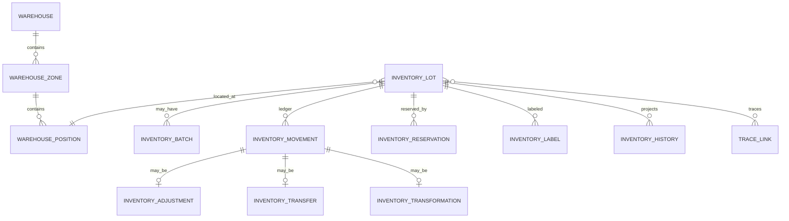
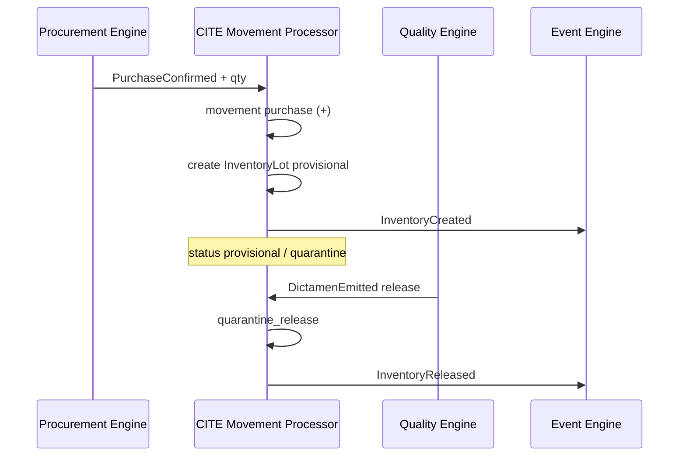

# AGROERP — Coffee Inventory & Traceability Engine (CITE)

**Versión:** 1.0  
**Estado:** Oficial — Especificación del motor de inventario y trazabilidad del café  
**Audiencia:** Bodega, logística, operaciones, calidad, comercial, arquitectura, auditoría, certificación  
**Naturaleza:** Motor empresarial de dominio — **no es un módulo CRUD de inventarios ni un WMS genérico**

---

## 0. Propósito y autoridad

El **Coffee Inventory & Traceability Engine (CITE)** controla el **flujo físico y lógico del café** desde su ingreso al almacén hasta su salida definitiva: posiciones, lotes, movimientos, reservas, transformaciones, cadena de custodia, kardex y trazabilidad alimentaria E2E.

| Pregunta | Documento que responde |
|----------|------------------------|
| ¿Qué procesos de inventario existen? | `COFFEE_DOMAIN.md` (CDP §4.9–4.12) |
| ¿Catálogos inventario? | `MASTER_DATA_ENGINE.md` (`inventory.*`) |
| ¿Compra e ingreso inicial? | `COFFEE_PROCUREMENT_ENGINE.md` (CPE) |
| ¿Dictamen y cuarentena? | `COFFEE_QUALITY_INTELLIGENCE_ENGINE.md` (CQIE) |
| ¿Monitoreo operativo? | `OPERATIONS_COMMAND_CENTER.md` |
| **¿Cómo se mueve y rastrea cada kg de café?** | **Este documento (CITE)** |

### Jerarquía documental

```
COFFEE_DOMAIN.md                          → Dominio cafetero
COFFEE_PROCUREMENT_ENGINE.md              → Compra → inventario provisional (CPE)
COFFEE_QUALITY_INTELLIGENCE_ENGINE.md     → Dictamen → estado stock (CQIE)
COFFEE_INVENTORY_TRACEABILITY_ENGINE.md   → Inventario y trazabilidad (CITE)
OPERATIONS_COMMAND_CENTER.md              → Alertas stock y capacidad
AEPS.md                                   → Implementación técnica
```

**Regla de oro:** En AGROERP **nunca se modifica cantidad de inventario directamente**. Todo cambio de stock es consecuencia de un **evento de movimiento** registrado en el CITE, con auditoría, kardex y trazabilidad asociados.

### Principios inviolables

| # | Principio | Descripción |
|---|-----------|-------------|
| I1 | **Event-sourced inventory** | Saldo = f(events); proyección materializada derivada |
| I2 | **No mutación directa de cantidad** | Prohibido `UPDATE quantity`; solo `InventoryMovement` |
| I3 | **Un kg trazable** | Cada unidad de masa pertenece a un `InventoryLot` con linaje |
| I4 | **Auditoría por movimiento** | Quién, cuándo, dónde, dispositivo, por qué, evento |
| I5 | **Cadena de custodia** | Toda manipulación física registrada |
| I6 | **Soft delete only** | Baja lógica; histórico inmutable |
| I7 | **Multi-warehouse native** | Bodegas, plantas, acopios, cuarentena |
| I8 | **Offline-aware** | Movimientos en cola con reconciliación |
| I9 | **Quality-gated stock** | Estado CQIE gobierna disponibilidad |
| I10 | **Commodity-extensible** | Core abstracto; café = primera implementación |

### Alcance

| Incluye | No incluye |
|---------|------------|
| Bodegas, zonas, posiciones, capacidad | UI bodega / escáner |
| Lotes inventario y batches | Compra en finca (CPE) |
| 20+ tipos de movimiento | Catación (CQIE) |
| Reservas, transferencias, transformaciones | Pago productor (CSFE) |
| Kardex y valorización | Contabilidad general (ERP externo) |
| Conteo físico y conciliación | Transporte entre ubicaciones (CLSE) |
| QR por lote y consulta trazabilidad | Despacho aduanero exportación (futuro) |
| Alertas stock y capacidad | |

---

## 1. Visión y arquitectura funcional

### 1.1 Visión

El CITE es el **ledger físico del café** en AGROERP — comparable en espíritu a:

| Referencia | Capacidad análoga |
|------------|-------------------|
| SAP EWM / WM | Ubicaciones, movimientos, lotes |
| Oracle Inventory + Lot Control | Trazabilidad lote |
| Food traceability systems | Cadena alimentaria E2E |
| Event sourcing inventory | Saldo como proyección de eventos |
| GS1 / RFID traceability | QR, identificación única |

### 1.2 Arquitectura conceptual

```mermaid
graph TB
    subgraph Clients["Clientes"]
        WEB[Web Bodega]
        AND[Android Bodega/Campo]
        QR[Portal QR consulta]
        OCC[Operations Command Center]
    end

    subgraph CITE["Coffee Inventory & Traceability Engine"]
        WHS[Warehouse Service]
        LOT[Lot Lifecycle Manager]
        MVE[Movement Event Processor]
        KDX[Kardex Service]
        RSV[Reservation Service]
        TRF[Transfer Service]
        TRX[Transformation Service]
        CYC[Cycle Count Service]
        COC[Chain of Custody Service]
        TRA[Traceability Graph Service]
        LBL[Label & QR Service]
        VAL[Inventory Validation Engine]
        PRJ[Stock Projection Store]
    end

    subgraph Platform["Plataforma"]
        EVT[Event Engine]
        WF[Workflow Engine]
        RES[Resource Engine]
        ID[Identity Engine]
        SYNC[Sync Foundation]
        GIS[GIS Engine]
        DOC[Document Engine]
    end

    subgraph Domain["Motores dominio"]
        CPE[Coffee Procurement Engine]
        CQIE[Coffee Quality Intelligence Engine]
        CSAE[Supply Agreement Engine]
        CSFE[Coffee Settlement & Financial Engine]
    end

    subgraph Delivery["Entrega"]
        NOTIF[Notification Engine]
        RPT[Reporting Engine]
        AI[AI Engine]
        DGMP[DGMP Lineage]
    end

    CPE --> MVE
    CQIE --> LOT
    MVE --> EVT
    EVT --> PRJ
    PRJ --> OCC
    LOT --> TRA
    MVE --> KDX
    Clients --> MVE
    AI --> PRJ
```



### 1.3 Componentes lógicos

| Componente | Responsabilidad |
|------------|-----------------|
| **Warehouse Service** | Jerarquía bodega → zona → posición |
| **Lot Lifecycle Manager** | Crear, dividir, fusionar, bloquear lotes |
| **Movement Event Processor** | Único punto de mutación de stock vía eventos |
| **Kardex Service** | Libro mayor inventario por lote/ubicación |
| **Reservation Service** | Reservas para despacho, venta, transformación |
| **Transfer Service** | Traslados inter-bodega / intra-bodega |
| **Transformation Service** | Mezcla, fracción, beneficio, empaque |
| **Cycle Count Service** | Conteos físicos y conciliación |
| **Chain of Custody Service** | Custodia física por manipulación |
| **Traceability Graph Service** | Grafo origen → transformaciones → destino |
| **Label & QR Service** | Etiquetas y consulta pública/autenticada |
| **Stock Projection Store** | Saldos materializados (derivados, no fuente) |

---

## 2. Modelo de entidades

### 2.1 Diagrama entidad-relación



### 2.2 Warehouse (bodega / centro de acopio / planta)

| Atributo | Descripción |
|----------|-------------|
| `warehouseId` | UUID |
| `warehouseCode` | Código único org |
| `name` | Nombre |
| `organizationId` | Tenant |
| `companyEntityId` | Entidad legal |
| `warehouseTypeCode` | `inventory.warehouse_type` |
| `address`, `municipalityId` | Ubicación |
| `gpsLocation` | Point (GIS) |
| `capacityKg` / `capacityM3` | Capacidad máxima |
| `currentUtilizationKg` | Proyección |
| `status` | `active`, `inactive`, `maintenance` |
| `managerUserId` | Responsable |
| `operatingHours` | Ventana operación |
| `certifications` | Alcance cert en bodega |

### 2.3 WarehouseZone (zona)

| Atributo | Descripción |
|----------|-------------|
| `zoneId` | UUID |
| `warehouseId` | Padre |
| `zoneCode` | |
| `zoneTypeCode` | `inventory.zone_type` + especializadas §4 |
| `name` | |
| `capacityKg` | |
| `temperatureControlled` | boolean |
| `humidityMonitoring` | boolean |
| `status` | `active`, `blocked` |

**Tipos zona semánticos:** acopio general, **cuarentena**, **rechazada**, **despacho**, **transformación**, **temporal**, silo, pila.

### 2.4 WarehousePosition (posición física)

Jerarquía opcional configurable:

```
Warehouse → Zone → Aisle (pasillo) → Rack (estantería) → Level (nivel) → Position (bin)
```

| Atributo | Descripción |
|----------|-------------|
| `positionId` | UUID |
| `zoneId` | |
| `aisleCode` | Pasillo |
| `rackCode` | Estantería |
| `levelCode` | Nivel |
| `binCode` | Posición final |
| `fullLocationCode` | `WH01-ZA-A03-R02-L04-B17` |
| `maxWeightKg` | |
| `occupied` | boolean (proyección) |
| `positionType` | `bulk`, `bag`, `silo`, `pallet` |

### 2.5 InventoryLot (lote inventario — unidad trazable)

| Atributo | Descripción |
|----------|-------------|
| `lotId` | UUID |
| `lotNumber` | Humano único org |
| `lotTypeCode` | `inventory.lot_type` — origen único, mezcla, transformado |
| `commodity` | `coffee` |
| `presentationCode` | cereza, pergamino, oro |
| `status` | §7 |
| `quantityKg` | **Proyección** — no editable directo |
| `reservedKg` | Proyección |
| `availableKg` | `quantity - reserved` (si no bloqueado) |
| `uomCode` | kg |
| `warehouseId`, `zoneId`, `positionId` | Ubicación actual |
| `qualityProfileCode` | Perfil CQIE |
| `dictamenId` | Dictamen CQIE vigente |
| `commercialProfileCode` | Clasificación comercial |
| `certificationCodes` | Certificaciones del lote |
| **Origen trazable** | |
| `producerId`, `farmId`, `agriculturalLotId` | Origen L1–L2 |
| `purchaseId` | CPE |
| `agreementId` | CSAE |
| `receptionId` | Recepción formal |
| `parentLotIds` | Si mezcla/transformación |
| `qrCode` | Identificador QR único |
| `rfidTag` | (futuro) |
| `createdAt`, `createdBy` | |
| `blockedReason` | Si bloqueado |
| `deletedAt` | Soft delete |

### 2.6 InventoryBatch (sub-lote / partida)

Subdivisión opcional dentro de un lote (ej. sacos, contenedores):

| Atributo | Descripción |
|----------|-------------|
| `batchId` | UUID |
| `lotId` | Padre |
| `batchNumber` | |
| `quantityKg` | |
| `packageId` | Si empacado |
| `labelId` | Etiqueta física |

### 2.7 InventoryMovement (movimiento — única vía de cambio)

| Atributo | Descripción |
|----------|-------------|
| `movementId` | UUID |
| `externalId` | Offline idempotencia |
| `movementTypeCode` | §3 |
| `movementStatus` | `pending`, `confirmed`, `reversed`, `rejected` |
| `lotId` | Lote afectado |
| `quantityKg` | Delta (+ entrada, − salida) |
| `balanceBeforeKg` | Kardex |
| `balanceAfterKg` | Kardex |
| `fromWarehouseId` / `toWarehouseId` | Transferencias |
| `fromPositionId` / `toPositionId` | |
| `unitCost` | Costo unitario movimiento |
| `totalCost` | |
| `referenceType` | `purchase`, `dispatch`, `adjustment`, etc. |
| `referenceId` | Documento origen |
| `eventId` | Event Engine |
| `workflowInstanceId` | Si requiere aprobación |
| `reasonCode` | Catálogo |
| `notes` | |
| `performedBy` | Usuario |
| `deviceId` | |
| `performedAt` | Timestamp |
| `correlationId` | |

### 2.8 InventoryReservation

| Atributo | Descripción |
|----------|-------------|
| `reservationId` | UUID |
| `lotId` | |
| `quantityKg` | |
| `purpose` | `dispatch`, `sale`, `transformation`, `sample` |
| `referenceId` | Orden venta, despacho, etc. |
| `expiresAt` | TTL |
| `status` | `active`, `fulfilled`, `released`, `expired` |

### 2.9 InventoryAdjustment

Ajuste autorizado post-conteo o corrección:

| Campo | Descripción |
|-------|-------------|
| `adjustmentId` | |
| `movementId` | Movimiento generado |
| `cycleCountId` | Origen si conteo |
| `varianceKg` | Diferencia |
| `approvalStatus` | Workflow |

### 2.10 InventoryTransfer

Par de movimientos balanceados (salida origen + entrada destino):

| Campo | Descripción |
|-------|-------------|
| `transferId` | |
| `outMovementId` | |
| `inMovementId` | |
| `inTransitStatus` | `planned`, `in_transit`, `received` |

### 2.11 InventoryTransformation

Mezcla, fracción, beneficio, empaque:

| Campo | Descripción |
|-------|-------------|
| `transformationId` | |
| `transformationType` | `blend`, `split`, `benefit`, `package`, `repackage`, `classify` |
| `inputLotIds` | Padres |
| `outputLotIds` | Hijos |
| `yieldPct` | Rendimiento |
| `lossKg` | Merma transformación |

### 2.12 InventoryCycleCount

| Campo | Descripción |
|-------|-------------|
| `cycleCountId` | |
| `countTypeCode` | `inventory.count_type` |
| `scope` | warehouse, zone, lot, position |
| `scheduledAt` | |
| `status` | `planned`, `in_progress`, `reconciled`, `closed` |
| `lines` | Array { lotId, expectedKg, countedKg, varianceKg } |

### 2.13 InventoryLoss / Merma

Especialización de movimiento `shrinkage` / `loss`:

| Campo | Descripción |
|-------|-------------|
| `lossId` | |
| `movementId` | |
| `shrinkageCauseCode` | `inventory.shrinkage_cause` |
| `evidenceIds` | Fotos, actas |

### 2.14 InventoryPackage / Container

| Entidad | Uso |
|---------|-----|
| `InventoryPackage` | Saco, fique, caja — peso tara conocido |
| `InventoryContainer` | Contenedor, pallet, big-bag |
| `InventoryLabel` | Etiqueta física impresa |
| `InventoryQRCode` | Payload QR + URL consulta |
| `InventoryRFID` | (futuro) EPC, tagId |

### 2.15 InventoryHistory

Proyección append-only derivada de movimientos:

| Campo | Descripción |
|-------|-------------|
| `historyId` | |
| `lotId` | |
| `movementId` | |
| `snapshotAt` | |
| `quantityKg` | Saldo post-movimiento |
| `locationCode` | |
| `status` | |
| `eventType` | |

---

## 3. Tipos de movimiento

Todos registrados en catálogo `inventory.movement_type` (extensible). **Cada tipo genera `InventoryMovement` + evento + kardex + custodia.**

| Código | Nombre | Efecto cantidad | Origen típico |
|--------|--------|-----------------|---------------|
| `reception` | Recepción | + | Recepción bodega |
| `purchase` | Compra | + | CPE confirmada |
| `manual_in` | Entrada manual | + | Ajuste aprobado |
| `dispatch_out` | Despacho / salida | − | Orden despacho |
| `transfer_out` | Transferencia salida | − | Transfer Service |
| `transfer_in` | Transferencia entrada | + | Par de transfer_out |
| `reserve` | Reserva | −available | Reservation Service |
| `release_reserve` | Liberación reserva | +available | Cancelación reserva |
| `transform_consume` | Consumo transformación | − | Transformación |
| `transform_produce` | Producción transformación | + | Nuevo lote hijo |
| `classification` | Clasificación / reclasificación | ±0 o cambio lote | CQIE + CCE |
| `blend` | Mezcla | −padres +hijo | Homogenización |
| `split` | Fraccionamiento | −padre +hijos | División lote |
| `package` | Empaque | ±0 (cambio package) | Empaque |
| `repackage` | Reempaque | ±0 | |
| `shrinkage` | Merma | − | Secado, manipulación |
| `loss` | Pérdida | − | Robo, accidente |
| `adjustment_plus` | Ajuste positivo | + | Conteo físico |
| `adjustment_minus` | Ajuste negativo | − | Conteo físico |
| `cycle_count` | Conteo (registro) | 0 | Snapshot conteo |
| `correction` | Corrección autorizada | ± | Error operativo |
| `return_in` | Devolución entrada | + | Devolución productor/cliente |
| `return_out` | Devolución salida | − | |
| `reversal` | Anulación / reverso | ±opuesto | Contra-movimiento |
| `quarantine_in` | Ingreso cuarentena | Cambio zona/status | CQIE |
| `quarantine_release` | Liberación cuarentena | Cambio status | Dictamen CQIE |
| `block` | Bloqueo lote | status only | Auditoría |
| `unblock` | Desbloqueo | status | |

### 3.1 Reglas de movimiento

| Regla | Descripción |
|-------|-------------|
| CITE-M01 | Movimiento `confirmed` es **inmutable**; corrección solo vía `reversal` |
| CITE-M02 | Transferencia = `transfer_out` + `transfer_in` vinculados o atómico |
| CITE-M03 | Salida no puede exceder `availableKg` del lote |
| CITE-M04 | Lote en `quarantine` o `blocked` no permite salida comercial |
| CITE-M05 | Mezcla exige ≥2 lotes padre con trazabilidad preservada en hijo |
| CITE-M06 | División: Σ hijos = padre − merma declarada |
| CITE-M07 | Anulación genera `reversal` con referencia al movimiento original |

---

## 4. Ubicaciones y zonas especiales

### 4.1 Jerarquía física

```
Organization
 └── Warehouse (bodega / acopio / planta)
      └── Zone (zona funcional)
           └── [Aisle] → [Rack] → [Level] → Position (bin)
```

### 4.2 Zonas funcionales estándar

| Zona | Código tipo | Uso |
|------|-------------|-----|
| Acopio general | `storage` | Stock disponible |
| Cuarentena | `quarantine` | Pendiente dictamen CQIE |
| Rechazada | `rejected` | Café no comercial |
| Despacho | `dispatch_staging` | Pre-salida |
| Transformación | `processing` | Beneficio, mezcla, empaque |
| Temporal | `staging` | Recepción en tránsito interno |
| Muestras | `samples` | Custodia laboratorio |

### 4.3 GIS

- Bodegas georreferenciadas
- Distancia finca → bodega (KPI logístico)
- Mapa ocupación por bodega (OCC)

---

## 5. Gestión de lotes (Lot Lifecycle Manager)

| Operación | Mecanismo | Trazabilidad |
|-----------|-----------|--------------|
| **Crear lote** | Movimiento `purchase`/`reception` | Origen CPE, finca |
| **Fusionar lotes** | `blend` + Transformation | `parentLotIds[]` en hijo |
| **Dividir lote** | `split` + Transformation | Hijos referencian padre |
| **Bloquear lote** | `block` + status | Motivo + workflow |
| **Liberar lote** | `unblock` / `quarantine_release` | Dictamen CQIE |
| **Cambiar estado** | Evento estado + movimiento si aplica | Historial |
| **Reservar lote** | Reservation Service | Sin cambio físico |
| **Mover lote** | `transfer_*` o cambio posición | Custodia |
| **Transformar lote** | Transformation Service | Grafo linaje |
| **Eliminar** | **Solo soft delete** si qty=0 y sin referencias activas | `deletedAt` |

### 5.1 Invariantes de lote

- `quantityKg` ≥ 0 siempre
- Lote `agotado` cuando qty = 0 y sin reservas
- Mezcla certificada orgánica + convencional → hijo `conventional` o NC CQIE
- QR único por lote activo; al dividir, hijos reciben QR nuevos con linaje

---

## 6. Trazabilidad

### 6.1 Grafo de trazabilidad (`TraceLink`)

Cada `InventoryLot` mantiene enlaces a:

| Entidad | Obligatorio | Fuente |
|---------|-------------|--------|
| Productor | Sí (mínimo L0) | CPE |
| Finca | Según política L1+ | CPE |
| Lote agrícola | L2+ | FTIP LotUnit |
| Compra | Sí | CPE `purchaseId` |
| Contrato / acuerdo | Si aplica | CSAE |
| Comprador | Sí | CPE |
| Inspector / laboratorio | Si dictamen | CQIE |
| Resultados calidad | Sí post-lab | CQIE `evaluationId`, `dictamenId` |
| Fotografías / videos | Recomendado | CPE, CQIE, bodega |
| Documentos | Si aplica | Document Engine |
| Firmas | Compra/recepción | CPE |
| Ubicación actual | Sí | Warehouse/Position |
| Eventos | Todos movimientos | Event Engine |
| Historial | Completo | InventoryHistory |

### 6.2 Consulta trazabilidad (QR / API lógica)

Escaneo QR lote → respuesta:

- Origen: productor, finca, lote agrícola
- Compra y fecha
- Calidad: dictamen, puntaje, humedad
- Ubicación actual
- Movimientos resumidos (kardex)
- Certificaciones
- Estado (disponible, cuarentena, despachado)
- Documentos enlazados

### 6.3 Integración DGMP

- **DGMP Lineage Service:** lineage técnico de datos
- **CITE Traceability Graph:** semántica **producto alimentario** y cadena física

---

## 7. Estados

### 7.1 InventoryLot

| Estado | Descripción | Permite despacho |
|--------|-------------|------------------|
| `provisional` | Creado CPE, pendiente recepción formal | No |
| `quarantine` | Retenido CQIE | No |
| `available` | Disponible | Sí |
| `reserved` | Parcial/total reservado | Solo reserva |
| `blocked` | Auditoría, investigación | No |
| `in_transit` | Entre bodegas | No |
| `in_transformation` | En proceso | No |
| `rejected` | No comercial | No |
| `depleted` | Cantidad cero | No |
| `archived` | Histórico | No |

### 7.2 InventoryMovement

`pending` → `confirmed` | `rejected`  
`confirmed` → `reversed` (solo vía movimiento reversa)

### 7.3 InventoryTransfer

`draft` → `approved` → `in_transit` → `completed` | `cancelled`

---

## 8. Cadena de custodia (Chain of Custody Service)

Cada manipulación física registra:

| Campo | Descripción |
|-------|-------------|
| `custodyEventId` | UUID |
| `lotId` | |
| `action` | `received`, `moved`, `weighed`, `sampled`, `transformed`, `dispatched`, `sealed` |
| `who` | userId + role |
| `when` | timestamp |
| `where` | warehouse/position/GPS |
| `deviceId` | |
| `whatChanged` | JSON diff |
| `why` | reasonCode + notes |
| `associatedEventId` | Event Engine |
| `workflowInstanceId` | Si aplica |
| `signatureId` | Recepción/despacho |
| `photoEvidenceIds` | |

**Principio:** Si no hay custodia, no hay movimiento confirmado (salvo política excepción documentada).

---

## 9. Inventario físico (Cycle Count Service)

### 9.1 Tipos de conteo

| Tipo | Alcance |
|------|---------|
| **Cíclico** | Rotación ABC por zona/lote |
| **General** | Bodega completa — campaña/cierre |
| **Por zonas** | Una zona |
| **Por lotes** | Lista lotes específicos |
| **Por QR** | Escaneo móvil posición/lote |
| **Por RFID** (futuro) | Lectura masiva |

### 9.2 Flujo conteo

1. Planificación → `CycleCountScheduled`
2. Congelar movimientos en scope (opcional) o snapshot expected
3. Captura conteos (Android offline)
4. Conciliación automática: `variance = counted - expected`
5. Varianza dentro tolerancia → auto-ajuste
6. Varianza fuera tolerancia → workflow aprobación + `adjustment_*`
7. Cierre → KPI exactitud inventario

### 9.3 Gestión diferencias

| Severidad varianza | Acción |
|--------------------|--------|
| < 0.5% | Auto-ajuste configurable |
| 0.5–2% | Supervisor aprueba |
| > 2% | Gerencia + incidente OCC + investigación |

---

## 10. Kardex empresarial

### 10.1 Estructura línea kardex

| Campo | Descripción |
|-------|-------------|
| `kardexLineId` | |
| `lotId` | |
| `warehouseId` | |
| `movementId` | |
| `movementTypeCode` | |
| `movementDate` | |
| `balanceBeforeKg` | Saldo anterior |
| `quantityDeltaKg` | Movimiento (+/−) |
| `balanceAfterKg` | Saldo nuevo |
| `unitCost` | Costo unitario |
| `totalCost` | Costo movimiento |
| `accumulatedValue` | Valor saldo post |
| `referenceType` / `referenceId` | Documento origen |
| `documentNumber` | Comprobante |
| `userId` | |
| `eventId` | |
| `notes` | |

### 10.2 Niveles de kardex

| Nivel | Agregación |
|-------|------------|
| Por lote | Trazabilidad fina |
| Por bodega | Consolidado ubicación |
| Por productor | Roll-up origen |
| Por campaña | Cierre comercial |
| Por perfil calidad | Comercial |

### 10.3 Valorización

- Costo de adquisición desde CPE / Finance
- Costo adicional transformación (merma, beneficio)
- Métodos configurables: **promedio ponderado**, FIFO (política org)
- Integración CSFE para liquidación y valorización (futuro)

---

## 11. Alertas configurables

Publicadas a **OCC Alert Engine** y Notification Engine.

| ID | Alerta | Condición |
|----|--------|-----------|
| CITE-ALT-01 | Stock mínimo | qty < min por lote/perfil |
| CITE-ALT-02 | Stock máximo | qty > max |
| CITE-ALT-03 | Lote vencido | `retentionDate` superada |
| CITE-ALT-04 | Lote inmovilizado | Sin movimiento > N días |
| CITE-ALT-05 | Sin movimiento | Zona/lote estancado |
| CITE-ALT-06 | Capacidad bodega | > 90% utilización |
| CITE-ALT-07 | Pérdida del día | Σ loss > umbral |
| CITE-ALT-08 | Merma acumulada | % sobre entradas periodo |
| CITE-ALT-09 | Diferencia conteo | Varianza pendiente |
| CITE-ALT-10 | Reserva por expirar | TTL reserva |
| CITE-ALT-11 | Cuarentena prolongada | > SLA CQIE |
| CITE-ALT-12 | Discrepancia CPE vs recepción | Peso |

---

## 12. QR y etiquetas

### 12.1 InventoryQRCode

| Campo | Descripción |
|-------|-------------|
| `qrId` | |
| `lotId` | |
| `payload` | URL + lotNumber + hash integridad |
| `printedAt` | |
| `labelVersion` | |

### 12.2 Consulta QR (vista autorizada / pública limitada)

| Rol | Ve |
|-----|-----|
| Bodega / calidad | Todo |
| Comercial | Origen, calidad, disponibilidad |
| Auditor | Histórico completo |
| Público (exportación) | Origen certificado, sin datos sensibles productor |

### 12.3 RFID (preparación futura)

- Campo `rfidTag` en lote y package
- Lectura bulk en conteo y despacho
- Mapeo QR ↔ RFID

---

## 13. Flujos operativos principales

### 13.1 Compra CPE → inventario



### 13.2 Recepción bodega (Fase 2)

1. Llegada física — pesaje báscula
2. Movimiento `reception` — conciliación con CPE
3. Muestra CQIE
4. Ubicación en zona

### 13.3 Despacho

1. Orden despacho → Reservation
2. Picking por FEFO/FIFO (política)
3. Movimiento `dispatch_out`
4. Custodia + firma + documento
5. Lote `depleted` o parcial

### 13.4 Mezcla (blend)

1. Workflow aprobación si certificación
2. Transformation: consume lotes padre
3. Crea lote hijo con `parentLotIds`
4. Preserva trazabilidad multi-origen

---

## 14. Workflow Engine

| workflowKey | Uso |
|-------------|-----|
| `inventory.adjustment.approval` | Ajustes fuera tolerancia |
| `inventory.transfer.approval` | Traslado inter-regional |
| `inventory.blend.approval` | Mezcla certificada |
| `inventory.loss.report` | Pérdida > umbral |
| `inventory.block` | Bloqueo lote |
| `inventory.reversal` | Anulación movimiento |
| `inventory.cyclecount.variance` | Varianza conteo |

---

## 15. Eventos de dominio

| Evento | Cuándo |
|--------|--------|
| `InventoryLotCreated` | Nuevo lote |
| `InventoryLotSplit` | División |
| `InventoryLotBlended` | Mezcla |
| `InventoryLotBlocked` | Bloqueo |
| `InventoryLotReleased` | Liberación cuarentena |
| `InventoryLotDepleted` | Saldo cero |
| `InventoryMovementRecorded` | Movimiento pendiente |
| `InventoryMovementConfirmed` | Stock actualizado |
| `InventoryMovementReversed` | Reverso |
| `InventoryReserved` | Reserva |
| `InventoryReservationReleased` | Liberación |
| `InventoryTransferred` | Traslado completado |
| `InventoryTransformed` | Transformación |
| `InventoryShrinkageRecorded` | Merma |
| `InventoryLossRecorded` | Pérdida |
| `InventoryAdjusted` | Ajuste conteo |
| `CycleCountStarted` | Inicio conteo |
| `CycleCountReconciled` | Conciliación |
| `CustodyEventRecorded` | Cadena custodia |
| `InventoryQRGenerated` | Etiqueta |
| `StockBelowMinimum` | Alerta |
| `WarehouseCapacityWarning` | Alerta |
| `TraceabilityQueryExecuted` | Auditoría consulta |

**Alias CDP:** `MovimientoInventarioCreado`, `InventarioActualizado`, `MermaRegistrada`, `DespachoRealizado`.

---

## 16. Integraciones

| Motor | Dirección | Uso |
|-------|-----------|-----|
| **Coffee Procurement Engine** | Consume | `PurchaseConfirmed` → entrada |
| **Coffee Quality Intelligence Engine** | Bidireccional | Cuarentena, liberación, perfil |
| **Coffee Supply Agreement Engine** | Consume | Trazabilidad contrato |
| **Coffee Settlement & Financial Engine** | CITE publica | Valorización, costo movimiento |
| **Workflow Engine** | Bidireccional | Aprobaciones |
| **Event Engine** | CITE publica | Fuente verdad eventos stock |
| **Identity Engine** | Consume | Permisos bodega |
| **GIS Engine** | Consume | Ubicación bodegas |
| **Document Engine** | Bidireccional | Guías, tickets báscula |
| **Notification Engine** | CITE publica | Alertas |
| **Operations Command Center** | CITE alimenta | Stock, capacidad, backlog |
| **Reporting Engine** | CITE alimenta | §17 |
| **AI Engine** | Bidireccional | §18 |
| **Sync Foundation** | Bidireccional | Movimientos offline bodega |
| **DGMP** | Bidireccional | Lineage |
| **Android Offline** | Cliente | Conteo, movimiento, QR scan |

### 16.1 Permisos Identity

| Permiso | Descripción |
|---------|-------------|
| `inventory:lot:read` | Consultar lotes |
| `inventory:lot:create` | Crear vía movimiento |
| `inventory:movement:create` | Registrar movimiento |
| `inventory:movement:confirm` | Confirmar |
| `inventory:movement:reverse` | Reverso |
| `inventory:transfer:create` | Traslados |
| `inventory:reservation:manage` | Reservas |
| `inventory:transform:execute` | Mezcla, split, empaque |
| `inventory:adjustment:propose` | Proponer ajuste |
| `inventory:adjustment:approve` | Aprobar |
| `inventory:cyclecount:execute` | Conteos |
| `inventory:warehouse:admin` | Config bodegas |
| `inventory:trace:read` | Trazabilidad completa |
| `inventory:trace:public` | Consulta QR limitada |
| `inventory:report` | Reportes |
| `inventory:audit` | Solo lectura auditoría |

---

## 17. Reportes

| Reporte | Contenido |
|---------|-----------|
| **Existencias** | Stock por bodega, zona, lote, estado |
| **Kardex** | Libro mayor por lote/bodega/periodo |
| **Movimientos** | Diario de movimientos |
| **Trazabilidad** | Cadena completa lote → origen |
| **Inventario valorizado** | qty × costo |
| **Inventario físico** | Conteo vs sistema |
| **Diferencias** | Varianzas abiertas/cerradas |
| **Rotación** | Días en stock, FEFO/FIFO |
| **Capacidad** | Ocupación bodegas |
| **Mermas y pérdidas** | Por causa, periodo, bodega |

---

## 18. KPIs

| KPI | Fórmula / definición |
|-----|----------------------|
| **Rotación inventario** | Costo ventas / inventario promedio |
| **Ocupación bodega** | kg almacenados / capacidad × 100 |
| **Tiempo almacenamiento** | Promedio días lote en stock |
| **Exactitud inventario** | 1 − \|varianza\| / total contado |
| **Productividad bodega** | Movimientos / hora / operario |
| **Costo logístico** | Costo interno / kg movido |
| **Lotes inmovilizados** | Count sin movimiento > N días |
| **Pérdidas** | Σ loss / Σ entradas × 100 |
| **Merma** | Σ shrinkage / Σ entradas × 100 |
| **Tiempo cuarentena** | Recepción → liberación CQIE |
| **Fill rate despacho** | Despachos completos / órdenes |

Segmentación: bodega, regional, campaña, perfil calidad, certificación, presentación.

---

## 19. Inteligencia artificial

| Caso | Entrada | Salida |
|------|---------|--------|
| **Predicción ocupación** | Histórico entradas, campaña, compras CPE | % capacidad proyectada |
| **Predicción pérdidas** | Humedad, tiempo stock, clima bodega | Riesgo merma/moho |
| **Optimización ubicaciones** | Rotación, peso, perfil | Posición sugerida |
| **Recomendación despacho** | FEFO, pedidos cliente, perfil | Lotes prioritarios |
| **Detección anomalías** | Patrones movimiento, peso | Alerta fraude/error |
| **Optimización layout** | Flujo movimientos, heatmap | Reconfiguración zonas |
| **Demanda almacenamiento** | Pipeline compras | Espacio requerido 30d |

Principios: IA asistiva; no confirma movimientos sin humano.

---

## 20. Escalabilidad multi-commodity

### 20.1 Patrón Abstract Inventory & Traceability Engine

| Capa | Café | Cacao (futuro) |
|------|------|----------------|
| Core CITE | Event-sourced movements, kardex, QR | Igual |
| Lot semantics | pergamino, oro | grano seco, baba |
| Transformation | blend, trilla | fermentación, secado |
| UOM | kg | kg, bultos |

### 20.2 APOS registration

```yaml
pluginId: agro.coffee.inventory_traceability
commodity: coffee
resourceTypes:
  - coffee.inventory_lot
  - coffee.inventory_movement
  - coffee.warehouse
dependsOn:
  - agro.coffee.procurement
  - agro.coffee.quality_intelligence
eventNamespace: coffee.inventory
```

---

## 21. Riesgos

| Categoría | Riesgo | Mitigación CITE |
|-----------|--------|-----------------|
| Operativo | Movimiento sin custodia | COC obligatorio |
| Técnico | Doble confirmación sync | externalId idempotencia |
| Trazabilidad | Mezcla pierde origen | parentLotIds obligatorio |
| Certificación | Despacho lote cuarentena | Estado + CQIE gate |
| Financiero | Kardex desalineado costo | Event sourcing único |
| Fraude | Ajuste inventario abusivo | Workflow + auditoría |
| Capacidad | Sobrecupo bodega | Alertas OCC |
| Calidad | Stock humedad alta deteriora | Integración sensores (futuro) |

---

## 22. Roadmap evolutivo

| Fase | Entregables | Dependencias |
|------|-------------|--------------|
| **F1 — Núcleo** | Warehouse, Lot, Movement processor, kardex, eventos | Event Engine |
| **F2 — CPE/CQIE** | Entrada compra, cuarentena, liberación | CPE, CQIE |
| **F3 — Reservas y despacho** | Reservation, dispatch_out | Comercial |
| **F4 — Transferencias** | Inter/intra bodega | GIS |
| **F5 — Transformaciones** | Blend, split, empaque | Workflow |
| **F6 — Conteo físico** | Cycle count Android offline | Sync |
| **F7 — QR y trazabilidad** | Label service, portal consulta | Document |
| **F8 — IA y RFID** | Predicción, RFID | AI Engine |
| **F9 — Multi-commodity** | Plugin cacao | Cacao domain |

---

## 23. Checklist de cumplimiento

- [ ] Stock solo vía `InventoryMovement` confirmado
- [ ] Kardex por cada movimiento confirmado
- [ ] Custodia en manipulaciones físicas
- [ ] QR único por lote activo
- [ ] Trazabilidad a productor/compra/CQIE
- [ ] Sin DELETE físico de lotes movidos
- [ ] Eventos en APOS Event Catalog
- [ ] Permisos `inventory:*` Identity
- [ ] Proyección OCC stock y capacidad
- [ ] Registro plugin APOS
- [ ] Ficha Data Catalog DGMP

---

## 24. Conclusión

El **Coffee Inventory & Traceability Engine (CITE)** es el **estándar oficial** de inventario en AGROERP. Garantiza:

- **Inventario basado en eventos** — sin mutación directa de cantidades
- **18+ entidades** modeladas (bodega, lote, movimiento, reserva, transformación, QR, kardex…)
- **25+ tipos de movimiento** con reglas e invariantes
- **Trazabilidad E2E** a productor, finca, compra, calidad, documentos y eventos
- **Jerarquía de ubicaciones** hasta posición bin
- **Gestión completa de lotes** — crear, fusionar, dividir, bloquear, transformar
- **Cadena de custodia** auditable
- **Conteo físico** cíclico, por QR, conciliación automática
- **Kardex empresarial** con saldo anterior/nuevo, costo y referencia
- **12+ alertas** configurables
- **QR único** por lote con consulta de historial
- **10 reportes** y **11 KPIs** operativos
- **7 casos de IA** y extensión **multi-commodity**

**No es un módulo tradicional de inventarios** — es el **ledger físico trazable** del café, integrado nativamente con CPE, CQIE, CSAE y la plataforma APOS.

---

*Documento elaborado para AGROERP — Coffee Inventory & Traceability Engine v1.0.*  
*Jerarquía:* `COFFEE_QUALITY_INTELLIGENCE_ENGINE.md` → **`COFFEE_INVENTORY_TRACEABILITY_ENGINE.md`** → CLSE / CSFE  
*Próximo paso recomendado:* Fase F1 — Movement Event Processor + Warehouse + Lot + Kardex.  
*Handoff logístico:* `COFFEE_LOGISTICS_SUPPLY_CHAIN_ENGINE.md` — despachos y recepciones físicas.  
*Handoff financiero:* `COFFEE_SETTLEMENT_FINANCIAL_ENGINE.md` — valorización y liquidación.
