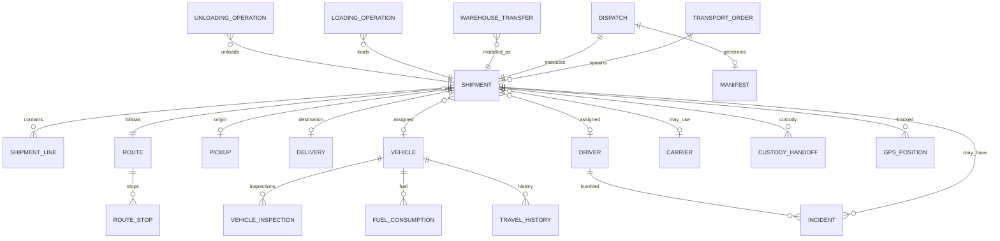
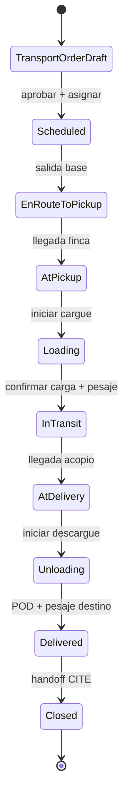

# AGROERP — Coffee Logistics & Supply Chain Execution Engine (CLSE)

**Versión:** 1.0  
**Estado:** Oficial — Especificación del motor de ejecución logística y cadena de suministro del café  
**Audiencia:** Logística, operaciones, bodega, transporte, comercial, arquitectura, auditoría, certificación  
**Naturaleza:** Motor empresarial de dominio — **no es un módulo de transporte ni un TMS genérico**

---

## 0. Propósito y autoridad

El **Coffee Logistics & Supply Chain Execution Engine (CLSE)** controla **absolutamente todo el movimiento físico del café** desde la finca hasta el cliente final: recolección, transporte, rutas, centros de acopio, bodegas, despachos, transferencias, entregas, recepciones, flota, conductores, cadena de custodia y ejecución operativa en tránsito.

| Pregunta | Documento que responde |
|----------|------------------------|
| ¿Qué procesos logísticos existen? | `COFFEE_DOMAIN.md` (CDP §4.8–4.9, §2.5) |
| ¿Catálogos logística? | `MASTER_DATA_ENGINE.md` (`logistics.*`) |
| ¿Compra en finca? | `COFFEE_PROCUREMENT_ENGINE.md` (CPE) |
| ¿Stock dentro de bodega? | `COFFEE_INVENTORY_TRACEABILITY_ENGINE.md` (CITE) |
| ¿Calidad en tránsito / recepción? | `COFFEE_QUALITY_INTELLIGENCE_ENGINE.md` (CQIE) |
| ¿Monitoreo operativo? | `OPERATIONS_COMMAND_CENTER.md` |
| **¿Cómo se mueve físicamente el café entre ubicaciones?** | **Este documento (CLSE)** |

### Jerarquía documental

```
COFFEE_PROCUREMENT_ENGINE.md              → Compra finca (origen físico)
COFFEE_LOGISTICS_SUPPLY_CHAIN_ENGINE.md   → Movimiento físico E2E (CLSE)
COFFEE_INVENTORY_TRACEABILITY_ENGINE.md   → Stock en bodega (CITE)
COFFEE_QUALITY_INTELLIGENCE_ENGINE.md     → Dictamen post-recepción (CQIE)
COFFEE_SETTLEMENT_FINANCIAL_ENGINE.md     → Costos transporte productor (CSFE)
OPERATIONS_COMMAND_CENTER.md              → Control tower logístico
AEPS.md                                   → Implementación técnica
```

**Regla de oro:** El café **en tránsito** pertenece al CLSE; el café **almacenado** pertenece al CITE. Toda transición finca → acopio → bodega → cliente se ejecuta como **Shipment** con cadena de custodia auditable. Ningún movimiento de inventario CITE ocurre sin evento logístico de recepción o despacho confirmado en CLSE (salvo ajustes internos de bodega).

### Distinción crítica

| Sistema | Responsabilidad |
|---------|-----------------|
| **TMS genérico** | Transporte de carga general |
| **WMS / CITE** | Ubicación, lote y saldo **dentro** de bodega |
| **CLSE** | Ejecución física **entre** ubicaciones — recolección, ruta, entrega |
| **GIS Engine** | Mapas, geocercas, optimización espacial (servicio plataforma) |
| **CPE** | Compra en origen; solicita recolección |

### Principios inviolables

| # | Principio | Descripción |
|---|-----------|-------------|
| L1 | **Shipment-centric execution** | Toda operación física se modela como Shipment o TransportOrder |
| L2 | **Custody at every handoff** | Quién, dónde, cuándo, GPS, evidencia en cada entrega de custodia |
| L3 | **Inventory handoff explicit** | CLSE confirma recepción/despacho → CITE emite movimiento |
| L4 | **Event per transition** | Cada cambio de estado publica evento de dominio |
| L5 | **Offline-capable field ops** | Carga, descarga, POD en campo sin red |
| L6 | **Idempotent operations** | `externalId` en Pickup, Delivery, GPS batch |
| L7 | **Route as living object** | Rutas reordenables, desvíos y reprogramaciones versionadas |
| L8 | **Fleet master data** | Vehículos y conductores con documentación vigente |
| L9 | **QR per dispatch** | Cada despacho genera QR validable E2E |
| L10 | **Commodity-extensible** | Core abstracto; café = primera implementación |

### Alcance

| Incluye | No incluye |
|---------|------------|
| Recolección finca → acopio | UI conductor / despachador |
| Transporte inter-bodega | Stock y posiciones internas (CITE) |
| Despacho a cliente / planta | Compra y liquidación productor (CPE/CSFE) |
| Rutas, paradas, optimización | Dictamen laboratorio (CQIE) |
| Flota propia y transportistas externos | Contabilidad costos corporativos (ERP externo) |
| GPS, telemetría, geocercas | Aduana exportación (motor futuro) |
| Cadena de custodia en tránsito | |
| Incidentes, POD, manifiestos | |
| Integración Workflow completa | |

---

## 1. Visión y arquitectura funcional

### 1.1 Visión

El CLSE es el **sistema nervioso logístico** de AGROERP — comparable en espíritu a:

| Referencia | Capacidad análoga |
|------------|-------------------|
| SAP TM / LE-TRA | Órdenes transporte, ejecución, POD |
| Oracle Transportation Management | Planificación y ejecución |
| FourKites / project44 | Visibilidad en tránsito |
| Food chain custody systems | Trazabilidad alimentaria en movimiento |
| Agribusiness elevator logistics | Recolección campo → acopio |
| Last-mile POD platforms | Firma, foto, QR entrega |

### 1.2 Arquitectura conceptual

```mermaid
graph TB
    subgraph Clients["Clientes"]
        WEB[Web Logística]
        AND[Android Conductor/Campo]
        OCC[Operations Command Center]
        EXT[Portal Transportista]
    end

    subgraph CLSE["Coffee Logistics & Supply Chain Execution Engine"]
        TOS[Transport Order Service]
        SHP[Shipment Execution Service]
        RTE[Route Engine]
        FLT[Fleet Management Service]
        DRV[Driver Service]
        LDG[Loading Operation Service]
        ULG[Unloading Operation Service]
        COC[Chain of Custody Service]
        GPS[GPS Telemetry Service]
        INC[Incident Service]
        MAN[Manifest Generator]
        POD[Proof of Delivery Service]
        VAL[Logistics Validation Engine]
        QR[Dispatch QR Service]
        PRJ[In-Transit Projection Store]
    end

    subgraph Platform["Plataforma"]
        WF[Workflow Engine]
        EVT[Event Engine]
        RES[Resource Engine]
        ID[Identity Engine]
        GIS[GIS Engine]
        DOC[Document Engine]
        SYNC[Sync Foundation]
        NOTIF[Notification Engine]
    end

    subgraph Domain["Motores dominio"]
        CPE[Coffee Procurement Engine]
        CITE[Inventory Engine]
        CQIE[Quality Engine]
        CSFE[Settlement Engine]
        CSAE[Supply Agreement Engine]
    end

    CPE --> TOS
    CITE --> SHP
    SHP --> CITE
  CQIE --> SHP
    CLSE --> EVT
    EVT --> PRJ
    PRJ --> OCC
    GIS --> RTE
    Clients --> CLSE
```



### 1.3 Componentes lógicos

| Componente | Responsabilidad |
|------------|-----------------|
| **Transport Order Service (TOS)** | Solicitud y programación de movimiento físico |
| **Shipment Execution Service** | Ciclo de vida Shipment: carga → tránsito → entrega |
| **Route Engine** | Paradas, prioridades, optimización, geocercas |
| **Fleet Management Service** | Vehículos, trailers, disponibilidad, documentación |
| **Driver Service** | Conductores, licencias, capacitaciones, estado |
| **Loading / Unloading Operation Service** | Operaciones de cargue y descargue con pesaje |
| **Chain of Custody Service** | Handoffs auditable entre actores |
| **GPS Telemetry Service** | Posiciones, velocidad, paradas, desvíos |
| **Incident Service** | Novedades operativas en ruta |
| **Manifest Generator** | Manifiesto de carga consolidado |
| **Proof of Delivery Service** | POD con firma, foto, QR |
| **Dispatch QR Service** | Generación y validación QR por despacho |
| **Logistics Validation Engine** | Pre-ejecución: docs, capacidad, ventanas |
| **In-Transit Projection Store** | Café en tránsito materializado (derivado) |

---

## 2. Modelo de entidades

### 2.1 Diagrama agregados



### 2.2 TransportOrder (orden de transporte)

Solicitud de movimiento físico — puede originarse en CPE (post-compra), CITE (despacho) o planificación manual.

| Atributo | Descripción |
|----------|-------------|
| `transportOrderId` | UUID |
| `transportOrderNumber` | Humano |
| `organizationId` | Tenant |
| `orderType` | `pickup`, `delivery`, `transfer`, `return`, `mixed` |
| `priority` | `low`, `normal`, `high`, `urgent` |
| `status` | §9 |
| `originType` | `farm`, `collection_center`, `warehouse`, `customer`, `plant` |
| `originId` | Recurso origen |
| `originAddress` | Dirección normalizada |
| `originGeo` | Point (GIS) |
| `destinationType` | Igual catálogo |
| `destinationId` | |
| `destinationAddress` | |
| `destinationGeo` | |
| `requestedPickupWindowStart` | Ventana recolección |
| `requestedPickupWindowEnd` | |
| `requestedDeliveryWindowStart` | Ventana entrega |
| `requestedDeliveryWindowEnd` | |
| `commodityCode` | `coffee` (extensible) |
| `estimatedQuantityKg` | |
| `presentationCode` | cereza, pergamino, oro |
| `loadUnitTypeCode` | `logistics.load_unit_type` |
| `referenceType` | `purchase`, `dispatch`, `transfer`, `manual` |
| `referenceId` | purchaseId, dispatchId, etc. |
| `assignedBuyerId` | Comprador (recolección) |
| `preferredCarrierId` | Transportista preferido |
| `specialInstructions` | Texto |
| `workflowInstanceId` | |
| `createdBy` | |
| `createdAt` | |

**Invariante:** Una `TransportOrder` aprobada genera uno o más `Shipment`.

### 2.3 Shipment (envío / viaje ejecutable)

Unidad atómica de ejecución logística.

| Atributo | Descripción |
|----------|-------------|
| `shipmentId` | UUID |
| `shipmentNumber` | Humano |
| `transportOrderId` | Padre |
| `organizationId` | |
| `shipmentType` | `inbound_pickup`, `inbound_delivery`, `inter_warehouse`, `outbound_sale`, `outbound_processing`, `return` |
| `status` | §9 |
| `routeId` | Ruta asignada |
| `vehicleId` | |
| `trailerId` | Opcional |
| `driverId` | |
| `carrierId` | Si transporte externo |
| `buyerId` | Comprador asignado (recolección) |
| `dispatchId` | Si vinculado a despacho CITE |
| `manifestId` | |
| `qrCode` | Payload único despacho |
| `plannedDepartureAt` | |
| `actualDepartureAt` | |
| `plannedArrivalAt` | |
| `actualArrivalAt` | |
| `grossWeightKg` | Pesaje salida |
| `netWeightKg` | Pesaje llegada (puede diferir) |
| `tareWeightKg` | |
| `temperatureC` | Si aplica cadena fría futura |
| `sealNumber` | Precinto |
| `custodyStatus` | `intact`, `broken`, `under_review` |
| `podId` | Proof of Delivery |
| `closedAt` | Cierre operación |
| `closedBy` | |
| `eventId` | Último evento significativo |

### 2.4 ShipmentLine (línea de carga)

| Atributo | Descripción |
|----------|-------------|
| `lineId` | UUID |
| `shipmentId` | |
| `lineNumber` | |
| `inventoryLotId` | Lote CITE (si conocido) |
| `purchaseId` | Compra CPE (recolección) |
| `productCode` | |
| `varietyCode` | |
| `presentationCode` | |
| `quantityKg` | |
| `bagCount` | Si sacos |
| `certificationCodes` | Orgánico, FT, etc. |
| `producerId` | Trazabilidad origen |
| `farmId` | |
| `qualityStatusCode` | Pre-dictamen |
| `notes` | |

### 2.5 Route (ruta)

| Atributo | Descripción |
|----------|-------------|
| `routeId` | UUID |
| `routeNumber` | |
| `routeTypeCode` | `logistics.route_type` |
| `organizationId` | |
| `status` | `draft`, `planned`, `active`, `completed`, `cancelled` |
| `plannedDate` | |
| `totalDistanceKm` | Calculado GIS |
| `estimatedDurationMin` | |
| `actualDurationMin` | |
| `optimizationProfile` | `distance`, `time`, `cost`, `priority` |
| `version` | Incrementa en reprogramación |
| `previousRouteId` | Si reemplazada |
| `geofenceIds` | Geocercas aplicables |
| `restrictionProfileId` | Pesos, horarios, vías |
| `assignedVehicleId` | |
| `assignedDriverId` | |
| `createdAt` | |

### 2.6 RouteStop (parada)

| Atributo | Descripción |
|----------|-------------|
| `stopId` | UUID |
| `routeId` | |
| `sequence` | Orden (reordenable) |
| `stopType` | `pickup`, `delivery`, `fuel`, `rest`, `weighbridge`, `checkpoint` |
| `locationType` | farm, warehouse, etc. |
| `locationId` | |
| `address` | |
| `geo` | Point |
| `plannedArrivalAt` | |
| `plannedDepartureAt` | |
| `actualArrivalAt` | |
| `actualDepartureAt` | |
| `priority` | 1 = más alta |
| `status` | `pending`, `arrived`, `in_progress`, `completed`, `skipped`, `failed` |
| `shipmentId` | Si parada atiende shipment específico |
| `dwellTimeMin` | Tiempo detenido calculado |
| `geofenceId` | Entrada/salida automática |
| `notes` | |

### 2.7 Pickup (recolección)

| Atributo | Descripción |
|----------|-------------|
| `pickupId` | UUID |
| `shipmentId` | |
| `externalId` | Offline idempotencia |
| `farmId` | |
| `producerId` | |
| `buyerId` | Comprador que recibe |
| `scheduledAt` | |
| `arrivedAt` | |
| `startedAt` | Inicio cargue |
| `completedAt` | |
| `grossWeightKg` | Báscula campo |
| `weighingMethodCode` | `purchase.weighing_method` |
| `evidenceBundleId` | Fotos, firma productor |
| `gpsAtPickup` | Point |
| `purchaseIds` | Compras CPE vinculadas |
| `status` | `scheduled`, `in_progress`, `completed`, `partial`, `failed`, `cancelled` |
| `failureReasonCode` | |
| `performedBy` | Conductor/comprador |

### 2.8 Delivery (entrega)

| Atributo | Descripción |
|----------|-------------|
| `deliveryId` | UUID |
| `shipmentId` | |
| `externalId` | |
| `destinationType` | warehouse, customer, plant |
| `destinationId` | |
| `scheduledAt` | |
| `arrivedAt` | |
| `unloadedAt` | |
| `receivedBy` | Usuario/recurso receptor |
| `receivedByName` | Si externo |
| `grossWeightKg` | Pesaje destino |
| `weightVarianceKg` | vs salida |
| `varianceWithinTolerance` | bool |
| `podId` | |
| `receptionId` | Handoff CITE |
| `status` | §9 |
| `rejectionReasonCode` | Si rechazo parcial/total |
| `gpsAtDelivery` | |

### 2.9 Vehicle (vehículo)

| Atributo | Descripción |
|----------|-------------|
| `vehicleId` | UUID |
| `organizationId` | |
| `plateNumber` | Único por org |
| `vehicleTypeCode` | `logistics.vehicle_type` |
| `bodyTypeCode` | `logistics.vehicle_body_type` |
| `ownership` | `owned`, `leased`, `external` |
| `carrierId` | Si externo |
| `capacityKg` | Carga máxima |
| `capacityVolumeM3` | |
| `capacityBags` | |
| `fuelType` | diesel, gasolina, eléctrico |
| `gpsDeviceId` | Rastreador |
| `status` | `available`, `in_transit`, `maintenance`, `out_of_service`, `retired` |
| `currentGeo` | Última posición |
| `currentDriverId` | |
| `documentationStatus` | `valid`, `expiring`, `expired` |
| `lastInspectionId` | |
| `lastMaintenanceAt` | |
| `odometerKm` | |
| `createdAt` | |

### 2.10 Trailer (remolque / trailer)

| Atributo | Descripción |
|----------|-------------|
| `trailerId` | UUID |
| `plateNumber` | |
| `trailerTypeCode` | |
| `capacityKg` | |
| `vehicleId` | Acoplado actual (opcional) |
| `status` | |
| `sealCapability` | bool |

### 2.11 Driver (conductor)

| Atributo | Descripción |
|----------|-------------|
| `driverId` | UUID |
| `organizationId` | |
| `personId` | Identity / Resource |
| `employeeCode` | |
| `licenseNumber` | |
| `licenseCategory` | C1, C2, etc. |
| `licenseExpiryDate` | |
| `licenseStatus` | `valid`, `expiring`, `expired`, `suspended` |
| `carrierId` | Si conductor externo |
| `status` | `active`, `inactive`, `on_route`, `suspended` |
| `trainingRecords` | JSON ref capacitaciones |
| `incidentCount` | Proyección |
| `ratingScore` | IA opcional |
| `preferredVehicleTypes` | |
| `contactPhone` | |
| `identityUserId` | Login app conductor |

### 2.12 Carrier (operador logístico / transportista)

| Atributo | Descripción |
|----------|-------------|
| `carrierId` | UUID |
| `organizationId` | |
| `legalName` | |
| `taxId` | NIT/RUC |
| `carrierType` | `own_fleet`, `third_party`, `cooperative` |
| `contractRef` | |
| `status` | `active`, `suspended`, `blacklisted` |
| `insurancePolicyNumber` | |
| `insuranceExpiryDate` | |
| `serviceAreas` | GeoJSON o regiones |
| `ratingScore` | |
| `contactEmail` | |

### 2.13 WarehouseTransfer (transferencia entre bodegas)

| Atributo | Descripción |
|----------|-------------|
| `transferId` | UUID |
| `transferNumber` | |
| `sourceWarehouseId` | CITE |
| `destinationWarehouseId` | CITE |
| `shipmentId` | Ejecución CLSE |
| `inventoryMovementId` | Movimiento CITE origen |
| `receptionMovementId` | Movimiento CITE destino |
| `status` | `requested`, `approved`, `in_transit`, `received`, `cancelled` |
| `requestedBy` | |
| `approvedBy` | |
| `lotIds` | Lotes transferidos |
| `totalQuantityKg` | |
| `reasonCode` | Rebalanceo, procesamiento, venta |
| `workflowInstanceId` | |

### 2.14 Dispatch (despacho)

Vincula salida de inventario CITE con ejecución logística.

| Atributo | Descripción |
|----------|-------------|
| `dispatchId` | UUID |
| `dispatchNumber` | |
| `dispatchTypeCode` | `inventory.dispatch_type` |
| `warehouseId` | Origen |
| `shipmentId` | |
| `customerId` | Si venta |
| `salesOrderRef` | Futuro motor comercial |
| `status` | `draft`, `approved`, `loading`, `dispatched`, `delivered`, `cancelled` |
| `qrPayload` | QR único |
| `inventoryReservationId` | CITE reserva |
| `inventoryMovementId` | Salida CITE post-cargue |
| `plannedShipDate` | |
| `actualShipDate` | |
| `sealNumbers` | |
| `manifestId` | |
| `workflowInstanceId` | |

### 2.15 Manifest (manifiesto de carga)

| Atributo | Descripción |
|----------|-------------|
| `manifestId` | UUID |
| `manifestNumber` | Legal/operativo |
| `shipmentId` | |
| `dispatchId` | |
| `issuedAt` | |
| `issuedBy` | |
| `vehiclePlate` | Snapshot |
| `driverName` | Snapshot |
| `originName` | |
| `destinationName` | |
| `totalWeightKg` | |
| `lineCount` | |
| `documentUrl` | PDF Document Engine |
| `qrCode` | |
| `legalRequirements` | JSON requisitos país |
| `status` | `draft`, `issued`, `amended`, `void` |

### 2.16 Cargo (carga consolidada)

Agrupación lógica de mercancía en un vehículo.

| Atributo | Descripción |
|----------|-------------|
| `cargoId` | UUID |
| `shipmentId` | |
| `cargoType` | `bulk`, `bagged`, `container`, `mixed` |
| `description` | |
| `totalWeightKg` | |
| `totalBags` | |
| `hazardous` | false para café |
| `temperatureControlled` | |
| `stackingRules` | JSON |
| `handlingInstructions` | |

### 2.17 LoadingOperation (operación de cargue)

| Atributo | Descripción |
|----------|-------------|
| `loadingId` | UUID |
| `shipmentId` | |
| `locationId` | Bodega o finca |
| `startedAt` | |
| `completedAt` | |
| `operatorId` | |
| `weighbridgeReadingKg` | |
| `bagCount` | |
| `equipmentUsed` | Montacargas, etc. |
| `evidenceBundleId` | Fotos |
| `sealApplied` | |
| `sealNumber` | |
| `status` | `in_progress`, `completed`, `aborted` |
| `gpsAtLoading` | |

### 2.18 UnloadingOperation (operación de descargue)

| Atributo | Descripción |
|----------|-------------|
| `unloadingId` | UUID |
| `shipmentId` | |
| `locationId` | |
| `startedAt` | |
| `completedAt` | |
| `operatorId` | |
| `weighbridgeReadingKg` | |
| `varianceKg` | vs manifiesto |
| `varianceApprovedBy` | Si fuera tolerancia |
| `evidenceBundleId` | |
| `status` | |
| `gpsAtUnloading` | |

### 2.19 GPSPosition (posición GPS)

| Atributo | Descripción |
|----------|-------------|
| `positionId` | UUID |
| `shipmentId` | |
| `vehicleId` | |
| `driverId` | |
| `recordedAt` | Timestamp dispositivo |
| `receivedAt` | Timestamp servidor |
| `latitude` | |
| `longitude` | |
| `altitudeM` | |
| `speedKmh` | |
| `headingDegrees` | |
| `accuracyM` | |
| `source` | `device`, `manual`, `geofence_inference` |
| `eventType` | `ping`, `stop`, `start`, `geofence_enter`, `geofence_exit`, `deviation` |
| `dwellDurationMin` | Si parada |
| `externalId` | Batch offline |

### 2.20 Incident (incidente / novedad)

| Atributo | Descripción |
|----------|-------------|
| `incidentId` | UUID |
| `incidentNumber` | |
| `shipmentId` | |
| `routeId` | |
| `vehicleId` | |
| `driverId` | |
| `incidentTypeCode` | `logistics.incident_type` |
| `severity` | `low`, `medium`, `high`, `critical` |
| `occurredAt` | |
| `reportedAt` | |
| `reportedBy` | |
| `locationGeo` | |
| `description` | |
| `quantityAffectedKg` | Pérdida/daño |
| `estimatedCost` | |
| `evidenceBundleId` | Foto, video |
| `status` | `open`, `investigating`, `resolved`, `closed`, `escalated` |
| `resolutionNotes` | |
| `workflowInstanceId` | Si crítico |
| `inventoryImpact` | bool — afecta CITE |
| `qualityImpact` | bool — afecta CQIE |

### 2.21 ProofOfDelivery (POD)

| Atributo | Descripción |
|----------|-------------|
| `podId` | UUID |
| `deliveryId` | |
| `shipmentId` | |
| `signedAt` | |
| `signedByName` | |
| `signedById` | Usuario si interno |
| `signatureImageUrl` | |
| `photoUrls` | Array |
| `videoUrl` | Opcional |
| `qrScanned` | Payload escaneado |
| `gpsAtSignature` | |
| `deviceId` | |
| `offlineCaptured` | bool |
| `syncedAt` | |
| `status` | `captured`, `verified`, `disputed` |
| `documentId` | PDF Document Engine |

### 2.22 TravelHistory (historial de viaje)

| Atributo | Descripción |
|----------|-------------|
| `travelId` | UUID |
| `shipmentId` | |
| `vehicleId` | |
| `driverId` | |
| `routeId` | |
| `departedAt` | |
| `arrivedAt` | |
| `distanceKm` | |
| `durationMin` | |
| `fuelConsumedLiters` | |
| `stopCount` | |
| `incidentCount` | |
| `onTimeDelivery` | bool |
| `costTotal` | Estimado/real |
| `polylineEncoded` | Recorrido GIS |

### 2.23 FuelConsumption (consumo combustible)

| Atributo | Descripción |
|----------|-------------|
| `fuelRecordId` | UUID |
| `vehicleId` | |
| `shipmentId` | Opcional |
| `recordedAt` | |
| `liters` | |
| `odometerKm` | |
| `costAmount` | |
| `stationName` | |
| `receiptUrl` | |
| `recordedBy` | |

### 2.24 VehicleInspection (inspección vehículo)

| Atributo | Descripción |
|----------|-------------|
| `inspectionId` | UUID |
| `vehicleId` | |
| `inspectionType` | `pre_trip`, `post_trip`, `periodic`, `incident` |
| `performedAt` | |
| `performedBy` | |
| `checklistResults` | JSON ítems |
| `passed` | bool |
| `observations` | |
| `photoUrls` | |
| `blocksDeparture` | Si falla crítico |
| `nextInspectionDue` | |

### 2.25 MaintenanceReference (referencia mantenimiento)

| Atributo | Descripción |
|----------|-------------|
| `maintenanceId` | UUID |
| `vehicleId` | |
| `maintenanceType` | `preventive`, `corrective`, `emergency` |
| `scheduledAt` | |
| `completedAt` | |
| `odometerAtService` | |
| `description` | |
| `vendorName` | |
| `costAmount` | |
| `downtimeHours` | |
| `documentUrl` | |
| `status` | `scheduled`, `in_progress`, `completed`, `cancelled` |

---

## 3. Operaciones logísticas

### 3.1 Flujo maestro — recolección finca → acopio



### 3.2 Operaciones soportadas

| Operación | Actor típico | Entidades | Evento |
|-----------|--------------|-----------|--------|
| Programar recolección | Coordinador logístico | TransportOrder | `TransportOrderScheduled` |
| Asignar vehículo | Coordinador | Shipment, Vehicle | `VehicleAssigned` |
| Asignar conductor | Coordinador | Shipment, Driver | `DriverAssigned` |
| Asignar comprador | Comercial | TransportOrder | `BuyerAssigned` |
| Optimizar ruta | Sistema / IA | Route, RouteStop | `RouteOptimized` |
| Confirmar carga | Conductor / bodega | LoadingOperation | `LoadingCompleted` |
| Registrar pesaje salida | Báscula / campo | Shipment | `WeighbridgeOutboundRecorded` |
| Registrar salida | Conductor | Shipment | `ShipmentDeparted` |
| Registrar llegada | Conductor / geocerca | RouteStop | `RouteStopArrived` |
| Registrar descarga | Bodega | UnloadingOperation | `UnloadingCompleted` |
| Confirmar entrega | Receptor | Delivery, POD | `DeliveryConfirmed` |
| Cerrar operación | Sistema / supervisor | Shipment | `ShipmentClosed` |

### 3.3 Flujo despacho bodega → cliente

1. CITE crea reserva y `Dispatch` (borrador).
2. CLSE genera `TransportOrder` + `Shipment`.
3. Workflow aprueba despacho.
4. `LoadingOperation` en bodega origen → movimiento salida CITE.
5. Manifiesto + QR generados.
6. Tránsito con GPS.
7. `UnloadingOperation` + POD en destino.
8. CITE recepción destino (si aplica) o cierre venta.
9. `ShipmentClosed` → KPIs y costos.

### 3.4 Transferencia inter-bodega

Modelada como `WarehouseTransfer` + `Shipment` tipo `inter_warehouse`:

- Origen: movimiento salida CITE al confirmar cargue.
- Tránsito: custodia CLSE.
- Destino: movimiento entrada CITE al confirmar descargue.
- Varianza peso: incidente si fuera tolerancia; CQIE si afecta calidad.

---

## 4. Motor de rutas (Route Engine)

### 4.1 Capacidades

| Capacidad | Descripción |
|-----------|-------------|
| **Múltiples paradas** | N fincas o N entregas en una ruta |
| **Prioridades** | Paradas urgentes primero dentro de restricciones |
| **Reordenamiento** | Manual o automático; versiona ruta |
| **Desvíos** | Nueva parada o cambio destino con aprobación |
| **Reprogramaciones** | Ventanas nuevas; notifica actores |
| **Geocercas** | Entrada/salida automática parada |
| **Restricciones** | Peso, horario nocturno, vías, capacidad vehículo |

### 4.2 Perfiles de optimización

| Perfil | Objetivo |
|--------|----------|
| `min_distance` | Menor km total |
| `min_time` | Menor tiempo con tráfico (GIS) |
| `min_cost` | Costo estimado combustible + peajes |
| `max_priority` | Cumplir ventanas urgentes primero |
| `balanced` | Ponderación configurable |

### 4.3 Restricciones configurables

```yaml
routeRestrictionProfile:
  maxWeightKg: 18000
  maxStops: 12
  maxDrivingHoursPerDay: 10
  forbiddenRoadTypes: [unpaved_night]
  requiredVehicleDocs: [soat, technical_review]
  farmAccessHours: "06:00-18:00"
  geofenceRequiredAtStop: true
```

### 4.4 Ejemplo regla ruta

```
IF parada.tipo = finca AND distancia_anterior > 50km
  → insertar parada descanso obligatoria
IF vehículo.capacidad < Σ carga_paradas
  → dividir en 2 rutas (split shipment)
IF ventana_entrega_acopio < now + 2h
  → prioridad = urgent
```

Integración **GIS Engine** para matriz distancias, polilíneas y geocercas.

---

## 5. GPS y telemetría

### 5.1 Datos registrados

| Dato | Uso |
|------|-----|
| Ubicación (lat/lon) | Mapa tiempo real OCC |
| Velocidad | Excesos, ETA |
| Hora | SLA, dwell time |
| Recorrido | TravelHistory polyline |
| Tiempo detenido | Paradas no programadas |
| Desvíos | Distancia a ruta planificada > umbral |
| Eventos | geofence enter/exit, panic |

### 5.2 Frecuencia y batching

| Modo | Intervalo | Contexto |
|------|-----------|----------|
| En tránsito activo | 30–60 s | Shipment status `in_transit` |
| En parada | 5 min | dwell detection |
| Offline | Buffer local | Sync batch con `externalId` |
| Dispositivo externo | Webhook | GPS hardware flota |

### 5.3 Detección automática

| Evento | Trigger |
|--------|---------|
| `RouteStopArrived` | Entrada geocerca parada |
| `DwellDetected` | Velocidad < 5 km/h > N min |
| `RouteDeviation` | Distancia a polyline > X m |
| `UnscheduledStop` | Parada no en RouteStop |
| `EtaUpdated` | Recálculo GIS |

---

## 6. Cadena de custodia

### 6.1 CustodyHandoff (entrega de custodia)

Cada transferencia de responsabilidad física genera un registro:

| Atributo | Descripción |
|----------|-------------|
| `handoffId` | UUID |
| `shipmentId` | |
| `sequence` | Orden en cadena |
| `fromActorType` | producer, driver, buyer, warehouse_operator, customer |
| `fromActorId` | |
| `toActorType` | |
| `toActorId` | |
| `locationType` | farm, vehicle, warehouse, customer |
| `locationId` | |
| `handoffAt` | |
| `gps` | Point |
| `signatureUrl` | |
| `photoUrls` | |
| `videoUrl` | |
| `qrPayload` | Escaneado |
| `documentId` | Guía, manifiesto |
| `quantityKg` | Al momento handoff |
| `sealNumber` | |
| `sealIntact` | |
| `status` | `completed`, `disputed`, `void` |
| `inventoryLotIds` | Lotes afectados |

### 6.2 Puntos obligatorios de custodia

| Punto | De → A |
|-------|--------|
| Recolección finca | Productor → Conductor/Comprador |
| Salida acopio/bodega | Operador bodega → Conductor |
| Llegada destino | Conductor → Operador receptor |
| Transferencia vehículo | Conductor A → Conductor B (raro, auditado) |
| Rechazo parcial | Conductor → Responsable calidad |

### 6.3 Integración certificación

Para café certificado (orgánico, Fairtrade): custodia sin ruptura es requisito auditoría — CLSE provee **custody chain export** para certificadoras.

---

## 7. Flota y conductores

### 7.1 Tipos de vehículo soportados

| Tipo | Uso típico café |
|------|-----------------|
| Camión | Acopio → planta, despacho volumen |
| Camioneta | Recolección fincas cercanas |
| Moto | Fincas acceso difícil, muestras |
| Mulero / equino | Regiones sin vía (catálogo extensible) |
| Vehículo externo | Carrier tercero |
| Fluvial | `logistics.transport_mode` fluvial (futuro) |

### 7.2 Documentación vehículo

| Documento | Validación pre-salida |
|-----------|----------------------|
| SOAT / seguro | No vencido |
| Revisión técnico-mecánica | Vigente |
| Licencia tránsito | Vigente |
| Fumigación (export) | Si aplica |
| Contrato carrier | Si externo |

**Logistics Validation Engine** bloquea asignación si documentación vencida.

### 7.3 Disponibilidad flota

| Estado | Significado |
|--------|-------------|
| `available` | Asignable |
| `in_transit` | En shipment activo |
| `maintenance` | Taller — no asignable |
| `out_of_service` | Fuera operación |
| `reserved` | Reservado ruta futura |

### 7.4 Conductor — requisitos

| Requisito | Acción si falla |
|-----------|-----------------|
| Licencia vigente | No asignar |
| Capacitación manipulación café | Warning / bloqueo configurable |
| Sin suspensión activa | Bloqueo |
| Inspección pre-viaje aprobada | Bloqueo salida |

---

## 8. Incidentes

### 8.1 Tipos soportados

| Código | Tipo | Acción típica |
|--------|------|---------------|
| `ACCIDENT` | Accidente | Workflow emergencia, seguro |
| `DELAY` | Retraso | Recalcular ETA, notificar |
| `LOSS` | Pérdida carga | Incidente + ajuste CITE |
| `DAMAGE` | Daño producto | CQIE evaluación |
| `DEVIATION` | Desvío ruta | Alerta OCC |
| `MECHANICAL` | Falla mecánica | Mantenimiento, reasignación |
| `REJECTION` | Rechazo destino | Devolución o cuarentena |
| `EMERGENCY` | Emergencia | Escalamiento inmediato |
| `THEFT` | Hurto | Seguridad + ajuste inventario |
| `SPILL` | Derrame | Pérdida + ambiental si aplica |

### 8.2 Ciclo incidente

```
Reportado → Investigación → Resolución → Cierre
                ↓
         Workflow si severity >= high
                ↓
         Impacto CITE / CQIE / CSFE si aplica
```

---

## 9. QR por despacho

### 9.1 Payload QR

```json
{
  "v": 1,
  "type": "agro.dispatch",
  "orgId": "uuid",
  "dispatchId": "uuid",
  "shipmentId": "uuid",
  "dispatchNumber": "DSP-2026-001234",
  "originWarehouseId": "uuid",
  "destinationId": "uuid",
  "issuedAt": "2026-07-01T10:00:00Z",
  "checksum": "sha256:..."
}
```

### 9.2 Validaciones al escanear

| Validación | Resultado |
|------------|-----------|
| Origen coincide bodega escaneo | OK / alerta |
| Destino esperado | OK / desvío |
| Carga (líneas manifiesto) | Conciliación |
| Estado shipment | Solo estados permitidos |
| Cadena custodia | Último handoff coherente |
| Documento no anulado | Rechazo si void |

### 9.3 Puntos de escaneo

- Salida bodega (gate out)
- Checkpoint en ruta (opcional)
- Llegada destino (gate in)
- Portal cliente / auditor externo

---

## 10. Estados

### 10.1 TransportOrder

`draft` → `pending_approval` → `approved` → `scheduled` → `in_execution` → `completed` | `cancelled`

### 10.2 Shipment

`created` → `planned` → `vehicle_assigned` → `pre_trip_inspection` → `loading` → `loaded` → `in_transit` → `arrived` → `unloading` → `delivered` → `closed` | `cancelled` | `failed`

### 10.3 Route

`draft` → `planned` → `active` → `completed` | `cancelled` | `superseded`

### 10.4 Dispatch

`draft` → `pending_approval` → `approved` → `loading` → `dispatched` → `in_transit` → `delivered` → `closed` | `cancelled`

---

## 11. Integración Workflow Engine

| Proceso | Pasos workflow | Aprobadores |
|---------|----------------|-------------|
| Programación recolección | Solicitud → revisión → programación | Coordinador logístico |
| Aprobación despacho | Borrador → revisión stock → aprobación | Bodega + gerencia |
| Despacho alto valor | Aprobación adicional | Gerencia |
| Desvío ruta | Solicitud conductor → aprobación | Coordinador |
| Incidente crítico | Reporte → investigación → cierre | Operaciones + calidad |
| Varianza peso | Fuera tolerancia → aprobación | Supervisor bodega |
| Cierre shipment | Entrega → verificación POD → cierre | Automático + excepción manual |
| Asignación vehículo externo | Validación carrier → aprobación | Compras/logística |

Cada transición workflow publica evento y actualiza estado entidad.

---

## 12. Eventos de dominio

Namespace: `coffee.logistics.*`

| Evento | Trigger | Consumidores |
|--------|---------|--------------|
| `TransportOrderCreated` | Nueva orden | OCC |
| `TransportOrderScheduled` | Programada | CPE, Notification |
| `VehicleAssigned` | Asignación | OCC, Fleet |
| `DriverAssigned` | Asignación | Identity, Notification |
| `RoutePlanned` | Ruta creada | GIS |
| `RouteOptimized` | Re-optimización | OCC |
| `RouteReprogrammed` | Cambio ventana | Notification |
| `ShipmentDeparted` | Salida | CITE (salida), OCC |
| `LoadingCompleted` | Fin cargue | CITE, Manifest |
| `WeighbridgeOutboundRecorded` | Pesaje salida | CITE, CQIE |
| `GPSPositionRecorded` | Telemetría | OCC, AI |
| `RouteStopArrived` | Llegada parada | Notification |
| `RouteDeviationDetected` | Desvío | OCC, Alert |
| `IncidentReported` | Novedad | Workflow, OCC |
| `UnloadingCompleted` | Fin descargue | CITE (entrada) |
| `DeliveryConfirmed` | POD capturado | CITE, CSFE, Commercial |
| `CustodyHandoffCompleted` | Custodia | Traceability |
| `ShipmentClosed` | Cierre | KPI, Reporting |
| `DispatchQRGenerated` | QR despacho | Document |
| `ManifestIssued` | Manifiesto | Document |
| `WarehouseTransferCompleted` | Transferencia | CITE |
| `VehicleInspectionFailed` | Inspección fallida | Fleet |
| `DriverLicenseExpiring` | Alerta docs | Notification |

---

## 13. Integraciones

| Motor | Dirección | Datos / acción |
|-------|-----------|----------------|
| **Identity Engine** | CLSE consume | Usuarios conductores, permisos `logistics:*` |
| **Workflow Engine** | Bidireccional | Aprobaciones programación, despacho, incidentes |
| **Resource Engine** | CLSE consume | Fincas, bodegas, clientes como ubicaciones |
| **Event Engine** | CLSE publica | Todos los eventos §12 |
| **GIS Engine** | CLSE consume | Rutas, geocercas, optimización, mapas |
| **Document Engine** | CLSE consume | Manifiestos, guías, POD PDF |
| **Notification Engine** | CLSE publica | Retrasos, asignaciones, alertas |
| **Sync Foundation** | Bidireccional | Offline conductor y campo |
| **CPE** | CPE → CLSE | Post-compra solicita recolección |
| **CITE** | Bidireccional | Reserva, salida, entrada inventario |
| **CQIE** | CQIE → CLSE | Rechazo calidad en recepción |
| **CSFE** | CLSE → CSFE | Costo transporte productor (si aplica) |
| **CSAE** | CSAE → CLSE | Ventanas entrega contractuales |
| **OCC** | OCC consume | Proyecciones tránsito, alertas |
| **Reporting Engine** | CLSE publica | Dataset logístico |
| **AI Engine** | Bidireccional | Optimización, predicciones |
| **Audit Engine** | CLSE publica | Trail completo operaciones |
| **DGMP** | CLSE consume | Catálogos `logistics.*` gobernados |

### 13.1 Handoff CPE → CLSE

```
CPE PurchaseConfirmed
  → CLSE TransportOrderCreated (pickup en finca)
  → Programación + asignación
  → Recolección + tránsito
  → Delivery en acopio
  → CITE InventoryMovement (entrada)
```

### 13.2 Handoff CITE → CLSE → CITE

```
CITE DispatchRequested
  → CLSE Dispatch + Shipment
  → Loading → CITE movement OUT
  → Tránsito
  → Unloading → CITE movement IN (si destino bodega)
```

---

## 14. Reportes

| ID | Reporte | Audiencia |
|----|---------|-----------|
| CLSE-RPT-01 | Rutas planificadas vs ejecutadas | Logística |
| CLSE-RPT-02 | Despachos por periodo | Bodega, comercial |
| CLSE-RPT-03 | Entregas a tiempo / tardías | Gerencia |
| CLSE-RPT-04 | Incidentes por tipo y severidad | Operaciones, HSE |
| CLSE-RPT-05 | Kilómetros recorridos por vehículo | Flota |
| CLSE-RPT-06 | Costos logísticos estimados vs reales | Finanzas |
| CLSE-RPT-07 | Tiempos ciclo recolección | Comercial |
| CLSE-RPT-08 | Productividad conductor | RRHH logística |
| CLSE-RPT-09 | Ocupación vehículo (% capacidad) | Planificación |
| CLSE-RPT-10 | Cadena custodia por lote | Calidad, certificación |
| CLSE-RPT-11 | Varianzas peso en tránsito | Auditoría |
| CLSE-RPT-12 | Flota disponibilidad | Mantenimiento |
| CLSE-RPT-13 | POD pendientes verificación | Bodega |
| CLSE-RPT-14 | Transportistas externos — scorecard | Compras |

---

## 15. KPIs

| KPI | Definición | Fuente |
|-----|------------|--------|
| **OTIF** (On Time In Full) | % entregas en ventana y cantidad completa | Delivery vs planned |
| **Tiempo de entrega** | Promedio pickup → delivery | Shipment |
| **Costo logístico / kg** | Σ costos / Σ kg transportados | Fuel + carrier + estimado |
| **Utilización vehículos** | % tiempo `in_transit` vs disponible | Fleet |
| **Tiempo detenido** | Promedio dwell no programado | GPS |
| **Entregas exitosas** | % `delivered` sin incidente | Shipment |
| **Entregas fallidas** | % `failed` o rechazo | Delivery |
| **Kilómetros recorridos** | Σ por periodo / vehículo | TravelHistory |
| **Tiempo promedio por ruta** | actualDuration vs planned | Route |
| **Tasa incidentes** | Incidentes / 1000 km | Incident + TravelHistory |
| **Varianza peso promedio** | \|salida - llegada\| / salida | Shipment |
| **Paradas por ruta** | Promedio RouteStop completadas | Route |
| **Cumplimiento inspección pre-viaje** | % viajes con inspección OK | VehicleInspection |

---

## 16. Alertas configurables

| ID | Alerta | Condición |
|----|--------|-----------|
| CLSE-ALT-01 | Shipment retrasado > N min | ETA vs actual |
| CLSE-ALT-02 | Desvío ruta > umbral | GPS deviation |
| CLSE-ALT-03 | Parada no programada prolongada | Dwell |
| CLSE-ALT-04 | Documento vehículo vencido | Fleet docs |
| CLSE-ALT-05 | Licencia conductor vencida | Driver |
| CLSE-ALT-06 | Incidente severidad high+ | Incident |
| CLSE-ALT-07 | Varianza peso fuera tolerancia | Unloading |
| CLSE-ALT-08 | POD no capturado en N horas | Delivery |
| CLSE-ALT-09 | Custodia disputada | CustodyHandoff |
| CLSE-ALT-10 | Capacidad vehículo excedida | Pre-validation |
| CLSE-ALT-11 | QR despacho inválido escaneado | QR validation |
| CLSE-ALT-12 | Inspección pre-viaje fallida | VehicleInspection |

Publicadas a OCC y Notification Engine.

---

## 17. Inteligencia artificial

| Caso | Entrada | Salida | Principio |
|------|---------|--------|-----------|
| **Optimización automática rutas** | Paradas, ventanas, flota | Secuencia óptima RouteStop | Sugerencia; humano aprueba |
| **Predicción retrasos** | GPS, histórico, clima | ETA revisada + probabilidad | OCC alerta proactiva |
| **Predicción costos** | Distancia, combustible, carrier | Costo estimado shipment | Presupuesto logístico |
| **Detección riesgos** | Conductor, ruta, carga valor | Score riesgo | No bloquea sin regla |
| **Predicción mantenimiento** | Odómetro, historial, telemetría | Fecha mantenimiento sugerida | Fleet planning |
| **Optimización logística red** | Demanda CPE, capacidad acopios | Plan recolección semanal | Coordinador valida |
| **Detección anomalías GPS** | Patrón posiciones | Parada sospechosa, desvío | Alerta fraude/hurto |
| **Asignación flota inteligente** | Órdenes pendientes, disponibilidad | Vehículo+conductor sugeridos | Asignación manual final |

IA **no ejecuta despachos ni modifica custodia** sin confirmación humana o workflow.

---

## 18. Escalabilidad multi-commodity

| Capa | Café | Cacao / otros |
|------|------|---------------|
| Core CLSE | TransportOrder, Shipment, Route, Fleet | Igual |
| Restricciones | Humedad, sacos 70kg | Big-bag, fermentación |
| Documentos | Manifiesto café pergamino | Adaptación labels |
| Custodia | Certificaciones café | Cert cacao UTZ/Rainforest |
| Integración dominio | CPE, CITE coffee | Plugin commodity |

```yaml
pluginId: agro.coffee.logistics_supply_chain
commodity: coffee
resourceTypes:
  - coffee.transport_order
  - coffee.shipment
  - coffee.dispatch
  - coffee.route
dependsOn:
  - agro.coffee.procurement
  - agro.coffee.inventory_traceability
eventNamespace: coffee.logistics
```

Patrón APOS: motor abstracto `agro.logistics.core` + plugins por commodity.

---

## 19. Riesgos

| Categoría | Riesgo | Mitigación |
|-----------|--------|------------|
| Operativo | Pérdida custodia certificada | CustodyHandoff obligatorio |
| Fraude | Falso POD | GPS + foto + QR + firma |
| Inventario | Desfase CLSE vs CITE | Handoff evento único; reconciliación |
| Legal | Manifiesto incompleto | Manifest Generator + checklist país |
| Seguridad | Hurto en ruta | GPS + alertas + seguros |
| Reputacional | Retraso masivo campaña | OCC + IA predicción |
| Técnico | GPS offline prolongado | Sync batch + última posición conocida |
| Calidad | Daño en tránsito no reportado | Inspección descargue + CQIE |

---

## 20. Roadmap evolutivo

| Fase | Entregables | Dependencias |
|------|-------------|--------------|
| **F1 — Recolección** | TransportOrder, Shipment, Pickup, Route básico | CPE, GIS |
| **F2 — Flota** | Vehicle, Driver, asignación, validación docs | Identity |
| **F3 — Ejecución campo** | Loading, GPS, POD offline | Sync, Android |
| **F4 — Recepción acopio** | Delivery, handoff CITE | CITE |
| **F5 — Despacho** | Dispatch, Manifest, QR | CITE, Document |
| **F6 — Rutas avanzadas** | Optimización, geocercas, reprogramación | GIS, IA |
| **F7 — Incidentes** | Incident workflow completo | Workflow |
| **F8 — Transferencias** | WarehouseTransfer E2E | CITE |
| **F9 — Carrier externo** | Portal transportista | Identity |
| **F10 — IA** | Optimización rutas, predicción retrasos | AI Engine |
| **F11 — Multi-commodity** | Plugin cacao | APOS |

---

## 21. Checklist de cumplimiento

- [ ] Café en tránsito modelado como Shipment CLSE
- [ ] Handoff CITE solo vía eventos confirmados CLSE
- [ ] CustodyHandoff en cada entrega física
- [ ] QR único por Dispatch
- [ ] GPS con batch offline
- [ ] Documentación flota validada pre-salida
- [ ] Workflow en despacho e incidentes críticos
- [ ] Eventos en catálogo APOS `coffee.logistics.*`
- [ ] Permisos `logistics:*` en Identity
- [ ] OCC integrado con proyección in-transit
- [ ] Manifiesto PDF vía Document Engine
- [ ] Distinción CLSE vs CITE documentada
- [ ] Registro plugin APOS multi-commodity

---

## 22. Conclusión

El **Coffee Logistics & Supply Chain Execution Engine (CLSE)** es el **estándar logístico oficial** de AGROERP. Proporciona:

- **25 entidades** logísticas modeladas completamente
- **Ejecución E2E** finca → acopio → bodega → cliente
- **Motor de rutas** configurable con optimización, geocercas y restricciones
- **GPS y telemetría** con detección desvíos y paradas
- **Cadena de custodia** con firma, foto, video, QR y documento
- **Flota y conductores** con documentación, inspección y mantenimiento
- **Incidentes** tipificados con workflow
- **QR por despacho** validable en origen, tránsito y destino
- **22+ eventos** de dominio
- **14 reportes**, **13 KPIs**, **12 alertas**
- **8 casos de IA** para optimización y predicción
- **Extensión multi-commodity** vía plugin APOS

**No es un TMS genérico** — es el **motor de ejecución física** del café integrado con compra, inventario, calidad y operaciones.

---

*Documento elaborado para AGROERP — Coffee Logistics & Supply Chain Execution Engine v1.0.*  
*Jerarquía:* `COFFEE_PROCUREMENT_ENGINE.md` → **`COFFEE_LOGISTICS_SUPPLY_CHAIN_ENGINE.md`** → `COFFEE_INVENTORY_TRACEABILITY_ENGINE.md`  
*Próximo paso recomendado:* Fase F1 — TransportOrder + Shipment + Pickup + integración CPE/GIS.
