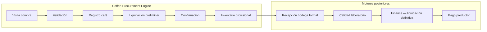
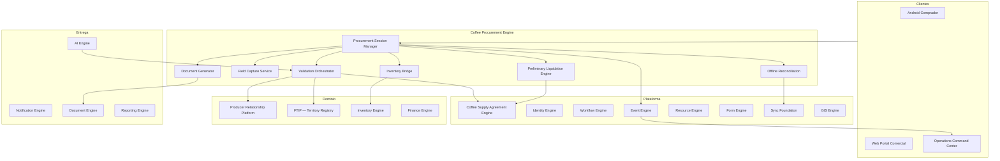
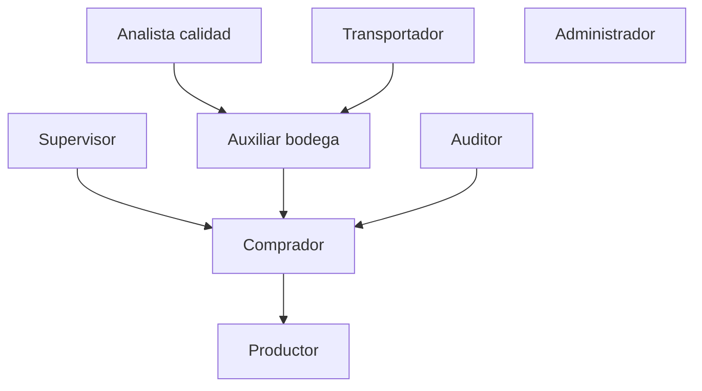
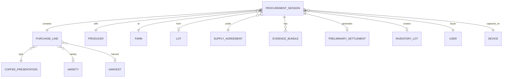
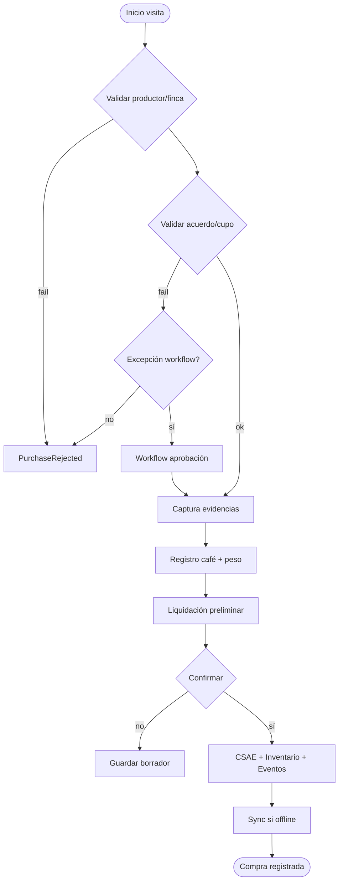
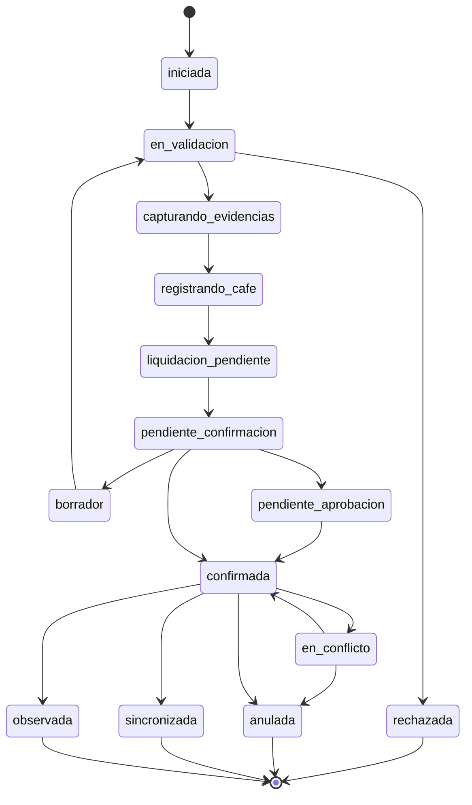

# AGROERP — Coffee Procurement Engine (CPE)

**Versión:** 1.0  
**Estado:** Oficial — Especificación del motor de abastecimiento de café  
**Audiencia:** Compradores, operaciones, bodega, calidad, arquitectura, producto, auditoría  
**Naturaleza:** Motor empresarial de dominio — **no es un CRUD de compras ni un módulo de pantallas**

---

## 0. Propósito y autoridad

El **Coffee Procurement Engine (CPE)** ejecuta el **proceso completo de compra de café directamente al productor**: desde la llegada del comprador a la finca hasta que el café queda registrado en inventario y listo para continuar el flujo operativo (calidad formal, liquidación definitiva, pago).

| Pregunta | Documento que responde |
|----------|------------------------|
| ¿Qué procesos de compra existen en el dominio? | `COFFEE_DOMAIN.md` (CDP §4.7, §4.9) |
| ¿Cómo se validan acuerdos y cupos? | `COFFEE_SUPPLY_AGREEMENT_ENGINE.md` (CSAE) |
| ¿Cómo sincroniza campo offline? | `SYNC.md`, `ANDROID_FIELD_APP.md` |
| ¿Cómo se monitorea la operación? | `OPERATIONS_COMMAND_CENTER.md` |
| **¿Cómo se ejecuta la compra en campo y bodega?** | **Este documento (CPE)** |

### Jerarquía documental

```
COFFEE_DOMAIN.md                     → Dominio cafetero
COFFEE_SUPPLY_AGREEMENT_ENGINE.md    → Acuerdos y cupos (CSAE)
COFFEE_PROCUREMENT_ENGINE.md         → Ejecución de compra (CPE) — este documento
OPERATIONS_COMMAND_CENTER.md         → Monitoreo y alertas
AEPS.md                              → Implementación técnica
```

**Regla de oro:** Toda compra confirmada **debe** pasar por el pipeline de validación CPE → CSAE antes de afectar cupo e inventario. La liquidación **definitiva** y el **pago** son responsabilidad del Finance Engine; el CPE produce **liquidación preliminar** y comprobantes de campo.

### Alcance del motor

| Incluye | No incluye |
|---------|------------|
| Flujo compra en finca (campo) | UI Android / Web |
| Pre-orden y compra confirmada | Gestión de acuerdos (CSAE) |
| Captura multimedia y evidencias | Dictamen formal y catación (CQIE) |
| Liquidación preliminar en campo | Liquidación definitiva y pago (CSFE) |
| Reserva/consumo de cupo (vía CSAE) | Despacho comercial |
| Inventario provisional / entrada | Contratos de venta |
| Modo offline completo | Recepción en bodega con báscula industrial (extensión Fase 2) |
| Trazabilidad origen (productor → finca → lote) | Transformación (beneficio, trilla) |

### Límite de responsabilidad (handoff)



**Fase 1 (campo directo):** compra en finca → inventario provisional en acopio asignado.  
**Fase 2 (híbrido):** compra en finca + recepción báscula como confirmación de peso oficial.

---

## 1. Visión y principios

### 1.1 Visión

El CPE es el **motor de ejecución de abastecimiento en origen** — comparable en espíritu a:

| Referencia | Capacidad análoga |
|------------|-------------------|
| SAP MM / Agricultural Contract Mgmt | Call-off contra acuerdo marco |
| Agribusiness mobile procurement | Compra en campo con peso y evidencias |
| Grain elevator receipt systems | Ticket de compra + inventario |
| POS móvil empresarial | Offline, firma, comprobante instantáneo |

### 1.2 Principios del motor

| # | Principio | Descripción |
|---|-----------|-------------|
| P1 | **Procurement session** | Una compra es una sesión guiada con pasos obligatorios y evidencias |
| P2 | **Validate before commit** | CSAE + CEM antes de confirmar; fallo = no confirmación |
| P3 | **Offline-first** | Compra completa sin red; sync posterior determinista |
| P4 | **Evidence bundle** | GPS, fotos, firma y dispositivo forman paquete auditable |
| P5 | **Idempotencia** | `externalId` evita duplicados en sync |
| P6 | **Event per transition** | Cada paso significativo publica evento |
| P7 | **Preliminary ≠ final** | Liquidación CPE es estimación; Finance ajusta post-calidad |
| P8 | **Policy-driven thresholds** | Humedad, peso, cupo — configurables por org |
| P9 | **Actor-scoped** | Comprador solo su cartera; supervisor aprueba excepciones |
| P10 | **Commodity-extensible** | Core `ProcurementSession`; café = primera implementación |

### 1.3 Arquitectura funcional



### 1.4 Componentes lógicos

| Componente | Responsabilidad |
|------------|-----------------|
| **Procurement Session Manager (PSM)** | Orquesta los 34 pasos del flujo; estado de sesión |
| **Validation Orchestrator (VAL)** | Encadena validaciones productor, finca, acuerdo, cupo, usuario, dispositivo |
| **Field Capture Service (CAP)** | GPS, foto, video, audio, firma, QR, archivos, notas |
| **Preliminary Liquidation Engine (LPE)** | Precio, primas, descuentos, impuestos, valor final |
| **Inventory Bridge** | Reserva/creación lote inventario provisional |
| **Document Generator** | Comprobante, recibo, PDF, QR verificación |
| **Offline Reconciliation** | Conflictos, duplicados, estado sync |

---

## 2. Actores y responsabilidades

### 2.1 Mapa de actores



### 2.2 Comprador

| Responsabilidad | Detalle CPE |
|-----------------|-------------|
| Iniciar sesión de compra en finca | `ProcurementSession` |
| Validar contexto productor/finca/acuerdo | Consulta offline cache |
| Registrar café ofrecido (peso, calidad preliminar) | Captura guiada |
| Capturar evidencias obligatorias | GPS, fotos, firma productor |
| Confirmar compra dentro de política | O solicitar excepción |
| Operar 100% offline varios días | Outbox local |

**Permisos:** `procurement:create`, `procurement:confirm`, `procurement:read` (cartera)

### 2.3 Supervisor comercial

| Responsabilidad | Detalle CPE |
|-----------------|-------------|
| Aprobar compras fuera de política | Workflow |
| Confirmar pre-órdenes offline expiradas | Revisión cola sync |
| Reasignar compras observadas | Estado `observed` |
| Monitorear KPIs equipo | OCC |

**Permisos:** `procurement:approve`, `procurement:read` (territorio)

### 2.4 Productor

| Responsabilidad | Detalle CPE |
|-----------------|-------------|
| Entregar café según acuerdo | Físico |
| Firmar comprobante / recibo | Firma en dispositivo comprador |
| Recibir copia digital recibo | QR / PDF local |

**Permisos:** `procurement:read` (propias compras), `procurement:sign`

### 2.5 Auxiliar de bodega

| Responsabilidad | Detalle CPE |
|-----------------|-------------|
| Confirmar llegada física (Fase 2) | Recepción báscula |
| Conciliar peso campo vs báscula | Discrepancia → incidente |
| Ubicar lote inventario provisional | Inventory Engine |

**Permisos:** `procurement:receive`, `inventory:update`

### 2.6 Analista de calidad

| Responsabilidad | Detalle CPE |
|-----------------|-------------|
| Revisar calidad preliminar vs dictamen | No bloquea CPE; alimenta Finance |
| Marcar compra para muestreo prioritario | Flag en sesión |

**Permisos:** `procurement:read`, `quality:sample`

### 2.7 Transportador

| Responsabilidad | Detalle CPE |
|-----------------|-------------|
| Transportar café comprado | Guía vinculada a `purchaseId` |
| Confirmar entrega en acopio | Evento logístico (futuro) |

**Permisos:** limitados — sin precios

### 2.8 Administrador

| Responsabilidad | Detalle CPE |
|-----------------|-------------|
| Configurar umbrales, formularios compra | Políticas org |
| Resolver conflictos sync críticos | Offline reconciliation |
| Autorizar dispositivos | Device registry |

**Permisos:** `procurement:admin`

### 2.9 Auditor

| Responsabilidad | Detalle CPE |
|-----------------|-------------|
| Revisar evidencias y trazabilidad | Solo lectura |
| Verificar duplicados y anomalías | Audit log + eventos |

**Permisos:** `procurement:audit`

---

## 3. Modelo conceptual

### 3.1 Agregado principal: Procurement Session



### 3.2 Procurement Session — atributos

| Grupo | Atributo | Descripción |
|-------|----------|-------------|
| **Identidad** | `sessionId` | UUID |
| | `externalId` | ID offline cliente |
| | `purchaseNumber` | Número humano (post-sync) |
| | `organizationId` | Tenant |
| **Contexto** | `producerId` | Productor |
| | `farmId` | Finca |
| | `lotId` | Lote productivo (opcional L2+) |
| | `harvestId` / `harvestCode` | Cosecha |
| | `agreementId` | Acuerdo CSAE |
| | `quotaNodeId` | Nodo cupo consumido |
| | `campaignId` | Campaña |
| **Actores** | `buyerUserId` | Comprador |
| | `supervisorUserId` | Si aprobación |
| | `deviceId` | Dispositivo captura |
| **Temporal** | `startedAt` | Inicio visita compra |
| | `confirmedAt` | Confirmación |
| | `timezone` | Zona horaria |
| **Ubicación** | `gpsCheckIn` | Point + accuracy |
| | `gpsValidated` | boolean |
| | `distanceToFarmMeters` | Distancia a perímetro |
| **Línea de compra** | `presentationCode` | cereza, pergamino, oro |
| | `varietyCode` | Variedad |
| | `grossWeight` | Peso bruto |
| | `tareWeight` | Tara |
| | `netWeight` | Peso neto (base cupo) |
| | `uomCode` | kg, lb, carga |
| | `moisturePercent` | Humedad |
| | `impuritiesPercent` | Impurezas |
| | `defectsSummary` | Defectos preliminares |
| | `preliminaryQualityGrade` | Catálogo calidad campo |
| **Estado** | `status` | §6 |
| | `syncStatus` | `local` / `pending` / `synced` / `conflict` |
| **Liquidación** | `preliminarySettlementId` | LPE output |
| **Inventario** | `inventoryLotId` | Lote provisional |
| | `warehouseId` | Bodega destino |
| **Evidencias** | `evidenceBundleId` | Paquete multimedia |
| | `producerSignatureId` | Firma |
| | `documents` | PDF, anexos |
| **Gobierno** | `correlationId` | Trazabilidad |
| | `workflowInstanceId` | Si excepción |
| | `flags` | `observed`, `duplicate_suspect`, etc. |

### 3.3 Evidence Bundle

| Tipo | Metadatos obligatorios |
|------|------------------------|
| `photo` | GPS o EXIF, timestamp, `captureType` |
| `video` | GPS, timestamp, duración |
| `audio` | timestamp (GPS opcional) |
| `signature` | signerRole, timestamp |
| `document` | mimeType, hash |
| `qr_scan` | payload, purpose |
| `barcode_scan` | value, format |
| `note` | text, author |
| `comment` | text, visibility |

### 3.4 Preliminary Settlement

| Campo | Descripción |
|-------|-------------|
| `basePrice` | Del acuerdo CSAE / PEM |
| `quantity` | kg netos |
| `grossAmount` | base × qty |
| `premiums` | array { type, amount } |
| `discounts` | array { type, amount } |
| `qualityPenalties` | Castigos humedad/defectos preliminar |
| `taxes` | Si aplican (config país) |
| `withholdings` | Retenciones |
| `netAmount` | Valor final preliminar |
| `currencyCode` | Moneda |
| `quotaRemainingAfter` | Saldo cupo post-compra |
| `formulaTrace` | JSON explicación cálculo (IA/auditoría) |

---

## 4. Flujo operativo completo (34 pasos)

El flujo se implementa como **máquina de estados** dentro de `ProcurementSession`, con pasos skippables solo si política lo permite.

### 4.1 Fase A — Inicio y contexto (pasos 1–10)

| Paso | Acción | Componente | Offline |
|------|--------|------------|---------|
| 1 | **Inicio de visita compra** | PSM | Sí — `PurchaseStarted` |
| 2 | **Validación productor** | VAL → PRM | Cache local + stale indicator |
| 3 | **Validación finca** | VAL → FTIP | Cache |
| 4 | **Validación acuerdo** | VAL → CSAE | Snapshot acuerdo descargado |
| 5 | **Consulta cupo disponible** | VAL → CSAE QEM | Saldo cache; reserva soft local |
| 6 | **Historial compras** | PSM consulta proyección | Cache últimas N compras |
| 7 | **Alertas productor** | VAL → OCC/CSAE | Cache alertas |
| 8 | **Registro GPS check-in** | CAP → GIS | Sí — obligatorio |
| 9 | **Fecha y hora** | Automático device + server skew correction | Sí |
| 10 | **Captura dispositivo** | `deviceId`, model, appVersion | Sí |

**Salida fase A:** contexto validado o bloqueado con código error (`PRODUCER_SUSPENDED`, `AGREEMENT_EXPIRED`, etc.)

### 4.2 Fase B — Evidencias (pasos 11–15)

| Paso | Acción | Obligatorio default |
|------|--------|---------------------|
| 11 | Fotografías (mín. 2: café, balanza/contexto) | Sí |
| 12 | Videos | Configurable |
| 13 | Audio | Opcional |
| 14 | Firma digital productor | Sí |
| 15 | Documentos adicionales (remisión, cédula) | Según política |

Eventos: `MediaCaptured`, `MediaUploaded` (post-sync), `GPSCaptured`, `SignatureCaptured`

### 4.3 Fase C — Registro del café (pasos 16–24)

| Paso | Acción | Validación |
|------|--------|------------|
| 16 | Café ofrecido — inicio línea | — |
| 17 | Tipo presentación (`trade.coffee_presentation`) | Coherente con acuerdo |
| 18 | Variedad | Coherente con lote/finca |
| 19 | Cosecha | Dentro ventana acuerdo |
| 20 | Peso bruto / tara / neto | > 0; báscula portable |
| 21 | Humedad | Rango configurable |
| 22 | Impurezas | ≥ 0 |
| 23 | Defectos preliminares | Catálogo `quality.defect` |
| 24 | Calidad preliminar | Grado / score estimado |

Evento: `PurchaseValidated` (tras paso 24 completo)

### 4.4 Fase D — Comercialización (pasos 25–30)

| Paso | Acción | Componente |
|------|--------|------------|
| 25 | **Aplicación reglas comerciales** | LPE + CSAE PEM + DVE |
| 26 | **Validación cupo** | CSAE QEM — hard check |
| 27 | **Cálculo saldo restante** | QEM projection |
| 28 | **Liquidación preliminar** | LPE |
| 29 | **Confirmación compra** | Usuario + firma ya capturada |
| 30 | **Generación eventos** | Event Engine batch |

Eventos: `PurchaseConfirmed` o `PurchaseRejected`; `ContractUpdated` (vía CSAE `CupoReservado`/`CupoConsumido`)

### 4.5 Fase E — Post-confirmación (pasos 31–34)

| Paso | Acción | Componente |
|------|--------|------------|
| 31 | **Actualización acuerdo** | CSAE consumo/reserva definitiva |
| 32 | **Movimiento inventario** | Inventory Bridge → `InventoryReserved` + `InventoryCreated` |
| 33 | **Auditoría** | Audit Engine — bundle completo |
| 34 | **Sincronización offline** | Sync Foundation — si aplica |

### 4.6 Diagrama de flujo



---

## 5. Captura en campo (Field Capture Service)

### 5.1 Requisitos por modalidad

| Modalidad | Android | Web | Offline | Georreferencia |
|-----------|---------|-----|---------|----------------|
| GPS | Sí | Sí (navegador) | Sí | Obligatoria check-in |
| Fotografía | Sí | Sí | Sí | Obligatoria |
| Video | Sí | Limitado | Sí | Recomendada |
| Audio | Sí | Sí | Sí | No |
| Firma | Sí | Canvas | Sí | No |
| QR / Barras | Sí | Sí | Sí | No |
| Archivos | Sí | Upload | Cola | No |
| Notas / Comentarios | Sí | Sí | Sí | No |

### 5.2 Integración Form Engine

Formularios dinámicos `procurement.field.*` complementan captura nativa:

- Configuración por org vía Metadata
- Validaciones DVE en cliente y servidor
- Submissions vinculadas a `sessionId`

### 5.3 Código QR

| Uso | Contenido QR |
|-----|--------------|
| Verificación comprobante | URL + `purchaseNumber` + hash |
| Escaneo productor | `producerId` pre-carga contexto |
| Escaneo acuerdo | `agreementId` |
| Escaneo lote finca | `lotId` |

### 5.4 Paquete de evidencias mínimo (política default)

1. GPS check-in dentro perímetro finca (± `gpsToleranceMeters`, default 200m)
2. ≥ 2 fotografías georreferenciadas
3. Firma productor
4. Foto balanza/peso (si aplica pesaje manual)

---

## 6. Modo offline

### 6.1 Capacidades offline

| Capacidad | Descripción |
|-----------|-------------|
| Compra completa sin internet | Todo el flujo 1–29 en SQLite |
| Trabajo multi-día | Sesiones `borrador` persisten |
| Cache maestros | Productores, fincas, acuerdos, cupos (snapshot) |
| Cola outbox | Mutations + media uploads |
| Estado sync visible | `local` / `pending` / `synced` / `conflict` |
| Reserva cupo optimista local | Reconciliación en servidor |

### 6.2 Datos precargados (bootstrap)

Descarga antes de salida a campo:

```
- Cartera productores + fincas + lotes
- Acuerdos activos + saldos cupo (timestamp)
- Listas precios / políticas comerciales
- Catálogos: presentación, variedad, defectos, UOM
- Alertas productor pendientes
- Formularios procurement.*
```

### 6.3 Estrategia de conflicto

| Conflicto | Resolución default |
|-----------|-------------------|
| Cupo excedido al sync | `PurchaseRejected` o workflow excepción |
| Acuerdo vencido durante offline | Rechazo salvo `grace_days` |
| Duplicado `externalId` | Idempotencia — retorna compra existente |
| Mismo productor/peso/timestamp | Flag `duplicate_suspect` → supervisor |
| Versión acuerdo desactualizada | Recalcular LPE; si precio cambió → supervisor |
| Conflicto peso inventario | Incidente OCC |

### 6.4 Orden de sincronización

1. JWT refresh
2. Push mutations (sesión sin media)
3. Upload media (paralelo)
4. Link media → sesión
5. Confirmación servidor → `synced`
6. Pull eventos actualizados cupo

---

## 7. Validaciones

### 7.1 Reglas de bloqueo

| ID | Regla | Fuente |
|----|-------|--------|
| CPE-V01 | **No superar cupo disponible** | CSAE QEM |
| CPE-V02 | **No comprar con acuerdo vencido** (según política) | CSAE |
| CPE-V03 | **Pesos negativos o cero** prohibidos | CPE |
| CPE-V04 | **Humedad fuera de rango** — bloqueo o workflow | Política org |
| CPE-V05 | **GPS obligatorio** y dentro tolerancia finca | GIS + FTIP |
| CPE-V06 | **Usuario autorizado** — rol + cartera | Identity |
| CPE-V07 | **Dispositivo autorizado** — registry | Identity/Device |
| CPE-V08 | **Duplicidad compra** — heurística | CPE + AI |
| CPE-V09 | **Productor suspendido** | PRM |
| CPE-V10 | **Finca no habilitada** | FTIP |
| CPE-V11 | **Presentación incompatible con acuerdo** | CSAE |
| CPE-V12 | **Evidencias mínimas incompletas** | CAP |
| CPE-V13 | **Firma productor ausente** | CAP |
| CPE-V14 | **Precio fuera de banda** contractual | CSAE PEM |

### 7.2 Reglas de alerta (no bloqueo)

| ID | Regla |
|----|-------|
| CPE-A01 | Humedad en límite superior — descuento probable |
| CPE-A02 | Primera compra del productor en campaña |
| CPE-A03 | Peso muy superior a histórico finca |
| CPE-A04 | Compra sin visita técnica previa en 90d |
| CPE-A05 | Saldo cupo < 10% post-compra |

### 7.3 Detección de inconsistencias

| Inconsistencia | Acción |
|----------------|--------|
| Peso neto > estimación producción lote | Flag `observed` |
| Variedad no registrada en lote | Warning + permitir con nota |
| GPS fuera país/región | Bloqueo |
| Timestamp futuro / muy antiguo | Corrección o rechazo |

---

## 8. Liquidación preliminar (LPE)

### 8.1 Pipeline de cálculo

```
1. Resolver precio base (CSAE PEM — fijo o variable del día)
2. gross = netWeight × basePrice
3. + Σ primas contractuales (certificación, variedad, calidad preliminar)
4. − Σ descuentos contractuales
5. − castigos calidad preliminar (tabla humedad, impurezas, defectos)
6. + impuestos (si configurado)
7. − retenciones (si configurado)
8. = netAmount preliminar
9. quotaRemaining = CSAE.available − netWeight
```

### 8.2 Tablas configurables

| Tabla | Uso |
|-------|-----|
| `procurement.moisture_discount` | % descuento por banda humedad |
| `procurement.impurity_discount` | Impurezas |
| `procurement.defect_penalty` | Defectos preliminares |
| `finance.tax_rule` | IVA, retención fuente (país) |

### 8.3 Relación con Finance Engine

| Concepto | CPE | Finance |
|----------|-----|---------|
| Liquidación | Preliminar en campo | Definitiva post-calidad bodega |
| Ajustes | Estimación castigos | Dictamen laboratorio |
| Pago | No ejecuta | Programa y ejecuta pago |
| Anticipo | Informa saldo | Descuenta |

Evento handoff: `PreliminarySettlementGenerated` → Finance consume al recepción/calidad cerrada.

---

## 9. Documentos generados

### 9.1 Artefactos automáticos

| Documento | Contenido | Formato |
|-----------|-----------|---------|
| **Comprobante de compra** | Número, partes, peso, precio, valor | PDF + in-app |
| **Liquidación preliminar** | Desglose LPE | PDF |
| **Recibo productor** | Versión simplificada para productor | PDF + impresión Bluetooth |
| **Código QR verificación** | URL pública autenticada | En comprobante |
| **Versión digital firmada** | Hash documento + firmas | Almacenado Document Engine |

### 9.2 Plantillas

Registradas en Document Engine:

- `procurement.receipt.standard`
- `procurement.settlement.preliminary`
- `procurement.receipt.producer_copy`

Variables: todos los atributos `ProcurementSession` + `PreliminarySettlement`.

### 9.3 Firma digital

- Firma productor en captura (paso 14)
- Firma comprador opcional en confirmación
- Sello organización en PDF generado servidor

---

## 10. Estados

### 10.1 Estado de sesión de compra



### 10.2 Tabla de estados

| Estado | Descripción | Editable |
|--------|-------------|----------|
| `iniciada` | Check-in realizado | Sí |
| `en_validacion` | Validando contexto | Sí |
| `capturando_evidencias` | Multimedia en curso | Sí |
| `registrando_cafe` | Peso y calidad preliminar | Sí |
| `liquidacion_pendiente` | Calculando LPE | Sí |
| `pendiente_confirmacion` | Esperando OK comprador | Sí |
| `borrador` | Guardado para continuar | Sí |
| `pendiente_aprobacion` | Workflow excepción | No |
| `confirmada` | Comprometida | No |
| `sincronizada` | En servidor global | No |
| `en_conflicto` | Sync conflicto | Supervisor |
| `observada` | Marcada para revisión | Supervisor |
| `rechazada` | No procedió | No |
| `anulada` | Reversión formal | No |

### 10.3 Estado de sincronización

| syncStatus | UI comprador |
|------------|--------------|
| `local` | Solo en dispositivo |
| `pending` | En cola |
| `syncing` | Enviando |
| `synced` | ✓ Servidor |
| `conflict` | ⚠ Requiere acción |

---

## 11. Eventos de dominio

### 11.1 Catálogo principal (inglés — contrato técnico)

| Evento | Cuándo | Agregado |
|--------|--------|----------|
| `PurchaseStarted` | Paso 1 | ProcurementSession |
| `PurchaseValidated` | Tras validaciones + registro café | ProcurementSession |
| `PurchaseConfirmed` | Paso 29 confirmación | ProcurementSession |
| `PurchaseRejected` | Validación fallida o rechazo explícito | ProcurementSession |
| `PurchaseCancelled` | Anulación post-confirmación | ProcurementSession |
| `PurchaseObserved` | Marcada inconsistencia | ProcurementSession |
| `PreliminarySettlementGenerated` | Paso 28 | PreliminarySettlement |
| `InventoryReserved` | Reserva cupo inventario | InventoryLot |
| `InventoryCreated` | Lote inventario provisional | InventoryLot |
| `ContractUpdated` | CSAE cupo afectado | SupplyAgreement |
| `QuotaConsumed` | Consumo definitivo (alias CSAE) | QuotaNode |
| `MediaCaptured` | Cada evidencia local | Evidence |
| `MediaUploaded` | Upload completado | Evidence |
| `GPSCaptured` | Check-in ubicación | ProcurementSession |
| `SignatureCaptured` | Firma registrada | Evidence |
| `AuditRegistered` | Paso 33 | AuditEntry |
| `ProcurementSyncCompleted` | Sync exitoso | ProcurementSession |
| `ProcurementSyncConflict` | Conflicto detectado | ProcurementSession |
| `ProcurementExceptionRequested` | Excepción cupo/precio | WorkflowInstance |

### 11.2 Alias dominio español (CDP / Event Catalog)

| Inglés | Español CDP |
|--------|-------------|
| `PurchaseStarted` | `CompraIniciada` |
| `PurchaseConfirmed` | `CompraRegistrada` |
| `PurchaseRejected` | `CompraRechazada` |
| `PurchaseCancelled` | `CompraAnulada` |
| `ContractUpdated` | `CupoConsumido` / `CupoReservado` |

Ambos namespaces pueden registrarse en APOS Event Catalog con mapeo 1:1.

---

## 12. Integraciones

### 12.1 Matriz

| Sistema | Dirección | Uso |
|---------|-----------|-----|
| **Identity Engine** | CPE consume | Usuario, rol, dispositivo, scope cartera |
| **Coffee Supply Agreement Engine** | CPE consume | Validación acuerdo, cupo, precio, LPE base |
| **Producer Relationship Management Platform** | CPE consume | Estado productor, alertas, documentos |
| **Farm & Territory Intelligence Platform** | CPE consume | Finca, lote, perímetro GPS, variedad |
| **Workflow Engine** | Bidireccional | Excepciones, anulaciones, observadas |
| **Event Engine** | CPE publica | Todos los eventos §11 |
| **Resource Engine** | CPE usa | `coffee.procurement_session`, `coffee.purchase` |
| **Metadata / Form Engine** | CPE usa | Formularios campo |
| **Sync Foundation** | Bidireccional | Offline push/pull |
| **GIS Engine** | CPE consume | Validación GPS, distancia finca |
| **Inventory Engine** | CITE publica | Lote provisional, reserva |
| **Finance Engine** | CPE publica | Liquidación preliminar → definitiva |
| **Document Engine** | CPE consume | PDF, plantillas, almacenamiento |
| **Notification Engine** | CPE publica | Productor recibo, supervisor excepción |
| **Operations Command Center** | CPE alimenta | Compras día, sync pendiente, anomalías |
| **Reporting Engine** | CPE alimenta | KPIs §13 |
| **AI Engine** | Bidireccional | Fraude, anomalías, recomendaciones |
| **DGMP / DVE** | CPE consume | Validaciones datos maestros |

### 12.2 Permisos Identity

| Permiso | Descripción |
|---------|-------------|
| `procurement:session:start` | Iniciar visita compra |
| `procurement:session:update` | Editar sesión no confirmada |
| `procurement:session:confirm` | Confirmar compra |
| `procurement:session:read` | Consultar en scope |
| `procurement:session:cancel` | Anular |
| `procurement:session:approve` | Aprobar excepción |
| `procurement:session:observe` | Marcar observada |
| `procurement:session:resolve_conflict` | Resolver sync |
| `procurement:settlement:read` | Ver liquidación preliminar |
| `procurement:report` | Reportes |
| `procurement:admin` | Políticas |
| `procurement:audit` | Solo lectura auditoría |

---

## 13. Reportes y KPIs

### 13.1 KPIs operativos

| KPI | Dimensión |
|-----|-----------|
| Compras por día | Org, regional, comprador |
| Compras por comprador | kg, valor, count |
| Compras por productor | Histórico, cumplimiento |
| Compras por municipio / vereda | GIS roll-up |
| Compras por variedad | `varietyCode` |
| Compras por calidad preliminar | Grado |
| Compras por finca | Trazabilidad L2 |
| Compras por contrato / acuerdo | `agreementId` |
| Compras pendientes sincronización | `syncStatus != synced` |
| Compras anuladas | Tasa anulación |
| Compras observadas | Backlog revisión |
| Tiempo promedio sesión | `confirmedAt - startedAt` |
| % compras con GPS válido | Cumplimiento evidencia |
| Peso total comprado (campaña) | Σ netWeight |
| Valor preliminar comprado | Σ netAmount |

### 13.2 Reportes estándar

| Reporte | Audiencia |
|---------|-----------|
| Libro de compras diario | Bodega, finanzas |
| Compras por comprador (cierre día) | Supervisor |
| Compras offline pendientes | Operaciones |
| Discrepancias peso campo vs bodega | Auditoría |
| Compras observadas / anómalas | Compliance |
| Trazabilidad compra → inventario | Certificación |

---

## 14. Inteligencia artificial

### 14.1 Casos de uso

| Caso | Entrada | Salida |
|------|---------|--------|
| **Detección compras anómalas** | Peso, precio, GPS, hora, histórico | Score anomalía 0–1 |
| **Predicción incumplimiento contrato** | Ritmo compra vs cupo, calendario | Probabilidad incumplimiento |
| **Recomendación de compra** | Inventario org, cupo, demanda | Comprar ahora / esperar / cantidad |
| **Detección de fraude** | Patrones GPS, duplicados, collusion | Alerta `fraud_suspect` |
| **Estimación producción futura** | Farm, clima, floración | kg esperados restantes campaña |
| **Comportamiento productor** | Serie temporal compras, calidad | Segmento: confiable / riesgo / nuevo |
| **Validación foto balanza** | CV sobre imagen | Peso sugerido vs registrado |
| **NLP notas campo** | Texto libre comprador | Extracción hallazgos estructurados |

### 14.2 Integración en flujo

| Momento | IA |
|---------|-----|
| Paso 6–7 | Mostrar score riesgo productor |
| Paso 20 | Sugerir rango peso esperado |
| Paso 25 | Flag anomalía precio/peso |
| Post-sync | Batch scoring fraude |
| OCC | Dashboard compras anómalas |

### 14.3 Principios

- IA **no confirma** compras automáticamente
- Explicabilidad obligatoria en flags `observed` y `fraud_suspect`
- Modelos entrenados con Event Store; sesgo territorial monitoreado

---

## 15. Escalabilidad multi-commodity

### 15.1 Patrón Abstract Procurement Engine

| Capa | Contenido |
|------|-----------|
| **Core CPE** | Session manager, validation orchestrator, offline, LPE framework |
| **Coffee plugin** | Presentaciones café, tablas humedad, catálogos |
| **Cacao plugin** (futuro) | Baba/grano, fermentación |
| **Caña / palma / aguacate** | UOM y calidad preliminar específicos |

### 15.2 Reutilización

- Procurement Session lifecycle
- Evidence Bundle
- Offline reconciliation
- Event pattern `PurchaseConfirmed`
- Integración abstracta `SupplyAgreementEngine` (CSAE → `SupplyAgreementEngine` genérico)

### 15.3 APOS registration

```yaml
pluginId: agro.coffee.procurement
commodity: coffee
resourceTypes:
  - coffee.procurement_session
  - coffee.purchase_line
dependsOn:
  - agro.coffee.supply_agreement
eventNamespace: coffee.procurement
```

---

## 16. Riesgos

| Categoría | Riesgo | Mitigación CPE |
|-----------|--------|----------------|
| Comercial | Compra sin cupo offline | Reconciliación + bloqueo sync |
| Operativo | Peso campo ≠ báscula bodega | Fase 2 recepción; tolerancia |
| Fraude | GPS simulado | Precisión, patrones, IA |
| Fraude | Comprador colusión precio | Banda CSAE + auditoría |
| Legal | Sin firma productor | Bloqueo confirmación |
| Datos | Duplicado sync | externalId idempotencia |
| Reputación | Recibo con valor erróneo | LPE trace + versión definitiva Finance |
| Tecnológico | Media no subida | Cola persistente; compra `pending_media` |

---

## 17. Roadmap evolutivo

| Fase | Entregables | Dependencias |
|------|-------------|--------------|
| **F1 — Campo core** | PSM, VAL, CAP, confirmación, eventos, offline básico | CSAE, Sync, Identity |
| **F2 — Liquidación** | LPE, comprobantes PDF | CSAE PEM, Document Engine |
| **F3 — Inventario** | Inventory Bridge, lote provisional | Inventory Engine |
| **F4 — Bodega** | Recepción báscula, conciliación peso | Bodega module |
| **F5 — Excepciones** | Workflow, observadas, anulación | Workflow Engine |
| **F6 — Inteligencia** | Anomalías, fraude, recomendaciones | AI Engine |
| **F7 — Web + multi-commodity** | Portal comprador web; plugin cacao | Cacao domain |

---

## 18. Checklist de cumplimiento

- [ ] Sesión compra como agregado con 34 pasos documentados
- [ ] Validación CSAE obligatoria pre-confirmación
- [ ] Evidencias mínimas configurables
- [ ] Offline con externalId y conflict resolution
- [ ] Eventos registrados en APOS Event Catalog
- [ ] Permisos `procurement:*` en Identity
- [ ] Proyección OCC compras día / sync pendiente
- [ ] LPE distinguido de liquidación Finance
- [ ] Registro plugin APOS `agro.coffee.procurement`
- [ ] Ficha Data Catalog DGMP

---

## 19. Conclusión

El **Coffee Procurement Engine (CPE)** es el motor de **ejecución de abastecimiento de café en origen** de AGROERP. Orquesta:

- **34 pasos operativos** desde visita en finca hasta inventario y sync
- **8 actores** con responsabilidades y permisos
- **Captura completa** en campo: GPS, multimedia, firma, QR, documentos
- **Modo offline** multi-día con reconciliación determinista
- **14+ validaciones** de negocio integradas con CSAE
- **Liquidación preliminar** con precio, primas, descuentos, impuestos
- **Documentos automáticos** con QR de verificación
- **18+ eventos** de dominio para trazabilidad
- **15+ KPIs** y reportes comerciales
- **8 casos de IA** para fraude y optimización
- **Extensión multi-commodity** sin cambiar arquitectura core

**No es un CRUD de compras** — es un **motor de sesión de abastecimiento** con validación, evidencia, comercialización y handoff a inventario y finanzas.

**Este documento es el estándar oficial** para toda compra de café en AGROERP.

---

*Documento elaborado para AGROERP — Coffee Procurement Engine v1.0.*  
*Jerarquía:* `COFFEE_SUPPLY_AGREEMENT_ENGINE.md` → **`COFFEE_PROCUREMENT_ENGINE.md`** → Inventory / Finance  
*Próximo paso recomendado:* Fase F1 — Procurement Session Manager + integración CSAE validate + offline outbox.  
*Motor dependiente:* `COFFEE_QUALITY_INTELLIGENCE_ENGINE.md` — dictamen y calidad formal post-compra.  
*Handoff inventario:* `COFFEE_INVENTORY_TRACEABILITY_ENGINE.md` — movimientos y lotes.  
*Handoff financiero:* `COFFEE_SETTLEMENT_FINANCIAL_ENGINE.md` — liquidación definitiva y pago.  
*Handoff logístico:* `COFFEE_LOGISTICS_SUPPLY_CHAIN_ENGINE.md` — recolección y transporte post-compra.  
*Handoff productor:* `PRODUCER_RELATIONSHIP_MANAGEMENT_PLATFORM.md` — validación estado y cartera.
