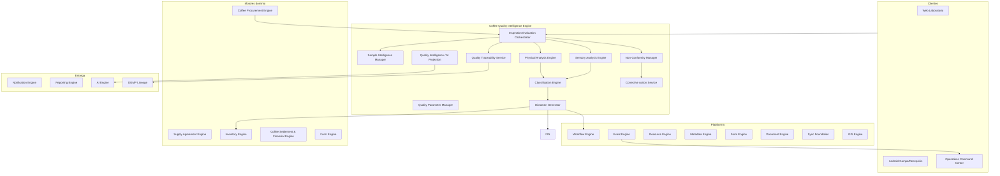
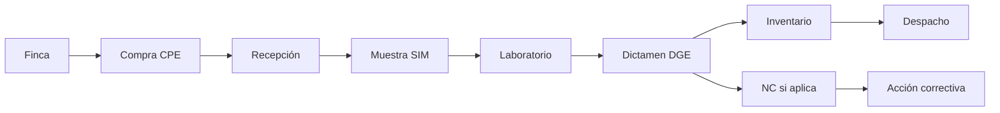
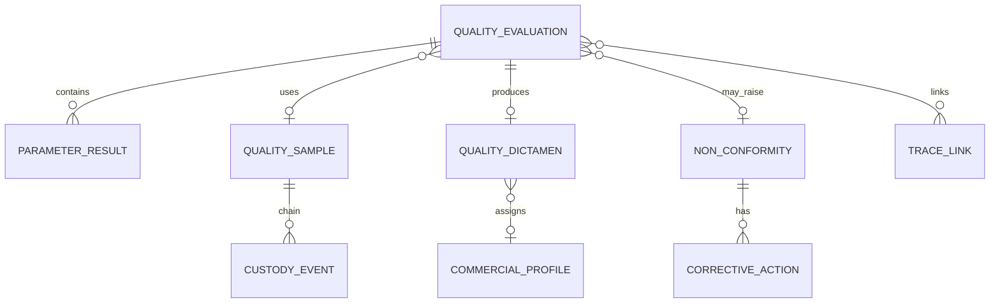
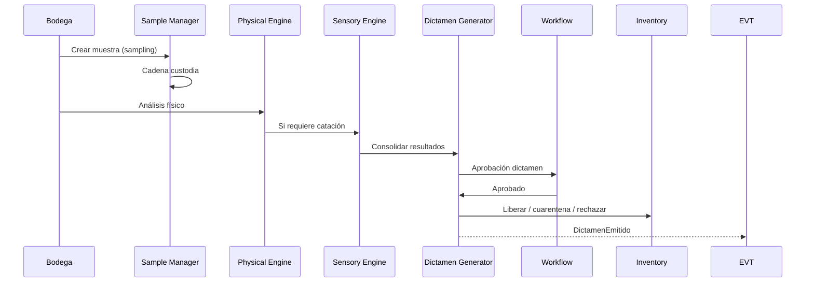
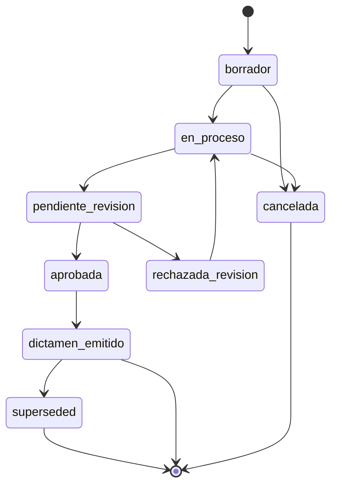

# AGROERP — Coffee Quality Intelligence Engine (CQIE)

**Versión:** 1.0  
**Estado:** Oficial — Especificación del motor de inteligencia y control de calidad del café  
**Audiencia:** Calidad, laboratorio, operaciones, comercial, certificación, arquitectura, auditoría  
**Naturaleza:** Motor empresarial de dominio — **no es un módulo de laboratorio ni un CRUD de análisis**

---

## 0. Propósito y autoridad

El **Coffee Quality Intelligence Engine (CQIE)** controla, evalúa, registra, analiza y predice la **calidad del café** a lo largo de toda la cadena de valor: finca → compra → recepción → laboratorio → clasificación → inventario → despacho → cliente.

| Pregunta | Documento que responde |
|----------|------------------------|
| ¿Qué procesos de calidad existen? | `COFFEE_DOMAIN.md` (CDP §4.10, §4.20) |
| ¿Qué catálogos de calidad hay? | `MASTER_DATA_ENGINE.md` (`quality.*`) |
| ¿Calidad preliminar en compra? | `COFFEE_PROCUREMENT_ENGINE.md` (CPE) |
| ¿Calidad esperada en acuerdo? | `COFFEE_SUPPLY_AGREEMENT_ENGINE.md` (CSAE) |
| ¿Calidad del dato (MDM)? | `DATA_GOVERNANCE_PLATFORM.md` (DQE) |
| **¿Cómo se gobierna la calidad del producto café?** | **Este documento (CQIE)** |

### Jerarquía documental

```
COFFEE_DOMAIN.md                     → Dominio cafetero
COFFEE_PROCUREMENT_ENGINE.md         → Calidad preliminar en compra (CPE)
COFFEE_QUALITY_INTELLIGENCE_ENGINE.md → Inteligencia calidad E2E (CQIE)
OPERATIONS_COMMAND_CENTER.md         → Monitoreo calidad y NC
WORKFLOW_ENGINE.md                   → Aprobaciones dictamen y CAPA
AEPS.md                              → Implementación técnica
```

**Regla de oro:** Todo **dictamen de calidad** que afecte inventario, liquidación, despacho o certificación debe originarse o consolidarse en el CQIE. El CPE captura **calidad preliminar**; el CQIE la **valida, amplía o revoca** con autoridad analítica.

### Distinción crítica

| Motor | Objeto de calidad |
|-------|-------------------|
| **DGMP — Data Quality Engine** | Calidad de **datos** (completitud, duplicados, GPS en formularios) |
| **CQIE** | Calidad del **café** (física, sensorial, certificación, trazabilidad producto) |

### Alcance

| Incluye | No incluye |
|---------|------------|
| Inspecciones en finca, compra, recepción, laboratorio | UI laboratorio / catación |
| Parámetros físicos y sensoriales configurables | Transformación beneficio/trilla (otro motor) |
| Gestión de muestras y cadena de custodia | Pago al productor (CSFE) |
| Catación multi-protocolo (SCA, CQI, interno) | Contratos comerciales (CSAE) |
| Dictámenes y clasificación comercial | Despacho logístico (CLSE ejecuta) |
| No conformidades y acciones correctivas (CAPA) | Certificación externa (registro + verificación) |
| Trazabilidad calidad E2E | Data warehouse analítico profundo (Reporting consume) |
| Predicción e IA de calidad | |

---

## 1. Visión y principios

### 1.1 Visión

El CQIE es el **sistema nervioso de calidad del café** en AGROERP — comparable en espíritu a:

| Referencia | Capacidad análoga |
|------------|-------------------|
| SCA / CQI protocols | Catación estandarizada configurable |
| LIMS agroindustrial | Muestras, análisis, resultados, trazabilidad |
| QMS ISO 9001 / FSSC | NC, CAPA, evidencias, cierre |
| Agribusiness quality modules | Dictamen → inventario / precio |
| Computer vision QC (futuro) | Clasificación por imagen |

### 1.2 Principios del motor

| # | Principio | Descripción |
|---|-----------|-------------|
| Q1 | **Quality evaluation as first-class aggregate** | Evaluación = agregado con ciclo de vida, no fila suelta |
| Q2 | **Methodology-agnostic** | SCA, CQI, interno, país — configurables por org |
| Q3 | **Sample chain of custody** | Toda muestra trazable desde extracción hasta destrucción/archivo |
| Q4 | **Dictamen drives operations** | Aprobado/rechazado/condicionado → inventario, precio, despacho |
| Q5 | **Parameter schema extensible** | Metadata define parámetros; no hardcode por defecto |
| Q6 | **Historical intelligence** | Serie temporal por productor, finca, lote, región |
| Q7 | **NC → CAPA cerrado** | No conformidad sin acción correctiva trazable |
| Q8 | **Event per transition** | Cada cambio significativo publica evento |
| Q9 | **Offline-capable** | Inspección campo y recepción sin red |
| Q10 | **Commodity-extensible** | Core `QualityEvaluation`; café = primera implementación |

### 1.3 Arquitectura funcional



### 1.4 Componentes lógicos

| Componente | Sigla | Responsabilidad |
|------------|-------|-----------------|
| **Quality Parameter Manager** | QPM | Schemas de parámetros físicos/sensoriales por metodología |
| **Sample Intelligence Manager** | SIM | Muestras, ID, custodia, asociaciones |
| **Inspection Evaluation Orchestrator** | IEO | Orquesta tipos de inspección y flujos |
| **Physical Analysis Engine** | PAE | Humedad, defectos, zaranda, color, densidad |
| **Sensory Analysis Engine** | SAE | Catación, descriptores, puntaje SCA |
| **Classification Engine** | CCE | Perfil comercial, homologación, lote comercial |
| **Dictamen Generator** | DGE | Dictamen final y efectos operativos |
| **Non-Conformity Manager** | NCM | Registro y seguimiento NC |
| **Corrective Action Service** | CAPA | Acciones correctivas y cierre |
| **Quality Traceability Service** | QTR | Grafo calidad E2E |
| **Quality Intelligence Projection** | QIP | KPIs, tendencias, scores IA |

---

## 2. Alcance por etapa de la cadena

| Etapa | Tipo evaluación CQIE | Fuente / disparador |
|-------|----------------------|---------------------|
| **Finca** | Inspección visual campo, verificación BPA | AITAP, Form Engine |
| **Compra** | Calidad preliminar (hereda CPE, enriquece CQIE) | `PurchaseValidated` CPE |
| **Recepción** | Muestreo, físico inicial, humedad báscula | Recepción bodega |
| **Laboratorio** | Análisis físico completo, catación | SIM + PAE + SAE |
| **Clasificación** | Perfil comercial, segregación | CCE |
| **Inventario** | Cuarentena, liberación, re-análisis | Dictamen DGE |
| **Pre-despacho** | Verificación cliente / exportación | Orden venta |
| **Despacho** | Certificado calidad embarque | Document Engine |
| **Certificación** | Verificación documental + auditoría | `cert.*` MDM |
| **Histórico** | Tendencias, benchmarking | QIP |



---

## 3. Parámetros configurables (Quality Parameter Manager)

### 3.1 Modelo de parámetro

| Campo | Descripción |
|-------|-------------|
| `parameterKey` | Identificador estable (`quality.moisture_pct`) |
| `label` | Etiqueta i18n |
| `category` | `physical` / `sensory` / `environmental` / `custom` |
| `dataType` | `decimal`, `integer`, `enum`, `boolean`, `text`, `score` |
| `uom` | %, g/l, °C, SCA points, etc. |
| `min` / `max` / `target` | Umbrales |
| `methodology` | `SCA`, `CQI`, `internal`, `*` |
| `required` | Obligatorio en evaluación tipo X |
| `discountFormulaRef` | Vínculo a regla comercial |
| `rejectAbove` / `rejectBelow` | Auto-rechazo |
| `captureOffline` | Permitido sin red |
| `deviceSource` | `manual`, `moisture_meter`, `colorimeter`, `scale` |

### 3.2 Parámetros físicos estándar café

| Parámetro | Clave sugerida | UOM | Catálogo MDM |
|-----------|----------------|-----|--------------|
| Humedad | `moisture_pct` | % | `quality.moisture_class` |
| Temperatura ambiente | `ambient_temp_c` | °C | — |
| Peso muestra | `sample_weight_g` | g | `uom.*` |
| Impurezas | `impurity_pct` | % | — |
| Pasilla | `pasilla_pct` | % | `quality.defect_type` |
| Broca | `broca_pct` | % | `quality.defect_type` |
| Defectos primarios | `defect_primary_count` | count/300g | `quality.defect_type` |
| Defectos secundarios | `defect_secondary_count` | count/300g | `quality.defect_type` |
| Tamaño grano (zaranda) | `screen_size_distribution` | % por malla | `quality.screen_size` |
| Densidad | `density_g_per_l` | g/L | — |
| Color | `color_class` | enum | `quality.color_classification` |
| Rendimiento exportable | `exportable_yield_pct` | % | — |
| Olor (físico) | `odor_notes` | enum/text | — |

### 3.3 Parámetros sensoriales (catación)

| Parámetro | Clave | Escala SCA |
|-----------|-------|------------|
| Fragancia/Aroma | `fragrance_aroma` | 0–10 |
| Sabor | `flavor` | 0–10 |
| Acidez | `acidity` | 0–10 |
| Cuerpo | `body` | 0–10 |
| Balance | `balance` | 0–10 |
| Dulzor | `sweetness` | 0–10 |
| Limpieza de taza | `clean_cup` | 0–10 |
| Uniformidad | `uniformity` | 0–10 |
| Retrogusto | `aftertaste` | 0–10 |
| Defectos taza | `cup_defects` | taint/fault |
| **Puntaje total SCA** | `sca_total_score` | 0–100 (calculado) |
| Descriptores | `flavor_descriptors` | tags / NLP |

### 3.4 Metodologías configurables

| Metodología | Protocolo | Uso |
|-------------|-----------|-----|
| **SCA Arabica** | `quality.cupping_protocol` = `sca_arabica` | Especialidad, exportación |
| **SCA Robusta** | `sca_robusta` | Canephora |
| **CQI Q Grader** | `cqi_standard` | Certificación Q |
| **Interno empresa** | `internal_{orgId}` | Perfiles comerciales propios |
| **Recepción rápida** | `reception_screen` | Solo humedad + defectos clave |
| **Campo preliminar** | `field_preliminary` | CPE handoff |

Cada metodología define **plantilla de parámetros** y **fórmula de puntaje**.

### 3.5 Parámetros propios por empresa

Organización extiende vía Metadata Engine:

- Nuevos `parameterKey` en schema `quality.evaluation.custom`
- No requiere cambio de código
- Validación DVE en captura

---

## 4. Tipos de inspección

| Tipo | Código | Actores | Parámetros típicos | Offline |
|------|--------|---------|-------------------|---------|
| **Inspección visual** | `visual` | Técnico, comprador | Color, defectos visibles, olor | Sí |
| **Muestreo** | `sampling` | Bodega, calidad | Peso muestra, protocolo, custodia | Sí |
| **Laboratorio físico** | `lab_physical` | Analista | Humedad, zaranda, defectos, densidad | No* |
| **Catación** | `cupping` | Catador certificado | Sensorial completo, SCA | No |
| **Verificación documental** | `document_verification` | Calidad, auditor | Certificados, informes externos | No |
| **Verificación campo** | `field_verification` | Técnico | BPA, sanidad, madurez cereza | Sí |
| **Auditoría certificación** | `cert_audit` | Auditor | Checklist `cert.requirement_*` | Parcial |
| **Re-inspección** | `reinspection` | Supervisor calidad | Subconjunto según NC | Según origen |
| **Pre-despacho** | `pre_dispatch` | Calidad comercial | Confirmación perfil cliente | No |

*Equipos Bluetooth pueden capturar offline y sync.

### 4.1 Protocolos de muestreo

| Protocolo | Base volumen | Muestras mínimas |
|-----------|--------------|------------------|
| SCA recepción | Por lote / sacos | Tabla configurable |
| Por contrato | Pre-entrega | 1 composite |
| Disputa | Totalidad disputada | 3 testigos |
| Exportación | Contenedor | Según comprador |

Registrado en catálogo extensible `quality.sampling_protocol`.

---

## 5. Modelo conceptual

### 5.1 Agregados principales



### 5.2 Quality Evaluation (evaluación)

| Grupo | Atributo | Descripción |
|-------|----------|-------------|
| **Identidad** | `evaluationId` | UUID |
| | `externalId` | Offline |
| | `evaluationNumber` | Humano |
| | `organizationId` | Tenant |
| **Tipo** | `inspectionTypeCode` | §4 |
| | `methodologyCode` | SCA, interno, etc. |
| | `evaluationStage` | `farm`, `purchase`, `reception`, `lab`, `dispatch` |
| **Contexto** | `producerId`, `farmId`, `lotId` | Origen |
| | `agreementId`, `purchaseId` | Comercial |
| | `receptionId`, `inventoryLotId` | Operación |
| | `dispatchId`, `clientId` | Destino |
| **Muestra** | `sampleId` | SIM |
| **Resultado** | `overallScore` | Puntaje agregado |
| | `commercialProfileCode` | `quality.cup_profile` |
| | `status` | §8 |
| **Responsable** | `inspectorUserId` | Analista / catador |
| | `reviewerUserId` | Supervisor |
| | `deviceId` | Captura |
| **Temporal** | `startedAt`, `completedAt` | |
| | `gpsLocation` | Si aplica |
| **Evidencias** | `photos`, `videos`, `documents` | Bundle |
| | `inspectorSignatureId` | Firma |
| **Observaciones** | `notes`, `internalComments` | |
| **Workflow** | `workflowInstanceId` | Aprobación dictamen |
| **Versionado** | `version`, `supersedesEvaluationId` | Re-inspección |

### 5.3 Quality Sample (muestra)

| Atributo | Descripción |
|----------|-------------|
| `sampleId` | UUID |
| `sampleCode` | Etiqueta física / barcode |
| `sampleTypeCode` | `quality.sample_type` |
| `status` | §8.3 |
| `sourceType` | `reception`, `purchase`, `inventory`, `dispute` |
| `sourceId` | ID origen |
| `extractedAt` | Fecha extracción |
| `extractedBy` | Usuario |
| `weightGrams` | Peso |
| `containerId` | Bolsa, frasco, número |
| `storageLocation` | Laboratorio, archivo |
| `retentionUntil` | Fecha destrucción/archivo |
| `isRetainSample` | Muestra testigo |
| `custodyChain` | Array `CustodyEvent` |
| `parentSampleId` | Sub-muestra / división |

### 5.4 Custody Event (cadena de custodia)

| Campo | Descripción |
|-------|-------------|
| `eventAt` | Timestamp |
| `fromCustodian` | Usuario/ubicación origen |
| `toCustodian` | Destino |
| `action` | `extracted`, `transported`, `received_lab`, `analyzed`, `archived`, `destroyed` |
| `sealIntact` | boolean |
| `notes` | |
| `signatureId` | Opcional |

### 5.5 Quality Dictamen (dictamen)

| Campo | Descripción |
|-------|-------------|
| `dictamenId` | UUID |
| `evaluationId` | Origen |
| `dictamenCode` | `quality.dictamen` |
| `decision` | `approved`, `conditional`, `rejected`, `homologated` |
| `conditions` | Texto / reglas si condicionado |
| `commercialProfileCode` | Perfil asignado |
| `discountsApplied` | Referencia reglas |
| `inventoryEffect` | `release`, `quarantine`, `segregate`, `reject_lot` |
| `financeEffect` | Trigger ajuste liquidación Finance |
| `approvedBy` | Catador / supervisor |
| `approvedAt` | |
| `effectiveFrom` | |

### 5.6 Non-Conformity (NC)

| Campo | Descripción |
|-------|-------------|
| `ncId` | UUID |
| `ncNumber` | Secuencial |
| `typeCode` | Catálogo `quality.nc_type` |
| `severity` | `minor`, `major`, `critical` |
| `description` | |
| `evaluationId` / `sampleId` | Origen |
| `traceLinks` | Entidades afectadas |
| `evidences` | Multimedia |
| `responsibleUserId` | |
| `dueDate` | Fecha límite |
| `status` | §8.4 |
| `correctiveActions` | Array CAPA |

### 5.7 Corrective Action (CAPA)

| Campo | Descripción |
|-------|-------------|
| `capaId` | UUID |
| `ncId` | NC padre |
| `actionType` | `immediate`, `corrective`, `preventive` |
| `description` | |
| `assignedTo` | |
| `dueDate` | |
| `status` | `open`, `in_progress`, `verified`, `closed` |
| `verificationEvidence` | |
| `closedBy` / `closedAt` | |

---

## 6. Flujos operativos

### 6.1 Flujo recepción → laboratorio → dictamen



### 6.2 Flujo compra CPE → CQIE

1. CPE registra `preliminaryQualityGrade` y parámetros (humedad, defectos).
2. Evento `PurchaseConfirmed` dispara evaluación CQIE stage=`purchase`.
3. CQIE crea `QualityEvaluation` vinculada a `purchaseId` — estado `preliminary`.
4. En recepción, evaluación se **enlaza** o **supersede** con análisis formal.
5. Discrepancia campo vs laboratorio > umbral → NC automática.

### 6.3 Flujo NC → CAPA → cierre

1. Dictamen rechazado o parámetro fuera de spec → `NonConformityRaised`.
2. NCM asigna responsable y fecha límite.
3. CAPA creada; workflow si severidad `major`/`critical`.
4. Seguimiento en OCC.
5. Verificación evidencia → `CAPAClosed` → `NCClosed`.

### 6.4 Flujo certificación

1. Auditoría `cert_audit` con checklist requisitos.
2. Verificación documental contra `cert.scheme`.
3. Resultado alimenta Producer/Farm Engine y CSAE (elegibilidad prima).

### 6.5 Flujo re-inspección

1. Disputa productor o supervisor solicita `reinspection`.
2. Workflow `quality.reinspection` aprueba.
3. Nueva evaluación `supersedesEvaluationId` → anterior `superseded`.
4. Dictamen final reemplaza efectos operativos con reversión controlada.

---

## 7. Reglas de negocio

### 7.1 Reglas inviolables

| ID | Regla |
|----|-------|
| CQIE-01 | Dictamen `rejected` **bloquea** liberación inventario comercial |
| CQIE-02 | Catación SCA solo por catador con certificación vigente en Identity |
| CQIE-03 | Muestra sin cadena de custodia completa **no** sustenta dictamen formal |
| CQIE-04 | Toda NC `critical` requiere CAPA antes de cierre |
| CQIE-05 | Modificación post-dictamen aprobado requiere re-inspección workflow |
| CQIE-06 | Resultado calidad **siempre** trazable a origen (productor mínimo) |
| CQIE-07 | Humedad > `reject_above` política → dictamen auto-condicionado/rechazado |
| CQIE-08 | Café certificado orgánico rechazado por mezcla → NC `critical` + bloqueo lote |

### 7.2 Reglas operativas

| ID | Regla |
|----|-------|
| CQIE-O01 | Toda recepción debe generar al menos una muestra (configurable) |
| CQIE-O02 | Tiempo máximo muestra → análisis (`sampleTtlHours`) |
| CQIE-O03 | Dictamen pendiente > N días → alerta OCC |
| CQIE-O04 | Perfil comercial solo asignado tras análisis sensorial (si política) |
| CQIE-O05 | Segregación física obligatoria si dictamen `conditional` |
| CQIE-O06 | Re-muestreo máximo 2 por lote salvo gerencia |

### 7.3 Reglas integración CSAE / CPE / Finance

| ID | Regla |
|----|-------|
| CQIE-I01 | Calidad bajo mínimo contractual → descuento Finance automático |
| CQIE-I02 | Calidad sobre prima contractual → prima adicional (tope policy) |
| CQIE-I03 | CPE preliminar no reemplaza dictamen; ajusta expectativa |
| CQIE-I04 | Dictamen `approved` habilita paso Finance liquidación definitiva |

### 7.4 Reglas certificación

| ID | Regla |
|----|-------|
| CQIE-C01 | Despacho certificado exige dictamen + cert vigente en scope |
| CQIE-C02 | NC abierta `major` en finca certificada → alerta organismo (manual) |

---

## 8. Estados

### 8.1 Quality Evaluation



| Estado | Descripción |
|--------|-------------|
| `borrador` | Captura iniciada |
| `en_proceso` | Parámetros en ingreso |
| `pendiente_revision` | Workflow supervisor |
| `aprobada` | Lista para dictamen |
| `rechazada_revision` | Devuelta al analista |
| `dictamen_emitido` | Cerrada con dictamen |
| `superseded` | Reemplazada por re-inspección |
| `cancelada` | Anulada |

### 8.2 Quality Dictamen

`borrador` → `pendiente_aprobacion` → `vigente` / `revocado`

Efectos solo cuando `vigente`.

### 8.3 Quality Sample

| Estado | Descripción |
|--------|-------------|
| `created` | Extraída |
| `in_transit` | En traslado |
| `at_lab` | En laboratorio |
| `analyzed` | Consumida en análisis |
| `retained` | Archivo testigo |
| `destroyed` | Descartada según protocolo |
| `lost` | Pérdida — NC automática |

### 8.4 Non-Conformity

`abierta` → `en_tratamiento` → `pendiente_verificacion` → `cerrada` / `escalada`

### 8.5 Corrective Action

`abierta` → `en_ejecucion` → `pendiente_verificacion` → `cerrada` / `vencida`

---

## 9. Trazabilidad de calidad

### 9.1 Grafo de enlaces (`TraceLink`)

Cada evaluación/dictamen puede enlazar:

| Entidad | Cardinalidad | Uso |
|---------|--------------|-----|
| Productor | N:1 | Score histórico |
| Finca | N:1 | Mapa calidad territorial |
| Lote productivo | N:1 | Trazabilidad L2 |
| Contrato (CSAE) | N:1 | Cumplimiento spec |
| Compra (CPE) | 1:1..N | Preliminar + formal |
| Inventario lote | 1:1 | Efecto cuarentena |
| Transporte | N:M | Condiciones en tránsito |
| Cliente / Despacho | N:1 | Calidad al embarque |
| Documentos | 1:N | Informes, certificados |
| Fotografías / Eventos | 1:N | Evidencia |
| Certificación | N:M | Elegibilidad |

### 9.2 Consulta trazabilidad (preguntas que responde)

- ¿Qué calidad tenía el café de esta finca en las últimas 5 compras?
- ¿Qué dictamen tiene el lote inventario X?
- ¿Qué muestra originó el rechazo del productor Y?
- ¿Qué despachos incluyen café con humedad > 12%?
- ¿Qué NC abiertas afectan certificación orgánica finca Z?

Integración **DGMP Lineage Service** para lineage técnico; CQIE QTR para **semántica negocio calidad**.

---

## 10. Workflow Engine

### 10.1 Plantillas estándar

| workflowKey | Disparador |
|-------------|------------|
| `quality.dictamen.approval` | Dictamen antes de vigente |
| `quality.evaluation.review` | Revisión supervisor |
| `quality.reinspection` | Segunda muestra |
| `quality.nc.escalation` | NC major/critical |
| `quality.capa.verification` | Cierre CAPA |
| `quality.dictamen.revocation` | Revocar dictamen publicado |
| `quality.exception.release` | Liberar cuarentena excepcional |

### 10.2 Participantes

- Analista / catador (creador)
- Supervisor calidad (revisor)
- Gerencia (excepciones)
- Auditor (solo lectura + comentario)

---

## 11. Eventos de dominio

| Evento | Cuándo |
|--------|--------|
| `QualityEvaluationStarted` | Inicio inspección |
| `QualityEvaluationCompleted` | Parámetros completos |
| `QualitySampleCreated` | Nueva muestra |
| `SampleCustodyUpdated` | Movimiento custodia |
| `PhysicalAnalysisCompleted` | PAE cierre |
| `SensoryAnalysisCompleted` | SAE / catación cierre |
| `CuppingScoreCalculated` | Puntaje SCA calculado |
| `CommercialProfileAssigned` | CCE clasificación |
| `DictamenDrafted` | Borrador dictamen |
| `DictamenApproved` | Workflow aprobado |
| `DictamenEmitted` | Vigente — efectos operativos |
| `DictamenRevoked` | Revocación |
| `InventoryQuarantined` | Efecto cuarentena |
| `InventoryReleased` | Liberación post-dictamen |
| `NonConformityRaised` | NC creada |
| `NonConformityEscalated` | Escalamiento |
| `CorrectiveActionCreated` | CAPA |
| `CorrectiveActionClosed` | CAPA cerrada |
| `NonConformityClosed` | NC cerrada |
| `QualityTraceLinkCreated` | Enlace trazabilidad |
| `CertificationVerificationCompleted` | Auditoría cert |
| `QualityAlertGenerated` | Umbral / IA |
| `QualityEvaluationSuperseded` | Re-inspección |

**Alias CDP:** `DictamenEmitido`, `MuestraTomada`, `AnalisisCompletado`, `HallazgoRegistrado`.

---

## 12. Integraciones

| Sistema | Dirección | Uso |
|---------|-----------|-----|
| **Coffee Procurement Engine** | Consume eventos | Calidad preliminar compra |
| **Coffee Supply Agreement Engine** | Bidireccional | Spec calidad contractual; impacto primas |
| **Inventory Engine** | CQIE publica | Cuarentena, liberación, segregación — ver `COFFEE_INVENTORY_TRACEABILITY_ENGINE.md` |
| **Coffee Settlement & Financial Engine** | CQIE publica | Ajustes liquidación por dictamen |
| **Producer Relationship Management Platform** | Consume | Contexto productor |
| **Farm & Territory Intelligence Platform** | Consume | Contexto finca/lote origen |
| **Agronomic Intelligence & Technical Assistance Platform** | CQIE ← AITAP | Diagnósticos campo, alertas sanidad |
| **GIS Engine** | Consume | GPS inspecciones campo |
| **Sync Foundation** | Bidireccional | Offline recepción/campo |
| **Operations Command Center** | CQIE alimenta | Backlog lab, NC, dictamen SLA |
| **Reporting Engine** | CQIE alimenta | §14 |
| **AI Engine** | Bidireccional | §13 |
| **DGMP** | Bidireccional | Lineage; catálogo entidades calidad |
| **Notification Engine** | CQIE publica | NC, dictamen, CAPA vencida |

### 12.1 Permisos Identity

| Permiso | Descripción |
|---------|-------------|
| `quality:evaluation:create` | Crear evaluación |
| `quality:evaluation:read` | Consultar |
| `quality:evaluation:update` | Editar borrador |
| `quality:sample:manage` | Muestras y custodia |
| `quality:analysis:physical` | Registrar físico |
| `quality:analysis:sensory` | Catación |
| `quality:dictamen:draft` | Borrador dictamen |
| `quality:dictamen:approve` | Aprobar |
| `quality:dictamen:revoke` | Revocar |
| `quality:nc:create` | Registrar NC |
| `quality:nc:manage` | Gestionar NC/CAPA |
| `quality:cert:verify` | Verificación certificación |
| `quality:report` | Reportes |
| `quality:admin` | Metodologías y parámetros |
| `quality:audit` | Solo lectura auditoría |

---

## 13. Inteligencia artificial

### 13.1 Casos de uso

| Caso | Entrada | Salida |
|------|---------|--------|
| **Predicción calidad** | Histórico finca, variedad, proceso, clima | Score esperado próxima compra |
| **Riesgo deterioro** | Humedad, tiempo almacén, clima bodega | Alerta moho/fermentación |
| **Patrones de defectos** | Serie temporal broca, pasilla por zona | Mapa riesgo sanitario |
| **Recomendaciones productor** | NC recurrentes, visitas | Plan mejora sugerido |
| **Detección anomalías** | Desviación vs histórico productor | Flag `observed` |
| **Clima vs calidad** | NDVI, lluvia, floración | Correlación informe |
| **Clasificación por imagen** (futuro) | Foto grano/cereza | Defectos estimados, color |
| **NLP descriptores catación** | Notas libres catador | Tags SCA estandarizados |
| **Optimización muestreo** | Volumen lote, riesgo | Tamaño muestra óptimo |

### 13.2 Principios IA

- No emitir dictamen automático sin catador humano
- Modelos explicables en alertas productor
- Datos entrenamiento anonimizados multi-org opt-in

---

## 14. KPIs y reportes

### 14.1 KPIs

| KPI | Dimensión |
|-----|-----------|
| Calidad promedio por productor | `sca_total_score` media |
| Calidad por finca | |
| Calidad por comprador | Preliminar vs formal delta |
| Calidad por región | GIS roll-up |
| Tendencia histórica | Serie 12 meses |
| NC abiertas | Por severidad |
| Tiempo respuesta dictamen | Recepción → `DictamenEmitted` |
| % cumplimiento CAPA | Cerradas a tiempo |
| Evolución certificaciones | Vigentes / por vencer |
| % rechazos | / recepciones |
| Humedad promedio al recibo | |
| Defectos promedio | |
| Backlog muestras pendientes | |
| Discrepancia campo vs lab | | 

### 14.2 Reportes estándar

| Reporte | Audiencia |
|---------|-----------|
| Calidad por período / campaña | Gerencia |
| Calidad por lote inventario | Comercial, bodega |
| Historial inspecciones productor | Comprador, técnico |
| Resultados laboratorio | Laboratorio |
| Comparativo regiones / variedades | Comercial |
| Libro NC y CAPA | Calidad, auditoría |
| Exportación auditoría certificadora | Certificación |
| Certificado calidad embarque | Cliente exportación |

---

## 15. Escalabilidad multi-commodity

### 15.1 Patrón Abstract Quality Intelligence Engine

| Capa | Café | Cacao (futuro) |
|------|------|----------------|
| Core CQIE | Evaluación, muestra, dictamen, NC | Igual |
| Parameter schema | Humedad, SCA, defectos café | Fermentación, humedad grano cacao |
| Metodología | SCA, CQI | ICCO, cut test |
| Perfil comercial | `quality.cup_profile` | Perfil cacao |

### 15.2 APOS registration

```yaml
pluginId: agro.coffee.quality_intelligence
commodity: coffee
resourceTypes:
  - coffee.quality_evaluation
  - coffee.quality_sample
  - coffee.quality_dictamen
  - coffee.non_conformity
dependsOn:
  - agro.coffee.procurement
eventNamespace: coffee.quality
```

---

## 16. Riesgos

| Categoría | Riesgo | Mitigación |
|-----------|--------|------------|
| Operativo | Dictamen tardío bloquea pago | SLA OCC, priorización |
| Técnico | Pérdida muestra testigo | Custodia + NC `lost` |
| Comercial | Disputa campo vs lab | Doble registro CPE+CQIE |
| Legal | Dictamen sin catador certificado | Identity credential |
| Certificación | Liberación lote no conforme orgánico | CQIE-C01, segregación |
| Datos | Parámetros incompletos offline | Validación sync |
| Reputación | Informe calidad erróneo cliente | Workflow aprobación |
| Fraude | Manipulación puntaje catación | Auditoría, re-muestreo |

---

## 17. Roadmap evolutivo

| Fase | Entregables | Dependencias |
|------|-------------|--------------|
| **F1 — Núcleo** | SIM, PAE recepción, dictamen básico, eventos | Inventory, Event |
| **F2 — Sensorial** | SAE catación SCA, CCE perfil comercial | Identity catador |
| **F3 — NC/CAPA** | NCM, workflows, OCC | Workflow Engine |
| **F4 — Trazabilidad** | QTR, integración CPE/CSAE/Finance | CPE, CSAE |
| **F5 — Certificación** | Auditoría cert, verificación documental | cert.* MDM |
| **F6 — Inteligencia** | QIP, predicción, anomalías | AI Engine |
| **F7 — Visión** (futuro) | Clasificación imagen | AI + Document |
| **F8 — Multi-commodity** | Plugin cacao | Cacao domain |

---

## 18. Checklist de cumplimiento

- [ ] Metodologías y parámetros en Metadata / `quality.*`
- [ ] Muestra con cadena de custodia obligatoria
- [ ] Dictamen con workflow antes de efectos inventario
- [ ] Eventos en APOS Event Catalog
- [ ] Permisos `quality:*` Identity
- [ ] Proyección OCC backlog y NC
- [ ] Integración Finance en dictamen condicional
- [ ] Distinción DQE (datos) vs CQIE (producto) documentada
- [ ] Registro plugin APOS
- [ ] Ficha Data Catalog DGMP

---

## 19. Conclusión

El **Coffee Quality Intelligence Engine (CQIE)** es el motor empresarial de **inteligencia y control de calidad del café** en AGROERP. Gobierna:

- **Calidad E2E** desde finca hasta despacho
- **Parámetros configurables** físicos, sensoriales y SCA
- **7+ tipos de inspección** incluyendo catación y auditoría cert
- **Gestión de muestras** con cadena de custodia completa
- **Dictámenes** que accionan inventario, finanzas y despacho
- **NC y CAPA** con workflow y seguimiento
- **Trazabilidad calidad** a 10+ entidades del dominio
- **22+ eventos** de dominio
- **15+ KPIs** y reportes para gerencia, laboratorio y certificación
- **9 casos de IA** incluyendo predicción y visión futura
- **Extensión multi-commodity** sin cambiar arquitectura core

**No es un módulo de laboratorio** — es el **cerebro de calidad** que conecta campo, compra, laboratorio, inventario, finanzas y certificación en una sola plataforma de inteligencia.

**Este documento es el estándar oficial** para toda evaluación y dictamen de calidad del café en AGROERP.

---

*Documento elaborado para AGROERP — Coffee Quality Intelligence Engine v1.0.*  
*Jerarquía:* `COFFEE_PROCUREMENT_ENGINE.md` → **`COFFEE_QUALITY_INTELLIGENCE_ENGINE.md`** → Inventory / Finance  
*Próximo paso recomendado:* Fase F1 — Sample Manager + Physical Analysis recepción + Dictamen básico.  
*Handoff inventario:* `COFFEE_INVENTORY_TRACEABILITY_ENGINE.md` — estados stock y movimientos.  
*Handoff financiero:* `COFFEE_SETTLEMENT_FINANCIAL_ENGINE.md` — liquidación definitiva y castigos.
