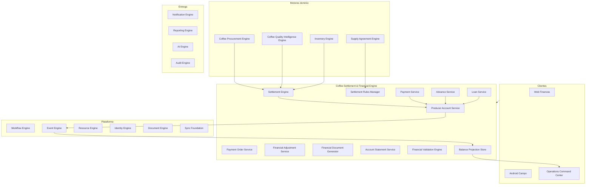
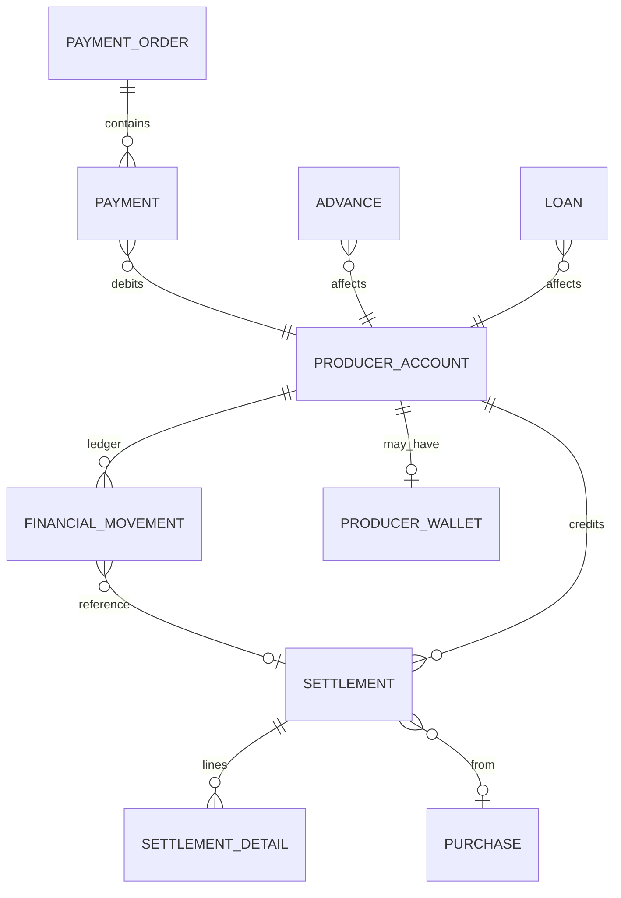
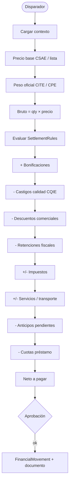
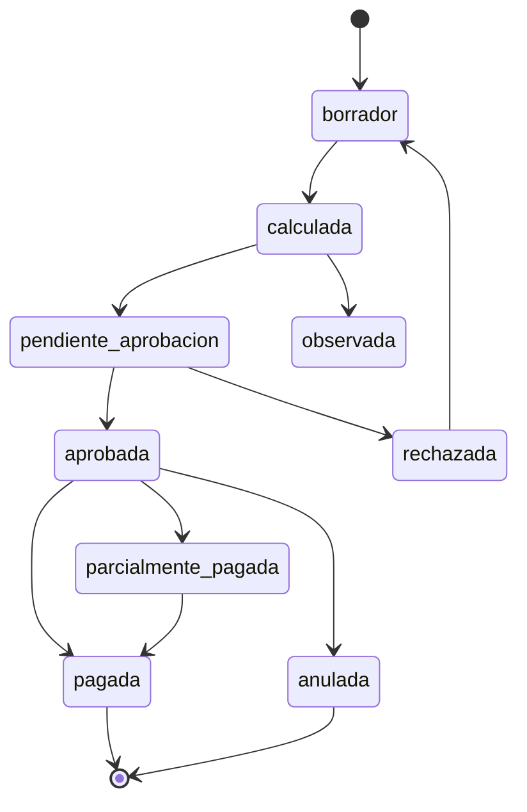

# AGROERP — Coffee Settlement & Financial Engine (CSFE)

**Versión:** 1.0  
**Estado:** Oficial — Especificación del motor de liquidación y relaciones económicas con productores  
**Audiencia:** Finanzas, tesorería, comercial, cooperativas, arquitectura, auditoría, legal  
**Naturaleza:** Motor empresarial de dominio — **no es un módulo contable ni un ERP financiero general**

---

## 0. Propósito y autoridad

El **Coffee Settlement & Financial Engine (CSFE)** administra **todas las operaciones económicas entre la empresa y el productor de café**: liquidaciones, pagos, anticipos, préstamos, descuentos, bonificaciones, castigos, retenciones, saldos, cartera e historial financiero del productor.

| Pregunta | Documento que responde |
|----------|------------------------|
| ¿Qué procesos financieros del dominio existen? | `COFFEE_DOMAIN.md` (CDP §4.13) |
| ¿Catálogos finanzas? | `MASTER_DATA_ENGINE.md` (`finance.*`, `purchase.*`) |
| ¿Liquidación preliminar en compra? | `COFFEE_PROCUREMENT_ENGINE.md` (CPE) |
| ¿Ajustes por calidad? | `COFFEE_QUALITY_INTELLIGENCE_ENGINE.md` (CQIE) |
| ¿Precios y primas contractuales? | `COFFEE_SUPPLY_AGREEMENT_ENGINE.md` (CSAE) |
| ¿Integración bancos y pagos externos? | `INTEGRATION_ECOSYSTEM_LAYER.md` (IEL) |
| **¿Cómo se liquida, paga y gestiona la cartera del productor?** | **Este documento (CSFE)** |

### Jerarquía documental

```
DATA_GOVERNANCE_PLATFORM.md              → Golden record, calidad dato
PRODUCER_RELATIONSHIP_MANAGEMENT_PLATFORM.md → Identidad y lifecycle productor (PRM)
COFFEE_PROCUREMENT_ENGINE.md           → Liquidación preliminar (campo)
COFFEE_QUALITY_INTELLIGENCE_ENGINE.md  → Dictamen → ajustes calidad
COFFEE_SUPPLY_AGREEMENT_ENGINE.md       → Precio, primas, términos pago
COFFEE_SETTLEMENT_FINANCIAL_ENGINE.md  → Liquidación definitiva y economía productor (CSFE)
COFFEE_PROCUREMENT_ENGINE.md              → Compra finca (CPE)
COFFEE_LOGISTICS_SUPPLY_CHAIN_ENGINE.md   → Transporte físico (CLSE)
COFFEE_INVENTORY_TRACEABILITY_ENGINE.md   → Recepción / peso oficial (CITE)
AEPS.md                                → Implementación técnica
```

**Regla de oro:** Ningún **pago al productor** se ejecuta sin **liquidación aprobada** en el CSFE (salvo anticipo con política explícita). Toda mutación de saldo del productor es un **FinancialMovement** auditable — nunca un UPDATE directo de saldo.

### Distinción crítica

| Sistema | Responsabilidad |
|---------|-----------------|
| **ERP contable externo** (SAP, Siigo…) | Asientos, PUC, estados financieros legales |
| **CSFE** | Relación económica **empresa ↔ productor** operativa |
| **CPE — LPE** | Estimación en campo (pre-liquidación) |
| **CSFE — Settlement** | Liquidación **definitiva** autoritativa para pago |

### Principios inviolables

| # | Principio | Descripción |
|---|-----------|-------------|
| F1 | **Movement-based ledger** | Saldo productor = f(FinancialMovement); no edición directa |
| F2 | **Settlement before payment** | Pago contra liquidación aprobada (RT-04 CDP) |
| F3 | **Rules, not code** | Cálculo vía SettlementRule + DVE (DGMP) |
| F4 | **Full audit trail** | Quién, cuándo, por qué, documento, evento |
| F5 | **One producer account** | Una cuenta corriente única por productor/org |
| F6 | **Idempotent payments** | `externalId` + referencia bancaria única |
| F7 | **Reversible with workflow** | Anulaciones y reversiones multinivel |
| F8 | **Multi-currency ready** | Moneda base + ExchangeRate preparado |
| F9 | **Offline-aware** | Solicitud anticipo / firma recibo en campo |
| F10 | **Commodity-extensible** | Core abstracto; café = primera implementación |

### Alcance

| Incluye | No incluye |
|---------|------------|
| Liquidación definitiva configurable | Contabilidad general / PUC |
| Cuenta corriente productor | Cuentas por pagar proveedores no-productor |
| Pagos, anticipos, préstamos | Nómina empleados |
| Retenciones e impuestos productor | Declaración fiscal empresarial |
| Estados de cuenta, extractos | Facturación venta a clientes |
| Órdenes y lotes de pago | Conciliación bancaria empresa (futuro módulo tesorería corp.) |
| Documentos PDF/QR productor | |

---

## 1. Visión y arquitectura funcional

### 1.1 Visión

El CSFE es el **ledger económico productor** de AGROERP — comparable en espíritu a:

| Referencia | Capacidad análoga |
|------------|-------------------|
| SAP S/4HANA Settlement Management | Liquidación contra acuerdos |
| Agribusiness producer payment | Pago por entrega con descuentos |
| Cooperativa — cuenta de aportes | Cuenta corriente productor |
| Wallet / sub-ledger | ProducerWallet movimientos |
| Rules engine pricing | SettlementRule parametrizable |

### 1.2 Arquitectura conceptual



### 1.3 Componentes lógicos

| Componente | Responsabilidad |
|------------|-----------------|
| **Producer Account Service (PAC)** | Cuenta corriente única, saldo, historial |
| **Settlement Engine (SEM)** | Cálculo liquidación definitiva |
| **Settlement Rules Manager (SRM)** | Reglas parametrizables (DVE-style) |
| **Advance Service** | Ciclo anticipos |
| **Loan Service** | Préstamos productor |
| **Payment Service** | Ejecución pagos |
| **Payment Order Service** | Órdenes, lotes, aprobación |
| **Financial Adjustment Service** | Ajustes, compensaciones, reversiones |
| **Financial Document Generator** | PDF, QR, recibos |
| **Account Statement Service** | Extractos y certificados |
| **Financial Validation Engine** | Validaciones pre-pago |
| **Balance Projection Store** | Saldos materializados (derivados) |

---

## 2. Modelo de entidades

### 2.1 Diagrama agregados



### 2.2 ProducerAccount (cuenta corriente productor)

| Atributo | Descripción |
|----------|-------------|
| `accountId` | UUID |
| `producerId` | Productor titular (único por org) |
| `organizationId` | Tenant |
| `accountNumber` | Número humano |
| `currencyCode` | `finance.currency` |
| `balance` | **Proyección** — derivado de movimientos |
| `availableBalance` | balance − retenciones − bloqueos |
| `creditLimit` | Límite anticipos/préstamos |
| `status` | `active`, `suspended`, `closed`, `under_review` |
| `lastMovementAt` | |
| `riskScore` | IA (opcional) |
| `preferredPaymentMethodCode` | `producer.payment_preference` |
| `defaultBankAccountId` | Cuenta bancaria default |
| `notes` | Observaciones permanentes |
| `createdAt` | |

**Invariante:** Un productor = una `ProducerAccount` por `organizationId`.

### 2.3 ProducerWallet (sub-ledger opcional)

Para segregar conceptos sin múltiples cuentas:

| Campo | Uso |
|-------|-----|
| `walletId` | |
| `accountId` | Padre |
| `walletType` | `operational`, `advance_pool`, `loan_escrow` |
| `balance` | Proyección |

### 2.4 FinancialMovement (movimiento económico — única vía de cambio de saldo)

| Atributo | Descripción |
|----------|-------------|
| `movementId` | UUID |
| `externalId` | Offline idempotencia |
| `accountId` | Cuenta productor |
| `movementType` | Ver §5 |
| `direction` | `credit` (a favor productor) / `debit` (a favor empresa) |
| `amount` | Siempre positivo; dirección define signo en ledger |
| `currencyCode` | |
| `balanceBefore` | Kardex financiero |
| `balanceAfter` | |
| `referenceType` | `settlement`, `payment`, `advance`, `loan`, `adjustment`… |
| `referenceId` | |
| `conceptCode` | Catálogo concepto configurable |
| `description` | Texto legible |
| `occurredAt` | Fecha económica |
| `postedAt` | Fecha registro |
| `performedBy` | Usuario |
| `eventId` | Event Engine |
| `workflowInstanceId` | Si aprobación |
| `reversalOfMovementId` | Si reverso |
| `immutable` | true post-confirmación |

### 2.5 Settlement (liquidación)

| Atributo | Descripción |
|----------|-------------|
| `settlementId` | UUID |
| `settlementNumber` | Humano |
| `organizationId` | |
| `producerId` | |
| `accountId` | |
| `purchaseId` | CPE (opcional múltiple en consolidada) |
| `agreementId` | CSAE |
| `receptionId` / `inventoryLotId` | CITE |
| `evaluationId` / `dictamenId` | CQIE |
| `settlementType` | `standard`, `consolidated`, `partial`, `final` |
| `settlementTemplateId` | Plantilla reglas |
| `status` | §7 |
| **Cantidades** | |
| `quantityKg` | Peso base liquidación |
| `uomCode` | |
| `presentationCode` | cereza, pergamino, oro |
| **Montos** | |
| `grossAmount` | Bruto |
| `totalBonuses` | Σ bonificaciones |
| `totalPenalties` | Σ castigos |
| `totalDiscounts` | Σ descuentos |
| `totalRetentions` | Σ retenciones |
| `totalTaxes` | Impuestos si aplican |
| `netAmount` | **A pagar** |
| `advanceOffset` | Anticipos descontados |
| `loanOffset` | Cuotas préstamo descontadas |
| `amountPayable` | net − offsets |
| `currencyCode` | |
| `exchangeRate` | Si multi-moneda |
| `formulaTrace` | JSON auditoría cálculo |
| `preliminarySettlementRef` | CPE LPE comparación |
| `observations` | |
| `approvedBy` / `approvedAt` | |
| `workflowInstanceId` | |

### 2.6 SettlementDetail (línea de liquidación)

| Campo | Descripción |
|-------|-------------|
| `lineId` | |
| `settlementId` | |
| `lineType` | `base_price`, `bonus`, `penalty`, `discount`, `retention`, `tax`, `service`, `transport`, `advance_offset`, `loan_offset`, `custom` |
| `conceptCode` | Catálogo |
| `description` | |
| `quantity` | kg, %, unidades |
| `unitPrice` | |
| `amount` | + crédito productor / − según tipo |
| `ruleId` | SettlementRule aplicada |
| `sortOrder` | |

### 2.7 SettlementRule (regla parametrizable)

| Campo | Descripción |
|-------|-------------|
| `ruleId` | |
| `ruleKey` | `humidity_penalty_gt_12` |
| `name` | |
| `organizationId` | |
| `condition` | Expresión DVE: `IF moisture > 12 THEN apply` |
| `action` | `apply_discount`, `apply_bonus`, `apply_retention`, `block` |
| `parameters` | JSON { `rate`: 2%, `conceptCode`: `PEN_HUM` } |
| `priority` | Orden evaluación |
| `effectiveFrom` / `effectiveTo` | |
| `commodityScope` | `coffee` / `*` |
| `enabled` | |

### 2.8 SettlementTemplate (plantilla)

Agrupa reglas por política comercial:

| Campo | Descripción |
|-------|-------------|
| `templateId` | |
| `templateCode` | `coffee.standard.pergamino` |
| `name` | |
| `ruleIds` | Ordenadas |
| `basePriceSource` | `csae_agreement`, `price_list`, `manual` |
| `defaultPaymentTermCode` | |

### 2.9 Advance (anticipo)

| Campo | Descripción |
|-------|-------------|
| `advanceId` | |
| `producerId` / `accountId` | |
| `agreementId` | Opcional — contra contrato |
| `requestedAmount` | |
| `approvedAmount` | |
| `deliveredAmount` | Pagado |
| `offsetAmount` | Ya descontado en liquidaciones |
| `pendingOffset` | Saldo pendiente descontar |
| `status` | §7 |
| `interestRate` | Si aplica |
| `requestedAt` / `approvedAt` / `deliveredAt` | |
| `dueDate` | |
| `workflowInstanceId` | |

### 2.10 Loan (préstamo)

| Campo | Descripción |
|-------|-------------|
| `loanId` | |
| `loanNumber` | |
| `producerId` / `accountId` | |
| `principalAmount` | |
| `interestRate` | Anual o flat |
| `termMonths` | |
| `installmentAmount` | |
| `paidPrincipal` / `paidInterest` | |
| `outstandingBalance` | Proyección |
| `status` | `pending`, `active`, `paid`, `defaulted`, `restructured`, `cancelled` |
| `guaranteeType` | `future_harvest`, `pledge`, `personal` |
| `guaranteeDocuments` | |
| `schedule` | Array cuotas |
| `disbursementPaymentId` | |

### 2.11 Discount / Bonus / Penalty / Retention

Entidades de catálogo o instancias aplicadas en SettlementDetail:

| Entidad | Uso |
|---------|-----|
| `Discount` | Descuento comercial o administrativo |
| `Bonus` | Bonificación, prima certificación, incentivo volumen |
| `Penalty` | Castigo humedad, impurezas, defectos |
| `Retention` | Retención fuente, ICA, etc. |

Cada uno referencia `finance.tax_type`, `trade.discount_type`, `trade.premium_type` del MDM.

### 2.12 PaymentOrder (orden de pago)

| Campo | Descripción |
|-------|-------------|
| `paymentOrderId` | |
| `orderNumber` | |
| `orderType` | `settlement`, `advance`, `loan_disbursement`, `batch` |
| `producerId` / `accountId` | |
| `settlementId` | Si aplica |
| `amount` | |
| `currencyCode` | |
| `paymentMethodCode` | `finance.payment_method` |
| `bankAccountId` | Destino productor |
| `status` | §7 |
| `scheduledDate` | |
| `approvedBy` | |
| `workflowInstanceId` | |
| `batchId` | Si pago masivo |

### 2.13 Payment (pago ejecutado)

| Campo | Descripción |
|-------|-------------|
| `paymentId` | |
| `paymentOrderId` | |
| `amount` | |
| `paymentMethodCode` | efectivo, transferencia, cheque, consignación |
| `paymentComponents` | Array si pago mixto |
| `bankReference` | Referencia transferencia |
| `checkNumber` | |
| `executedAt` | |
| `confirmedAt` | Acreditación verificada |
| `status` | `pending`, `executed`, `confirmed`, `failed`, `reversed` |
| `receiptDocumentId` | PDF recibo |
| `producerSignatureId` | Firma recibo campo |

### 2.14 PaymentBatch (lote pago masivo)

| Campo | Descripción |
|-------|-------------|
| `batchId` | |
| `batchNumber` | |
| `totalAmount` | |
| `paymentCount` | |
| `status` | `draft`, `approved`, `processing`, `completed`, `partial_failure` |
| `paymentOrderIds` | |
| `bankFileReference` | Archivo dispersión |

### 2.15 BankAccount

| Campo | Descripción |
|-------|-------------|
| `bankAccountId` | |
| `producerId` | Titular |
| `bankName` | |
| `accountType` | Ahorros, corriente |
| `accountNumber` | |
| `verified` | Verificación Identity/KYC |
| `verifiedAt` | |
| `status` | `active`, `inactive` |

### 2.16 FinancialDocument

| Tipo | Descripción |
|------|-------------|
| `settlement_pdf` | Liquidación |
| `payment_receipt` | Recibo pago |
| `account_statement` | Estado cuenta |
| `advance_voucher` | Comprobante anticipo |
| `loan_contract` | Contrato préstamo |
| `tax_certificate` | Certificado retención |
| `support_document` | Documento soporte fiscal (país) |

### 2.17 FinancialAdjustment

| Campo | Descripción |
|-------|-------------|
| `adjustmentId` | |
| `accountId` | |
| `adjustmentType` | `positive`, `negative`, `compensation`, `reversal` |
| `amount` | |
| `reasonCode` | |
| `referenceMovementId` | |
| `workflowInstanceId` | |
| `movementId` | Generado |

### 2.18 AccountStatement / Collection / Refund

| Entidad | Uso |
|---------|-----|
| `AccountStatement` | Extracto periodo — solo lectura consolidada |
| `Collection` | Cobro a productor (saldo negativo, devolución anticipo) |
| `Refund` | Devolución pago erróneo |

### 2.19 ExchangeRate (preparado)

| Campo | Descripción |
|-------|-------------|
| `rateId` | |
| `fromCurrency` / `toCurrency` | |
| `rate` | |
| `sourceCode` | `finance.exchange_rate_source` |
| `effectiveDate` | |

---

## 3. Cuenta corriente del productor

### 3.1 Principio de operación

```
Saldo = Σ credits − Σ debits
```

Todo impacto económico genera `FinancialMovement`:

| Origen | Dirección típica | Concepto |
|--------|------------------|----------|
| Liquidación aprobada | credit | Compra café |
| Pago ejecutado | debit | Desembolso |
| Anticipo entregado | debit | Anticipo (productor debe) |
| Descuento anticipo en liquidación | credit offset | Compensación |
| Bonificación manual | credit | Ajuste positivo |
| Castigo / retención en liquidación | debit en línea | Reduce neto |
| Cuota préstamo | debit en liquidación | Descuento automático |
| Ajuste financiero | credit/debit | Corrección |
| Cobro / devolución | debit/credit | Excepciones |

### 3.2 Vista productor (extracto)

Cada línea muestra: fecha, concepto, referencia (compra/liquidación/pago), débito, crédito, saldo, documento PDF, notas.

### 3.3 Bloqueos de cuenta

| Estado | Efecto |
|--------|--------|
| `suspended` | No nuevos anticipos/pagos; liquidaciones permitidas según política |
| `under_review` | Alerta fraude; pagos requieren gerencia |

---

## 4. Motor de liquidación (Settlement Engine)

### 4.1 Pipeline de cálculo



### 4.2 Disparadores de liquidación

| Disparador | Condición |
|------------|-----------|
| `PurchaseConfirmed` + recepción CITE | Peso oficial |
| `DictamenEmitted` CQIE | Calidad final |
| Manual supervisor | Consolidada |
| Cierre campaña | Liquidación final pendientes |

### 4.3 Conceptos configurables (líneas SettlementDetail)

| Concepto | Fuente regla |
|----------|--------------|
| Precio base | CSAE PEM |
| Precio diferencial | NY + diff, variedad especial |
| Prima certificación | `IF certified THEN bonus` |
| Prima calidad / taza | CQIE score bands |
| Castigo humedad | `IF moisture > 12% THEN discount X` |
| Castigo impurezas | Tabla |
| Castigo defectos | CQIE defect count |
| Retención fuente | `finance.tax_rate` |
| Descuento comercial | CSAE |
| Descuento administrativo | Manual workflow |
| Transporte | Servicio configurable |
| Fertilizantes / insumos | Crédito contra entrega |
| Incentivo volumen | `IF qty > X THEN bonus` |

### 4.4 Relación CPE preliminar vs CSFE definitiva

| Aspecto | CPE (LPE) | CSFE (Settlement) |
|---------|-----------|-------------------|
| Autoridad pago | No | Sí |
| Peso | Estimado campo | Oficial CITE |
| Calidad | Preliminar | Dictamen CQIE |
| Uso | Recibo productor estimado | Liquidación legal/comercial |

Discrepancia > umbral → `settlement_observed` + workflow.

---

## 5. Tipos de FinancialMovement

| Tipo | Dirección | Descripción |
|------|-----------|-------------|
| `settlement_credit` | credit | Liquidación a favor productor |
| `payment_debit` | debit | Pago saliente |
| `advance_disbursement` | debit | Anticipo entregado (deuda productor) |
| `advance_offset` | credit | Compensación anticipo en liquidación |
| `loan_disbursement` | credit | Desembolso préstamo (?) — o debit según modelo; típico: credit cash to producer = debit account liability |
| `loan_installment` | debit | Cuota descontada |
| `bonus_credit` | credit | Bonificación fuera liquidación |
| `penalty_debit` | debit | Castigo directo |
| `retention_debit` | debit | Retención |
| `adjustment_credit` | credit | Ajuste positivo |
| `adjustment_debit` | debit | Ajuste negativo |
| `refund_credit` | credit | Devolución al productor |
| `collection_debit` | debit | Cobro a productor |
| `reversal` | opuesto | Anula movimiento |

**Modelo contable productor simplificado:**
- **Credit** = empresa debe al productor (más saldo a favor)
- **Debit** = empresa pagó o productor debe (reduce saldo a favor)

### 5.1 Reglas de movimiento

| ID | Regla |
|----|-------|
| CSFE-M01 | Movimiento confirmado es inmutable; reverso solo vía `reversal` |
| CSFE-M02 | Pago no puede exceder `amountPayable` liquidación vinculada |
| CSFE-M03 | Pago solo a `BankAccount` verificada |
| CSFE-M04 | Anticipo no excede % contrato (CSAE RC-06) |
| CSFE-M05 | Σ anticipos + compras no excede cupo sin adenda |

---

## 6. Motor de reglas (Settlement Rules Manager)

### 6.1 Ejemplos de reglas

```
RULE humidity_penalty
IF context.moisture_pct > 12
THEN apply_penalty(concept: PEN_HUMIDITY, formula: table_moisture_discount)

RULE organic_bonus
IF context.certifications CONTAINS 'organic' AND context.cert_valid = true
THEN apply_bonus(concept: BON_ORGANIC, amount: agreement.premium_organic)

RULE specialty_variety
IF context.variety_code IN ['gesha', 'bourbon_rosado']
THEN apply_price_differential(concept: DIFF_SPECIALTY, rate: +15%)

RULE volume_incentive
IF context.quantity_kg >= 1000
THEN apply_bonus(concept: BON_VOLUME, amount: fixed_50000_cop)

RULE broca_penalty
IF context.broca_pct > agreement.max_broca
THEN apply_penalty(concept: PEN_BROCA, formula: linear)
```

### 6.2 Integración DVE (DGMP)

- Reglas almacenadas como metadata
- Evaluación en servidor; preview en cliente
- `formulaTrace` en Settlement para auditoría

### 6.3 Prioridad y conflictos

1. Reglas bloqueo (`block`) primero
2. Precio base
3. Castigos calidad
4. Bonificaciones
5. Retenciones
6. Offsets anticipo/préstamo

---

## 7. Estados

### 7.1 Settlement



### 7.2 PaymentOrder

`borrador` → `pendiente_aprobacion` → `programada` → `en_ejecucion` → `ejecutada` → `confirmada` | `fallida` | `anulada` | `reversada`

### 7.3 Advance

`solicitado` → `pendiente_aprobacion` → `aprobado` → `entregado` → `compensado_parcial` → `compensado_total` | `anulado` | `refinanciado`

### 7.4 Loan

`solicitado` → `aprobado` → `desembolsado` → `activo` → `pagado` | `mora` | `reestructurado` | `cancelado`

### 7.5 Payment

`pendiente` → `ejecutado` → `confirmado` | `fallido` → `reversado`

---

## 8. Anticipos — ciclo completo

| Paso | Acción | Workflow |
|------|--------|----------|
| 1 | Solicitud (web/Android) | — |
| 2 | Validación cupo/contrato CSAE | Auto |
| 3 | Aprobación supervisor/gerencia | `finance.advance.approval` |
| 4 | Orden de pago | PaymentOrder |
| 5 | Entrega (transferencia/efectivo) | Payment + movement |
| 6 | Registro deuda `pendingOffset` | |
| 7 | Descuento automático en próximas liquidaciones | FIFO anticipos |
| 8 | Anulación / refinanciación | Workflow + reversal |

---

## 9. Préstamos

| Capacidad | Descripción |
|-----------|-------------|
| Simulación cuotas | Antes de aprobar |
| Desembolso | Payment vinculado |
| Calendario amortización | Principal + interés |
| Descuento automático | En liquidación por cuota |
| Mora | Alertas + `loan.defaulted` |
| Reestructuración | Nuevo schedule + workflow |
| Garantías | Documentos + futura cosecha |
| Historial | Todos movimientos |

---

## 10. Pagos y órdenes de pago

### 10.1 Métodos de pago

| Método | Campos |
|--------|--------|
| Efectivo | Recibo firmado, foto opcional |
| Transferencia | `bankReference`, cuenta verificada |
| Cheque | `checkNumber`, banco |
| Consignación | Referencia ventanilla |
| Mixto | `paymentComponents[]` |
| Billetera digital (futuro) | `walletProvider`, `txId` |

### 10.2 Flujo orden de pago

1. **Generación** — desde liquidación aprobada o anticipo
2. **Aprobación** — workflow según monto
3. **Programación** — `scheduledDate`
4. **Ejecución** — tesorería / integración banco
5. **Confirmación** — acreditación verificada
6. **Anulación / reversión** — movimiento reverso + workflow

### 10.3 Pago masivo

- `PaymentBatch` agrupa órdenes
- Archivo banco (futuro integración)
- Manejo fallos parciales

### 10.4 Pago parcial

- Liquidación `parcialmente_pagada`
- Saldo pendiente en cuenta
- Múltiples Payment contra misma Settlement

---

## 11. Ajustes financieros

| Tipo | Uso | Aprobación |
|------|-----|------------|
| Positivo | Corrección a favor productor | Supervisor+ |
| Negativo | Corrección a favor empresa | Gerencia |
| Reversión | Anula movimiento erróneo | Workflow |
| Compensación | Cruce saldos entre conceptos | Finanzas |
| Corrección | Error digitación | Auditoría |

Todo genera `FinancialAdjustment` + `FinancialMovement` + Audit.

---

## 12. Documentos generados

| Documento | Plantilla Document Engine | Contenido |
|-----------|---------------------------|-----------|
| Liquidación | `finance.settlement` | Detalle líneas, neto, firmas |
| Recibo pago | `finance.payment_receipt` | Monto, método, referencia |
| Estado de cuenta | `finance.account_statement` | Movimientos periodo |
| Extracto | `finance.extract` | Resumen |
| Certificado retención | `finance.withholding_cert` | Fiscal país |
| Comprobante anticipo | `finance.advance` | |
| Contrato préstamo | `finance.loan` | |
| QR verificación | En todos | URL + hash |

Firma digital productor en recibo (Android offline sync).

---

## 13. Workflow Engine

| workflowKey | Uso |
|-------------|-----|
| `finance.settlement.approval` | Liquidación |
| `finance.settlement.observed` | Discrepancia CPE/CQIE |
| `finance.payment.approval` | Orden pago > umbral |
| `finance.payment.reversal` | Reverso pago |
| `finance.advance.approval` | Anticipo |
| `finance.loan.approval` | Préstamo |
| `finance.adjustment.approval` | Ajuste |
| `finance.batch.approval` | Lote masivo |
| `finance.account.suspend` | Suspender cuenta |

---

## 14. Eventos de dominio

| Evento | Cuándo |
|--------|--------|
| `SettlementDraftCreated` | Borrador |
| `SettlementCalculated` | Cálculo completo |
| `SettlementApproved` | Aprobada |
| `SettlementObserved` | Discrepancia |
| `SettlementPaid` | Pagada total |
| `SettlementCancelled` | Anulada |
| `FinancialMovementPosted` | Movimiento confirmado |
| `FinancialMovementReversed` | Reverso |
| `AdvanceRequested` | Solicitud anticipo |
| `AdvanceApproved` | |
| `AdvanceDelivered` | Entregado |
| `AdvanceOffsetApplied` | Descontado en liquidación |
| `LoanApproved` | |
| `LoanDisbursed` | |
| `LoanInstallmentDue` | Cuota vencida |
| `LoanPaidOff` | Cancelado |
| `PaymentOrderCreated` | |
| `PaymentOrderApproved` | |
| `PaymentExecuted` | |
| `PaymentConfirmed` | |
| `PaymentFailed` | |
| `PaymentReversed` | |
| `PaymentBatchCompleted` | |
| `ProducerAccountSuspended` | |
| `AccountStatementGenerated` | |
| `FinancialAdjustmentPosted` | |
| `ProducerBalanceNegative` | Alerta |

**Alias CDP:** `LiquidacionGenerada`, `LiquidacionAprobada`, `PagoEjecutado`, `PagoConfirmado`, `AnticipoOtorgado`, `EstadoCuentaActualizado`.

---

## 15. Integraciones

| Motor | Dirección | Uso |
|-------|-----------|-----|
| **Identity Engine** | Consume | Permisos, aprobadores, KYC bancos |
| **Workflow Engine** | Bidireccional | §13 |
| **Coffee Procurement Engine** | Consume | Compra, LPE preliminar |
| **Coffee Quality Intelligence Engine** | Consume | Dictamen, castigos calidad |
| **Coffee Supply Agreement Engine** | Consume | Precio, primas, términos, cupo anticipo |
| **Coffee Inventory & Traceability Engine** | Consume | Peso oficial recepción |
| **Document Engine** | CSFE consume | PDF, plantillas |
| **Notification Engine** | CSFE publica | Pago confirmado, anticipo |
| **Operations Command Center** | CSFE alimenta | Pagos pendientes, SLA |
| **Reporting Engine** | CSFE alimenta | §16 |
| **AI Engine** | Bidireccional | §17 |
| **Audit Engine** | CSFE publica | Todos movimientos |
| **Event Engine** | CSFE publica | Fuente verdad financiera productor |
| **DGMP / DVE** | CSFE consume | Reglas liquidación |

### 15.1 Permisos Identity

| Permiso | Descripción |
|---------|-------------|
| `finance:settlement:read` | Consultar liquidaciones |
| `finance:settlement:create` | Crear/calcular |
| `finance:settlement:approve` | Aprobar |
| `finance:payment:read` | |
| `finance:payment:create` | Orden pago |
| `finance:payment:execute` | Ejecutar |
| `finance:payment:confirm` | Confirmar acreditación |
| `finance:payment:reverse` | Reverso |
| `finance:advance:request` | Solicitar (comprador/productor) |
| `finance:advance:approve` | |
| `finance:loan:manage` | Préstamos |
| `finance:account:read` | Estado cuenta |
| `finance:adjustment:propose` | |
| `finance:adjustment:approve` | |
| `finance:batch:manage` | Lotes masivos |
| `finance:rules:admin` | SettlementRules |
| `finance:report` | Reportes |
| `finance:audit` | Solo lectura auditoría |

---

## 16. Reportes

| Reporte | Audiencia |
|---------|-----------|
| Estado de cuenta productor | Productor, finanzas |
| Pagos realizados | Tesorería |
| Pagos pendientes | Tesorería, OCC |
| Anticipos abiertos | Comercial, finanzas |
| Préstamos activos / mora | Finanzas |
| Productores con saldo a favor / en contra | Gerencia |
| Flujo financiero campaña | Gerencia |
| Movimientos diarios | Tesorería |
| Liquidaciones periodo | Comercial |
| Bonificaciones otorgadas | Comercial |
| Castigos aplicados | Calidad, comercial |
| Retenciones fiscales | Contabilidad externa |
| Discrepancia preliminar vs definitiva | Auditoría |

---

## 17. KPIs

| KPI | Definición |
|-----|------------|
| Tiempo promedio de pago | Recepción/dictamen → `PaymentConfirmed` |
| % cumplimiento SLA pago | Dentro plazo política |
| Liquidez requerida | Σ pendientes pago periodo |
| Bonificaciones otorgadas | Σ bonuses / campaña |
| Descuentos aplicados | Σ penalties + discounts |
| Anticipos expuestos | Σ `pendingOffset` |
| Préstamos activos | Count + outstanding |
| Productores financiados | Con préstamo activo |
| Cartera total | Σ saldos a favor productores |
| Riesgo financiero | Score IA agregado |
| Tasa mora préstamos | |
| Exactitud liquidación | Discrepancia vs preliminar |

---

## 18. Alertas configurables

| ID | Alerta |
|----|--------|
| CSFE-ALT-01 | Pagos pendientes > N días |
| CSFE-ALT-02 | Anticipo vencido sin compensar |
| CSFE-ALT-03 | Préstamo cuota vencida |
| CSFE-ALT-04 | Liquidación observada sin resolver |
| CSFE-ALT-05 | Movimiento inusual (IA) |
| CSFE-ALT-06 | Saldo negativo productor |
| CSFE-ALT-07 | Pago a cuenta no verificada intentado |
| CSFE-ALT-08 | Liquidación sin dictamen CQIE |
| CSFE-ALT-09 | Batch pago fallos parciales |
| CSFE-ALT-10 | Límite crédito anticipos excedido |

Publicadas a OCC y Notification Engine.

---

## 19. Inteligencia artificial

| Caso | Entrada | Salida |
|------|---------|--------|
| Predicción flujo de caja | Pipeline liquidaciones, calendario pago | Desembolsos proyectados 30/60/90d |
| Riesgo incumplimiento préstamo | Histórico productor, entregas | Probabilidad mora |
| Recomendación incentivos | Calidad, lealtad, volumen | Bonus sugerido dentro política |
| Detección fraude | Patrones pago, cuentas, duplicados | Alerta |
| Análisis financiero productor | Serie movimientos | Segmento / score |
| Predicción liquidez campaña | Compras CPE, precios CSAE | Necesidad tesorería |
| Optimización calendario pago | Cash disponible, SLA | Secuencia pagos sugerida |

Principios: IA no aprueba pagos ni modifica saldos sin humano.

---

## 20. Escalabilidad multi-commodity

| Capa | Café | Cacao (futuro) |
|------|------|----------------|
| Core CSFE | Account, Movement, Settlement, Payment | Igual |
| Rules | Humedad, SCA premiums | Fermentación, humedad grano |
| Templates | `coffee.standard` | `cacao.standard` |
| Documents | Liquidación café | Adaptación labels |

```yaml
pluginId: agro.coffee.settlement_financial
commodity: coffee
resourceTypes:
  - coffee.settlement
  - coffee.producer_account
  - coffee.financial_movement
dependsOn:
  - agro.coffee.procurement
  - agro.coffee.quality_intelligence
eventNamespace: coffee.finance
```

---

## 21. Riesgos

| Categoría | Riesgo | Mitigación |
|-----------|--------|------------|
| Financiero | Pago sin liquidación | CSFE-M02, workflow |
| Fraude | Cuenta bancaria ajena | Verificación + RD-05 CDP |
| Operativo | Liquidación errónea | formulaTrace, doble aprobación |
| Legal | Retención incorrecta | Reglas fiscales versionadas |
| Reputacional | Recibo distinto a pago | Payment ↔ Settlement link |
| Técnico | Doble pago sync | externalId |
| Concentración | Cartera en pocos productores | KPI concentración |

---

## 22. Roadmap evolutivo

| Fase | Entregables | Dependencias |
|------|-------------|--------------|
| **F1 — Cuenta y liquidación** | ProducerAccount, Movement, Settlement básico | CPE, CSAE |
| **F2 — Calidad** | Integración CQIE castigos | CQIE |
| **F3 — Pagos** | PaymentOrder, Payment, recibos | Document Engine |
| **F4 — Anticipos** | Advance ciclo completo | Workflow |
| **F5 — Préstamos** | Loan + amortización | |
| **F6 — Reglas avanzadas** | SRM + DVE | DGMP |
| **F7 — Masivo** | PaymentBatch, archivo banco | |
| **F8 — IA** | Flujo caja, fraude | AI Engine |
| **F9 — Multi-commodity** | Plugin cacao | |

---

## 23. Checklist de cumplimiento

- [ ] Saldo solo vía FinancialMovement
- [ ] Liquidación antes de pago
- [ ] Una cuenta por productor/org
- [ ] Reglas en metadata, no código hardcoded
- [ ] formulaTrace en cada Settlement
- [ ] Workflow en aprobaciones y reversiones
- [ ] Eventos en APOS Event Catalog
- [ ] Permisos `finance:*` Identity
- [ ] OCC pagos pendientes y SLA
- [ ] Documentos PDF con QR
- [ ] Registro plugin APOS
- [ ] Distinción vs ERP contable documentada

---

## 24. Conclusión

El **Coffee Settlement & Financial Engine (CSFE)** es el **estándar oficial** de operaciones económicas empresa ↔ productor en AGROERP. Proporciona:

- **25+ entidades** financieras modeladas
- **Cuenta corriente única** por productor con ledger de movimientos
- **Motor de liquidación configurable** con reglas parametrizables
- **Anticipos y préstamos** con ciclo completo y descuento automático
- **Órdenes y pagos** — efectivo, transferencia, cheque, mixto, masivo
- **Ajustes auditados** y reversiones con workflow
- **Documentos automáticos** — liquidación, recibo, estado de cuenta, QR
- **25+ eventos** de dominio
- **12 reportes**, **11 KPIs**, **10 alertas**
- **7 casos de IA** para flujo de caja y riesgo
- **Extensión multi-commodity**

**No es contabilidad general** — es el **sub-ledger del productor** integrado con compra, calidad, acuerdos e inventario.

---

*Documento elaborado para AGROERP — Coffee Settlement & Financial Engine v1.0.*  
*Jerarquía:* `COFFEE_INVENTORY_TRACEABILITY_ENGINE.md` → **`COFFEE_SETTLEMENT_FINANCIAL_ENGINE.md`** → ERP contable externo (futuro)  
*Próximo paso recomendado:* Fase F1 — ProducerAccount + Settlement Engine + integración CPE/CQIE/CSAE.
