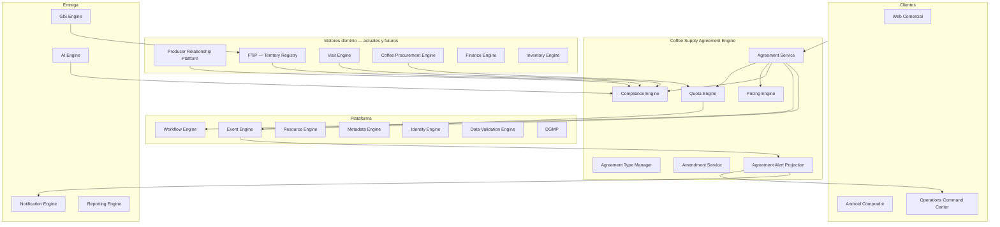
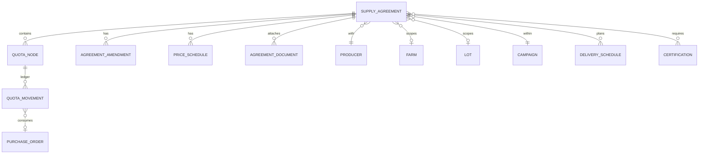
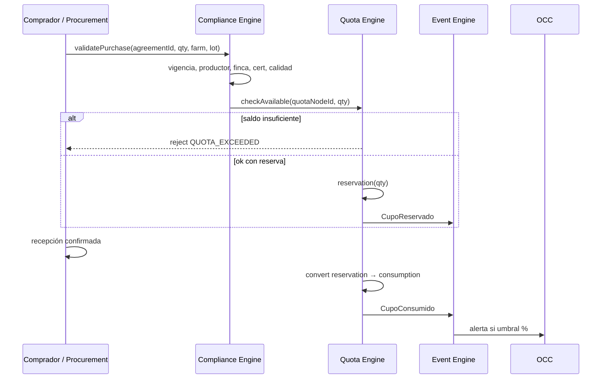
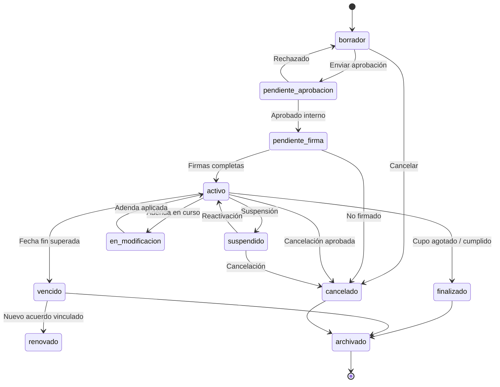

# AGROERP — Coffee Supply Agreement Engine (CSAE)

**Versión:** 1.0  
**Estado:** Oficial — Especificación del motor de acuerdos comerciales de abastecimiento  
**Audiencia:** Comercial, abastecimiento, finanzas, arquitectura, producto, legal, auditoría  
**Naturaleza:** Motor empresarial de dominio — **no es un CRUD de contratos ni un módulo de pantallas**

---

## 0. Propósito y autoridad

El **Coffee Supply Agreement Engine (CSAE)** administra el **ciclo de vida completo** de los acuerdos comerciales de compra de café entre la empresa y los productores: negociación, formalización, cupos, vigencia, modificaciones, consumo, cumplimiento, riesgo y cierre.

| Pregunta | Documento que responde |
|----------|------------------------|
| ¿Qué procesos comerciales existen? | `COFFEE_DOMAIN.md` (CDP §4.6, §4.22) |
| ¿Qué catálogos comerciales hay? | `MASTER_DATA_ENGINE.md` (`trade.*`) |
| ¿Cómo se orquesta la plataforma? | `APOS.md` |
| ¿Cómo se monitorea la operación? | `OPERATIONS_COMMAND_CENTER.md` |
| **¿Cómo se gobiernan los acuerdos y cupos?** | **Este documento (CSAE)** |

### Jerarquía documental

```
APOS.md                              → Orquestación
COFFEE_DOMAIN.md                     → Dominio cafetero (procesos comerciales)
COFFEE_SUPPLY_AGREEMENT_ENGINE.md    → Motor de acuerdos y cupos (CSAE)
OPERATIONS_COMMAND_CENTER.md         → Alertas y KPIs operativos
WORKFLOW_ENGINE.md                   → Aprobaciones transversales
AEPS.md                              → Implementación técnica
```

**Regla de oro:** Ninguna compra de café (Coffee Procurement Engine) puede consumir volumen sin pasar por la **validación de cupo** del CSAE, salvo excepción documentada vía Workflow.

### Alcance

| Incluye | No incluye |
|---------|------------|
| Tipos de acuerdo configurables | UI de contratos |
| Motor de cupos (ledger) | Ejecución de compra en campo (**Coffee Procurement Engine**) |
| Precios, primas, descuentos contractuales | Liquidación y pago (Finance Engine) |
| Vigencia, estados, adendas | Inventario físico |
| Integración Workflow aprobaciones | Facturación electrónica |
| Alertas y KPIs comerciales | Contratos de **venta** a clientes |
| Trazabilidad acuerdo → compra | Generación PDF legal (Document Engine — consume CSAE) |

### Principio rector

> Un **acuerdo de abastecimiento** no es un documento estático: es un **contrato vivo** con saldo de volumen, condiciones económicas, obligaciones de calidad y un **ledger de cupo** auditable que gobierna cada kilo comprado.

---

## 1. Visión y principios

### 1.1 Visión

El CSAE es el **sistema nervioso comercial de abastecimiento** de AGROERP — comparable en espíritu a:

| Referencia | Capacidad análoga |
|------------|-------------------|
| SAP S/4HANA Scheduling Agreements | Acuerdos marco + entregas contra saldo |
| Oracle SCM Blanket Purchase Agreements | Cupos, releases, tolerancias |
| Agribusiness CTRM | Contratos commodity, precio fijo/variable |
| Salesforce CPQ | Configuración de términos comerciales |
| Master agreement + call-offs | Acuerdo marco + órdenes de compra |

### 1.2 Principios del motor

| # | Principio | Descripción |
|---|-----------|-------------|
| C1 | **Agreement as aggregate** | Acuerdo + cupos + adendas = agregado raíz con invariantes |
| C2 | **Cupo como ledger** | Todo movimiento de volumen es asiento trazable; saldo = f(initial, movements) |
| C3 | **No destructivo** | Adendas y versiones; nunca sobrescribir histórico contractual |
| C4 | **Metadata-first** | Tipos de acuerdo, precios y reglas configurables sin redeploy |
| C5 | **Workflow en mutaciones** | Crear, modificar, ampliar, cancelar → aprobación multinivel |
| C6 | **Event-sourced mutations** | Cada cambio de cupo o estado publica evento de dominio |
| C7 | **Offline-compatible** | Borrador y pre-acuerdo en campo; activación post-sync y firma |
| C8 | **Policy-driven** | Política organización define umbrales, tolerancias y excepciones |
| C9 | **Multi-granularidad** | Cupo por productor, finca, lote, cosecha o periodo — composable |
| C10 | **Commodity-extensible** | Core abstracto `SupplyAgreement`; café es primera implementación |

### 1.3 Arquitectura funcional



### 1.4 Componentes lógicos

| Componente | Responsabilidad |
|------------|-----------------|
| **Agreement Type Manager** | Plantillas de tipos de acuerdo, schemas, reglas por tipo |
| **Agreement Service** | CRUD lógico del agregado acuerdo (vía Resource Engine) |
| **Quota Engine (QEM)** | Ledger de cupos: consumo, reserva, bloqueo, transferencia |
| **Pricing Engine (PEM)** | Precio fijo/variable, primas, descuentos, fórmulas |
| **Compliance Engine (CEM)** | Validaciones pre-compra: vigencia, habilitación, calidad, certificación |
| **Amendment Service** | Adendas, versiones, diff contractual |
| **Agreement Alert Projection** | Proyección para OCC y Notification Engine |

---

## 2. Tipos de acuerdos

Los tipos de acuerdo son **configurables** mediante `AgreementTypeDefinition` (Metadata Engine + catálogo `trade.contract_type`). El CSAE provee **plantillas estándar café**; la organización extiende sin cambiar el motor.

### 2.1 Taxonomía por dimensión de cupo

| Dimensión | Descripción | Ejemplo |
|-----------|-------------|---------|
| **Por productor** | Cupo total al titular | 20.000 kg al productor García |
| **Por finca** | Sub-cupo por finca bajo acuerdo marco | Finca El Roble: 8.000 kg |
| **Por lote** | Cupo atado a lote productivo (L2 trazabilidad) | Lote Caturra norte: 3.000 kg |
| **Por cosecha** | Ventana de recolección específica | Cosecha principal 2026: 5.000 kg |
| **Por período** | Mes, trimestre, semestre dentro de campaña | Q1 2026: 4.000 kg |
| **Abierto** | Sin tope de volumen; precio y condiciones fijas | Spot framework |
| **Cerrado** | Volumen máximo estricto | Contrato firme 15.000 kg |

### 2.2 Taxonomía por condición comercial

| Tipo | Descripción | Motor involucrado |
|------|-------------|-------------------|
| **Precio fijo** | Precio por UOM en vigencia del acuerdo | PEM — tabla fija |
| **Precio variable** | Fórmula indexada (NY C, diferencial, TRM) | PEM — recálculo programado |
| **Con bonificaciones** | Primas por certificación, taza, orgánico | PEM + catálogo `trade.premium_type` |
| **Con descuentos** | Tabla humedad, defectos, incumplimiento | PEM + `trade.discount_type` |
| **Por calidad** | Perfil de taza mínimo / rango SCA | CEM + Quality Engine |
| **Por variedad** | Volumen o precio por `farm.coffee_variety` | Cupo segmentado |
| **Entregas parciales** | Múltiples releases contra mismo cupo | QEM — consumo incremental |
| **Especial** | Condiciones no estándar; workflow gerencial obligatorio | WF template `agreement.special` |

### 2.3 Matriz de tipos estándar (plantillas café)

| Código plantilla | Nombre | Cupo | Precio | Uso típico |
|------------------|--------|------|--------|------------|
| `coffee.supply.fixed.closed` | Compra firme cerrada | Cerrado productor | Fijo | Cooperativa, exportador |
| `coffee.supply.fixed.open` | Marco precio abierto | Abierto | Fijo | Spot recurrente |
| `coffee.supply.variable.closed` | Firme precio variable | Cerrado | Variable NY+diff | Trader |
| `coffee.supply.farm.segmented` | Por finca | Sub-cupos finca | Fijo/variable | Trazabilidad L2 |
| `coffee.supply.lot.micro` | Microlote | Por lote | Prima calidad | Especialidad |
| `coffee.supply.harvest.window` | Por cosecha | Por ventana | Fijo | Estacional |
| `coffee.supply.quality.tiered` | Por perfil taza | Cerrado | Escalonado | Comercial premium |
| `coffee.supply.certified` | Certificado | Cerrado | Fijo + primas | Orgánico, FT |
| `coffee.supply.special` | Especial | Configurable | Configurable | Negociación única |

### 2.4 Composición de tipos

Un acuerdo puede combinar dimensiones mediante **estructura jerárquica de cupos**:

```
Acuerdo marco (productor, campaña 2026)
├── Cupo total: 25.000 kg pergamino
├── Finca El Roble: 10.000 kg
│   ├── Lote A (Caturra): 4.000 kg
│   └── Lote B (Castillo): 6.000 kg
└── Finca La Esperanza: 15.000 kg
    └── Cosecha principal: 15.000 kg
```

**Invariante:** Σ sub-cupos ≤ cupo padre (salvo tipo abierto en raíz).

---

## 3. Modelo conceptual

### 3.1 Agregados y entidades



### 3.2 Supply Agreement — atributos

| Grupo | Atributo | Tipo / catálogo | Obligatorio | Descripción |
|-------|----------|-----------------|-------------|-------------|
| **Identidad** | `agreementId` | UUID | Sí | Identificador estable |
| | `agreementNumber` | string | Sí | Número humano (org-unique) |
| | `organizationId` | UUID | Sí | Tenant |
| | `agreementTypeCode` | `trade.contract_type` | Sí | Plantilla de tipo |
| | `commodity` | `coffee` (extensible) | Sí | Commodity |
| **Partes** | `producerId` | Resource `producer` | Sí | Productor titular |
| | `companyEntityId` | Resource `organization_unit` | Sí | Entidad legal compradora |
| | `buyerUserId` | User | No | Comprador responsable |
| | `commercialRegionalId` | Org unit | No | Regional comercial |
| **Alcance territorial** | `farmId` | Resource `coffee.farm` | Condicional | Si cupo por finca |
| | `lotId` | Resource `coffee.lot` | Condicional | Si cupo por lote |
| | `cropId` | Resource `coffee.crop` | Condicional | Cultivo/campaña agronómica |
| | `harvestId` | Resource / periodo | Condicional | Si cupo por cosecha |
| **Vigencia** | `campaignId` | `trade.campaign` | Sí | Campaña cafetera |
| | `effectiveFrom` | date | Sí | Inicio vigencia |
| | `effectiveTo` | date | Sí | Fin vigencia |
| | `signedAt` | datetime | No | Fecha firma |
| **Estado** | `status` | enum §6 | Sí | Estado ciclo de vida |
| | `workflowInstanceId` | UUID | Condicional | Si en aprobación |
| **Volumen** | `committedQuantity` | decimal | Condicional | Cantidad comprometida total |
| | `deliveredQuantity` | decimal | Calculado | Σ recepciones vinculadas |
| | `pendingQuantity` | decimal | Calculado | committed − delivered |
| | `uomCode` | `uom.*` | Sí | kg, lb, carga, fanega |
| | `presentationCode` | `trade.coffee_presentation` | Sí | Cereza, pergamino, oro |
| **Económico** | `priceTypeCode` | `trade.price_type` | Sí | Fijo, variable, escalonado |
| | `basePrice` | money | Condicional | Precio fijo por UOM |
| | `currencyCode` | `finance.currency` | Sí | COP, USD, etc. |
| | `priceFormula` | expression | Condicional | Si variable |
| | `paymentTermCode` | `trade.payment_term` | Sí | Condiciones de pago |
| | `premiums` | array PremiumRule | No | Bonificaciones |
| | `discounts` | array DiscountRule | No | Descuentos contractuales |
| **Calidad** | `expectedQualityProfile` | catálogo perfil | No | Perfil taza esperado |
| | `minCupScore` | decimal | No | Puntaje SCA mínimo |
| | `maxMoisture` | decimal | No | Humedad máxima contractual |
| | `maxDefects` | decimal | No | Defectos máximos |
| | `qualityTolerance` | object | No | Bandas de aceptación |
| **Certificación** | `requiredCertifications` | array cert codes | No | Orgánico, FT, etc. |
| | `certificationScope` | farm/lot/agreement | No | Alcance validación |
| **Entregas** | `partialDeliveriesAllowed` | boolean | Sí | Default true |
| | `minDeliverySize` | decimal | No | Entrega mínima |
| | `maxDeliverySize` | decimal | No | Entrega máxima |
| | `deliverySchedules` | array | No | Calendario planificado |
| **Documental** | `documents` | array AgreementDocument | No | PDF, anexos |
| | `signatures` | array Signature | No | Firmas digitales |
| | `evidences` | array Evidence | No | Fotos, actas |
| **Gobierno** | `version` | int | Sí | Versión lógica acuerdo |
| | `parentAgreementId` | UUID | No | Si renovación |
| | `observations` | text | No | Notas libres |
| | `tags` | array | No | Clasificación libre |
| | `createdBy` / `updatedBy` | user | Sí | Auditoría |
| | `createdAt` / `updatedAt` | datetime | Sí | Timestamps |

### 3.3 Quota Node (nodo de cupo)

| Atributo | Descripción |
|----------|-------------|
| `quotaNodeId` | Identificador |
| `agreementId` | Acuerdo padre |
| `parentQuotaNodeId` | Jerarquía sub-cupos |
| `scopeType` | `producer` / `farm` / `lot` / `harvest` / `period` |
| `scopeResourceId` | ID finca, lote, etc. |
| `initialQuota` | Cupo inicial asignado |
| `consumedQuota` | Consumido (compras recepcionadas) |
| `reservedQuota` | Reservado (órdenes confirmadas sin recepción) |
| `blockedQuota` | Bloqueado (disputa, auditoría) |
| `availableQuota` | `initial − consumed − reserved − blocked` (+ liberaciones) |
| `status` | `active` / `exhausted` / `suspended` / `closed` |

### 3.4 Quota Movement (movimiento de cupo)

| Campo | Descripción |
|-------|-------------|
| `movementId` | UUID |
| `quotaNodeId` | Nodo afectado |
| `movementType` | Ver §4.2 |
| `quantity` | Cantidad (+/− según tipo) |
| `balanceAfter` | Saldo tras movimiento |
| `referenceType` | `purchase` / `amendment` / `transfer` / `manual` |
| `referenceId` | ID entidad origen |
| `reason` | Texto / catálogo |
| `approvedBy` | Si requiere aprobación |
| `correlationId` | Trazabilidad request |
| `occurredAt` | Timestamp |
| `metadata` | JSON extensible |

### 3.5 Agreement Amendment (adenda)

| Campo | Descripción |
|-------|-------------|
| `amendmentId` | UUID |
| `agreementId` | Acuerdo original |
| `amendmentNumber` | Secuencial |
| `amendmentType` | `quota_change` / `price_change` / `extension` / `scope_change` / `other` |
| `effectiveFrom` | Vigencia adenda |
| `diff` | Cambios estructurados (before/after) |
| `status` | Workflow |
| `documents` | Anexo firmado |

### 3.6 Price Schedule (programación de precio)

Para precios variables:

| Campo | Descripción |
|-------|-------------|
| `scheduleId` | UUID |
| `agreementId` | Acuerdo |
| `validFrom` / `validTo` | Ventana |
| `formula` | Expresión (ej. `NY_C * 0.22 + differential`) |
| `differential` | Diferencial en ctv/lb |
| `fixedComponent` | Componente fijo local |
| `recalculationPolicy` | `daily` / `on_delivery` / `manual` |
| `lastCalculatedPrice` | Último precio resuelto |
| `lastCalculatedAt` | Timestamp |

---

## 4. Gestión de cupos (Quota Engine)

### 4.1 Fórmula de saldo

```
available = initial
          + Σ ampliaciones
          − Σ reducciones
          − Σ consumos
          − Σ reservas_activas
          − Σ bloqueos
          + Σ liberaciones
          ± Σ transferencias_netas
```

**Regla:** `available` nunca puede ser negativo en operación normal; negativo solo en estado `overdraw` con excepción aprobada.

### 4.2 Tipos de movimiento de cupo

| Tipo | Efecto | Disparador típico |
|------|--------|-------------------|
| `initial_allocation` | +initial | Activación acuerdo |
| `consumption` | −qty | Recepción confirmada (Procurement) |
| `reservation` | −available, +reserved | Orden de compra confirmada |
| `reservation_release` | +available, −reserved | Cancelación orden / timeout |
| `reservation_convert` | −reserved, −consumed path | Recepción contra reserva |
| `block` | −available, +blocked | Auditoría, disputa |
| `unblock` | +available, −blocked | Resolución |
| `release` | +available | Liberación manual aprobada |
| `expansion` | +initial | Adenda ampliación |
| `reduction` | −initial | Adenda reducción |
| `transfer_out` | −qty nodo origen | Transferencia entre nodos |
| `transfer_in` | +qty nodo destino | Transferencia entre nodos |
| `correction` | ±qty | Ajuste con aprobación |
| `campaign_close` | cierra nodo | Cierre campaña |
| `expiration` | cierra saldo | Vencimiento acuerdo |

### 4.3 Flujo consumo de cupo (compra)



### 4.4 Jerarquía de consumo

Al registrar compra con finca/lote, QEM resuelve el **nodo de cupo más específico** aplicable:

1. Nodo `lot` si existe y tiene saldo
2. Si no, nodo `farm`
3. Si no, nodo `harvest` / `period`
4. Si no, nodo raíz `producer`

**Política configurable:** `strict` (debe existir nodo específico) vs `rollup` (consume del padre).

### 4.5 Concurrencia

| Escenario | Estrategia |
|-----------|------------|
| Dos compras simultáneas mismo cupo | Bloqueo optimista en `quotaNode.version` |
| Offline pre-orden + online compra | `externalId` + reconciliación; exceso → excepción |
| Recepción parcial | Consumos incrementales contra misma orden |

---

## 5. Reglas de negocio

### 5.1 Reglas inviolables del CSAE

| ID | Regla | Acción |
|----|-------|--------|
| CSAE-01 | **No permitir compras que superen saldo disponible** sin excepción workflow | Bloqueo |
| CSAE-02 | **Modificar cupo solo vía adenda** con flujo de aprobación | Bloqueo |
| CSAE-03 | **Alertar cupo disponible < umbral %** configurable (default 20%, 10%, 5%) | Alerta OCC |
| CSAE-04 | **Alertar acuerdo próximo a vencer** (N días configurable) | Alerta |
| CSAE-05 | **Impedir compras con acuerdo vencido** según política (`strict` / `grace_days`) | Bloqueo/configurable |
| CSAE-06 | **Validar productor habilitado** (`activo`, no `suspendido`) | Bloqueo |
| CSAE-07 | **Validar finca habilitada** si acuerdo scoped a finca | Bloqueo |
| CSAE-08 | **Registrar toda modificación** en auditoría + evento | Automático |
| CSAE-09 | **Precio aplicado dentro de banda** contractual o política comercial | Bloqueo/alerta |
| CSAE-10 | **Certificación requerida vigente** en scope al momento de compra | Bloqueo |

### 5.2 Reglas de cupo

| ID | Regla |
|----|-------|
| CQ-01 | Reserva expira si no hay recepción en `reservationTtlHours` (default 72h) |
| CQ-02 | Cupo bloqueado no participa en `available` |
| CQ-03 | Transferencia entre nodos requiere mismo acuerdo o política cross-agreement |
| CQ-04 | Ampliación no puede superar `maxExpansionPercent` sin gerencia |
| CQ-05 | Reducción no puede dejar `consumed > new initial` sin proceso especial |
| CQ-06 | Acuerdo cerrado al 100% consumo → estado `finalizado` automático (configurable) |
| CQ-07 | Sub-cupo no puede exceder cupo padre disponible |

### 5.3 Reglas de precio

| ID | Regla |
|----|-------|
| CP-01 | Precio variable se recalcula según `recalculationPolicy` |
| CP-02 | Cambio de precio en vigencia requiere adenda o cláusula indexación |
| CP-03 | Prima por certificación solo si cert vigente en scope |
| CP-04 | Descuento contractual se aplica antes de descuentos calidad recepción |
| CP-05 | Precio en moneda extranjera usa TRM de fecha definida en política |

### 5.4 Reglas de entrega y cumplimiento

| ID | Regla |
|----|-------|
| CD-01 | Entrega fuera de ventana genera alerta `entrega_atrasada` |
| CD-02 | Incumplimiento recurrente (N entregas cortas) → flag riesgo productor |
| CD-03 | Entrega parcial mínima: no recepción < `minDeliverySize` salvo excepción |
| CD-04 | Calidad fuera de tolerancia contractual → workflow disputa |

### 5.5 Políticas configurables por organización

| Política | Default | Descripción |
|----------|---------|-------------|
| `quota.alert.thresholds` | [90, 95, 100] | % consumo para alertas |
| `agreement.expiry.warning.days` | [30, 15, 7] | Días antes de vencimiento |
| `agreement.expired.purchase.policy` | `block` | `block` / `grace_7d` / `allow_with_approval` |
| `quota.reservation.ttl.hours` | 72 | Expiración reserva |
| `quota.consumption.strategy` | `rollup` | `strict` / `rollup` |
| `agreement.spot.without.contract` | `false` | Permitir compra sin acuerdo |
| `agreement.max.overdraw.percent` | 0 | Sobregiro permitido con aprobación |

---

## 6. Ciclo de vida y estados

### 6.1 Diagrama de estados del acuerdo



### 6.2 Estados del acuerdo

| Estado | Descripción | Permite compra |
|--------|-------------|----------------|
| `borrador` | En elaboración | No |
| `pendiente_aprobacion` | Workflow interno | No |
| `pendiente_firma` | Esperando firmas | No |
| `activo` | Vigente y operativo | **Sí** |
| `suspendido` | Pausado (incumplimiento, fraude) | No |
| `en_modificacion` | Adenda en proceso; operación según política | Configurable |
| `finalizado` | Cupo consumido o cumplimiento total | No |
| `vencido` | Pasó `effectiveTo` | Según política |
| `cancelado` | Anulado | No |
| `archivado` | Histórico | No |

### 6.3 Estados del nodo de cupo

| Estado | Descripción |
|--------|-------------|
| `active` | Operativo |
| `exhausted` | Saldo cero |
| `suspended` | Sin consumo temporal |
| `closed` | Cerrado por campaña o acuerdo |

### 6.4 Estados de adenda

`borrador` → `pendiente_aprobacion` → `aprobada` → `aplicada` / `rechazada` / `cancelada`

---

## 7. Flujos de aprobación (Workflow Engine)

### 7.1 Plantillas de workflow estándar

| workflowKey | Disparador | Participantes típicos |
|-------------|------------|---------------------|
| `agreement.create` | Envío borrador → aprobación | Comprador → Supervisor → Gerencia (si umbral) |
| `agreement.modify` | Adenda cupo/precio | Supervisor → Gerencia |
| `agreement.renew` | Renovación vencimiento | Comprador → Gerencia |
| `agreement.cancel` | Cancelación | Supervisor → Gerencia → Legal |
| `agreement.suspend` | Suspensión productor | Supervisor → Gerencia |
| `agreement.reactivate` | Reactivación | Supervisor → Gerencia |
| `agreement.quota.expand` | Ampliación cupo > umbral | Gerencia obligatoria |
| `agreement.special` | Tipo especial | Gerencia + Legal |
| `agreement.exception.overdraw` | Compra excede cupo | Supervisor → Gerencia |

### 7.2 Umbrales de aprobación (configurables)

| Condición | Nivel adicional |
|-----------|-----------------|
| Cupo > X kg o valor > Y | Gerencia |
| Precio > política + Z% | Gerencia |
| Tipo `special` | Gerencia + Legal |
| Ampliación > 20% cupo original | Directorio (opcional) |
| Productor en lista observación | Compliance |

### 7.3 Integración técnica con Workflow Engine

| Paso | Acción |
|------|--------|
| 1 | CSAE crea `WorkflowInstance` con `resourceType: coffee.supply_agreement` |
| 2 | Contexto: `agreementId`, diff, montos, productor |
| 3 | Transición `approve` → CSAE aplica cambio de estado |
| 4 | Transición `reject` → regresa a `borrador` con comentario |
| 5 | Acción post-aprobación: `activateAgreement`, `applyAmendment`, `allocateQuota` |
| 6 | Offline: transición en `WorkflowTransitionQueue` hasta sync |

### 7.4 Firmas digitales

Integración con Document Engine / Form Engine:

- Contrato generado desde plantilla + datos acuerdo
- Firma productor (Android / portal)
- Firma empresa (representante legal)
- `signedAt` y evidencias vinculadas al acuerdo
- Sin firmas completas → permanece `pendiente_firma`

---

## 8. Integraciones

### 8.1 Matriz de integración

| Motor / Sistema | Dirección | Uso |
|-----------------|-----------|-----|
| **Producer Relationship Management Platform** | CSAE consume | Estado productor, documentos, habilitación |
| **Producer Relationship Management Platform** | CSAE consume | Estado productor, documentos |
| **Farm & Territory Intelligence Platform** | CSAE consume | Fincas, lotes, certificaciones scope, estimación producción |
| **Visit Engine** | CSAE consume | Compromisos, recomendaciones, riesgo agronómico |
| **Coffee Procurement Engine** | Bidireccional | Validación pre-compra; consumo cupo en recepción |
| **Inventory Engine** | CSAE consume | Confirmación volumen recepcionado (consumo definitivo) |
| **Finance Engine** | Bidireccional | Anticipos vs cupo; liquidación según precio acuerdo |
| **Workflow Engine** | Bidireccional | Aprobaciones §7 |
| **Event Engine** | CSAE publica | Todos los eventos §9 |
| **Resource Engine** | CSAE usa | Persistencia `coffee.supply_agreement` |
| **Metadata Engine** | CSAE usa | Schemas por tipo de acuerdo |
| **Identity Engine** | CSAE consume | Permisos, scopes territoriales compradores |
| **DGMP / DVE** | CSAE consume | Validaciones datos maestros |
| **Notification Engine** | CSAE publica | Alertas cupo, vencimiento |
| **OCC** | CSAE alimenta | Proyecciones alertas y KPIs |
| **Reporting Engine** | CSAE alimenta | Reportes comerciales |
| **GIS Engine** | CSAE consume | Validación finca en territorio comprador |
| **Farm & Territory Intelligence Platform** | CSAE consume | Alcance finca/lote contractual |
| **AI Engine** | Bidireccional | Riesgo, predicción incumplimiento |
| **Android Offline** | Bidireccional | Borrador acuerdo, consulta cupo, firma |

### 8.2 Contrato lógico con Coffee Procurement Engine

```
POST /internal/procurement/validate
{
  "agreementId": "...",
  "producerId": "...",
  "farmId": "...",
  "lotId": "...",
  "quantity": 1500,
  "uom": "kg",
  "presentation": "parchment",
  "estimatedPrice": 850000
}

→ { "allowed": true, "quotaNodeId": "...", "availableAfter": 8500 }
→ { "allowed": false, "code": "QUOTA_EXCEEDED", "available": 200 }
```

### 8.3 Eventos que CSAE publica

| Evento | Cuándo |
|--------|--------|
| `AcuerdoCreado` | Alta borrador |
| `AcuerdoEnviadoAprobacion` | Workflow iniciado |
| `AcuerdoAprobado` | Aprobación interna |
| `AcuerdoEnviadoAFirma` | Solicitud firma |
| `AcuerdoFirmado` | Firmas completas |
| `AcuerdoActivado` | Estado activo + cupo inicial |
| `AcuerdoSuspendido` | Suspensión |
| `AcuerdoReactivado` | Fin suspensión |
| `AcuerdoModificado` | Cambio no cupo (metadata) |
| `AcuerdoVencido` | Job detecta `effectiveTo` |
| `AcuerdoFinalizado` | Cupo agotado |
| `AcuerdoCancelado` | Cancelación |
| `AcuerdoRenovado` | Vínculo a nuevo acuerdo |
| `AdendaCreada` | Nueva adenda |
| `AdendaAplicada` | Cambios en vigor |
| `CupoAsignado` | Asignación inicial / sub-cupo |
| `CupoReservado` | Reserva por orden compra |
| `CupoConsumido` | Recepción confirmada |
| `CupoLiberado` | Liberación reserva/bloqueo |
| `CupoAmpliado` | Adenda + |
| `CupoReducido` | Adenda − |
| `CupoTransferido` | Entre nodos |
| `CupoBloqueado` | Bloqueo |
| `CupoAgotado` | Saldo cero |
| `PrecioRecalculado` | Precio variable actualizado |
| `AlertaCupoUmbral` | Umbral % alcanzado |
| `AlertaAcuerdoPorVencer` | Vencimiento próximo |
| `RiesgoIncumplimientoDetectado` | Motor cumplimiento |
| `ExcepcionCupoAprobada` | Overdraw autorizado |

### 8.4 Eventos que CSAE consume

| Evento origen | Efecto |
|---------------|--------|
| `RecepcionRegistrada` | Consumo definitivo cupo |
| `CompraAnulada` | Reverso consumo/reserva |
| `ProductorSuspendido` | Suspende acuerdos activos (política) |
| `CertificacionVencida` | Alerta / bloqueo compra certificada |
| `EstimacionProduccionActualizada` | Valida cupo vs producción esperada |
| `CampanaCerrada` | Cierra acuerdos campaña |

### 8.5 Permisos (Identity)

| Permiso | Descripción |
|---------|-------------|
| `agreement:read` | Consultar acuerdos en scope |
| `agreement:create` | Crear borrador |
| `agreement:update` | Editar borrador |
| `agreement:submit` | Enviar aprobación |
| `agreement:approve` | Aprobar (workflow) |
| `agreement:sign` | Firmar |
| `agreement:activate` | Activar (sistema/post-firma) |
| `agreement:suspend` | Suspender |
| `agreement:cancel` | Cancelar |
| `agreement:amend` | Crear adenda |
| `agreement:quota:read` | Ver saldos cupo |
| `agreement:quota:adjust` | Ajuste manual (auditoría) |
| `agreement:quota:transfer` | Transferir entre nodos |
| `agreement:exception` | Solicitar overdraw |
| `agreement:admin` | Config tipos y políticas |
| `agreement:report` | Reportes y KPIs |

---

## 9. Alertas operativas

Las alertas se publican al **OCC Alert Engine** y **Notification Engine** (§7 OCC).

### 9.1 Catálogo de alertas CSAE

| ID | Alerta | Condición | Severidad |
|----|--------|-----------|-----------|
| CSAE-ALT-01 | Cupo al 90% | `consumed/initial >= 0.90` | info |
| CSAE-ALT-02 | Cupo al 95% | `>= 0.95` | warning |
| CSAE-ALT-03 | Cupo agotado | `available = 0` | high |
| CSAE-ALT-04 | Acuerdo vence en 30d | schedule | warning |
| CSAE-ALT-05 | Acuerdo vence en 7d | schedule | high |
| CSAE-ALT-06 | Acuerdo vencido | `effectiveTo < today` | critical |
| CSAE-ALT-07 | Entrega atrasada | `deliveryDate < today` sin recepción | warning |
| CSAE-ALT-08 | Riesgo incumplimiento | heurística §10 | warning |
| CSAE-ALT-09 | Variación precio > umbral | recálculo variable | info |
| CSAE-ALT-10 | Calidad histórica baja | score < mínimo contractual | warning |
| CSAE-ALT-11 | Reserva cupo por expirar | TTL reserva | warning |
| CSAE-ALT-12 | Productor sin entrega en campaña | 0% ejecución a mitad campaña | info |
| CSAE-ALT-13 | Certificación vence antes de fin acuerdo | cross-check | high |
| CSAE-ALT-14 | Cupo > estimación producción | validación farm engine | warning |

Umbrales **100% configurables** por organización en `agreement.alert.policy`.

---

## 10. Reportes y KPIs

### 10.1 KPIs de cupo

| KPI | Fórmula |
|-----|---------|
| Cupo comprometido (campaña) | Σ `initialQuota` acuerdos activos |
| Cupo ejecutado | Σ `consumedQuota` |
| Cupo pendiente | comprometido − ejecutado |
| % ejecución global | ejecutado / comprometido × 100 |
| Cupo reservado | Σ `reservedQuota` |
| Cupo bloqueado | Σ `blockedQuota` |

### 10.2 KPIs de cumplimiento

| KPI | Fórmula |
|-----|---------|
| Productores con mayor cumplimiento | Top N por % ejecución |
| Productores con menor cumplimiento | Bottom N; riesgo |
| Acuerdos vencidos sin renovar | Count status `vencido` |
| Acuerdos por región | Distribución por `commercialRegionalId` |
| Acuerdos por variedad | Segmentación `lot`/variedad |
| Cumplimiento por comprador | Σ ejecución / cartera asignada |
| Cumplimiento por empresa (entidad legal) | Roll-up org |
| Entregas a tiempo | % dentro `deliverySchedule` |
| Tiempo promedio activación | Creación → `activo` |

### 10.3 KPIs de riesgo

| KPI | Descripción |
|-----|-------------|
| Acuerdos en riesgo alto | Score IA > umbral |
| Concentración de cupo | Top 10 productores / total |
| Valor expuesto sin ejecutar | pendiente × precio |
| Tasa de excepciones overdraw | Count / compras |

### 10.4 Reportes estándar

| Reporte | Audiencia |
|---------|-----------|
| Libro de acuerdos activos | Comercial, gerencia |
| Movimientos de cupo (ledger) | Auditoría, finanzas |
| Historial de adendas | Legal, auditoría |
| Ejecución por campaña | Gerencia |
| Proyección de compra restante | Abastecimiento |
| Acuerdos por vencer | Comercial |
| Excepciones comerciales | Compliance |

### 10.5 Integración Reporting Engine

- Snapshots programados (diario cierre comercial)
- Export CSV/Excel/PDF
- Drill-down OCC → acuerdo → movimientos → compras

---

## 11. Inteligencia artificial

### 11.1 Casos de uso

| Caso | Entrada | Salida | Valor |
|------|---------|--------|-------|
| **Predicción de incumplimiento** | Histórico entregas, visitas, clima, compromisos | Probabilidad 0–1 + factores | Alerta proactiva |
| **Recomendación ampliación cupo** | Producción estimada, ejecución, calidad | +X kg sugerido con confianza | Negociación |
| **Detección comportamiento atípico** | Patrones compra, precios, volúmenes | Anomalía score | Anti-fraude |
| **Estimación producción** | Farm engine, clima, floración | kg esperados vs cupo | Balanceo campaña |
| **Riesgo comercial productor** | Score compuesto multidimensional | `bajo/medio/alto/crítico` | Límite cupo automático |
| **Optimización cartera cupos** | Regional, logística, metas | Redistribución sugerida | Gerencia |
| **Precio justo sugerido** | Mercado, calidad histórica, costo | Banda precio negociación | Comprador |
| **NLP contratos especiales** | Texto cláusulas libres | Extracción términos estructurados | Legal |

### 11.2 Modelo de riesgo comercial (conceptual)

```
risk_score =
  w1 * (1 - fulfillment_rate_histórico)
+ w2 * indicador_calidad_baja
+ w3 * compromisos_visitas_incumplidos
+ w4 * concentración_geográfica_clima
+ w5 * anomalías_comportamiento
+ w6 * documentación_incompleta
```

Umbrales disparan `RiesgoIncumplimientoDetectado` y visibilidad en OCC.

### 11.3 Principios IA

1. **Asistiva:** no activa ni cancela acuerdos sin humano
2. **Explicable:** factores visibles al comprador y gerencia
3. **Entrenamiento:** Event Store + histórico acuerdos anonimizado cross-org (opt-in)
4. **Sesgo:** monitoreo para no penalizar productores pequeños o regiones remotas

---

## 12. Escalabilidad multi-commodity

### 12.1 Patrón Supply Agreement Abstract

| Capa | Contenido |
|------|-----------|
| **Core CSAE** | Quota ledger, amendments, workflow hooks, alert projection |
| **Commodity plugin** | Schemas, tipos plantilla, reglas CEM específicas |
| **Coffee plugin** | `coffee.supply.*` — este documento |
| **Cacao plugin** (futuro) | `cacao.supply.*`, presentación baba/grano |
| **Palma / Aguacate / Caña** | Misma estructura; UOM y calidad distintos |

### 12.2 Qué se reutiliza 100%

- Quota Engine (movimientos, saldos)
- Amendment Service
- Workflow templates (parametrizados)
- Alert projection OCC
- Permisos `agreement:*` con scope commodity
- Event pattern `*.CupoConsumido`

### 12.3 Registro APOS

```yaml
pluginId: agro.coffee.supply_agreement
commodity: coffee
resourceTypes:
  - coffee.supply_agreement
  - coffee.quota_node
workflowTemplates:
  - agreement.create
  - agreement.quota.expand
eventNamespace: coffee.agreement
```

---

## 13. Riesgos

| Categoría | Riesgo | Impacto | Mitigación CSAE |
|-----------|--------|---------|-----------------|
| Comercial | Sobregiro cupo no detectado | Pérdida, disputa | QEM ledger + bloqueo |
| Comercial | Precio variable mal calculado | Margen negativo | PEM audit + recálculo logged |
| Operativo | Reservas huérfanas | Cupo bloqueado falso | TTL reserva + job liberación |
| Legal | Contrato sin firma vigente | Nulidad | Estado `pendiente_firma` |
| Datos | Duplicidad acuerdos mismo productor/campaña | Doble cupo | DGMP dedup + regla |
| Offline | Pre-acuerdo activado sin aprobación | Incumplimiento política | Sync + workflow obligatorio |
| Fraude | Colusión comprador-productor precio | Pérdida | IA anomalías + auditoría |
| Concentración | 80% cupo en 5 productores | Riesgo suministro | KPI concentración |
| Cambio climático | Incumplimiento masivo campaña | Contratos inútiles | IA + renegociación adenda |

---

## 14. Modelo de recursos (Resource Engine)

| Resource type | Descripción |
|---------------|-------------|
| `coffee.supply_agreement` | Acuerdo principal |
| `coffee.quota_node` | Nodo de cupo (puede ser embebido o hijo) |
| `coffee.agreement_amendment` | Adenda |
| `coffee.price_schedule` | Programación precio variable |

**Alternativa implementación:** acuerdo como aggregate root en tablas dedicadas + Resource Engine para exposición API — decisión en fase AEPS; contrato lógico se mantiene.

---

## 15. Roadmap evolutivo

| Fase | Entregables | Dependencias |
|------|-------------|--------------|
| **F1 — Núcleo** | Agreement Service, tipos fijo/cerrado, QEM básico, estados, eventos | Resource, Event, Workflow |
| **F2 — Cupos jerárquicos** | Sub-cupos finca/lote, transferencias | FTIP |
| **F3 — Precios** | PEM fijo + variable, primas, descuentos | Finance, MDM trade.* |
| **F4 — Cumplimiento** | CEM, integración Procurement, alertas OCC | Procurement Engine |
| **F5 — Adendas y firma** | Amendment Service, Document/Form firma | Document Engine |
| **F6 — Inteligencia** | Scoring riesgo, predicción incumplimiento | AI Engine |
| **F7 — Multi-commodity** | Abstract plugin cacao | Cacao Domain |

---

## 16. Checklist de cumplimiento

- [ ] Tipo de acuerdo registrado en Metadata + `trade.contract_type`
- [ ] Cupo ledger con movimientos inmutables
- [ ] Workflow en create/modify/expand/cancel
- [ ] Eventos publicados a Event Engine
- [ ] Validación Procurement vía QEM
- [ ] Alertas registradas en OCC
- [ ] Permisos Identity `agreement:*`
- [ ] Ficha Data Catalog (DGMP)
- [ ] Registro plugin APOS `agro.coffee.supply_agreement`
- [ ] Offline: borrador + consulta cupo en Android

---

## 17. Conclusión

El **Coffee Supply Agreement Engine (CSAE)** es el motor empresarial que gobierna los **acuerdos comerciales de abastecimiento de café** en AGROERP. No es un CRUD: es un sistema de **acuerdos vivos** con:

- **9+ tipos de acuerdo** configurables (cupo, precio, calidad, variedad, entregas)
- **Estructura completa** del acuerdo (30+ atributos agrupados)
- **Quota Engine** con 14 tipos de movimiento y ledger auditable
- **50+ reglas de negocio** y políticas organizacionales
- **Ciclo de vida** con 11 estados y workflows de aprobación
- **30+ eventos de dominio** para trazabilidad e integración
- **14 alertas estándar** configurables
- **25+ KPIs** comerciales y de cumplimiento
- **8 casos de uso IA** para riesgo y optimización
- **Extensión multi-commodity** sin cambiar arquitectura core

**Este documento es el estándar oficial** para todo lo relacionado con contratos de compra, cupos y condiciones comerciales de abastecimiento en AGROERP.

---

*Documento elaborado para AGROERP — Coffee Supply Agreement Engine v1.0.*  
*Jerarquía:* `COFFEE_DOMAIN.md` → **`COFFEE_SUPPLY_AGREEMENT_ENGINE.md`** → Procurement / Finance engines  
*Próximo paso recomendado:* Fase F1 — Agreement Type Manager + QEM básico + workflow `agreement.create`.  
*Motor dependiente:* `COFFEE_PROCUREMENT_ENGINE.md` — ejecución de compra contra cupo.
