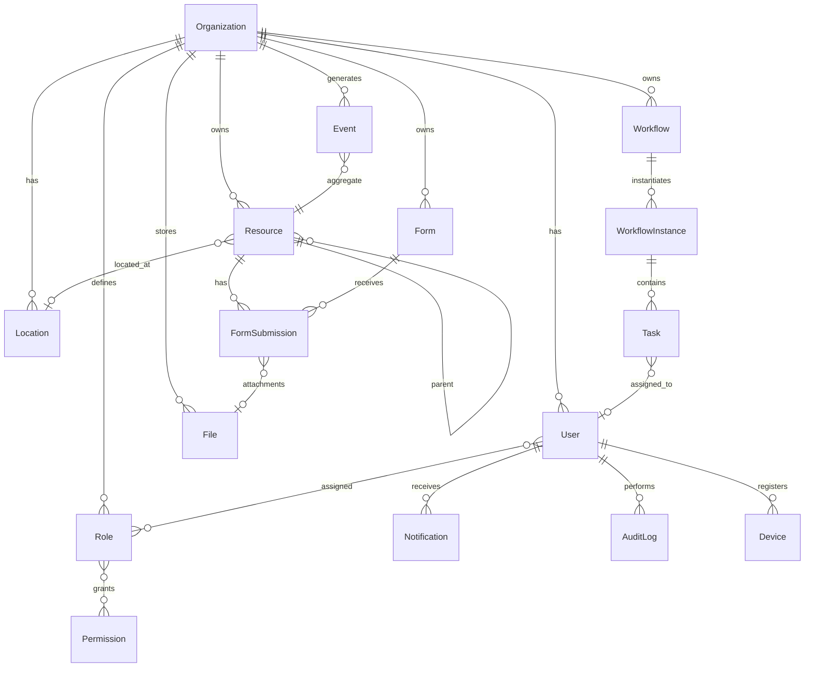

# AGROERP — Modelo de Datos del Núcleo (Core)

## Convenciones

- **IDs:** `UUID v7` (tipo `uuid` en PostgreSQL)
- **Timestamps:** `timestamptz` UTC
- **Soft delete:** `deleted_at` nullable en todas las entidades mutables
- **Multi-tenant:** `organization_id` NOT NULL en tablas de negocio
- **Versionado:** columna `version` (integer) para optimistic locking
- **Atributos dinámicos:** `jsonb` validado por Metadata Engine

## Diagrama ER del núcleo



---

## Tablas del núcleo

### `organizations`

| Columna | Tipo | Notas |
|---------|------|-------|
| id | uuid PK | |
| parent_id | uuid FK → organizations | Sub-tenancy futuro |
| name | varchar(255) | |
| slug | varchar(100) UNIQUE | URL-safe identifier |
| settings | jsonb | Config org-level |
| status | enum | active, suspended, archived |
| created_at | timestamptz | |
| updated_at | timestamptz | |
| deleted_at | timestamptz | |

### `users`

| Columna | Tipo | Notas |
|---------|------|-------|
| id | uuid PK | |
| organization_id | uuid FK → organizations | |
| email | varchar(255) | UNIQUE per org |
| password_hash | varchar(255) | nullable si OAuth |
| first_name | varchar(100) | |
| last_name | varchar(100) | |
| status | enum | active, inactive, locked |
| last_login_at | timestamptz | |
| metadata | jsonb | Campos extra |
| created_at | timestamptz | |
| updated_at | timestamptz | |
| deleted_at | timestamptz | |

### `roles`

| Columna | Tipo | Notas |
|---------|------|-------|
| id | uuid PK | |
| organization_id | uuid FK | |
| name | varchar(100) | |
| slug | varchar(100) | UNIQUE per org |
| description | text | |
| is_system | boolean | Roles del core no editables |
| created_at | timestamptz | |
| updated_at | timestamptz | |

### `permissions`

| Columna | Tipo | Notas |
|---------|------|-------|
| id | uuid PK | |
| resource | varchar(100) | `resource`, `form`, `workflow`, `*` |
| action | varchar(50) | create, read, update, delete, approve, * |
| scope | varchar(50) | own, org, * |
| description | text | |
| module_id | varchar(100) | Plugin que lo registra |

### `role_permissions`

| role_id | uuid FK | |
| permission_id | uuid FK | |

### `user_roles`

| user_id | uuid FK | |
| role_id | uuid FK | |

### `policies`

| Columna | Tipo | Notas |
|---------|------|-------|
| id | uuid PK | |
| organization_id | uuid FK | |
| name | varchar(255) | |
| effect | enum | allow, deny |
| conditions | jsonb | Reglas PBAC (JSON Logic) |
| priority | integer | Mayor = evalúa primero |
| active | boolean | |

---

### `resources` ⭐ (entidad genérica central)

| Columna | Tipo | Notas |
|---------|------|-------|
| id | uuid PK | |
| organization_id | uuid FK | RLS |
| resource_type | varchar(100) | Definido por plugin/metadata |
| schema_version | integer | Versión del schema |
| parent_id | uuid FK → resources | Jerarquía |
| location_id | uuid FK → locations | GIS opcional |
| owner_id | uuid FK → users | Responsable |
| status | varchar(50) | Estado configurable |
| attributes | jsonb | **Campos dinámicos** |
| version | integer | Optimistic lock |
| external_id | varchar(255) | ID del cliente offline |
| created_by | uuid FK → users | |
| updated_by | uuid FK → users | |
| created_at | timestamptz | |
| updated_at | timestamptz | |
| deleted_at | timestamptz | |

**Índices:**
```sql
CREATE INDEX idx_resources_org_type ON resources (organization_id, resource_type) WHERE deleted_at IS NULL;
CREATE INDEX idx_resources_parent ON resources (parent_id) WHERE deleted_at IS NULL;
CREATE INDEX idx_resources_attributes ON resources USING GIN (attributes);
CREATE INDEX idx_resources_external ON resources (organization_id, external_id) WHERE external_id IS NOT NULL;
```

---

### `resource_schemas` (Metadata Engine)

| Columna | Tipo | Notas |
|---------|------|-------|
| id | uuid PK | |
| organization_id | uuid FK | null = schema global |
| resource_type | varchar(100) | |
| version | integer | |
| definition | jsonb | Campos, validaciones, estados |
| active | boolean | Solo uno activo por type+org |
| created_at | timestamptz | |

---

### `events` ⭐ (Event Store)

| Columna | Tipo | Notas |
|---------|------|-------|
| id | uuid PK | |
| organization_id | uuid FK | |
| aggregate_type | varchar(100) | Resource, FormSubmission, etc. |
| aggregate_id | uuid | |
| event_type | varchar(100) | ResourceCreated, etc. |
| payload | jsonb | Datos del evento |
| metadata | jsonb | userId, deviceId, correlationId, source |
| version | bigint | Secuencia por aggregate |
| global_sequence | bigserial | Orden global para sync |
| occurred_at | timestamptz | |
| recorded_at | timestamptz DEFAULT now() | |

**Particionado:** por `occurred_at` mensual.

```sql
CREATE INDEX idx_events_aggregate ON events (aggregate_type, aggregate_id, version);
CREATE INDEX idx_events_sync ON events (organization_id, global_sequence);
CREATE INDEX idx_events_type ON events (organization_id, event_type, occurred_at);
```

---

### `files`

| Columna | Tipo | Notas |
|---------|------|-------|
| id | uuid PK | |
| organization_id | uuid FK | |
| filename | varchar(500) | |
| mime_type | varchar(100) | |
| size_bytes | bigint | |
| storage_key | varchar(1000) | S3 path |
| checksum | varchar(64) | SHA-256 |
| metadata | jsonb | EXIF, dimensions, etc. |
| uploaded_by | uuid FK → users | |
| external_id | varchar(255) | Sync offline |
| created_at | timestamptz | |
| deleted_at | timestamptz | |

### `file_attachments` (polimórfico)

| file_id | uuid FK | |
| attachable_type | varchar(100) | Resource, FormSubmission, Task |
| attachable_id | uuid | |

---

### `locations` (GIS — PostGIS)

| Columna | Tipo | Notas |
|---------|------|-------|
| id | uuid PK | |
| organization_id | uuid FK | |
| name | varchar(255) | |
| location_type | enum | point, polygon, linestring, multipolygon |
| geometry | geometry(Geometry, 4326) | PostGIS |
| centroid | geometry(Point, 4326) | Calculado |
| area_sqm | double precision | Para polígonos |
| altitude_m | double precision | Opcional |
| accuracy_m | double precision | GPS accuracy |
| metadata | jsonb | |
| external_id | varchar(255) | |
| created_at | timestamptz | |
| updated_at | timestamptz | |
| deleted_at | timestamptz | |

```sql
CREATE INDEX idx_locations_geom ON locations USING GIST (geometry);
```

### `location_tracks` (GPS tracking)

| Columna | Tipo | Notas |
|---------|------|-------|
| id | uuid PK | |
| organization_id | uuid FK | |
| user_id | uuid FK | |
| device_id | uuid FK | |
| geometry | geometry(LineString, 4326) | |
| started_at | timestamptz | |
| ended_at | timestamptz | |
| point_count | integer | |

---

### `forms`

| Columna | Tipo | Notas |
|---------|------|-------|
| id | uuid PK | |
| organization_id | uuid FK | |
| name | varchar(255) | |
| slug | varchar(100) | |
| version | integer | |
| definition | jsonb | Campos, lógica, validaciones |
| resource_type | varchar(100) | Vinculado a tipo de recurso |
| status | enum | draft, published, archived |
| created_by | uuid FK | |
| created_at | timestamptz | |
| updated_at | timestamptz | |

### `form_submissions`

| Columna | Tipo | Notas |
|---------|------|-------|
| id | uuid PK | |
| organization_id | uuid FK | |
| form_id | uuid FK | |
| form_version | integer | Snapshot de versión |
| resource_id | uuid FK → resources | Opcional |
| submitted_by | uuid FK → users | |
| data | jsonb | Respuestas |
| location_id | uuid FK | GPS del submission |
| status | enum | draft, submitted, validated, rejected |
| external_id | varchar(255) | Sync offline |
| version | integer | |
| submitted_at | timestamptz | |
| created_at | timestamptz | |
| updated_at | timestamptz | |
| deleted_at | timestamptz | |

---

### `workflows`

| Columna | Tipo | Notas |
|---------|------|-------|
| id | uuid PK | |
| organization_id | uuid FK | |
| name | varchar(255) | |
| slug | varchar(100) | |
| definition | jsonb | Estados, transiciones, triggers |
| resource_type | varchar(100) | |
| version | integer | |
| status | enum | draft, active, archived |
| created_at | timestamptz | |

### `workflow_instances`

| Columna | Tipo | Notas |
|---------|------|-------|
| id | uuid PK | |
| organization_id | uuid FK | |
| workflow_id | uuid FK | |
| resource_id | uuid FK | Entidad asociada |
| current_state | varchar(100) | |
| context | jsonb | Variables de ejecución |
| started_by | uuid FK | |
| started_at | timestamptz | |
| completed_at | timestamptz | |

### `tasks`

| Columna | Tipo | Notas |
|---------|------|-------|
| id | uuid PK | |
| organization_id | uuid FK | |
| workflow_instance_id | uuid FK | Opcional |
| title | varchar(500) | |
| description | text | |
| assigned_to | uuid FK → users | |
| resource_id | uuid FK | |
| status | enum | pending, in_progress, completed, cancelled |
| priority | enum | low, medium, high, urgent |
| due_at | timestamptz | |
| completed_at | timestamptz | |
| metadata | jsonb | |
| external_id | varchar(255) | |
| created_at | timestamptz | |
| updated_at | timestamptz | |

---

### `notifications`

| Columna | Tipo | Notas |
|---------|------|-------|
| id | uuid PK | |
| organization_id | uuid FK | |
| user_id | uuid FK | |
| type | varchar(100) | |
| title | varchar(500) | |
| body | text | |
| data | jsonb | Payload para deep link |
| read_at | timestamptz | |
| created_at | timestamptz | |

---

### `audit_logs`

| Columna | Tipo | Notas |
|---------|------|-------|
| id | uuid PK | |
| organization_id | uuid FK | |
| user_id | uuid FK | nullable (sistema) |
| action | varchar(100) | |
| entity_type | varchar(100) | |
| entity_id | uuid | |
| old_values | jsonb | |
| new_values | jsonb | |
| ip_address | inet | |
| user_agent | text | |
| device_id | uuid FK | |
| event_id | uuid FK → events | Link al event store |
| created_at | timestamptz | |

**Particionado:** mensual por `created_at`. Retención: configurable (default 2 años).

---

### `devices` (control de dispositivos móviles)

| Columna | Tipo | Notas |
|---------|------|-------|
| id | uuid PK | |
| organization_id | uuid FK | |
| user_id | uuid FK | |
| device_fingerprint | varchar(255) | |
| platform | enum | android, ios, web |
| app_version | varchar(50) | |
| trusted | boolean | |
| last_sync_at | timestamptz | |
| last_sync_cursor | bigint | global_sequence |
| revoked_at | timestamptz | |
| created_at | timestamptz | |

---

### `sync_conflicts`

| Columna | Tipo | Notas |
|---------|------|-------|
| id | uuid PK | |
| organization_id | uuid FK | |
| device_id | uuid FK | |
| entity_type | varchar(100) | |
| entity_id | uuid | |
| client_version | jsonb | Estado del cliente |
| server_version | jsonb | Estado del servidor |
| resolution | enum | pending, client_wins, server_wins, merged |
| resolved_by | uuid FK | |
| resolved_at | timestamptz | |
| created_at | timestamptz | |

---

### `catalogs` (catálogos configurables)

| Columna | Tipo | Notas |
|---------|------|-------|
| id | uuid PK | |
| organization_id | uuid FK | null = global |
| slug | varchar(100) | crop-types, units, etc. |
| name | varchar(255) | |
| items | jsonb | [{key, label, metadata}] |
| version | integer | |
| active | boolean | |

---

### `modules` (plugin registry)

| Columna | Tipo | Notas |
|---------|------|-------|
| id | varchar(100) PK | agro.producers |
| version | varchar(50) | |
| name | varchar(255) | |
| status | enum | active, disabled |
| config | jsonb | |
| installed_at | timestamptz | |

---

## Row-Level Security (RLS)

```sql
ALTER TABLE resources ENABLE ROW LEVEL SECURITY;

CREATE POLICY tenant_isolation ON resources
  USING (organization_id = current_setting('app.current_org_id')::uuid);
```

El middleware NestJS ejecuta `SET app.current_org_id = '{org_id}'` por request.

---

## Tipos de eventos del núcleo

| Event Type | Aggregate | Descripción |
|------------|-----------|-------------|
| `ResourceCreated` | Resource | Nuevo recurso |
| `ResourceUpdated` | Resource | Cambio de atributos/estado |
| `ResourceDeleted` | Resource | Soft delete |
| `FormSubmitted` | FormSubmission | Envío de formulario |
| `FormValidated` | FormSubmission | Aprobación |
| `FileUploaded` | File | Archivo subido |
| `WorkflowStarted` | WorkflowInstance | Inicio de flujo |
| `WorkflowStateChanged` | WorkflowInstance | Transición de estado |
| `WorkflowCompleted` | WorkflowInstance | Flujo terminado |
| `TaskAssigned` | Task | Tarea asignada |
| `TaskCompleted` | Task | Tarea completada |
| `UserLoggedIn` | User | Autenticación |
| `DeviceRegistered` | Device | Nuevo dispositivo |
| `SyncConflictDetected` | SyncConflict | Conflicto offline |
| `LocationCaptured` | Location | Nueva geometría |
