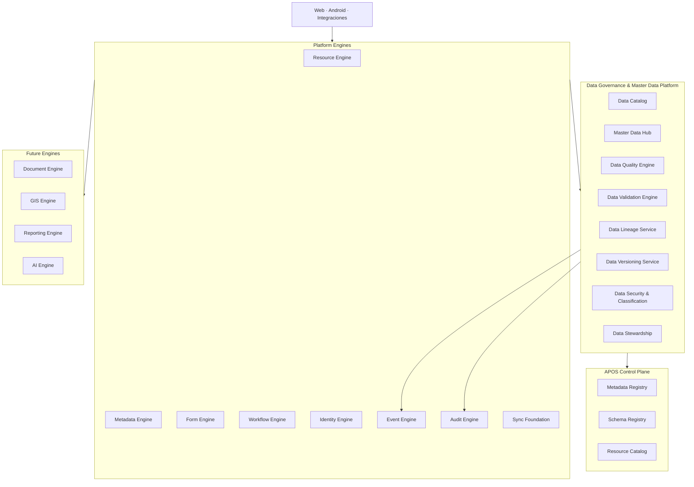
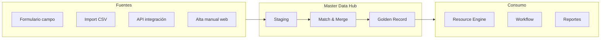
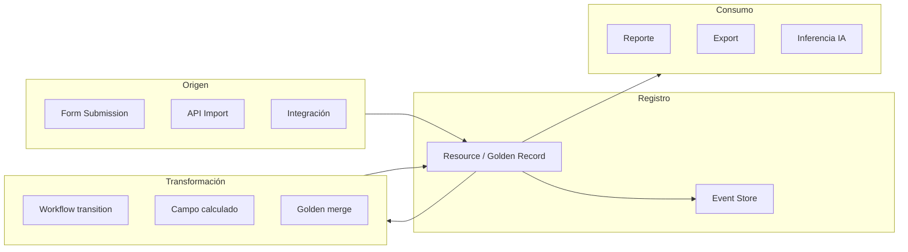
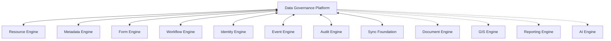
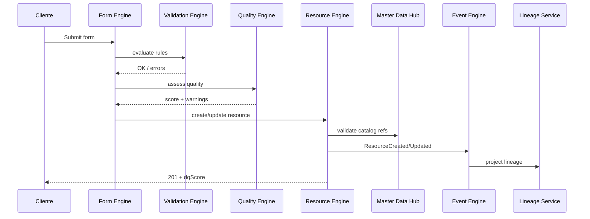
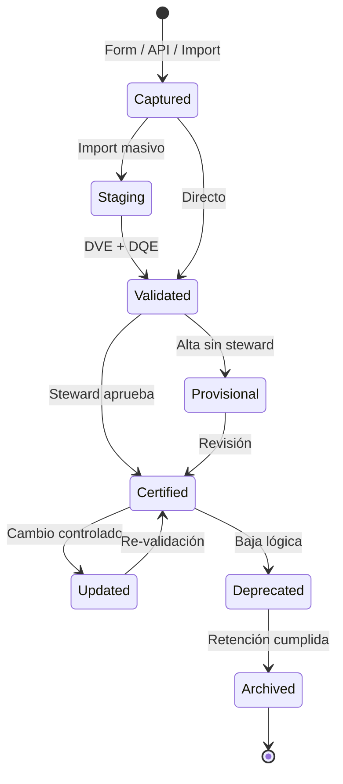

# AGROERP — Data Governance & Master Data Platform (DGMP)

**Versión:** 1.0  
**Estado:** Oficial — Estándar de gobierno y datos maestros  
**Audiencia:** Chief Data Officers, arquitectos de datos, desarrolladores, administradores de catálogo, auditores, sistemas de IA  
**Naturaleza:** Plataforma transversal — **no es un módulo de negocio ni un CRUD de catálogos**

---

## 0. Propósito y autoridad

El **Data Governance & Master Data Platform (DGMP)** garantiza que toda la información de AGROERP sea **consistente, confiable, trazable, segura y reutilizable** en todos los motores, dominios y clientes de la plataforma.

| Pregunta | Documento que responde |
|----------|------------------------|
| ¿Cómo se orquesta la plataforma? | `APOS.md` |
| ¿Cómo se implementa cada componente? | `AEPS.md` |
| ¿Qué catálogos existen y cómo se administran? | `MASTER_DATA_ENGINE.md` |
| **¿Cómo se gobierna el dato de punta a punta?** | **Este documento (DGMP)** |
| **¿Cómo ingresan y salen datos del ecosistema externo?** | `INTEGRATION_ECOSYSTEM_LAYER.md` (IEL) |
| **¿Dónde vive el dato analítico y los KPIs oficiales?** | `DATA_PLATFORM_ANALYTICS_LAYER.md` (DPAL) |
| **¿Quién controla seguridad, compliance y auditoría total?** | `GOVERNANCE_ENTERPRISE_CONTROL_LAYER.md` (GECL) |

### Jerarquía documental

```
APOS.md                    → Orquestación de motores y registries
AEPS.md                    → Estándares de implementación
DATA_GOVERNANCE_PLATFORM.md → Gobierno, calidad, lineage, seguridad del dato
GOVERNANCE_ENTERPRISE_CONTROL_LAYER.md → Marco gobierno empresarial (GECL)
DATA_PLATFORM_ANALYTICS_LAYER.md     → Plataforma analítica (DPAL)
MASTER_DATA_ENGINE.md      → Especificación detallada de catálogos MDM (104 catálogos)
{ENGINE}.md                → Motores individuales
```

**Regla de oro:** Ningún dato maestro, atributo crítico o catálogo transversal entra en producción sin cumplir **DGMP** y registrarse en el **Data Catalog** de la plataforma.

### Alcance del DGMP

| Incluye | No incluye |
|---------|------------|
| Gobierno de datos maestros y catálogos | Transacciones operativas (compras, inventario) |
| Calidad, lineage, versionado, validación | Lógica de negocio de dominio cafetero |
| Clasificación y seguridad del dato | Implementación de pantallas |
| Data Catalog empresarial | Data Products y catálogo analítico en DPAL |
| Políticas de retención y anonimización | Infraestructura cloud (ver APOS) |

---

## 1. Visión y principios

### 1.1 Visión

AGROERP trata los datos como **activo estratégico**, no como subproducto de formularios y APIs. El DGMP es el equivalente a un **MDM + Data Governance** empresarial integrado nativamente en la arquitectura de plataforma — comparable en espíritu a:

| Referencia | Capacidad análoga en AGROERP |
|------------|----------------------------|
| SAP MDG / MDM | Golden record, duplicados, stewardship |
| Informatica MDM | Hub de datos maestros multi-dominio |
| Collibra / Alation | Data Catalog y lineage |
| Talend / Great Expectations | Data Quality |
| Microsoft Purview | Clasificación, sensibilidad, políticas |

### 1.2 Principios de gobierno de datos

| # | Principio | Descripción |
|---|-----------|-------------|
| G1 | **Single Source of Truth (SSOT)** | Un concepto de negocio → una definición autoritativa |
| G2 | **Metadata-first** | El significado del dato vive en catálogos y schemas, no en código |
| G3 | **Calidad por diseño** | Validación en captura, no solo en reportes posteriores |
| G4 | **Trazabilidad total** | Todo dato crítico responde quién, cuándo, cómo y por qué cambió |
| G5 | **No destructivo** | Soft delete, versionado, deprecación — nunca borrado físico de referenciados |
| G6 | **Multi-tenant con herencia** | Global (plataforma) → organización → extensión controlada |
| G7 | **Offline-compatible** | Calidad y catálogos validables en campo sin conexión |
| G8 | **Seguridad clasificada** | Sensibilidad define acceso, retención y exportación |
| G9 | **Gobernanza humana + automática** | Data stewards + reglas configurables |
| G10 | **Eventos como prueba** | Lineage respaldado por Event Store + Audit |

### 1.3 Arquitectura conceptual



---

## 2. Modelo lógico de la plataforma de datos

### 2.1 Componentes del DGMP

| Componente | Responsabilidad | Estado |
|------------|-----------------|--------|
| **Master Data Hub (MDH)** | Golden records, catálogos, jerarquías, deduplicación | Especificado en `MASTER_DATA_ENGINE.md` |
| **Data Quality Engine (DQE)** | Scoring, reglas de calidad, detección de anomalías | Especificado (DGMP) |
| **Data Validation Engine (DVE)** | Reglas configurables de validación cross-campo | Especificado (DGMP) |
| **Data Lineage Service (DLS)** | Origen, transformaciones, consumo | Especificado (DGMP) |
| **Data Versioning Service (DVS)** | Versiones de registros, diff, restore | Especificado (DGMP) |
| **Data Catalog (DC)** | Diccionario empresarial de entidades y atributos | Especificado (DGMP) |
| **Data Security Service (DSS)** | Clasificación, políticas, enmascaramiento | Especificado (DGMP) |
| **Data Stewardship Portal** | Roles, tareas, aprobaciones de datos | Roadmap (UI) |

### 2.2 Taxonomía de datos en AGROERP

| Tipo de dato | Ejemplos | Motor principal | Gobierno |
|--------------|----------|-----------------|----------|
| **Catálogo / referencia** | Municipios, variedades, UOM | Master Data Hub | MDM + Catalog |
| **Entidad maestra** | Productor, Finca, Bodega | Resource Engine + MDH | Golden record |
| **Transaccional** | Compra, movimiento inventario | Resource / tablas dominio | Lineage + DQ |
| **Metadata** | Schemas, forms, workflows | Metadata Engine | Schema Registry |
| **Documental** | Contratos PDF, fotos | EDMKP (`ENTERPRISE_DOCUMENT_MEDIA_KNOWLEDGE_PLATFORM.md`) | Clasificación |
| **Geoespacial** | Polígonos, tracks | GIS Engine + FTIP | Validación GPS; geometría autoritativa en FTIP |
| **Derivado / analítico** | KPIs, scores IA | Reporting / AI | Lineage desde origen |

### 2.3 Entidades maestras principales

El DGMP administra **entidades maestras** (golden records) y **catálogos transversales**:

#### Entidades maestras (golden records)

| Entidad | `resourceType` | Identificador único | Relaciones clave |
|---------|----------------|---------------------|------------------|
| **Productor** | `producer` | `documentType` + `documentNumber` (org) | Fincas, contratos — implementación: `PRODUCER_RELATIONSHIP_MANAGEMENT_PLATFORM.md` |
| **Empresa / Organización** | `organization` | `slug` (global), `taxId` (opcional) | Sucursales, usuarios |
| **Finca** | `farm` | `farmCode` (org) o `externalId` | Lotes, productor, GIS — implementación: `FARM_TERRITORY_INTELLIGENCE_PLATFORM.md` |
| **Lote** | `farm_lot` | `lotCode` + `farmId` | Cultivo, polígono |
| **Bodega** | `warehouse` | `warehouseCode` (org) | Ubicación, zonas |
| **Usuario** | `user` (Identity) | `email` (org) | Roles, scopes |
| **Contrato marco** | `contract` | `contractNumber` (org) | Productor, campaña |

#### Catálogos transversales (104+ definidos)

Ver inventario completo en `MASTER_DATA_ENGINE.md` §2. Dominios:

| Dominio | Ejemplos | Namespace |
|---------|----------|-----------|
| Geografía | Municipios, veredas | `geo.*` |
| Agronomía | Cultivos, variedades | `farm.*` |
| Comercial | Tipos contrato, campañas | `trade.*` |
| Inventario | Tipos movimiento, bodega | `inventory.*` |
| Finanzas | Monedas, impuestos | `finance.*` |
| Documentos | Tipos documento | `document.*` |
| Plataforma | Estados, tipos sync | `platform.*` |
| Unidades | UOM, empaques | `uom.*` |

**Regla:** Toda lista cerrada de valores → catálogo MDM. Toda entidad con ciclo de vida → golden record en Resource Engine validado por MDH.

---

## 3. Master Data Management (MDM)

> Detalle operativo de catálogos: **`MASTER_DATA_ENGINE.md`**.  
> Esta sección define el **marco de gobierno MDM** que ese motor debe cumplir.

### 3.1 Golden Record

Un **golden record** es la versión autoritativa y consolidada de una entidad maestra.



| Atributo golden record | Descripción |
|------------------------|-------------|
| `goldenId` | UUID estable del registro autoritativo |
| `sourceRecords[]` | Referencias a fuentes que alimentaron el golden |
| `matchScore` | Confianza de consolidación (0–100) |
| `stewardshipStatus` | `provisional`, `verified`, `certified`, `merged` |
| `lastStewardReview` | Fecha última validación humana |

### 3.2 Identificadores únicos

| Nivel | Regla | Ejemplo |
|-------|-------|---------|
| **Catálogo** | `code` inmutable tras publicación | `farm.coffee_variety` → `caturra` |
| **Golden record** | Clave de negocio compuesta documentada en Data Catalog | `CO-CC-12345678` productor |
| **Técnico** | UUID v7 en `Resource.id` | Orden temporal + global único |
| **Offline** | `externalId` cliente, único por org | Android sync idempotente |
| **Cross-system** | `globalId` opcional en `metadata` | Integración SAP/legacy |

**Reglas MD-ID:**

| ID | Regla |
|----|-------|
| MD-ID-01 | Dos golden records activos no pueden compartir la misma clave de negocio en la misma org |
| MD-ID-02 | `code` de catálogo nunca se reutiliza tras deprecación |
| MD-ID-03 | Fusión conserva `goldenId` del registro sobreviviente; el otro pasa a `merged_into` |
| MD-ID-04 | Import masivo valida unicidad antes de staging |

### 3.3 Detección y fusión de duplicados

| Fase | Mecanismo |
|------|-----------|
| **Detección** | Reglas configurables: exact match, fuzzy (nombre, dirección), phonetic, geoespacial (< 50m) |
| **Scoring** | Peso por campo: documento 40%, nombre 25%, teléfono 15%, ubicación 20% |
| **Revisión** | Score > 90% → auto-merge candidato; 70–90% → cola steward; < 70% → ignorar |
| **Fusión** | Survivor + atributos ganadores por regla; perdedor → `status: merged` |
| **Auditoría** | Evento `GoldenRecordMerged` con payload completo before/after |

```json
{
  "eventType": "GoldenRecordMerged",
  "payload": {
    "resourceType": "producer",
    "survivorId": "uuid-a",
    "mergedId": "uuid-b",
    "matchScore": 87.5,
    "matchRules": ["document_exact", "name_fuzzy"],
    "stewardId": "uuid-user",
    "fieldResolutions": {
      "phone": { "from": "merged", "value": "+573001234567" },
      "address": { "from": "survivor" }
    }
  }
}
```

### 3.4 Versionado de datos maestros

| Artefacto | Política | Detalle en |
|-----------|----------|------------|
| Catálogos | `immutable` / `versioned` / `effective_date` | `MASTER_DATA_ENGINE.md` §1.8 |
| Golden records | Optimistic locking + historial | DGMP §6 |
| Referencias | `code` + `catalogVersion` congelados | MD-07 |

### 3.5 Historial y auditoría MDM

Toda mutación MDM genera:

1. **Event Store** — `CatalogItemUpdated`, `GoldenRecordUpdated`, etc.
2. **Audit Log** — diff campo a campo
3. **Lineage** — entrada en DLS (§5)
4. **Version snapshot** — en DVS si aplica (§6)

### 3.6 Validaciones MDM

| Momento | Validaciones |
|---------|--------------|
| **Creación** | Schema, catálogos existentes, unicidad, permisos |
| **Actualización** | Optimistic lock, transiciones de estado válidas |
| **Publicación catálogo** | Ítems obligatorios, jerarquía consistente, sin huérfanos |
| **Fusión** | No fusionar si hay workflows activos en conflicto |
| **Deprecación** | Bloquear si hay referencias activas sin sustituto |

---

## 4. Data Quality Engine (DQE)

### 4.1 Propósito

El **Data Quality Engine** mide, monitorea y remedia la calidad del dato en tiempo de captura y de forma batch.

### 4.2 Dimensiones de calidad

| Dimensión | Descripción | Ejemplo agro |
|-----------|-------------|--------------|
| **Completitud** | Campos obligatorios poblados | Finca sin municipio |
| **Validez** | Formato y tipo correctos | Email inválido |
| **Consistencia** | Coherencia cross-campo | Área lote > área finca |
| **Unicidad** | Sin duplicados | Dos productores mismo documento |
| **Precisión** | Valor correcto vs realidad | GPS fuera del municipio |
| **Oportunidad** | Dato actualizado a tiempo | Catálogo campaña vencido |
| **Conformidad** | Cumple reglas de negocio | Certificación orgánica sin vigencia |

### 4.3 Reglas de calidad configurables

```json
{
  "ruleKey": "farm.area_consistency",
  "name": "Área lote no excede finca",
  "dimension": "consistency",
  "scope": { "resourceType": "farm_lot" },
  "severity": "error",
  "expression": {
    "field": "data.area_ha",
    "operator": "lte",
    "reference": { "type": "parent_resource", "field": "data.total_area_ha" }
  },
  "remediation": "block_save"
}
```

| Severidad | Comportamiento |
|-----------|----------------|
| `info` | Registrar en DQ score; no bloquear |
| `warning` | Permitir guardar; flag en registro |
| `error` | Bloquear guardado / transición workflow |
| `critical` | Bloquear + alerta steward + evento `DataQualityViolation` |

### 4.4 Validaciones específicas

| Tipo | Regla |
|------|-------|
| **Formatos** | Regex, tipos, rangos — delegado a Metadata/Form Engine + reglas DQ |
| **Incompletos** | % completitud por entidad y por org |
| **Inconsistencias** | Cross-field, parent-child, catálogo vs valor |
| **Duplicados** | Match engine MDM (§3.3) |
| **GPS** | Coordenada dentro de municipio/finca; accuracy < umbral; CRS EPSG:4326 |
| **Documentos** | DV algorítmico (NIT, CC, CE); dígito verificación |
| **Relaciones** | FK lógicas: productor existe, finca pertenece a productor |

### 4.5 Data Quality Score (DQS)

Por entidad y por organización:

```
DQS = Σ (dimensión_i × peso_i) / Σ pesos
```

| Rango | Clasificación | Acción |
|-------|---------------|--------|
| 90–100 | Excelente | Ninguna |
| 75–89 | Aceptable | Monitoreo |
| 50–74 | Deficiente | Tareas steward |
| < 50 | Crítico | Bloqueo operación (configurable) |

**Almacenamiento:** `Resource.metadata.dqScore`, `Resource.metadata.dqIssues[]`

### 4.6 Eventos de calidad

| Evento | Cuándo |
|--------|--------|
| `DataQualityAssessed` | Evaluación batch o post-save |
| `DataQualityViolation` | Regla error/critical incumplida |
| `DataQualityRemediated` | Steward corrige issue |
| `DuplicateCandidateDetected` | Match score en rango revisión |

---

## 5. Data Lineage

### 5.1 Propósito

El **Data Lineage Service** registra el **origen, transformación y consumo** de cada dato importante — respondiendo las preguntas de auditoría y regulación.

### 5.2 Preguntas que debe responder

| Pregunta | Fuente lineage |
|----------|----------------|
| ¿Quién lo creó? | `createdBy`, evento `ResourceCreated` |
| ¿Cuándo? | `createdAt`, `occurredAt` |
| ¿Desde qué dispositivo? | `metadata.deviceId`, `deviceInfo` |
| ¿Qué formulario lo originó? | `formId`, `formVersion`, `FormSubmitted` |
| ¿Qué cambios ha tenido? | Event Store aggregate history + DVS |
| ¿Qué procesos lo utilizan? | Workflow instances, report definitions |
| ¿De dónde vino (integración)? | `metadata.sourceSystem`, `Integration Catalog` |

### 5.3 Modelo de lineage



### 5.4 Registro de lineage

| Campo | Descripción |
|-------|-------------|
| `lineageId` | UUID entrada lineage |
| `entityType` | Resource, CatalogItem, FormSubmission |
| `entityId` | UUID entidad |
| `operation` | `create`, `update`, `merge`, `import`, `derive` |
| `sourceType` | `form`, `api`, `workflow`, `integration`, `user` |
| `sourceId` | ID formulario, workflow, connector |
| `actorId` | Usuario o service account |
| `deviceId` | Dispositivo |
| `correlationId` | Trazabilidad E2E APOS |
| `parentLineageId` | Cadena de derivación |
| `occurredAt` | Timestamp |

**Almacenamiento:** Tabla `data_lineage` (futuro) + proyección desde Event Store para datos históricos.

### 5.5 Lineage técnico vs negocio

| Tipo | Audiencia | Granularidad |
|------|-----------|--------------|
| **Negocio** | Stewards, auditores | Entidad, campo, proceso |
| **Técnico** | Desarrolladores, SRE | API, evento, transformación |

### 5.6 API de lineage (contrato)

| Método | Ruta | Descripción |
|--------|------|-------------|
| GET | `/data-governance/lineage/{entityType}/{id}` | Árbol upstream + downstream |
| GET | `/data-governance/lineage/{entityType}/{id}/history` | Cronología cambios |
| GET | `/data-governance/lineage/impact/{entityType}/{id}` | Qué reportes/workflows afecta un cambio |

---

## 6. Data Versioning

### 6.1 Estrategias por tipo de dato

| Tipo | Estrategia | Restauración |
|------|------------|--------------|
| **Catálogo** | Versión publicada inmutable; nueva versión al cambiar | Referencias históricas usan `catalogVersion` |
| **Golden record** | Optimistic lock + snapshot en cada mutación significativa | Restore a versión N |
| **Resource transaccional** | `version` integer + event sourcing parcial | Diff + rollback controlado |
| **Form submission** | Inmutable tras submit; nueva submission si corrección | No restore; nueva versión |

### 6.2 Modelo de versión de registro

```
RecordVersion
├── entityType
├── entityId
├── versionNumber        (secuencial)
├── snapshot             (JSON estado completo o diff)
├── changeType           (create | update | merge | restore)
├── changedFields[]      (lista campos modificados)
├── actorId
├── eventId              (link Event Store)
├── createdAt
└── organizationId
```

### 6.3 Operaciones de versionado

| Operación | Descripción | Permiso |
|-----------|-------------|---------|
| **List versions** | Historial de versiones | `data:read` |
| **Compare** | Diff entre versión A y B | `data:read` |
| **Restore** | Volver a versión anterior (nueva versión, no destructive) | `data:admin` |
| **Purge** | Eliminar snapshots antiguos (retención) | `data:admin` + política |

**Regla:** Restore **nunca** borra versiones intermedias — crea versión N+1 con contenido de versión objetivo.

### 6.4 Compatibilidad entre versiones

| Cambio schema | Impacto | Mitigación |
|---------------|---------|------------|
| Campo nuevo opcional | Compatible | Default null |
| Campo eliminado | Breaking en lectura | Mantener en snapshot histórico |
| Cambio tipo | Breaking | Migration script + dual-read period |
| Catálogo deprecado | Referencias históricas válidas | Label lookup por `catalogVersion` |

---

## 7. Data Validation Rules Engine (DVE)

### 7.1 Propósito

Motor **configurable** de reglas de validación sin modificar código — extiende Metadata Engine y Form Engine con reglas de gobierno cross-entidad.

### 7.2 Tipos de reglas

| Tipo | Ejemplo |
|------|---------|
| **Expresión** | `data.area_ha > 0 AND data.area_ha < 10000` |
| **Condicional** | `IF data.crop = 'coffee' THEN data.variety IS NOT NULL` |
| **Dependencia campos** | `municipality` depende de `department` |
| **Geográfica** | Punto dentro de polígono finca / municipio |
| **Documental** | NIT válido Colombia |
| **Catálogo** | Valor existe en catálogo publicado |
| **Referencial** | `producerId` existe y está activo |
| **Negocio (futuro)** | Contrato activo para compra |

### 7.3 Modelo de regla

```json
{
  "ruleKey": "producer.document_co",
  "name": "Validación cédula Colombia",
  "scope": {
    "resourceTypes": ["producer"],
    "fields": ["data.documentNumber"],
    "conditions": { "data.documentType": "CC" }
  },
  "validator": {
    "type": "document",
    "country": "CO",
    "documentType": "CC"
  },
  "message": { "es": "Número de cédula inválido", "en": "Invalid ID number" },
  "severity": "error",
  "active": true,
  "priority": 100
}
```

### 7.4 Evaluación

| Momento | Motores involucrados |
|---------|---------------------|
| Formulario — campo | Form Validation Engine + DVE |
| Formulario — submit | Form + DVE + DQE |
| Resource create/update | Metadata + DVE + DQE |
| Workflow transition | Workflow + DVE |
| Import batch | DVE + DQE en staging |

**Orden:** Metadata type validation → DVE rules (priority desc) → DQE dimensions.

### 7.5 Registro de reglas

Las reglas viven en **Validation Rule Registry** (parte del Data Catalog):

- Versionadas
- Efectivas por `effectiveFrom` / `effectiveTo`
- Auditadas al cambiar
- Exportables por dominio

---

## 8. Data Catalog empresarial

### 8.1 Propósito

El **Data Catalog** es el **diccionario de datos empresarial** — documenta qué significa cada entidad y atributo, quién es responsable y cómo se usa.

> Distinción APOS: **Resource Catalog** (APOS) = tipos técnicos registrados. **Data Catalog** (DGMP) = significado de negocio, gobierno y sensibilidad.

### 8.2 Ficha de entidad

| Campo | Descripción |
|-------|-------------|
| `entityKey` | `producer`, `farm`, `geo.municipality` |
| `entityType` | `golden_record` / `catalog` / `transactional` |
| `displayName` | Nombre humano (i18n) |
| `definition` | Definición de negocio autoritativa |
| `owner` | Data owner (rol / usuario) |
| `steward` | Data steward operativo |
| `domain` | Dominio agro (`producer`, `geo`, `quality`…) |
| `sourceSystems[]` | Origenes autorizados |
| `consumers[]` | Módulos, reportes, workflows |
| `classification` | Nivel sensibilidad (§9) |
| `retentionPolicy` | Política retención |
| `qualityRules[]` | Reglas DQ aplicables |
| `validationRules[]` | Reglas DVE aplicables |
| `relatedEntities[]` | Relaciones documentadas |
| `status` | `draft`, `approved`, `deprecated` |

### 8.3 Ficha de atributo

| Campo | Descripción |
|-------|-------------|
| `attributeKey` | `documentNumber`, `area_ha` |
| `entityKey` | Entidad padre |
| `displayName` | Etiqueta (i18n) |
| `definition` | Significado de negocio |
| `dataType` | string, number, geo, catalog_ref… |
| `catalogKey` | Si referencia catálogo |
| `nullable` | Si admite vacío |
| `pii` | Si es dato personal |
| `sensitivity` | Nivel clasificación |
| `example` | Valor ejemplo |
| `validationRules[]` | Reglas aplicables |
| `lineageSources[]` | De dónde puede originarse |

### 8.4 Catálogo vs Data Catalog APOS

| APOS Registry | DGMP Data Catalog |
|---------------|-------------------|
| Resource Catalog — tipos técnicos | Definición de negocio de cada tipo |
| Schema Registry — estructura JSON | Significado de cada campo |
| Metadata Registry — instancias activas | Gobierno, owner, calidad |

### 8.5 API del Data Catalog (contrato)

| Método | Ruta | Descripción |
|--------|------|-------------|
| GET | `/data-governance/catalog/entities` | Listar entidades documentadas |
| GET | `/data-governance/catalog/entities/{key}` | Ficha entidad + atributos |
| GET | `/data-governance/catalog/search?q=` | Búsqueda semántica |
| GET | `/data-governance/catalog/entities/{key}/lineage` | Lineage resumido |
| GET | `/data-governance/catalog/entities/{key}/quality` | Score y reglas DQ |

---

## 9. Data Security y clasificación

### 9.1 Niveles de sensibilidad

| Nivel | Código | Ejemplos | Controles |
|-------|--------|----------|-----------|
| **Público** | `public` | Catálogos geo L0, tipos cultivo | Sin restricción |
| **Interno** | `internal` | Códigos bodega, tipos movimiento | Auth requerida |
| **Confidencial** | `confidential` | Datos productor, contratos | RBAC + scope |
| **Restringido** | `restricted` | Documentos identidad, coordenadas exactas | PBAC + masking |
| **Regulado** | `regulated` | Datos biométricos, financieros sensibles | Encriptación + audit + retención legal |

### 9.2 Políticas por dimensión

| Dimensión | Política |
|-----------|----------|
| **Acceso** | Identity Engine RBAC + PBAC + scope; deny by default |
| **Encriptación** | TLS en tránsito; AES-256 at-rest para `regulated`; field-level para PII |
| **Retención** | Por clasificación: `internal` 7 años; `regulated` según ley (10+ años) |
| **Anonimización** | Tras período retención operativa; preservar agregados analíticos |
| **Eliminación** | Soft delete universal; hard delete solo post-retención + aprobación |
| **Exportación** | `export` permission + clasificación ≤ `confidential` sin aprobación extra |
| **Compartición** | Webhook/API solo campos permitidos por política; log de cada export |

### 9.3 PII y datos agroindustriales

| Dato | Clasificación típica | Tratamiento |
|------|---------------------|-------------|
| Nombre productor | `confidential` | Mask en listados no autorizados |
| Documento identidad | `restricted` | Parcial mask (`***1234`); encrypt at-rest |
| Coordenadas finca | `confidential` | Precisión reducida en reportes agregados |
| Teléfono / email | `confidential` | Opt-in notificaciones |
| Precios / márgenes | `restricted` | Rol `finance` + PBAC |
| Fotos evidencia | `internal` | Link firmado temporal |

### 9.4 Integración Identity Engine

```
Acceso a dato = Identity.authenticate
              AND Identity.authorize(permission)
              AND DSS.classificationAllowed(user, field)
              AND PBAC.policyEvaluate(context)
```

---

## 10. Integraciones con motores AGROERP

### 10.1 Mapa de integración



### 10.2 Por motor

| Motor | Integración DGMP |
|-------|------------------|
| **Resource Engine** | Golden records; validación DVE/DQE en create/update; `metadata.dqScore`; lineage en mutación |
| **Metadata Engine** | Schemas referencian `catalogKey`; Data Catalog documenta cada field; Schema Registry sync |
| **Form Engine** | Selects desde MDH; validación DVE en submit; lineage `formId` en submission |
| **Workflow Engine** | Transiciones bloqueadas por DQ error; aprobación steward; lineage de estado |
| **Identity Engine** | Permisos `masterdata:*`, `data:*`; clasificación en authorize; steward roles |
| **Event Engine** | Todos los eventos DGMP catalogados; lineage proyectado desde events |
| **Audit Engine** | Fuente primaria de historial; no duplicar — complementar con DLS |
| **Sync Foundation** | Bootstrap catálogos; validación offline con reglas empaquetadas; `externalId` unicidad |
| **Enterprise Document, Media & Knowledge Platform** | Clasificación documentos; lineage archivo → entidad; retención |
| **GIS Engine** (futuro) | Validación coordenadas; lineage geometría |
| **Reporting Engine** (futuro) | Consume DQS; reportes de gobierno; lineage downstream |
| **Agro Intelligence, Automation & Decision Platform** | Solo datos `certified`; lineage inferencia; bias desde calidad |

### 10.3 Flujo de captura con gobierno



### 10.4 Registro en APOS

| Registry APOS | Contenido DGMP |
|---------------|----------------|
| Metadata Registry | Catálogos publicados, schemas |
| Schema Registry | Versiones de validación |
| Resource Catalog | Tipos golden record |
| Event Catalog | Eventos DGMP |
| Permission Catalog | `masterdata:*`, `data:*` |

---

## 11. Reportes e indicadores de gobierno

### 11.1 Dashboard de gobierno de datos

| Indicador | Fórmula / fuente | Audiencia |
|-----------|------------------|-----------|
| **DQS promedio org** | AVG(`metadata.dqScore`) por `resourceType` | CDO, Admin |
| **% registros incompletos** | COUNT campos null obligatorios / total | Stewards |
| **Duplicados pendientes** | COUNT match candidates 70–90% | MDM team |
| **Catálogos desactualizados** | Catálogos sin publish > N días | Admin catálogo |
| **Violaciones DQ (30d)** | COUNT `DataQualityViolation` | Compliance |
| **Tiempo medio remediación** | AVG tiempo issue → resolved | Operaciones |
| **Cobertura Data Catalog** | % entidades documentadas / total | Arquitectura |
| **Cumplimiento clasificación** | % campos PII clasificados | Seguridad |
| **Lineage coverage** | % golden records con lineage completo | Auditoría |
| **Imports fallidos** | COUNT import rejected / total | Integraciones |

### 11.2 Reportes estándar

| Reporte | Formato | Frecuencia |
|---------|---------|------------|
| Data Quality Scorecard | PDF / Excel | Mensual |
| Catálogo de catálogos | Excel | On demand |
| Registros duplicados | CSV | Semanal |
| Evolución DQS por dominio | Dashboard | Tiempo real |
| Auditoría cambios maestros | PDF | Trimestral |
| Impacto cambio catálogo | Reporte pre-publish | Evento |

### 11.3 Eventos para analítica

`DataQualityAssessed`, `DataQualityViolation`, `GoldenRecordMerged`, `CatalogVersionPublished`, `DataCatalogEntityApproved`, `ValidationRuleUpdated`

---

## 12. Gobierno organizacional

### 12.1 Roles de datos

| Rol | Responsabilidad |
|-----|-----------------|
| **Data Owner** | Aprobación definiciones; accountable de calidad del dominio |
| **Data Steward** | Operación diaria; duplicados; publicación catálogos org |
| **Data Custodian** | Implementación técnica; APIs; performance |
| **Data Consumer** | Uso conforme; reportar issues |
| **CDO / Data Governance Council** | Políticas; resolución escalaciones |

### 12.2 Matriz RACI (ejemplo dominio productor)

| Actividad | Owner | Steward | Custodian | Consumer |
|-----------|-------|---------|-----------|----------|
| Definir entidad en Data Catalog | A | R | C | I |
| Aprobar reglas validación | A | R | I | I |
| Resolver duplicados | I | A/R | C | I |
| Publicar catálogo variedades | I | R | C | I |
| Consumir en formulario campo | I | I | I | R |

### 12.3 Procesos de gobierno

| Proceso | Trigger | Workflow sugerido |
|---------|---------|-----------------|
| Alta catálogo org | Admin request | `catalog-approval` |
| Fusión duplicados | Match score | `duplicate-review` |
| Cambio schema breaking | Arquitecto | `schema-change-approval` |
| Excepción regla DQ | Campo bloqueado | `dq-waiver` |
| Deprecación catálogo | Steward | `catalog-deprecation` |

---

## 13. Ciclo de vida del dato



| Estado | Descripción |
|--------|-------------|
| `captured` | Recién ingresado |
| `staging` | En cola import |
| `validated` | Pasó DVE |
| `provisional` | Operativo con flags calidad |
| `certified` | Aprobado steward |
| `deprecated` | No usar en nuevas operaciones |
| `archived` | Solo lectura histórica |
| `merged` | Absorbido en otro golden record |

---

## 14. Buenas prácticas

### Para arquitectos
1. Toda entidad nueva → ficha en Data Catalog antes de implementar
2. Preferir catálogo MDM sobre enum en código
3. Diseñar claves de negocio explícitas desde el día uno
4. Planear lineage antes de integraciones externas

### Para desarrolladores
1. Nunca hardcodear valores de catálogo
2. Guardar `catalogVersion` en referencias históricas
3. Emitir eventos en toda mutación — lineage depende de ellos
4. Respetar clasificación en APIs de export

### Para stewards
1. Revisar cola duplicados semanalmente
2. Publicar catálogos en horarios de baja operación
3. Documentar excepciones DQ con justificación auditada
4. Validar impacto antes de deprecar ítems

### Para IA / automatización
1. Leer Data Catalog antes de generar schemas
2. No inventar `catalogKey` — usar `MASTER_DATA_ENGINE.md`
3. Toda regla de validación nueva → Validation Rule Registry

---

## 15. Checklist de cumplimiento DGMP

### Nueva entidad maestra
- [ ] Ficha en Data Catalog (entidad + atributos)
- [ ] Clasificación de sensibilidad por campo
- [ ] Clave de negocio única documentada
- [ ] Reglas DVE definidas
- [ ] Reglas DQ definidas
- [ ] `resourceType` en Resource Catalog APOS
- [ ] Permisos en Permission Catalog
- [ ] Eventos en Event Catalog
- [ ] Lineage habilitado
- [ ] Steward y owner asignados

### Nuevo catálogo
- [ ] Entrada en `MASTER_DATA_ENGINE.md` o registro org
- [ ] Política de versionado elegida
- [ ] Seed o import inicial
- [ ] Integración Metadata/Form con `catalogKey`
- [ ] Bootstrap offline incluido
- [ ] Matriz gobierno (quién administra)

### Integración externa
- [ ] Registro en Integration Catalog
- [ ] Lineage `sourceSystem` documentado
- [ ] Validación staging antes de golden
- [ ] Clasificación datos importados
- [ ] DQ rules para formato origen

---

## 16. Roadmap

### Fase 1 — Foundation (0–6 meses)

| Entrega | Estado |
|---------|--------|
| `MASTER_DATA_ENGINE.md` — 104 catálogos | ✅ Documentado |
| `DATA_GOVERNANCE_PLATFORM.md` (este doc) | ✅ Documentado |
| Master Data Hub — Catalog Registry API | 🔲 Pendiente |
| Data Catalog entidades core (producer, farm, geo) | 🔲 Pendiente |
| DVE reglas básicas (document, geo) | 🔲 Pendiente |

### Fase 2 — Quality & Lineage (6–12 meses)

| Entrega | Descripción |
|---------|-------------|
| Data Quality Engine | Scoring + dashboard |
| Lineage Service | Proyección desde Event Store |
| Duplicate detection | Match + merge workflow |
| Data Catalog UI | Búsqueda y fichas |
| Validation Rule Registry API | CRUD reglas |

### Fase 3 — Governance Maturity (12–24 meses)

| Entrega | Descripción |
|---------|-------------|
| Stewardship Portal | Colas tarea, aprobaciones |
| Data Security Service | Field masking, classification enforce |
| Impact analysis pre-change | Reporte automático |
| MDM golden record hub completo | Survivorship rules |
| Purview-style data map | Visual lineage |

### Fase 4 — Intelligence (24+ meses)

| Entrega | Descripción |
|---------|-------------|
| DQ con ML | Anomalías automáticas |
| Auto-steward suggestions | IA sobre duplicados |
| Predictive data quality | Degradación preventiva |

---

## 17. Glosario

| Término | Definición |
|---------|------------|
| **DGMP** | Data Governance & Master Data Platform |
| **MDH** | Master Data Hub — núcleo MDM |
| **Golden Record** | Registro maestro autoritativo consolidado |
| **Data Steward** | Responsable operativo de calidad de un dominio |
| **DQS** | Data Quality Score 0–100 |
| **DVE** | Data Validation Engine — reglas configurables |
| **Lineage** | Trazabilidad origen → transformación → consumo |
| **Data Catalog** | Diccionario empresarial de datos |
| **SSOT** | Single Source of Truth |
| **Survivorship** | Reglas de qué valor prevalece en fusión |

---

## 18. Apéndice — Documentos relacionados

| Documento | Relación |
|-----------|----------|
| `MASTER_DATA_ENGINE.md` | Detalle 104 catálogos, APIs MDM, jerarquías |
| `APOS.md` | Registries, orquestación, boot sequence |
| `AEPS.md` | Estándares implementación, JSONB, eventos |
| `IDENTITY_ENGINE.md` | Permisos, clasificación acceso |
| `FORM_ENGINE.md` | Captura, validación campos |
| `WORKFLOW_ENGINE.md` | Aprobaciones gobierno |
| `COFFEE_DOMAIN.md` | Entidades, procesos y reglas dominio cafetero (CDP v2.0) |
| `OPERATIONS_COMMAND_CENTER.md` | KPIs operativos, alertas, telemetría campo |
| `COFFEE_SUPPLY_AGREEMENT_ENGINE.md` | Acuerdos comerciales, cupos, cumplimiento |
| `COFFEE_PROCUREMENT_ENGINE.md` | Compras en campo, liquidación preliminar, sync |
| `COFFEE_QUALITY_INTELLIGENCE_ENGINE.md` | Evaluaciones calidad, dictámenes, muestras, NC |
| `COFFEE_INVENTORY_TRACEABILITY_ENGINE.md` | Inventario, movimientos, kardex, trazabilidad física |
| `COFFEE_SETTLEMENT_FINANCIAL_ENGINE.md` | Liquidaciones, pagos, cuenta corriente productor |
| `COFFEE_LOGISTICS_SUPPLY_CHAIN_ENGINE.md` | Transporte, rutas, despachos, cadena de custodia |
| `PRODUCER_RELATIONSHIP_MANAGEMENT_PLATFORM.md` | Productor, lifecycle, expediente, segmentación |
| `FARM_TERRITORY_INTELLIGENCE_PLATFORM.md` | Catastro, fincas, lotes, polígonos, recursos naturales |
| `AGRONOMIC_INTELLIGENCE_TECHNICAL_ASSISTANCE_PLATFORM.md` | Visitas técnicas, planes manejo, diagnósticos, IPM |
| `ENTERPRISE_DOCUMENT_MEDIA_KNOWLEDGE_PLATFORM.md` | ECM, multimedia, conocimiento, plantillas, retención |
| `AGRO_INTELLIGENCE_AUTOMATION_DECISION_PLATFORM.md` | IA, automatización, reglas, predicciones, agentes |
| `DATABASE.md` | Modelo persistencia core |
| `EVENTS.md` | Event Store, lineage fuente |

---

## 19. Registro de cambios

| Versión | Fecha | Cambios |
|---------|-------|---------|
| 1.0 | 2026-07-01 | Versión inicial — plataforma de gobierno de datos |

---

> **El dato es un activo. El DGMP es su sistema operativo.**  
> Sin gobierno no hay confianza; sin confianza no hay escala.  
> Toda evolución de AGROERP en datos maestros, calidad y trazabilidad se rige por este documento y por `MASTER_DATA_ENGINE.md`.
