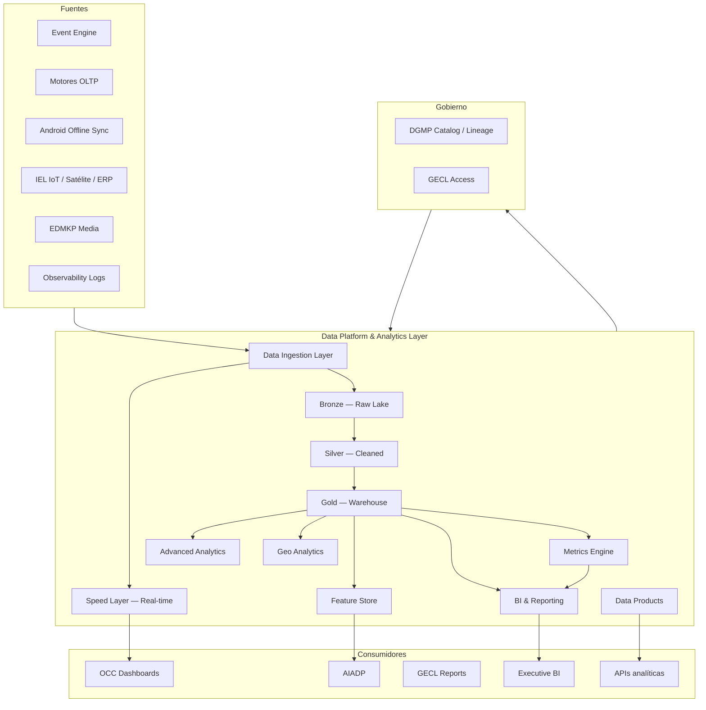
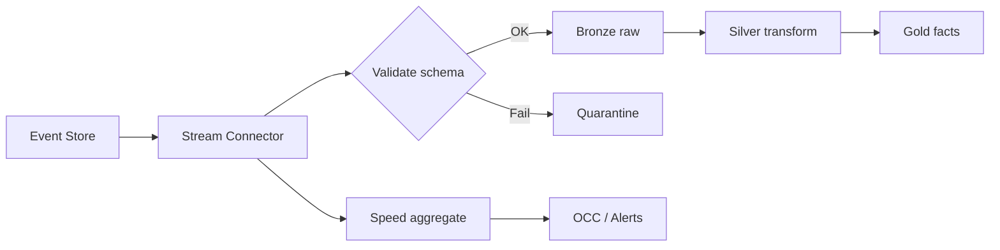

# AGROERP — Data Platform & Analytics Layer (DPAL)

**Versión:** 1.0  
**Estado:** Oficial — Especificación de plataforma de datos, analítica e inteligencia de negocio  
**Audiencia:** Chief Data Officers, arquitectos de datos, BI, data science, gerencia, operaciones, auditoría  
**Naturaleza:** Capa transversal de datos analíticos — **no es un módulo funcional de negocio**

---

## 0. Propósito y autoridad

El **Data Platform & Analytics Layer (DPAL)** es la **capa central de datos, analítica, inteligencia de negocio y observabilidad analítica** de AGROERP: captura, organiza, procesa y transforma **todos los datos del sistema** — operacionales, eventos, IoT, integraciones, GIS, documentos y telemetría — en **conocimiento accionable**. Es la **fuente oficial de verdad analítica** de la plataforma.

| Pregunta | Documento que responde |
|----------|------------------------|
| ¿Cómo se orquesta la plataforma? | `APOS.md` |
| ¿Gobierno dato operativo, MDM, calidad en origen? | `DATA_GOVERNANCE_PLATFORM.md` (DGMP) |
| ¿Seguridad y acceso analítico? | `GOVERNANCE_ENTERPRISE_CONTROL_LAYER.md` |
| ¿Ingesta datos externos? | `INTEGRATION_ECOSYSTEM_LAYER.md` (IEL) |
| ¿IA, predicciones, automatización? | `AGRO_INTELLIGENCE_AUTOMATION_DECISION_PLATFORM.md` |
| ¿Operaciones tiempo real OCC? | `OPERATIONS_COMMAND_CENTER.md` |
| **¿Dónde vive el dato analítico, BI y métricas oficiales?** | **Este documento (DPAL)** |

### Jerarquía documental

```
APOS.md                              → OS, Event Engine, observabilidad infra
DATA_GOVERNANCE_PLATFORM.md          → Gobierno dato operativo (DGMP)
DATA_PLATFORM_ANALYTICS_LAYER.md     → Plataforma datos analíticos (DPAL) — este documento
INTEGRATION_ECOSYSTEM_LAYER.md       → Ingesta externa → DPAL
AGRO_INTELLIGENCE_AUTOMATION_DECISION_PLATFORM.md → Consume Feature Store DPAL
OPERATIONS_COMMAND_CENTER.md         → Dashboards operativos (consume DPAL real-time)
AEPS.md                              → Estándares reportes export
{ENGINE}.md                          → Fuentes dominio → DPAL
```

**Regla de oro:** Ningún **KPI oficial, reporte ejecutivo, dataset ML o métrica publicada** existe sin registro en **DPAL Metrics Engine** o **Data Catalog analítico** (extensión DGMP). Los motores operacionales **producen eventos y transacciones**; DPAL **proyecta, agrega y sirve** para decisión.

### Principios inviolables

| # | Principio | Descripción |
|---|-----------|-------------|
| DPL-01 | **Single analytical truth** | Un KPI definido una vez en Metrics Engine |
| DPL-02 | **Event-sourced analytics** | Event Store es fuente primaria proyecciones |
| DPL-03 | **Governed consumption** | DGMP lineage + GECL access en todo dataset |
| DPL-04 | **Lambda architecture** | Batch + speed layer para misma métrica |
| DPL-05 | **Tenant isolated analytics** | `organizationId` en toda capa analítica |
| DPL-06 | **Immutable history** | Snapshots y SCD; no sobrescribir hechos |
| DPL-07 | **Quality at pipeline** | Validación antes de warehouse |
| DPL-08 | **Data products** | Entregables versionados con SLA |
| DPL-09 | **AI-ready by design** | Feature Store alimenta AIADP |
| DPL-10 | **Observable pipelines** | Toda ingesta y transformación monitoreada |

### Alcance

| Incluye | No incluye |
|---------|------------|
| Ingestion, Lake, Warehouse, BI | CRUD operacional motores |
| Real-time analytics, Metrics Engine | UI dashboards implementación |
| Advanced analytics, Feature Store | Entrenamiento runtime ML (AIADP) |
| Geo analytics, Data Products | Infra cloud detalle (APOS) |
| Observability data plane | Gobierno MDM detalle (DGMP) |

---

## 1. Visión y arquitectura

### 1.1 Visión

DPAL convierte AGROERP en una **plataforma data-driven agrícola** — comparable en espíritu a:

| Referencia | Capacidad análoga |
|------------|-------------------|
| Snowflake / Databricks | Lakehouse analítico |
| Google BigQuery + Looker | Warehouse + BI |
| Apache Kafka + Flink | Streaming analytics |
| dbt | Transformaciones warehouse |
| Feast / Tecton | Feature Store |
| Palantir Foundry | Data products gobernados |

### 1.2 Arquitectura conceptual (Medallion + Lambda)



### 1.3 DPAL vs DGMP vs motores

| Capa | Rol datos |
|------|-----------|
| **Motores OLTP** | Sistema de registro operativo — PostgreSQL |
| **Event Engine** | Log inmutable negocio — fuente analítica primaria |
| **DGMP** | Gobierno, calidad, catálogo, lineage **en origen** |
| **DPAL** | Lake, warehouse, métricas, BI, ML features **analíticos** |
| **OCC** | Vista operativa tiempo real — consume speed layer DPAL |
| **AIADP** | Modelos e inferencias — consume Feature Store DPAL |

---

## 2. Data Ingestion Layer

### 2.1 Canales de ingesta

| Canal | Fuente | Modo | Destino inicial |
|-------|--------|------|-----------------|
| **Streaming eventos** | Event Engine | Real-time | Bronze + Speed |
| **CDC / OLTP** | Motores PostgreSQL | Micro-batch | Bronze |
| **Mobile offline** | Sync Foundation | Batch push | Bronze |
| **IoT** | IEL MQTT | Streaming | Bronze + Speed |
| **Integraciones** | IEL pipelines | Batch / stream | Bronze |
| **GIS / satélite** | FTIP, IEL satellite | Batch | Bronze (GeoParquet) |
| **EDMKP** | Documentos, imágenes | Batch metadata | Bronze + Lake objects |
| **Observability** | Logs, traces, metrics | Stream | Bronze obs zone |
| **Audit** | GECL Audit Store | Batch | Bronze compliance zone |

### 2.2 IngestionPipeline

| Atributo | Descripción |
|----------|-------------|
| `pipelineId` | UUID |
| `pipelineKey` | `ingest.events.coffee.purchase` |
| `sourceType` | event, cdc, sync, iot, integration, gis, observability |
| `sourceRef` | Event type, table, connectionId |
| `schedule` | realtime, cron, on_event |
| `targetZone` | bronze, speed |
| `format` | json, parquet, avro, geoparquet |
| `partitionKeys` | organizationId, date, commodity |
| `qualityRulesRef` | DGMP DVE pack |
| `status` | active, paused, error |
| `slaLagMinutes` | |

### 2.3 Reglas ingesta

| Regla | Descripción |
|-------|-------------|
| DPL-ING-01 | Todo registro lleva `organizationId`, `ingestedAt`, `sourceSystem` |
| DPL-ING-02 | PII: clasificación DGMP antes de silver |
| DPL-ING-03 | Idempotent ingest — `eventId` / `correlationId` dedup |
| DPL-ING-04 | Fallo calidad → quarantine zone (DGMP) |
| DPL-ING-05 | Mobile sync: respetar `externalId` lineage |

### 2.4 Flujo ingesta eventos



---

## 3. Data Lake

### 3.1 Zonas del lake (Medallion)

| Zona | Contenido | Retención default |
|------|-----------|-------------------|
| **Bronze (raw)** | Payload inmutable tal como llegó | 7 años |
| **Silver (cleansed)** | Normalizado, tipado, deduplicado | 7 años |
| **Gold (curated)** | Modelos dimensionales, agregados | 10 años |
| **Quarantine** | Registros rechazados DVE | 90 días |
| **Compliance** | Audit, PII masked archives | GECL policy |
| **Observability** | Logs, traces | 90–365 días |

### 3.2 Tipos de datos almacenados

| Tipo | Formato lake | Ejemplo |
|------|--------------|---------|
| **Estructurados** | Parquet | Compras, liquidaciones |
| **Semiestructurados** | JSON, Parquet | Form submissions, configs |
| **No estructurados** | S3 objects + metadata | PDFs EDMKP |
| **Imágenes** | S3 + manifest Parquet | Fotos visita, evidencia |
| **Videos** | S3 + manifest | Capacitación campo |
| **Audio** | S3 + transcript ref | Notas voz |
| **Formularios** | JSON schema versioned | AITAP visitas |
| **Eventos** | JSON / Avro | Event Store projection |
| **Logs** | JSON lines | Application logs |
| **Geoespacial** | GeoParquet, COG rasters | FTIP polígonos, NDVI |

### 3.3 LakePartition

| Atributo | Descripción |
|----------|-------------|
| `organizationId` | Obligatorio multi-tenant |
| `commodity` | coffee, cacao, … |
| `domain` | procurement, settlement, gis |
| `year` / `month` / `day` | Time partition |
| `ingestionDate` | |

**Path pattern:** `s3://agroerp-lake/{zone}/{organizationId}/{domain}/{year}/{month}/{day}/`

### 3.4 DataLakeAsset

| Atributo | Descripción |
|----------|-------------|
| `assetId` | |
| `assetType` | table, file, stream |
| `zone` | bronze, silver, gold |
| `schemaRef` | Schema Registry |
| `rowCount` | |
| `sizeBytes` | |
| `lastRefreshedAt` | |
| `ownerTeam` | |
| `classification` | DGMP DSS |
| `catalogEntryId` | Data Catalog |

---

## 4. Data Warehouse

### 4.1 Modelo dimensional (Kimball + agronegocio)

Dominios analíticos en **Gold layer**:

| Mart | Hechos principales | Dimensiones |
|------|-------------------|-------------|
| **Procurement** | `fact_purchase`, `fact_reception` | tiempo, productor, finca, comprador, calidad, bodega |
| **Inventory** | `fact_inventory_movement`, `fact_stock_snapshot` | tiempo, lote, bodega, producto, estado |
| **Logistics** | `fact_shipment`, `fact_delivery` | tiempo, ruta, vehículo, origen, destino |
| **Settlement** | `fact_settlement`, `fact_payment` | tiempo, productor, concepto, moneda |
| **Quality** | `fact_cupping`, `fact_nc` | tiempo, lote, catador, defecto |
| **Producer** | `fact_producer_activity` | tiempo, productor, lifecycle_stage |
| **Territory** | `fact_farm_metrics` | tiempo, finca, municipio, zona |
| **Agronomic** | `fact_visit`, `fact_recommendation` | tiempo, técnico, finca, plan |
| **Operations** | `fact_alert`, `fact_sla` | tiempo, motor, severidad |

### 4.2 FactTable (patrón)

| Atributo | Descripción |
|----------|-------------|
| `factKey` | Surrogate PK |
| `organizationId` | |
| `dateKey` | FK dim_date |
| `grain` | Descripción granularidad |
| `measures` | JSON o columnas — kg, USD, score |
| `degenerateDimensions` | IDs negocio |
| `sourceEventIds` | Lineage Event Store |
| `snapshotDate` | Si periodic snapshot |

### 4.3 DimensionTable (SCD Type 2)

| Atributo | Descripción |
|----------|-------------|
| `dimensionKey` | Surrogate |
| `naturalKey` | producerId, farmUnitId |
| `attributes` | Slowly changing |
| `validFrom` / `validTo` | |
| `isCurrent` | bool |
| `version` | |

### 4.4 Agregaciones y snapshots

| Tipo | Uso | Frecuencia |
|------|-----|------------|
| **Rolling aggregates** | KPIs 7d, 30d, YTD | Hourly / daily |
| **Periodic snapshots** | Inventario fin de día | Daily |
| **Month-end close** | Financiero | Monthly |
| **Season aggregates** | Cosecha cafetera | Per season |
| **Pre-computed cubes** | BI performance | Daily |

### 4.5 Transformación (dbt-style conceptual)

| Capa transform | Responsabilidad |
|----------------|-----------------|
| **Staging** | Bronze → tipado, rename |
| **Intermediate** | Joins, business logic |
| **Marts** | Facts + dimensions Gold |
| **Metrics** | Metrics Engine definitions materialized |

---

## 5. Real-time analytics (Speed Layer)

### 5.1 Propósito

Alimentar **OCC**, alertas inmediatas y KPIs vivos sin esperar batch warehouse.

### 5.2 RealTimeAggregate

| Atributo | Descripción |
|----------|-------------|
| `aggregateKey` | `coffee.purchases.today_kg` |
| `organizationId` | |
| `windowType` | tumbling_1m, tumbling_1h, sliding_24h |
| `value` | number |
| `lastUpdatedAt` | |
| `sourceEvents` | Count processed |

### 5.3 Capacidades

| Capacidad | Consumidor |
|-----------|------------|
| **Dashboards tiempo real** | OCC widgets |
| **Alertas inmediatas** | Notification Engine vía AIADP rules |
| **KPIs vivos** | OCC header metrics |
| **Monitoreo operacional** | CLSE tracking, CPE sessions activas |

### 5.4 SLAs speed layer

| Métrica | Target |
|---------|--------|
| Event → aggregate | < 5 segundos p95 |
| Aggregate freshness | < 1 minuto |
| Concurrent queries OCC | 1000 org simultaneous |

---

## 6. Business Intelligence

### 6.1 Capas BI

| Capa | Audiencia | Contenido |
|------|-----------|-----------|
| **Executive** | CEO, gerencia | KPIs consolidados, tendencias |
| **Operational** | OCC, supervisores | Tiempo real + día |
| **Domain** | Finanzas, logística, calidad | Marts específicos |
| **Field** | Extensionistas | Productividad finca, visitas |
| **Compliance** | Auditoría | Trails, cumplimiento |
| **Self-service** | Analistas | Datasets autorizados |

### 6.2 ReportDefinition (analítico)

| Atributo | Descripción |
|----------|-------------|
| `reportId` | |
| `reportKey` | `coffee.executive.monthly` |
| `organizationId` | null = template platform |
| `category` | executive, financial, logistics, agronomic, quality |
| `datasetRef` | Gold mart o Data Product |
| `parameters` | period, commodity, region |
| `outputFormats` | pdf, xlsx, csv, api |
| `schedule` | cron opcional |
| `audienceRoles` | |
| `version` | |

### 6.3 Dominios analíticos BI

| Dominio | Reportes ejemplo |
|---------|------------------|
| **Productividad** | Kg/hectárea, rendimiento por zona |
| **Financiero** | Liquidaciones, cartera, anticipos, márgenes |
| **Logístico** | OTIF, costo transporte, inventario tránsito |
| **Agronómico** | Visitas, cumplimiento plan manejo, NDVI trend |
| **Calidad** | Defectos, rechazos, premium vs estándar |
| **Productor** | Ranking, retención, lifecycle funnel |
| **Riesgo** | Score GECL + AIADP consolidado |

### 6.4 Dashboard por rol

| Rol | Dashboard DPAL |
|-----|----------------|
| Gerente general | Executive cockpit |
| Tesorero | CSFE financial mart |
| Jefe compras | CPE + CQIE |
| Logística | CLSE + CITE |
| Extensionista | AITAP + FTIP geo |
| CISO | GECL security metrics |

---

## 7. Advanced Analytics

### 7.1 Capacidades

| Capacidad | Uso AGROERP | Motor ejecución |
|-----------|-------------|-----------------|
| **Machine learning** | Predicción cosecha, calidad | AIADP |
| **Predicciones** | Demanda, precio, riesgo | AIADP |
| **Clustering** | Segmentación productores | AIADP |
| **Segmentación avanzada** | Marketing cooperativa | DPAL + AIADP |
| **Correlación** | Clima vs rendimiento | DPAL notebooks |
| **Anomalías** | Fraude, pesaje, inventario | AIADP + DPAL |

### 7.2 AnalyticsModel

| Atributo | Descripción |
|----------|-------------|
| `modelId` | |
| `modelKey` | `predict.coffee.yield` |
| `modelType` | regression, classification, clustering, anomaly |
| `trainingDatasetRef` | DPAL curated |
| `featureSetRef` | Feature Store |
| `aiadpAgentRef` | Opcional |
| `version` | |
| `metrics` | accuracy, F1, MAE |
| `governanceStatus` | GECL AI approved |

### 7.3 Sandbox analítico

| Entorno | Datos | Usuarios |
|---------|-------|----------|
| **Exploration** | Sample masked | Data scientists |
| **Development** | Org subset anon | ML engineers |
| **Production** | Full authorized | AIADP inference only |

---

## 8. Data governance (marco analítico → DGMP)

DPAL **consume y extiende** DGMP para el plano analítico.

### 8.1 Data Catalog analítico

| Entrada catálogo | Zona |
|------------------|------|
| Lake assets | Bronze/Silver/Gold |
| Warehouse tables | Gold |
| Metrics definitions | Metrics Engine |
| Feature sets | Feature Store |
| Data Products | Published products |
| Reports | BI layer |

### 8.2 Lineage analítico

```
Event Store / OLTP
    → Ingestion Pipeline
    → Bronze asset
    → Silver transform
    → Gold fact_dim
    → Metric / Report / Feature
    → AIADP inference / BI export
```

Registrado en **DGMP Lineage Service** con nodos DPAL.

### 8.3 Calidad en pipeline

| Checkpoint | Regla |
|------------|-------|
| Bronze → Silver | Schema, nulls, referential |
| Silver → Gold | Business keys, grain |
| Gold → Metric | Reconciliation OLTP |
| Feature → AIADP | Drift detection |

### 8.4 Ownership analítico

| Rol | Responsabilidad |
|-----|-----------------|
| **Data Product Owner** | SLA producto |
| **Metric Owner** | Definición KPI |
| **Steward** | Calidad dominio (DGMP) |
| **Consumer** | Rol BI con acceso GECL |

---

## 9. Metrics Engine

### 9.1 Propósito

**Motor central de métricas** — una definición, múltiples consumidores (BI, OCC, AIADP, alertas).

### 9.2 MetricDefinition

| Atributo | Descripción |
|----------|-------------|
| `metricKey` | `coffee.procurement.purchase_kg_daily` |
| `displayName` | |
| `description` | Business definition |
| `formula` | SQL / declarative expression |
| `grain` | day, week, month, season |
| `dimensions` | Array — org, farm, producer, warehouse |
| `unit` | kg, USD, percent, count |
| `sourceMart` | Gold ref |
| `refreshSchedule` | |
| `owner` | |
| `version` | |
| `status` | draft, published, deprecated |
| `thresholds` | warning, critical — alertas |

### 9.3 Jerarquía métricas

| Nivel | Scope | Ejemplo |
|-------|-------|---------|
| **Global platform** | Cross-tenant agregado anon | Benchmark sector |
| **Empresa** | `organizationId` | Compras mes coop |
| **Proceso** | Motor | CPE sessions activas |
| **Productor** | `producerId` | Kg entregados YTD |
| **Finca** | `farmUnitId` | Rendimiento ha |
| **Lote** | `lotId` | Trazabilidad calidad |

### 9.4 MetricSnapshot

| Atributo | Descripción |
|----------|-------------|
| `metricKey` | |
| `organizationId` | |
| `dimensionValues` | JSON |
| `periodStart` / `periodEnd` | |
| `value` | |
| `computedAt` | |
| `lineageRef` | Pipeline run ID |

### 9.5 KPIs café oficiales (referencia CDP)

| metricKey | Fuente mart |
|-----------|-------------|
| `coffee.procurement.purchase_kg` | fact_purchase |
| `coffee.inventory.stock_kg` | fact_stock_snapshot |
| `coffee.settlement.amount_paid_usd` | fact_payment |
| `coffee.quality.rejection_rate` | fact_nc |
| `coffee.logistics.otif_percent` | fact_delivery |
| `coffee.producer.active_count` | dim_producer |
| `coffee.farm.area_ha` | fact_farm_metrics |
| `coffee.agronomic.visit_compliance` | fact_visit |

---

## 10. Geo Analytics

### 10.1 Integración FTIP + GIS Engine

| Capacidad | Descripción |
|-----------|-------------|
| **Mapas de calor** | Densidad compras, rendimiento |
| **Análisis espacial** | Buffer finca, distancia acopio |
| **Correlación geográfica** | NDVI vs defectos calidad |
| **Productividad por zona** | Kg/ha por municipio |
| **Riesgo por región** | Score clima + fraude + NC |

### 10.2 GeoAnalyticsLayer

| Atributo | Descripción |
|----------|-------------|
| `layerId` | |
| `layerType` | heatmap, choropleth, cluster |
| `metricKey` | Metrics Engine ref |
| `geometrySource` | FTIP farm polygons |
| `rasterSource` | IEL satellite NDVI |
| `style` | JSON |
| `refreshSchedule` | |

### 10.3 SpatialAggregate

| Atributo | Descripción |
|----------|-------------|
| `regionKey` | municipio, zona, watershed |
| `metricKey` | |
| `value` | |
| `geometryRef` | GeoJSON simplified |
| `period` | |

---

## 11. AI Data Feed (Feature Store)

### 11.1 Propósito

Preparar datos **curados y versionados** para AIADP — variables agrícolas, financieras, logísticas.

### 11.2 FeatureSet

| Atributo | Descripción |
|----------|-------------|
| `featureSetKey` | `fs.coffee.producer.risk` |
| `version` | |
| `entities` | producer, farm, lot |
| `features` | Array FeatureDefinition |
| `sourceTables` | Gold + Silver refs |
| `freshnessSla` | |
| `pointInTimeCorrect` | bool — evita leakage |
| `certificationStatus` | DGMP + GECL AI |

### 11.3 FeatureDefinition

| Atributo | Descripción |
|----------|-------------|
| `featureKey` | `producer_avg_quality_score_90d` |
| `dataType` | float, int, categorical |
| `description` | |
| `transformation` | |
| `nullable` | |

### 11.4 Dominios features

| Dominio | Variables ejemplo |
|---------|-------------------|
| **Agrícola** | NDVI mean, visitas count, plan compliance |
| **Financiera** | saldo, anticipos ratio, días pago |
| **Logística** | distancia acopio, OTIF histórico |
| **Calidad** | defect rate, cupping score avg |
| **Comportamiento** | entregas frequency, seasonality |

### 11.5 FeatureVector (online serving)

| Atributo | Descripción |
|----------|-------------|
| `entityType` | producer |
| `entityId` | |
| `featureSetVersion` | |
| `values` | JSON |
| `computedAt` | |

AIADP consulta Feature Store antes de inferencia — audit GECL.

---

## 12. Observability Data Plane

### 12.1 Propósito

Centralizar datos de **logs, eventos técnicos, errores, performance y uso** para análisis operativo de plataforma.

### 12.2 ObservabilityDataStream

| Tipo | Fuente | Retención |
|------|--------|-----------|
| **Application logs** | Motores | 90d hot, 1y cold |
| **Access logs** | API Gateway | 1y |
| **Error traces** | OpenTelemetry | 90d |
| **Performance** | APM metrics | 13 meses |
| **Usage analytics** | Client telemetry | 2 años |
| **Integration logs** | IEL | 1y |

### 12.3 PlatformUsageMetric

| Métrica | Uso |
|---------|-----|
| DAU / MAU por org | Licenciamiento |
| API calls by endpoint | Capacity |
| Sync volume mobile | Infra |
| Report exports | Compliance |
| Dashboard views | Adoption |

Distinto de **GECL observability** (seguridad) — DPAL enfoca **producto y capacidad**.

---

## 13. Data Products

### 13.1 Concepto

**Productos de datos** versionados con owner, SLA, contrato y catálogo — unidad de entrega analítica.

### 13.2 DataProduct

| Atributo | Descripción |
|----------|-------------|
| `productId` | |
| `productKey` | `dp.coffee.production.report` |
| `displayName` | |
| `description` | |
| `ownerTeam` | |
| `organizationScope` | platform, org, enterprise |
| `datasets` | Array refs Gold/API |
| `metrics` | Array metricKeys |
| `slaFreshness` | e.g. T+1 06:00 |
| `accessPolicyRef` | GECL |
| `version` | |
| `status` | published, deprecated |
| `consumerCount` | |

### 13.3 Productos estándar café

| Product Key | Contenido |
|-------------|-----------|
| `dp.coffee.production` | Kg comprados, recepcionados, por zona |
| `dp.coffee.financial` | Liquidaciones, pagos, cartera |
| `dp.coffee.quality` | Cataciones, NC, certificaciones |
| `dp.coffee.logistics` | Envíos, OTIF, costos |
| `dp.coffee.risk` | Scores fraude, clima, cumplimiento |
| `dp.coffee.traceability` | Lote E2E export |
| `dp.coffee.producer_360` | Vista analítica productor |

### 13.4 Data Product API

| Operación | Descripción |
|-----------|-------------|
| `GET /analytics/v1/products/{key}` | Metadata |
| `GET /analytics/v1/products/{key}/data` | Query parametrizada |
| `POST /analytics/v1/products/{key}/export` | Async export EDMKP |

---

## 14. Seguridad y acceso analítico

### 14.1 Controles GECL aplicados

| Control | Descripción |
|---------|-------------|
| Row-level | `organizationId` mandatory |
| Column-level | PII masked por rol |
| Dataset approval | Self-service request workflow |
| Export audit | `ReportExported` event |
| Cross-border | Data residency policy |

### 14.2 AnalyticsAccessGrant

| Atributo | Descripción |
|----------|-------------|
| `grantId` | |
| `userId` / `roleId` | |
| `resourceType` | dataset, metric, product |
| `resourceKey` | |
| `scope` | org, enterprise, field-level |
| `expiresAt` | |

---

## 15. Integraciones DPAL

| Sistema | Relación |
|---------|----------|
| **Event Engine** | Fuente streaming primaria |
| **IEL** | Ingesta externa |
| **DGMP** | Catalog, lineage, quality |
| **GECL** | Access, audit export |
| **AIADP** | Feature Store consumer |
| **OCC** | Speed layer consumer |
| **EDMKP** | Exports reportes, media refs |
| **FTIP / GIS** | Geo analytics |
| **Motores** | CDC fuente OLTP |
| **APOS** | Schema Registry, observability infra |

---

## 16. Eventos DPAL (namespace `platform.analytics.*`)

| Evento | Cuándo |
|--------|--------|
| `AnalyticsPipelineCompleted` | Batch success |
| `AnalyticsPipelineFailed` | Batch error |
| `MetricPublished` | Nueva métrica oficial |
| `DataProductPublished` | Producto disponible |
| `FeatureSetUpdated` | Feature Store version |
| `ReportExported` | BI export |
| `DataQualityAnalyticalFailure` | Gold reconciliation fail |
| `RealTimeAggregateStale` | Speed layer lag |

---

## 17. Reportes plataforma DPAL

| ID | Reporte |
|----|---------|
| DPL-RPT-01 | Pipeline health y lag |
| DPL-RPT-02 | Lake storage por org |
| DPL-RPT-03 | Metric catalog inventory |
| DPL-RPT-04 | Data Product usage |
| DPL-RPT-05 | Feature Store freshness |
| DPL-RPT-06 | BI adoption por rol |
| DPL-RPT-07 | Reconciliation OLTP vs Gold |
| DPL-RPT-08 | Quarantine analytical queue |

---

## 18. KPIs plataforma datos

| KPI | Definición |
|-----|------------|
| **Pipeline success rate** | % runs OK |
| **Data freshness** | Lag vs SLA |
| **Metric coverage** | % procesos con KPI oficial |
| **Gold reconciliation** | % facts balanced OLTP |
| **Feature freshness** | % features within SLA |
| **BI adoption** | Active users / licensed |
| **Query performance** | p95 warehouse |
| **Lake cost efficiency** | $/TB/org |

---

## 19. Alertas DPAL

| ID | Alerta | Severidad |
|----|--------|-----------|
| DPL-ALT-01 | Pipeline failed 3x | critical |
| DPL-ALT-02 | Speed layer stale > 5 min | high |
| DPL-ALT-03 | Gold reconciliation variance | high |
| DPL-ALT-04 | Feature Store drift detected | medium |
| DPL-ALT-05 | Lake quarantine growing | medium |
| DPL-ALT-06 | Metric computation timeout | high |
| DPL-ALT-07 | Data Product SLA breach | high |
| DPL-ALT-08 | Storage quota org exceeded | medium |

---

## 20. Escalabilidad

| Dimensión | Estrategia |
|-----------|------------|
| **Big Data** | S3 lake + distributed processing |
| **Multi-tenant** | Partition `organizationId`; isolated gold schemas enterprise tier |
| **Multi-country** | Region-specific marts; currency normalization |
| **Alta concurrencia** | Read replicas warehouse; cache metrics Redis |
| **Streaming masivo** | Partitioned topics; auto-scale consumers |
| **Query scale** | Pre-aggregation; materialized views |
| **Cost** | Lifecycle policies bronze→glacier |

### 20.1 Volúmenes referencia (diseño)

| Señal | Volumen diseño |
|-------|----------------|
| Eventos/día | 100M+ platform scale |
| IoT messages/día | 50M+ |
| Warehouse rows/day | 10M+ facts |
| Concurrent BI users | 10K |
| Feature lookups/s | 5K |

---

## 21. Roadmap evolutivo

| Fase | Entregables |
|------|-------------|
| **F1 — Event ingestion** | Bronze events from Event Store |
| **F2 — Metrics Engine** | 20 KPIs café core |
| **F3 — Gold marts** | Procurement + Settlement facts |
| **F4 — Speed layer** | OCC real-time aggregates |
| **F5 — BI executive** | 5 reportes PDF/Excel |
| **F6 — Feature Store v1** | Producer risk features → AIADP |
| **F7 — Geo analytics** | NDVI + purchase heatmaps |
| **F8 — Data Products** | 5 productos estándar café |
| **F9 — Advanced analytics** | Anomaly detection datasets |
| **F10 — Self-service BI** | Authorized datasets |
| **F11 — Multi-commodity** | Cacao marts |
| **F12 — ML observability** | Model drift dashboards |

---

## 22. Checklist cumplimiento

- [ ] KPI oficial registrado Metrics Engine
- [ ] Lineage Bronze → Gold en DGMP
- [ ] `organizationId` en toda capa
- [ ] PII masked según clasificación
- [ ] Reconciliation Gold vs OLTP periódica
- [ ] Data Product con owner y SLA
- [ ] Feature Set aprobado GECL AI antes prod
- [ ] Report export auditado
- [ ] Pipeline observability habilitada
- [ ] Retención lake según política
- [ ] Speed layer SLA monitoreado
- [ ] Catálogo analítico actualizado

---

## 23. Conclusión

El **Data Platform & Analytics Layer (DPAL)** es la **fuente oficial de verdad analítica de AGROERP**. Proporciona:

- **Data Ingestion** — streaming, batch, mobile, IoT, integraciones, GIS, satélite
- **Data Lake** — Medallion bronze/silver/gold; estructurado a multimedia
- **Data Warehouse** — facts, dimensions, SCD, snapshots, agregaciones
- **Real-time analytics** — speed layer para OCC y alertas
- **Business Intelligence** — ejecutivo, operacional, por rol y dominio
- **Advanced analytics** — ML, predicciones, clustering, anomalías
- **Data governance analítico** — integrado DGMP lineage y calidad
- **Metrics Engine** — KPIs globales, empresa, productor, finca, proceso
- **Geo Analytics** — heatmaps, espacial, productividad zonal
- **Feature Store** — AI data feed para AIADP
- **Observability data** — logs, uso, performance
- **Data Products** — producción, financiero, calidad, logística, riesgo
- **Escalabilidad** — big data, multi-tenant, multi-país, streaming masivo

**Los motores operan el negocio. DPAL transforma los datos en conocimiento para decidir.**

---

*Documento elaborado para AGROERP — Data Platform & Analytics Layer v1.0.*  
*Gobierno dato operativo:* `DATA_GOVERNANCE_PLATFORM.md`  
*Próximo paso recomendado:* Fase F1 — Event ingestion Bronze + Metrics Engine 5 KPIs core café
