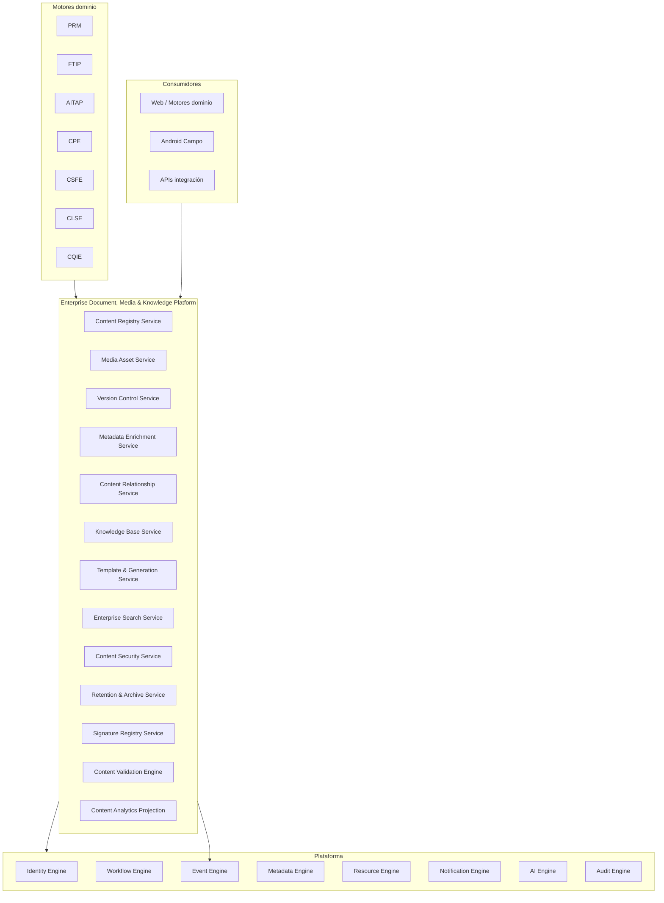
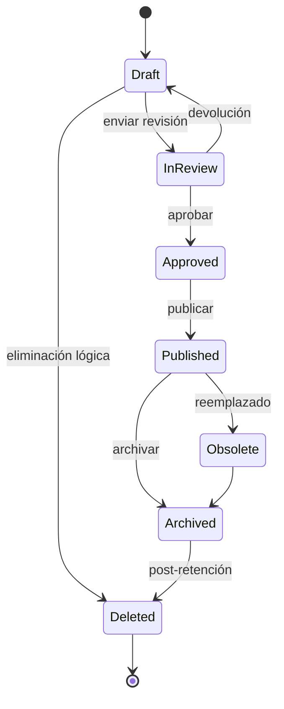

# AGROERP — Enterprise Document, Media & Knowledge Platform (EDMKP)

**Versión:** 1.0  
**Estado:** Oficial — Especificación de la plataforma empresarial de documentos, multimedia y conocimiento  
**Audiencia:** Gobierno documental, legal, operaciones, arquitectura, auditoría, compliance, extensión  
**Naturaleza:** Plataforma empresarial transversal — **no es un gestor documental tradicional ni un almacenamiento de archivos**

---

## 0. Propósito y autoridad

La **Enterprise Document, Media & Knowledge Platform (EDMKP)** administra **absolutamente toda la información documental y multimedia** de AGROERP: contratos, certificados, comprobantes, fotografías, videos, firmas, plantillas, normativa, base de conocimiento, versionamiento, control documental, búsqueda empresarial, retención y seguridad. Es el **repositorio oficial de conocimiento** de la plataforma.

| Pregunta | Documento que responde |
|----------|------------------------|
| ¿Catálogos documentales? | `MASTER_DATA_ENGINE.md` (`document.*`) |
| ¿Gobierno del dato y retención? | `DATA_GOVERNANCE_PLATFORM.md` |
| ¿Permisos y roles? | Identity Engine + `AEPS.md` |
| ¿Workflow aprobación? | Workflow Engine |
| ¿Metadatos extensibles? | Metadata Engine |
| **¿Dónde vive, versiona y busca todo contenido documental/multimedia?** | **Este documento (EDMKP)** |

### Jerarquía documental

```
DATA_GOVERNANCE_PLATFORM.md                           → Políticas retención, clasificación
ENTERPRISE_DOCUMENT_MEDIA_KNOWLEDGE_PLATFORM.md       → ECM + conocimiento (EDMKP)
MASTER_DATA_ENGINE.md                                 → Catálogos document.*
Motores de dominio (PRM, CPE, CSFE, AITAP, FTIP…)     → Consumen EDMKP vía contentId
AEPS.md                                               → Implementación técnica
```

**Regla de oro:** Ningún motor de dominio **almacena archivos binarios de forma autoritativa**. Todo PDF, foto, video, audio, firma, plantilla y artículo de conocimiento se registra en **EDMKP** con `contentId` / `mediaAssetId` inmutable referenciable. Los motores guardan **referencias**, no blobs.

### Distinción crítica

| Sistema | Responsabilidad |
|---------|-----------------|
| **SharePoint / Drive genérico** | Carpetas y archivos sin contexto negocio |
| **Almacenamiento S3/blob** | Persistencia bytes sin gobierno |
| **EDMKP** | ECM empresarial + multimedia + conocimiento + relaciones dominio |
| **Motores dominio** | Generan/consumen contenido; no son repositorio |
| **Form Engine** | Captura datos; adjuntos → EDMKP |

### Principios inviolables

| # | Principio | Descripción |
|---|-----------|-------------|
| D1 | **Content as enterprise asset** | Todo archivo es activo con metadatos, estado y lineage |
| D2 | **Reference, don't duplicate** | Motores usan `contentId`; un solo master |
| D3 | **Version immutability** | Versión publicada no se sobrescribe |
| D4 | **Lifecycle governed** | Borrador → revisión → aprobación → publicado → archivado |
| D5 | **Relationship native** | Documento ligado a productor, finca, compra, pago… |
| D6 | **Security by classification** | Confidencialidad + RBAC + scope org |
| D7 | **Retention enforced** | Políticas DGMP ejecutadas automáticamente |
| D8 | **Media metadata rich** | EXIF, GPS, duración, resolución preservados |
| D9 | **Search enterprise-wide** | Índice unificado metadatos + texto (OCR futuro) |
| D10 | **Scale to millions** | Particionamiento, tiering, CDN/streaming |

### Alcance

| Incluye | No incluye |
|---------|------------|
| Repositorio documentos y multimedia | UI gestor documental |
| Versionamiento y control documental | Lógica negocio compra/pago |
| Base de conocimiento organizacional | Formularios dinámicos (Form Engine) |
| Plantillas y generación PDF | Render mapas (GIS Engine) |
| Búsqueda empresarial | Workflow definitions (Workflow Engine) |
| Firmas digitales registro | Firma legal externa (integración) |
| Retención y archivado | |
| OCR / IA documental (casos uso) | |

---

## 1. Visión y arquitectura funcional

### 1.1 Visión

EDMKP es el **sistema nervioso documental** de AGROERP — comparable en espíritu a:

| Referencia | Capacidad análoga |
|------------|-------------------|
| Microsoft SharePoint + Purview | ECM, retención, búsqueda |
| OpenText / Documentum | Control documental enterprise |
| M-Files | Metadatos sobre carpetas |
| Confluence + DAM | Conocimiento + media asset management |
| Agribusiness compliance vault | Certificados, trazabilidad documental |

### 1.2 Arquitectura conceptual



### 1.3 Componentes lógicos

| Componente | Responsabilidad |
|------------|-----------------|
| **Content Registry Service (CMS)** | Registro maestro documentos y archivos |
| **Media Asset Service (MED)** | Fotos, video, audio, streaming, thumbnails |
| **Version Control Service (VER)** | Versiones, diff, rollback, lock |
| **Metadata Enrichment Service (MET)** | Metadatos, etiquetas, clasificación |
| **Content Relationship Service (REL)** | Vínculos entidades negocio |
| **Knowledge Base Service (KBS)** | Artículos, procedimientos, FAQs |
| **Template & Generation Service (TPL)** | Plantillas PDF/Word, merge datos |
| **Enterprise Search Service (SRC)** | Búsqueda texto, metadatos, semántica |
| **Content Security Service (SEC)** | ACL documento, carpeta, etiqueta |
| **Retention & Archive Service (RET)** | Conservación, legal hold, eliminación |
| **Signature Registry Service (SIG)** | Firmas capturadas y verificación |
| **Content Validation Engine (VAL)** | Tipo MIME, virus scan, políticas |
| **Content Analytics Projection (PRJ)** | KPIs, uso, espacio |

---

## 2. Tipos de contenido

### 2.1 Taxonomía de contenido

| Familia | Tipos | MIME / formato |
|---------|-------|----------------|
| **Documentos ofimática** | PDF, Word, Excel, PowerPoint, CSV | application/pdf, docx, xlsx… |
| **Imagen** | Fotografía, escaneo, firma imagen | image/jpeg, png, webp |
| **Video** | Evidencia, capacitación, entrevista | video/mp4, webm |
| **Audio** | Nota voz, entrevista | audio/mpeg, ogg |
| **Firma** | Captura digital | image + SignatureRecord |
| **Formulario** | PDF generado, submission export | PDF / JSON ref Form Engine |
| **Geoespacial** | Mapa, archivo GIS, polígono export | GeoJSON, KML, SHP (ref FTIP/GIS) |
| **Plantilla** | Template merge | docx, html, handlebars |
| **Conocimiento** | Artículo, procedimiento, FAQ | HTML/Markdown estructurado |
| **Normativa** | Política interna, legal | PDF |
| **Comercial** | Contrato, certificado, factura, comprobante | PDF |
| **Multimedia derivado** | Miniatura, preview, transcode | generado MED |

Catálogo: `document.type`, `document.file_type`, `document.photo_type`, `document.video_type`.

### 2.2 ContentItem (documento / archivo maestro)

| Atributo | Descripción |
|----------|-------------|
| `contentId` | UUID — identificador global |
| `organizationId` | Tenant |
| `contentNumber` | Humano opcional |
| `title` | Título |
| `description` | |
| `contentFamily` | `document`, `media`, `knowledge`, `template`, `geospatial` |
| `contentTypeCode` | `document.type` |
| `mimeType` | |
| `fileExtension` | |
| `currentVersionId` | Versión vigente |
| `status` | §5 — lifecycle |
| `approvalStatus` | §5 |
| `classificationCode` | `confidential`, `internal`, `public` (DGMP) |
| `categoryCode` | Catálogo org |
| `tags` | Array etiquetas |
| `authorUserId` | Autor |
| `ownerUserId` | Responsable custodia |
| `createdAt` | |
| `modifiedAt` | |
| `publishedAt` | |
| `expiresAt` | Si aplica |
| `retentionPolicyId` | |
| `legalHold` | bool — bloqueo eliminación |
| `sourceModule` | `cpe`, `csfe`, `prm`, `aitap`… |
| `sourceEntityType` | purchase, settlement, producer… |
| `sourceEntityId` | |
| `storageTier` | `hot`, `warm`, `cold`, `archive` |
| `sizeBytes` | Versión actual |
| `checksumSha256` | Integridad |
| `immutable` | Post-publicación legal |
| `deletedAt` | Soft delete |
| `observations` | |

### 2.3 MediaAsset (activo multimedia)

Extensión para foto/video/audio con metadatos ricos.

| Atributo | Descripción |
|----------|-------------|
| `mediaAssetId` | UUID (= contentId o hijo) |
| `contentId` | Padre |
| `mediaType` | `photo`, `video`, `audio` |
| `thumbnailUrl` | Generado |
| `previewUrl` | |
| `streamingUrl` | HLS/DASH si video |
| `durationSec` | Video/audio |
| `widthPx` / `heightPx` | |
| `resolution` | 1080p, 4K… |
| `compressionProfile` | |
| `exifMetadata` | JSON — cámara, fecha |
| `gpsGeo` | Point captura |
| `capturedAt` | |
| `deviceId` | |
| `transcodeStatus` | `pending`, `ready`, `failed` |

---

## 3. Metadatos

### 3.1 Metadatos obligatorios

| Campo | Fuente |
|-------|--------|
| Título | Usuario / generación |
| Autor | Identity |
| Fecha creación | Sistema |
| Versión | VER |
| Estado | Lifecycle |
| Tipo documental | `document.type` |
| Categoría | Org catalog |
| Empresa (org) | Tenant |
| Nivel confidencialidad | DGMP |
| Módulo origen | Motor registrador |

### 3.2 Metadatos de contexto negocio (relaciones)

| Campo | Entidad referenciada |
|-------|---------------------|
| `producerId` | PRM |
| `farmUnitId` | FTIP |
| `lotUnitId` | FTIP |
| `contractId` | CSAE |
| `purchaseId` | CPE |
| `settlementId` | CSFE |
| `paymentId` | CSFE |
| `visitId` | AITAP |
| `inventoryLotId` | CITE |
| `shipmentId` | CLSE |
| `vehicleId` | CLSE |
| `incidentId` | CLSE / AITAP |
| `formSubmissionId` | Form Engine |
| `processCode` | Workflow / catálogo proceso |

### 3.3 Metadatos extensibles

`metadata` JSON validado por Metadata Engine schema por `contentTypeCode`.

### 3.4 ContentMetadataSnapshot

Snapshot inmutable por versión para auditoría y búsqueda histórica.

---

## 4. Versionamiento

### 4.1 ContentVersion

| Atributo | Descripción |
|----------|-------------|
| `versionId` | UUID |
| `contentId` | |
| `versionNumber` | 1, 2, 3… semver opcional |
| `versionLabel` | `draft`, `1.0`, `amendment` |
| `storageUri` | Blob store |
| `sizeBytes` | |
| `checksumSha256` | |
| `changeSummary` | |
| `changedBy` | |
| `changedAt` | |
| `status` | `draft`, `in_review`, `approved`, `published`, `superseded` |
| `parentVersionId` | |
| `immutable` | true si publicado |

### 4.2 Capacidades

| Capacidad | Descripción |
|-----------|-------------|
| **Crear versión** | Nueva revisión; anterior `superseded` al publicar |
| **Comparar versiones** | Diff metadatos; diff texto (PDF futuro) |
| **Historial** | Lista completa versiones |
| **Rollback** | Restaurar versión N como nueva N+1 (no borrar historia) |
| **Bloqueo edición** | Checkout lock por usuario |
| **Control cambios** | `VersionChangeLog` con motivo |

### 4.3 Reglas

| Regla | Descripción |
|-------|-------------|
| EDMKP-VER-01 | Versión `published` es inmutable |
| EDMKP-VER-02 | Rollback crea nueva versión, no elimina |
| EDMKP-VER-03 | Solo una versión `draft` activa por contentId |
| EDMKP-VER-04 | Publicación requiere workflow si política aplica |

---

## 5. Control documental (lifecycle)

### 5.1 Estados



| Estado | Código | Descripción |
|--------|--------|-------------|
| Borrador | `draft` | Edición |
| Revisión | `in_review` | Workflow revisión |
| Aprobado | `approved` | Listo publicar |
| Publicado | `published` | Vigente oficial |
| Obsoleto | `obsolete` | Reemplazado por nueva versión |
| Archivado | `archived` | Solo lectura, retención |
| Eliminado | `deleted` | Soft delete — recuperable según política |

### 5.2 Aprobación

`approvalStatus`: `pending`, `approved`, `rejected`, `not_required`

Integración Workflow Engine para tipos documentales sensibles (contratos, políticas, certificados).

---

## 6. Multimedia

### 6.1 Pipeline multimedia

```
Upload → Validation → Virus scan → Store original
    → Extract EXIF/GPS → Generate thumbnail
    → Transcode video (opcional) → Streaming ready
    → Index metadata → Publish event
```

### 6.2 Compresión y streaming

| Tipo | Tratamiento |
|------|-------------|
| Fotografía | Thumbnail + preview; original preservado |
| Video | Transcode perfiles; streaming adaptativo |
| Audio | Normalización; waveform preview |
| Firma | PNG/SVG ligero vinculado SignatureRecord |

### 6.3 Evidencia campo (AITAP, CPE, CLSE)

Paquetes evidencia referencian `mediaAssetIds[]` en EDMKP — GPS y timestamp obligatorios según política DGMP.

---

## 7. Buscador empresarial

### 7.1 Enterprise Search Service

Índice unificado: metadatos + título + descripción + tags + OCR text (futuro) + embeddings semánticos (futuro).

### 7.2 Dimensiones de búsqueda

| Dimensión | Ejemplo |
|-----------|---------|
| Texto libre | "contrato García 2026" |
| Metadatos | tipo=contrato, estado=published |
| Ubicación | GPS radius / municipio |
| Productor | producerId |
| Finca / lote | farmUnitId, lotUnitId |
| Fecha | rango createdAt |
| Etiquetas | #orgánico #certificación |
| Tipo | document.type |
| Autor | authorUserId |
| Proceso | processCode |
| Módulo | sourceModule |
| Contenido OCR | texto dentro PDF (fase IA) |

### 7.3 Facetas y filtros

Faceted search por tipo, módulo, estado, año, productor, técnico, certificación.

### 7.4 Permisos en búsqueda

Resultados filtrados por ACL — usuario solo ve contenido autorizado.

---

## 8. Base de conocimiento

### 8.1 KnowledgeArticle

| Atributo | Descripción |
|----------|-------------|
| `articleId` | UUID |
| `organizationId` | |
| `articleType` | `procedure`, `lesson_learned`, `faq`, `best_practice`, `case_study`, `protocol`, `training` |
| `title` | |
| `summary` | |
| `body` | Markdown/HTML estructurado |
| `status` | Mismo lifecycle §5 |
| `categoryCode` | |
| `tags` | |
| `authorUserId` | |
| `reviewerUserId` | |
| `publishedAt` | |
| `versionId` | |
| `relatedContentIds` | Docs adjuntos |
| `relatedMediaIds` | Videos capacitación |
| `commodityCode` | coffee, cacao, general |
| `audienceRoles` | técnico, comprador, bodega |
| `viewCount` | Analytics |
| `helpfulScore` | Feedback usuarios |

### 8.2 Tipos conocimiento

| Tipo | Uso |
|------|-----|
| **Procedimiento** | Paso a paso operativo |
| **Lección aprendida** | Post-incidente / campaña |
| **FAQ** | Respuestas frecuentes |
| **Buena práctica** | Extensión, BPA |
| **Caso de éxito** | Productor referencia |
| **Protocolo** | Sanidad, calidad, seguridad |
| **Video capacitación** | MediaAsset + artículo |

### 8.3 Gobierno conocimiento

Workflow revisión anual; obsoleto si procedimiento reemplazado; vinculación a motores (ej. protocolo broca → AITAP).

---

## 9. Relaciones de contenido

### 9.1 ContentRelationship

| Atributo | Descripción |
|----------|-------------|
| `relationshipId` | UUID |
| `contentId` | |
| `relatedEntityType` | producer, farm, contract, purchase, inventory_lot, quality_dictamen, visit, payment, vehicle, incident, form, user… |
| `relatedEntityId` | |
| `relationshipRole` | `primary`, `attachment`, `evidence`, `generated_from`, `supersedes`, `references` |
| `createdAt` | |
| `createdBy` | |

### 9.2 Matriz relaciones dominio

| Entidad negocio | Motor | Tipos documento típicos |
|-----------------|-------|-------------------------|
| Productor | PRM | cédula, contrato, foto |
| Finca | FTIP | escritura, plano, video |
| Contrato | CSAE | PDF firmado, adenda |
| Compra | CPE | comprobante, fotos, firma |
| Liquidación/Pago | CSFE | recibo, estado cuenta |
| Inventario | CITE | ticket báscula, guía |
| Calidad | CQIE | informe lab, certificado |
| Visita | AITAP | acta, evidencias |
| Logística | CLSE | manifiesto, POD |
| Vehículo | CLSE | SOAT, foto |
| Incidente | CLSE/AITAP | reporte, fotos |
| Formulario | Form Engine | export PDF |
| Usuario | Identity | certificación laboral |

### 9.3 Grafo documental

Content Relationship Service mantiene grafo navegable: *documento X → compra Y → productor Z → finca W*.

---

## 10. Seguridad y permisos

### 10.1 Modelo ACL

| Nivel | Descripción |
|-------|-------------|
| **Por documento** | ACL explícita contentId |
| **Por colección lógica** | LogicalCollection hereda permisos |
| **Por módulo** | Default `cpe:*` lee docs CPE scope |
| **Por empresa (org)** | Tenant isolation obligatorio |
| **Por rol** | Identity RBAC |
| **Por etiqueta** | Tag-based access (ej. #legal-only) |
| **Por clasificación** | confidential requiere rol adicional |

### 10.2 ContentAccessPolicy

| Atributo | Descripción |
|----------|-------------|
| `policyId` | UUID |
| `scopeType` | `content`, `collection`, `module`, `tag` |
| `scopeId` | |
| `principalType` | `user`, `role`, `group` |
| `principalId` | |
| `permission` | `read`, `write`, `approve`, `delete`, `share` |
| `effectiveFrom` / `until` | |

### 10.3 Reglas

| Regla | Descripción |
|-------|-------------|
| EDMKP-SEC-01 | Deny by default en contenido confidential |
| EDMKP-SEC-02 | Productor externo (futuro portal) solo sus documentos |
| EDMKP-SEC-03 | Audit log todo acceso a confidential |
| EDMKP-SEC-04 | Share link temporal con expiración opcional |

---

## 11. Retención documental

### 11.1 RetentionPolicy

| Atributo | Descripción |
|----------|-------------|
| `policyId` | UUID |
| `policyCode` | |
| `policyName` | |
| `contentTypeCodes` | Aplica a tipos |
| `retentionYears` | |
| `actionOnExpiry` | `archive`, `delete`, `review` |
| `legalHoldOverride` | bool |
| `transferOnArchive` | cold storage |
| `regulatoryBasis` | Ley, norma |
| `organizationId` | |

Catálogo: `document.retention_policy` (MDM).

### 11.2 Acciones automáticas

| Trigger | Acción |
|---------|--------|
| `expiresAt` alcanzado | Archive o delete según política |
| `legalHold=true` | Suspende eliminación |
| Retención cumplida + sin hold | Eliminación lógica → purga programada |
| Transferencia | Mover tier cold/archive |

Integración DGMP como autoridad políticas.

---

## 12. Plantillas y generación

### 12.1 DocumentTemplate

| Atributo | Descripción |
|----------|-------------|
| `templateId` | UUID |
| `templateCode` | |
| `templateName` | |
| `outputFormat` | pdf, docx, xlsx |
| `engineType` | handlebars, jasper, docx-merge |
| `templateContentRef` | contentId archivo plantilla |
| `dataSchema` | JSON schema payload |
| `moduleOwner` | csfe, cpe, clse… |
| `version` | |
| `status` | published |

### 12.2 Generación documental

Motores invocan TPL:

```
CPE.generateReceipt(purchaseId) → TPL merge → ContentItem PDF
CSFE.generateSettlement(settlementId) → PDF + QR
CLSE.generateManifest(shipmentId) → PDF
AITAP.generateVisitAct(visitId) → PDF
```

Resultado siempre registrado en EDMKP con relación a entidad origen.

---

## 13. Firmas digitales

### 13.1 SignatureRecord

| Atributo | Descripción |
|----------|-------------|
| `signatureId` | UUID |
| `contentId` | Documento firmado |
| `signerRole` | producer, technician, witness |
| `signerName` | |
| `signerId` | User o producerId |
| `signatureImageContentId` | MediaAsset |
| `signedAt` | |
| `gpsGeo` | |
| `deviceId` | |
| `offlineCaptured` | |
| `verificationHash` | Integridad paquete |

---

## 14. Integración Workflow Engine

| Proceso | Documentos afectados |
|---------|---------------------|
| Creación | draft automático |
| Revisión | in_review |
| Aprobación | approved |
| Publicación | published |
| Actualización | nueva versión + revisión |
| Archivado | archived |
| Obsoleto | obsolete al publicar reemplazo |
| Legal hold | workflow excepción |

---

## 15. Eventos de dominio

Namespace: `content.*`

| Evento | Trigger |
|--------|---------|
| `ContentCreated` | Nuevo contentId |
| `ContentVersionCreated` | Nueva versión |
| `ContentPublished` | Publicado |
| `ContentObsolete` | Obsoleto |
| `ContentArchived` | Archivado |
| `ContentDeleted` | Soft delete |
| `ContentAccessed` | Lectura confidential |
| `ContentShared` | Link compartido |
| `MediaTranscoded` | Video listo |
| `RetentionActionExecuted` | Archive/delete |
| `LegalHoldApplied` | Bloqueo |
| `KnowledgeArticlePublished` | Artículo KB |
| `DocumentGenerated` | TPL output |
| `ContentClassified` | IA clasificación |
| `OCRCompleted` | Texto extraído |
| `ContentSearchIndexed` | Índice actualizado |

---

## 16. Integraciones

| Motor / Plataforma | Dirección | Uso |
|--------------------|-----------|-----|
| **Identity Engine** | EDMKP consume | ACL, autor, auditoría acceso |
| **Workflow Engine** | Bidireccional | Aprobación documental |
| **Event Engine** | EDMKP publica | Indexación, notificaciones |
| **Metadata Engine** | Bidireccional | Schemas metadatos extensibles |
| **Resource Engine** | Opcional | Content como resource type |
| **DGMP** | EDMKP consume | Retención, clasificación, lineage |
| **Notification Engine** | EDMKP publica | Vencimiento, aprobación pendiente |
| **AI Engine** | Bidireccional | OCR, clasificación, resumen |
| **Audit Engine** | EDMKP publica | Trail acceso y cambios |
| **GIS Engine** | Referencia | GeoJSON como content; no duplicar FTIP |
| **Form Engine** | Bidireccional | Adjuntos submission → EDMKP |
| **Sync Foundation** | Bidireccional | Upload offline media |
| **PRM** | Dominio consume | Expediente productor |
| **FTIP** | Dominio consume | Planos, escrituras |
| **AITAP** | Dominio consume | Actas, evidencias |
| **CPE** | Dominio consume | Comprobantes compra |
| **CSFE** | Dominio consume | Recibos, liquidaciones |
| **CLSE** | Dominio consume | Manifiestos, POD |
| **CQIE** | Dominio consume | Informes laboratorio |
| **CSAE** | Dominio consume | Contratos firmados |
| **CITE** | Dominio consume | Tickets báscula |
| **OCC** | Consume | Alertas documentos vencidos |
| **Reporting Engine** | EDMKP alimenta | Reportes ECM |

### 16.1 Patrón integración motor dominio

```
Motor genera o recibe archivo
  → EDMKP.registerContent(metadata, file, relationships)
  → retorna contentId
  → Motor almacena solo contentId
  → Evento ContentCreated → Search index
```

---

## 17. Escalabilidad (millones de documentos)

### 17.1 Estrategias

| Estrategia | Descripción |
|------------|-------------|
| **Particionamiento** | Por organizationId + año |
| **Tiering storage** | Hot/warm/cold/archive |
| **CDN** | Media streaming edge |
| **Async processing** | Transcode, OCR, thumbnail en cola |
| **Checksum dedup** | Opcional deduplicación por org |
| **Index sharding** | Search cluster por tenant grande |
| **Lazy hydration** | Metadatos en DB; blobs en object store |

### 17.2 Límites configurables

| Límite | Default org |
|--------|-------------|
| Tamaño max upload | 500 MB video; 50 MB doc |
| Assets por entidad | 1000 con archive |
| Versiones por content | 100 |

---

## 18. Reportes

| ID | Reporte | Audiencia |
|----|---------|-----------|
| EDMKP-RPT-01 | Documentos por tipo | Gobierno documental |
| EDMKP-RPT-02 | Documentos vencidos / por vencer | Compliance |
| EDMKP-RPT-03 | Documentos sin aprobar | Workflow |
| EDMKP-RPT-04 | Documentos más consultados | Conocimiento |
| EDMKP-RPT-05 | Espacio utilizado por módulo/org | IT |
| EDMKP-RPT-06 | Actividad documental (altas, lecturas) | Auditoría |
| EDMKP-RPT-07 | Conocimiento por categoría | Extensión |
| EDMKP-RPT-08 | Retención ejecutada periodo | Legal |
| EDMKP-RPT-09 | Media assets por tipo | Operaciones |
| EDMKP-RPT-10 | Firmas pendientes verificación | Legal |

---

## 19. KPIs

| KPI | Definición |
|-----|------------|
| **Nivel digitalización** | % procesos con documento digital vs físico |
| **Tiempo aprobación documental** | Creación → published |
| **Uso documental** | Lecturas / usuario / mes |
| **Conocimiento reutilizado** | Views artículos KB / técnicos |
| **Contenido actualizado** | % docs revisados en periodo |
| **Cumplimiento retención** | % políticas aplicadas |
| **Espacio growth rate** | GB/mes |
| **Search success rate** | Búsquedas con click resultado |
| **OCR coverage** | % PDFs indexados texto |
| **Evidence completeness** | % compras/visitas con evidencia EDMKP |

---

## 20. Alertas configurables

| ID | Alerta |
|----|--------|
| EDMKP-ALT-01 | Documento vence en N días |
| EDMKP-ALT-02 | Aprobación pendiente > N días |
| EDMKP-ALT-03 | Retención eliminación programada |
| EDMKP-ALT-04 | Legal hold próximo conflicto |
| EDMKP-ALT-05 | Cuota almacenamiento 80% |
| EDMKP-ALT-06 | Artículo KB obsoleto sin revisión |
| EDMKP-ALT-07 | Upload fallido sync offline |
| EDMKP-ALT-08 | Acceso anómalo confidential |
| EDMKP-ALT-09 | Virus/malware detectado |
| EDMKP-ALT-10 | Plantilla versión desactualizada |

---

## 21. Inteligencia artificial

| Caso | Entrada | Salida | Principio |
|------|---------|--------|-----------|
| **Clasificación automática** | Archivo + contexto | contentTypeCode sugerido | Humano confirma |
| **Etiquetado automático** | Contenido | tags[] | Editable |
| **OCR** | PDF, imagen | Texto indexable | Async job |
| **Resumen automático** | Documento largo | summary | KB, actas |
| **Extracción información** | Contrato PDF | campos estructurados | CSAE validación |
| **Búsqueda semántica** | Query natural | Ranked contentIds | Embedding index |
| **Asistente documental** | Pregunta usuario | Respuesta + citas | RAG sobre KB |
| **Generación documentación** | Entidad + plantilla | Draft ContentItem | TPL + IA narrativa |
| **Detección duplicados** | Checksum + similitud | Alerta merge | DGMP |
| **Clasificación imagen** | Foto campo | photoType, entidad sugerida | AITAP/CPE |

IA **no publica** documentos legales sin workflow humano.

---

## 22. Riesgos

| Categoría | Riesgo | Mitigación |
|-----------|--------|------------|
| Legal | Eliminación prematura | Retención + legal hold |
| Seguridad | Fuga confidential | ACL + audit |
| Operativo | Motores guardan blobs locales | Regla contentId único |
| Integridad | Archivo corrupto | Checksum verificación |
| Escala | Millones objetos | Tiering + partición |
| Compliance | Documento sin relación negocio | REL obligatorio tipos clave |
| Offline | Pérdida media campo | Sync redundante |

---

## 23. Roadmap evolutivo

| Fase | Entregables | Dependencias |
|------|-------------|--------------|
| **F1 — Core content** | ContentItem, Version, upload | Identity |
| **F2 — Relaciones** | ContentRelationship | Motores dominio |
| **F3 — Media** | MediaAsset, thumbnail, EXIF | Storage |
| **F4 — Workflow** | Aprobación documental | Workflow |
| **F5 — Plantillas** | TPL generación PDF | CPE, CSFE |
| **F6 — Búsqueda** | Search index metadatos | |
| **F7 — Retención** | RET + DGMP | DGMP |
| **F8 — KB** | KnowledgeArticle | |
| **F9 — Firmas** | SignatureRecord | Android |
| **F10 — OCR / IA** | Clasificación, semántica | AI Engine |
| **F11 — Escala** | Tiering, CDN, millones | Infra |

---

## 24. Checklist de cumplimiento

- [ ] Un solo repositorio autoritativo EDMKP
- [ ] Motores referencian contentId — no blobs
- [ ] Versionamiento inmutable publicado
- [ ] Lifecycle workflow tipos sensibles
- [ ] Relaciones negocio en ContentRelationship
- [ ] ACL + clasificación DGMP
- [ ] Retención automática
- [ ] Eventos content.* catálogo APOS
- [ ] Permisos `content:*` Identity
- [ ] Media EXIF/GPS preservado
- [ ] Búsqueda respeta ACL
- [ ] Integración todos motores documentados

---

## 25. Conclusión

La **Enterprise Document, Media & Knowledge Platform (EDMKP)** es el **repositorio oficial de conocimiento** de AGROERP. Proporciona:

- **20+ familias de contenido** — PDF, Office, multimedia, GIS, plantillas, conocimiento
- **Metadatos empresariales completos** con contexto productor/finca/proceso
- **Versionamiento** — crear, comparar, historial, rollback, bloqueo
- **Control documental** — borrador a archivado con workflow
- **Multimedia** — thumbnails, streaming, EXIF, geolocalización
- **Buscador empresarial** multidimensional
- **Base de conocimiento** — procedimientos, FAQs, protocolos, capacitación
- **Relaciones** con todas las entidades del dominio
- **Seguridad granular** y **retención configurable**
- **10 reportes**, **10 KPIs**, **10 alertas**
- **10 casos de IA** documental
- **Escalabilidad** a millones de objetos

**No es un gestor de archivos** — es la **plataforma de gobierno documental y conocimiento** que unifica toda la información de AGROERP.

---

*Documento elaborado para AGROERP — Enterprise Document, Media & Knowledge Platform v1.0.*  
*Nota:* En diagramas APOS el runtime puede aparecer como **Document Engine** — la especificación autoritativa es **EDMKP**.  
*Próximo paso recomendado:* Fase F1 — Content Registry + Version Control + integración CPE/CSFE recibos.
