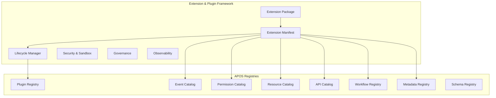
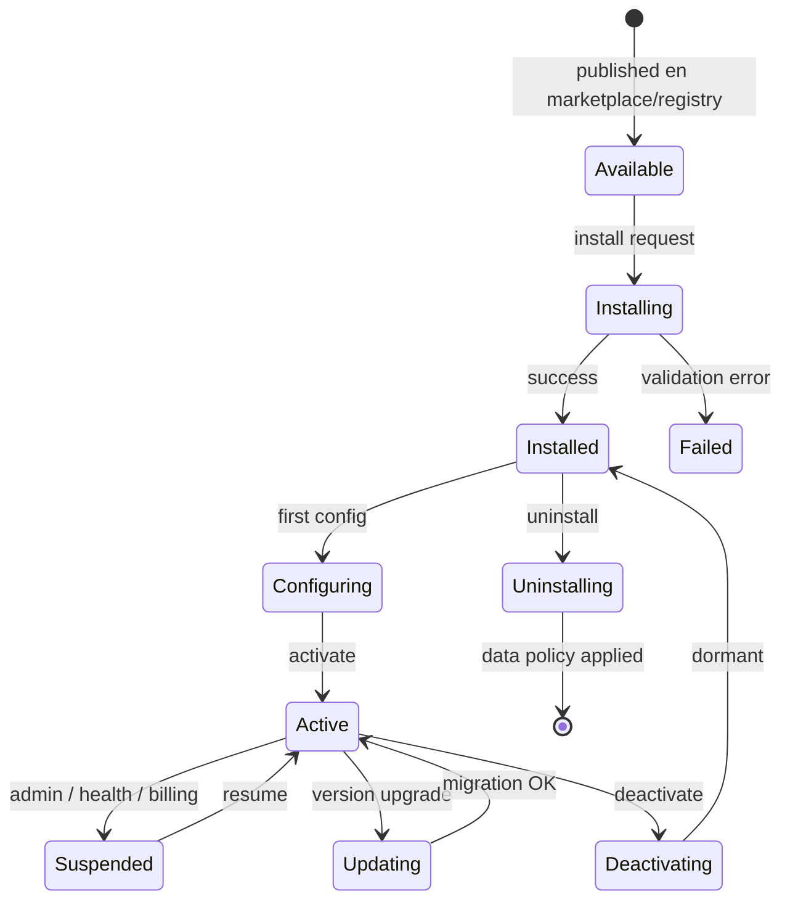

# AGROERP — Extension & Plugin Framework (EPF)

**Versión:** 1.0  
**Estado:** Oficial — Especificación del framework de extensiones y plugins  
**Audiencia:** Arquitectura, plataforma, integradores, partners, seguridad, auditoría, producto  
**Naturaleza:** Infraestructura transversal del OS — **no es un módulo funcional de negocio**

---

## 0. Propósito y autoridad

El **Extension & Plugin Framework (EPF)** es la **plataforma base que permite extender AGROERP sin modificar su núcleo**: módulos de negocio, integraciones, capacidades UI, workflows, reglas, agentes IA, datos, APIs, reportes, móvil, GIS y documentos. Habilita **evolución ilimitada** del sistema mediante extensiones desacopladas, versionadas, instalables y auditables.

| Pregunta | Documento que responde |
|----------|------------------------|
| ¿Qué es el kernel y los registros OS? | `APOS.md` |
| ¿Constitución técnica implementación? | `AEPS.md` |
| ¿Metadata y schemas extensibles? | Metadata Engine, `DATA_GOVERNANCE_PLATFORM.md` |
| ¿Gobierno, auditoría y compliance? | `GOVERNANCE_ENTERPRISE_CONTROL_LAYER.md` |
| ¿Datos analíticos y KPIs? | `DATA_PLATFORM_ANALYTICS_LAYER.md` |
| ¿Integración ecosistema externo? | `INTEGRATION_ECOSYSTEM_LAYER.md` |
| ¿Motores dominio como plugins? | Specs `agro.coffee.*` en cada motor |
| **¿Cómo se extiende AGROERP de forma gobernada?** | **Este documento (EPF)** |

### Jerarquía documental

```
APOS.md                                    → OS, Plugin Registry, 12 registros
EXTENSION_PLUGIN_FRAMEWORK.md              → Framework extensión (EPF) — este documento
AEPS.md                                    → Implementación técnica
Motores / plataformas (PRM, CPE, AIADP…)  → Extension Packages de referencia
```

**Regla de oro:** El **Core nunca se modifica** para requisitos de negocio nuevos. Todo se resuelve mediante **Extension Package** registrado en EPF y validado contra APOS Registries. El kernel solo evoluciona por capacidades de plataforma transversales.

### Principios inviolables

| # | Principio | Descripción |
|---|-----------|-------------|
| E1 | **Core immutable for business** | Negocio = extensiones |
| E2 | **Decoupled by contract** | Manifest + extension points; no imports directos cross-plugin |
| E3 | **Versioned everything** | Semver extension + compat matrix platform |
| E4 | **Installable / uninstallable** | Lifecycle completo por organización |
| E5 | **Secure by default** | Sandbox, permisos declarativos, audit |
| E6 | **Metadata-first data** | Campos nuevos sin ALTER tabla base |
| E7 | **Event-native** | Extensiones escuchan y emiten vía Event Catalog |
| E8 | **Observable** | Logs, métricas, trazas por extensión |
| E9 | **Tenant isolated** | Datos y config por `organizationId` |
| E10 | **Marketplace-ready** | Mismo contrato interno, certificado y terceros |

### Alcance

| Incluye | No incluye |
|---------|------------|
| Extension Package, Manifest, lifecycle | UI marketplace storefront |
| 12 tipos de extensión | Implementación runtime código |
| Seguridad, sandbox, permisos | Lógica negocio café/cacao |
| Modelo datos extensible | Migraciones SQL detalle |
| Event / workflow / UI extension points | |
| Governance y observabilidad | |
| Base marketplace futuro | |

---

## 1. Visión y relación con APOS

### 1.1 Visión

EPF es el **sistema de extensibilidad empresarial** de AGROERP — comparable en espíritu a:

| Referencia | Capacidad análoga |
|------------|-------------------|
| Salesforce Lightning / AppExchange | Paquetes + marketplace |
| SAP Business Technology Platform | Extensiones sin core touch |
| WordPress Plugin API | Hooks + lifecycle |
| VS Code Extension Manifest | Declarativo + sandbox |
| Kubernetes CRDs + operators | Recursos extensibles |
| OSGi bundles | Dependencias + lifecycle |

### 1.2 EPF vs APOS Plugin Registry

| Capa | Responsabilidad |
|------|-----------------|
| **APOS Plugin Registry** (§3.2.4) | Registro runtime en boot; índice activo |
| **EPF** | Contrato completo: tipos extensión, seguridad, datos, marketplace, governance |
| **12 Registros APOS** | Destino de artefactos declarados en manifest |



---

## 2. Tipos de extensiones

### 2.1 Taxonomía

| Tipo | Código | Descripción | Ejemplo |
|------|--------|-------------|---------|
| **Business Module** | `business_module` | Dominio agrícola completo | `agro.cacao.procurement` |
| **UI Extension** | `ui_extension` | Widgets, dashboards, paneles | Panel OCC custom |
| **Workflow Extension** | `workflow_extension` | Pasos, definiciones nuevas | Aprobación exportación |
| **Rule Extension** | `rule_extension` | Reglas BRE / DVE pack | Descuentos país X |
| **AI Agent Extension** | `ai_agent_extension` | Agente AIADP custom | Agente certificadora |
| **Data Model Extension** | `data_model_extension` | Campos, entidades metadata | Campo custom productor |
| **API Extension** | `api_extension` | Rutas REST adicionales | Webhook partner |
| **Integration Extension** | `integration_extension` | Conectores externos | SAP, Siigo, clima API |
| **Report Extension** | `report_extension` | Definiciones reporte | KPI custom gerencia |
| **Mobile Extension** | `mobile_extension` | Features offline Android | Módulo cacao campo |
| **GIS Extension** | `gis_extension` | Capas, estilos, geocercas | Capa cuencas |
| **Document Extension** | `document_extension` | Plantillas EDMKP | Recibo cacao |

Un **Extension Package** puede declarar **múltiples tipos** en un solo manifest (ej. business_module + api_extension + report_extension).

### 2.2 Extension Point (punto de extensión del core)

El core publica **extension points** estables — hooks donde las extensiones se enganchan sin modificar código kernel.

| Extension Point | ID | Capacidad |
|-----------------|-----|-----------|
| Post-resource-create | `core.resource.afterCreate` | Handler evento |
| Pre-purchase-validate | `coffee.procurement.beforeValidate` | Regla / handler |
| Dashboard widget slot | `occ.dashboard.widgets` | UI component ref |
| Workflow step injector | `workflow.definition.extend` | Paso adicional |
| Settlement line calculator | `coffee.settlement.calculateLine` | Función declarada |
| Mobile sync entity | `sync.entities.register` | Entidad offline |
| GIS layer provider | `gis.layers.register` | Capa temática |
| Document template slot | `edmkp.templates.register` | Plantilla PDF |
| AI agent registry | `aiadp.agents.register` | Agente |
| Report catalog | `reporting.definitions.register` | Reporte |

**Regla:** Nuevos extension points del core requieren ADR + versión platform minor.

---

## 3. Arquitectura de extensión

### 3.1 Extension Package

Unidad distribuible de extensión.

| Atributo | Descripción |
|----------|-------------|
| `packageId` | UUID interno |
| `packageKey` | `agro.coffee.procurement` — único global |
| `displayName` | |
| `description` | |
| `vendor` | `agroerp`, `partner.acme`, `org.custom` |
| `packageTypes` | Array tipos §2.1 |
| `currentVersion` | Semver |
| `manifestUri` | Ubicación manifest |
| `artifactUri` | Bundle (futuro marketplace) |
| `signature` | Firma publisher |
| `certificationLevel` | `official`, `certified`, `community`, `private` |
| `status` | `draft`, `published`, `deprecated`, `revoked` |
| `createdAt` | |

### 3.2 Extension Manifest

Contrato declarativo — corazón del EPF.

```yaml
apiVersion: agroerp.platform/v1
kind: ExtensionPackage
metadata:
  id: agro.cacao.procurement
  version: 1.2.0
  displayName: Cacao Procurement Module
  vendor: agroerp
  certificationLevel: official
spec:
  requiresPlatform: ">=1.0.0 <2.0.0"
  commodity: cacao
  dependencies:
    - id: agro.core.procurement
      version: "^1.0.0"
    - id: agro.core.producer_relationship
      version: "^1.0.0"
  conflicts:
    - id: agro.legacy.cacao.v0
  permissions:
    - code: cacao.procurement:execute
      description: Execute cacao purchase
  resourceTypes:
    - cacao.procurement_session
    - cacao.purchase
  events:
    publishes:
      - cacao.procurement.PurchaseConfirmed
    subscribes:
      - producer.relationship.ProducerActivated
  apiRoutes:
    - path: /api/v1/cacao/purchases
      permissions: [cacao.procurement:read]
  workflows:
    - workflowKey: cacao.purchase.approval
  extensionPoints:
    - pointId: core.resource.afterCreate
      handler: handlers/onResourceCreated
  dataExtensions:
    - entityType: producer
      fields:
        - key: cacao_association_id
          type: string
  uiExtensions:
    - slotId: occ.dashboard.widgets
      componentRef: widgets/cacao-kpi
  mobileExtensions:
    - syncEntities: [cacao.purchase]
      offlineCapable: true
  gisExtensions:
    - layerCode: cacao.farms
  documentExtensions:
  - templateCode: cacao.purchase.receipt
  aiExtensions:
    - agentCode: agent.cacao.buyer
  configSchema:
    $ref: schemas/cacao-procurement-config.json
  migrations:
    - version: 1.2.0
      description: Add cacao quality fields
  healthCheck:
    endpoint: /health/ready
  sandbox:
    profile: standard_business
    resourceLimits:
      cpuMsecPerMin: 60000
      memoryMb: 512
```

### 3.3 Dependency System

| Atributo | Descripción |
|----------|-------------|
| `dependencyId` | |
| `requiredPackageKey` | |
| `versionRange` | semver range |
| `optional` | bool |
| `reason` | |

**Resolución:** Grafo dirigido acíclico (DAG). Ciclo → rechazo instalación.

| Regla | Descripción |
|-------|-------------|
| EPF-DEP-01 | `requiresPlatform` debe satisfacerse |
| EPF-DEP-02 | Dependencias obligatorias activas en org |
| EPF-DEP-03 | `conflicts` bloquea co-instalación |
| EPF-DEP-04 | Major version bump requiere migración explícita |

### 3.4 Versioning System

| Nivel | Esquema | Ejemplo |
|-------|---------|---------|
| Platform | Semver APOS | `1.4.0` |
| Extension | Semver package | `2.1.3` |
| Manifest API | `agroerp.platform/v1` | Breaking → v2 |
| Event payload | schemaVersion | Por Event Catalog |
| Resource schema | Por resourceType | Metadata Registry |

**Compatibility matrix:**

| Extension Δ | Platform compatible |
|-------------|---------------------|
| Patch | Misma major platform |
| Minor | Platform >= declarado |
| Major | Nuevo `requiresPlatform`; migración |

### 3.5 Compatibility Rules

| Código | Regla |
|--------|-------|
| EPF-CMP-01 | Manifest schema validado contra Schema Registry |
| EPF-CMP-02 | Eventos publicados pre-registrados o auto-register en staging |
| EPF-CMP-03 | Permisos no colisionan namespace reservado `core.*`, `platform.*` |
| EPF-CMP-04 | API routes no duplican path+method core sin version bump |
| EPF-CMP-05 | Extension breaking cambio → nuevo packageKey o major version |

### 3.6 Execution Context

Contexto aislado por invocación handler extensión.

| Campo | Descripción |
|-------|-------------|
| `contextId` | |
| `organizationId` | Tenant |
| `userId` | Actor |
| `packageKey` | |
| `packageVersion` | |
| `extensionPointId` | |
| `correlationId` | Trace |
| `permissions` | Subset concedidos |
| `sandboxProfile` | |
| `deadline` | Timeout |

**Invariante:** Handler no accede a `organizationId` distinto al del contexto.

### 3.7 Sandboxing

| Perfil | Uso | Límites |
|--------|-----|---------|
| `read_only` | Reportes, UI widgets | No mutación |
| `standard_business` | Módulos dominio | CPU/mem/time caps |
| `integration` | APIs externas | Network allowlist |
| `ai_extension` | Agentes AIADP | Token budget |
| `trusted_official` | Plugins agroerp firmados | Límites elevados |

| Aislamiento | Mecanismo |
|-------------|-----------|
| Datos | RLS tenant + scope package |
| Ejecución | Process/worker pool por tier |
| Red | Egress allowlist por integration extension |
| Storage | Prefix S3 `org/{id}/extensions/{packageKey}/` |

---

## 4. Ciclo de vida

### 4.1 Estados globales (package)

`draft` → `published` → `deprecated` → `revoked`

### 4.2 Estados por organización (installation)



### 4.3 ExtensionInstallation

| Atributo | Descripción |
|----------|-------------|
| `installationId` | UUID |
| `organizationId` | |
| `packageKey` | |
| `installedVersion` | |
| `status` | §4.2 |
| `installedAt` | |
| `installedBy` | |
| `activatedAt` | |
| `configuration` | JSON validado configSchema |
| `lastHealthCheck` | |
| `healthStatus` | `healthy`, `degraded`, `unhealthy` |
| `dataRetentionOnUninstall` | `purge`, `archive`, `retain` |

### 4.4 Operaciones del ciclo

| Operación | Descripción | Auditoría |
|-----------|-------------|-----------|
| **Instalación** | Resolver deps → validar manifest → registrar registros | `ExtensionInstalled` |
| **Activación** | Boot hooks → handlers live | `ExtensionActivated` |
| **Configuración** | Org settings contra configSchema | `ExtensionConfigured` |
| **Ejecución** | Handlers en extension points | Metrics + trace |
| **Actualización** | Semver upgrade + migrations | `ExtensionUpdated` |
| **Desactivación** | Stop handlers; data retained | `ExtensionSuspended` |
| **Desinstalación** | Unregister; data per policy | `ExtensionUninstalled` |
| **Migración datos** | Scripts declarados en manifest | `ExtensionMigrated` |

### 4.5 Boot hook (activación)

Secuencia al activar (extiende APOS §5.3):

1. Validar manifest + firma + certification
2. Registrar permisos → Permission Catalog
3. Registrar eventos → Event Catalog
4. Registrar resource types → Resource Catalog
5. Registrar API routes → API Catalog
6. Registrar workflows → Workflow Registry
7. Registrar metadata/schemas → Metadata / Schema Registry
8. Subscribe event handlers → Event Engine
9. Registrar UI slots → UI Extension Registry
10. Health check → Service Registry / Plugin Registry
11. Status `active`

---

## 5. Seguridad

### 5.1 ExtensionPermission

| Atributo | Descripción |
|----------|-------------|
| `permissionCode` | `packageKey:action` — ej. `cacao.procurement:execute` |
| `packageKey` | Declarante |
| `description` | |
| `riskLevel` | low, medium, high, critical |
| `requiresApproval` | Instalación org |

### 5.2 Modelo autorización

| Nivel | Mecanismo |
|-------|-----------|
| Por extensión | Org debe instalar + activar package |
| Por función | Identity RBAC `permissionCode` |
| Por dato | RLS + Resource scope |
| Por rol | Rol no obtiene permiso no declarado en manifest |

### 5.3 ExtensionSecurityPolicy

| Control | Descripción |
|---------|-------------|
| Firma publisher | Paquetes terceros |
| Certification gate | Prod solo `official` + `certified` configurable |
| Dependency audit | CVE scan artefacto |
| Behavior audit | Runtime anomaly detection |
| Secret management | Vault ref — nunca en manifest claro |
| PII access | Extension declare `piiAccess: true` → approval |

### 5.4 Auditoría

| Evento auditado |
|-----------------|
| Install / uninstall / activate / suspend |
| Config change |
| Permission grant denied |
| Handler exception |
| Resource limit exceeded |
| External API call integration ext |
| Data export por extensión |

Namespace: `platform.extension.*`

---

## 6. Modelo de datos extensible

### 6.1 Principios

| Principio | Implementación |
|-----------|----------------|
| Sin ALTER tabla base negocio | Metadata Engine `attributes` JSONB |
| Nuevas entidades | Resource Engine `resourceType` declarado en manifest |
| Relaciones dinámicas | `ContentRelationship` pattern / Resource links |
| Metamodelo | Schema Registry versionado |
| Validación | DVE rules pack por extension |

### 6.2 DataExtensionDeclaration

| Atributo | Descripción |
|----------|-------------|
| `entityType` | producer, farm, purchase… |
| `fieldKey` | |
| `fieldType` | string, number, date, ref, enum |
| `enumCatalogKey` | MDM opcional |
| `required` | |
| `indexed` | GIN si búsqueda |
| `packageKey` | Propietario |
| `version` | |

### 6.3 DynamicEntityDeclaration

Para entidades nuevas vía Resource Engine:

| Atributo | Descripción |
|----------|-------------|
| `resourceType` | `cacao.fermentation_batch` |
| `schemaRef` | Schema Registry |
| `relationships` | Array FK lógicas |
| `tenantScoped` | true |

### 6.4 Uninstall data policy

| Política | Comportamiento |
|----------|----------------|
| `purge` | Eliminar datos extensión (soft delete) |
| `archive` | Export EDMKP + marcar readonly |
| `retain` | Datos permanecen; extensión inactiva |

---

## 7. Event System

### 7.1 Capacidades extensión

| Capacidad | Descripción |
|-----------|-------------|
| **Escuchar** | `subscribes` en manifest → consumer group |
| **Emitir** | `publishes` — eventos catalogados |
| **Transformar** | Handler middleware `event.transform.*` (avanzado) |
| **Encadenar** | Automation AIADP + extension handlers |
| **Flujos automáticos** | Event → Workflow trigger / AUE |

### 7.2 ExtensionEventSubscription

| Atributo | Descripción |
|----------|-------------|
| `subscriptionId` | |
| `packageKey` | |
| `eventType` | Del Event Catalog |
| `filter` | JSON opcional |
| `handlerRef` | |
| `priority` | |
| `idempotent` | bool |
| `status` | active, paused |

### 7.3 Reglas eventos

| Regla | Descripción |
|-------|-------------|
| EPF-EVT-01 | No publicar evento no declarado en manifest (prod) |
| EPF-EVT-02 | Payload validado contra schemaVersion |
| EPF-EVT-03 | Handler failure → DLQ + alert; no bloquear publisher |
| EPF-EVT-04 | Cross-org event leakage prohibido |

---

## 8. Workflow integration

### 8.1 Modos extensión workflow

| Modo | Descripción |
|------|-------------|
| **Nuevo workflow** | `workflowKey` propio en manifest |
| **Extensión paso** | Inject step en workflow core vía extension point |
| **Interceptor** | Pre/post transition hook |
| **Aprobador dinámico** | Rule extension asigna rol |

### 8.2 WorkflowExtensionDeclaration

| Atributo | Descripción |
|----------|-------------|
| `workflowKey` | |
| `extendsWorkflowKey` | Opcional — base core |
| `injectedSteps` | JSON BPMN fragment |
| `triggerEvents` | |
| `packageKey` | |

**Regla:** No se modifica definición workflow core publicada — solo **nueva versión** o **extension overlay** versionado.

---

## 9. UI extensibility

### 9.1 UIExtensionDeclaration

| Atributo | Descripción |
|----------|-------------|
| `slotId` | Extension point UI |
| `componentRef` | Bundle ref |
| `displayName` | |
| `requiredPermission` | |
| `platforms` | web, android, occ |
| `configSchema` | Widget config |

### 9.2 Capacidades

| Capacidad | Descripción |
|-----------|-------------|
| **Widgets dinámicos** | Slots dashboard OCC, home módulo |
| **Dashboards configurables** | Composición widgets registry |
| **Paneles embebidos** | iframe / native component ref |
| **Componentes reutilizables** | Shared UI library extensions |
| **Móvil** | Android feature modules vía mobile extension |

**Nota:** EPF define contrato y slots; implementación render en clients — fuera alcance spec.

---

## 10. Marketplace (base futuro)

### 10.1 MarketplaceListing

| Atributo | Descripción |
|----------|-------------|
| `listingId` | |
| `packageKey` | |
| `visibility` | `public`, `private_org`, `partner_channel` |
| `certificationLevel` | |
| `pricingModel` | free, subscription, perpetual |
| `publisherId` | |
| `rating` | |
| `installCount` | |
| `screenshots` | EDMKP refs |
| `documentationUrl` | |

### 10.2 Categorías marketplace

| Categoría | Ejemplos |
|-----------|----------|
| **Oficial AGROERP** | Coffee, Cacao modules |
| **Certificados partners** | Integración ERP, clima |
| **Privados empresa** | Extension custom org |
| **Comunitarios** | Sandbox; no prod default |

### 10.3 Proceso certificación

```
Submit package → Security scan → Review manifest
    → QA sandbox → Certified badge → Publish listing
```

---

## 11. AI extensions (AIADP integration)

### 11.1 AIExtensionDeclaration

| Atributo | Descripción |
|----------|-------------|
| `agentCode` | |
| `modelProfileRef` | Opcional |
| `promptTemplates` | Array versioned |
| `allowedTools` | Subset AIADP tools |
| `trainingDataScope` | org, commodity |
| `packageKey` | |

### 11.2 Capacidades

| Capacidad | Descripción |
|-----------|-------------|
| Agentes personalizados | Nuevo IntelligenceAgent |
| Modelos especializados | Model Registry plug-in |
| Prompts configurables | Template por org |
| Automatizaciones | AUE pack en extension |
| Entrenamiento interno | DGMP certified data only |

---

## 12. Governance

### 12.1 ExtensionGovernanceWorkflow

| Etapa | Actor |
|-------|-------|
| Desarrollo | Partner / org |
| Security review | Platform security |
| Architecture review | Enterprise architect |
| Staging deploy | CI/CD |
| Approval prod | Platform admin / org admin |
| Monitor | Observability + audit |

### 12.2 Resource governance

| Límite | Default |
|--------|---------|
| CPU por extensión | Por sandbox profile |
| Event handlers / min | 10k |
| Storage por org ext | Configurable |
| API rate extension | Por route |
| Concurrent installs | 500 per org |

### 12.3 Official vs custom

| Nivel | Quién publica | Dónde corre |
|-------|---------------|-------------|
| `official` | AGROERP team | Bundled platform |
| `certified` | Partners aprobados | Marketplace |
| `private` | Tenant | Org only |
| `community` | Terceros | Staging / opt-in |

---

## 13. Observabilidad

### 13.1 ExtensionTelemetry

| Señal | Contenido |
|-------|-----------|
| **Logs** | `packageKey`, `contextId`, level |
| **Métricas** | Invocations, latency, errors, quota |
| **Trazas** | OpenTelemetry span `extension.*` |
| **Auditoría** | Security events §5.4 |
| **Uso** | Installs, active orgs, feature adoption |

### 13.2 Health

| Check | Frecuencia |
|-------|------------|
| Handler heartbeat | 1 min |
| Dependency satisfaction | On activate + daily |
| Schema drift | On metadata publish |
| Quota headroom | Realtime |

Métrica APOS: `agro_plugin_health{pluginId, status}` — alimentada por EPF.

---

## 14. Escalabilidad

| Dimensión | Estrategia |
|-----------|------------|
| Miles de extensiones | Registry indexado; lazy load handlers |
| Multi-empresa | Installation per org; config aislada |
| Multi-dominio agrícola | Commodity packages paralelos |
| Alta concurrencia | Worker pools; async events |
| Offline / sync | Mobile extension declara entities; Sync Foundation |
| Distribución | CDN artifacts; regional storage |

---

## 15. Extensiones de referencia (motores documentados)

| Package Key | Tipo | Documento |
|-------------|------|-----------|
| `agro.coffee.procurement` | business_module | CPE |
| `agro.coffee.supply_agreement` | business_module | CSAE |
| `agro.coffee.quality_intelligence` | business_module | CQIE |
| `agro.coffee.inventory_traceability` | business_module | CITE |
| `agro.coffee.settlement_financial` | business_module | CSFE |
| `agro.coffee.logistics_supply_chain` | business_module | CLSE |
| `agro.coffee.producer_relationship` | business_module | PRM |
| `agro.coffee.territory_intelligence` | business_module | FTIP |
| `agro.coffee.agronomic_intelligence` | business_module | AITAP |
| `agro.core.intelligence` | ai_agent_extension | AIADP |
| `agro.core.documents` | document_extension | EDMKP |

Patrón cacao futuro: `agro.cacao.*` mismo contrato EPF.

---

## 16. Reportes plataforma

| ID | Reporte |
|----|---------|
| EPF-RPT-01 | Extensiones instaladas por org |
| EPF-RPT-02 | Versiones activas vs disponibles |
| EPF-RPT-03 | Health status extensions |
| EPF-RPT-04 | Permisos concedidos por extensión |
| EPF-RPT-05 | Errores handler por package |
| EPF-RPT-06 | Uso recursos (CPU, storage) |
| EPF-RPT-07 | Auditoría install/uninstall |
| EPF-RPT-08 | Marketplace installs (futuro) |

---

## 17. KPIs

| KPI | Definición |
|-----|------------|
| **Extensiones activas** | Count org |
| **Tiempo install→active** | Promedio |
| **Health SLA** | % healthy checks |
| **Handler error rate** | Errors / invocations |
| **Core modification rate** | Debe → 0 negocio |
| **Certified adoption** | % installs certified+official |
| **Migration success** | % upgrades sin rollback |

---

## 18. Alertas

| ID | Alerta |
|----|--------|
| EPF-ALT-01 | Extension health unhealthy |
| EPF-ALT-02 | Handler error rate > umbral |
| EPF-ALT-03 | Resource quota exceeded |
| EPF-ALT-04 | Unsigned package install attempt |
| EPF-ALT-05 | Dependency conflict detectado |
| EPF-ALT-06 | Deprecated extension en prod |
| EPF-ALT-07 | Event publish no catalogado |
| EPF-ALT-08 | Migration failed |

---

## 19. Riesgos

| Categoría | Riesgo | Mitigación |
|-----------|--------|------------|
| Arquitectura | Core creep | Governance + E1 |
| Seguridad | Plugin malicioso | Sandbox + certificación |
| Operativo | Dependency hell | DAG resolver |
| Datos | Uninstall data loss | Policy retain/archive |
| Performance | Handler lento | Quotas + circuit breaker |
| Legal | Tercero accede PII | Permission declare + audit |

---

## 20. Roadmap evolutivo

| Fase | Entregables |
|------|-------------|
| **F1 — Manifest + Registry** | Extension Manifest v1, Plugin Registry integration |
| **F2 — Lifecycle** | Install, activate, suspend, uninstall |
| **F3 — Security** | Permissions, sandbox basic |
| **F4 — Events** | Subscribe/publish handlers |
| **F5 — Data extensions** | Metadata field declarations |
| **F6 — Workflow / UI points** | Extension points registry |
| **F7 — Observability** | Metrics, audit |
| **F8 — Marketplace MVP** | Private + official catalog |
| **F9 — Partner certification** | Security pipeline |
| **F10 — Mobile / offline packs** | Mobile extension type |

---

## 21. Checklist cumplimiento

- [ ] Ningún requisito negocio modifica core
- [ ] Todo dominio nuevo = Extension Package
- [ ] Manifest validado contra Schema Registry
- [ ] Dependencias DAG sin ciclos
- [ ] Permisos declarados antes de activar
- [ ] Eventos en Event Catalog
- [ ] RLS tenant en handlers
- [ ] Auditoría lifecycle completa
- [ ] Health check por extensión
- [ ] Uninstall data policy explícita
- [ ] Observabilidad logs/metrics/traces
- [ ] Motores documentados registran `pluginId` APOS

---

## 22. Conclusión

El **Extension & Plugin Framework (EPF)** es el **sistema que permite la evolución infinita de AGROERP**. Proporciona:

- **12 tipos de extensiones** — business, UI, workflow, rules, AI, data, API, integration, report, mobile, GIS, document
- **Extension Package + Manifest** declarativo completo
- **Dependency, versioning y compatibility** enterprise-grade
- **Lifecycle** install → activate → configure → update → deactivate → uninstall + migración
- **Seguridad** — permisos, sandbox, aislamiento, auditoría
- **Modelo datos extensible** metadata-driven sin tocar core tables
- **Event, workflow y UI** extension points
- **Base marketplace** — oficial, certificado, privado, comunitario
- **AI extensions** integradas AIADP
- **Governance y observabilidad** completas
- **Escalabilidad** a miles de extensiones y tenants

**El Core permanece inmutable; el negocio crece por extensiones.**

---

*Documento elaborado para AGROERP — Extension & Plugin Framework v1.0.*  
*Implementación runtime:* APOS Plugin Registry (§3.2.4) + 12 Registros  
*Próximo paso recomendado:* Fase F1 — Extension Manifest schema v1 + validación boot integrada Plugin Registry.
