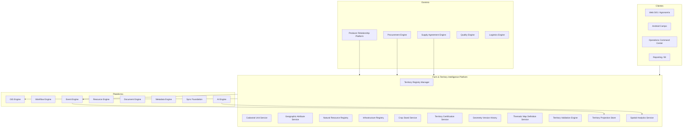
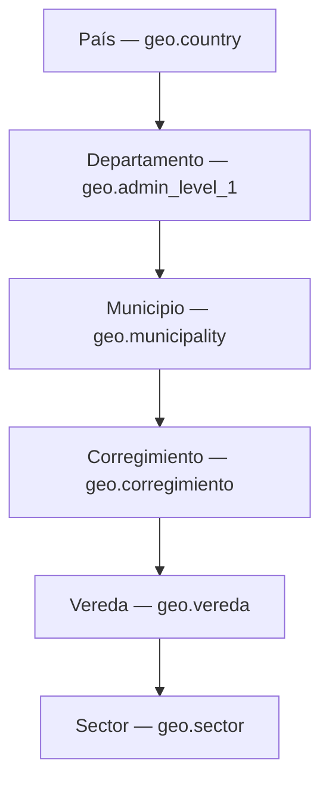
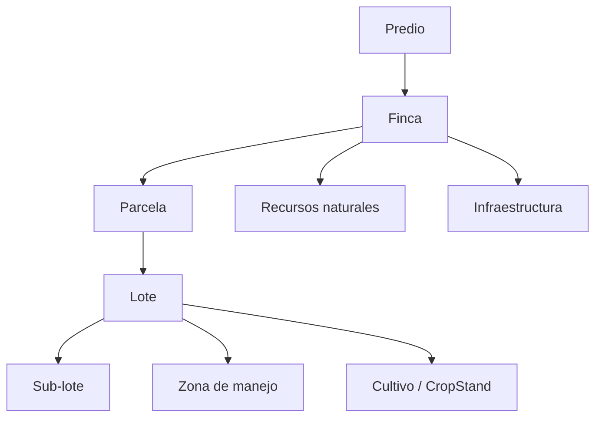
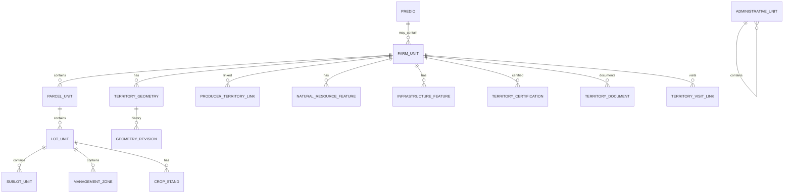

# AGROERP — Farm & Territory Intelligence Platform (FTIP)

**Versión:** 1.0  
**Estado:** Oficial — Especificación de la plataforma de inteligencia territorial y catastro agrícola  
**Audiencia:** Extensionismo, agronomía, SIG, certificación, comercial, arquitectura, auditoría, legal  
**Naturaleza:** Plataforma empresarial de dominio — **no es un módulo de fincas, un mapa ni un SIG tradicional**

---

## 0. Propósito y autoridad

El **Farm & Territory Intelligence Platform (FTIP)** administra **digitalmente todo el territorio agrícola** de AGROERP: jerarquía administrativa, predios, fincas, parcelas, lotes, recursos naturales, infraestructura, cultivos, certificaciones territoriales, historial geométrico y análisis espacial. Es la **referencia geográfica oficial** de la plataforma.

| Pregunta | Documento que responde |
|----------|------------------------|
| ¿Qué procesos territoriales existen? | `COFFEE_DOMAIN.md` (CDP §2, §4.1–4.2) |
| ¿Catálogos geografía y agronomía? | `MASTER_DATA_ENGINE.md` (`geo.*`, `farm.*`) |
| ¿Golden record y lineage geográfico? | `DATA_GOVERNANCE_PLATFORM.md` |
| ¿Relación empresa ↔ productor? | `PRODUCER_RELATIONSHIP_MANAGEMENT_PLATFORM.md` (PRM) |
| ¿Operaciones espaciales (distancia, buffer, capas)? | **GIS Engine** (plataforma) |
| ¿Satélite, NDVI y remote sensing? | `INTEGRATION_ECOSYSTEM_LAYER.md` (IEL) |
| **¿Cuál es el modelo territorial autoritativo y su inteligencia?** | **Este documento (FTIP)** |

### Jerarquía documental

```
MASTER_DATA_ENGINE.md                         → Catálogos geo.*, farm.*
DATA_GOVERNANCE_PLATFORM.md                 → Golden record, lineage geometría
FARM_TERRITORY_INTELLIGENCE_PLATFORM.md       → Territorio agrícola 360° (FTIP)
PRODUCER_RELATIONSHIP_MANAGEMENT_PLATFORM.md  → Vinculación productor ↔ finca (PRM)
GIS Engine (plataforma)                       → Servicios espaciales compartidos
COFFEE_DOMAIN.md                              → Dominio cafetero
AEPS.md                                       → Implementación técnica
```

**Regla de oro:** Toda **geometría de territorio agrícola** (polígono finca, lote, recurso natural, infraestructura) tiene **una sola fuente autoritativa: FTIP**. El GIS Engine **ejecuta** operaciones espaciales; el FTIP **posee** el modelo territorial y su historial. El PRM **vincula** productores a unidades FTIP; no duplica polígonos.

### Distinción crítica

| Sistema | Responsabilidad |
|---------|-----------------|
| **Google Maps / mapa genérico** | Visualización base |
| **GIS tradicional (ArcGIS standalone)** | Herramienta cartográfica desconectada |
| **GIS Engine** | Servicio plataforma: capas, medición, geocerca, tiles |
| **FTIP** | Catastro agrícola, territorio, cultivos, recursos, historial geo |
| **PRM** | Relación productor; referencia `ftipFarmUnitId` |
| **CITE** | Lote **inventario** bodega (distinto de lote territorial) |

### Principios inviolables

| # | Principio | Descripción |
|---|-----------|-------------|
| T1 | **Territory as first-class entity** | Territorio modelado con identidad, estado y lineage |
| T2 | **Geometry versioned** | Toda modificación geo → `TerritoryGeometryRevision` inmutable |
| T3 | **Hierarchy composable** | País → … → finca → parcela → lote → sub-lote |
| T4 | **Single source of polygons** | Un polígono activo por unidad territorial vigente |
| T5 | **GIS Engine for spatial ops** | FTIP no reimplementa buffer/intersect/area |
| T6 | **Administrative + agronomic** | División política MDM + unidades productivas FTIP |
| T7 | **Natural resources mapped** | Agua, bosque, reserva como features georreferenciados |
| T8 | **Certification spatial scope** | Certificación con alcance geométrico auditable |
| T9 | **Offline capture ready** | Polígonos campo con sync e idempotencia |
| T10 | **Commodity-extensible** | Core territorial; café = primera implementación |

### Alcance

| Incluye | No incluye |
|---------|------------|
| Modelo territorial jerárquico completo | UI mapa / editor polígonos |
| Catastro finca, parcela, lote | Lifecycle productor (PRM) |
| Recursos naturales e infraestructura | Compra y liquidación (CPE/CSFE) |
| Cultivos territoriales y historial | Inventario bodega (CITE) |
| Historial geométrico auditable | Renderizado tiles (GIS Engine) |
| Certificaciones con scope espacial | Dictamen laboratorio (CQIE) |
| KPIs y mapas temáticos (definición) | Teledetección procesamiento raster (AI Engine ejecuta) |
| Integración visitas y documentos | |

---

## 1. Visión y arquitectura funcional

### 1.1 Visión

El FTIP es el **catastro agrícola inteligente** de AGROERP — comparable en espíritu a:

| Referencia | Capacidad análoga |
|------------|-------------------|
| FAO Land Administration | Parcelas, tenencia, uso suelo |
| Esri Land Records / ArcGIS Parcel | Cadastro predial |
| Registro cafetero nacional (FNC, ICA) | Finca georreferenciada |
| Digital farm twin platforms | Gemelo digital territorial |
| EUDR traceability geolocation | Polígono origen exportación |
| Agroforestry GIS systems | Recursos naturales + cultivo |

### 1.2 Arquitectura conceptual



### 1.3 Componentes lógicos

| Componente | Responsabilidad |
|------------|-----------------|
| **Territory Registry Manager (TRM)** | Jerarquía administrativa y unidades territoriales |
| **Cadastral Unit Service (CAD)** | Predio, finca, parcela, lote, sub-lote |
| **Geographic Attribute Service (GEO)** | Suelo, clima, pendiente, orientación, cobertura |
| **Natural Resource Registry (NAT)** | Agua, bosque, reserva, biodiversidad, sombra |
| **Infrastructure Registry (INF)** | Beneficio, secadero, vivienda, vías, acopio |
| **Crop Stand Service (CRP)** | Cultivos, variedades, edad, densidad, historial |
| **Territory Certification Service (CRT)** | Certificaciones con alcance espacial |
| **Geometry Version History (GVH)** | Auditoría antes/después de geometrías |
| **Thematic Map Definition Service (THM)** | Definición mapas temáticos y capas FTIP |
| **Territory Validation Engine (VAL)** | Topología, superposición, políticas org |
| **Territory Projection Store (PRJ)** | Vistas materializadas KPIs territoriales |
| **Spatial Analytics Service (ANA)** | Agregaciones espaciales vía GIS Engine |

### 1.4 FTIP vs GIS Engine vs PRM

| Capa | FTIP | GIS Engine | PRM |
|------|------|------------|-----|
| Modelo finca/lote | ✓ Autoritativo | | Referencia |
| Polígono activo | ✓ Almacena | Valida/calcula | |
| Productor titular | Asociación | | ✓ Relación |
| Distancia punto-polígono | Solicita | ✓ Ejecuta | |
| Capas mapa base | Define temáticos | ✓ Renderiza | |
| Visita en finca | Registra geo | Geocerca | Orquesta visita |
| Historial geometría | ✓ GVH | | |

---

## 2. Modelo territorial jerárquico

### 2.1 Jerarquía administrativa (referencia MDM)



| Nivel | Entidad FTIP | Catálogo MDM | Geometría |
|-------|--------------|--------------|-----------|
| País | `AdministrativeUnit` | `geo.country` | Opcional límite país |
| Departamento | `AdministrativeUnit` | `geo.admin_level_1` | Opcional |
| Municipio | `AdministrativeUnit` | `geo.municipality` | Opcional |
| Corregimiento | `AdministrativeUnit` | `geo.corregimiento` | Opcional |
| Vereda | `AdministrativeUnit` | `geo.vereda` | Recomendado polígono |
| Sector | `AdministrativeUnit` | `geo.sector` | Opcional |

**Nota:** Los límites administrativos se sincronizan desde MDM; FTIP puede almacenar geometría de referencia para superposición y reportes.

### 2.2 Jerarquía agrícola / catastral



| Nivel | Descripción | Uso típico |
|-------|-------------|------------|
| **Predio** | Unidad legal catastral (matrícula, escritura) | Tenencia, legal |
| **Finca** | Unidad operativa agrícola | Productor, certificación, compra |
| **Parcela** | Subdivisión administrativa dentro finca | Múltiples predios fusionados |
| **Lote** | Unidad productiva homogénea | Variedad, edad, manejo |
| **Sub-lote** | Subdivisión temporal o experimental | Ensayos, renovación parcial |
| **Zona de manejo** | Área manejo diferenciado (suelo, pendiente) | Agronomía de precisión |

---

## 3. Modelo de entidades

### 3.1 Diagrama agregados



### 3.2 AdministrativeUnit (unidad administrativa)

| Atributo | Descripción |
|----------|-------------|
| `adminUnitId` | UUID |
| `organizationId` | Null si catálogo global MDM |
| `level` | `country`, `department`, `municipality`, `corregimiento`, `vereda`, `sector` |
| `catalogKey` | `geo.*` referencia |
| `catalogItemCode` | Código ítem MDM |
| `name` | |
| `parentAdminUnitId` | Jerarquía |
| `boundaryGeo` | MultiPolygon opcional |
| `centroidGeo` | Point |
| `externalCodes` | DANE, ISO, etc. |
| `status` | `active`, `deprecated` |

### 3.3 Predio (unidad legal)

| Atributo | Descripción |
|----------|-------------|
| `predioId` | UUID |
| `organizationId` | |
| `predioCode` | Código catastral interno |
| `cadastralNumber` | Matrícula inmobiliaria |
| `legalName` | Denominación registro |
| `tenureTypeCode` | `farm.tenure_type` |
| `ownerPartyIds` | Propietarios (persona/jurídica) |
| `adminUnitIds` | Ref vereda/municipio |
| `boundaryGeo` | Polygon predio |
| `areaHa` | Calculado GIS |
| `perimeterM` | Calculado GIS |
| `altitudeMinM` / `altitudeMaxM` | DEM |
| `registrationDocumentId` | Escritura |
| `status` | `active`, `disputed`, `inactive` |
| `registeredAt` | |
| `notes` | |

### 3.4 FarmUnit (finca)

Unidad operativa central del FTIP.

| Atributo | Descripción |
|----------|-------------|
| `farmUnitId` | UUID |
| `organizationId` | |
| `farmCode` | Único por org |
| `farmName` | |
| `predioIds` | Uno o más predios |
| `farmTypeCode` | `farm.type` |
| `productionSystemCode` | `farm.production_system` |
| `adminUnitId` | Vereda primaria |
| `centroidGeo` | Point |
| `boundaryGeo` | Polygon perímetro finca |
| `activeGeometryId` | Ref `TerritoryGeometry` vigente |
| `totalAreaHa` | |
| `agriculturalAreaHa` | |
| `forestAreaHa` | |
| `protectedAreaHa` | |
| `infrastructureAreaHa` | |
| `altitudeMinM` / `altitudeMaxM` | |
| `avgSlopePct` | |
| `dominantAspectCode` | N, NE, E… |
| `soilTypeCode` | `territory.soil_type` |
| `landUseCode` | `territory.land_use` |
| `landCoverCode` | `territory.land_cover` |
| `climateZoneCode` | `territory.climate_zone` |
| `status` | `draft`, `under_validation`, `active`, `inactive`, `abandoned` |
| `photoUrls` | |
| `videoUrls` | |
| `historySummary` | JSON hitos |
| `observations` | |
| `registeredAt` | |
| `lastGeometryChangeAt` | |
| `lastVisitAt` | |
| `metadata` | Extensible |

### 3.5 ProducerTerritoryLink (vinculación productor)

Puente FTIP ↔ PRM — el PRM no duplica geometría.

| Atributo | Descripción |
|----------|-------------|
| `linkId` | UUID |
| `farmUnitId` | |
| `producerId` | PRM |
| `relationshipType` | `owner`, `operator`, `tenant`, `associated`, `family_member` |
| `isPrimary` | Productor principal compra |
| `effectiveFrom` | |
| `effectiveUntil` | |
| `sharePct` | Participación |
| `status` | `active`, `ended` |
| `documentId` | Contrato arrendamiento, etc. |

### 3.6 ParcelUnit (parcela)

| Atributo | Descripción |
|----------|-------------|
| `parcelId` | UUID |
| `farmUnitId` | |
| `parcelCode` | |
| `parcelName` | |
| `boundaryGeo` | Polygon independiente |
| `areaHa` | |
| `parentParcelId` | Subdivisión |
| `predioId` | Si parcela = predio completo |
| `status` | |
| `subdivisionHistory` | Ref revisiones |
| `notes` | |

### 3.7 LotUnit (lote territorial)

Distinto de **lote inventario CITE** y alineado con `FarmPlot` PRM vía `ftipLotUnitId`.

| Atributo | Descripción |
|----------|-------------|
| `lotUnitId` | UUID |
| `parcelId` | Padre parcela (o farm directo) |
| `farmUnitId` | |
| `lotCode` | |
| `lotName` | |
| `lotTypeCode` | `farm.lot_type` |
| `boundaryGeo` | Polygon |
| `areaHa` | |
| `perimeterM` | |
| `altitudeM` | Promedio lote |
| `slopePct` | |
| `aspectCode` | Orientación |
| `soilTypeCode` | Puede diferir de finca |
| `managementZoneId` | Opcional |
| `status` | `productive`, `renovation`, `reserve`, `fallow`, `abandoned` |
| `parentLotId` | Subdivisión origen |
| `notes` | |

### 3.8 SubLotUnit (sub-lote)

| Atributo | Descripción |
|----------|-------------|
| `subLotId` | UUID |
| `lotUnitId` | |
| `subLotCode` | |
| `boundaryGeo` | |
| `areaHa` | |
| `purpose` | `trial`, `renovation_partial`, `harvest_strip` |
| `status` | |
| `validFrom` / `validUntil` | Temporal |

### 3.9 ManagementZone (zona de manejo)

| Atributo | Descripción |
|----------|-------------|
| `zoneId` | UUID |
| `farmUnitId` | |
| `lotUnitId` | Opcional |
| `zoneCode` | |
| `zoneName` | |
| `zoneType` | `soil`, `slope`, `irrigation`, `nutrition`, `pest` |
| `boundaryGeo` | |
| `areaHa` | |
| `managementPlanRef` | |
| `status` | |

### 3.10 TerritoryGeometry (geometría activa)

| Atributo | Descripción |
|----------|-------------|
| `geometryId` | UUID |
| `entityType` | `farm`, `parcel`, `lot`, `predio`, `natural_resource`, `infrastructure`, `protected_area` |
| `entityId` | |
| `geometryType` | `Point`, `Polygon`, `MultiPolygon`, `LineString` |
| `wkt` / `geoJson` | Representación |
| `srid` | EPSG:4326 default |
| `areaHa` | Calculado |
| `perimeterM` | Calculado |
| `centroidGeo` | |
| `captureMethod` | `gps_walk`, `gps_point`, `drone`, `satellite`, `cad_import`, `manual_digitize` |
| `captureAccuracyM` | |
| `capturedAt` | |
| `capturedBy` | |
| `deviceId` | |
| `externalId` | Offline idempotencia |
| `status` | `active`, `superseded`, `rejected` |
| `validationStatus` | `pending`, `valid`, `invalid` |
| `validationErrors` | JSON topología |

### 3.11 GeometryRevision (historial geométrico)

**Toda modificación geográfica** genera revisión inmutable.

| Atributo | Descripción |
|----------|-------------|
| `revisionId` | UUID |
| `entityType` | |
| `entityId` | |
| `revisionNumber` | Secuencial |
| `previousGeometryId` | Antes |
| `newGeometryId` | Después |
| `changeType` | `create`, `update`, `subdivide`, `merge`, `correct`, `void` |
| `changeReasonCode` | `territory.change_reason` |
| `changeDescription` | |
| `areaDeltaHa` | |
| `performedBy` | Quién |
| `performedAt` | Cuándo |
| `approvedBy` | Si workflow |
| `workflowInstanceId` | |
| `beforeSnapshot` | GeoJSON completo antes |
| `afterSnapshot` | GeoJSON completo después |
| `evidenceDocumentIds` | Plano, acta |
| `immutable` | true |

### 3.12 GeographicAttributes (atributos geográficos)

| Atributo | Descripción |
|----------|-------------|
| `attributeId` | UUID |
| `entityType` | farm, lot, zone |
| `entityId` | |
| `soilTypeCode` | |
| `landUseCode` | |
| `landCoverCode` | |
| `climateZoneCode` | |
| `avgSlopePct` | |
| `maxSlopePct` | |
| `aspectCode` | |
| `elevationM` | |
| `rainfallMmYear` | |
| `temperatureAvgC` | |
| `source` | `field_survey`, `dem`, `climate_model`, `satellite` |
| `effectiveAt` | |
| `supersededAt` | |

### 3.13 NaturalResourceFeature (recurso natural)

| Atributo | Descripción |
|----------|-------------|
| `featureId` | UUID |
| `farmUnitId` | |
| `resourceType` | `river`, `stream`, `spring`, `reservoir`, `wetland`, `forest`, `protected_area`, `reserve`, `biodiversity_hotspot`, `shade_tree_stand` |
| `name` | |
| `geometryGeo` | Line/Polygon/Point |
| `areaHa` | Si polígono |
| `lengthM` | Si línea |
| `protectionLevel` | `legal`, `voluntary`, `buffer` |
| `speciesNotes` | Biodiversidad |
| `shadeSpeciesCodes` | Si sombrío |
| `status` | `active`, `degraded`, `restored` |
| `documentIds` | |
| `lastAssessedAt` | |

### 3.14 ProtectedArea / Reserve (área protegida / reserva)

Subtipo `NaturalResourceFeature` con atributos adicionales:

| Atributo | Descripción |
|----------|-------------|
| `legalCategory` | `ron`, `parque`, `reserva_forestal`, `humedal` |
| `legalInstrumentRef` | |
| `noAgroExpansion` | bool — buffer certificación |
| `bufferDistanceM` | Zona amortiguación |

### 3.15 InfrastructureFeature (infraestructura)

| Atributo | Descripción |
|----------|-------------|
| `infrastructureId` | UUID |
| `farmUnitId` | |
| `infrastructureTypeCode` | `territory.infrastructure_type` |
| `name` | |
| `geometryGeo` | Point/Polygon/Line |
| `capacity` | JSON según tipo |
| `constructionYear` | |
| `conditionCode` | `good`, `fair`, `poor` |
| `photoUrls` | |
| `status` | `active`, `inactive`, `planned` |
| `linkedWarehouseId` | Si bodega finca → CITE ref |

Tipos: vivienda, beneficiadero, secadero, bodega, tanque, puente, vía interna, centro acopio, maquinaria fija.

### 3.16 CropStand (cultivo en lote)

| Atributo | Descripción |
|----------|-------------|
| `cropStandId` | UUID |
| `lotUnitId` | |
| `farmUnitId` | |
| `commodityCode` | `coffee`, `cacao`… |
| `cropTypeCode` | `farm.crop_type` |
| `speciesCode` | `farm.coffee_species` |
| `varietyCodes` | `farm.coffee_variety` |
| `plantingDate` | |
| `plantAgeYears` | Calculado |
| `densityPlantsHa` | |
| `densityBandCode` | |
| `estimatedYieldKgHa` | |
| `actualYieldKgHa` | Histórico |
| `harvestTypeCode` | |
| `status` | `establishment`, `productive`, `declining`, `renovation`, `removed` |
| `geometryGeo` | Opcional sub-polígono dentro lote |
| `notes` | |

### 3.17 CropStandHistory

| Atributo | Descripción |
|----------|-------------|
| `historyId` | UUID |
| `cropStandId` | |
| `campaignCode` | |
| `productionKg` | |
| `yieldKgHa` | |
| `qualityAvgScore` | CQIE |
| `eventType` | `planting`, `renovation`, `harvest`, `removal` |
| `recordedAt` | |
| `source` | visit, purchase, declaration |

### 3.18 TerritoryCertification

| Atributo | Descripción |
|----------|-------------|
| `certificationId` | UUID |
| `schemeCode` | `cert.scheme` — orgánico, FT, RA, 4C |
| `scopeType` | `farm`, `parcel`, `lot`, `group` |
| `scopeEntityId` | |
| `farmUnitId` | |
| `boundaryGeo` | Alcance espacial certificado |
| `certificateNumber` | |
| `issuedAt` / `expiresAt` | |
| `status` | `cert.status` |
| `issuerOrg` | |
| `documentId` | |
| `producerIds` | PRM refs |
| `noOverlapViolations` | Validado vs lotes no cert |

### 3.19 TerritoryDocument

| Atributo | Descripción |
|----------|-------------|
| `documentId` | UUID |
| `entityType` | predio, farm, parcel, lot |
| `entityId` | |
| `documentType` | `deed`, `plan`, `contract`, `certificate`, `photo`, `video`, `pdf`, `signature` |
| `title` | |
| `fileUrl` | Document Engine |
| `issuedAt` / `expiresAt` | |
| `verifiedAt` | |
| `status` | |

### 3.20 TerritoryVisitLink

| Atributo | Descripción |
|----------|-------------|
| `linkId` | UUID |
| `farmUnitId` | |
| `lotUnitIds` | Array |
| `visitId` | AITAP TechnicalVisit |
| `gpsTrackGeo` | LineString recorrido |
| `formSubmissionId` | |
| `photoUrls` / `videoUrls` | |
| `incidentRefs` | |

### 3.21 ThematicLayerDefinition (capa temática FTIP)

Definición de negocio; GIS Engine renderiza.

| Atributo | Descripción |
|----------|-------------|
| `layerId` | UUID |
| `layerCode` | |
| `layerName` | |
| `layerType` | `farms`, `lots`, `crops`, `certifications`, `risks`, `visits`, `productivity`, `natural_resources` |
| `sourceEntity` | FTIP entity filter |
| `styleRules` | JSON simbología |
| `minZoom` / `maxZoom` | |
| `refreshIntervalMin` | |
| `organizationId` | |
| `status` | `active`, `draft` |

### 3.22 TerritoryRiskAssessment

| Atributo | Descripción |
|----------|-------------|
| `assessmentId` | UUID |
| `farmUnitId` | |
| `riskType` | `erosion`, `drought`, `flood`, `pest`, `expansion_illegal`, `cert_violation` |
| `riskLevel` | `low`, `medium`, `high`, `critical` |
| `geometryGeo` | Zona afectada |
| `assessedAt` | |
| `source` | `field`, `satellite`, `ai` |
| `notes` | |

### 3.23 TerritoryKpiSnapshot

| Atributo | Descripción |
|----------|-------------|
| `snapshotId` | UUID |
| `scopeType` | org, municipality, farm |
| `scopeId` | |
| `calculatedAt` | |
| `areaPlantedHa` | |
| `areaHarvestedHa` | |
| `areaCertifiedHa` | |
| `productionKg` | |
| `yieldKgHa` | |
| `productivityIndex` | |
| `cropDiversityIndex` | |
| `forestCoverPct` | |
| `certifiedAreaPct` | |

---

## 4. Gestión de fincas

### 4.1 Registro de finca — datos obligatorios

| Campo | Validación |
|-------|------------|
| Nombre y código | Único org |
| Ubicación administrativa | Vereda + municipio MDM |
| Polígono o punto + área declarada | VAL + GIS |
| Productor asociado | PRM link activo |
| Tenencia | `farm.tenure_type` + documento si aplica |
| Estado | Workflow si primera alta |

### 4.2 Propietarios y productores

| Rol | Registro |
|-----|----------|
| Propietario legal | `Predio.ownerPartyIds` |
| Productor operador | `ProducerTerritoryLink` |
| Arrendatario | Link + contrato TerritoryDocument |
| Familiar asociado | PRM FamilyMember + link opcional |

### 4.3 Historia y observaciones

`FarmUnit.historySummary` + eventos dominio + `GeometryRevision` + visitas vinculadas = línea de tiempo territorial completa.

---

## 5. Parcelas y lotes

### 5.1 Reglas de subdivisión

| Regla | Descripción |
|-------|-------------|
| FTIP-SUB-01 | Suma áreas parcelas ≤ área finca + tolerancia GIS |
| FTIP-SUB-02 | Lotes dentro parcela no deben superponerse (excepto zonas manejo) |
| FTIP-SUB-03 | Subdivisión genera `GeometryRevision` en padre e hijos |
| FTIP-SUB-04 | Fusión lotes requiere workflow + histórico |
| FTIP-SUB-05 | Polígonos independientes por unidad — no multipolygon compartido |

### 5.2 Relaciones

| Relación | Cardinalidad |
|----------|--------------|
| Finca → Parcela | 1:N |
| Parcela → Lote | 1:N |
| Lote → Sub-lote | 1:N |
| Lote → Cultivo | 1:N (rotación en tiempo) |
| Lote → Zona manejo | N:M |
| Predio → Finca | N:M |

---

## 6. Información geográfica

### 6.1 Captura de polígonos

| Método | Contexto | Precisión mínima |
|--------|----------|------------------|
| GPS caminata perímetro | Android campo | Configurable org (ej. 10 m) |
| GPS punto + área declarada | Registro rápido | Solo pre-registro |
| Drone / ortofoto | Validación | Post-proceso |
| Importación CAD/GeoJSON | Catastro formal | Validación topología |
| Digitalización sobre imagen | Back-office | Workflow |

### 6.2 Atributos derivados (vía GIS Engine)

| Atributo | Fuente |
|----------|--------|
| Área (ha) | Cálculo polígono |
| Perímetro (m) | Cálculo polígono |
| Altitud min/max/media | DEM |
| Pendiente media/máxima | DEM |
| Orientación dominante | DEM aspect |
| Superposición vereda | Intersect admin boundary |

### 6.3 Validaciones territoriales

| Código | Validación |
|--------|------------|
| FTIP-V01 | Polígono cerrado, sin auto-intersección |
| FTIP-V02 | SRID estándar org |
| FTIP-V03 | Dentro país/municipio declarado |
| FTIP-V04 | No superposición finca activa mismo productor (configurable) |
| FTIP-V05 | Área mínima lote productivo |
| FTIP-V06 | Buffer área protegida respetado |
| FTIP-V07 | Certificación orgánica sin solape no certificado |

---

## 7. Recursos naturales

### 7.1 Inventario por finca

Cada finca mantiene catálogo georreferenciado de:

- Ríos y quebradas (LineString)
- Nacimientos (Point)
- Reservorios (Polygon)
- Bosques y sombríos (Polygon)
- Áreas protegidas y reservas (Polygon + legal)
- Biodiversidad (Point/Polygon + notas)

### 7.2 Integración certificación

Rainforest, orgánico y 4C requieren mapeo de bosque, agua y zonas amortiguación — FTIP provee **certification spatial compliance report**.

---

## 8. Infraestructura

Registro georreferenciado con capacidad operativa:

| Tipo | Atributos clave |
|------|-----------------|
| Beneficiadero | Capacidad kg/día, tipo beneficio |
| Secadero | m², tipo secado |
| Bodega finca | Capacidad, link CITE warehouse opcional |
| Centro acopio | Punto entrega CLSE |
| Vías internas | LineString, estado |
| Maquinaria fija | Point, tipo |

---

## 9. Cultivos

### 9.1 Modelo temporal

Un `LotUnit` tiene uno o más `CropStand` en el tiempo — rotación, renovación y variedades registradas con historial `CropStandHistory`.

### 9.2 Integración dominio café

| Atributo | Catálogo |
|----------|----------|
| Especie/variedad | `farm.coffee_species`, `farm.coffee_variety` |
| Densidad | `farm.planting_density_band` |
| Sistema sombrío | `farm.shade_system` + NaturalResourceFeature |

Producción real alimentada por CPE (entregas) y CQIE (calidad).

---

## 10. Certificaciones territoriales

| Esquema | Requisito espacial FTIP |
|---------|-------------------------|
| Orgánico | Polígono certificado + buffer |
| Fairtrade | Finca + grupo productores |
| Rainforest | Bosque, agua, áreas protegidas |
| 4C | Lotes trazables |
| Denominación origen | Municipio/vereda + altitud |
| Propia org | Reglas Metadata |

`TerritoryCertification.boundaryGeo` debe estar contenido en `FarmUnit.boundaryGeo` o `LotUnit.boundaryGeo`.

---

## 11. Visitas y documentos

### 11.1 Visitas

AITAP ejecuta visita; FTIP registra `TerritoryVisitLink` con:
- GPS track
- Formularios (Form Engine)
- Fotos/video georreferenciados
- Incidentes territoriales

### 11.2 Documentos

`TerritoryDocument` vault por predio/finca/parcela/lote:
- Escrituras, planos, contratos arrendamiento
- Certificados, fotos, videos, PDF, firmas
- Política retención DGMP

---

## 12. Integración GIS Engine

### 12.1 Responsabilidades

| GIS Engine | FTIP |
|------------|------|
| Render mapa base | Define capas temáticas |
| Calcular área/perímetro | Almacena resultado |
| Buffer, intersect, union | Solicita operación |
| Geocoding / reverse | Normaliza dirección |
| Geofencing | CPE check-in finca |
| Tiles / WMS | Publica capas FTIP |
| Distance matrix | CLSE rutas |

### 12.2 Capacidades de visualización (especificación)

| Capacidad | Descripción |
|-----------|-------------|
| **Visualización** | Capas FTIP sobre mapa base |
| **Capas** | ThematicLayerDefinition |
| **Polígonos** | Farm, lot, resources |
| **Medición** | GIS Engine tools |
| **Superposición** | Cert vs cultivo vs bosque |
| **Filtros** | Municipio, cert, variedad, riesgo |
| **Mapas temáticos** | Productividad, visitas, riesgos |

### 12.3 API conceptual FTIP → GIS

```
FTIP solicita: calculateArea(polygon) → GIS retorna ha
FTIP solicita: validateTopology(polygon) → GIS retorna errors
FTIP solicita: intersect(farmPoly, veredaPoly) → GIS retorna geometry
FTIP publica: layerDefinition → GIS registra capa renderizable
```

---

## 13. Historial geográfico

### 13.1 Principio

**Ninguna geometría activa se sobrescribe sin revisión.** Flujo:

```
Nueva geometría propuesta → Validación → Workflow (si política)
    → GeometryRevision creada → anterior superseded → evento publicado
```

### 13.2 Consulta histórica

| Consulta | Uso |
|----------|-----|
| Geometría en fecha T | Auditoría certificación |
| Quién cambió lote X | Compliance |
| Delta área campaña | KPI expansión |
| Antes/después renovación | Extensionismo |

---

## 14. Integración Workflow Engine

| Proceso | Trigger | Aprobadores |
|---------|---------|-------------|
| Alta finca nueva | Primer polígono | Técnico + SIG |
| Corrección geometría | Revision > umbral área | Supervisor SIG |
| Subdivisión lote | Nuevos lotUnits | Agrónomo |
| Fusión parcelas | Merge | Gerencia técnica |
| Certificación espacial | Nuevo boundary | Certificación |
| Baja finca | inactive | Comercial + legal |

---

## 15. Eventos de dominio

Namespace: `territory.*` + `coffee.territory.*`

| Evento | Trigger |
|--------|---------|
| `FarmUnitRegistered` | Alta finca |
| `FarmUnitActivated` | Validación OK |
| `TerritoryGeometryCaptured` | Nueva geometría |
| `GeometryRevisionApproved` | Cambio formal |
| `ParcelSubdivided` | Nueva parcela |
| `LotUnitCreated` | Nuevo lote |
| `CropStandPlanted` | Siembra |
| `CropStandRenovated` | Renovación |
| `NaturalResourceMapped` | Recurso agregado |
| `InfrastructureRegistered` | Infraestructura |
| `TerritoryCertificationIssued` | Cert espacial |
| `TerritoryCertificationExpiring` | Alerta |
| `TerritoryRiskDetected` | IA o campo |
| `TerritoryOverlapViolation` | Validación fallida |
| `TerritoryVisitRecorded` | Visita geo |
| `TerritoryKpiCalculated` | Snapshot |
| `FarmUnitLinkedToProducer` | PRM link |

---

## 16. Integraciones

| Motor / Plataforma | Dirección | Uso |
|--------------------|-----------|-----|
| **GIS Engine** | FTIP consume | Operaciones espaciales, mapas |
| **Producer Relationship Management Platform** | Bidireccional | ProducerTerritoryLink |
| **Agronomic Intelligence & Technical Assistance Platform** | Bidireccional | Visitas geo, actividades, diagnósticos |
| **Master Data Engine** | FTIP consume | geo.*, farm.* |
| **DGMP** | Bidireccional | Golden record finca, lineage geo |
| **CPE** | CPE consume | Validación GPS finca, lote origen |
| **CSAE** | CSAE consume | Cupo por finca/lote, territorio contrato |
| **CQIE** | CQIE → FTIP | Calidad por lote territorial |
| **CLSE** | CLSE consume | Puntos acopio, rutas finca |
| **CITE** | Opcional | Bodega finca como infraestructura |
| **OCC** | OCC consume | Mapas operativos, riesgos |
| **AI Engine** | AI → FTIP | Teledetección, clasificación |
| **Document Engine** | FTIP consume | Planos, escrituras |
| **Form Engine** | Bidireccional | Formularios territorio |
| **Event Engine** | FTIP publica | Proyecciones, OCC |
| **Notification Engine** | FTIP publica | Certificación, riesgos |
| **Reporting Engine** | FTIP alimenta | Mapas temáticos export |

### 16.1 Handoff PRM ↔ FTIP

```
PRM ProducerActivated + solicitud finca
  → FTIP FarmUnitRegistered (draft)
  → Captura polígono campo
  → FTIP FarmUnitActivated
  → PRM actualiza referencia ftipFarmUnitId
  → CPE/CSAE habilitan operaciones por finca
```

### 16.2 Migración conceptual PRM Farm → FTIP

En implementación, `PRM.Farm` evoluciona a:
- `PRM`: `producerId` + `ftipFarmUnitId` + datos relación
- `FTIP`: geometría, parcelas, lotes, recursos — autoritativo

---

## 17. KPIs territoriales

| KPI | Definición | Scope |
|-----|------------|-------|
| **Área sembrada** | Σ área lotes con CropStand activo | Finca, municipio, org |
| **Área cosechada** | Σ área con cosecha campaña | Campaña |
| **Área certificada** | Σ área bajo cert vigente | Esquema |
| **Producción por hectárea** | kg / área productiva | Lote, finca |
| **Productividad índice** | vs potencial variedad/zona | Benchmark |
| **Diversidad cultivos** | Shannon variedades | Finca, región |
| **Cobertura forestal** | % bosque+sombrío / área finca | Certificación |
| **Tasa georreferenciación** | % fincas con polígono válido | Org |
| **Precisión GPS promedio** | m captura campo | Calidad dato |
| **Expansión neta área** | Δ ha entre campañas | Sostenibilidad |

---

## 18. Reportes y mapas temáticos

| ID | Reporte / mapa | Descripción |
|----|----------------|-------------|
| FTIP-RPT-01 | Mapa de fincas | Todas las fincas activas por zona |
| FTIP-RPT-02 | Mapa de productores | Fincas coloreadas por productor PRM |
| FTIP-RPT-03 | Mapa de cultivos | Variedad, edad, estado |
| FTIP-RPT-04 | Mapa de certificaciones | Alcance espacial por esquema |
| FTIP-RPT-05 | Mapa de riesgos | Erosión, expansión, incumplimiento |
| FTIP-RPT-06 | Mapa de visitas | Heatmap visitas técnicas |
| FTIP-RPT-07 | Mapa de productividad | kg/ha por lote |
| FTIP-RPT-08 | Inventario recursos naturales | Agua, bosque por cuenca |
| FTIP-RPT-09 | Infraestructura postcosecha | Beneficios, secaderos |
| FTIP-RPT-10 | Historial cambios geométricos | Auditoría territorial |
| FTIP-RPT-11 | Cumplimiento espacial cert | Solapes y buffers |
| FTIP-RPT-12 | Comparativo campañas | Área y producción |

---

## 19. Alertas configurables

| ID | Alerta |
|----|--------|
| FTIP-ALT-01 | Certificación territorial vence en N días |
| FTIP-ALT-02 | Finca sin polígono válido |
| FTIP-ALT-03 | Superposición geométrica detectada |
| FTIP-ALT-04 | Expansión área > umbral campaña |
| FTIP-ALT-05 | Riesgo erosión alto (IA/campo) |
| FTIP-ALT-06 | Buffer área protegida violado |
| FTIP-ALT-07 | Lote productivo sin cultivo registrado |
| FTIP-ALT-08 | Cambio geometría pendiente aprobación |
| FTIP-ALT-09 | Inconsistencia área declarada vs calculada |
| FTIP-ALT-10 | Teledetección: cambio cobertura sospechoso |

---

## 20. Inteligencia artificial

| Caso | Entrada | Salida | Principio |
|------|---------|--------|-----------|
| **Detección expansión agrícola** | Imágenes satélite serie temporal | Polígono expansión + alerta | Humano valida |
| **Cambios de cobertura** | NDVI, clasificación land cover | Cobertura actualizada sugerida | GeometryRevision workflow |
| **Predicción productividad** | Variedad, edad, clima, suelo | yieldKgHa estimado | Planeación compra |
| **Detección riesgos** | Pendiente, clima, historial | TerritoryRiskAssessment | OCC |
| **Clasificación satelital** | Ortofoto, Sentinel | Cultivo/bosque/agua | Pre-catastro |
| **Recomendaciones agronómicas** | Estado lote, visitas | Acciones sugeridas | Técnico decide |
| **Optimización zonas manejo** | Suelo, pendiente, rendimiento | ManagementZone sugeridas | Agrónomo aprueba |
| **Detección duplicado finca** | Polígono similar cercano | Match score | DGMP |

IA **no modifica geometrías activas** sin `GeometryRevision` aprobada.

---

## 21. Escalabilidad multi-commodity

| Capa | Café | Cacao / palma / otros |
|------|------|----------------------|
| Core FTIP | Farm, parcel, lot, geometry | Igual |
| CropStand | `farm.coffee_variety` | Catálogo commodity plugin |
| Certificaciones | FT, RA, 4C | UTZ, RSPO, etc. |
| KPIs | kg café / ha | Rendimiento commodity |

```yaml
pluginId: agro.coffee.territory_intelligence
commodity: coffee
resourceTypes:
  - coffee.farm_unit
  - coffee.lot_unit
  - coffee.crop_stand
dependsOn:
  - agro.core.territory_intelligence
eventNamespace: coffee.territory
```

---

## 22. Riesgos

| Categoría | Riesgo | Mitigación |
|-----------|--------|------------|
| Legal | Polígono sin soporte escritura | TerritoryDocument obligatorio |
| Certificación | Cert sin alcance espacial | TerritoryCertification boundary |
| Operativo | GPS impreciso campo | Tolerancias + revisión SIG |
| Datos | Duplicado finca | Validación superposición + DGMP |
| Técnico | Geometría inválida | GIS topology validation |
| Reputacional | Expansión no autorizada | IA + alertas + auditoría |
| Integración | PRM y FTIP desincronizados | farmUnitId único, eventos |

---

## 23. Roadmap evolutivo

| Fase | Entregables | Dependencias |
|------|-------------|--------------|
| **F1 — Catastro básico** | FarmUnit, TerritoryGeometry, PRM link | GIS Engine, PRM |
| **F2 — Jerarquía** | Parcel, Lot, subdivisión | F1 |
| **F3 — Historial geo** | GeometryRevision, workflow | Workflow |
| **F4 — Recursos naturales** | NaturalResourceFeature | F1 |
| **F5 — Infraestructura** | InfrastructureFeature | F1 |
| **F6 — Cultivos** | CropStand, historial | MDM farm.* |
| **F7 — Certificaciones** | TerritoryCertification espacial | DGMP |
| **F8 — Temáticos y KPIs** | Layers, snapshots | Reporting |
| **F9 — Visitas geo** | TerritoryVisitLink | AITAP, Form Engine |
| **F10 — IA teledetección** | Clasificación, expansión | AI Engine |
| **F11 — Multi-commodity** | Plugin cacao | APOS |

---

## 24. Checklist de cumplimiento

- [ ] FTIP única fuente polígonos territorio agrícola
- [ ] GIS Engine para operaciones espaciales — no duplicar
- [ ] Toda cambio geo → GeometryRevision
- [ ] PRM vincula vía ProducerTerritoryLink — no duplica polígonos
- [ ] Distinción lote territorial vs lote inventario CITE
- [ ] Jerarquía administrativa alineada MDM geo.*
- [ ] Workflow en cambios geométricos significativos
- [ ] Eventos territory.* en catálogo APOS
- [ ] Permisos `territory:*` Identity
- [ ] Offline captura con externalId
- [ ] Certificaciones con boundary auditable
- [ ] Registro plugin APOS multi-commodity

---

## 25. Conclusión

El **Farm & Territory Intelligence Platform (FTIP)** es el **modelo territorial oficial** de AGROERP. Proporciona:

- **Jerarquía completa** país → sector → predio → finca → parcela → lote → sub-lote
- **23+ entidades** territoriales modeladas
- **Recursos naturales e infraestructura** georreferenciados
- **Cultivos con historial** y rotación temporal
- **Certificaciones espaciales** auditable para FT, RA, orgánico, 4C
- **Historial geométrico inmutable** — quién, cuándo, antes/después
- **Integración GIS Engine** — visualización, capas, medición, superposición
- **12 reportes/mapas temáticos**, **10 KPIs**, **10 alertas**
- **8 casos de IA** teledetección y agronomía
- **Extensión multi-commodity** vía plugin APOS

**No es un mapa ni un SIG tradicional** — es el **catastro agrícola inteligente** que convierte el territorio en activo digital gobernable para toda la cadena AGROERP.

---

*Documento elaborado para AGROERP — Farm & Territory Intelligence Platform v1.0.*  
*Jerarquía:* **`FARM_TERRITORY_INTELLIGENCE_PLATFORM.md`** ↔ `PRODUCER_RELATIONSHIP_MANAGEMENT_PLATFORM.md` → motores operativos  
*Próximo paso recomendado:* Fase F1 — FarmUnit + TerritoryGeometry + integración GIS Engine + PRM link.
