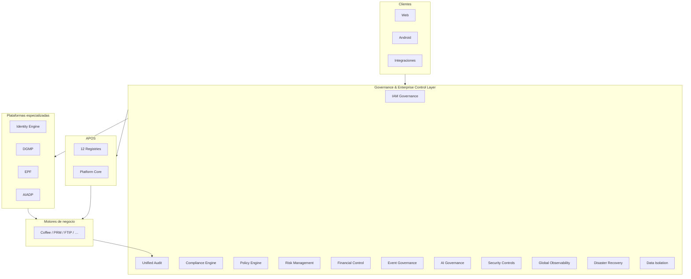
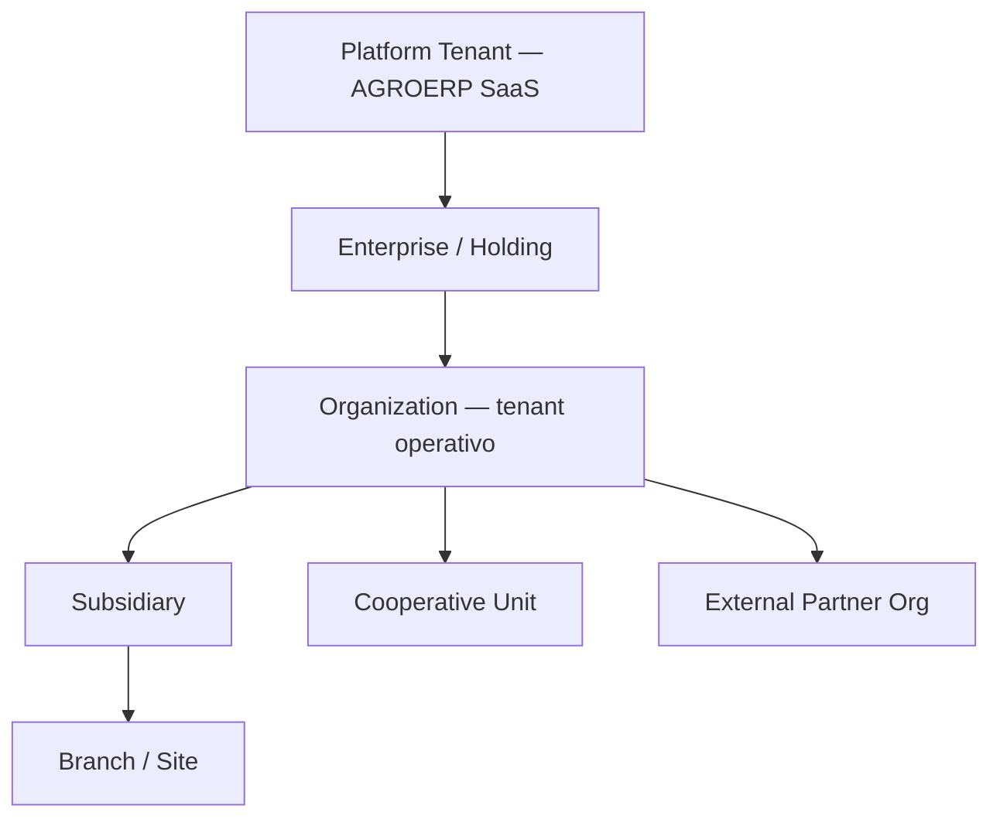
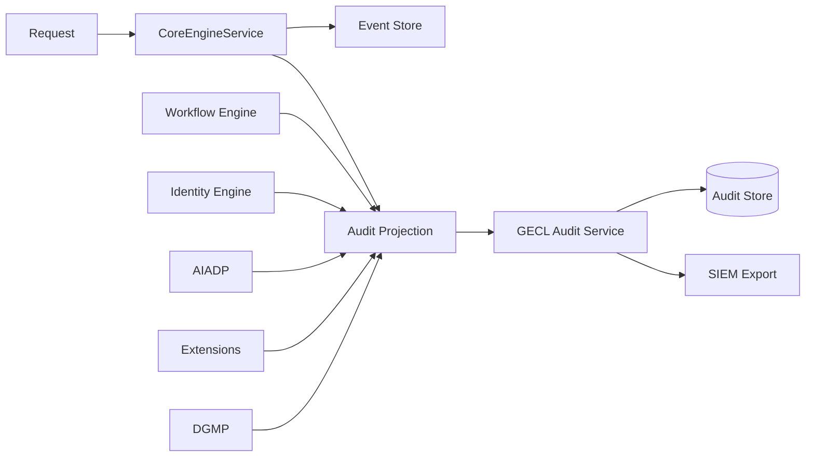
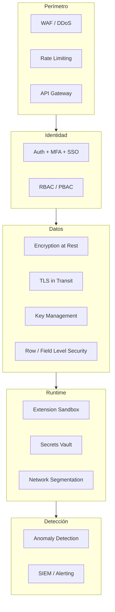
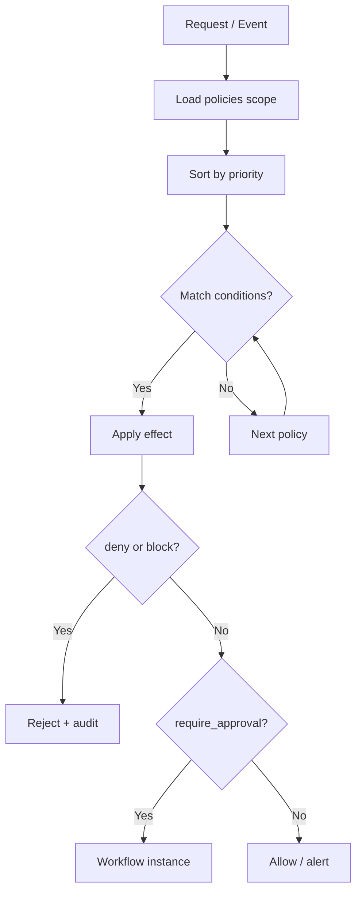

# AGROERP — Governance & Enterprise Control Layer (GECL)

**Versión:** 1.0  
**Estado:** Oficial — Especificación de gobierno, control, auditoría, cumplimiento y seguridad  
**Audiencia:** CISO, compliance, auditoría interna/externa, finanzas, riesgos, arquitectura, legal, producto, operaciones  
**Naturaleza:** Capa transversal de control absoluto — **no es un módulo funcional de negocio**

---

## 0. Propósito y autoridad

El **Governance & Enterprise Control Layer (GECL)** es la **capa que controla, supervisa y asegura todo el comportamiento de AGROERP**: identidad, acceso, auditoría total, cumplimiento normativo, gobierno del dato, seguridad, riesgos, políticas empresariales, control financiero, gobierno de eventos e IA, observabilidad global, recuperación ante desastres y aislamiento multi-tenant. Garantiza **integridad, seguridad, cumplimiento y trazabilidad total** en operación 24/7 a escala global.

| Pregunta | Documento que responde |
|----------|------------------------|
| ¿Cómo se orquesta la plataforma? | `APOS.md` |
| ¿Cómo se implementa cada componente? | `AEPS.md` |
| ¿IAM, roles, sesiones, PBAC? | `IDENTITY_ENGINE.md` |
| ¿Calidad, lineage, catálogos, MDM? | `DATA_GOVERNANCE_PLATFORM.md` |
| ¿Extensibilidad gobernada? | `EXTENSION_PLUGIN_FRAMEWORK.md` |
| ¿IA, automatización, decisiones? | `AGRO_INTELLIGENCE_AUTOMATION_DECISION_PLATFORM.md` |
| **¿Quién controla todo el sistema y cómo se cumple?** | **Este documento (GECL)** |
| **¿Cómo conecta AGROERP con sistemas externos?** | `INTEGRATION_ECOSYSTEM_LAYER.md` (IEL) |
| **¿Fuente verdad analítica y KPIs oficiales?** | `DATA_PLATFORM_ANALYTICS_LAYER.md` (DPAL) |

### Jerarquía documental

```
APOS.md                              → OS, registries, observabilidad operativa
GOVERNANCE_ENTERPRISE_CONTROL_LAYER.md → Capa control absoluto (GECL) — este documento
DATA_GOVERNANCE_PLATFORM.md          → Gobierno específico del dato (DGMP)
IDENTITY_ENGINE.md                   → Motor IAM implementado
EXTENSION_PLUGIN_FRAMEWORK.md        → Governance de extensiones
AGRO_INTELLIGENCE_AUTOMATION_DECISION_PLATFORM.md → Governance IA operativa
AEPS.md                              → Estándares implementación
{ENGINE}.md                          → Controles por dominio
```

**Regla de oro:** Ninguna acción en AGROERP — humana, automática, de integración o de IA — escapa al **marco GECL**. Los motores implementan controles; GECL **define, unifica, audita y certifica** el cumplimiento.

### Principios inviolables

| # | Principio | Descripción |
|---|-----------|-------------|
| GCL-01 | **Deny by default** | Sin permiso explícito → denegado |
| GCL-02 | **Audit everything material** | Toda mutación, acceso sensible y decisión automática queda registrada |
| GCL-03 | **Tenant isolation absolute** | Datos, config y políticas no cruzan `organizationId` sin contrato federado |
| GCL-04 | **Policy over code** | Restricciones empresariales en Policy Engine, no hardcoded |
| GCL-05 | **Separation of duties** | Roles incompatibles no coexisten en misma sesión sin excepción aprobada |
| GCL-06 | **Compliance by design** | Controles mapeados a marcos normativos desde diseño |
| GCL-07 | **Explainable automation** | IA y reglas dejan evidencia auditable de por qué actuaron |
| GCL-08 | **Immutable audit trail** | Registros de auditoría append-only; correcciones vía contra-asiento |
| GCL-09 | **Defense in depth** | Múltiples capas: red, API, identidad, dato, evento, extensión |
| GCL-10 | **Continuous assurance** | Gobierno no es proyecto puntual — monitoreo continuo |

### Alcance

| Incluye | No incluye |
|---------|------------|
| Modelo multi-tenant empresarial | Lógica transaccional café/cacao |
| Marco IAM empresarial (delega Identity Engine) | Pantallas admin |
| Auditoría total unificada | Implementación código |
| Compliance frameworks y controles | Asesoría legal específica por país |
| Security model enterprise | Infra cloud detalle (ver APOS) |
| Risk register y gestión | Modelos actuariales climáticos |
| Policy Engine empresarial | |
| Control financiero transversal | |
| Event / AI governance | |
| Observabilidad global, DR, dashboard gobierno | |

---

## 1. Visión y arquitectura

### 1.1 Visión

GECL es el **sistema nervioso de control** de AGROERP — comparable en espíritu a:

| Referencia | Capacidad análoga |
|------------|-------------------|
| SAP GRC (Governance, Risk, Compliance) | Controles, riesgos, auditoría |
| ServiceNow GRC / IRM | Risk register, compliance |
| Microsoft Purview + Entra | Clasificación + IAM |
| ISO 27001 ISMS | Seguridad información |
| SOX ITGC | Controles financieros |
| COBIT | Gobierno TI empresarial |

### 1.2 GECL en el stack AGROERP



### 1.3 División de responsabilidades

| Capa | Rol en gobierno |
|------|-----------------|
| **GECL** | Marco unificado, políticas, compliance, riesgo, dashboard gobierno |
| **Identity Engine** | Ejecución IAM: auth, RBAC, PBAC, sesiones |
| **DGMP** | Gobierno del dato: calidad, lineage, catálogo, stewardship |
| **Audit Engine** | Persistencia proyección auditoría (alimentada por Core) |
| **EPF** | Governance extensiones: certificación, sandbox, permisos package |
| **AIADP** | Governance operativa IA: inferencias, umbrales, human-in-loop |
| **APOS** | Orquestación, health, feature flags, observabilidad infra |

**Regla:** GECL **no duplica** motores — los **orquesta y certifica**.

---

## 2. Modelo multi-tenant empresarial

### 2.1 Jerarquía organizacional



### 2.2 EnterpriseTenant

| Atributo | Descripción |
|----------|-------------|
| `enterpriseId` | UUID holding |
| `legalName` | |
| `taxId` | NIT/RUC/RFC según país |
| `countryCode` | Jurisdicción primaria |
| `tenantTier` | `enterprise`, `cooperative`, `sme`, `partner` |
| `isolationLevel` | `logical`, `logical_dedicated`, `physical_dedicated` |
| `dataResidencyRegion` | `us`, `eu`, `latam`, … |
| `status` | active, suspended, terminated |
| `complianceProfiles` | Array framework IDs |
| `parentEnterpriseId` | Opcional — grupo corporativo |

### 2.3 Organization (tenant operativo)

| Atributo | Descripción |
|----------|-------------|
| `organizationId` | **Clave de aislamiento principal** |
| `enterpriseId` | Padre corporativo |
| `orgType` | `company`, `cooperative`, `subsidiary`, `external_client` |
| `hierarchyPath` | Materialized path `/ent/org/sub/` |
| `settings` | JSON — timezone, locale, políticas locales |
| `featureFlags` | Overrides org |
| `retentionPolicyId` | |
| `encryptionKeyRef` | KMS por org (tier dedicado) |

### 2.4 Modos de aislamiento

| Nivel | Descripción | Uso |
|-------|-------------|-----|
| **L1 — Lógico compartido** | RLS `organizationId` en DB compartida | Default SaaS |
| **L2 — Lógico dedicado** | Schema/DB dedicado, infra compartida | Enterprise medio |
| **L3 — Físico dedicado** | Cluster/región dedicada | Misión crítica, data residency |
| **L4 — Federado** | Org externa con acceso limitado cross-tenant | Partners, certificadoras |

### 2.5 Cooperativas y clientes externos

| Tipo | Modelo acceso |
|------|---------------|
| **Cooperativa** | Org propia; productores como entidades PRM; roles campo limitados |
| **Subsidiaria** | Hereda políticas enterprise; puede override local |
| **Cliente externo** | Portal read-only / transaccional acotado; sin acceso datos terceros |
| **Certificadora / auditor** | Rol temporal `auditor_external`; scope documentos y evidencias |

### 2.6 Reglas multi-tenant

| Regla | Descripción |
|-------|-------------|
| GECL-MT-01 | Toda query negocio filtra `organizationId` |
| GECL-MT-02 | Cross-org solo vía contrato federado explícito |
| GECL-MT-03 | Admin platform ≠ admin org — permisos disjuntos |
| GECL-MT-04 | Backup/restore siempre scoped por org o enterprise |
| GECL-MT-05 | Auditoría externa: vista sandbox sin PII exportable sin aprobación |

---

## 3. Identity & Access Management (IAM Governance)

GECL define el **marco IAM empresarial**; **Identity Engine** es el motor de ejecución — ver `IDENTITY_ENGINE.md`.

### 3.1 Modelo de identidad

| Entidad | Descripción |
|---------|-------------|
| **User** | Humano, service account, API user, external |
| **Role** | Conjunto permisos con scope |
| **Permission** | `resource:action` + scope opcional |
| **Group** | Agregación roles |
| **OrgUnit** | Jerarquía empresa/sucursal/región |
| **Team** | Equipo operativo (compradores, catadores) |
| **Policy (PBAC)** | Condiciones contextuales |
| **Delegation** | Permiso temporal otorgado |
| **Substitution** | Sustitución por ausencia |
| **ServiceAccount** | Integración M2M |

### 3.2 Granularidad de permisos

| Dimensión | Ejemplo |
|-----------|---------|
| **Por módulo** | `coffee.procurement:*` |
| **Por acción** | `purchase:create`, `settlement:approve` |
| **Por dato** | Campo `producer.taxId` — `read` restringido |
| **Por entidad** | Scope finca `farm-uuid-123` |
| **Por contexto** | Horario, geolocalización, dispositivo, IP |
| **Por extensión** | `packageKey:action` (EPF) |

### 3.3 Matriz de autorización

Evaluación en orden (Identity Engine):

1. Usuario activo, sesión válida, MFA si requerido
2. Deny policies (PBAC) — prioridad alta
3. RBAC efectivo (roles + grupos + delegaciones)
4. PBAC allow condicional
5. Field-level security (DGMP classification)
6. Row-level scope (org, farm, branch)
7. **Default: DENY**

### 3.4 Autenticación

| Mecanismo | Descripción |
|-----------|-------------|
| **Credenciales** | Email/password con política complejidad GECL |
| **MFA** | TOTP, SMS (fallback), hardware key (enterprise) |
| **SSO** | SAML 2.0, OIDC — Azure AD, Google Workspace, Okta |
| **API Keys** | Service accounts con rotación y scope |
| **Device binding** | Android device registration |
| **Session** | JWT + refresh; revocación remota; idle timeout |

### 3.5 IAMGovernancePolicy

| Atributo | Descripción |
|----------|-------------|
| `policyId` | |
| `organizationId` | null = platform |
| `passwordMinLength` | |
| `mfaRequired` | bool o por rol |
| `sessionTimeoutMinutes` | |
| `maxConcurrentSessions` | |
| `ssoProviderRef` | |
| `ipAllowlist` | Opcional enterprise |
| `privilegedAccessWorkflow` | Aprobación para roles admin |

### 3.6 Separación de funciones (SoD)

| Par incompatibles | Ejemplo café |
|-------------------|--------------|
| Crear compra + Aprobar liquidación | Comprador vs tesorero |
| Registrar calidad + Certificar exportación | Catador vs comercio exterior |
| Admin permisos + Auditoría | Segregación ITGC |

Violación SoD → bloqueo asignación o alerta GECL-ALT-12.

---

## 4. Auditoría total

### 4.1 Principio

**Registrar absolutamente todo lo material** — append-only, inmutable, correlacionable.

### 4.2 AuditRecord (modelo unificado)

| Campo | Descripción |
|-------|-------------|
| `auditId` | UUID |
| `timestamp` | UTC ISO-8601 |
| `organizationId` | |
| `actorType` | `user`, `service_account`, `system`, `ai_agent`, `extension` |
| `actorId` | userId / agentCode / packageKey |
| `action` | `create`, `update`, `delete`, `read_sensitive`, `login`, `approve`, … |
| `resourceType` | Entidad afectada |
| `resourceId` | |
| `moduleId` | Motor origen |
| `correlationId` | Trace request |
| `sessionId` | |
| `deviceId` | |
| `ipAddress` | |
| `userAgent` | |
| `geoLocation` | Opcional |
| `beforeState` | JSON snapshot (redactado PII según rol auditor) |
| `afterState` | JSON snapshot |
| `changeSet` | Diff estructurado |
| `outcome` | success, denied, error |
| `riskScore` | Opcional — AIADP |
| `complianceTags` | Array framework control IDs |
| `retentionUntil` | Según política |

### 4.3 Categorías auditadas

| Categoría | Ejemplos |
|-----------|----------|
| **Acciones usuario** | CRUD, login, export, impersonation |
| **Cambios datos** | Productor, compra, inventario, liquidación |
| **Configuración** | Org settings, workflows, reglas, feature flags |
| **IA** | Inferencia, recomendación, decisión automática |
| **Automatización** | AUE rule executed, workflow transition |
| **Eventos sistema** | Extension install, health degrade |
| **Documentos** | View, download, share EDMKP |
| **Permisos** | Role assign, policy change, delegation |

### 4.4 Fuentes de auditoría



**Regla APOS:** Ningún motor escribe auditoría por canal alternativo.

### 4.5 Retención auditoría

| Tipo evento | Retención mínima default |
|-------------|--------------------------|
| Financiero / liquidación | 10 años |
| Exportación / trazabilidad | 7 años |
| IAM / permisos | 7 años |
| Operativo general | 3 años |
| Telemetría debug | 90 días |

Configurable por `ComplianceFramework` y jurisdicción.

---

## 5. Compliance & regulación

### 5.1 ComplianceFramework

| Atributo | Descripción |
|----------|-------------|
| `frameworkId` | `iso27001`, `gdpr`, `sox`, `haccp`, `organic_eu`, … |
| `displayName` | |
| `jurisdiction` | Global, EU, CO, MX, … |
| `domain` | security, financial, agricultural, export, privacy |
| `version` | |
| `status` | active, deprecated |

### 5.2 Marcos soportados (base)

| Dominio | Marcos / normativas |
|---------|---------------------|
| **Seguridad información** | ISO 27001, SOC 2 Type II |
| **Privacidad datos** | GDPR, LGPD, Ley 1581 Colombia, LFPDPPP México |
| **Financiero** | SOX ITGC, PCI-DSS (pagos), normativa local tributaria |
| **Agrícola** | GlobalGAP, orgánico EU/US, Rainforest, Fair Trade |
| **Exportación** | INCOTERMS, fitosanitario, trazabilidad ICA/SENASA/etc. |
| **Retención documental** | Por país — EDMKP + GECL retention |

### 5.3 ComplianceControl

| Atributo | Descripción |
|----------|-------------|
| `controlId` | `ISO27001-A.9.2.1` |
| `frameworkId` | |
| `description` | |
| `controlType` | preventive, detective, corrective |
| `automated` | bool — verificado por sistema |
| `evidenceSource` | audit, report, manual attestation |
| `frequency` | continuous, daily, quarterly, annual |
| `ownerRole` | |
| `mappedPolicies` | Policy Engine IDs |
| `mappedPermissions` | |
| `status` | effective, gap, compensating |

### 5.4 ComplianceAssessment

| Atributo | Descripción |
|----------|-------------|
| `assessmentId` | |
| `frameworkId` | |
| `organizationId` | |
| `period` | |
| `auditorType` | internal, external, certification_body |
| `findings` | Array ComplianceFinding |
| `overallStatus` | compliant, partial, non_compliant |
| `evidencePackageRef` | EDMKP bundle |

### 5.5 ComplianceFinding

| Atributo | Descripción |
|----------|-------------|
| `findingId` | |
| `severity` | critical, major, minor, observation |
| `controlId` | |
| `description` | |
| `remediationPlan` | |
| `dueDate` | |
| `status` | open, in_progress, closed, accepted_risk |

### 5.6 Auditorías externas

| Capacidad | Descripción |
|-----------|-------------|
| Rol `auditor_external` temporal | Scope limitado |
| Evidence package export | Watermarked, logged |
| Read-only audit trail | Sin mutación |
| Certification workflow | Hallazgos → CAPA → cierre |

---

## 6. Data governance (marco GECL → DGMP)

GECL establece el **marco empresarial**; **DGMP** ejecuta calidad, lineage, catálogo — ver `DATA_GOVERNANCE_PLATFORM.md`.

### 6.1 Pilares (GECL view)

| Pilar | Responsable | Descripción |
|-------|-------------|-------------|
| **Calidad** | DGMP DQS | Score, reglas, duplicados |
| **Validación** | DVE | Reglas captura y batch |
| **Normalización** | MDM | Catálogos, golden record |
| **Versionado** | Data Versioning Service | Historial atributos |
| **Lineage** | Lineage Service | Origen → transformación → consumo |
| **Ownership** | Data Stewardship | Data owner / steward por entidad |
| **Ciclo de vida** | Retention + archival | Creación → activo → archivo → purge |

### 6.2 DataOwnership

| Atributo | Descripción |
|----------|-------------|
| `entityType` | producer, purchase, farm, … |
| `dataOwnerRole` | Rol accountable |
| `dataStewardUserId` | Responsable operativo |
| `classification` | public, internal, confidential, restricted |
| `piiFields` | Array field keys |
| `retentionPolicyId` | |

### 6.3 Integración GECL ↔ DGMP

| Evento GECL | Acción DGMP |
|-------------|-------------|
| Violación calidad crítica | ComplianceFinding + alerta |
| Acceso dato `restricted` | Audit + policy check |
| Export masivo | Approval workflow |
| Purge solicitado | Legal hold check |

---

## 7. Security model

### 7.1 Capas de seguridad



### 7.2 Encriptación

| Capa | Estándar | Alcance |
|------|----------|---------|
| **En tránsito** | TLS 1.2+ (1.3 preferido) | APIs, sync, integraciones |
| **En reposo** | AES-256 | DB, S3, backups |
| **Application-level** | Field encryption | PII restricted, tokens |
| **Key management** | KMS / HSM | Por platform y org dedicada |

### 7.3 Gestión de secretos

| Tipo | Almacén |
|------|---------|
| API keys integración | Vault — rotación 90 días |
| DB credentials | Vault — dynamic secrets |
| JWT signing keys | KMS — rotación programada |
| SSO certificates | Vault + expiry alert |
| Extension secrets | Ref en manifest — nunca plain |

### 7.4 Protección APIs

| Control | Descripción |
|---------|-------------|
| Authentication | JWT / API key obligatorio |
| Authorization | PermissionsGuard global |
| Rate limiting | Por user, org, IP, route |
| Input validation | DTO + DVE |
| CORS | Whitelist por entorno |
| Request size limits | Anti-DoS |
| Idempotency keys | Mutaciones financieras |

### 7.5 Detección anomalías

| Señal | Acción |
|-------|--------|
| Login desde geo inusual | MFA step-up o block |
| Bulk export | Alert + throttle |
| Permission escalation attempt | Block + audit critical |
| API abuse pattern | Rate limit + incident |
| AI agent quota exceed | Suspend agent |

---

## 8. Risk management

### 8.1 RiskRegister

| Atributo | Descripción |
|----------|-------------|
| `riskId` | UUID |
| `organizationId` | |
| `riskCategory` | financial, operational, agronomic, logistics, fraud, compliance, climate |
| `title` | |
| `description` | |
| `likelihood` | 1–5 |
| `impact` | 1–5 |
| `inherentScore` | likelihood × impact |
| `controls` | Array control IDs |
| `residualScore` | Post-controles |
| `ownerUserId` | |
| `status` | identified, assessed, mitigated, accepted, closed |
| `reviewDate` | |

### 8.2 Categorías de riesgo

| Categoría | Ejemplos AGROERP |
|-----------|------------------|
| **Financiero** | Liquidación duplicada, anticipo sin respaldo |
| **Operativo** | Pérdida inventario, error pesaje |
| **Agronómico** | Recomendación IA sin validar técnico |
| **Logístico** | Desvío ruta, custodia rota |
| **Fraude** | Productor fantasma, GPS simulado |
| **Cumplimiento** | Exportación sin certificado |
| **Climático** | *(futuro)* Impacto cosecha, seguro |

### 8.3 RiskTreatment

| Estrategia | Descripción |
|------------|-------------|
| **Mitigate** | Controles GECL / workflow |
| **Transfer** | Seguro, contrato tercero |
| **Accept** | Con aprobación gerencia + registro |
| **Avoid** | Deshabilitar operación |

### 8.4 Integración AIADP

AIADP alimenta `riskScore` en tiempo real; GECL consolida en Risk Register y dispara alertas si umbral excedido.

---

## 9. Policy Engine

Motor de **políticas empresariales declarativas** — complementa PBAC Identity y BRE dominio.

### 9.1 GovernancePolicy

| Atributo | Descripción |
|----------|-------------|
| `policyId` | UUID |
| `policyKey` | Estable — `fin.max_advance_per_producer` |
| `organizationId` | null = platform template |
| `scope` | platform, enterprise, organization, role, country |
| `domain` | financial, operational, security, compliance, ai |
| `effect` | allow, deny, require_approval, alert, block |
| `conditions` | JSON — país, rol, monto, horario, commodity |
| `priority` | Mayor = primero |
| `effectiveFrom` / `effectiveTo` | |
| `version` | |
| `status` | draft, published, deprecated |
| `approvedBy` | Workflow obligatorio cambios prod |

### 9.2 Tipos de política

| Tipo | Ejemplo |
|------|---------|
| **Restricción país** | Exportación CO requiere doc X |
| **Restricción empresa** | Límite compra diaria coop |
| **Restricción rol** | Comprador no aprueba > $X |
| **Aprobación** | Liquidación > umbral → workflow CFO |
| **Límite financiero** | Anticipo máx 30% contrato |
| **Operación** | Compra fuera radio finca → bloqueo |
| **Bloqueo automático** | 3 NC calidad → bloqueo productor |
| **Alerta** | Desviación inventario > 2% |

### 9.3 Evaluación Policy Engine



### 9.4 Relación con otros motores

| Motor | Rol |
|-------|-----|
| Identity PBAC | Acceso usuario/recurso |
| GECL Policy Engine | Políticas empresariales transversales |
| Business Rules Engine | Reglas dominio café |
| Workflow Engine | Aprobaciones policy-driven |
| AIADP | Políticas umbral decisión IA |

---

## 10. Financial control

### 10.1 Principios

| Principio | Descripción |
|-----------|-------------|
| FC-01 | Todo movimiento financiero vía `FinancialMovement` (CSFE) |
| FC-02 | Liquidación antes de pago — sin excepción |
| FC-03 | SoD: quien registra ≠ quien aprueba pago |
| FC-04 | Anticipos con tope policy + respaldo documental |
| FC-05 | Conciliación periódica obligatoria |

### 10.2 FinancialControlRule

| Atributo | Descripción |
|----------|-------------|
| `ruleId` | |
| `organizationId` | |
| `ruleType` | limit, approval_threshold, reconciliation, fraud_signal |
| `parameters` | JSON — montos, monedas, roles |
| `linkedPolicyId` | |
| `status` | active |

### 10.3 Controles financieros

| Control | Descripción |
|---------|-------------|
| **Límites por usuario** | Comprador max diario |
| **Umbrales aprobación** | Escalación workflow |
| **Validación pagos** | Cuenta productor verificada PRM |
| **Control anticipos** | % contrato, saldo pendiente |
| **Control liquidaciones** | DVE + CQIE linkage |
| **Conciliación** | Compra ↔ recepción ↔ inventario ↔ pago |
| **Anti-fraude** | Patrones duplicados, productor fantasma |
| **Auditoría financiera** | Trail inmutable 10 años |

### 10.4 FinancialReconciliation

| Atributo | Descripción |
|----------|-------------|
| `reconciliationId` | |
| `period` | |
| `scope` | procurement, inventory, settlement |
| `expectedAmount` | |
| `actualAmount` | |
| `variance` | |
| `status` | balanced, variance_investigation, closed |
| `signedOffBy` | |

---

## 11. Event governance

### 11.1 Principios

| Regla | Descripción |
|-------|-------------|
| EG-01 | Solo eventos en Event Catalog pueden publicarse (prod) |
| EG-02 | Subscribers declarados — EPF manifest o motor spec |
| EG-03 | Eventos críticos no modificables post-persist |
| EG-04 | Transformación eventos — audit + schema version |
| EG-05 | Encadenamiento documentado en lineage |

### 11.2 EventGovernanceRule

| Atributo | Descripción |
|----------|-------------|
| `ruleId` | |
| `eventType` | |
| `publisherAllowlist` | Motores/plugins autorizados |
| `subscriberAllowlist` | |
| `modificationAllowed` | false default críticos |
| `retentionDays` | |
| `criticality` | low, medium, high, critical |
| `requiresApprovalToSubscribe` | bool — eventos sensibles |

### 11.3 Eventos críticos (ejemplos café)

| Evento | Criticidad |
|--------|------------|
| `SettlementApproved` | critical |
| `PaymentExecuted` | critical |
| `InventoryAdjusted` | high |
| `QualityCertificateIssued` | high |
| `ProducerBlocked` | high |
| `PurchaseConfirmed` | medium |

### 11.4 Event chain governance

| Control | Descripción |
|---------|-------------|
| DAG validación | No ciclos infinitos handler |
| DLQ monitoring | Fallos → incident |
| Replay authorization | Solo admin + audit |
| Cross-tenant block | Hard deny |

---

## 12. AI governance

GECL define marco; **AIADP** ejecuta — ver `AGRO_INTELLIGENCE_AUTOMATION_DECISION_PLATFORM.md`.

### 12.1 AIGovernancePolicy

| Atributo | Descripción |
|----------|-------------|
| `policyId` | |
| `organizationId` | |
| `agentCode` | null = all agents |
| `dataAccessScope` | read_only, recommend, mutate_with_approval, forbidden |
| `allowedEntityTypes` | Array |
| `forbiddenFields` | PII, financial raw |
| `automationLevel` | suggest, recommend, auto_low_risk, auto_approved_workflow |
| `humanInLoopThreshold` | riskScore > X |
| `explainabilityRequired` | bool |
| `trainingDataPolicy` | certified_only, org_only, no_training |
| `tokenBudgetDaily` | |
| `auditInference` | always |

### 12.2 Matriz capacidades IA

| Capacidad | Default | Aprobación |
|-----------|---------|------------|
| Ver datos operativos | Permitido scope | Policy |
| Ver PII | Denegado | DPO approval |
| Recomendar | Permitido | Audit |
| Modificar datos | Denegado | Workflow |
| Decisión financiera auto | Denegado | CFO policy + workflow |
| Bloqueo operativo auto | Condicional | Umbral + audit |

### 12.3 AIInferenceAuditRecord

| Campo | Descripción |
|-------|-------------|
| `inferenceId` | |
| `agentCode` | |
| `modelVersion` | |
| `inputHash` | No raw PII en log |
| `outputSummary` | |
| `explanation` | Texto / SHAP ref |
| `decisionApplied` | bool |
| `approvedBy` | Si human-in-loop |
| `correlationId` | |

### 12.4 Explainability

| Nivel | Uso |
|-------|-----|
| **L1 — Log** | Qué datos usó, regla activada |
| **L2 — Narrative** | Explicación natural usuario |
| **L3 — Attestation** | Firma modelo + versión para auditoría |

---

## 13. Observabilidad global

### 13.1 Pilares

| Pilar | Contenido | Destino |
|-------|-----------|---------|
| **Logs** | Structured JSON, correlationId | Central log store |
| **Métricas** | RED/USE, business KPIs | Prometheus / cloud |
| **Trazas** | OpenTelemetry distributed | Jaeger / Tempo |
| **Auditoría** | AuditRecord | Audit Store + SIEM |
| **Health** | Liveness, readiness, deep | APOS dashboard |

### 13.2 Taxonomía logs

| Campo obligatorio | |
|-------------------|---|
| `timestamp`, `level`, `serviceId`, `organizationId` (si aplica) | |
| `correlationId`, `traceId`, `spanId` | |
| `userId` / `actorId` | |
| `message`, `error.code` | |

### 13.3 Métricas globales GECL

| Métrica | Descripción |
|---------|-------------|
| `gecl_auth_failures_total` | Fallos autenticación |
| `gecl_policy_denials_total` | Políticas deny |
| `gecl_audit_events_total` | Volumen auditoría |
| `gecl_compliance_gaps` | Controles en gap |
| `gecl_active_risks_high` | Riesgos score alto |
| `gecl_ai_inferences_total` | Inferencias IA |
| `gecl_extension_health` | Por packageKey |

### 13.4 Alertas tiempo real

Integración con Notification Engine — ver §18.

### 13.5 Health checks

| Nivel | Alcance |
|-------|---------|
| Platform | APOS agregado |
| Organization | Motores activos org |
| Extension | EPF health |
| Integration | Conectores externos |

---

## 14. Disaster recovery & business continuity

### 14.1 Objetivos

| Métrica | Target default | Tier crítico |
|---------|----------------|--------------|
| **RPO** (Recovery Point Objective) | 1 hora | 15 min |
| **RTO** (Recovery Time Objective) | 4 horas | 1 hora |
| **Availability** | 99.9% | 99.95% |

### 14.2 Backup strategy

| Componente | Frecuencia | Retención |
|------------|------------|-----------|
| PostgreSQL | Continuo WAL + snapshot diario | 30d online, 7y archive |
| Event Store | Réplica sync + snapshot | Igual DB |
| S3 / EDMKP | Versioning + cross-region | Por retention policy |
| Config / secrets | Vault backup | Encrypted |
| Audit Store | Append replica | 7y minimum |

### 14.3 Restauración

| Tipo | Descripción |
|------|-------------|
| **Full platform** | DR runbook — failover región |
| **Single organization** | Restore scoped — data isolation |
| **Point-in-time** | WAL replay a timestamp |
| **Selective entity** | Legal / audit request |

### 14.4 Alta disponibilidad

| Capa | Estrategia |
|------|------------|
| API | Multi-AZ, auto-scale |
| DB | Primary + replica read; failover automático |
| Redis | Cluster / sentinel |
| Event bus | Durable queue, consumer groups |
| Search | Replica shards |

### 14.5 Plan contingencia

| Escenario | Respuesta |
|-----------|-----------|
| Región cloud down | Failover DR region |
| Ransomware | Isolated backup restore |
| Breach seguridad | Incident response GECL-IR-01 |
| Corrupción datos org | PITR org-scoped |
| Extension compromise | EPF suspend + audit |

### 14.6 DRDrill

| Atributo | Descripción |
|----------|-------------|
| Frecuencia | Semestral tier crítico; anual resto |
| Evidencia | DRDrillRecord en EDMKP |
| Owner | SRE + CISO |

---

## 15. Data isolation model

### 15.1 Dimensiones de aislamiento

| Dimensión | Mecanismo |
|-----------|-----------|
| **Empresa** | `organizationId` RLS |
| **Rol** | RBAC + field-level |
| **Entorno** | `dev`, `staging`, `prod` — DB separadas |
| **Región** | Data residency cluster |
| **Campo** | Classification `restricted` — mask |
| **Fila** | Scope farm, branch, team |

### 15.2 Row-Level Security (RLS)

| Regla | Descripción |
|-------|-------------|
| DI-01 | Toda tabla negocio: policy `organizationId = current_org` |
| DI-02 | Platform admin: break-glass con audit |
| DI-03 | Cross-org query: solo vistas federadas aprobadas |
| DI-04 | Tests: org fixtures aisladas |

### 15.3 Field-Level Security

| Clasificación | Comportamiento |
|---------------|----------------|
| `public` | Sin restricción |
| `internal` | Autenticado org |
| `confidential` | Rol específico |
| `restricted` | Mask + audit on read |

### 15.4 Entornos

| Entorno | Datos | Acceso |
|---------|-------|--------|
| **dev** | Sintéticos / anonimizados | Desarrolladores |
| **staging** | Subset masked prod | QA, UAT |
| **prod** | Reales | Operación |

Prohibido copiar prod → dev sin anonimización GECL.

---

## 16. Governance dashboard

### 16.1 Propósito

Vista ejecutiva **seguridad, riesgo, cumplimiento y salud** — no operaciones café (OCC).

### 16.2 Indicadores principales

| Panel | KPIs |
|-------|------|
| **Seguridad** | Auth failures, policy denials, MFA adoption, anomalías |
| **Riesgos activos** | Count por categoría, residual score trend |
| **Auditorías** | Pendientes, findings abiertos, overdue CAPA |
| **Cumplimiento** | % controles effective, gaps por framework |
| **Incumplimientos** | Violaciones policy, SoD breaks |
| **Actividad sospechosa** | SIEM correlaciones, bulk exports |
| **Uso sistema** | DAU, sesiones, API volume |
| **Salud plataforma** | APOS health, extension health, DR status |

### 16.3 GovernanceDashboardWidget

| Atributo | Descripción |
|----------|-------------|
| `widgetId` | |
| `category` | security, risk, compliance, audit, health |
| `metricQuery` | Definición agregación |
| `thresholds` | warning, critical |
| `refreshInterval` | |
| `audienceRoles` | CISO, CFO, auditor, platform_admin |

### 16.4 Reportes GECL

| ID | Reporte |
|----|---------|
| GECL-RPT-01 | Audit trail por periodo / actor |
| GECL-RPT-02 | Access review — permisos por usuario |
| GECL-RPT-03 | SoD violations |
| GECL-RPT-04 | Compliance control status |
| GECL-RPT-05 | Risk register snapshot |
| GECL-RPT-06 | Financial reconciliation status |
| GECL-RPT-07 | AI inference audit |
| GECL-RPT-08 | Policy changes log |
| GECL-RPT-09 | Extension security posture |
| GECL-RPT-10 | DR drill results |

---

## 17. Extension & integration governance

Delega detalle EPF; GECL certifica postura seguridad.

| Control | Descripción |
|---------|-------------|
| Certification gate | Prod extension levels |
| Permission audit | Manifest vs grants |
| Sandbox compliance | Profile adherence |
| Third-party risk | Vendor assessment |
| Integration allowlist | External APIs |

---

## 18. Alertas GECL

| ID | Alerta | Severidad |
|----|--------|-----------|
| GECL-ALT-01 | Multiple auth failures same user | high |
| GECL-ALT-02 | Privileged access sin MFA | critical |
| GECL-ALT-03 | Policy deny burst | medium |
| GECL-ALT-04 | SoD violation attempt | critical |
| GECL-ALT-05 | Compliance control gap nuevo | high |
| GECL-ALT-06 | Risk score > umbral | high |
| GECL-ALT-07 | Financial reconciliation variance | high |
| GECL-ALT-08 | Sensitive data bulk export | critical |
| GECL-ALT-09 | AI auto-decision sin explainability | high |
| GECL-ALT-10 | Audit pipeline lag | critical |
| GECL-ALT-11 | DR replica lag > RPO | critical |
| GECL-ALT-12 | Cross-tenant access attempt | critical |
| GECL-ALT-13 | Unsigned extension install | high |
| GECL-ALT-14 | Certificate / SSO expiry 30d | medium |

---

## 19. KPIs de gobierno

| KPI | Definición |
|-----|------------|
| **Audit coverage** | % mutaciones con audit record |
| **MFA adoption** | % usuarios privilegiados con MFA |
| **Compliance score** | % controles effective |
| **Mean time to remediate finding** | Días CAPA |
| **Policy denial rate** | Denials / requests |
| **Financial reconciliation rate** | % periodos balanced |
| **AI human override rate** | Overrides / decisions |
| **Incident count** | Por mes |
| **DR drill success** | % drills passed |
| **Data quality score** | DQS DGMP promedio org |

---

## 20. Incident response

### 20.1 SecurityIncident

| Atributo | Descripción |
|----------|-------------|
| `incidentId` | |
| `severity` | P1–P4 |
| `category` | breach, fraud, outage, compliance |
| `detectedAt` | |
| `containedAt` | |
| `resolvedAt` | |
| `affectedOrganizations` | |
| `rootCause` | |
| `remediation` | |
| `regulatoryNotificationRequired` | bool |

### 20.2 Playbook GECL-IR-01 (breach)

1. Detect → contain (revoke sessions, block IP)
2. Assess scope — audit query
3. Notify — legal, DPO, clientes si aplica
4. Remediate — patch, rotate keys
5. Post-mortem — EDMKP report
6. Update controls — ComplianceControl

---

## 21. Escalabilidad

| Dimensión | Estrategia |
|-----------|------------|
| Millones usuarios | Identity sharding, session store Redis cluster |
| Múltiples países | Compliance framework per jurisdiction |
| Miles empresas | Org-scoped RLS; dedicated tier option |
| Alta concurrencia | Async audit write; event sourcing |
| 24/7 | Multi-region HA + DR |
| Volumen auditoría | Partition by month; cold archive S3 |
| Policy evaluation | Cache compiled policies; invalidate on publish |

---

## 22. Integraciones GECL

| Sistema | Integración |
|---------|-------------|
| **Identity Engine** | IAM execution |
| **Event Engine** | Audit source, event governance |
| **Workflow Engine** | Aprobaciones policy, CAPA |
| **Notification Engine** | Alertas GECL |
| **DGMP** | Data quality, classification |
| **EDMKP** | Evidence packages, retention |
| **CSFE** | Financial control |
| **AIADP** | AI governance, risk scores |
| **EPF** | Extension security |
| **IEL** | Partner security, API perimeter |
| **APOS** | Health, registries, observability |
| **SIEM externo** | Splunk, Sentinel — audit export |

---

## 23. Eventos GECL (namespace `platform.governance.*`)

| Evento | Cuándo |
|--------|--------|
| `GovernancePolicyPublished` | Nueva política |
| `ComplianceFindingOpened` | Hallazgo |
| `RiskEscalated` | Score > umbral |
| `SecurityIncidentOpened` | Incidente |
| `SoDViolationDetected` | Conflicto roles |
| `FinancialReconciliationVariance` | Descuadre |
| `AIGovernanceViolation` | IA fuera política |
| `AuditRetentionApplied` | Archivo cold |
| `DRDrillCompleted` | Simulacro |
| `CrossTenantAccessDenied` | Intento ilegítimo |

---

## 24. Roadmap evolutivo

| Fase | Entregables |
|------|-------------|
| **F1 — Audit unificado** | AuditRecord schema, correlación |
| **F2 — IAM governance** | SoD, MFA policies, access review |
| **F3 — Policy Engine** | Financial + operational policies |
| **F4 — Compliance mapping** | ISO 27001 + GDPR controls |
| **F5 — Risk register** | Integración AIADP scores |
| **F6 — Financial control** | Reconciliation, limits CSFE |
| **F7 — Event governance** | Critical event rules |
| **F8 — AI governance** | Inference audit, explainability |
| **F9 — Observability** | Dashboard GECL, SIEM export |
| **F10 — DR** | PITR org, drills |
| **F11 — Governance dashboard** | Executive widgets |
| **F12 — Multi-region residency** | L3 isolation |

---

## 25. Checklist cumplimiento

- [ ] Toda mutación pasa CoreEngineService → audit
- [ ] RLS `organizationId` en tablas negocio
- [ ] MFA usuarios privilegiados
- [ ] SoD definido y monitoreado
- [ ] Políticas financieras publicadas
- [ ] Eventos críticos en Event Catalog
- [ ] IA con inference audit
- [ ] Compliance controls mapeados
- [ ] Backup + DR drill documentado
- [ ] Retención auditoría por jurisdicción
- [ ] Extensiones certificadas en prod
- [ ] Governance dashboard operativo

---

## 26. Conclusión

El **Governance & Enterprise Control Layer (GECL)** es la **capa de control absoluto de AGROERP**. Unifica:

- **Multi-tenant enterprise** — holdings, cooperativas, subsidiarias, externos, aislamiento L1–L4
- **IAM governance** — permisos granulares, MFA, SSO, SoD
- **Auditoría total** — quién, qué, cuándo, dónde, dispositivo, antes/después
- **Compliance** — agrícola, financiero, exportación, privacidad, ISO 27001
- **Data governance** — marco GECL + ejecución DGMP
- **Security** — encriptación, secretos, APIs, anomalías
- **Risk management** — financiero, operativo, fraude, cumplimiento
- **Policy Engine** — restricciones, límites, aprobaciones, bloqueos
- **Financial control** — liquidaciones, pagos, anticipos, conciliación
- **Event governance** — catálogo, criticidad, encadenamiento
- **AI governance** — acceso, automatización, explainability, audit
- **Observabilidad global** — logs, métricas, trazas, health
- **Disaster recovery** — backup, HA, PITR, contingencia
- **Data isolation** — fila, campo, entorno, región
- **Governance dashboard** — seguridad, riesgo, cumplimiento, salud

**Nada escapa al GECL. La plataforma opera con integridad demostrable.**

---

*Documento elaborado para AGROERP — Governance & Enterprise Control Layer v1.0.*  
*Motores relacionados:* Identity Engine, DGMP, Audit Engine, AIADP, EPF, APOS  
*Próximo paso recomendado:* Fase F1 — AuditRecord unificado + correlación cross-motor
