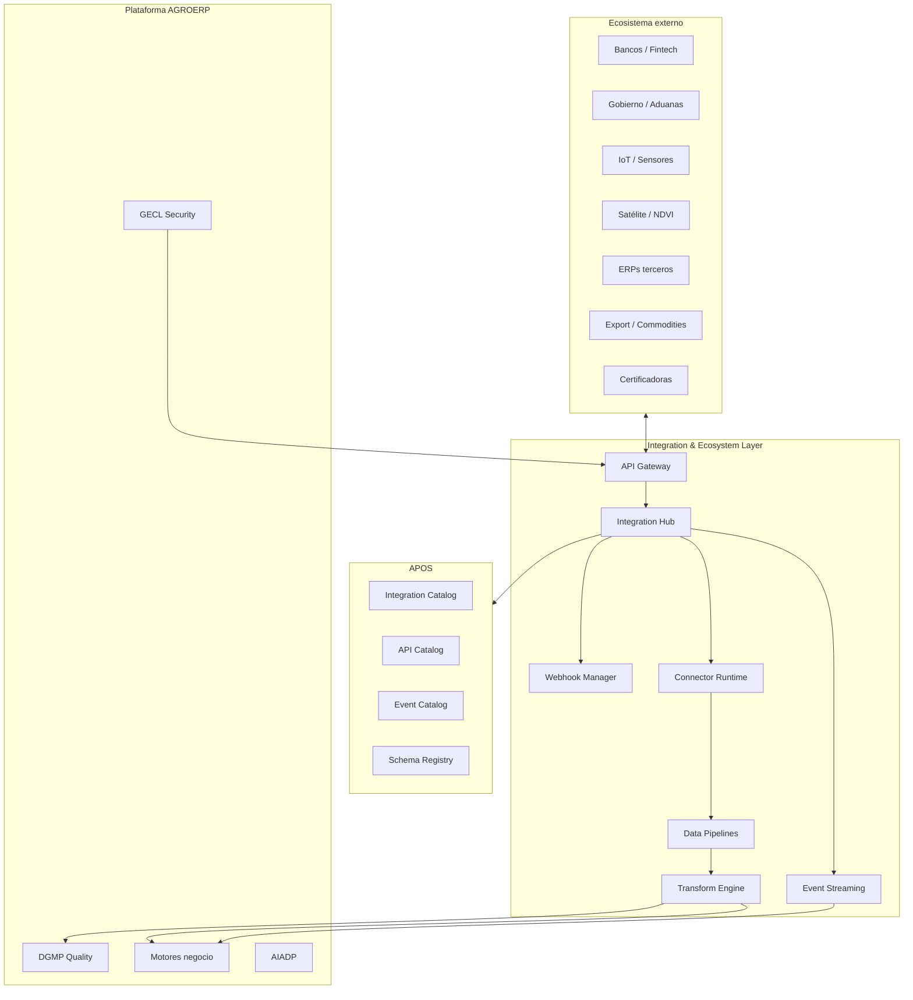
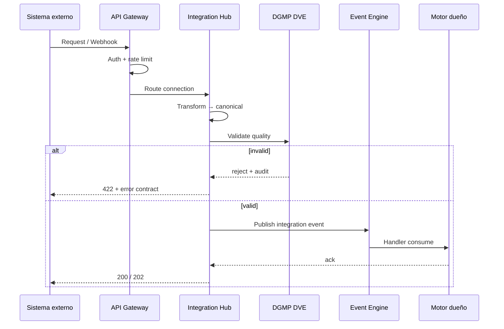

# AGROERP — Integration & Ecosystem Layer (IEL)

**Versión:** 1.0  
**Estado:** Oficial — Especificación de integración y ecosistema externo  
**Audiencia:** Arquitectura de integración, partners, fintech, IoT, comercio exterior, DevOps, seguridad, producto  
**Naturaleza:** Capa transversal de conectividad — **no es un módulo funcional de negocio**

---

## 0. Propósito y autoridad

El **Integration & Ecosystem Layer (IEL)** es la **capa encargada de conectar AGROERP con el mundo externo**: bancos, gobierno, certificadoras, IoT, satélite, exportación, ERPs terceros, marketplaces y cualquier sistema del ecosistema agrícola, financiero, logístico y tecnológico. Es la **puerta de entrada y salida** del sistema hacia el mundo, habilitando **interoperabilidad global** con contratos, seguridad y observabilidad unificados.

| Pregunta | Documento que responde |
|----------|------------------------|
| ¿Cómo se orquesta la plataforma? | `APOS.md` |
| ¿Estándares implementación APIs? | `AEPS.md` |
| ¿Seguridad, auditoría integraciones? | `GOVERNANCE_ENTERPRISE_CONTROL_LAYER.md` |
| ¿Conectores como extensiones? | `EXTENSION_PLUGIN_FRAMEWORK.md` |
| ¿Calidad dato entrante? | `DATA_GOVERNANCE_PLATFORM.md` |
| ¿Datos analíticos destino pipelines? | `DATA_PLATFORM_ANALYTICS_LAYER.md` (DPAL) |
| ¿Pagos productor? | `COFFEE_SETTLEMENT_FINANCIAL_ENGINE.md` |
| ¿Territorio / GIS? | `FARM_TERRITORY_INTELLIGENCE_PLATFORM.md` |
| **¿Cómo conecta AGROERP con el ecosistema externo?** | **Este documento (IEL)** |

### Jerarquía documental

```
APOS.md                              → OS, Integration Catalog (§3.2.12)
INTEGRATION_ECOSYSTEM_LAYER.md       → Capa integración total (IEL) — este documento
EXTENSION_PLUGIN_FRAMEWORK.md        → Integration Extension packages
GOVERNANCE_ENTERPRISE_CONTROL_LAYER.md → Seguridad partner, audit integración
DATA_GOVERNANCE_PLATFORM.md          → Calidad y lineage datos externos
AEPS.md                              → Contratos API, idempotencia, webhooks
{ENGINE}.md                          → Consumidores/proveedores por dominio
```

**Regla de oro:** Ningún sistema externo se conecta a AGROERP **sin pasar por IEL** — API Gateway, contrato de datos, autenticación partner, registro en Integration Catalog y auditoría GECL.

### Principios inviolables

| # | Principio | Descripción |
|---|-----------|-------------|
| IEL-01 | **Hub centralizado** | Toda conectividad externa vía Integration Hub |
| IEL-02 | **Contract-first** | JSON Schema / OpenAPI antes de implementar |
| IEL-03 | **Event-native** | Preferir eventos sobre polling; sync solo cuando necesario |
| IEL-04 | **Idempotent by default** | Reintentos seguros en webhooks, pagos, ETL |
| IEL-05 | **Tenant isolated** | Partner scope por `organizationId` |
| IEL-06 | **Secure perimeter** | OAuth2/OIDC, mTLS, secrets en vault |
| IEL-07 | **Observable** | Latencia, volumen, fallos por conector |
| IEL-08 | **Quality at ingress** | DVE valida antes de persistir |
| IEL-09 | **Versioned APIs** | Breaking changes → major version |
| IEL-10 | **Marketplace-ready** | Conectores instalables como Integration Extensions |

### Alcance

| Incluye | No incluye |
|---------|------------|
| Integration Hub, conectores, pipelines | UI admin conectores |
| Dominios: financial, gov, IoT, satélite, trade, ERP | Implementación código |
| Data contracts, event routing | Infra cloud detalle (APOS) |
| Security perimeter partner | Lógica negocio café |
| Marketplace conectores | Operación drones (futuro runtime) |
| Automatización híbrida | |

---

## 1. Visión y arquitectura

### 1.1 Visión

IEL convierte AGROERP en un **hub de interoperabilidad agrícola global** — comparable en espíritu a:

| Referencia | Capacidad análoga |
|------------|-------------------|
| MuleSoft / Boomi | Enterprise integration platform |
| SAP BTP Integration Suite | Conectores certificados |
| Stripe Connect | Fintech partner APIs |
| AWS IoT Core | Ingesta dispositivos |
| Planet / Sentinel APIs | Remote sensing |
| GS1 EPCIS | Trazabilidad cadena suministro |

### 1.2 IEL en el stack AGROERP



### 1.3 IEL vs APOS Integration Catalog

| Capa | Responsabilidad |
|------|-----------------|
| **IEL** | Marco completo: dominios, contratos, pipelines, marketplace, seguridad partner |
| **Integration Catalog (APOS)** | Registro runtime: service accounts, webhooks, conectores activos |
| **API Catalog (APOS)** | APIs expuestas por AGROERP hacia afuera |
| **EPF** | Integration Extension packages instalables |

---

## 2. Integration Hub

### 2.1 Componentes del Hub

| Componente | Función |
|------------|---------|
| **API Gateway** | Entrada/salida HTTP; auth; rate limit; routing |
| **Internal API Router** | Motores → motores vía contratos (in-process / internal HTTP) |
| **External API Router** | Conectores → sistemas externos |
| **Webhook Manager** | Suscripciones salientes; verificación firma; retry |
| **Inbound Webhook Receiver** | Eventos externos → normalización → Event Bus |
| **Event Streaming Bridge** | Kafka / Redis Streams ↔ externos |
| **Data Pipeline Orchestrator** | ETL/ELT batch y micro-batch |
| **Message Queue Adapter** | RabbitMQ, SQS, Azure Service Bus |
| **Transform Engine** | Mapping JSON, canonical model |
| **Connector Runtime** | Ejecuta Integration Extensions (EPF) |

### 2.2 IntegrationConnection

| Atributo | Descripción |
|----------|-------------|
| `connectionId` | UUID |
| `organizationId` | Tenant |
| `connectionKey` | `bank.bancolombia.payout` |
| `connectorPackageKey` | EPF integration extension |
| `direction` | inbound, outbound, bidirectional |
| `status` | draft, active, suspended, error |
| `configRef` | Vault secrets + org config |
| `healthStatus` | healthy, degraded, unhealthy |
| `lastSyncAt` | |
| `dataContractRef` | Schema Registry |
| `rateLimitProfile` | |

### 2.3 Modos de integración

| Modo | Cuándo | Latencia | Ejemplo |
|------|--------|----------|---------|
| **Síncrono REST** | Consulta, validación inmediata | ms–s | Verificar cuenta bancaria |
| **Webhook push** | Evento externo notifica | s | Pago confirmado banco |
| **Event streaming** | Alto volumen, near-real-time | ms | IoT telemetría |
| **Batch ETL** | Volúmenes masivos, históricos | min–h | Import catálogo legacy |
| **File exchange** | SFTP, S3 drop | h | Reporte regulatorio |
| **Polling** | Sistema legacy sin push | min | Estado aduana |

### 2.4 Flujo canónico inbound



---

## 3. Integración financiera

### 3.1 Alcance

Conectar AGROERP con el ecosistema **fintech agrícola y pagos rurales**.

| Tipo partner | Ejemplos |
|--------------|----------|
| **Bancos comerciales** | Transferencias, ACH, SPEI, PSE |
| **Pasarelas de pago** | Stripe, PayU, Mercado Pago |
| **Microfinanzas rurales** | Fondos, cooperativas de crédito |
| **Cooperativas financieras** | Pagos internos productores |
| **Billeteras digitales** | Nequi, Daviplata (por país) |
| **ERP contable** | Siigo, SAP FI, QuickBooks |

### 3.2 FinancialIntegrationProfile

| Atributo | Descripción |
|----------|-------------|
| `profileId` | |
| `organizationId` | |
| `providerType` | bank, gateway, microfinance, wallet |
| `providerCode` | |
| `supportedOperations` | payout, collection, reconciliation, advance |
| `currencies` | COP, USD, MXN, … |
| `settlementCycle` | T+0, T+1 |
| `reconciliationMode` | auto, manual_assist |
| `csfeLinked` | bool — CSFE Payment Service |

### 3.3 Funciones financieras

| Función | Motor AGROERP | Flujo IEL |
|---------|---------------|-----------|
| **Pagos a productores** | CSFE `PaymentOrder` | Outbound API → banco → webhook confirmación |
| **Conciliación automática** | CSFE + GECL | Batch match movimientos ↔ extracto bancario |
| **Validación transacciones** | CSFE Financial Validation | Pre-flight API cuenta productor |
| **Integración contable** | Futuro Treasury | Export asientos → ERP contable |
| **Anticipos y créditos** | CSFE `Advance` | Límite GECL policy → disbursement API |
| **Reversos / devoluciones** | CSFE `Refund` | Idempotent reverse transaction |

### 3.4 Eventos financieros integración

| Evento IEL | Origen | Acción CSFE |
|------------|--------|-------------|
| `integration.financial.PayoutConfirmed` | Banco webhook | Marcar `Payment` executed |
| `integration.financial.PayoutFailed` | Banco | Retry workflow + alerta |
| `integration.financial.BankStatementReceived` | SFTP/API | Conciliación batch |
| `integration.financial.AccountValidated` | KYC API | Actualizar PRM cuenta |

### 3.5 Controles GECL

- SoD: integración no aprueba liquidación — solo ejecuta pago autorizado
- Audit: todo payout con `correlationId` ↔ `PaymentOrderId`
- Límites: Policy Engine montos diarios por conexión

---

## 4. Integración gobierno y cumplimiento

### 4.1 Partners regulatorios

| Dominio | Entidades / sistemas |
|---------|---------------------|
| **Agrícola** | ICA (CO), SENASA (AR), SAG (CL), certificadoras orgánicas |
| **Exportación** | Aduanas, VUCE, ventanilla única |
| **Tributación** | DIAN, SAT, AFIP — facturación electrónica |
| **Laboral / social** | Registros productores asociados |
| **Ambiental** | Permisos, BPA |

### 4.2 GovernmentIntegrationProfile

| Atributo | Descripción |
|----------|-------------|
| `profileId` | |
| `jurisdiction` | CO, MX, BR, … |
| `agencyCode` | |
| `reportTypes` | Array — export, tax, organic |
| `submissionFormat` | XML, JSON, PDF bundle |
| `schedule` | cron — reportes periódicos |
| `certificateHandling` | digital_sign, token |

### 4.3 Funciones

| Función | Descripción |
|---------|-------------|
| **Reportes automáticos** | Pipeline genera → firma EDMKP → envía |
| **Certificaciones digitales** | Sync estado cert orgánico / FT |
| **Cumplimiento normativo** | GECL compliance control evidence |
| **Export documentation** | DUE, fitosanitario, certificado origen |
| **Auditorías externas** | Evidence package read-only API |

### 4.4 Integración dominio café

| Motor | Dato exportado vía IEL |
|-------|------------------------|
| CITE | Trazabilidad lote exportación |
| CQIE | Certificado calidad |
| CLSE | Guía despacho |
| PRM | Productor origen |
| FTIP | Geolocalización finca |

---

## 5. Integración IoT

### 5.1 Dispositivos soportados

| Categoría | Dispositivos | Motor consumidor |
|-----------|--------------|------------------|
| **Suelo / clima** | Humedad, pH, NPK, estación meteorológica | AITAP, AIADP |
| **Pesaje** | Básculas digitales compra | CPE |
| **Logística** | GPS trackers vehículos | CLSE |
| **Almacén** | Sensores temperatura/humedad | CITE |
| **Maquinaria** | Tractores con telemetría | FTIP (futuro) |
| **Campo Android** | GPS dispositivo agente | PRM, AITAP |

### 5.2 IoTDeviceRegistration

| Atributo | Descripción |
|----------|-------------|
| `deviceId` | UUID |
| `organizationId` | |
| `deviceType` | MDM `platform.sensor_type` |
| `manufacturer` | |
| `model` | |
| `serialNumber` | |
| `farmUnitId` | FTIP opcional |
| `location` | GeoJSON point |
| `connectionProtocol` | mqtt, http, lorawan, modbus |
| `authCredentialRef` | Vault |
| `samplingIntervalSeconds` | |
| `status` | active, inactive, maintenance |

### 5.3 IoTTelemetryReading

| Atributo | Descripción |
|----------|-------------|
| `readingId` | |
| `deviceId` | |
| `timestamp` | UTC |
| `metricCode` | humidity, weight_kg, temp_c, lat, lon |
| `value` | number / string |
| `unit` | |
| `qualityFlag` | good, suspect, bad |
| `rawPayloadRef` | S3 opcional |

### 5.4 Funciones IoT

| Función | Descripción |
|---------|-------------|
| **Ingesta tiempo real** | MQTT → Event Streaming → Event Bus |
| **Alertas automáticas** | Umbral → Notification Engine + AIADP |
| **Históricos** | Time-series store; consulta AITAP |
| **Integración IA** | AIADP anomaly detection, predicción |

### 5.5 Reglas IoT

| Regla | Descripción |
|-------|-------------|
| IEL-IOT-01 | Device autenticado por org — no cross-tenant |
| IEL-IOT-02 | Telemetría sospechosa → `qualityFlag: suspect` |
| IEL-IOT-03 | Báscula compra → correlación `procurement_session_id` |
| IEL-IOT-04 | Retención raw configurable por device type |

---

## 6. Satélite y remote sensing

### 6.1 Proveedores (integración)

| Tipo | Capacidad |
|------|-----------|
| **Planet, Sentinel, Landsat** | Imágenes multiespectral |
| **Proveedores NDVI** | Índices vegetación |
| **Servicios cobertura** | Mapas land use |
| **Change detection APIs** | Deforestación, estrés |

### 6.2 SatelliteIntegrationProfile

| Atributo | Descripción |
|----------|-------------|
| `profileId` | |
| `providerCode` | sentinel2, planet_scope |
| `organizationId` | |
| `aoiRefs` | Array FTIP farm polygons |
| `indices` | NDVI, EVI, NDWI |
| `revisitSchedule` | daily, weekly |
| `resolutionMeters` | |

### 6.3 SatelliteObservation

| Atributo | Descripción |
|----------|-------------|
| `observationId` | |
| `farmUnitId` | FTIP |
| `captureDate` | |
| `indexType` | NDVI |
| `meanValue` | |
| `minValue` / `maxValue` | |
| `rasterAssetRef` | EDMKP / S3 |
| `cloudCoverPercent` | |
| `providerSceneId` | |

### 6.4 Funciones

| Función | Motor | Descripción |
|---------|-------|-------------|
| **Monitoreo salud cultivo** | AITAP | NDVI trend por finca |
| **Estrés hídrico** | AIADP | NDWI bajo → alerta |
| **Productividad** | FTIP | Zonas productivas mapa |
| **Riesgo agronómico** | AIADP + GECL Risk | Score integrado |
| **Cobertura bosque** | FTIP + compliance | Certificación orgánica |

### 6.5 Pipeline satélite

```
Schedule / webhook provider
    → Download scene → EDMKP store
    → Clip AOI (FTIP polygon)
    → Compute indices → SatelliteObservation
    → Event integration.satellite.IndexComputed
    → AITAP / AIADP consume
```

---

## 7. Integración drones (futuro)

### 7.1 Alcance planificado

| Capacidad | Uso |
|-----------|-----|
| **Imágenes aéreas** | Ortomosaicos finca |
| **Mapas 3D** | Modelo elevación |
| **Inspección cultivos** | Plagas, deficiencias |
| **Detección plagas** | AIADP CV models |

### 7.2 DroneMission (futuro)

| Atributo | Descripción |
|----------|-------------|
| `missionId` | |
| `farmUnitId` | |
| `flightDate` | |
| `droneModel` | |
| `pilotUserId` | |
| `orthomosaicRef` | EDMKP |
| `processingStatus` | |

**Estado v1.0:** Marco IEL reservado; runtime F12+ roadmap.

---

## 8. Integración exportación y comercio

### 8.1 Partners comercio

| Tipo | Ejemplos |
|------|----------|
| **Exportadores** | Trading companies |
| **Compradores internacionales** | Roasters, importers |
| **Mercados café** | ICE, LIFFE (data feeds) |
| **Bolsas commodities** | Cotizaciones, futuros |
| **Plataformas trazabilidad** | Farmer Connect, IBM Food Trust style |

### 8.2 TradeIntegrationProfile

| Atributo | Descripción |
|----------|-------------|
| `profileId` | |
| `partnerType` | exporter, buyer, exchange, traceability_platform |
| `incotermsSupported` | FOB, CIF, … |
| `commodityCodes` | coffee.arabica, coffee.robusta |
| `documentTypes` | contract, origin_cert, phytosanitary |

### 8.3 Funciones

| Función | Motores |
|---------|---------|
| **Contratos internacionales** | CSAE ↔ partner EDI/API |
| **Trazabilidad exportación** | CITE lot → partner trace ID |
| **Certificados origen** | CQIE + EDMKP → IEL submit |
| **Logística exportación** | CLSE → carrier / forwarder API |
| **Precios mercado** | Exchange feed → AIADP pricing |

---

## 9. Integración sistemas terceros

### 9.1 Categorías ERP/CRM/Logística

| Sistema | Patrón | Dirección |
|---------|--------|-----------|
| **SAP / Oracle ERP** | IDoc, OData, BAPI | Bidireccional |
| **Salesforce CRM** | REST + events | Bidireccional |
| **Siigo / Contabilidad** | API / file | Outbound AGROERP |
| **TMS logístico** | Webhook + REST | Bidireccional |
| **E-commerce B2B** | REST catalog + orders | Inbound orders |
| **WMS almacén** | EDI / API | Inventario sync |

### 9.3 ThirdPartyMapping

| Atributo | Descripción |
|----------|-------------|
| `mappingId` | |
| `connectionId` | |
| `sourceEntity` | `sap.material` |
| `targetResourceType` | `coffee.inventory_lot` |
| `fieldMappings` | JSON transform rules |
| `syncDirection` | inbound, outbound, both |
| `conflictPolicy` | source_wins, target_wins, manual |

### 9.4 Canonical Integration Model

Modelo canónico intermedio — toda transformación pasa por él:

| Dominio canónico | Entidades |
|------------------|-----------|
| `canonical.party` | Productor, cliente, proveedor |
| `canonical.location` | Finca, almacén, puerto |
| `canonical.product` | Commodity, variedad, lote |
| `canonical.transaction` | Compra, venta, movimiento |
| `canonical.financial` | Pago, liquidación |
| `canonical.document` | Certificado, factura |

---

## 10. Estándar de intercambio de datos

### 10.1 Formatos

| Formato | Uso |
|---------|-----|
| **JSON** | Default APIs REST, webhooks |
| **JSON Schema** | Validación contratos |
| **OpenAPI 3.1** | APIs expuestas AGROERP |
| **AsyncAPI** | Event streaming |
| **Avro / Protobuf** | Alto volumen IoT (opcional) |
| **XML** | Gobierno legacy (transform inbound) |
| **CSV / Parquet** | Batch ETL |
| **GeoJSON** | GIS FTIP |
| **EPCIS 2.0** | Trazabilidad cadena (export) |

### 10.2 DataContract

| Atributo | Descripción |
|----------|-------------|
| `contractId` | |
| `contractKey` | `agro.integration.coffee.purchase.v1` |
| `version` | Semver |
| `schemaRef` | Schema Registry |
| `owner` | Motor o IEL |
| `direction` | inbound, outbound |
| `compatibility` | backward, full |
| `deprecationDate` | |
| `sla` | latency, availability |

### 10.3 Versionamiento APIs

| Regla | Descripción |
|-------|-------------|
| IEL-VER-01 | URL path version: `/api/v1/`, `/api/v2/` |
| IEL-VER-02 | Minor: aditivo; Major: breaking con sunset 6 meses |
| IEL-VER-03 | Event `schemaVersion` en payload |
| IEL-VER-04 | Contract en Schema Registry antes de prod |

### 10.4 Integration Event Schema

```json
{
  "eventType": "integration.financial.PayoutConfirmed",
  "schemaVersion": "1.0",
  "organizationId": "uuid",
  "connectionId": "uuid",
  "correlationId": "uuid",
  "timestamp": "2026-07-01T12:00:00Z",
  "payload": { }
}
```

---

## 11. Integración event-driven

### 11.1 Capacidades

| Capacidad | Descripción |
|-----------|-------------|
| **Emitir** | AGROERP → webhook / stream partner |
| **Consumir** | Partner → Inbound Receiver → Event Bus |
| **Transformar** | Transform Engine — canonical ↔ partner |
| **Enrutar** | Rules por `eventType`, org, connection |
| **Persistir** | Event Store + integration log |

### 11.2 IntegrationEventRoute

| Atributo | Descripción |
|----------|-------------|
| `routeId` | |
| `sourceEventType` | Interno o `integration.*` |
| `targetConnectionId` | |
| `transformRef` | |
| `filter` | JSON |
| `deliveryMode` | webhook, queue, stream |
| `retryPolicy` | exponential backoff |
| `deadLetterQueue` | bool |

### 11.3 Outbound webhook subscription

| Atributo | Descripción |
|----------|-------------|
| `subscriptionId` | |
| `organizationId` | |
| `targetUrl` | HTTPS obligatorio |
| `eventTypes` | Array Event Catalog |
| `secretRef` | HMAC signing |
| `status` | active, paused |
| `failureCount` | Auto-pause threshold |

### 11.4 Reglas eventos integración

| Regla | Descripción |
|-------|-------------|
| IEL-EVT-01 | Eventos `integration.*` en Event Catalog |
| IEL-EVT-02 | GECL Event Governance aplica criticidad |
| IEL-EVT-03 | No reenviar PII sin clasificación DGMP |
| IEL-EVT-04 | Idempotency-Key en delivery |

---

## 12. Seguridad integración

### 12.1 Perímetro

| Control | Descripción |
|---------|-------------|
| **API Gateway** | Single entry; WAF; DDoS |
| **OAuth2 / OIDC** | Partners humanos y M2M |
| **Client credentials** | Service accounts Identity Engine |
| **mTLS** | Bancos, gobierno tier alto |
| **API keys** | Rotación 90 días; scope limitado |
| **HMAC webhooks** | Verificación firma inbound/outbound |
| **IP allowlist** | Por connection enterprise |

### 12.2 Partner isolation

| Mecanismo | Descripción |
|-----------|-------------|
| `organizationId` scope | Conexión solo ve su tenant |
| Connection credentials | Vault segregado |
| Rate limit per partner | Anti-abuse |
| Data contract | Solo campos autorizados |
| Audit | GECL `actorType: integration` |

### 12.3 Encryption

| Capa | Estándar |
|------|----------|
| Tránsito | TLS 1.2+ |
| Reposo payloads | AES-256 S3 |
| Secrets | Vault |
| PII fields | Field encryption opcional |

### 12.4 GECL alignment

- Integration connections requieren approval workflow (enterprise)
- Certified connectors only in prod (EPF + IEL marketplace)
- Cross-tenant access → GECL-ALT-12

---

## 13. Observabilidad integración

### 13.1 IntegrationHealthMetric

| Métrica | Descripción |
|---------|-------------|
| `iel_connections_active` | Por org |
| `iel_requests_total` | Por connection, direction |
| `iel_request_latency_ms` | p50, p95, p99 |
| `iel_errors_total` | Por error code |
| `iel_webhook_delivery_success_rate` | |
| `iel_pipeline_rows_processed` | ETL |
| `iel_iot_messages_per_second` | |
| `iel_data_quality_reject_rate` | DGMP DVE |

### 13.2 IntegrationExecutionLog

| Campo | Descripción |
|-------|-------------|
| `executionId` | |
| `connectionId` | |
| `direction` | |
| `operation` | |
| `status` | success, failed, retrying |
| `durationMs` | |
| `recordsProcessed` | |
| `errorCode` | |
| `correlationId` | |

### 13.3 Dashboards IEL

| Panel | Contenido |
|-------|-----------|
| **Conexiones activas** | Status por tipo |
| **Fallos** | Top errors 24h |
| **Latencia** | Por partner SLA |
| **Volumen** | Events/s, MB/day |
| **Calidad** | Rejection rate ingress |

---

## 14. Integration Marketplace

### 14.1 Visión

Base para **conectores instalables** — extensión EPF tipo `integration_extension`.

### 14.2 ConnectorListing

| Atributo | Descripción |
|----------|-------------|
| `listingId` | |
| `connectorPackageKey` | `agro.integration.bancolombia` |
| `category` | financial, government, iot, satellite, erp, trade |
| `certificationLevel` | official, certified, community, private |
| `visibility` | public, partner_channel, org_private |
| `supportedCountries` | |
| `documentationRef` | EDMKP |
| `installCount` | |

### 14.3 Categorías marketplace

| Categoría | Ejemplos |
|-----------|----------|
| **Oficial AGROERP** | Conectores país core |
| **Certificados** | Partners fintech, IoT |
| **Privados** | ERP custom empresa |
| **Comunitarios** | Staging; no prod default |

### 14.4 Lifecycle conector

```
Publish connector package (EPF)
    → Security scan (GECL)
    → IEL compatibility test
    → Marketplace listing
    → Org install → Integration Catalog register
    → Connection configure → active
```

---

## 15. Automatización vía integración

### 15.1 Flujos híbridos

| Patrón | Descripción |
|--------|-------------|
| **External trigger → internal workflow** | Webhook banco → CSFE payment confirm |
| **Internal event → external action** | `SettlementApproved` → payout API |
| **Bidirectional sync** | SAP material ↔ CITE inventory |
| **Scheduled batch** | Reporte DIAN mensual |
| **IoT threshold → automation** | Humedad baja → AITAP task + Notification |

### 15.2 HybridAutomationFlow

| Atributo | Descripción |
|----------|-------------|
| `flowId` | |
| `organizationId` | |
| `triggerType` | webhook, event, schedule, iot_threshold |
| `triggerRef` | |
| `steps` | Array — transform, validate, workflow, outbound |
| `aiadpRuleRef` | Opcional |
| `status` | published |

### 15.3 Integración motores

| Motor | Rol automatización |
|-------|-------------------|
| **Workflow Engine** | Aprobaciones en flujos híbridos |
| **AIADP** | Reglas umbral, routing inteligente |
| **Notification Engine** | Alertas partner failure |
| **GECL Policy** | Bloqueo si violación |

---

## 16. Webhook Manager (detalle)

### 16.1 Outbound delivery

| Paso | Acción |
|------|--------|
| 1 | Event match subscription |
| 2 | Transform payload contract |
| 3 | Sign HMAC-SHA256 |
| 4 | POST con timeout |
| 5 | Retry 3x exponential |
| 6 | DLQ + alert si falla |

### 16.2 Inbound verification

| Check | Descripción |
|-------|-------------|
| Signature | HMAC secret connection |
| Timestamp | Replay window 5 min |
| IP | Allowlist si configurado |
| Schema | DataContract validate |

---

## 17. Data Pipelines (ETL/ELT)

### 17.1 IntegrationPipeline

| Atributo | Descripción |
|----------|-------------|
| `pipelineId` | |
| `organizationId` | |
| `pipelineType` | etl, elt, streaming |
| `sourceConnectionId` | |
| `targetResourceType` | |
| `schedule` | cron o event-triggered |
| `transformSteps` | |
| `errorHandling` | skip, fail, quarantine |
| `lastRunStatus` | |

### 17.2 Modos

| Modo | Uso |
|------|-----|
| **Full load** | Migración inicial |
| **Incremental** | `cursor` / `updatedSince` |
| **CDC** | Change data capture partner |
| **Streaming** | IoT, mercados |

### 17.3 Quarantine

Registros fallidos DVE → `integration_quarantine` — steward DGMP resuelve.

---

## 18. Escalabilidad

| Dimensión | Estrategia |
|-----------|------------|
| Millones eventos/s | Partitioned streams; consumer groups |
| Múltiples países | Regional integration gateways |
| Miles conexiones simultáneas | Connection pool; async workers |
| Alta disponibilidad | Multi-AZ gateway; queue durability |
| IoT burst | MQTT broker cluster; backpressure |
| Batch masivo | Spark / serverless ETL workers |
| 24/7 | Circuit breaker; degraded mode per connection |

### 18.1 SLAs por tier

| Tier conexión | Availability | Max latency p95 |
|---------------|--------------|-----------------|
| Critical (payments) | 99.95% | 2s |
| Standard (ERP sync) | 99.9% | 30s |
| Batch (reports) | 99% | 4h window |
| IoT | 99.9% | 500ms ingest |

---

## 19. Integraciones por motor (matriz)

| Motor | Integraciones IEL típicas |
|-------|---------------------------|
| **CSFE** | Bancos, wallets, contabilidad |
| **CPE** | Básculas IoT, ERP compras |
| **CLSE** | TMS, GPS trackers, aduanas |
| **CITE** | WMS, traceability platforms |
| **CQIE** | Lab externos, certificadoras |
| **PRM** | KYC, CRM, gov registries |
| **FTIP** | Satélite, GIS externos |
| **AITAP** | IoT clima/suelo, drones (futuro) |
| **EDMKP** | Firma digital, archive gov |
| **AIADP** | Market data, ML APIs |
| **OCC** | Dashboards datos externos |

---

## 20. Eventos IEL (namespace `integration.*`)

| Evento | Cuándo |
|--------|--------|
| `integration.ConnectionActivated` | Conexión activa |
| `integration.ConnectionFailed` | Health unhealthy |
| `integration.WebhookDelivered` | Outbound OK |
| `integration.WebhookDeliveryFailed` | DLQ |
| `integration.PipelineCompleted` | ETL success |
| `integration.PipelineFailed` | ETL error |
| `integration.DataQuarantined` | DVE reject |
| `integration.financial.*` | Dominio pagos |
| `integration.iot.TelemetryReceived` | Lectura IoT |
| `integration.satellite.IndexComputed` | NDVI calculado |
| `integration.gov.ReportSubmitted` | Envío regulatorio |
| `integration.trade.ContractSynced` | Contrato export |

---

## 21. Reportes IEL

| ID | Reporte |
|----|---------|
| IEL-RPT-01 | Conexiones activas por org |
| IEL-RPT-02 | SLA cumplimiento por partner |
| IEL-RPT-03 | Errores integración 30d |
| IEL-RPT-04 | Volumen datos por pipeline |
| IEL-RPT-05 | Conciliación financiera status |
| IEL-RPT-06 | IoT devices health |
| IEL-RPT-07 | Webhook delivery rate |
| IEL-RPT-08 | Quarantine queue aging |
| IEL-RPT-09 | Marketplace connector usage |
| IEL-RPT-10 | Cross-border data transfer log |

---

## 22. KPIs

| KPI | Definición |
|-----|------------|
| **Integration uptime** | % tiempo conexiones critical healthy |
| **Webhook success rate** | Delivered / attempted |
| **Mean integration latency** | p95 por categoría |
| **Data quality at ingress** | % registros accepted first pass |
| **Pipeline freshness** | Lag incremental sync |
| **Partner onboarding time** | Días install → active |
| **Incident MTTR** | Integración |

---

## 23. Alertas IEL

| ID | Alerta | Severidad |
|----|--------|-----------|
| IEL-ALT-01 | Connection unhealthy > 5 min | critical |
| IEL-ALT-02 | Webhook failure burst | high |
| IEL-ALT-03 | Payment integration down | critical |
| IEL-ALT-04 | Pipeline failed 3x | high |
| IEL-ALT-05 | IoT device silent > threshold | medium |
| IEL-ALT-06 | SLA latency breach | high |
| IEL-ALT-07 | Quarantine queue > 1000 | medium |
| IEL-ALT-08 | Certificate expiring connection | high |
| IEL-ALT-09 | Rate limit sustained | medium |
| IEL-ALT-10 | Unsigned connector install attempt | high |

---

## 24. Riesgos

| Categoría | Riesgo | Mitigación |
|-----------|--------|------------|
| Operativo | Partner API down | Circuit breaker, queue |
| Financiero | Pago duplicado | Idempotency keys |
| Seguridad | Webhook spoofing | HMAC + IP allowlist |
| Datos | Payload corrupto | DVE quarantine |
| Legal | Transferencia cross-border | GECL data residency |
| Compliance | Reporte gov fallido | Retry + manual fallback |

---

## 25. Roadmap evolutivo

| Fase | Entregables |
|------|-------------|
| **F1 — Hub core** | API Gateway, Integration Catalog runtime |
| **F2 — Webhooks** | Inbound/outbound manager |
| **F3 — Financial** | 1 banco + conciliación CSFE |
| **F4 — Data contracts** | Schema Registry integration schemas |
| **F5 — IoT** | MQTT ingest + básculas CPE |
| **F6 — Government** | 1 jurisdicción export report |
| **F7 — ERP connector** | SAP/Siigo template |
| **F8 — Satellite** | NDVI pipeline FTIP |
| **F9 — Marketplace** | Connector listings |
| **F10 — Streaming** | High-volume partition |
| **F11 — Trade** | Export traceability partner |
| **F12 — Drones** | Mission ingest (futuro) |

---

## 26. Checklist cumplimiento

- [ ] Conexión registrada Integration Catalog
- [ ] DataContract en Schema Registry
- [ ] Service account / OAuth configurado
- [ ] Secrets en Vault — no config plain
- [ ] Rate limits definidos
- [ ] GECL audit habilitado
- [ ] DVE validación ingress
- [ ] Idempotency en operaciones financieras
- [ ] Webhook HMAC verificado
- [ ] Health check conexión
- [ ] Runbook partner failure
- [ ] EPF package si conector marketplace

---

## 27. Conclusión

El **Integration & Ecosystem Layer (IEL)** es la **puerta de entrada y salida de AGROERP hacia el mundo**. Proporciona:

- **Integration Hub** — APIs, webhooks, streaming, pipelines, queues
- **Integración financiera** — bancos, fintech rural, pagos productor, conciliación CSFE
- **Gobierno y compliance** — regulatorio, aduanas, certificaciones, export docs
- **IoT** — sensores, básculas, GPS, maquinaria, alertas e IA
- **Satélite** — NDVI, remote sensing, salud cultivo, riesgo agronómico
- **Drones** — marco futuro inspección aérea
- **Export y comercio** — contratos, trazabilidad, mercados commodities
- **Sistemas terceros** — ERP, CRM, contabilidad, logística, e-commerce
- **Data exchange standard** — JSON Schema, OpenAPI, contratos versionados
- **Event-driven integration** — emit, consume, transform, route, persist
- **Seguridad** — Gateway, OAuth2, mTLS, partner isolation
- **Observabilidad** — latencia, volumen, fallos, calidad
- **Integration Marketplace** — conectores certificados instalables
- **Automatización híbrida** — triggers externos, flujos Workflow + AIADP
- **Escalabilidad** — millones de eventos, multi-país, HA 24/7

**Sin IEL, AGROERP es una isla. Con IEL, es el centro del ecosistema agrícola global.**

---

*Documento elaborado para AGROERP — Integration & Ecosystem Layer v1.0.*  
*Registro runtime:* APOS Integration Catalog (§3.2.12)  
*Próximo paso recomendado:* Fase F1 — Integration Hub + API Gateway + Integration Catalog runtime
