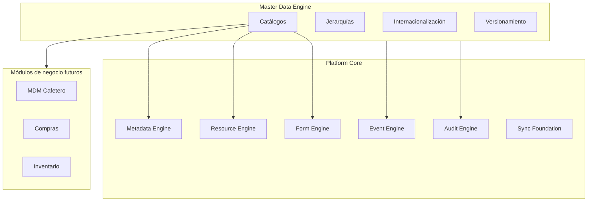
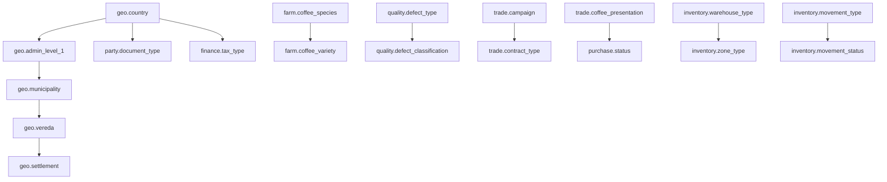

# AGROERP — Master Data Engine (Motor de Datos Maestros)

**Documento funcional maestro**  
**Versión:** 1.0  
**Estado:** Base oficial para diseño del MDM  
**Dependencias:** Platform Core, `DATA_GOVERNANCE_PLATFORM.md`, `COFFEE_DOMAIN.md`  
**Alcance:** Catálogos, jerarquías, motor dinámico — componente MDM del DGMP (sin pantallas ni procesos de negocio)

---

## 0. Propósito y principios

### 0.1 Objetivo

El **Master Data Engine (MDE)** es la **fuente única de verdad (SSOT)** para toda información de referencia, clasificación y parametrización de AGROERP. Ningún valor de catálogo crítico debe quedar hardcodeado en código, formularios o módulos de negocio.

### 0.2 Relación con el Platform Core



| Componente core | Uso del MDE |
|-----------------|-------------|
| **Metadata Engine** | Campos `enum`, `relation`, validaciones referencian catálogos por `catalogKey` |
| **Form Engine** | `select`, `multi_select` consumen listas dependientes del MDE |
| **Resource Engine** | Estados, tipos y clasificaciones en `data` / `metadata` validados contra catálogos |
| **Event Engine** | Eventos `CatalogCreated`, `CatalogItemUpdated`, etc. |
| **Audit Engine** | Diff de ítems de catálogo y versiones |
| **Sync Foundation** | Catálogos publicados descargables a Android offline |

### 0.3 Principios de diseño

1. **SSOT** — Un solo lugar define cada lista de valores.
2. **No hardcode** — Código solo conoce `catalogKey`, nunca valores fijos de negocio.
3. **Multi-tenant** — Catálogos globales (plataforma) + catálogos por organización.
4. **Jerárquico** — Divisiones políticas, taxonomías agronómicas, árboles de clasificación.
5. **Dependiente** — Listas en cascada (país → departamento → municipio → vereda).
6. **Versionado** — Cambios publicados sin romper datos históricos.
7. **Auditable** — Toda mutación genera evento y registro de auditoría.
8. **Offline-ready** — Snapshot de catálogos publicados para campo.
9. **i18n** — Etiquetas traducibles; códigos estables internos.
10. **Gobernado** — Roles claros de quién administra cada catálogo.

### 0.4 Taxonomía de catálogos

| Nivel | Código | Descripción | Ejemplo |
|-------|--------|-------------|---------|
| **L0 — Plataforma** | `platform.*` | Global, solo lectura para tenants | Países ISO, monedas ISO |
| **L1 — Global configurable** | `global.*` | Administrado por super-admin | Variedades café SCA |
| **L2 — Organización** | `org.*` | Por tenant, administrable | Tipos de visita internos |
| **L3 — Derivado / calculado** | `derived.*` | Generado por reglas | Lista dependiente en runtime |

### 0.5 Plantilla estándar de catálogo

Cada catálogo documentado en este documento sigue esta ficha:

| Atributo | Descripción |
|----------|-------------|
| **Nombre** | Identificador legible |
| **catalogKey** | Clave única estable (snake_case con namespace) |
| **Descripción** | Propósito del catálogo |
| **Jerarquía** | Plano / padre-hijo / multipadre |
| **Dependencias** | Catálogos que debe cargar antes |
| **Administrador** | Rol responsable de mantenimiento |
| **Configurable** | Si el tenant puede extender o solo consumir |
| **Obligatorio** | Si módulos requieren valores no vacíos |
| **Versionamiento** | `immutable` / `versioned` / `effective_date` |
| **Uso en el sistema** | Módulos y campos que lo referencian |

---

## 1. Arquitectura funcional del motor

### 1.1 Componentes del MDE

| Componente | Responsabilidad |
|----------|-----------------|
| **Catalog Registry** | Registro de definiciones de catálogos (metadata del catálogo) |
| **Catalog Item Store** | Ítems con código, etiqueta, atributos extra, vigencia |
| **Hierarchy Service** | Árboles padre-hijo, materialized path, closure table |
| **Dependency Resolver** | Listas en cascada y filtros contextuales |
| **Version Manager** | Draft → published → deprecated; effective dates |
| **i18n Layer** | Traducciones por locale (`es`, `en`, `pt`) |
| **Import/Export Engine** | CSV, Excel, JSON bulk |
| **Cache Layer** | Redis + cache local móvil |
| **Permission Guard** | RBAC por catálogo y operación |
| **Audit & Events** | Integración Event + Audit del core |

### 1.2 Modelo conceptual de un catálogo

```
CatalogDefinition
├── catalogKey          (único, inmutable)
├── namespace           (platform | global | org)
├── label               (i18n)
├── description         (i18n)
├── hierarchyType       (flat | tree | dependent)
├── parentCatalogKey    (si dependent)
├── itemSchema          (atributos extra por ítem)
├── versioningPolicy
├── configurableScope   (read_only | extend | full)
├── requiredModules[]
└── adminRoles[]

CatalogItem
├── id
├── catalogKey
├── code                (estable, inmutable tras publicar)
├── label               (i18n)
├── parentItemCode      (jerarquía)
├── attributes          (JSON según itemSchema)
├── sortOrder
├── status              (draft | active | inactive | deprecated)
├── effectiveFrom / effectiveTo
├── version
└── organizationId      (null = global)
```

### 1.3 Motor de catálogos dinámicos

Los catálogos **no son tablas fijas por lista**. Son **definiciones registradas** que el motor instancia:

- **Catálogo estático registrado** — Definido en seed/plataforma (ej. países ISO).
- **Catálogo extensible por organización** — Hereda ítems globales + permite ítems propios (ej. tipos de visita).
- **Catálogo puramente dinámico** — Creado por administrador sin despliegue (ej. lista de motivos de suspensión).

**Reglas del motor dinámico:**
- Alta de nuevo catálogo vía `CatalogDefinition` (permiso `masterdata:catalog:create`).
- Ítems validados contra `itemSchema` del catálogo.
- Publicación genera versión inmutable consumible por módulos.
- Referencias en Resources guardan `code` + `catalogVersion` para trazabilidad histórica.

### 1.4 Jerarquías

| Tipo | Mecanismo | Ejemplo |
|------|-----------|---------|
| **Árbol simple** | `parentItemCode` | Variedad → subvariedad |
| **Árbol geográfico** | Multinivel 4–6 niveles | País → Depto → Mpio → Vereda |
| **Taxonomía** | Múltiples hijos, un padre | Tipo defecto → subtipo |
| **Faceted** | Varios catálogos independientes | Color + proceso + certificación |

**Navegación:** `GET /catalogs/{key}/tree`, `GET /catalogs/{key}/children?parent={code}`

### 1.5 Listas dependientes

```
Contexto: { country: "CO", department: "05" }
Request:  GET /catalogs/geo.municipality/items?parent=05
Response: [ Medellín, Envigado, ... ]
```

**Cadena geográfica estándar AGROERP (Colombia-focused, extensible):**
`geo.country` → `geo.department` → `geo.municipality` → `geo.vereda` → `geo.settlement`

### 1.6 Internacionalización (i18n)

| Elemento | Traducible | Código estable |
|----------|------------|----------------|
| Etiqueta de catálogo | Sí | `catalogKey` |
| Etiqueta de ítem | Sí | `code` |
| Descripción larga | Sí | — |
| Código de ítem | **No** | `code` (inmutable) |

Locale por defecto: `es`. Fallback: `es` → `en` → `code`.

### 1.7 Importación y exportación masiva

| Formato | Import | Export |
|---------|--------|--------|
| CSV | Sí | Sí |
| Excel (XLSX) | Sí | Sí |
| JSON | Sí (API/sync) | Sí |

**Flujo import:** upload → validación → preview → aprobación → bulk insert → evento `CatalogBulkImported`  
**Modos:** `upsert`, `insert_only`, `replace_draft`

### 1.8 Versionamiento

| Política | Comportamiento |
|----------|----------------|
| `immutable` | Ítems publicados no editan; solo deprecar y crear nuevo código |
| `versioned` | Edición crea nueva versión; referencias históricas mantienen versión |
| `effective_date` | Ítems con vigencia; resolución por fecha de transacción |

**Estados de versión de catálogo:** `draft` → `published` → `deprecated`

### 1.9 Auditoría y eventos

| Evento | Cuándo |
|--------|--------|
| `CatalogDefinitionCreated` | Nuevo catálogo registrado |
| `CatalogItemCreated` | Nuevo ítem |
| `CatalogItemUpdated` | Cambio en ítem |
| `CatalogItemDeprecated` | Baja lógica |
| `CatalogVersionPublished` | Publicación de versión |
| `CatalogBulkImported` | Import masivo |
| `CatalogBulkExported` | Export masivo |

Toda mutación pasa por **Audit Engine** con diff before/after.

### 1.10 Permisos (RBAC)

| Permiso | Descripción |
|---------|-------------|
| `masterdata:catalog:read` | Consultar catálogos e ítems |
| `masterdata:catalog:create` | Crear definiciones de catálogo (org) |
| `masterdata:item:create` | Agregar ítems |
| `masterdata:item:update` | Modificar ítems draft o extensibles |
| `masterdata:item:publish` | Publicar versión |
| `masterdata:item:deprecate` | Deprecar ítems |
| `masterdata:import` | Import masivo |
| `masterdata:export` | Export masivo |
| `masterdata:admin` | Catálogos L0/L1 plataforma |

### 1.11 API funcional (contrato, sin implementación)

| Método | Ruta | Descripción |
|--------|------|-------------|
| GET | `/masterdata/catalogs` | Listar definiciones |
| GET | `/masterdata/catalogs/{key}` | Definición + schema |
| POST | `/masterdata/catalogs` | Registrar catálogo org |
| GET | `/masterdata/catalogs/{key}/items` | Ítems (filtros, paginación) |
| GET | `/masterdata/catalogs/{key}/items/{code}` | Ítem por código |
| GET | `/masterdata/catalogs/{key}/tree` | Árbol jerárquico |
| GET | `/masterdata/catalogs/{key}/items?parent={code}` | Lista dependiente |
| POST | `/masterdata/catalogs/{key}/items` | Crear ítem |
| PATCH | `/masterdata/catalogs/{key}/items/{code}` | Actualizar |
| POST | `/masterdata/catalogs/{key}/publish` | Publicar versión |
| POST | `/masterdata/catalogs/{key}/import` | Import masivo |
| GET | `/masterdata/catalogs/{key}/export` | Export |
| GET | `/masterdata/bootstrap` | Snapshot offline (todos publicados) |

### 1.12 Estrategia de cache

| Capa | TTL | Invalidación |
|------|-----|--------------|
| Redis (servidor) | 1–24h según catálogo | Evento `CatalogVersionPublished` |
| CDN / edge | Solo catálogos L0 | Versión en ETag |
| Android Room | Hasta próximo bootstrap | Sync tras publicación |
| In-process | 5 min | Miss tras evento |

**Clave cache:** `md:{orgId}:{catalogKey}:v{version}`

---

## 2. Índice maestro de catálogos

Total: **104 catálogos** organizados en **19 dominios**.

| # | Dominio | Cantidad | Namespace |
|---|---------|----------|-----------|
| 1 | Geografía y territorio | 12 | `geo.*` |
| 2 | Personas y documentos | 8 | `party.*` |
| 3 | Organización y RRHH | 7 | `org.*` |
| 4 | Productor y relación comercial | 9 | `producer.*` |
| 5 | Finca, cultivo y agronomía | 14 | `farm.*` |
| 6 | Comercial y contratos | 10 | `trade.*` |
| 7 | Compras y liquidación | 8 | `purchase.*` |
| 8 | Logística y transporte | 7 | `logistics.*` |
| 9 | Calidad y catación | 12 | `quality.*` |
| 10 | Proceso postcosecha | 6 | `process.*` |
| 11 | Inventario y bodega | 9 | `inventory.*` |
| 12 | Finanzas y fiscal | 8 | `finance.*` |
| 13 | Certificaciones | 5 | `cert.*` |
| 14 | Visitas, formularios y campo | 7 | `field.*` |
| 15 | Documentos y evidencias | 8 | `document.*` |
| 16 | Plataforma, seguridad y sync | 9 | `platform.*` |
| 17 | Notificaciones y alertas | 6 | `notify.*` |
| 18 | Gobierno, riesgos y auditoría | 5 | `governance.*` |
| 19 | Unidades, empaques y medidas | 6 | `uom.*` |

---

## 3. Dominio 1 — Geografía y territorio (`geo.*`)

Catálogos para ubicación, división política y referencia espacial. Base de fincas, visitas, geofencing y reportes territoriales.

### 3.1 `geo.country` — Países

| Atributo | Valor |
|----------|-------|
| **Nombre** | Países |
| **catalogKey** | `geo.country` |
| **Descripción** | Países según ISO 3166-1 alpha-2; raíz de jerarquía geográfica |
| **Jerarquía** | Raíz (plano con código ISO) |
| **Dependencias** | Ninguna |
| **Administrador** | Administrador plataforma (L0) |
| **Configurable** | Solo lectura para tenants; extensión no permitida |
| **Obligatorio** | Sí — toda dirección/finca requiere país |
| **Versionamiento** | `immutable` — cambios vía deprecación |
| **Uso** | Productor, Finca, Bodega, Sede, Contrato, Reportes |

**Atributos extra ítem:** `iso_alpha2`, `iso_alpha3`, `numeric_code`, `phone_prefix`

---

### 3.2 `geo.admin_level_1` — Departamentos / Estados / Provincias

| Atributo | Valor |
|----------|-------|
| **Nombre** | División administrativa nivel 1 |
| **catalogKey** | `geo.admin_level_1` |
| **Descripción** | Departamento (CO), Estado (MX), Provincia (EC), etc. |
| **Jerarquía** | Hijo de `geo.country` |
| **Dependencias** | `geo.country` |
| **Administrador** | Administrador plataforma + editor geo por país |
| **Configurable** | Lectura; ítems por país importables |
| **Obligatorio** | Sí para direcciones rurales completas |
| **Versionamiento** | `versioned` |
| **Uso** | Finca, Rutas, KPIs por región, Asignación de cartera |

**Atributos extra:** `country_code`, `dane_code` (CO), `geojson_id`

---

### 3.3 `geo.municipality` — Municipios

| Atributo | Valor |
|----------|-------|
| **Nombre** | Municipios |
| **catalogKey** | `geo.municipality` |
| **Descripción** | Municipio o equivalente (cantón, distrito) |
| **Jerarquía** | Hijo de `geo.admin_level_1` |
| **Dependencias** | `geo.country`, `geo.admin_level_1` |
| **Administrador** | Administrador plataforma / datos maestros org |
| **Configurable** | Import masivo por país |
| **Obligatorio** | Sí en registro de finca |
| **Versionamiento** | `versioned` |
| **Uso** | Finca, Productor, Logística, Precios por zona |

---

### 3.4 `geo.vereda` — Veredas / Corregimientos

| Atributo | Valor |
|----------|-------|
| **Nombre** | Veredas y subdivisiones rurales |
| **catalogKey** | `geo.vereda` |
| **Descripción** | Subdivisión rural bajo municipio (vereda, corregimiento, caserío rural) |
| **Jerarquía** | Hijo de `geo.municipality` |
| **Dependencias** | `geo.municipality` |
| **Administrador** | Datos maestros org (alta frecuencia de actualización) |
| **Configurable** | Sí — tenants agregan veredas no oficiales |
| **Obligatorio** | Recomendado; obligatorio según política org |
| **Versionamiento** | `versioned` |
| **Uso** | Finca, Visitas, Rutas de campo |

---

### 3.5 `geo.settlement` — Centros poblados

| Atributo | Valor |
|----------|-------|
| **Nombre** | Centros poblados |
| **catalogKey** | `geo.settlement` |
| **Descripción** | Poblado, caserío, centro poblado DANE u homólogo |
| **Jerarquía** | Hijo de `geo.vereda` o `geo.municipality` |
| **Dependencias** | `geo.municipality` |
| **Administrador** | Datos maestros org |
| **Configurable** | Sí |
| **Obligatorio** | No |
| **Versionamiento** | `versioned` |
| **Uso** | Dirección productor, Puntos de acopio local |

---

### 3.6 `geo.zone` — Zonas agrocomerciales

| Atributo | Valor |
|----------|-------|
| **Nombre** | Zonas comerciales / de compra |
| **catalogKey** | `geo.zone` |
| **Descripción** | Agrupación operativa interna (no política): Eje cafetero, Norte, Sur |
| **Jerarquía** | Plano; puede mapear a municipios vía atributo |
| **Dependencias** | Opcional `geo.municipality` (many-to-many en atributos) |
| **Administrador** | Gerencia comercial / Administrador org |
| **Configurable** | Sí — totalmente por organización |
| **Obligatorio** | Sí para política de precios y asignación |
| **Versionamiento** | `effective_date` |
| **Uso** | Contratos, Precios, Cartera técnico/comprador, KPIs |

---

### 3.7 `geo.altitude_band` — Bandas de altitud

| Atributo | Valor |
|----------|-------|
| **Nombre** | Bandas de altitud |
| **catalogKey** | `geo.altitude_band` |
| **Descripción** | Rangos msnm para clasificación productiva (ej. 1200–1600) |
| **Jerarquía** | Plano |
| **Dependencias** | Ninguna |
| **Administrador** | Administrador plataforma + org |
| **Configurable** | Org extiende bandas |
| **Obligatorio** | No; recomendado en finca |
| **Versionamiento** | `versioned` |
| **Uso** | Finca, Calidad esperada, Reportes |

---

### 3.8 `geo.climate_zone` — Zonas climáticas

| Atributo | Valor |
|----------|-------|
| **Nombre** | Zonas climáticas de referencia |
| **catalogKey** | `geo.climate_zone` |
| **Descripción** | Holdridge, Köppen simplificado o zonas internas |
| **Jerarquía** | Plano |
| **Dependencias** | Ninguna |
| **Administrador** | Plataforma |
| **Configurable** | Lectura |
| **Obligatorio** | No |
| **Versionamiento** | `immutable` |
| **Uso** | Finca, Riesgos, IA predicción |

---

### 3.9 `geo.coordinate_system` — Sistemas de coordenadas

| Atributo | Valor |
|----------|-------|
| **Nombre** | Sistemas de referencia espacial |
| **catalogKey** | `geo.coordinate_system` |
| **Descripción** | WGS84, MAGNA-SIRGAS, etc. |
| **Jerarquía** | Plano |
| **Dependencias** | Ninguna |
| **Administrador** | Plataforma |
| **Configurable** | No |
| **Obligatorio** | Sí en captura GPS (default WGS84) |
| **Versionamiento** | `immutable` |
| **Uso** | GPS, Polígonos, Integración GIS |

---

### 3.10 `geo.gps_capture_mode` — Modos de captura GPS

| Atributo | Valor |
|----------|-------|
| **Nombre** | Modos de captura GPS |
| **catalogKey** | `geo.gps_capture_mode` |
| **Descripción** | Punto único, track, polígono, geofence |
| **Jerarquía** | Plano |
| **Dependencias** | Ninguna |
| **Administrador** | Plataforma |
| **Configurable** | No |
| **Obligatorio** | Sí en Form Engine / visitas |
| **Versionamiento** | `immutable` |
| **Uso** | Formularios, Visitas, Evidencias |

---

### 3.11 `geo.gps_accuracy_class` — Clases de precisión GPS

| Atributo | Valor |
|----------|-------|
| **Nombre** | Clases de precisión GPS |
| **catalogKey** | `geo.gps_accuracy_class` |
| **Descripción** | Alta (&lt;10m), Media (10–50m), Baja (&gt;50m), Inválida |
| **Jerarquía** | Plano |
| **Dependencias** | Ninguna |
| **Administrador** | Plataforma |
| **Configurable** | Umbrales configurables por org |
| **Obligatorio** | Sí para validación de visitas |
| **Versionamiento** | `versioned` |
| **Uso** | Validación campo, Auditoría |

---

### 3.12 `geo.slope_class` — Clases de pendiente

| Atributo | Valor |
|----------|-------|
| **Nombre** | Clases de pendiente del terreno |
| **catalogKey** | `geo.slope_class` |
| **Descripción** | Plano, ondulado, pendiente media, fuerte |
| **Jerarquía** | Plano |
| **Dependencias** | Ninguna |
| **Administrador** | Plataforma + org |
| **Configurable** | Sí |
| **Obligatorio** | No |
| **Versionamiento** | `versioned` |
| **Uso** | Finca, Lote, Visitas técnicas |

---

## 4. Dominio 2 — Personas y documentos (`party.*`)

### 4.1 `party.document_type` — Tipos de documento de identidad

| Atributo | Valor |
|----------|-------|
| **catalogKey** | `party.document_type` |
| **Descripción** | CC, CE, NIT, Pasaporte, RUT, DPI, etc. |
| **Jerarquía** | Plano; filtro por `country_code` en atributos |
| **Dependencias** | `geo.country` |
| **Administrador** | Plataforma |
| **Configurable** | Por país |
| **Obligatorio** | Sí en registro productor/empleado |
| **Versionamiento** | `immutable` |
| **Uso** | Productor, Empleado, Contratos, Pagos |

### 4.2 `party.gender` — Géneros

| Atributo | Valor |
|----------|-------|
| **catalogKey** | `party.gender` |
| **Descripción** | Identidad de género para registro demográfico |
| **Jerarquía** | Plano |
| **Dependencias** | Ninguna |
| **Administrador** | Plataforma |
| **Configurable** | Org puede extender con inclusión |
| **Obligatorio** | Según política org (recomendado opcional) |
| **Versionamiento** | `versioned` |
| **Uso** | Productor, Empleado, Reportes inclusión |

### 4.3 `party.marital_status` — Estados civiles

| Atributo | Valor |
|----------|-------|
| **catalogKey** | `party.marital_status` |
| **Descripción** | Soltero, casado, unión libre, viudo, etc. |
| **Jerarquía** | Plano |
| **Dependencias** | Ninguna |
| **Administrador** | Plataforma |
| **Configurable** | Lectura |
| **Obligatorio** | No |
| **Versionamiento** | `immutable` |
| **Uso** | Productor, Beneficiarios |

### 4.4 `party.legal_person_type` — Tipos de persona

| Atributo | Valor |
|----------|-------|
| **catalogKey** | `party.legal_person_type` |
| **Descripción** | Natural, jurídica, cooperativa, comunidad étnica |
| **Jerarquía** | Plano |
| **Dependencias** | Ninguna |
| **Administrador** | Plataforma |
| **Configurable** | Lectura |
| **Obligatorio** | Sí en productor |
| **Versionamiento** | `immutable` |
| **Uso** | Productor, Contratos, Facturación |

### 4.5 `party.relationship_type` — Tipos de relación entre personas

| Atributo | Valor |
|----------|-------|
| **catalogKey** | `party.relationship_type` |
| **Descripción** | Cónyuge, hijo, apoderado, socio, contacto finca |
| **Jerarquía** | Plano |
| **Dependencias** | Ninguna |
| **Administrador** | Org |
| **Configurable** | Sí |
| **Obligatorio** | No |
| **Versionamiento** | `versioned` |
| **Uso** | Contactos productor, Firmas autorizadas |

### 4.6 `party.education_level` — Nivel educativo

| Atributo | Valor |
|----------|-------|
| **catalogKey** | `party.education_level` |
| **Descripción** | Ninguno, primaria, secundaria, técnico, universitario |
| **Jerarquía** | Plano |
| **Dependencias** | Ninguna |
| **Administrador** | Plataforma |
| **Configurable** | Lectura |
| **Obligatorio** | No |
| **Versionamiento** | `immutable` |
| **Uso** | Productor, Programas sociales |

### 4.7 `party.ethnic_group` — Grupos étnicos

| Atributo | Valor |
|----------|-------|
| **catalogKey** | `party.ethnic_group` |
| **Descripción** | Clasificación étnica según normativa país (DANE CO) |
| **Jerarquía** | Plano |
| **Dependencias** | `geo.country` |
| **Administrador** | Plataforma por país |
| **Configurable** | Lectura |
| **Obligatorio** | Según reporte regulatorio |
| **Versionamiento** | `versioned` |
| **Uso** | Productor, Certificaciones, Reportes |

### 4.8 `party.language` — Idiomas preferidos

| Atributo | Valor |
|----------|-------|
| **catalogKey** | `party.language` |
| **Descripción** | ISO 639-1 para comunicación con productor |
| **Jerarquía** | Plano |
| **Dependencias** | Ninguna |
| **Administrador** | Plataforma |
| **Configurable** | No |
| **Obligatorio** | No |
| **Versionamiento** | `immutable` |
| **Uso** | Productor, Notificaciones i18n |

---

## 5. Dominio 3 — Organización y RRHH (`org.*`)

| catalogKey | Nombre | Jerarquía | Admin | Configurable | Obligatorio | Versionamiento | Uso principal |
|------------|--------|-----------|-------|--------------|-------------|----------------|---------------|
| `org.unit_type` | Tipos de unidad organizacional | Plano | Plataforma | Lectura | Sí | immutable | Sede, regional, bodega, oficina |
| `org.role_template` | Plantillas de rol | Plano | Plataforma | Lectura | Sí | versioned | RBAC seed por industria |
| `org.permission_module` | Módulos de permiso | Plano | Plataforma | No | Sí | immutable | RBAC |
| `org.job_title` | Cargos / títulos laborales | Plano | Org | Sí | No | versioned | Empleado |
| `org.employment_type` | Tipos de vinculación laboral | Plano | Org | Sí | Sí | versioned | Empleado, nómina futura |
| `org.department` | Departamentos internos | Árbol | Org | Sí | No | versioned | Estructura interna |
| `org.cost_center` | Centros de costo | Árbol | Org / Finanzas | Sí | Sí | effective_date | Compras, inventario, pagos |

**Ficha detallada — `org.unit_type`:** Tipos de sede operativa (regional comercial, centro acopio, oficina administrativa, laboratorio). Dependencias: ninguna. Usado en Organization hierarchy y asignación territorial.

---

## 6. Dominio 4 — Productor y relación comercial (`producer.*`)

| catalogKey | Nombre | Jerarquía | Dependencias | Admin | Config | Oblig | Versión | Uso |
|------------|--------|-----------|--------------|-------|--------|-------|---------|-----|
| `producer.type` | Tipos de productor | Plano | — | Plataforma+Org | Extender | Sí | versioned | Micro, pequeño, mediano, asociación |
| `producer.category` | Categoría comercial | Plano | `producer.type` | Org | Sí | Sí | effective_date | Cartera, precios |
| `producer.status` | Estados del productor | Plano | — | Plataforma | Lectura | Sí | immutable | Alineado COFFEE_DOMAIN |
| `producer.segment` | Segmentos / estratos | Plano | — | Org | Sí | No | versioned | Marketing, KPIs |
| `producer.lead_source` | Origen del productor | Plano | — | Org | Sí | No | versioned | Captación |
| `producer.bank_account_type` | Tipos cuenta bancaria | Plano | `geo.country` | Plataforma | Por país | Sí | immutable | Pagos |
| `producer.payment_preference` | Preferencia de pago | Plano | — | Org | Sí | No | versioned | Finanzas |
| `producer.suspension_reason` | Motivos de suspensión | Plano | — | Org | Sí | Sí | versioned | Gobierno |
| `producer.association_role` | Rol en asociación | Plano | — | Org | Sí | No | versioned | Grupos, cooperativas |

---

## 7. Dominio 5 — Finca, cultivo y agronomía (`farm.*`)

| catalogKey | Nombre | Jerarquía | Dependencias | Admin | Config | Oblig | Versión | Uso |
|------------|--------|-----------|--------------|-------|--------|-------|---------|-----|
| `farm.type` | Tipos de finca | Plano | — | Org | Sí | Sí | versioned | Familiar, comercial, modelo |
| `farm.tenure_type` | Tenencia del predio | Plano | — | Plataforma | Lectura | Sí | immutable | Propiedad, arriendo, usufructo |
| `farm.lot_type` | Tipos de lote productivo | Plano | — | Org | Sí | Sí | versioned | Producción, reserva, renovación |
| `farm.crop_type` | Tipos de cultivo | Árbol | — | Plataforma | Extender | Sí | versioned | Café, sombrío, intercalado |
| `farm.coffee_species` | Especies de café | Plano | — | Plataforma | No | Sí | immutable | Arabica, Canephora |
| `farm.coffee_variety` | Variedades de café | Árbol | `farm.coffee_species` | Plataforma+Org | Extender | Sí | versioned | Lote, contrato, calidad |
| `farm.shade_system` | Sistemas de sombrío | Plano | — | Plataforma | Lectura | No | versioned | Finca, lote |
| `farm.shade_species` | Especies de sombrío | Plano | `farm.shade_system` | Org | Sí | No | versioned | Visitas |
| `farm.planting_density_band` | Bandas de densidad | Plano | — | Org | Sí | No | versioned | Lote |
| `farm.production_system` | Sistemas productivos | Plano | — | Plataforma | Lectura | Sí | versioned | Convencional, agroforestal |
| `farm.irrigation_type` | Tipos de riego | Plano | — | Plataforma | Lectura | No | immutable | Finca, visitas |
| `farm.infrastructure_type` | Tipos infraestructura finca | Plano | — | Org | Sí | No | versioned | Beneficio húmedo, secador |
| `farm.phenological_stage` | Estados fenológicos | Plano | — | Plataforma | Lectura | No | versioned | Visitas, IA |
| `farm.harvest_type` | Tipos de cosecha | Plano | — | Org | Sí | Sí | versioned | Selectiva, strip |

**Nota:** `farm.coffee_variety` es jerárquico: Especie → Variedad → (opcional) Clon/Subvariedad.

---

## 8. Dominio 6 — Comercial y contratos (`trade.*`)

| catalogKey | Nombre | Jerarquía | Admin | Config | Oblig | Versión | Uso |
|------------|--------|-----------|-------|--------|-------|---------|-----|
| `trade.campaign` | Campañas cafeteras | Plano | Org | Sí | Sí | effective_date | Contratos, compras, KPIs |
| `trade.contract_type` | Tipos de contrato | Plano | Org | Sí | Sí | versioned | Compra fija, opción, spot |
| `trade.contract_status` | Estados de contrato | Plano | Plataforma | Lectura | Sí | immutable | Workflow contrato |
| `trade.coffee_presentation` | Presentación del café | Plano | Plataforma | Lectura | Sí | immutable | Cereza, pergamino, oro |
| `trade.price_type` | Tipos de precio | Plano | Org | Sí | Sí | effective_date | Base, NY diferencial |
| `trade.incoterm` | Incoterms | Plano | Plataforma | No | No | immutable | Exportación futura |
| `trade.premium_type` | Tipos de prima | Plano | Org | Sí | Sí | versioned | Certificación, taza, orgánico |
| `trade.discount_type` | Tipos de descuento | Plano | Org | Sí | Sí | versioned | Humedad, defectos |
| `trade.payment_term` | Condiciones de pago | Plano | Org | Sí | Sí | effective_date | Contrato, liquidación |
| `trade.commercial_policy` | Políticas comerciales | Árbol | Gerencia | Sí | Sí | effective_date | Reglas de negocio |

---

## 9. Dominio 7 — Compras y liquidación (`purchase.*`)

| catalogKey | Nombre | Admin | Oblig | Versión | Uso |
|------------|--------|-------|-------|---------|-----|
| `purchase.order_status` | Estados orden/pre-orden | Plataforma | Sí | immutable | Compras |
| `purchase.status` | Estados de compra | Plataforma | Sí | immutable | Compras |
| `purchase.rejection_reason` | Motivos de rechazo | Org | Sí | versioned | Recepción, calidad |
| `purchase.liquidation_status` | Estados liquidación | Plataforma | Sí | immutable | Finanzas |
| `purchase.advance_type` | Tipos de anticipo | Org | Sí | versioned | Pagos |
| `purchase.settlement_formula` | Fórmulas de liquidación | Org | Sí | effective_date | Cálculo automático |
| `purchase.weighing_method` | Métodos de pesaje | Org | Sí | versioned | Báscula, estimado |
| `purchase.delivery_point_type` | Tipos punto de entrega | Org | No | versioned | Finca, acopio, bodega |

---

## 10. Dominio 8 — Logística y transporte (`logistics.*`)

| catalogKey | Nombre | Jerarquía | Admin | Oblig | Uso |
|------------|--------|-----------|-------|-------|-----|
| `logistics.vehicle_type` | Tipos de vehículo | Plano | Org | Sí | Camión, moto, mulero |
| `logistics.vehicle_body_type` | Tipos de carrocería | Plano | Org | No | Furgón, volqueta |
| `logistics.transport_mode` | Modos de transporte | Plano | Plataforma | Sí | Terrestre, fluvial |
| `logistics.trip_status` | Estados del viaje | Plano | Plataforma | Sí | En tránsito, entregado |
| `logistics.load_unit_type` | Tipos de unidad de cargue | Plano | Org | Sí | Saco, granel, big-bag |
| `logistics.incident_type` | Tipos de novedad logística | Plano | Org | Sí | Retraso, derrame |
| `logistics.route_type` | Tipos de ruta | Plano | Org | No | Recolección, despacho |

---

## 11. Dominio 9 — Calidad y catación (`quality.*`)

| catalogKey | Nombre | Jerarquía | Dependencias | Oblig | Uso |
|------------|--------|-----------|--------------|-------|-----|
| `quality.sample_type` | Tipos de muestra | Plano | — | Sí | Recepción, contrato, disputa |
| `quality.sample_status` | Estados de muestra | Plano | — | Sí | Laboratorio |
| `quality.analysis_type` | Tipos de análisis | Plano | — | Sí | Físico, sensorial, ambos |
| `quality.analysis_status` | Estados de análisis | Plano | — | Sí | Workflow calidad |
| `quality.cupping_protocol` | Protocolos de catación | Plano | — | Sí | SCA, CQI, interno |
| `quality.cup_profile` | Perfiles de taza comerciales | Plano | — | Sí | Comercial, clasificación |
| `quality.defect_type` | Tipos de defectos | Árbol | — | Sí | Primario, secundario |
| `quality.defect_classification` | Clasificación defectos | Plano | `quality.defect_type` | Sí | Puntaje, descuento |
| `quality.moisture_class` | Clases de humedad | Plano | — | Sí | Descuentos automáticos |
| `quality.color_classification` | Clasificación color pergamino | Plano | — | No | Físico |
| `quality.screen_size` | Mallas / zarandas | Plano | — | No | Granulometría |
| `quality.dictamen` | Dictámenes de calidad | Plano | — | Sí | Aprobado, rechazado, condicionado |

**Atributos típicos en `quality.defect_type`:** `category` (primary/secondary), `sca_equivalent`, `max_allowed_pct`, `discount_formula_ref`

**Atributos en `quality.moisture_class`:** `min_pct`, `max_pct`, `discount_pct`, `reject_above`

---

## 12. Dominio 10 — Proceso postcosecha (`process.*`)

| catalogKey | Nombre | Admin | Uso |
|------------|--------|-------|-----|
| `process.drying_type` | Tipos de secado | Plataforma+Org | Solar, mecánico, mixto |
| `process.drying_surface` | Superficies de secado | Org | Elba, marquesina, patio |
| `process.benefit_type` | Tipos de beneficio | Plataforma | Húmedo, seco, mixto |
| `process.fermentation_type` | Tipos de fermentación | Org | Aeróbica, anaeróbica, carbonic |
| `process.washing_grade` | Grados de lavado | Plataforma | Fully washed, honey, natural |
| `process.maturity_level` | Niveles de madurez cereza | Plataforma | Visitas, compra cereza |

---

## 13. Dominio 11 — Inventario y bodega (`inventory.*`)

| catalogKey | Nombre | Jerarquía | Oblig | Uso |
|------------|--------|-----------|-------|-----|
| `inventory.warehouse_type` | Tipos de bodega | Plano | Sí | Acopio, trilla, cuarentena |
| `inventory.zone_type` | Tipos de zona en bodega | Plano | Sí | Silo, pila, temporal |
| `inventory.lot_type` | Tipos de lote inventario | Plano | Sí | Origen único, mezcla |
| `inventory.movement_type` | Tipos de movimiento | Plano | Sí | Entrada, salida, traslado, ajuste, merma |
| `inventory.movement_status` | Estados de movimiento | Plano | Sí | Sync offline |
| `inventory.stock_status` | Estados de stock | Plano | Sí | Disponible, cuarentena, reservado |
| `inventory.count_type` | Tipos de conteo físico | Plano | No | Cíclico, anual |
| `inventory.shrinkage_cause` | Causas de merma | Plano | Sí | Secado, robo, manipulación |
| `inventory.dispatch_type` | Tipos de despacho | Plano | Sí | Venta, beneficio, exportación |

---

## 14. Dominio 12 — Finanzas y fiscal (`finance.*`)

| catalogKey | Nombre | Jerarquía | Admin | Oblig | Uso |
|------------|--------|-----------|-------|-------|-----|
| `finance.currency` | Monedas | Plano | Plataforma ISO | Sí | Contratos, pagos |
| `finance.exchange_rate_source` | Fuentes tasa de cambio | Plano | Org | No | Liquidación |
| `finance.tax_type` | Tipos de impuesto | Plano | Plataforma país | Sí | Retención, IVA |
| `finance.tax_rate` | Tasas impositivas | Plano | `finance.tax_type` | Sí | effective_date |
| `finance.payment_method` | Métodos de pago | Plano | Org | Sí | Transferencia, efectivo |
| `finance.payment_status` | Estados de pago | Plano | Plataforma | Sí | Workflow tesorería |
| `finance.invoice_type` | Tipos documento fiscal | Plano | País | Sí | Documento soporte |
| `finance.accounting_account` | Plan de cuentas | Árbol | Finanzas | No | Integración contable |

---

## 15. Dominio 13 — Certificaciones (`cert.*`)

| catalogKey | Nombre | Jerarquía | Oblig | Uso |
|------------|--------|-----------|-------|-----|
| `cert.scheme` | Esquemas de certificación | Plano | Sí | Orgánico, Fairtrade, RA |
| `cert.status` | Estados certificación | Plano | Sí | Vigente, vencida, suspendida |
| `cert.scope_type` | Alcance certificación | Plano | Sí | Finca, lote, productor, grupo |
| `cert.audit_result` | Resultados auditoría cert | Plano | Sí | Certificación externa |
| `cert.requirement_category` | Categorías de requisito | Árbol | No | BPA, ambiental, social |

---

## 16. Dominio 14 — Visitas, formularios y campo (`field.*`)

| catalogKey | Nombre | Admin | Config | Oblig | Uso |
|------------|--------|-------|--------|-------|-----|
| `field.visit_type` | Tipos de visita | Org | Sí | Sí | Inicial, seguimiento, auditoría |
| `field.visit_status` | Estados de visita | Plataforma | No | Sí | Workflow visita |
| `field.visit_objective` | Objetivos de visita | Org | Sí | No | Agenda |
| `field.finding_type` | Tipos de hallazgo | Árbol | Org | Sí | Sanidad, nutrición, BPA |
| `field.finding_severity` | Severidad de hallazgo | Plano | Plataforma | Sí | Crítico, medio, bajo |
| `field.recommendation_type` | Tipos de recomendación | Plano | Org | Sí | Visitas |
| `field.form_category` | Categorías de formulario | Plano | Org | Sí | Form Engine |

---

## 17. Dominio 15 — Documentos y evidencias (`document.*`)

| catalogKey | Nombre | Oblig | Uso |
|------------|--------|-------|-----|
| `document.type` | Tipos de documento | Sí | Contrato, acta, cédula, guía |
| `document.status` | Estados documentales | Sí | Vigente, vencido, rechazado |
| `document.file_type` | Tipos de archivo | Sí | PDF, imagen, video |
| `document.photo_type` | Tipos de fotografía | Sí | Evidencia, documento, panorámica |
| `document.video_type` | Tipos de video | No | Entrevista, recorrido |
| `document.audio_type` | Tipos de audio | No | Nota de voz |
| `document.signature_type` | Tipos de firma | Sí | Productor, técnico, testigo |
| `document.retention_policy` | Políticas de retención | Sí | Gobierno documental |

---

## 18. Dominio 16 — Plataforma, seguridad y sync (`platform.*`)

| catalogKey | Nombre | Admin | Oblig | Uso |
|------------|--------|-------|-------|-----|
| `platform.user_status` | Estados de usuario | Plataforma | Sí | Identity |
| `platform.permission_action` | Acciones RBAC | Plataforma | Sí | create, read, update... |
| `platform.permission_scope` | Alcances RBAC | Plataforma | Sí | org, own, zone |
| `platform.resource_type_registry` | Registro tipos de recurso | Plataforma | Sí | Metadata Engine |
| `platform.event_type_registry` | Registro tipos de evento | Plataforma | Sí | Event Engine |
| `platform.sync_status` | Estados de sincronización | Plataforma | Sí | pending, synced, conflict |
| `platform.sync_conflict_strategy` | Estrategias de conflicto | Plataforma | Sí | LWW, server_wins |
| `platform.device_platform` | Plataformas de dispositivo | Plataforma | Sí | android, web |
| `platform.sensor_type` | Tipos de sensor IoT | Plataforma+Org | No | Báscula, humedad, GPS |

---

## 19. Dominio 17 — Notificaciones y alertas (`notify.*`)

| catalogKey | Nombre | Config | Uso |
|------------|--------|--------|-----|
| `notify.channel` | Canales de notificación | Lectura | push, email, sms, in-app |
| `notify.priority` | Prioridades | Lectura | crítica, alta, normal |
| `notify.alert_type` | Tipos de alerta | Sí | Contrato vence, sync fallido |
| `notify.alert_status` | Estados de alerta | Lectura | activa, reconocida, cerrada |
| `notify.template_category` | Categorías de plantilla | Sí | Mensajes |
| `notify.subscription_topic` | Temas de suscripción | Sí | Preferencias usuario |

---

## 20. Dominio 18 — Gobierno, riesgos y auditoría (`governance.*`)

| catalogKey | Nombre | Config | Uso |
|------------|--------|--------|-----|
| `governance.risk_type` | Tipos de riesgo | Sí | Comercial, operativo, legal |
| `governance.risk_level` | Niveles de riesgo | Lectura | Bajo, medio, alto, crítico |
| `governance.audit_type` | Tipos de auditoría | Sí | Interna, certificación, campo |
| `governance.audit_finding_type` | Tipos hallazgo auditoría | Sí | No conformidad |
| `governance.exception_type` | Tipos de excepción de negocio | Sí | Override de reglas |

---

## 21. Dominio 19 — Unidades, empaques y medidas (`uom.*`)

| catalogKey | Nombre | Jerarquía | Oblig | Uso |
|------------|--------|-----------|-------|-----|
| `uom.unit` | Unidades de medida | Plano | Sí | kg, lb, arroba, carga |
| `uom.unit_category` | Categorías de unidad | Plano | Sí | Peso, volumen, área |
| `uom.conversion` | Conversiones entre unidades | Plano | Sí | kg↔lb; atributos `from`,`to`,`factor` |
| `uom.packaging_type` | Tipos de empaque | Plano | Sí | Granel, saco, big-bag |
| `uom.sack_type` | Tipos de saco | Plano | Sí | 70kg, 60kg; atributo `standard_kg` |
| `uom.area_unit` | Unidades de área | Plano | Sí | ha, m², fanegada |

**Nota:** `uom.conversion` permite conversiones configurables sin hardcode en liquidaciones.

---

## 22. Mapa de dependencias entre catálogos



### 22.1 Orden de carga (bootstrap)

1. `platform.*`, `geo.country`, `finance.currency`, `uom.*`
2. `geo.admin_level_1` → `geo.municipality` → `geo.vereda`
3. `party.*`, `farm.coffee_species` → `farm.coffee_variety`
4. `quality.*`, `process.*`
5. `trade.*`, `purchase.*`, `inventory.*`
6. Catálogos `org.*` específicos del tenant

---

## 23. Matriz de gobierno — quién administra qué

| Rol | Catálogos |
|-----|-----------|
| **Super Admin plataforma** | L0: `geo.country`, `finance.currency`, `platform.*`, semillas globales |
| **Admin organización** | `org.*`, `geo.zone`, `producer.*` extensibles, `field.*` |
| **Gerencia comercial** | `trade.commercial_policy`, `trade.campaign`, `trade.price_type` |
| **Supervisor calidad** | `quality.*`, `process.*` extensión org |
| **Supervisor campo** | `field.visit_type`, `field.finding_type`, `geo.vereda` |
| **Finanzas** | `finance.tax_rate`, `finance.payment_method`, `org.cost_center` |
| **Auditor** | Solo lectura de todos; sugiere cambios vía workflow |
| **Técnico / Comprador** | Solo consumo; sin mutación |

---

## 24. Integración con motores AGROERP

### 24.1 Metadata Engine

Los campos de schema referencian catálogos:

```json
{
  "key": "coffee_variety",
  "type": "relation",
  "label": "Variedad",
  "catalogKey": "farm.coffee_variety",
  "parentField": "coffee_species",
  "required": true
}
```

Validación: el valor debe existir en catálogo publicado; opcionalmente congelar `catalogVersion`.

### 24.2 Form Engine

- `select` / `multi_select` → `catalogKey`
- Listas dependientes → `parentField` + API `/items?parent=`
- Offline: snapshot en bootstrap móvil

### 24.3 Resource Engine

- `status` de recursos → catálogos `*.status`
- `metadata.classifications` → múltiples catalogKeys
- Histórico: guardar `code` + `catalogVersion` en `data`

### 24.4 Reglas de negocio (futuro Rules Engine)

Las reglas referencian códigos de catálogo, no IDs internos:

```
IF quality.moisture_class = "HIGH" THEN apply discount_type "HUMIDITY_SURCHARGE"
```

---

## 25. Estrategia de semillas (seed) y datos iniciales

| Paquete | Contenido | Carga |
|---------|-----------|-------|
| **Seed L0** | Países, monedas, UOM base, estados plataforma | Instalación |
| **Seed L1 Colombia** | Departamentos, municipios DANE, tipos documento CO | Activación país |
| **Seed café global** | Especies, variedades SCA, defectos SCA, protocolos | Módulo café |
| **Seed org demo** | Zonas, tipos visita, política comercial demo | Seed tenant |

Import inicial vía **Import Engine** (CSV/JSON), no hardcode en código.

---

## 26. Bootstrap offline (Android / campo)

`GET /masterdata/bootstrap` devuelve:

- Todos los catálogos `published` relevantes para la org
- Versión global `masterDataVersion` para invalidación
- Árboles geográficos del país operativo
- Catálogos requeridos por formularios asignados al usuario

Almacenamiento local: tabla `catalog_cache` en Room (paralelo a Form bootstrap).

---

## 27. Reglas globales del MDE

| ID | Regla |
|----|-------|
| MD-01 | Ningún módulo de negocio define listas cerradas en código |
| MD-02 | Todo ítem publicado tiene `code` inmutable |
| MD-03 | Deprecar, nunca eliminar físicamente ítems referenciados |
| MD-04 | Catálogos obligatorios bloquean publicación de módulos si están vacíos |
| MD-05 | Import masivo siempre en estado `draft` hasta publicación explícita |
| MD-06 | Toda mutación genera evento + auditoría |
| MD-07 | Referencias históricas usan `code` + `catalogVersion` |
| MD-08 | Tenant no puede modificar catálogos L0 |
| MD-09 | Extensión org no puede contradecir códigos globales |
| MD-10 | Cache invalidado en `CatalogVersionPublished` |

---

## 28. Módulos futuros y catálogos que consumen

| Módulo | Catálogos críticos |
|--------|-------------------|
| MDM Cafetero | `geo.*`, `party.*`, `producer.*`, `farm.*` |
| Contratos | `trade.*`, `finance.currency`, `cert.scheme` |
| Visitas | `field.*`, `document.*`, `geo.gps_*` |
| Compras | `purchase.*`, `trade.*`, `uom.*` |
| Recepción | `inventory.movement_*`, `logistics.*` |
| Calidad | `quality.*`, `process.*` |
| Inventario | `inventory.*`, `uom.*` |
| Finanzas | `finance.*` |
| Notificaciones | `notify.*` |

---

## 29. Decisiones de diseño pendientes

1. ¿Un solo país por tenant o multi-país operativo?
2. ¿Veredas oficiales DANE vs. solo municipio + texto libre?
3. ¿Variedades globales unificadas o por país?
4. ¿Quién publica catálogos org — solo admin o workflow de aprobación?
5. ¿Cuánto histórico de versiones de catálogo se retiene en cache móvil?
6. ¿Catálogos financieros/fiscales por país como paquetes licenciables?

---

## 30. Resumen ejecutivo

El **Master Data Engine** de AGROERP consolida **más de 100 catálogos** en **19 dominios**, desde geografía hasta unidades de medida, con:

- Motor de catálogos **dinámico y multi-tenant**
- **Jerarquías** geográficas y taxonómicas
- **Listas dependientes** para formularios y recursos
- **i18n**, import/export, versionamiento y auditoría
- **API y cache** alineados al core offline-first
- **Cero hardcode** de valores de negocio en código

Este documento es la **base oficial** para implementar el módulo `masterdata` sobre el Platform Core, previo a cualquier módulo cafetero de negocio.

---

*Próximo paso recomendado:* cerrar decisiones §29 → implementar `Catalog Registry` + API bootstrap → seed L0/L1 Colombia → integrar Metadata y Form Engine con `catalogKey`.

*Documentos relacionados:* `DATA_GOVERNANCE_PLATFORM.md`, `CORE_ENGINE.md`, `COFFEE_DOMAIN.md`, `PRODUCER_RELATIONSHIP_MANAGEMENT_PLATFORM.md`, `FARM_TERRITORY_INTELLIGENCE_PLATFORM.md`, `AGRONOMIC_INTELLIGENCE_TECHNICAL_ASSISTANCE_PLATFORM.md`, `ENTERPRISE_DOCUMENT_MEDIA_KNOWLEDGE_PLATFORM.md`, `AGRO_INTELLIGENCE_AUTOMATION_DECISION_PLATFORM.md`, `COFFEE_SUPPLY_AGREEMENT_ENGINE.md`, `COFFEE_PROCUREMENT_ENGINE.md`, `COFFEE_QUALITY_INTELLIGENCE_ENGINE.md`, `COFFEE_INVENTORY_TRACEABILITY_ENGINE.md`, `COFFEE_SETTLEMENT_FINANCIAL_ENGINE.md`, `COFFEE_LOGISTICS_SUPPLY_CHAIN_ENGINE.md`, `FORM_ENGINE.md`

