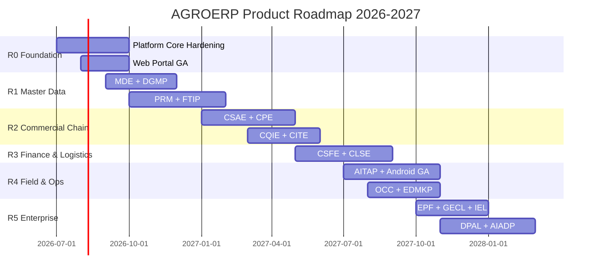
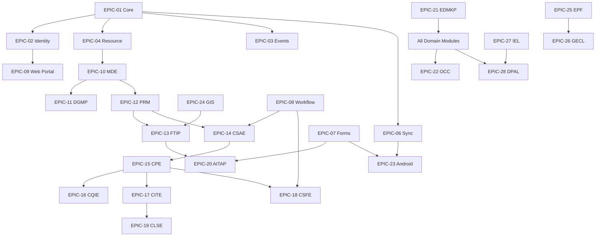

# AGROERP — Master Product Backlog

**Versión:** 1.0  
**Estado:** Oficial — Hoja de ruta de producto  
**Fecha:** 2026-07-02  
**Audiencia:** Producto, Arquitectura, Desarrollo, QA, Operaciones, Stakeholders  
**Base normativa:** `APOS.md`, `AEPS.md`, `COFFEE_DOMAIN.md`, especificaciones `{ENGINE}.md`

---

## 0. Resumen ejecutivo

AGROERP es una **plataforma agroindustrial enterprise** offline-first, multi-tenant y extensible. Este backlog convierte la arquitectura aprobada en un **producto operable**, sin introducir nuevos módulos de arquitectura.

### Estado actual (baseline v0.1)

| Capa | Estado | Notas |
|------|--------|-------|
| Platform Core (Resource, Metadata, Events, Audit, Sync) | **Implementado (MVP)** | Mutación vía CoreEngineService |
| Identity Engine | **Implementado (MVP)** | JWT, RBAC, roles, permisos, políticas |
| Form Engine | **Implementado (MVP)** | Definiciones + submissions + sync |
| Workflow Engine | **Implementado (MVP)** | Definiciones, instancias, historial |
| Web ERP Portal | **Parcial** | Login, dashboard, CRUD resource-based |
| Android Field App | **Estructura** | Room, sync protocol documentado |
| Motores de negocio cafetero (PRM→CLSE) | **Documentado** | Sin APIs dedicadas; resourceType temporal |
| MDE, DGMP, OCC, EPF, GECL, IEL, DPAL, AIADP | **Documentado** | Pendiente implementación |

### Métricas del backlog

| Métrica | Valor |
|---------|-------|
| Épicas | 29 |
| Features estimadas | ~185 |
| User Stories | ~420 |
| Story Points totales | ~2,840 SP |
| Velocidad equipo (2 squads) | ~80 SP / sprint |
| Duración estimada | ~36 sprints (~18 meses) |
| Releases planificados | 6 (R0–R5) |

### Convenciones

| Campo | Convención |
|-------|------------|
| **ID** | `EPIC-XX` / `FEAT-XX.YY` / `US-XX.YY.ZZ` / `TASK-…` |
| **Prioridad** | Critical > High > Medium > Low |
| **Estimación** | Story Points (Fibonacci: 1,2,3,5,8,13,21) |
| **DoD** | Ver sección 6 (global) |

---

## 1. Roadmap estratégico



### Releases

| Release | Nombre | Objetivo de negocio | Épicas incluidas | Target |
|---------|--------|---------------------|------------------|--------|
| **R0** | *Foundation GA* | Plataforma estable, portal usable, sync básico | EPIC-01–09, EPIC-06 | Q3 2026 |
| **R1** | *Master & Territory* | Golden record productor/finca, catálogos, GIS base | EPIC-10–13, EPIC-24 | Q4 2026 |
| **R2** | *Commercial Chain* | Contratos, compra, calidad, inventario trazable | EPIC-14–17 | Q1 2027 |
| **R3** | *Settlement & Logistics* | Liquidación, pagos, transporte, cadena custodia | EPIC-18–19 | Q2 2027 |
| **R4** | *Field Operations* | Campo offline completo, asistencia técnica, OCC | EPIC-20–23, EPIC-22 | Q3 2027 |
| **R5** | *Enterprise Scale* | Extensibilidad, gobierno, integraciones, BI, IA | EPIC-25–29 | Q4 2027 |

---

## 2. Sprint Planning (primeros 12 sprints)

**Cadencia:** 2 semanas | **Capacidad:** 80 SP/sprint | **Equipos:** Platform Squad + Domain Squad

| Sprint | Release | Objetivo | SP | Épicas / Features |
|--------|---------|----------|-----|-------------------|
| S1 | R0 | Hardening Core + permisos efectivos | 75 | EPIC-01 FEAT-01.03, EPIC-02 FEAT-02.05 |
| S2 | R0 | Portal login/dashboard producción | 80 | EPIC-09 FEAT-09.01–02 |
| S3 | R0 | CRUD productores/fincas nativo | 85 | EPIC-09 FEAT-09.03, EPIC-12 FEAT-12.01 |
| S4 | R0 | Compras + inventario automático backend | 80 | EPIC-15 FEAT-15.01, EPIC-17 FEAT-17.02 |
| S5 | R0 | Documentos MinIO presigned + EDMKP base | 75 | EPIC-21 FEAT-21.01 |
| S6 | R0 | Admin roles/permisos + auditoría UI | 70 | EPIC-02 FEAT-02.06, EPIC-09 FEAT-09.08 |
| S7 | R1 | MDE catálogos geo + party bootstrap | 80 | EPIC-10 FEAT-10.01–02 |
| S8 | R1 | PRM lifecycle + golden record | 85 | EPIC-12 FEAT-12.02–04 |
| S9 | R1 | FTIP catastro + polígonos PostGIS | 90 | EPIC-13 FEAT-13.01–03, EPIC-24 |
| S10 | R1 | DGMP calidad dato + deduplicación | 75 | EPIC-11 FEAT-11.02 |
| S11 | R2 | CSAE contratos y cupos | 85 | EPIC-14 FEAT-14.01–03 |
| S12 | R2 | CPE compra campo 34 pasos (fase 1) | 90 | EPIC-15 FEAT-15.02–04 |

---

## 3. Estimación por módulo

| # | Épica / Módulo | SP | Sprints | Prioridad | Release |
|---|----------------|-----|---------|-----------|---------|
| 01 | Platform Core & APOS Runtime | 120 | 2 | Critical | R0 |
| 02 | Identity Engine | 180 | 3 | Critical | R0 |
| 03 | Event Engine | 60 | 1 | Critical | R0 |
| 04 | Resource & Metadata Engine | 100 | 2 | Critical | R0 |
| 05 | Audit Engine | 40 | 1 | High | R0 |
| 06 | Sync Foundation | 150 | 2 | Critical | R0 |
| 07 | Dynamic Form Engine | 120 | 2 | High | R0–R4 |
| 08 | Workflow Engine | 140 | 2 | High | R1–R3 |
| 09 | Web ERP Portal | 200 | 3 | Critical | R0 |
| 10 | Master Data Engine | 220 | 3 | Critical | R1 |
| 11 | Data Governance Platform | 160 | 2 | High | R1 |
| 12 | PRM | 280 | 4 | Critical | R1 |
| 13 | FTIP | 240 | 3 | Critical | R1 |
| 14 | CSAE | 200 | 3 | Critical | R2 |
| 15 | CPE | 260 | 4 | Critical | R2 |
| 16 | CQIE | 200 | 3 | High | R2 |
| 17 | CITE | 220 | 3 | Critical | R2 |
| 18 | CSFE | 240 | 3 | Critical | R3 |
| 19 | CLSE | 220 | 3 | High | R3 |
| 20 | AITAP | 200 | 3 | High | R4 |
| 21 | EDMKP | 180 | 2 | High | R0–R4 |
| 22 | OCC | 160 | 2 | Medium | R4 |
| 23 | Android Field App | 280 | 4 | Critical | R4 |
| 24 | GIS Engine | 120 | 2 | High | R1 |
| 25 | EPF | 140 | 2 | Medium | R5 |
| 26 | GECL | 160 | 2 | High | R5 |
| 27 | IEL | 180 | 2 | Medium | R5 |
| 28 | DPAL | 200 | 3 | Medium | R5 |
| 29 | AIADP | 180 | 2 | Low | R5 |
| | **TOTAL** | **~2,840** | **~36** | | |

---

## 4. Matriz de dependencias



### Orden de implementación (secuencia obligatoria)

1. **Fase 0 — Plataforma:** EPIC-01 → 02 → 03 → 04 → 05 → 06 → 07 → 08 → 09 (paralelo portal)
2. **Fase 1 — Datos maestros:** EPIC-10 → 11 → 24 (GIS) → 12 (PRM) → 13 (FTIP)
3. **Fase 2 — Cadena comercial:** EPIC-14 (CSAE) → 15 (CPE) → 16 (CQIE) → 17 (CITE)
4. **Fase 3 — Finanzas y logística:** EPIC-18 (CSFE) → 19 (CLSE)
5. **Fase 4 — Campo y operaciones:** EPIC-21 (EDMKP completo) → 20 (AITAP) → 23 (Android) → 22 (OCC)
6. **Fase 5 — Enterprise:** EPIC-25 (EPF) → 26 (GECL) → 27 (IEL) → 28 (DPAL) → 29 (AIADP)

---

## 5. Registro de riesgos (programa)

| ID | Riesgo | Prob. | Impacto | Mitigación | Owner |
|----|--------|-------|---------|------------|-------|
| R-01 | Conectividad rural limita adopción campo | Alta | Alta | Sync Foundation + Android offline-first | Platform |
| R-02 | Complejidad dominio cafetero subestimada | Media | Alta | CDP como fuente única; entregas incrementales | Product |
| R-03 | Deuda técnica resourceType genérico | Alta | Media | Migración a motores dedicados en R1–R2 | Architect |
| R-04 | Performance PostGIS con millones polígonos | Media | Alta | Índices espaciales, partición, cache | Backend |
| R-05 | Integraciones bancarias/aduanas retrasan CSFE | Media | Alta | IEL con adaptadores mock; fases | Integrations |
| R-06 | Scope creep en IA (AIADP) | Alta | Media | AIADP en R5; casos uso acotados | Product |
| R-07 | Multi-tenant data leak | Baja | Crítica | PBAC + tests penetración + GECL | Security |
| R-08 | Conflictos sync offline | Alta | Alta | Idempotencia, externalId, OCC visibilidad | Mobile |
| R-09 | Catálogos MDE incompletos bloquean dominio | Media | Alta | Seeds país Colombia v1; extensible | MDE |
| R-10 | Equipo insuficiente para 36 sprints | Media | Alta | Priorizar R0–R2; paralelizar squads | PM |

---

## 6. Definición de Done (global)

Un ítem del backlog se considera **Done** cuando:

- [ ] Código mergeado a `main` con PR aprobado (2 reviewers)
- [ ] Cumple `AEPS.md` (eventos, auditoría, multi-tenant, permisos)
- [ ] Registrado en catálogos APOS (si aplica motor/dominio)
- [ ] APIs documentadas en Swagger con ejemplos
- [ ] Permisos `resource:action` en seed + tests autorización
- [ ] Pruebas unitarias ≥ 80% en application layer
- [ ] Pruebas integración escenarios críticos (ver módulo)
- [ ] Pruebas funcionales QA sign-off
- [ ] Sin regresiones en pipeline CI
- [ ] Migración Prisma reversible documentada
- [ ] Telemetría: logs estructurados + métricas Prometheus
- [ ] Documentación `docs/` actualizada si cambia contrato
- [ ] Demo script actualizado en `GETTING_STARTED.md` (si user-facing)

---

# ÉPICAS Y BACKLOG DETALLADO

---

## EPIC-01: Platform Core & APOS Runtime

| Campo | Valor |
|-------|-------|
| **Objetivo** | Kernel de mutación: toda operación pasa por CoreEngineService con evento + auditoría + sync |
| **Alcance** | TenantMiddleware, RequestContext, CoreEngineService, health, feature flags APOS, module bootstrap |
| **Prioridad** | Critical |
| **Release** | R0 |
| **Estado** | Implementado MVP — hardening pendiente |
| **Dependencias** | PostgreSQL, Redis, NestJS |
| **Riesgos** | Bypass directo a Prisma sin CoreEngine |

### Reglas de negocio
- Toda mutación genera evento inmutable
- `organizationId` obligatorio en contexto
- `correlationId` en toda cadena request→evento→audit
- Sin registro APOS → motor no ejecuta

### Endpoints requeridos
| Método | Ruta | Estado |
|--------|------|--------|
| GET | `/api/v1/health` | ✅ |
| GET | `/api/v1/health/ready` | 🔲 |
| GET | `/api/v1/platform/features` | 🔲 |

### Modelos BD
`Organization`, `Resource`, `Event`, `AuditLog`, `SyncQueue` (existentes)

### Permisos
`platform:read`, `platform:admin`

### Eventos
`ResourceCreated`, `ResourceUpdated`, `ResourceDeleted`, `OrganizationConfigured`

### Automatizaciones
- Auto-sync queue en cada mutación
- Health check Docker/K8s

### Integraciones
Docker Compose, futuro K8s APOS operator

### Reportes / KPIs
Uptime, latencia p99, eventos/seg, cola sync pendiente

### Android / Offline / IA
- Android: headers `X-Device-Id`, `X-Correlation-Id`
- Offline: sync queue al reconectar
- IA: no aplica

---

### FEAT-01.01: CoreEngineService hardening

| US-ID | Historia | Prioridad | SP |
|-------|----------|-----------|-----|
| US-01.01.01 | Como arquitecto quiero que ningún servicio mute estado sin CoreEngine para garantizar trazabilidad | Critical | 5 |
| US-01.01.02 | Como SRE quiero health/ready con checks DB+Redis+MinIO | High | 3 |
| US-01.01.03 | Como dev quiero correlationId propagado a logs y eventos | Critical | 3 |

**Casos de uso:** CU-01.01 Mutación autorizada; CU-01.02 Rechazo sin tenant  
**Validaciones:** organizationId NOT NULL; evento persistido antes de response 201  
**Pruebas integración:** POST resource → evento + audit + sync queue en transacción  
**Criterios aceptación:** 100% mutaciones vía CoreEngine; 0 bypass en lint rule

#### TASKS
| Task | Subtasks |
|------|----------|
| TASK-01.01.01 ESLint rule no-direct-prisma-mutation | Rule custom, CI gate |
| TASK-01.01.02 Ready endpoint | DB ping, Redis ping, S3 head bucket |
| TASK-01.01.03 Correlation middleware | Header `X-Correlation-Id` o generar UUID |

---

### FEAT-01.02: APOS Feature Flags & Config Plane

| US-ID | Historia | Prioridad | SP |
|-------|----------|-----------|-----|
| US-01.02.01 | Como admin org quiero activar módulos por país sin redeploy | High | 8 |
| US-01.02.02 | Como ops quiero ver catálogo motores registrados | Medium | 5 |

**Dependencias:** EPIC-25 EPF (futuro), Organization.settings JSON  
**Eventos:** `FeatureFlagChanged`, `ModuleEnabled`

---

## EPIC-02: Identity Engine

| Campo | Valor |
|-------|-------|
| **Objetivo** | Identidad, autenticación, RBAC+PBAC, sesiones, delegaciones, service accounts |
| **Alcance** | Login JWT, refresh, roles, permisos, políticas, scopes, org units, teams |
| **Prioridad** | Critical |
| **Release** | R0 |
| **Estado** | Implementado MVP |
| **Dependencias** | EPIC-01, EPIC-03 |

### Reglas de negocio
- Denegar por defecto (fail-closed)
- Políticas `deny` prevalecen sobre `allow`
- Sesión revocable remotamente
- Usuario `locked` no autentica
- Refresh token rotativo

### Endpoints requeridos
| Método | Ruta | Estado |
|--------|------|--------|
| POST | `/auth/login` | ✅ |
| POST | `/auth/refresh` | ✅ |
| POST | `/auth/logout` | ✅ |
| GET | `/auth/me` | ✅ |
| GET/POST/PATCH | `/identity/roles` | ✅ |
| GET | `/identity/permissions` | ✅ |
| GET | `/identity/permissions/me/effective` | 🔲 |
| CRUD | `/identity/policies` | ✅ |
| CRUD | `/identity/groups` | ✅ |
| CRUD | `/identity/org-units` | ✅ |
| CRUD | `/identity/delegations` | 🔲 |
| CRUD | `/identity/substitutions` | 🔲 |
| CRUD | `/identity/service-accounts` | ✅ |
| CRUD | `/users` | ✅ |

### Modelos BD
`User`, `Role`, `Permission`, `RolePermission`, `UserRole`, `Policy`, `OrgUnit`, `Group`, `UserGroup`, `Team`, `Session`, `Delegation`, `Substitution`, `ServiceAccount`, `ApiKey`, `UserScope`, `Device`

### Permisos
`users:*`, `roles:*`, `policies:*`, `sessions:revoke`, `identity:admin`

### Eventos
`UserLoggedIn`, `UserLoggedOut`, `PermissionGranted`, `SessionRevoked`, `PolicyEvaluated`

### Automatizaciones
- Lock automático tras N intentos fallidos
- Expiración sesiones inactivas
- Alerta login desde dispositivo nuevo

### Integraciones
SSO SAML/OIDC (R5), LDAP (futuro)

### Reportes / KPIs
Usuarios activos, sesiones concurrentes, denegaciones PBAC, logins fallidos

### Android
Login offline con token cacheado; refresh pre-sync; biometric unlock (futuro)

### Offline
Sesión Room válida hasta expiry; re-auth al expirar

### IA
Detección anomalías login (GECL/AIADP R5)

---

### FEAT-02.01: Autenticación JWT producción

| US-ID | Historia | Prioridad | SP |
|-------|----------|-----------|-----|
| US-02.01.01 | Como usuario quiero iniciar sesión con email/password | Critical | 3 |
| US-02.01.02 | Como usuario quiero refresh automático sin re-login | Critical | 5 |
| US-02.01.03 | Como admin quiero forzar logout remoto de dispositivo | High | 5 |

**Pruebas funcionales:** Login válido/inválido; token expirado; refresh; logout invalida sesión  
**Criterios aceptación:** JWT < 24h; refresh rotativo; 401 dispara redirect login web

---

### FEAT-02.02: RBAC administración

| US-ID | Historia | Prioridad | SP |
|-------|----------|-----------|-----|
| US-02.02.01 | Como admin quiero CRUD roles con permisos granulares | Critical | 8 |
| US-02.02.02 | Como admin quiero asignar roles a usuarios | Critical | 5 |
| US-02.02.03 | Como admin quiero crear usuarios con rol inicial | High | 5 |

---

### FEAT-02.03: PBAC políticas contextuales

| US-ID | Historia | Prioridad | SP |
|-------|----------|-----------|-----|
| US-02.03.01 | Como seguridad quiero políticas horario para compras campo | High | 13 |
| US-02.03.02 | Como seguridad quiero scopes territoriales por finca/municipio | High | 13 |

---

### FEAT-02.04: Delegaciones y sustituciones

| US-ID | Historia | Prioridad | SP |
|-------|----------|-----------|-----|
| US-02.04.01 | Como gerente quiero delegar aprobaciones temporalmente | Medium | 8 |
| US-02.04.02 | Como RRHH quiero sustitución por ausencia programada | Medium | 8 |

---

## EPIC-03: Event Engine

| Campo | Valor |
|-------|-------|
| **Objetivo** | Event Store inmutable + bus para comunicación desacoplada |
| **Prioridad** | Critical |
| **Release** | R0 |
| **Estado** | Implementado MVP |

### Endpoints
`GET /events`, `GET /events/aggregate/:type/:id`

### Modelos
`Event` (global_sequence, aggregate_type, payload JSONB)

### Eventos publicados
Todos los del sistema (meta-evento `EventStored`)

### FEAT-03.01: Event Store producción
- US-03.01.01: Replay aggregate para auditoría (High, 5 SP)
- US-03.01.02: Cursor global_sequence para sync (Critical, 5 SP)
- US-03.01.03: Redis Streams bus interno (Medium, 8 SP)

---

## EPIC-04: Resource & Metadata Engine

| Campo | Valor |
|-------|-------|
| **Objetivo** | Entidad genérica universal + schemas dinámicos metadata-driven |
| **Prioridad** | Critical |
| **Release** | R0 |
| **Estado** | Implementado MVP |

### Reglas de negocio
- POST valida contra schema activo del resourceType
- Optimistic locking vía `version`
- Soft delete con `deletedAt`
- parentId para jerarquías (finca→productor)

### Endpoints
`GET/POST/PATCH/DELETE /resources`, `GET/POST/PATCH /metadata/schemas`

### Modelos
`Resource`, `ResourceSchema`

### Permisos
`resources:read`, `resources:create`, `resources:update`, `resources:delete`, `metadata:admin`

### FEAT-04.01: CRUD Resources producción
| US-ID | Historia | Prioridad | SP |
| US-04.01.01 | Como dev quiero crear resource con validación schema | Critical | 5 |
| US-04.01.02 | Como dev quiero filtrar por resourceType y parentId | Critical | 3 |
| US-04.01.03 | Como dev quiero paginación y ordenamiento | High | 5 |

### FEAT-04.02: Metadata schemas versionados
| US-ID | Historia | Prioridad | SP |
| US-04.02.01 | Como admin quiero publicar nueva versión schema sin romper datos | High | 8 |
| US-04.02.02 | Como sistema quiero validar tipos geo, file, relation | High | 8 |

---

## EPIC-05: Audit Engine

| Campo | Valor |
|-------|-------|
| **Objetivo** | Registro inmutable before/after con diff automático |
| **Prioridad** | High |
| **Release** | R0 |
| **Estado** | Implementado MVP |

### Endpoints
`GET /audit`, `GET /audit/:id`

### Modelos
`AuditLog`

### FEAT-05.01: Auditoría UI y exportación
- US-05.01.01: Dashboard auditoría reciente (High, 3 SP) ✅ parcial web
- US-05.01.02: Filtros por entidad/usuario/fecha (High, 5 SP)
- US-05.01.03: Export CSV auditoría compliance (Medium, 5 SP)

---

## EPIC-06: Sync Foundation

| Campo | Valor |
|-------|-------|
| **Objetivo** | Offline-first: pull/push eventos, cola, conflictos, idempotencia |
| **Prioridad** | Critical |
| **Release** | R0 |
| **Estado** | Implementado MVP |

### Endpoints
`GET /sync/pull`, `GET /sync/status`, `GET /sync/queue`

### Reglas de negocio
- `externalId` único por org para idempotencia
- Last-Write-Wins inicial; server_wins para entidades críticas
- syncStatus: synced | pending | conflict

### Android / Offline
Core del protocolo Android; WorkManager 15min

### FEAT-06.01: Pull/Push producción
| US-ID | Historia | Prioridad | SP |
| US-06.01.01 | Como móvil quiero pull desde cursor N | Critical | 8 |
| US-06.01.02 | Como móvil quiero push batch submissions | Critical | 13 |
| US-06.01.03 | Como ops quiero ver conflictos pendientes | High | 8 |

### FEAT-06.02: Resolución conflictos avanzada
- US-06.02.01: UI resolución conflictos web (Medium, 13 SP)
- US-06.02.02: Política por resourceType (High, 8 SP)

---

## EPIC-07: Dynamic Form Engine

| Campo | Valor |
|-------|-------|
| **Objetivo** | Formularios configurables JSON con lógica condicional, cálculos, validación |
| **Prioridad** | High |
| **Release** | R0–R4 |
| **Estado** | Implementado MVP |

### Endpoints
`GET/POST/PATCH /forms`, `POST /forms/bootstrap`, `POST /form-submissions/sync`

### Modelos
`FormDefinition`, `FormSubmission`

### Permisos
`forms:read`, `forms:admin`, `form_submissions:create`

### Android
FormRendererEngine réplica local; 12 tipos campo

### FEAT-07.01: Form builder web
| US-ID | Historia | Prioridad | SP |
| US-07.01.01 | Como admin quiero diseñar formulario visual | High | 13 |
| US-07.01.02 | Como admin quiero publicar versión formulario | High | 5 |

### FEAT-07.02: Submissions y sync
| US-ID | Historia | Prioridad | SP |
| US-07.02.01 | Como técnico quiero enviar formulario offline | Critical | 8 |
| US-07.02.02 | Como supervisor quiero ver submissions por finca | High | 5 |

---

## EPIC-08: Workflow Engine

| Campo | Valor |
|-------|-------|
| **Objetivo** | BPM genérico: definiciones, instancias, aprobaciones, escalamiento |
| **Prioridad** | High |
| **Release** | R1–R3 |
| **Estado** | Implementado MVP |

### Endpoints
`/workflows/definitions`, `/workflows/instances`

### Modelos
`WorkflowDefinition`, `WorkflowVersion`, `WorkflowInstance`, `WorkflowHistory`, `WorkflowAssignment`, `WorkflowNotification`

### Integraciones
CSAE, CSFE, CLSE, CQIE para aprobaciones

### FEAT-08.01: Aprobaciones contratos
- US-08.01.01: Flujo aprobación contrato multi-nivel (Critical, 13 SP)
- US-08.01.02: Delegación tarea workflow (High, 8 SP)

### FEAT-08.02: Aprobaciones pagos
- US-08.02.01: Orden pago requiere 2 aprobaciones > umbral (Critical, 13 SP)

---

## EPIC-09: Web ERP Portal

| Campo | Valor |
|-------|-------|
| **Objetivo** | Interfaz web profesional tipo SAP/Odoo para operación back-office |
| **Alcance** | Login, dashboard KPIs, CRUD módulos, admin, navegación sidebar |
| **Prioridad** | Critical |
| **Release** | R0 |
| **Estado** | Parcial (MVP resource-based) |
| **Dependencias** | EPIC-02, EPIC-04, motores dominio |

### Reglas de negocio
- Rutas protegidas por JWT
- Permisos ocultan módulos sidebar
- Sesión expira → redirect login

### Endpoints consumidos
Auth, resources, files, identity, audit, metadata (todos existentes)

### Permisos UI
Mapeo `hasPermission(resource:action)` por módulo

### KPIs Dashboard
Productores, fincas, compras, kg, valor, inventario, documentos

### FEAT-09.01: Autenticación y layout ✅
| US-ID | Historia | Prioridad | SP | Estado |
| US-09.01.01 | Login con JWT y persistencia | Critical | 5 | ✅ |
| US-09.01.02 | Sidebar ERP con navegación módulos | Critical | 5 | ✅ |
| US-09.01.03 | Header con usuario y logout | High | 3 | ✅ |

### FEAT-09.02: Dashboard KPIs ✅ parcial
| US-ID | Historia | Prioridad | SP |
| US-09.02.01 | KPIs agregados desde resources | Critical | 8 | ✅ |
| US-09.02.02 | Actividad auditoría reciente | High | 5 | ✅ |
| US-09.02.03 | Gráficos tendencia compras 30d | Medium | 8 | 🔲 |

### FEAT-09.03: Módulo Productores
| US-ID | Historia | Prioridad | SP | Estado |
| US-09.03.01 | CRUD productor completo | Critical | 8 | ✅ resource |
| US-09.03.02 | Búsqueda y filtros | High | 5 | 🔲 |
| US-09.03.03 | Vista expediente 360° PRM | High | 13 | 🔲 |

### FEAT-09.04: Módulo Fincas
| US-ID | Historia | Prioridad | SP | Estado |
| US-09.04.01 | CRUD finca vinculada a productor | Critical | 8 | ✅ |
| US-09.04.02 | Mapa finca en FTIP | High | 13 | 🔲 |

### FEAT-09.05: Módulo Compras
| US-ID | Historia | Prioridad | SP | Estado |
| US-09.05.01 | Registrar compra café | Critical | 8 | ✅ |
| US-09.05.02 | Auto-crear inventario backend | Critical | 8 | 🔲 workaround FE |
| US-09.05.03 | Validar cupo CSAE | High | 8 | 🔲 |

### FEAT-09.06: Módulo Inventario
| US-ID | Historia | Prioridad | SP | Estado |
| US-09.06.01 | Ver lotes y stock kg | Critical | 5 | ✅ |
| US-09.06.02 | Kardex movimientos CITE | High | 13 | 🔲 |

### FEAT-09.07: Módulo Documentos
| US-ID | Historia | Prioridad | SP | Estado |
| US-09.07.01 | Registrar documento metadata | High | 5 | ✅ |
| US-09.07.02 | Upload presigned MinIO | Critical | 8 | 🔲 |

### FEAT-09.08: Módulo Administración
| US-ID | Historia | Prioridad | SP | Estado |
| US-09.08.01 | CRUD roles y permisos | Critical | 8 | ✅ |
| US-09.08.02 | Crear usuarios | High | 5 | ✅ |

### Pruebas funcionales EPIC-09
- Login → navegar todos módulos → CRUD smoke
- Usuario viewer no ve admin
- Token expirado redirige

### Criterios aceptación
- Build producción sin errores TS
- Lighthouse accesibilidad ≥ 80
- Responsive ≥ 1280px

---

## EPIC-10: Master Data Engine (MDE)

| Campo | Valor |
|-------|-------|
| **Objetivo** | 104 catálogos empresariales transversales (geo, party, farm, trade, quality…) |
| **Prioridad** | Critical |
| **Release** | R1 |
| **Estado** | Documentado |
| **Dependencias** | EPIC-04 |

### Alcance
18 dominios catálogo: `geo.*`, `party.*`, `org.*`, `producer.*`, `farm.*`, `trade.*`, `purchase.*`, `logistics.*`, `quality.*`, `process.*`, `inventory.*`, `finance.*`, `cert.*`, `field.*`, `document.*`, `platform.*`, `notify.*`, `governance.*`, `uom.*`

### Reglas de negocio
- Catálogo versionado; código único por org o global según tipo
- Jerarquías: país→departamento→municipio→vereda
- Bootstrap offline Android para catálogos críticos
- Inactivar no eliminar

### Endpoints requeridos
| Método | Ruta |
|--------|------|
| GET | `/api/v1/mdm/catalogs` |
| GET | `/api/v1/mdm/catalogs/:domain/:code` |
| GET | `/api/v1/mdm/catalogs/:domain/:code/items` |
| POST | `/api/v1/mdm/catalogs/:domain/:code/items` |
| PATCH | `/api/v1/mdm/items/:id` |
| GET | `/api/v1/mdm/bootstrap` (offline) |

### Modelos BD
`Catalog`, `CatalogItem`, `CatalogHierarchy`, `CatalogVersion` (nuevos)

### Permisos
`mdm:read`, `mdm:admin`, `mdm:{domain}:write`

### Eventos
`CatalogItemCreated`, `CatalogItemUpdated`, `CatalogPublished`

### Automatizaciones
- Seed Colombia v1 en deploy
- Sync catálogos a Android bootstrap

### Integraciones
DANE (geografía CO), FNC referencias (futuro IEL)

### Reportes
Catálogos incompletos, items sin uso 12m

### KPIs
Cobertura catálogos, items activos, tiempo publicación

### Android
`GET /mdm/bootstrap` en sync inicial

### Offline
Catálogos en SQLite Room; TTL 7 días

### IA
Sugerencia deduplicación catálogos (AIADP)

---

### FEAT-10.01: Infraestructura MDE
| US-ID | Historia | Prioridad | SP |
| US-10.01.01 | Como admin quiero API genérica catálogos | Critical | 13 |
| US-10.01.02 | Como dev quiero registrar catálogo en APOS | High | 5 |

### FEAT-10.02: Catálogos geo + party
| US-ID | Historia | Prioridad | SP |
| US-10.02.01 | Como usuario quiero seleccionar municipio jerárquico | Critical | 8 |
| US-10.02.02 | Como usuario quiero tipos documento identidad | Critical | 5 |

### FEAT-10.03: Catálogos café (variedades, defectos, cert)
| US-ID | Historia | Prioridad | SP |
| US-10.03.01 | Como catador quiero catálogo defectos SCA | High | 8 |
| US-10.03.02 | Como comercial quiero certificaciones Rainforest/4C | High | 5 |

*(Features 10.04–10.18: un feature por dominio catálogo restante — ~8 SP c/u)*

---

## EPIC-11: Data Governance Platform (DGMP)

| Campo | Valor |
|-------|-------|
| **Objetivo** | Golden records, calidad dato, lineage, deduplicación, data catalog |
| **Prioridad** | High |
| **Release** | R1 |
| **Dependencias** | EPIC-10, EPIC-12 |

### Reglas de negocio
- Un golden record productor por org
- Match score > 0.85 → revisión manual
- Lineage obligatorio en merge

### Endpoints
`/api/v1/governance/quality-rules`, `/api/v1/governance/duplicates`, `/api/v1/governance/lineage/:entityId`

### Eventos
`DuplicateDetected`, `GoldenRecordMerged`, `DataQualityViolation`

### FEAT-11.01: Data Quality Rules
### FEAT-11.02: Deduplicación productores
### FEAT-11.03: Lineage y data catalog

---

## EPIC-12: Producer Relationship Management (PRM)

| Campo | Valor |
|-------|-------|
| **Objetivo** | Golden record productor, lifecycle, relación 360°, segmentación, timeline |
| **Prioridad** | Critical |
| **Release** | R1 |
| **Dependencias** | EPIC-10, EPIC-11, EPIC-13 |

### Alcance
ProducerProfile, lifecycle (prospect→active→suspended→inactive), contactos, familia, certificaciones productor, asignaciones comercial/técnico, segmentación dinámica, timeline eventos, score relación

### Reglas de negocio
- P1: Un productor = un ProducerProfile por org
- P2: Estado PRM bloquea operaciones downstream (compra, pago)
- P4: Cambio lifecycle = ProducerLifecycleEvent inmutable
- P7: Segmentos calculados por reglas, no manual

### Endpoints requeridos
| Método | Ruta |
|--------|------|
| GET/POST/PATCH | `/api/v1/prm/producers` |
| POST | `/api/v1/prm/producers/:id/lifecycle` |
| GET | `/api/v1/prm/producers/:id/timeline` |
| GET/POST | `/api/v1/prm/producers/:id/contacts` |
| GET/POST | `/api/v1/prm/segments` |
| GET | `/api/v1/prm/producers/:id/360` |

### Modelos BD
`ProducerProfile`, `ProducerContact`, `ProducerLifecycleEvent`, `ProducerSegment`, `ProducerAssignment`, `ProducerCertification` (+ resourceType legacy migration)

### Permisos
`producer:read`, `producer:create`, `producer:update`, `producer:lifecycle`, `producer:admin`

### Eventos
`ProducerRegistered`, `ProducerActivated`, `ProducerSuspended`, `ProducerSegmentChanged`, `ProducerAssigned`

### Automatizaciones
- Auto-suspend si sin compra 24 meses (configurable)
- Alerta certificación por vencer 90d

### Integraciones
PRM consume: CSAE, CPE, CSFE, AITAP, FTIP events

### Reportes
Cartera por segmento, productores por estado, cobertura técnica

### KPIs
Productores activos, tasa activación, NPS relación, % con finca validada

### Android
Pre-registro productor offline; sync con externalId

### Offline
Crear prospect offline; merge en sync

### IA
Score churn productor; sugerencia segmento (AIADP)

---

### FEAT-12.01: Registro productor MVP → ✅ migrar a PRM API
### FEAT-12.02: Lifecycle productor
| US-ID | Historia | Prioridad | SP |
| US-12.02.01 | Como comercial quiero activar productor tras validación docs | Critical | 8 |
| US-12.02.02 | Como sistema quiero bloquear compra a productor suspendido | Critical | 5 |

### FEAT-12.03: Expediente 360°
### FEAT-12.04: Segmentación dinámica
### FEAT-12.05: Asignaciones comercial/técnico

**Pruebas integración:** CPE rechaza compra productor `suspended`  
**Criterios aceptación:** Timeline muestra eventos de todos motores

---

## EPIC-13: Farm & Territory Intelligence Platform (FTIP)

| Campo | Valor |
|-------|-------|
| **Objetivo** | Catastro agrícola autoritativo: fincas, parcelas, lotes, polígonos, recursos naturales |
| **Prioridad** | Critical |
| **Release** | R1 |
| **Dependencias** | EPIC-10, EPIC-24 GIS, EPIC-12 |

### Reglas de negocio
- T2: Geometry versioned — TerritoryGeometryRevision inmutable
- T4: Un polígono activo por unidad territorial
- T5: Operaciones espaciales vía GIS Engine

### Endpoints
`/api/v1/ftip/farms`, `/api/v1/ftip/parcels`, `/api/v1/ftip/lots`, `/api/v1/ftip/geometry`, `/api/v1/ftip/resources/natural`

### Modelos
`TerritoryUnit`, `TerritoryGeometryRevision`, `TerritoryCrop`, `NaturalResource`, `InfrastructureFeature` (PostGIS geometry)

### Permisos
`territory:read`, `territory:create`, `territory:update`, `territory:geometry`

### Eventos
`FarmRegistered`, `GeometryRevised`, `CropPlanted`, `TerritoryCertified`

### Android
Captura polígono GPS walk + foto límite

### Offline
Polígonos en Room; sync geometry WKT

### IA
Detección cambio cobertura satélite (IEL+AIADP)

### FEAT-13.01: Catastro finca
### FEAT-13.02: Editor polígonos web
### FEAT-13.03: Lotes productivos y cultivos
### FEAT-13.04: Recursos naturales e infraestructura

---

## EPIC-14: Coffee Supply Agreement Engine (CSAE)

| Campo | Valor |
|-------|-------|
| **Objetivo** | Contratos compra, cupos, precios referencia, campañas, aprobaciones |
| **Prioridad** | Critical |
| **Release** | R2 |
| **Dependencias** | EPIC-12, EPIC-08, EPIC-10 |

### Reglas de negocio
- Cupo no excedible sin aprobación excepción workflow
- Contrato `draft` no permite compras
- Precio referencia por zona/perfil taza/certificación

### Endpoints
`/api/v1/csae/agreements`, `/api/v1/csae/quotas`, `/api/v1/csae/price-lists`, `/api/v1/csae/campaigns`

### Modelos
`SupplyAgreement`, `AgreementQuota`, `PriceReference`, `CommercialCampaign`

### Eventos
`AgreementSigned`, `QuotaAllocated`, `QuotaConsumed`, `QuotaExceeded`

### Automatizaciones
- Alerta cupo 80% consumido
- Renovación automática campaña anual

### KPIs
Cupo vs ejecutado, contratos activos, precio promedio zona

### FEAT-14.01: Contratos compra
### FEAT-14.02: Motor cupos
### FEAT-14.03: Listas precio y campañas

---

## EPIC-15: Coffee Procurement Engine (CPE)

| Campo | Valor |
|-------|-------|
| **Objetivo** | Compra café 34 pasos: campo → recepción → liquidación preliminar |
| **Prioridad** | Critical |
| **Release** | R2 |
| **Dependencias** | EPIC-14, EPIC-12, EPIC-16, EPIC-17 |

### Reglas de negocio
- Compra requiere productor activo PRM + cupo CSAE
- Peso neto = bruto − tara − descuentos
- Recepción bodega dispara CQIE + CITE

### Endpoints
`/api/v1/cpe/purchases`, `/api/v1/cpe/receptions`, `/api/v1/cpe/field-capture`, `/api/v1/cpe/pre-settlements`

### Modelos
`CoffeePurchase`, `PurchaseLine`, `Reception`, `WeighingRecord`, `PreSettlement`

### Eventos
`PurchaseInitiated`, `PurchaseWeighed`, `PurchaseReceived`, `PurchaseApproved`, `InventoryLotCreated`

### Android
Captura compra completa offline (CPE Field Capture)

### Offline
Compra con externalId; fotos báscula local

### IA
Detección anomalía precio/peso (AIADP)

### FEAT-15.01: Compra directa web (migrar desde resource)
### FEAT-15.02: Field Capture Service
### FEAT-15.03: Recepción bodega
### FEAT-15.04: Liquidación preliminar LPE
### FEAT-15.05: Integración inventario automático

**Pruebas integración:** Compra → evento → CITE lote + CQIE muestra  
**Criterios aceptación:** 34 pasos CPE documentados cubiertos ≥ 80% R2

---

## EPIC-16: Coffee Quality Intelligence Engine (CQIE)

| Campo | Valor |
|-------|-------|
| **Objetivo** | Calidad café: inspecciones, catación, defectos, NC/CAPA, dictámenes |
| **Prioridad** | High |
| **Release** | R2 |
| **Dependencias** | EPIC-15, EPIC-17, EPIC-10 |

### Endpoints
`/api/v1/cqie/inspections`, `/api/v1/cqie/cupping`, `/api/v1/cqie/defects`, `/api/v1/cqie/nc`, `/api/v1/cqie/verdicts`

### Modelos
`QualityInspection`, `CuppingSession`, `DefectRecord`, `NonConformance`, `QualityVerdict`

### KPIs
% rechazos, score catación promedio, NC abiertas, tiempo dictamen

### IA
Predicción perfil taza desde defectos (AIADP)

### FEAT-16.01: Inspección recepción
### FEAT-16.02: Sesión catación SCA
### FEAT-16.03: NC y CAPA workflow

---

## EPIC-17: Coffee Inventory & Traceability Engine (CITE)

| Campo | Valor |
|-------|-------|
| **Objetivo** | Inventario event-sourced, kardex, trazabilidad finca→lote→despacho |
| **Prioridad** | Critical |
| **Release** | R2 |
| **Dependencias** | EPIC-15, EPIC-10 |

### Reglas de negocio
- Movimiento inventario = evento inmutable
- Trazabilidad bidireccional obligatoria
- Lote comercial ≠ lote territorial FTIP

### Endpoints
`/api/v1/cite/lots`, `/api/v1/cite/movements`, `/api/v1/cite/locations`, `/api/v1/cite/trace/:lotId`, `/api/v1/cite/cycle-counts`

### Modelos
`InventoryLot`, `InventoryMovement`, `WarehouseLocation`, `ChainOfCustody`, `CycleCount`

### Eventos
`LotCreated`, `MovementRecorded`, `LotSplit`, `LotMerged`, `CycleCountCompleted`

### KPIs
Stock kg por bodega, rotación, mermas %, lotes pendiente clasificación

### Android
Escaneo QR lote bodega

### FEAT-17.01: Lotes inventario
### FEAT-17.02: Movimientos y kardex
### FEAT-17.03: Trazabilidad visual
### FEAT-17.04: Inventario físico cycle count
### FEAT-17.05: QR etiquetas lote

---

## EPIC-18: Coffee Settlement & Financial Engine (CSFE)

| Campo | Valor |
|-------|-------|
| **Objetivo** | Liquidación productor, cuenta corriente, anticipos, préstamos, pagos |
| **Prioridad** | Critical |
| **Release** | R3 |
| **Dependencias** | EPIC-15, EPIC-08, EPIC-21 |

### Reglas de negocio
- Liquidación = Σ compras − descuentos − anticipos ± ajustes
- Pago > umbral requiere workflow 2 aprobaciones
- Anticipo no excede % cupo pendiente

### Endpoints
`/api/v1/csfe/settlements`, `/api/v1/csfe/ledger`, `/api/v1/csfe/advances`, `/api/v1/csfe/payments`, `/api/v1/csfe/adjustments`

### Modelos
`ProducerLedger`, `Settlement`, `FinancialMovement`, `PaymentOrder`, `Advance`, `Loan`

### Eventos
`SettlementCalculated`, `PaymentApproved`, `PaymentExecuted`, `AdvanceGranted`

### Integraciones
Bancos (IEL), DIAN facturación (futuro)

### Reportes
Cartera productores, aging anticipos, pagos pendientes

### KPIs
Días promedio pago, % liquidado vs comprado, saldo cartera

### FEAT-18.01: Cuenta corriente productor
### FEAT-18.02: Motor liquidación
### FEAT-18.03: Anticipos y préstamos
### FEAT-18.04: Órdenes de pago + workflow

---

## EPIC-19: Coffee Logistics & Supply Chain Engine (CLSE)

| Campo | Valor |
|-------|-------|
| **Objetivo** | Transporte, rutas, despachos, flota, GPS, cadena custodia |
| **Prioridad** | High |
| **Release** | R3 |
| **Dependencias** | EPIC-17, EPIC-24 |

### Endpoints
`/api/v1/clse/shipments`, `/api/v1/clse/routes`, `/api/v1/clse/dispatches`, `/api/v1/clse/fleet`, `/api/v1/clse/telemetry`

### Modelos
`Shipment`, `Route`, `Dispatch`, `Vehicle`, `Driver`, `GpsTrack`, `LogisticsIncident`

### KPIs
OTIF, costo/kg/km, incidentes abiertos, utilización flota

### Android
App conductor: POD, firma, foto entrega

### IA
Optimización rutas (AIADP)

### FEAT-19.01: Planificación despachos
### FEAT-19.02: Route engine
### FEAT-19.03: GPS telemetría
### FEAT-19.04: Cadena custodia QR

---

## EPIC-20: Agronomic Intelligence & Technical Assistance (AITAP)

| Campo | Valor |
|-------|-------|
| **Objetivo** | Visitas técnicas, planes manejo, diagnósticos, recomendaciones, seguimiento |
| **Prioridad** | High |
| **Release** | R4 |
| **Dependencias** | EPIC-07, EPIC-13, EPIC-12, EPIC-23 |

### Endpoints
`/api/v1/aitap/visits`, `/api/v1/aitap/management-plans`, `/api/v1/aitap/diagnostics`, `/api/v1/aitap/recommendations`, `/api/v1/aitap/activities`

### Modelos
`TechnicalVisit`, `ManagementPlan`, `AgronomicActivity`, `FieldDiagnostic`, `Recommendation`, `RecommendationFollowUp`

### Eventos
`VisitScheduled`, `VisitCompleted`, `DiagnosticRecorded`, `RecommendationIssued`, `RecommendationOverdue`

### KPIs
Visitas/mes, % recomendaciones cumplidas, cobertura productores, plagas activas

### Android
Visita completa offline con evidencias

### IA
Diagnóstico plaga por foto (AIADP)

### FEAT-20.01: Planificación visitas
### FEAT-20.02: Ejecución visita + formularios
### FEAT-20.03: Planes manejo
### FEAT-20.04: Diagnósticos y recomendaciones

---

## EPIC-21: Enterprise Document, Media & Knowledge Platform (EDMKP)

| Campo | Valor |
|-------|-------|
| **Objetivo** | ECM: documentos, multimedia, versiones, búsqueda, retención, conocimiento |
| **Prioridad** | High |
| **Release** | R0–R4 |
| **Estado** | Parcial (`files/register` metadata only) |

### Reglas de negocio
- D1: Content as enterprise asset con lineage
- D2: Motores referencian contentId, no duplican blobs
- D3: Versión publicada inmutable

### Endpoints
`/api/v1/edmkp/contents`, `/api/v1/edmkp/upload/presign`, `/api/v1/edmkp/versions`, `/api/v1/edmkp/search`, `/api/v1/files/register` (legacy)

### Modelos
`ContentAsset`, `ContentVersion`, `ContentRelation`, `MediaMetadata`, `KnowledgeArticle`, `RetentionPolicy`

### Permisos
`document:read`, `document:upload`, `document:approve`, `knowledge:publish`

### Eventos
`ContentUploaded`, `ContentVersionPublished`, `ContentLinked`, `ContentArchived`

### Integraciones
MinIO S3, OCR (futuro), firma digital externa

### Android
Upload media en sync; compresión foto

### FEAT-21.01: Upload presigned MinIO
### FEAT-21.02: Versionamiento documentos
### FEAT-21.03: Relaciones dominio (productor, compra, pago)
### FEAT-21.04: Búsqueda empresarial
### FEAT-21.05: Base conocimiento

---

## EPIC-22: Operations Command Center (OCC)

| Campo | Valor |
|-------|-------|
| **Objetivo** | Sala control operativa: tableros, alertas, incidentes, planificación recursos |
| **Prioridad** | Medium |
| **Release** | R4 |
| **Dependencias** | Todos motores dominio, EPIC-03, EPIC-28 |

### Endpoints
`/api/v1/occ/dashboards`, `/api/v1/occ/alerts`, `/api/v1/occ/incidents`, `/api/v1/occ/projections/:view`

### Reglas
- O4: Estado pending sync visible en tableros
- O5: Alerta accionable con link a recurso/workflow

### KPIs operativos
Compras hoy, recepciones pendientes, sync conflictos, técnicos en campo

### FEAT-22.01: Tablero operativo configurable
### FEAT-22.02: Motor alertas
### FEAT-22.03: Gestión incidentes
### FEAT-22.04: Planificación territorial recursos

---

## EPIC-23: Android Field Application

| Campo | Valor |
|-------|-------|
| **Objetivo** | App campo offline-first: formularios, compras, visitas, GPS, media |
| **Prioridad** | Critical |
| **Release** | R4 |
| **Estado** | Estructura + protocolo documentado |

### Funciones Android
- Login + JWT EncryptedSharedPreferences
- Form renderer 12 tipos campo
- GPS automático, cámara, firma
- Sync WorkManager 15min + manual
- Room: forms, submissions, sync_queue, media, session

### Funciones Offline
- Operación 72h sin red
- Outbox idempotente externalId
- Refresh JWT pre-sync

### FEAT-23.01: Auth y home
### FEAT-23.02: Form capture + sync
### FEAT-23.03: CPE field capture
### FEAT-23.04: AITAP visitas
### FEAT-23.05: MapLibre mapas
### FEAT-23.06: Presigned media upload

---

## EPIC-24: GIS Engine

| Campo | Valor |
|-------|-------|
| **Objetivo** | Servicios espaciales compartidos: capas, medición, geocerca, tiles |
| **Prioridad** | High |
| **Release** | R1 |
| **Dependencias** | PostGIS, EPIC-04 |

### Endpoints
`/api/v1/gis/layers`, `/api/v1/gis/measure`, `/api/v1/gis/intersect`, `/api/v1/gis/geofence`

### FEAT-24.01: Operaciones espaciales PostGIS
### FEAT-24.02: Capas y tiles
### FEAT-24.03: Geocercas alertas

---

## EPIC-25: Extension & Plugin Framework (EPF)

| Campo | Valor |
|-------|-------|
| **Objetivo** | Extensibilidad: packages, manifest, lifecycle, marketplace interno |
| **Prioridad** | Medium |
| **Release** | R5 |

### Endpoints
`/api/v1/extensions`, `/api/v1/extensions/:id/activate`

### FEAT-25.01: Plugin registry APOS
### FEAT-25.02: Extension package lifecycle
### FEAT-25.03: Sandboxing permisos extension

---

## EPIC-26: Governance & Enterprise Control Layer (GECL)

| Campo | Valor |
|-------|-------|
| **Objetivo** | Compliance, riesgo, control financiero, seguridad, SOX-ready |
| **Prioridad** | High |
| **Release** | R5 |

### FEAT-26.01: Compliance frameworks
### FEAT-26.02: Risk register operativo
### FEAT-26.03: Segregación funciones SoD
### FEAT-26.04: Detección anomalías seguridad

---

## EPIC-27: Integration & Ecosystem Layer (IEL)

| Campo | Valor |
|-------|-------|
| **Objetivo** | Hub integración: webhooks, conectores bancos, IoT, satélite, ERP externos |
| **Prioridad** | Medium |
| **Release** | R5 |

### Endpoints
`/api/v1/integrations/connectors`, `/api/v1/integrations/webhooks`, `/api/v1/integrations/iot/ingest`

### FEAT-27.01: Webhook engine
### FEAT-27.02: Conector bancario pagos
### FEAT-27.03: IoT básculas y GPS
### FEAT-27.04: Satélite NDVI ingest

---

## EPIC-28: Data Platform & Analytics Layer (DPAL)

| Campo | Valor |
|-------|-------|
| **Objetivo** | Lake, warehouse, BI, métricas oficiales, Feature Store |
| **Prioridad** | Medium |
| **Release** | R5 |

### FEAT-28.01: Event → Lake pipeline
### FEAT-28.02: Warehouse dimensional café
### FEAT-28.03: Metrics Engine KPIs oficiales
### FEAT-28.04: Dashboards BI ejecutivos
### FEAT-28.05: Feature Store AIADP

---

## EPIC-29: Agro Intelligence, Automation & Decision Platform (AIADP)

| Campo | Valor |
|-------|-------|
| **Objetivo** | IA, reglas automatización, predicciones, recomendaciones decisiones |
| **Prioridad** | Low |
| **Release** | R5 |

### Funciones IA (por dominio)
| Dominio | Caso IA |
|---------|---------|
| PRM | Churn prediction, segmentación |
| CPE | Anomalía precio/peso |
| CQIE | Predicción perfil taza |
| CITE | Optimización mezclas |
| CLSE | Optimización rutas |
| AITAP | Diagnóstico plaga imagen |
| CSFE | Riesgo crediticio productor |
| DGMP | Deduplicación entity resolution |
| EDMKP | OCR documentos, clasificación |
| GECL | Anomalía login/comportamiento |

### FEAT-29.01: Rules engine automatización
### FEAT-29.02: ML pipeline Feature Store
### FEAT-29.03: Casos uso MVP (3): plaga, anomalía compra, churn

---

# ANEXO A: Índice de User Stories por prioridad

| Prioridad | Count | % |
|-----------|-------|---|
| Critical | ~95 | 23% |
| High | ~145 | 35% |
| Medium | ~120 | 28% |
| Low | ~60 | 14% |

---

# ANEXO B: Plantilla User Story (referencia)

```
US-{EPIC}.{FEAT}.{SEQ}
Título: Como [rol] quiero [acción] para [beneficio]
Prioridad: Critical|High|Medium|Low
Story Points: N
Épica: EPIC-XX
Feature: FEAT-XX.YY
Dependencias: US-…, EPIC-…
Endpoints: …
Permisos: resource:action
Eventos: …
Reglas negocio: …
Validaciones: …
Android: Sí/No — detalle
Offline: Sí/No — estrategia
IA: Sí/No — caso
Pruebas funcionales: …
Pruebas integración: …
Criterios aceptación:
  - [ ] …
Definición Done: §6 global
```

---

# ANEXO C: Trazabilidad CDP → Backlog

| Subdominio CDP | Épica principal |
|----------------|-----------------|
| Productor | EPIC-12 PRM |
| Finca / Territorio | EPIC-13 FTIP |
| Contrato / Cupo | EPIC-14 CSAE |
| Compra | EPIC-15 CPE |
| Calidad | EPIC-16 CQIE |
| Inventario | EPIC-17 CITE |
| Liquidación / Pago | EPIC-18 CSFE |
| Logística | EPIC-19 CLSE |
| Visita técnica | EPIC-20 AITAP |
| Documentos | EPIC-21 EDMKP |
| Coordinación | EPIC-22 OCC |

---

# ANEXO D: Governance del backlog

| Ceremonia | Frecuencia | Participantes | Output |
|-----------|------------|---------------|--------|
| Backlog Refinement | Semanal | PO, TL, QA | Stories ready (INVEST) |
| Sprint Planning | Bi-semanal | Squad completo | Sprint backlog comprometido |
| Daily Standup | Diario | Squad | Impedimentos |
| Sprint Review | Bi-semanal | Squad + stakeholders | Incremento demo |
| Retrospective | Bi-semanal | Squad | Acciones mejora |
| PI Planning | Trimestral | Todos squads | Objetivos release |

**Product Owner:** prioriza por valor negocio + dependencias técnicas  
**Definition of Ready:** historia con criterios aceptación, mockups si UI, endpoints definidos, sin bloqueos

---

*Documento generado conforme arquitectura aprobada APOS v1.0. Cambios de alcance requieren Change Request vía arquitectura.*
