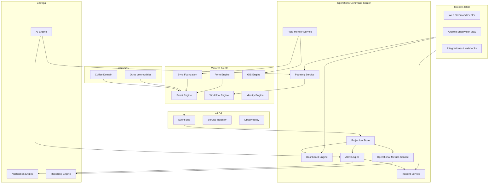
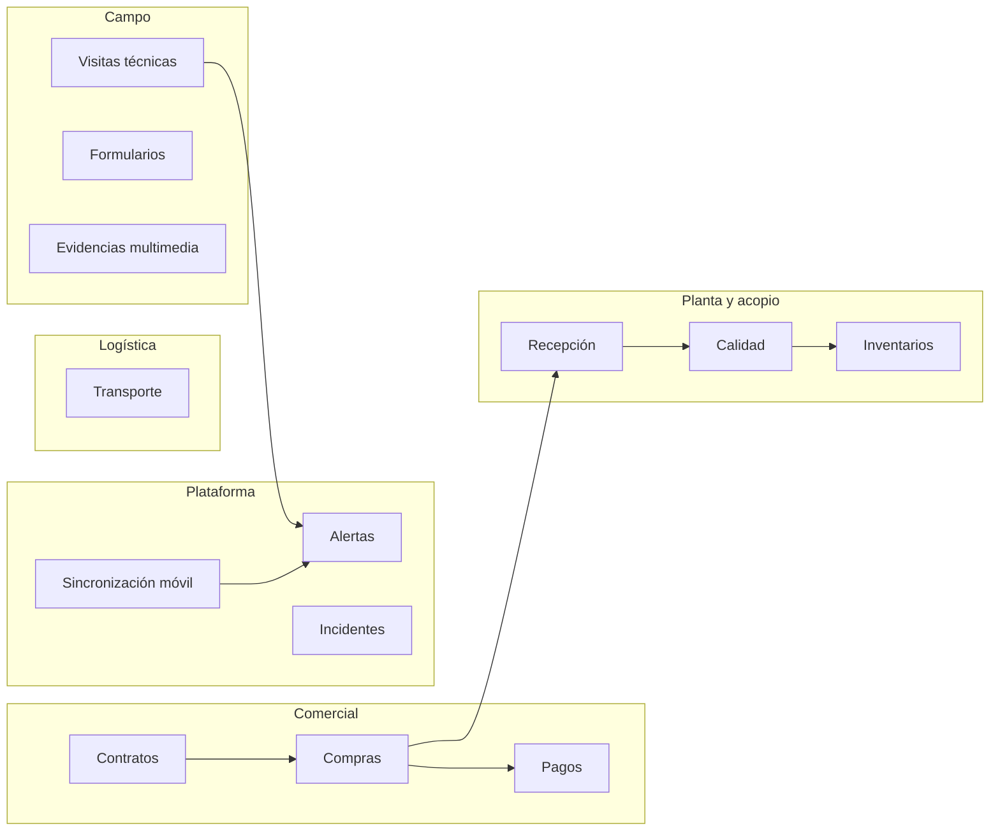
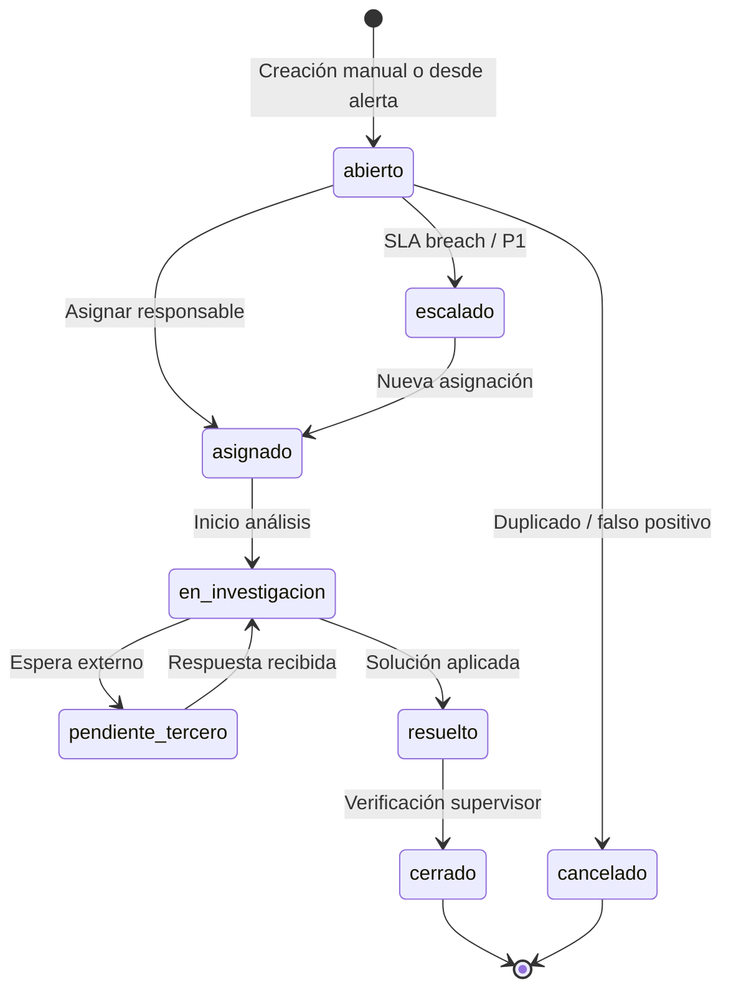
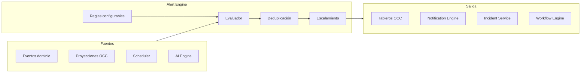

# AGROERP — Operations Command Center (OCC)

**Versión:** 1.0  
**Estado:** Oficial — Especificación del centro de coordinación operativa  
**Audiencia:** Operaciones, gerencia, arquitectura, producto, SRE, supervisores de campo y bodega  
**Naturaleza:** Plataforma transversal de coordinación — **no es un módulo de negocio ni un CRUD operativo**

---

## 0. Propósito y autoridad

El **Operations Command Center (OCC)** es el **centro de coordinación** de todas las actividades ejecutadas por la empresa en AGROERP: campo, compra, recepción, calidad, inventario, logística, contratos, pagos, sincronización móvil y cumplimiento.

| Pregunta | Documento que responde |
|----------|------------------------|
| ¿Qué operaciones existen en el negocio? | `COFFEE_DOMAIN.md` (CDP) |
| ¿Cómo se orquesta la plataforma? | `APOS.md` |
| ¿Cómo se gobiernan los datos? | `DATA_GOVERNANCE_PLATFORM.md` |
| **¿Cómo se monitorea, planifica y coordina la ejecución?** | **Este documento (OCC)** |

### Jerarquía documental

```
APOS.md                         → Orquestación de motores
COFFEE_DOMAIN.md                → Procesos y entidades de negocio
OPERATIONS_COMMAND_CENTER.md    → Coordinación operativa en tiempo real / diferido
AEPS.md                         → Implementación técnica
{ENGINE}.md                     → Motores individuales
```

**Regla de oro:** Toda actividad operativa relevante del dominio cafetero (y futuros dominios commodity) debe ser **observable, planificable y accionable** desde el OCC — ya sea en tiempo real o tras sincronización offline.

### Alcance

| Incluye | No incluye |
|---------|------------|
| Tableros operativos configurables | Implementación de pantallas UI |
| Planificación territorial y de recursos | Lógica transaccional de compra/inventario (CDP) |
| Motor de alertas operativas | Motor de notificaciones de entrega (Notification Engine) |
| Gestión de incidentes operativos | ITSM genérico (ServiceNow) |
| Monitoreo de campo y dispositivos | MDM de dispositivos corporativos |
| KPIs operativos tiempo real | DPAL Speed Layer → OCC |
| KPIs analíticos profundos y BI ejecutivo | `DATA_PLATFORM_ANALYTICS_LAYER.md` (DPAL) |
| Coordinación cross-módulo | Ejecución de workflows de negocio (Workflow Engine) |

### Modos de operación

| Modo | Descripción | Fuente de verdad |
|------|-------------|------------------|
| **Tiempo real** | Usuario conectado; eventos en segundos | Event Engine + telemetría móvil |
| **Diferido (offline)** | Captura en campo sin red; visibilidad post-sync | Sync Foundation + proyecciones OCC |
| **Batch / programado** | Alertas, reportes operativos, cierres de turno | Jobs APOS + OCC Scheduler |
| **Histórico** | Replay de operación por fecha/campaña | Event Store + proyecciones materializadas |

---

## 1. Visión y principios

### 1.1 Visión

El OCC convierte AGROERP de un conjunto de motores en una **sala de control operativa unificada** — comparable en espíritu a:

| Referencia | Capacidad análoga en OCC |
|------------|--------------------------|
| Control tower logístico | Visibilidad de transporte, recepciones y despachos |
| NOC (Network Operations Center) | Estado de dispositivos, sync y conectividad campo |
| Salesforce Operations Console | Vista 360° de actividades por rol |
| SAP IBP / TM | Planificación de recursos y capacidad |
| PagerDuty / Opsgenie | Alertas, incidentes, escalamiento |

### 1.2 Principios operativos

| # | Principio | Descripción |
|---|-----------|-------------|
| O1 | **Una sola verdad operativa** | Proyecciones OCC derivadas de eventos; no duplicar estado transaccional |
| O2 | **Event-driven visibility** | Todo cambio relevante actualiza vistas operativas vía consumo de eventos |
| O3 | **Rol-céntrico** | Cada actor ve lo que necesita coordinar, no todo el ERP |
| O4 | **Offline-aware** | Estado «pendiente de sync» es ciudadano de primera clase en tableros |
| O5 | **Accionable** | Toda alerta/incidente enlaza a recurso, workflow o reasignación |
| O6 | **Configurable sin código** | Widgets, umbrales, SLAs y reglas de alerta por organización |
| O7 | **Multi-tenant aislado** | Datos operativos segmentados por `organizationId` |
| O8 | **Commodity-extensible** | Misma plataforma OCC para café, cacao, palma, etc. |
| O9 | **Trazabilidad de decisiones** | Reasignaciones, escalamientos y cierres de incidente auditados |
| O10 | **Fail-visible** | Fallos de sync, calidad o SLA son visibles, no silenciosos |

### 1.3 Arquitectura conceptual



### 1.4 Componentes lógicos del OCC

| Componente | Sigla | Responsabilidad |
|------------|-------|-----------------|
| **Dashboard Engine** | DE | Tableros, widgets, filtros, personalización por rol |
| **Planning Service** | PS | Rutas, agendas, capacidad, reasignación |
| **Alert Engine** | AE | Reglas configurables, evaluación, escalamiento |
| **Incident Service** | IS | Ciclo de vida de incidentes operativos |
| **Field Monitor Service** | FMS | Telemetría de dispositivos y usuarios en campo |
| **Operational Metrics Service** | OMS | KPIs, SLAs, agregaciones en tiempo casi real |
| **Projection Store** | — | Vistas materializadas derivadas de eventos |
| **OCC Scheduler** | — | Evaluación periódica de alertas, SLAs y cierres de turno |

---

## 2. Áreas de operación

El OCC coordina **12 áreas operativas** alineadas al Coffee Domain Platform (CDP). Cada área expone entidades monitorables, estados, métricas y puntos de acción.

### 2.1 Mapa de áreas



### 2.2 Área: Visitas técnicas

| Dimensión | Contenido OCC |
|-----------|---------------|
| **Qué monitorear** | Visitas planificadas, en curso, pendientes revisión, completadas, vencidas |
| **Actores** | Técnico, Supervisor, Gerencia |
| **Eventos fuente** | `VisitaPlanificada`, `VisitaIniciada`, `VisitaCompletada`, `CompromisoIncumplido` |
| **Indicadores** | % cumplimiento agenda, visitas/día, tiempo promedio, GPS válido |
| **Acciones** | Reasignar, reprogramar, escalar a supervisor, abrir incidente |

### 2.3 Área: Compras de café

| Dimensión | Contenido OCC |
|-----------|---------------|
| **Qué monitorear** | Pre-órdenes pendientes, compras del día, en tránsito, fuera de política |
| **Actores** | Comprador, Supervisor, Gerencia |
| **Eventos fuente** | `PreOrdenCreada`, `CompraRegistrada`, `CupoConsumido` |
| **Indicadores** | Compras/día (kg), % cupo ejecutado, compras pendientes recepción |
| **Acciones** | Confirmar pre-orden, solicitar excepción cupo, asignar comprador |

### 2.4 Área: Recepción

| Dimensión | Contenido OCC |
|-----------|---------------|
| **Qué monitorear** | Recepciones en proceso, cola de báscula, pendientes calidad |
| **Actores** | Bodega, Comprador, Calidad |
| **Eventos fuente** | `RecepcionIniciada`, `RecepcionRegistrada`, `MuestraTomada` |
| **Indicadores** | Toneladas recibidas/día, tiempo recepción, backlog por bodega |
| **Acciones** | Priorizar recepción, alertar comprador por discrepancia peso |

### 2.5 Área: Calidad

| Dimensión | Contenido OCC |
|-----------|---------------|
| **Qué monitorear** | Muestras pendientes, análisis en curso, dictámenes, rechazos |
| **Actores** | Analista calidad, Supervisor, Bodega |
| **Eventos fuente** | `AnalisisIniciado`, `DictamenEmitido`, `InventarioEnCuarentena` |
| **Indicadores** | Tiempo dictamen, % rechazos, humedad promedio, backlog laboratorio |
| **Acciones** | Priorizar muestra, solicitar re-muestreo, liberar cuarentena |

### 2.6 Área: Inventarios

| Dimensión | Contenido OCC |
|-----------|---------------|
| **Qué monitorear** | Stock por bodega, cuarentena, reservado, alertas bajo mínimo |
| **Actores** | Bodega, Gerencia, Comercial |
| **Eventos fuente** | `InventarioActualizado`, `MermaRegistrada`, `DespachoRealizado` |
| **Indicadores** | kg por bodega, días rotación, merma %, capacidad utilizada |
| **Acciones** | Traslado interno, conteo cíclico, bloqueo por auditoría |

### 2.7 Área: Transporte

| Dimensión | Contenido OCC |
|-----------|---------------|
| **Qué monitorear** | Órdenes de transporte activas, vehículos en ruta, retrasos |
| **Actores** | Logística, Bodega, Comprador |
| **Eventos fuente** | `TransporteProgramado`, `CargueRegistrado`, `TransporteFinalizado` |
| **Indicadores** | Viajes activos, lead time finca→bodega, novedades abiertas |
| **Acciones** | Reasignar vehículo, notificar retraso, abrir incidente logístico |

### 2.8 Área: Contratos

| Dimensión | Contenido OCC |
|-----------|---------------|
| **Qué monitorear** | Contratos activos, por vencer, cupo agotado, sin ejecución |
| **Actores** | Comprador, Gerencia, Finanzas |
| **Eventos fuente** | `ContratoActivado`, `CupoConsumido`, `CupoAgotado`, `ContratoFirmado` |
| **Indicadores** | % cupo campaña, contratos por estado, valor comprometido |
| **Acciones** | Renovar, ampliar cupo (workflow), suspender productor |

### 2.9 Área: Pagos

| Dimensión | Contenido OCC |
|-----------|---------------|
| **Qué monitorear** | Liquidaciones pendientes, pagos programados, saldos productor |
| **Actores** | Finanzas, Gerencia, Productor (consulta) |
| **Eventos fuente** | `LiquidacionGenerada`, `PagoProgramado`, `PagoEjecutado` |
| **Indicadores** | Días promedio pago, saldo pendiente, pagos del día |
| **Acciones** | Aprobar lote de pagos, escalar retraso SLA |

### 2.10 Área: Alertas

| Dimensión | Contenido OCC |
|-----------|---------------|
| **Qué monitorear** | Alertas activas por severidad, ack pendiente, tiempo abierto |
| **Actores** | Todos según regla |
| **Eventos fuente** | `AlertaGenerada`, `AlertaReconocida`, `AlertaResuelta` |
| **Indicadores** | Alertas críticas abiertas, MTTA, MTTR |
| **Acciones** | Reconocer, asignar, escalar, convertir en incidente |

### 2.11 Área: Incidentes

| Dimensión | Contenido OCC |
|-----------|---------------|
| **Qué monitorear** | Incidentes abiertos, en investigación, SLA breach |
| **Actores** | Supervisor, Operaciones, Gerencia |
| **Eventos fuente** | `IncidenteCreado`, `IncidenteEscalado`, `IncidenteResuelto` |
| **Indicadores** | Incidentes abiertos, por categoría, tiempo resolución |
| **Acciones** | Asignar responsable, adjuntar evidencia, cerrar con causa raíz |

### 2.12 Área: Formularios

| Dimensión | Contenido OCC |
|-----------|---------------|
| **Qué monitorear** | Submissions pendientes sync, incompletos, rechazados revisión |
| **Actores** | Técnico, Supervisor |
| **Eventos fuente** | `FormularioCompletado`, `SyncCompletado`, `ConflictoSincronizacionDetectado` |
| **Indicadores** | Formularios/día, % completos con GPS, backlog sync |
| **Acciones** | Solicitar reenvío, devolver a técnico |

### 2.13 Área: Sincronización móvil

| Dimensión | Contenido OCC |
|-----------|---------------|
| **Qué monitorear** | Dispositivos, colas outbox, conflictos, última sync |
| **Actores** | Supervisor, Administrador, Técnico/Comprador |
| **Eventos fuente** | `SyncIniciado`, `SyncCompletado`, `SyncFallido`, `ConflictoSincronizacionDetectado` |
| **Indicadores** | % dispositivos sincronizados < 24h, conflictos abiertos, tiempo sync |
| **Acciones** | Forzar resolución, contactar usuario, abrir incidente plataforma |

### 2.14 Área: Evidencias multimedia

| Dimensión | Contenido OCC |
|-----------|---------------|
| **Qué monitorear** | Fotos/videos pendientes upload, sin GPS, rechazados |
| **Actores** | Técnico, Auditor, Supervisor |
| **Eventos fuente** | `EvidenciaCapturada`, `EvidenciaSincronizada`, `EvidenciaRechazada` |
| **Indicadores** | % evidencias válidas, backlog upload, tamaño cola |
| **Acciones** | Re-solicitar captura, priorizar upload |

### 2.15 Matriz área × rol OCC

| Área | Técnico | Comprador | Supervisor | Bodega | Calidad | Gerencia |
|------|---------|-----------|------------|--------|---------|----------|
| Visitas | Ejecuta | — | Coordina | — | — | KPI |
| Compras | — | Ejecuta | Aprueba | — | — | KPI |
| Recepción | — | Consulta | — | Ejecuta | Muestra | KPI |
| Calidad | — | Consulta | Escala | Cuarentena | Ejecuta | KPI |
| Inventario | — | — | Aprueba ajuste | Ejecuta | Retiene | KPI |
| Transporte | — | Coordina | — | Recibe | — | KPI |
| Contratos | — | Gestiona | Aprueba | — | — | KPI |
| Pagos | — | Consulta | — | — | — | Aprueba |
| Sync / Campo | Propio | Propio | Todos equipo | — | — | Resumen |
| Alertas | Propias | Propias | Territorio | Bodega | Lab | Todas críticas |
| Incidentes | Reporta | Reporta | Gestiona | Reporta | Reporta | Escala |

---

## 3. Tableros operativos (Dashboard Engine)

### 3.1 Modelo de tablero

| Concepto | Descripción |
|----------|-------------|
| **Dashboard** | Colección de widgets con filtros y layout persistente |
| **Widget** | Visualización de un KPI, lista, mapa, timeline o contador |
| **WidgetDefinition** | Plantilla registrada en OCC (tipo, schema de config, permisos) |
| **DashboardAssignment** | Tablero asignado a rol, usuario o equipo |
| **FilterContext** | Dimensión compartida: campaña, regional, fecha, bodega, técnico |
| **RefreshPolicy** | `realtime` (websocket/SSE), `polling` (N segundos), `on_demand` |

### 3.2 Tableros estándar por rol

#### 3.2.1 Estado general de la operación (Gerencia / Dirección)

| Widget sugerido | Fuente | Filtros |
|-----------------|--------|---------|
| Resumen compras del día (kg / $) | OMS | Campaña, regional |
| Mapa calor actividad territorial | FMS + GIS | Fecha, equipo |
| Alertas críticas abiertas | AE | Severidad ≥ alta |
| % cupo campaña ejecutado | OMS | Campaña |
| Incidentes abiertos por categoría | IS | Periodo |
| Timeline eventos significativos | Event projection | Últimas 24h |
| KPIs E2E (visita→compra→pago) | OMS | Regional |

#### 3.2.2 Técnicos en campo (Supervisor)

| Widget | Fuente |
|--------|--------|
| Mapa técnicos con última ubicación | FMS + GIS |
| Visitas planificadas vs realizadas hoy | PS + PROJ |
| Técnicos sin sync > N horas | FMS |
| Formularios pendientes por técnico | PROJ |
| Compromisos vencidos en cartera | CDP events |
| Cola de visitas pendientes revisión | WF + PROJ |
| Ranking productividad (visitas/semana) | OMS |

#### 3.2.3 Compradores (Supervisor comercial)

| Widget | Fuente |
|--------|--------|
| Compras del día por comprador | PROJ |
| Pre-órdenes offline pendientes confirmación | SYNC + PROJ |
| Cupos por agotar (< 20%) | AE projection |
| Productores sin compra en campaña | OMS |
| Recepciones pendientes de sus compras | PROJ |
| Contratos por vencer (30 días) | AE |

#### 3.2.4 Supervisores (Territorio)

| Widget | Fuente |
|--------|--------|
| Vista unificada campo + comercial de su zona | PROJ |
| Alertas territorio sin reconocer | AE |
| Incidentes abiertos asignados | IS |
| Cobertura % productores visitados | OMS |
| Excepciones de negocio pendientes | WF |
| Sync health del equipo | FMS |

#### 3.2.5 Bodega (Jefe de acopio)

| Widget | Fuente |
|--------|--------|
| Cola de recepciones en proceso | PROJ |
| Toneladas recibidas hoy / semana | OMS |
| Inventario por zona (disponible / cuarentena) | PROJ |
| Despachos programados hoy | PROJ |
| Alertas humedad / capacidad bodega | AE |
| Transportes en camino | PROJ |

#### 3.2.6 Calidad (Jefe de laboratorio)

| Widget | Fuente |
|--------|--------|
| Muestras pendientes análisis | PROJ |
| Tiempo promedio dictamen (rolling 7d) | OMS |
| % rechazos del periodo | OMS |
| Lotes en cuarentena | PROJ |
| Análisis fuera de especificación | AE |
| Catadores activos / carga trabajo | PROJ |

#### 3.2.7 Gerencia (Ejecutivo)

| Widget | Fuente |
|--------|--------|
| Scorecard campaña (compra, calidad, campo, finanzas) | OMS |
| Tendencia 30 días compras y pagos | OMS |
| Riesgos operativos top 5 | AE + AI |
| Cumplimiento SLA operativos | OMS |
| Comparativo regional | OMS |
| Proyección cierre campaña | OMS + AI |

### 3.3 Personalización

| Capacidad | Descripción |
|-----------|-------------|
| **Arrastrar/soltar widgets** | Layout por usuario (dentro de widgets permitidos por rol) |
| **Guardar vistas** | Múltiples dashboards por usuario |
| **Filtros globales** | Aplican a todos los widgets del tablero |
| **Export snapshot** | PDF/PNG del tablero en un instante (Reporting Engine) |
| **Compartir vista** | Supervisor comparte dashboard con equipo |
| **Widget drill-down** | Clic en KPI → detalle recurso / lista / mapa |

### 3.4 Catálogo de tipos de widget

| Tipo | Uso |
|------|-----|
| `kpi_card` | Número único con variación y umbral color |
| `kpi_sparkline` | Serie temporal compacta |
| `data_table` | Lista paginada de recursos operativos |
| `map_layer` | GIS: técnicos, fincas, rutas, bodegas |
| `timeline` | Stream de eventos recientes |
| `funnel` | Etapas (visita→contrato→compra→recepción) |
| `heatmap` | Densidad territorial |
| `status_board` | Columnas Kanban por estado |
| `alert_feed` | Feed de alertas con acciones |
| `incident_queue` | Cola de incidentes |
| `sync_health` | Matriz dispositivos × estado sync |
| `capacity_gauge` | Capacidad bodega/beneficio vs utilizada |
| `sla_tracker` | SLAs con semáforo verde/amarillo/rojo |

---

## 4. Planificación operativa (Planning Service)

### 4.1 Objetos de planificación

| Objeto | Descripción |
|--------|-------------|
| **Plan operativo** | Contenedor: campaña, semana, regional |
| **Plan de visitas** | Conjunto de visitas objetivo por periodo |
| **Ruta de visita** | Secuencia ordenada de fincas con tiempos estimados |
| **Agenda comprador** | Bloques de negociación / recolección por día |
| **Capacidad operativa** | Unidades disponibles: técnicos, vehículos, básculas, catadores |
| **Asignación de tarea** | Vínculo usuario ↔ actividad ↔ fecha |
| **Prioridad** | `critica` / `alta` / `media` / `baja` con reglas de ordenamiento |
| **Zona de cobertura** | Polígono o lista de veredas asignadas a equipo |

### 4.2 Planificación de rutas de visita

**Entradas:**
- Lista de fincas objetivo (compromisos vencidos, sin visita en N días, nuevos productores)
- Ubicación base del técnico
- Ventana horaria laboral
- Tiempo estimado por visita (histórico o default)
- Restricciones: vehículo, acceso, prioridad

**Proceso:**
1. Supervisor selecciona técnicos y periodo.
2. PS calcula ruta sugerida (GIS Engine: distancia, tiempo; AI opcional: optimización).
3. Supervisor ajusta manualmente (drag-drop en mapa).
4. Publicación genera `VisitaPlanificada` por cada parada.
5. Descarga a Android del plan del día.

**Salidas:** Ruta publicada, agenda en móvil, métrica cumplimiento vs plan.

### 4.3 Agenda de compradores

| Elemento | Descripción |
|----------|-------------|
| Bloque de negociación | Reunión con productor / finca |
| Bloque de recolección | Coordinación transporte |
| Bloque administrativo | Confirmación pre-órdenes, llamadas |
| Meta diaria | kg objetivo o # compras |

### 4.4 Priorización

| Factor | Peso configurable |
|--------|-------------------|
| Compromiso vencido | Alto |
| Cupo por agotar con productor activo | Alto |
| Certificación por auditar | Medio |
| Distancia / eficiencia ruta | Medio |
| Nuevo productor sin visita inicial | Alto |
| Alerta calidad abierta en finca | Alto |

### 4.5 Recursos y capacidad

| Recurso | Capacidad modelada |
|---------|-------------------|
| Técnico | Visitas/día máx., territorio |
| Comprador | Compras/día, monto máximo |
| Vehículo | kg o m³, rutas simultáneas |
| Báscula / muelle recepción | Toneladas/hora, ventanas |
| Catador | Muestras/día |
| Bodega | kg almacenamiento, % utilización |

**Alerta capacidad:** AE dispara cuando utilización > umbral (ej. bodega 90%).

### 4.6 Cobertura territorial

| Métrica | Definición |
|---------|------------|
| **Cobertura visita** | % productores con ≥1 visita en periodo |
| **Cobertura compra** | % productores con contrato activo y compra |
| **Huecos territoriales** | Veredas sin actividad en N días |
| **Balance de carga** | Desviación visitas entre técnicos de misma zona |

### 4.7 Reasignación de tareas

| Escenario | Flujo OCC |
|-----------|-----------|
| Técnico ausente | Supervisor reasigna visitas → evento `TareaReasignada` |
| Comprador sobrecargado | Redistribución de cartera temporal |
| Emergencia calidad | Prioridad muestra en laboratorio |
| Conflicto sync crítico | Asignar a administrador plataforma |

Toda reasignación:
- Registra motivo y autor.
- Notifica a afectados (Notification Engine).
- Actualiza proyecciones PS y DE.

---

## 5. Gestión de incidentes (Incident Service)

### 5.1 Definición

Un **incidente operativo** es un evento que interrumpe, retrasa o pone en riesgo la operación normal y requiere **investigación, responsable y resolución documentada**.

No confundir con:
- **Alerta:** señal automática; puede convertirse en incidente.
- **Excepción de negocio (CDP):** override de regla comercial vía Workflow.
- **Hallazgo auditoría:** puede generar incidente si es operativo urgente.

### 5.2 Categorías de incidente

| Categoría | Ejemplos |
|-----------|----------|
| `retraso_logistico` | Transporte > N horas, recepción no programada |
| `incumplimiento_campo` | Visita no realizada, GPS inválido sistemático |
| `calidad` | Rechazo masivo, humedad crítica, mezcla no conforme |
| `sync_plataforma` | Conflicto no resuelto, dispositivo sin sync > 72h |
| `evidencia` | Pérdida de fotos, upload fallido recurrente |
| `comercial` | Compra fuera de cupo detectada post-facto |
| `inventario` | Faltante, discrepancia peso significativa |
| `contrato` | Entrega incumplida recurrente del productor |
| `seguridad` | Acceso no autorizado, fraude sospechado |
| `evento_excepcional` | Clima, accidente, falla infraestructura |
| `otro` | Clasificación manual |

### 5.3 Severidad

| Nivel | Criterio | SLA respuesta | SLA resolución |
|-------|----------|---------------|----------------|
| **P1 — Crítica** | Detiene operación o riesgo financiero/legal alto | 15 min | 4 h |
| **P2 — Alta** | Impacto significativo en campaña o cliente | 1 h | 24 h |
| **P3 — Media** | Impacto localizado, workaround existe | 4 h | 72 h |
| **P4 — Baja** | Informativo, mejora operativa | 24 h | 7 días |

SLAs configurables por organización en catálogo `ops.incident_sla`.

### 5.4 Ciclo de vida



### 5.5 Modelo de incidente

| Campo | Descripción |
|-------|-------------|
| `id` | Identificador único |
| `organizationId` | Tenant |
| `title` | Resumen |
| `description` | Detalle |
| `category` | Catálogo `ops.incident_category` |
| `severity` | P1–P4 |
| `status` | Estado ciclo de vida |
| `sourceAlertId` | Alerta origen (opcional) |
| `relatedResources` | Compra, visita, recepción, dispositivo… |
| `assignedTo` | Responsable actual |
| `reportedBy` | Quien reporta |
| `territoryScope` | Regional / vereda para filtro supervisor |
| `openedAt` / `resolvedAt` / `closedAt` | Timestamps |
| `slaResponseDue` / `slaResolutionDue` | Deadlines |
| `rootCause` | Causa raíz al cerrar |
| `resolution` | Acción tomada |
| `evidences` | Fotos, documentos, links |
| `timeline` | Historial inmutable de cambios |

### 5.6 Flujo de resolución

1. **Creación** — Manual, desde alerta, o auto (regla AE → incidente si severidad P1).
2. **Triaje** — Supervisor asigna categoría, severidad, responsable.
3. **Investigación** — Notas, evidencias, consulta recursos relacionados.
4. **Acción** — Workflow CDP si aplica (excepción, re-proceso calidad, re-sync).
5. **Resolución** — Responsable documenta solución.
6. **Cierre** — Supervisor verifica; métricas SLA actualizadas.
7. **Post-mortem** (P1/P2) — Lección aprendida opcional para base conocimiento.

### 5.7 KPIs de incidentes

| KPI | Fórmula |
|-----|---------|
| Incidentes abiertos | Count status ∉ {cerrado, cancelado} |
| MTTA | Promedio (asignadoAt − abiertoAt) |
| MTTR | Promedio (cerradoAt − abiertoAt) |
| % SLA respuesta cumplido | Within SLA / total |
| % SLA resolución cumplido | Within SLA / total |
| Incidentes por categoría | Distribución periodo |
| Recurrencia | Mismo rootCause en 90 días |

---

## 6. Monitoreo en campo (Field Monitor Service)

### 6.1 Telemetría recolectada

| Señal | Origen | Frecuencia | Offline |
|-------|--------|------------|---------|
| Última ubicación GPS | Android heartbeat | Configurable (ej. 15 min en visita) | Buffer local → sync |
| Última sync exitosa | Sync Engine | Por sync | Sí |
| Estado conexión | Android | Por heartbeat | Último conocido |
| Formularios pendientes outbox | Android | Por sync / heartbeat | Sí |
| Sync fallidos (count) | Android + servidor | Por intento | Sí |
| Dispositivo activo | Heartbeat < N min | Tiempo real | Diferido |
| Nivel batería | Android (si permiso) | Heartbeat | Diferido |
| Versión app | Android | Login / heartbeat | Sí |
| Estado app | `foreground` / `background` / `killed` | Heartbeat | Diferido |
| Cola multimedia pendiente | Android | Por sync | Sí |
| Usuario / sesión activa | Identity | Login | Sí |

### 6.2 Modelo de dispositivo de campo

| Campo | Descripción |
|-------|-------------|
| `deviceId` | ID estable del dispositivo |
| `userId` | Usuario actual |
| `organizationId` | Tenant |
| `platform` | `android` |
| `appVersion` | Semver |
| `lastSeenAt` | Último heartbeat servidor |
| `lastSyncAt` | Última sync completa |
| `lastLocation` | Point + accuracy + timestamp |
| `connectionStatus` | `online` / `offline` / `degraded` |
| `batteryLevel` | 0–100 (opcional) |
| `pendingMutations` | Count outbox |
| `pendingMedia` | Count archivos |
| `failedSyncCount` | Rolling 24h |
| `activeVisitId` | Visita en curso (si aplica) |

### 6.3 Visualización OCC

| Vista | Contenido |
|-------|-----------|
| **Mapa en vivo** | Técnicos/compradores con icono por estado (en visita, en tránsito, offline largo) |
| **Lista dispositivos** | Tabla con semáforo sync health |
| **Detalle dispositivo** | Timeline sync, colas, últimas ubicaciones |
| **Detalle usuario campo** | Actividad del día: visitas, formularios, compras |

### 6.4 Umbrales de salud (configurables)

| Condición | Estado | Acción sugerida |
|-----------|--------|-----------------|
| Sin sync > 24h | `warning` | Alerta supervisor |
| Sin sync > 72h | `critical` | Incidente auto P3 |
| Conflictos > 0 | `warning` | Notificar usuario + supervisor |
| Batería < 15% en visita activa | `info` | Recordatorio sync |
| GPS sin actualizar > 2h en visita `en_curso` | `warning` | Alerta supervisor |
| App version < mínima soportada | `critical` | Bloqueo login (Identity policy) |

### 6.5 Privacidad y consentimiento

- Ubicación solo durante horario laboral o visita activa (política organización).
- Batería y estado app requieren permisos Android explícitos.
- Datos de telemetría clasificados **Interno** (DGMP DSS).
- Retención heartbeat: 90 días detalle; agregados 2 años.

---

## 7. Motor de alertas operativas (Alert Engine)

### 7.1 Arquitectura del Alert Engine



### 7.2 Modelo de regla de alerta

| Campo | Descripción |
|-------|-------------|
| `ruleId` | Identificador |
| `name` | Nombre legible |
| `organizationId` | Tenant (o global plantilla) |
| `enabled` | Activa / inactiva |
| `triggerType` | `event` / `schedule` / `threshold` / `composite` |
| `condition` | Expresión DVE-style (DGMP) o filtro evento |
| `severity` | `info` / `warning` / `high` / `critical` |
| `category` | Alineada a área operativa §2 |
| `audience` | Roles, equipos, usuarios específicos |
| `channels` | `in_app`, `push`, `email`, `sms` (vía Notification Engine) |
| `cooldownMinutes` | Anti-spam |
| `autoCreateIncident` | Si severidad ≥ umbral |
| `linkedWorkflowId` | Opcional |
| `commodityScope` | `coffee` / `*` (multi-cultivo) |

### 7.3 Catálogo de alertas estándar

| ID | Alerta | Trigger | Severidad |
|----|--------|---------|-----------|
| ALT-01 | Cupo próximo a agotarse (< 20%) | `CupoConsumido` threshold | warning |
| ALT-02 | Cupo agotado | `CupoAgotado` | high |
| ALT-03 | Contrato vence en N días | Schedule diario | warning |
| ALT-04 | Contrato vencido sin renovación | Schedule | high |
| ALT-05 | Inventario bajo mínimo | Threshold proyección | warning |
| ALT-06 | Bodega capacidad > 90% | Threshold | high |
| ALT-07 | Compra precio fuera de política | `CompraRegistrada` rule | high |
| ALT-08 | Compra sin contrato activo | Validación evento | critical |
| ALT-09 | Formulario incompleto > 48h | Schedule | warning |
| ALT-10 | Visita vencida sin ejecutar | Schedule | warning |
| ALT-11 | Visita sin GPS válido al cerrar | `VisitaCompletada` rule | high |
| ALT-12 | Humedad recepción > máximo | `RecepcionRegistrada` | high |
| ALT-13 | Dictamen rechazo total | `DictamenEmitido` | high |
| ALT-14 | Sin sync dispositivo > 24h | Schedule FMS | warning |
| ALT-15 | Sin sync dispositivo > 72h | Schedule FMS | critical |
| ALT-16 | Conflicto sync sin resolver > 24h | `ConflictoSincronizacionDetectado` | high |
| ALT-17 | Evidencia sin GPS | `EvidenciaCapturada` rule | warning |
| ALT-18 | Upload multimedia fallido × 3 | Sync telemetry | high |
| ALT-19 | Compromiso productor vencido | Schedule | warning |
| ALT-20 | Certificación por vencer | `CertificacionVencida` | warning |
| ALT-21 | Pago pendiente > SLA días | Schedule finanzas | high |
| ALT-22 | Liquidación sin aprobar > N días | Schedule | warning |
| ALT-23 | Transporte retrasado > ventana | `TransporteProgramado` + time | warning |
| ALT-24 | Merma inventario > umbral diario | Threshold | high |
| ALT-25 | Anomalía IA en patrón compra | AI Engine | warning |

### 7.4 Ciclo de vida de alerta

| Estado | Descripción |
|--------|-------------|
| `activa` | Generada, no reconocida |
| `reconocida` | Usuario tomó conocimiento |
| `en_proceso` | Acción en curso |
| `resuelta` | Condición ya no aplica |
| `suprimida` | Silenciada por cooldown o manual |
| `escalada` | Pasó a nivel superior / incidente |

### 7.5 Escalamiento

| Nivel | Tiempo sin ack | Destinatario |
|-------|----------------|--------------|
| L0 | — | Usuario / rol definido en regla |
| L1 | 30 min (P1) / 4h (P2) | Supervisor directo |
| L2 | 1h (P1) / 8h (P2) | Gerencia regional |
| L3 | 2h (P1) | Gerencia general / on-call |

---

## 8. KPIs operativos (Operational Metrics Service)

### 8.1 KPIs de campo

| KPI | Definición | Dimensión |
|-----|------------|-----------|
| Visitas realizadas vs planificadas | Realizadas / planificadas × 100 | Técnico, semana |
| Visitas por día | Count completadas | Técnico, regional |
| Tiempo promedio de visita | Σ duración / count | Técnico |
| % visitas con GPS válido | Dentro perímetro / total | Territorio |
| Cobertura geográfica | Productores visitados / activos | Vereda, campaña |
| Productividad técnico | Visitas + formularios / día laborable | Técnico |
| Compromisos cumplidos | Cerrados a tiempo / total | Cartera |

### 8.2 KPIs comerciales

| KPI | Definición |
|-----|------------|
| Compras por día | Σ kg netos registrados |
| Compras por comprador | kg y valor / periodo |
| Tiempo promedio atención comprador | Registro pre-orden → confirmación |
| % cupo cumplido | Comprado / asignado |
| Pre-órdenes pendientes | Count sin confirmar |
| Productividad comprador | kg comprados / día |

### 8.3 KPIs de recepción y bodega

| KPI | Definición |
|-----|------------|
| Toneladas recibidas / día | Por bodega |
| Tiempo promedio recepción | Llegada → cierre registro |
| Backlog recepción | Vehículos en espera |
| Capacidad utilizada bodega | Stock / capacidad × 100 |

### 8.4 KPIs de calidad

| KPI | Definición |
|-----|------------|
| Tiempo dictamen | Recepción → `DictamenEmitido` |
| % rechazos | Rechazos / recepciones |
| Backlog muestras | Pendientes análisis |
| Muestras por catador / día | Productividad laboratorio |

### 8.5 KPIs de plataforma y sync

| KPI | Definición |
|-----|------------|
| Tiempo promedio sincronización | Fin captura → `SyncCompletado` |
| % dispositivos sync < 24h | Dispositivos saludables / activos |
| Conflictos sync abiertos | Count sin resolver |
| Formularios pendientes sync | Outbox total equipo |
| Evidencias pendientes upload | Cola multimedia |

### 8.6 KPIs de incidentes y alertas

| KPI | Definición |
|-----|------------|
| Incidentes abiertos | Por severidad |
| MTTA / MTTR | Ver §5.7 |
| Alertas activas sin reconocer | Count |
| % SLA operativos cumplidos | Por tipo SLA |

### 8.7 SLAs operativos estándar

| SLA | Métrica | Objetivo default |
|-----|---------|------------------|
| SLA-VIS | Visita planificada ejecutada en fecha | 95% |
| SLA-SYN | Dispositivo sincronizado < 24h | 98% |
| SLA-REC | Recepción registrada < 2h desde llegada | 90% |
| SLA-CAL | Dictamen < 48h desde muestra | 85% |
| SLA-PAG | Pago < N días desde liquidación aprobada | 95% |
| SLA-INC | Resolución incidentes P1 | 90% dentro 4h |
| SLA-ALT | Reconocimiento alerta crítica | 95% < 30 min |

### 8.8 Segmentación

Todos los KPIs OCC soportan filtros:
- `organizationId`, campaña, regional, municipio/vereda
- Equipo, técnico, comprador, bodega
- Commodity (`coffee`, futuro `cacao`…)
- Ventana temporal: hoy, semana, mes, campaña, custom

---

## 9. Integraciones

### 9.1 Matriz de integración

| Motor / Dominio | Dirección | Uso en OCC |
|-----------------|-----------|------------|
| **Event Engine** | OCC consume | Fuente primaria de proyecciones y alertas por evento |
| **Workflow Engine** | Bidireccional | OCC muestra tareas pendientes; dispara workflows desde alertas |
| **Notification Engine** | OCC publica | Entrega push/email/SMS de alertas e incidentes |
| **GIS Engine** | OCC consume | Mapas, rutas, geofencing, cobertura territorial |
| **Reporting Engine** | OCC consume/publica | Snapshots históricos, export tableros, reportes programados |
| **Agro Intelligence, Automation & Decision Platform** | OCC consume / bidireccional | Riesgos, predicciones, automatizaciones, anomalías |
| **Coffee Domain** | OCC consume | Semántica de procesos, estados, entidades CDP |
| **Coffee Supply Agreement Engine** | OCC consume | Alertas cupo, vencimiento, cumplimiento acuerdos |
| **Coffee Procurement Engine** | OCC consume | Compras día, sync pendiente, anomalías, observadas |
| **Coffee Quality Intelligence Engine** | OCC consume | Backlog laboratorio, dictámenes, NC abiertas, SLA calidad |
| **Coffee Inventory & Traceability Engine** | OCC consume | Stock, capacidad bodega, mermas, lotes inmovilizados |
| **Coffee Settlement & Financial Engine** | OCC consume | Pagos pendientes, anticipos, SLA pago, saldos productor |
| **Coffee Logistics & Supply Chain Execution Engine** | OCC consume | Shipments en tránsito, retrasos, flota, GPS |
| **Producer Relationship Management Platform** | OCC consume | Pipeline vinculación, riesgo abandono |
| **Farm & Territory Intelligence Platform** | OCC consume | Mapas fincas, riesgos territoriales, cobertura geo |
| **Agronomic Intelligence & Technical Assistance Platform** | OCC consume | Cobertura visitas, recomendaciones vencidas, plagas |
| **Android Offline** | Bidireccional | Heartbeat, telemetría, estado sync, planes descargados |
| **Identity Engine** | OCC consume | Roles, scopes territoriales, equipos, delegaciones |
| **Form Engine** | OCC consume | Estado submissions, formularios incompletos |
| **Sync Foundation** | OCC consume | Colas, conflictos, cursores, métricas sync |
| **DGMP** | OCC consume | Calidad de datos operativos, duplicados productor |
| **APOS** | OCC registra | Service Registry, health, feature flags OCC |

### 9.2 Eventos que OCC publica

| Evento | Cuándo |
|--------|--------|
| `AlertaGenerada` | Regla AE disparada |
| `AlertaReconocida` | Usuario ack |
| `AlertaEscalada` | Timeout escalamiento |
| `AlertaResuelta` | Condición cleared |
| `IncidenteCreado` | Manual o auto desde alerta |
| `IncidenteAsignado` | Responsable asignado |
| `IncidenteEscalado` | SLA breach |
| `IncidenteResuelto` | Solución documentada |
| `IncidenteCerrado` | Verificación supervisor |
| `TareaReasignada` | Planning Service |
| `RutaPublicada` | Plan de visitas confirmado |
| `DashboardSnapshotExportado` | Export reporte |
| `SlaOperativoIncumplido` | OMS detecta breach |
| `DispositivoMarcadoCritico` | FMS umbral sync |

### 9.3 Eventos que OCC consume (muestra)

| Evento origen | Efecto OCC |
|---------------|------------|
| Todos eventos CDP §7 | Actualizar proyecciones |
| `SyncCompletado` / `SyncFallido` | FMS + alertas |
| `ConflictoSincronizacionDetectado` | Alerta + posible incidente |
| `WorkflowTaskCreated` | Widget tareas pendientes |
| `ExcepcionNegocioAprobada` | Timeline operación |

### 9.4 Notification Engine (contrato lógico)

OCC **no entrega** notificaciones directamente. Publica:

```json
{
  "type": "ops.notification.requested",
  "payload": {
    "templateKey": "ops.alert.cupo_bajo",
    "severity": "warning",
    "audience": { "roles": ["supervisor"], "scope": "regional_id" },
    "channels": ["in_app", "push"],
    "context": { "contractId": "...", "cupoPercent": 18 },
    "deepLink": "occ://alerts/{alertId}"
  }
}
```

### 9.5 Permisos OCC (Identity)

| Permiso | Descripción |
|---------|-------------|
| `ops:dashboard:read` | Ver tableros asignados |
| `ops:dashboard:configure` | Personalizar widgets propios |
| `ops:dashboard:admin` | Definir tableros organización |
| `ops:planning:read` | Ver planes y rutas |
| `ops:planning:write` | Crear/editar planes |
| `ops:planning:publish` | Publicar rutas a campo |
| `ops:alert:read` | Ver alertas en scope |
| `ops:alert:ack` | Reconocer alertas |
| `ops:alert:configure` | Reglas de alerta |
| `ops:incident:read` | Ver incidentes |
| `ops:incident:create` | Crear incidente |
| `ops:incident:manage` | Asignar, resolver, cerrar |
| `ops:field:monitor` | Ver telemetría dispositivos equipo |
| `ops:field:monitor_all` | Todos los dispositivos org |
| `ops:metrics:read` | KPIs operativos |
| `ops:admin` | Configuración OCC completa |

Scopes territoriales (Identity PBAC) aplican a todos los permisos `read` y `monitor`.

---

## 10. Escalabilidad multi-empresa y multi-commodity

### 10.1 Multi-tenant

| Aspecto | Estrategia |
|---------|------------|
| Datos | `organizationId` en toda proyección, alerta, incidente |
| Tableros | Plantillas globales; instancias por org |
| Reglas alerta | Herencia: plataforma → org override |
| SLAs | Catálogo por org |
| Commodity | Filtro `commodityScope` en reglas y widgets |

### 10.2 Extensión a otros commodities

| Elemento | Café | Futuro cacao |
|--------|------|--------------|
| Áreas operativas | 12 áreas CDP | Mismas áreas abstractas |
| Widgets | `coffee.purchases.today` | `cacao.purchases.today` |
| Alertas | ALT-01…25 café | Reglas específicas cacao |
| Planning | Rutas finca cafetal | Rutas finca cacaotal |
| KPIs | kg pergamino | kg grano |

**Patrón:** OCC core invariante; **plugins commodity** registran widgets, reglas y proyecciones vía EPF (`EXTENSION_PLUGIN_FRAMEWORK.md`) en APOS Plugin Registry.

### 10.3 Multi-sede / regional

| Concepto | Uso |
|----------|-----|
| `regionalId` | Filtro en todos los tableros |
| Jerarquía org | Org → Regional → Equipo → Usuario |
| Supervisión | Scope PBAC limita visibilidad |
| Consolidado gerencia | Roll-up de regionales |

---

## 11. Modelo de datos lógico (proyecciones)

### 11.1 Proyecciones materializadas

| Proyección | Actualizada por | Uso |
|------------|-----------------|-----|
| `ops_daily_purchases` | `CompraRegistrada`, `RecepcionRegistrada` | KPIs compra |
| `ops_visit_plan_status` | `VisitaPlanificada`, `VisitaCompletada` | Tablero campo |
| `ops_device_health` | Heartbeat, sync events | FMS |
| `ops_inventory_position` | Movimientos inventario | Tablero bodega |
| `ops_alert_active` | Alert Engine | Feed alertas |
| `ops_incident_queue` | Incident Service | Cola incidentes |
| `ops_sla_status` | OMS scheduler | Semáforos SLA |
| `ops_contract_cupo` | Eventos cupo/contrato | Alertas comerciales |

### 11.2 Principio de actualización

- **Event sourcing ligero:** proyecciones se actualizan por consumidores idempotentes del Event Bus.
- **Lag aceptable:** < 5s tiempo real; < 1 min batch scheduler.
- **Rebuild:** proyección reconstruible desde Event Store por rango de fechas.

---

## 12. Roadmap de implementación

| Fase | Entregables OCC | Dependencias |
|------|-----------------|--------------|
| **Fase 1 — Visibilidad** | Proyecciones básicas, tableros estándar gerencia/supervisor, KPIs campo y compra | Event Engine, CDP eventos |
| **Fase 2 — Alertas** | Alert Engine, 10 reglas estándar, integración Notification Engine | Notification Engine |
| **Fase 3 — Campo** | FMS, heartbeat Android, mapa técnicos | GIS Engine, Android |
| **Fase 4 — Planificación** | Rutas visita, agenda comprador, reasignación | GIS, PS |
| **Fase 5 — Incidentes** | Incident Service completo, SLAs, escalamiento | Workflow |
| **Fase 6 — Inteligencia** | AI anomalías, optimización rutas, predicción backlog | AI Engine |
| **Fase 7 — Multi-commodity** | Plugin pattern cacao | Cacao Domain |

---

## 13. Checklist de cumplimiento OCC

Antes de considerar un módulo operativo «integrado al OCC»:

- [ ] Eventos de dominio registrados y consumidos por proyección OCC
- [ ] Entidades visibles en al menos un widget o KPI
- [ ] Reglas de alerta documentadas para excepciones críticas
- [ ] Permisos `ops:*` asignados a roles CDP
- [ ] Scope territorial respetado en consultas
- [ ] Estados offline representados en tableros
- [ ] Registro en APOS Service Registry
- [ ] Ficha en Data Catalog (DGMP) para métricas derivadas

---

## 14. Conclusión

El **Operations Command Center (OCC)** es el **centro nervioso operativo** de AGROERP. Coordina:

- **12 áreas de operación** alineadas al Coffee Domain Platform
- **7 tableros estándar** por rol con widgets configurables
- **Planificación** de rutas, agendas, capacidad y cobertura territorial
- **Gestión de incidentes** con categorías, severidad, SLAs y ciclo de vida completo
- **Monitoreo de campo** con telemetría de dispositivos, sync y ubicación
- **25+ reglas de alerta** configurables y escalamiento automático
- **40+ KPIs operativos** y SLAs medibles
- **Integración nativa** con Workflow, Notification, GIS, Reporting, AI, Android e Identity

El diseño es **multi-tenant**, **offline-aware**, **commodity-extensible** y preparado para empresas con operaciones de misión crítica en zonas rurales.

**Este documento es el estándar oficial** para toda coordinación operativa presente y futura de AGROERP.

---

*Documento elaborado para AGROERP — Operations Command Center v1.0.*  
*Jerarquía:* `APOS.md` → `COFFEE_DOMAIN.md` → **`OPERATIONS_COMMAND_CENTER.md`** → implementación AEPS  
*Próximo paso recomendado:* Fase 1 — proyecciones Event Store + tablero supervisor/gerencia.
