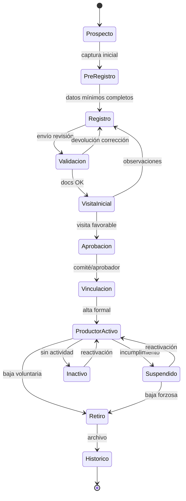
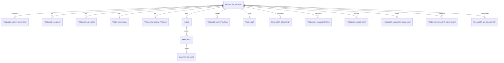

# AGROERP — Producer Relationship Management Platform (PRM)

**Versión:** 1.0  
**Estado:** Oficial — Especificación de la plataforma de relación con productores  
**Audiencia:** Comercial, extensionismo, cooperativas, gerencia, arquitectura, auditoría, legal, campo  
**Naturaleza:** Plataforma empresarial de dominio — **no es un CRUD de productores, un módulo de terceros ni un directorio**

---

## 0. Propósito y autoridad

El **Producer Relationship Management Platform (PRM)** administra **toda la vida del productor dentro de AGROERP**: identidad, ciclo de vida, territorio productivo, relación comercial, desempeño, certificaciones, visitas, comunicaciones, documentación, segmentación e inteligencia de cartera. Es el **núcleo del negocio** y el **golden record** del productor para la organización.

| Pregunta | Documento que responde |
|----------|------------------------|
| ¿Qué procesos del dominio involucran al productor? | `COFFEE_DOMAIN.md` (CDP §2, §4.1–4.4) |
| ¿Catálogos productor y finca? | `MASTER_DATA_ENGINE.md` (`producer.*`, `farm.*`, `party.*`) |
| ¿Golden record y gobierno del dato? | `DATA_GOVERNANCE_PLATFORM.md` |
| ¿Contratos y cupos? | `COFFEE_SUPPLY_AGREEMENT_ENGINE.md` (CSAE) |
| ¿Compras en campo? | `COFFEE_PROCUREMENT_ENGINE.md` (CPE) |
| ¿Cuenta corriente y pagos? | `COFFEE_SETTLEMENT_FINANCIAL_ENGINE.md` (CSFE) |
| ¿Calidad por entrega? | `COFFEE_QUALITY_INTELLIGENCE_ENGINE.md` (CQIE) |
| ¿Catastro y polígonos finca/lote? | `FARM_TERRITORY_INTELLIGENCE_PLATFORM.md` (FTIP) |
| ¿Visitas técnicas y asistencia agronómica? | `AGRONOMIC_INTELLIGENCE_TECHNICAL_ASSISTANCE_PLATFORM.md` (AITAP) |
| **¿Quién es el productor, en qué estado está y cómo performa en la relación?** | **Este documento (PRM)** |

### Jerarquía documental

```
DATA_GOVERNANCE_PLATFORM.md              → Golden record, calidad dato, lineage
PRODUCER_RELATIONSHIP_MANAGEMENT_PLATFORM.md → Relación productor 360° (PRM) — núcleo
FARM_TERRITORY_INTELLIGENCE_PLATFORM.md  → Catastro y territorio (FTIP)
AGRONOMIC_INTELLIGENCE_TECHNICAL_ASSISTANCE_PLATFORM.md → Asistencia técnica (AITAP)
COFFEE_DOMAIN.md                         → Dominio cafetero
COFFEE_SUPPLY_AGREEMENT_ENGINE.md        → Acuerdos (CSAE)
COFFEE_PROCUREMENT_ENGINE.md             → Compras (CPE)
COFFEE_SETTLEMENT_FINANCIAL_ENGINE.md    → Finanzas productor (CSFE)
FORM_ENGINE.md / ANDROID_FIELD_APP.md    → Captura visitas y registro campo
AEPS.md                                  → Implementación técnica
```

**Regla de oro:** El PRM es la **única fuente autoritativa de identidad y ciclo de vida del productor**. La **geometría territorial** es autoritativa en **FTIP**. La **asistencia técnica** (visitas, planes, diagnósticos, recomendaciones) es autoritativa en **AITAP** — PRM consume eventos para timeline. Ningún motor transaccional opera con productor no activo en PRM.

### Distinción crítica

| Sistema | Responsabilidad |
|---------|-----------------|
| **CRM genérico** (Salesforce, HubSpot) | Pipeline ventas B2B |
| **Directorio / maestro pasivo** | Listado sin lifecycle ni relación operativa |
| **PRM** | Vida completa del productor en la cadena agroindustrial |
| **CSFE** | Ledger financiero productor (PRM muestra vista consolidada) |
| **CPE** | Ejecución compra (PRM muestra historial comercial) |
| **DGMP** | Gobierno del dato (PRM consume y publica calidad) |

### Principios inviolables

| # | Principio | Descripción |
|---|-----------|-------------|
| P1 | **Producer as golden record** | Un productor = un `ProducerProfile` autoritativo por org |
| P2 | **Lifecycle-gated operations** | Estado PRM habilita o bloquea operaciones downstream |
| P3 | **360° without duplication** | Transacciones viven en motores especializados; PRM proyecta |
| P4 | **Event-sourced lifecycle** | Cambios de estado = `ProducerLifecycleEvent` inmutable |
| P5 | **Territory native** | Fincas y lotes productivos con GIS obligatorio |
| P6 | **Relationship-centric** | Asignaciones comprador/técnico, comunicaciones, visitas |
| P7 | **Segmentation dynamic** | Segmentos calculados por reglas, no etiquetas estáticas |
| P8 | **Full audit trail** | Quién, cuándo, por qué en cada cambio de relación |
| P9 | **Offline-first registration** | Pre-registro y visita inicial sin red |
| P10 | **Commodity-extensible** | Core abstracto; café = primera implementación |

### Alcance

| Incluye | No incluye |
|---------|------------|
| Ciclo de vida productor completo | UI expediente / mapas |
| Identidad, contactos, familia, social | Liquidación y pago (CSFE) |
| Fincas y lotes productivos | Inventario físico bodega (CITE) |
| Certificaciones productor/finca | Dictamen laboratorio (CQIE) |
| Visitas y seguimiento técnico | Ejecución compra (CPE) |
| Vista comercial y financiera consolidada | Negociación contractual (CSAE ejecuta) |
| Segmentación, indicadores, comunicaciones | Campañas marketing masivo (futuro) |
| Documentos expediente productor | |
| Integración workflow alta/suspensión/retiro | |

---

## 1. Visión y arquitectura funcional

### 1.1 Visión

El PRM es el **corazón funcional de AGROERP** — comparable en espíritu a:

| Referencia | Capacidad análoga |
|------------|-------------------|
| SAP Business Partner + Agri master | Socio de negocio agrícola |
| Farmer registration platforms (Fairtrade, RA) | Expediente productor certificable |
| Agribusiness grower management | Cartera productores + territorio |
| CRM agrícola (Granular, Conservis) | Relación + desempeño productivo |
| Cooperative member management | Socios, aportes, cumplimiento |
| MDM Party master | Golden record persona/organización |

### 1.2 Arquitectura conceptual

```mermaid
graph TB
    subgraph Clients["Clientes"]
        WEB[Web Comercial / Técnico]
        AND[Android Campo]
        OCC[Operations Command Center]
        PORTAL[Portal Productor futuro]
    end

    subgraph PRM["Producer Relationship Management Platform"]
        PLM[Producer Lifecycle Manager]
        PIM[Producer Identity Service]
        FRM[Farm & Plot Registry]
        VST[Visit Orchestration Service]
        DOC[Producer Document Vault]
        CRT[Certification Registry]
        SEG[Segmentation Engine]
        IND[Indicator & Score Service]
        COM[Communication Log Service]
        PRJ[Producer 360 Projection Store]
        VAL[Producer Validation Engine]
        ASN[Assignment Service]
    end

    subgraph Platform["Plataforma"]
        WF[Workflow Engine]
        EVT[Event Engine]
        RES[Resource Engine]
        ID[Identity Engine]
        GIS[GIS Engine]
        DOCENG[Document Engine]
        META[Metadata Engine]
        SYNC[Sync Foundation]
        NOTIF[Notification Engine]
    end

    subgraph Domain["Motores dominio"]
        CSAE[Supply Agreement Engine]
        CPE[Procurement Engine]
        CSFE[Settlement Engine]
        CQIE[Quality Engine]
        CLSE[Logistics Engine]
    end

    subgraph Governance["Gobierno"]
        DGMP[Data Governance Platform]
        MDM[Master Data Engine]
    end

    CSAE --> PRJ
    CPE --> PRJ
    CSFE --> PRJ
    CQIE --> PRJ
    CLSE --> PRJ
    PRM --> EVT
    EVT --> PRJ
    DGMP --> PIM
    Clients --> PRM
```



### 1.3 Componentes lógicos

| Componente | Responsabilidad |
|------------|-----------------|
| **Producer Lifecycle Manager (PLM)** | Estados, transiciones, reglas habilitación |
| **Producer Identity Service (PIM)** | Datos personales, documentos identidad, contactos |
| **Farm & Plot Registry (FRM)** | Fincas, lotes productivos, GIS, producción histórica |
| **Visit Orchestration Service** | Agenda, visitas, hallazgos, seguimientos |
| **Producer Document Vault** | Expediente documental |
| **Certification Registry** | Certificaciones productor/finca/lote |
| **Segmentation Engine** | Segmentos dinámicos por reglas |
| **Indicator & Score Service** | KPIs productor, scores calidad/riesgo/valor |
| **Communication Log Service** | Registro interacciones |
| **Assignment Service** | Cartera comprador/técnico |
| **Producer 360 Projection Store** | Vista consolidada materializada |
| **Producer Validation Engine** | Pre-alta, KYC, duplicados, elegibilidad |

---

## 2. Ciclo de vida del productor

### 2.1 Estados del lifecycle



### 2.2 Definición de estados

| Estado | Código | Descripción | Operaciones permitidas |
|--------|--------|-------------|------------------------|
| **Prospecto** | `prospect` | Lead identificado, sin datos formales | Captura preliminar |
| **Pre-registro** | `pre_registered` | Datos básicos offline/web | Completar registro |
| **Registro** | `registered` | Expediente en construcción | Edición, documentos |
| **Validación** | `under_validation` | Revisión documental/KYC | Corrección |
| **Visita inicial** | `initial_visit_pending` | Pendiente visita campo | Agendar visita |
| **Aprobación** | `pending_approval` | Visita OK, pendiente comité | Aprobar/rechazar |
| **Vinculación** | `linking` | Alta formal en progreso | Contrato inicial |
| **Productor activo** | `active` | Operación plena | Compra, contrato, pago |
| **Suspendido** | `suspended` | Bloqueado temporalmente | Solo consulta, regularización |
| **Inactivo** | `inactive` | Sin actividad comercial N meses | Reactivación |
| **Retiro** | `withdrawn` | Baja de cartera | Solo histórico |
| **Histórico** | `archived` | Archivado legalmente | Solo lectura auditoría |

### 2.3 ProducerLifecycleEvent

| Atributo | Descripción |
|----------|-------------|
| `eventId` | UUID |
| `producerId` | |
| `fromStatus` | Estado anterior |
| `toStatus` | Estado nuevo |
| `transitionCode` | Catálogo transición |
| `reasonCode` | Motivo (suspensión, retiro…) |
| `reasonNotes` | Texto libre |
| `performedBy` | Usuario |
| `approvedBy` | Si workflow |
| `workflowInstanceId` | |
| `occurredAt` | |
| `evidenceDocumentIds` | |
| `immutable` | true |

**Invariante:** Todo cambio de `lifecycleStatus` genera exactamente un `ProducerLifecycleEvent`.

### 2.4 Reglas de habilitación downstream

| Estado PRM | CPE compra | CSAE contrato | CSFE pago | CLSE recolección |
|------------|------------|---------------|-----------|------------------|
| `active` | ✓ | ✓ | ✓ | ✓ |
| `suspended` | ✗ | ✗ | △ solo deuda | ✗ |
| `inactive` | ✗ | △ renovación | △ saldo pendiente | ✗ |
| `pre_registered` | ✗ | ✗ | ✗ | ✗ |
| `withdrawn` / `archived` | ✗ | ✗ | ✗ | ✗ |

△ = según política org configurable vía Metadata Engine.

---

## 3. Modelo de entidades

### 3.1 Diagrama agregados



### 3.2 ProducerProfile (golden record)

| Atributo | Descripción |
|----------|-------------|
| `producerId` | UUID — PK global |
| `organizationId` | Tenant |
| `producerNumber` | Código humano único org |
| `producerTypeCode` | `producer.type` — natural, jurídica, asociación |
| `legalName` | Nombre legal / razón social |
| `commercialName` | Nombre comercial |
| `documentTypeCode` | `party.id_document_type` |
| `documentNumber` | Único por tipo+org |
| `taxId` | NIT/RUT si aplica |
| `birthDate` | Persona natural |
| `genderCode` | Opcional |
| `nationalityCode` | |
| `primaryLanguageCode` | |
| `lifecycleStatus` | §2 |
| `categoryCode` | `producer.category` |
| `leadSourceCode` | `producer.lead_source` |
| `photoUrl` | Fotografía |
| `biometricRef` | Referencia biométrica (preparado) |
| `signatureUrl` | Firma capturada |
| `preferredPaymentMethodCode` | Ref CSFE |
| `defaultBankAccountRef` | Ref CSFE — no duplicar datos sensibles |
| `riskScore` | 0–100 IA |
| `qualityScore` | Promedio CQIE |
| `lifetimeValueScore` | Valor esperado IA |
| `registeredAt` | Fecha vinculación |
| `activatedAt` | |
| `lastActivityAt` | Última compra/visita/comunicación |
| `lastVisitAt` | |
| `assignedBuyerId` | Comprador cartera |
| `assignedTechnicianId` | Técnico extensión |
| `notes` | Observaciones permanentes |
| `metadata` | Atributos extensibles Metadata Engine |
| `goldenRecordVersion` | Versión DGMP |
| `createdAt` | |
| `updatedAt` | |
| `deletedAt` | Soft delete → solo `archived` |

**Invariantes:**
- `documentNumber` + `documentTypeCode` único por `organizationId` (salvo excepción workflow fusion).
- Un productor activo debe tener ≥1 finca registrada (configurable).
- Productor jurídico puede tener `ProducerGroupMember` vinculados.

### 3.3 ProducerContact

| Atributo | Descripción |
|----------|-------------|
| `contactId` | UUID |
| `producerId` | |
| `contactType` | `primary`, `secondary`, `emergency`, `authorized_signatory`, `billing` |
| `fullName` | |
| `relationship` | Cónyuge, hijo, administrador… |
| `phone` | E.164 |
| `phoneSecondary` | |
| `email` | |
| `whatsapp` | |
| `isPrimary` | bool |
| `verifiedAt` | OTP / verificación |
| `preferredChannel` | sms, whatsapp, email, call |

### 3.4 ProducerAddress

| Atributo | Descripción |
|----------|-------------|
| `addressId` | UUID |
| `producerId` | |
| `addressType` | `residence`, `correspondence`, `billing`, `collection_point` |
| `countryCode` | `geo.country` |
| `departmentCode` | `geo.department` |
| `municipalityCode` | `geo.municipality` |
| `veredaCode` | `geo.vereda` |
| `streetAddress` | |
| `geo` | Point (GIS) |
| `altitudeM` | msnm |
| `isPrimary` | |
| `verifiedAt` | Visita / geocodificación |

### 3.5 ProducerFamily

| Atributo | Descripción |
|----------|-------------|
| `familyId` | UUID |
| `producerId` | |
| `householdSize` | Personas en hogar |
| `generationalRelayNotes` | Relevo generacional |
| `permanentWorkersCount` | Empleados permanentes finca |
| `temporaryWorkersCount` | Temporales cosecha |
| `updatedAt` | |

### 3.6 FamilyMember

| Atributo | Descripción |
|----------|-------------|
| `memberId` | UUID |
| `familyId` | |
| `fullName` | |
| `relationshipCode` | cónyuge, hijo, padre, otro |
| `birthYear` | |
| `participatesInFarmWork` | bool |
| `isSuccessor` | Relevo generacional |
| `documentNumber` | Opcional |
| `notes` | |

### 3.7 ProducerSocialProfile

| Atributo | Descripción |
|----------|-------------|
| `socialProfileId` | UUID |
| `producerId` | |
| `communityLeadershipNotes` | Liderazgo comunitario |
| `updatedAt` | |

### 3.8 AssociationMembership

| Atributo | Descripción |
|----------|-------------|
| `membershipId` | UUID |
| `producerId` | |
| `organizationName` | Cooperativa, comité, asociación |
| `organizationType` | `cooperative`, `committee`, `ngo`, `government` |
| `roleCode` | `producer.association_role` |
| `memberSince` | |
| `memberUntil` | |
| `isActive` | |
| `documentUrl` | Certificado membresía |

### 3.9 Farm (finca) — referencia territorial

> **Nota v1.1 arquitectónica:** La entidad autoritativa de finca, parcela, lote y geometría es **`FarmUnit` en FTIP** (`FARM_TERRITORY_INTELLIGENCE_PLATFORM.md`). PRM mantiene referencia y relación productor.

| Atributo | Descripción |
|----------|-------------|
| `farmId` | UUID — ID relación PRM |
| `ftipFarmUnitId` | **Ref FTIP** — golden record territorial |
| `producerId` | Titular relación |
| `organizationId` | |
| `farmCode` | Código interno |
| `farmName` | |
| `farmTypeCode` | `farm.type` |
| `tenureTypeCode` | `farm.tenure_type` |
| `countryCode` | |
| `departmentCode` | |
| `municipalityCode` | |
| `veredaCode` | |
| `centroidGeo` | Point — **proyectado desde FTIP** |
| `boundaryGeo` | Polygon — **proyectado desde FTIP** |
| `totalAreaHa` | |
| `coffeeAreaHa` | |
| `altitudeMinM` | |
| `altitudeMaxM` | |
| `productionSystemCode` | `farm.production_system` |
| `irrigationTypeCode` | |
| `infrastructureCodes` | Beneficio, secador… |
| `status` | `active`, `inactive`, `abandoned`, `under_validation` |
| `registeredAt` | |
| `lastVisitAt` | |
| `certificationIds` | Refs activas |
| `photoUrls` | |
| `notes` | |

### 3.10 FarmPlot (lote productivo) — referencia territorial

> **Ref FTIP:** `ftipLotUnitId` → `LotUnit` en FTIP. Distinto de **lote inventario CITE**.

| Atributo | Descripción |
|----------|-------------|
| `plotId` | UUID |
| `farmId` | |
| `plotCode` | |
| `plotName` | |
| `plotTypeCode` | `farm.lot_type` |
| `boundaryGeo` | Polygon |
| `areaHa` | |
| `speciesCode` | `farm.coffee_species` |
| `varietyCodes` | `farm.coffee_variety` — puede ser mixto |
| `plantingYear` | |
| `plantAgeYears` | Calculado |
| `densityPlantsHa` | |
| `densityBandCode` | `farm.planting_density_band` |
| `shadeSystemCode` | |
| `shadeSpeciesCodes` | |
| `estimatedYieldKgHa` | |
| `status` | `productive`, `renovation`, `reserve`, `abandoned` |
| `lastHarvestAt` | |
| `notes` | |

### 3.11 HarvestRecord (historial cosecha)

| Atributo | Descripción |
|----------|-------------|
| `harvestId` | UUID |
| `plotId` | |
| `farmId` | |
| `producerId` | |
| `campaignCode` | `trade.campaign` |
| `harvestTypeCode` | `farm.harvest_type` |
| `estimatedProductionKg` | |
| `actualProductionKg` | Si conocido |
| `deliveredKg` | Σ entregas CPE |
| `varianceKg` | estimado vs entregado |
| `qualityAvgScore` | CQIE |
| `recordedAt` | |
| `source` | `visit`, `purchase`, `producer_declaration` |

### 3.12 ProducerCertification

| Atributo | Descripción |
|----------|-------------|
| `certificationId` | UUID |
| `producerId` | |
| `scopeType` | `cert.scope_type` — productor, finca, lote, grupo |
| `scopeId` | farmId, plotId si aplica |
| `schemeCode` | `cert.scheme` — orgánico, FT, RA, 4C… |
| `certificateNumber` | |
| `issuedBy` | Certificadora |
| `issuedAt` | |
| `expiresAt` | |
| `status` | `cert.status` — vigente, vencida, suspendida |
| `auditResultCode` | |
| `documentUrl` | PDF certificado |
| `lastAuditAt` | |
| `nextAuditDue` | |
| `alertDaysBefore` | Vencimiento |

### 3.13 FieldVisit — referencia AITAP

> **Nota v1.1 arquitectónica:** La ejecución autoritativa de visitas técnicas es **`TechnicalVisit` en AITAP** (`AGRONOMIC_INTELLIGENCE_TECHNICAL_ASSISTANCE_PLATFORM.md`). PRM mantiene referencia en timeline productor.

| Atributo | Descripción |
|----------|-------------|
| `visitId` | UUID — ID relación PRM |
| `aitapVisitId` | **Ref AITAP** — visita técnica autoritativa |
| `producerId` | |
| `farmId` | Opcional |
| `plotIds` | Array |
| `visitTypeCode` | `field.visit_type` |
| `visitStatusCode` | `field.visit_status` |
| `objectiveCodes` | `field.visit_objective` |
| `scheduledAt` | |
| `startedAt` | |
| `completedAt` | |
| `technicianId` | |
| `gpsAtStart` | |
| `gpsAtEnd` | |
| `formSubmissionId` | Dynamic Forms |
| `findingsSummary` | |
| `recommendations` | Texto / JSON |
| `followUpRequired` | bool |
| `followUpDueAt` | |
| `followUpVisitId` | Cadena seguimiento |
| `incidentRefs` | Si hallazgo crítico |
| `evidenceBundleId` | Fotos, video |
| `offlineCaptured` | |
| `workflowInstanceId` | Si requiere aprobación |

### 3.14 VisitFinding

| Atributo | Descripción |
|----------|-------------|
| `findingId` | UUID |
| `visitId` | |
| `findingTypeCode` | `field.finding_type` |
| `severityCode` | `field.finding_severity` |
| `description` | |
| `plotId` | |
| `gps` | |
| `photoUrls` | |
| `correctiveActionDue` | |
| `status` | `open`, `in_progress`, `closed` |

### 3.15 ProducerDocument

| Atributo | Descripción |
|----------|-------------|
| `documentId` | UUID |
| `producerId` | |
| `documentType` | `identity`, `contract`, `certificate`, `photo`, `video`, `form`, `legal`, `other` |
| `title` | |
| `fileUrl` | Document Engine |
| `mimeType` | |
| `issuedAt` | |
| `expiresAt` | |
| `verifiedBy` | |
| `verifiedAt` | |
| `relatedEntityType` | farm, certification, visit |
| `relatedEntityId` | |
| `status` | `pending`, `verified`, `rejected`, `expired` |
| `retentionPolicyCode` | DGMP |

### 3.16 ProducerCommunication

| Atributo | Descripción |
|----------|-------------|
| `communicationId` | UUID |
| `producerId` | |
| `channel` | `call`, `sms`, `whatsapp`, `email`, `visit`, `notification`, `in_app` |
| `direction` | `inbound`, `outbound` |
| `subject` | |
| `body` | Resumen |
| `occurredAt` | |
| `performedBy` | Usuario interno |
| `contactId` | |
| `relatedVisitId` | |
| `notificationId` | Ref Notification Engine |
| `campaignRef` | Futuro campañas |

### 3.17 ProducerAssignment

| Atributo | Descripción |
|----------|-------------|
| `assignmentId` | UUID |
| `producerId` | |
| `assigneeType` | `buyer`, `technician`, `supervisor` |
| `assigneeId` | User/Resource |
| `assignedAt` | |
| `assignedBy` | |
| `effectiveFrom` | |
| `effectiveUntil` | |
| `isPrimary` | |
| `reason` | Cartera, territorio, especialización |
| `status` | `active`, `ended` |

### 3.18 ProducerSegment

| Atributo | Descripción |
|----------|-------------|
| `segmentId` | UUID |
| `organizationId` | |
| `segmentCode` | |
| `segmentName` | |
| `description` | |
| `ruleDefinition` | JSON reglas DVE-style |
| `isDynamic` | Recalculado periódicamente |
| `memberCount` | Proyección |
| `lastCalculatedAt` | |
| `status` | `active`, `draft`, `archived` |

### 3.19 ProducerSegmentMembership

| Atributo | Descripción |
|----------|-------------|
| `membershipId` | UUID |
| `producerId` | |
| `segmentId` | |
| `matchedAt` | |
| `matchScore` | Si IA |
| `expiresAt` | Si temporal |

### 3.20 ProducerIndicatorSnapshot

| Atributo | Descripción |
|----------|-------------|
| `snapshotId` | UUID |
| `producerId` | |
| `calculatedAt` | |
| `qualityScore` | Promedio CQIE |
| `productionScore` | vs potencial |
| `complianceScore` | Contratos, certificaciones |
| `volumeKgYtd` | Año comercial |
| `volumeKgCampaign` | Campaña |
| `purchaseFrequency` | Compras / mes |
| `deliveryPunctuality` | % ventanas CLSE |
| `financialRiskScore` | CSFE |
| `profitabilityScore` | Margen estimado |
| `visitFrequencyDays` | Promedio entre visitas |
| `churnRiskScore` | IA abandono |
| `expectedValue12m` | IA valor esperado |

### 3.21 Producer360Projection (vista consolidada)

| Atributo | Descripción |
|----------|-------------|
| `projectionId` | UUID |
| `producerId` | |
| `lastRefreshedAt` | |
| `lifecycleStatus` | |
| `profileSummary` | JSON datos clave |
| `farmCount` | |
| `totalCoffeeAreaHa` | |
| `activeCertifications` | Array |
| `activeContractsCount` | CSAE |
| `ytdPurchaseKg` | CPE |
| `ytdPurchaseAmount` | |
| `accountBalance` | CSFE |
| `activeLoansCount` | CSFE |
| `avgQualityScore` | CQIE |
| `lastPurchaseAt` | |
| `lastPaymentAt` | |
| `lastVisitAt` | |
| `openFindingsCount` | |
| `segmentCodes` | |
| `assignedBuyerName` | |
| `assignedTechnicianName` | |

### 3.22 ProducerCommercialSummary (proyección — no autoritativa)

| Atributo | Descripción |
|----------|-------------|
| `producerId` | |
| `contracts` | Ref CSAE + estado cupo |
| `totalPurchasesCount` | CPE |
| `totalPurchasesKg` | |
| `complianceRate` | Entregas vs cupo |
| `bonusesReceived` | CSFE |
| `penaltiesApplied` | CSFE + CQIE |
| `breachIncidents` | Incumplimientos |

### 3.23 ProducerFinancialSummary (proyección — CSFE autoritativo)

| Atributo | Descripción |
|----------|-------------|
| `producerId` | |
| `accountId` | Ref CSFE ProducerAccount |
| `balance` | |
| `availableBalance` | |
| `advancesOutstanding` | |
| `loansOutstanding` | |
| `lastPaymentAt` | |
| `paymentComplianceScore` | |
| `financialRiskLevel` | low, medium, high |

### 3.24 ProducerNote

| Atributo | Descripción |
|----------|-------------|
| `noteId` | UUID |
| `producerId` | |
| `noteType` | `general`, `commercial`, `technical`, `legal`, `alert` |
| `content` | |
| `isPinned` | |
| `createdBy` | |
| `createdAt` | |
| `visibleToRoles` | Array roles |

### 3.25 ProducerBiometric (preparado)

| Atributo | Descripción |
|----------|-------------|
| `biometricId` | UUID |
| `producerId` | |
| `biometricType` | `fingerprint`, `face`, `iris` |
| `templateRef` | Almacén seguro — no en PRM |
| `capturedAt` | |
| `deviceId` | |
| `consentDocumentId` | Legal |
| `status` | `active`, `revoked` |

---

## 4. Información por dimensión

### 4.1 Información general

Consolidada en `ProducerProfile` + `ProducerContact` + `ProducerAddress` + `ProducerDocument`:

| Dimensión | Entidades | Fuente autoritativa |
|-----------|-----------|---------------------|
| Datos personales | ProducerProfile | PRM |
| Documento identidad | ProducerProfile, ProducerDocument | PRM |
| Contactos | ProducerContact | PRM |
| Direcciones | ProducerAddress | PRM + GIS |
| Fotografía / firma | ProducerProfile | PRM / Document Engine |
| Biometría | ProducerBiometric | PRM ref segura |
| Estado lifecycle | ProducerProfile | PRM |
| Observaciones | ProducerNote | PRM |
| Historial | ProducerLifecycleEvent | PRM |

### 4.2 Información familiar

`ProducerFamily` + `FamilyMember` — relevo generacional, fuerza laboral.

### 4.3 Información social

`ProducerSocialProfile` + `AssociationMembership` — cooperativas, comités, proyectos.

### 4.4 Información productiva

`Farm` + `FarmPlot` + `HarvestRecord` — territorio, variedades, edad, densidad, productividad, historial cosechas.

Integración GIS Engine: polígonos, altitud, superposición veredas/municipios.

### 4.5 Información comercial (vista)

`ProducerCommercialSummary` — proyectado desde CSAE + CPE + CQIE. PRM **no ejecuta** compras ni contratos.

### 4.6 Información financiera (vista)

`ProducerFinancialSummary` — proyectado desde CSFE. PRM **no muta** saldos.

---

## 5. Documentos del expediente

### 5.1 Tipos documentales

| Tipo | Ejemplos | Validación |
|------|----------|------------|
| Identidad | Cédula, pasaporte | KYC workflow |
| Legal | RUT, cámara comercio | Validación |
| Contractual | Contrato CSAE | Ref motor acuerdos |
| Certificación | Orgánico, FT | Certification Registry |
| Fotográfico | Finca, productor | Metadata EXIF/GPS |
| Video | Entrevista, finca | Document Engine |
| Formulario | Visita inicial | Form Engine |
| Firma | Consentimiento | Captura Android |

### 5.2 Expediente digital

Cada productor tiene **Producer Document Vault** versionado:

- Índice searchable por tipo, fecha, estado
- Política retención DGMP
- Lineage: documento → visita → aprobación lifecycle
- QR expediente para auditoría externa (certificadoras)

---

## 6. Certificaciones

### 6.1 Esquemas soportados

| Esquema | Alcance típico |
|---------|----------------|
| Orgánico | Finca / grupo |
| Fairtrade | Productor / cooperativa |
| Rainforest Alliance | Finca |
| 4C | Productor / cadena |
| Denominación origen | Territorio + finca |
| UTZ (histórico) | Migración |
| Custom | `cert.scheme` extensible |

### 6.2 Reglas de negocio

| Regla | Acción |
|-------|--------|
| Certificación vencida | Alerta PRM-ALT; puede bloquear prima CSAE |
| Certificación finca | Hereda a lotes productivos |
| Auditoría pendiente | Estado `under_review` |
| Certificación requerida para alta | Workflow vinculación |

---

## 7. Visitas

### 7.1 Tipos de visita

| Tipo | Objetivo |
|------|----------|
| Inicial | Alta productor — obligatoria lifecycle |
| Seguimiento técnico | Extensión agronómica |
| Comercial | Negociación, cupo |
| Certificación | Pre-auditoría |
| Auditoría interna | Cumplimiento |
| Incidente | Investigación hallazgo |
| Cosecha | Estimación producción |

### 7.2 Ciclo visita

```
Agendar → Ejecutar (offline) → Formulario → Hallazgos → Recomendaciones
    → Seguimiento programado → Cierre
```

Integración **Dynamic Forms** (`FORM_ENGINE.md`) + **Android Offline**.

### 7.3 Relación con otros motores

| Evento visita | Efecto |
|---------------|--------|
| Visita inicial aprobada | Transición lifecycle → `pending_approval` |
| Hallazgo crítico calidad | Alerta CQIE |
| Estimación cosecha | Actualiza HarvestRecord |
| Recomendación comercial | Tarea comprador |

---

## 8. Indicadores del productor

### 8.1 Indicadores calculados

| Indicador | Fórmula conceptual | Fuentes |
|-----------|-------------------|---------|
| **Calidad** | Promedio ponderado dictámenes CQIE | CQIE |
| **Producción** | Σ entregas / área café | CPE, FRM |
| **Cumplimiento** | Entregado / cupo contratado | CSAE, CPE |
| **Volumen** | kg periodo | CPE |
| **Frecuencia** | Días entre compras | CPE |
| **Riesgo** | Modelo compuesto financiero + compliance | CSFE, IA |
| **Rentabilidad** | Margen estimado productor | CSFE, CSAE |

### 8.2 Recálculo

| Trigger | Acción |
|---------|--------|
| `PurchaseConfirmed` | Actualizar volumen, frecuencia |
| `SettlementClosed` | Rentabilidad, financiero |
| `QualityDictamenIssued` | Calidad |
| `VisitCompleted` | Producción estimada |
| `CertificationStatusChanged` | Cumplimiento |
| Cron nocturno | Snapshot completo |

---

## 9. Segmentación dinámica

### 9.1 Criterios soportados

| Dimensión | Atributo ejemplo |
|-----------|------------------|
| Geografía | municipio, vereda, altitud |
| Producción | kg/año, área ha |
| Calidad | score > X |
| Certificación | orgánico = true |
| Volumen | tier A/B/C |
| Antigüedad | años vinculado |
| Comprador | assignedBuyerId |
| Técnico | assignedTechnicianId |
| Estado | lifecycleStatus |
| Riesgo | churnRiskScore > 70 |
| Cualquier atributo | metadata extensible |

### 9.2 Ejemplo regla segmento

```yaml
segmentCode: premium_organic_norte
rules:
  - field: lifecycleStatus
    op: eq
    value: active
  - field: certifications
    op: contains
    value: organic
  - field: municipalityCode
    op: in
    value: [MANIZALES, CHINCHINA]
  - field: ytdPurchaseKg
    op: gte
    value: 5000
  - field: qualityScore
    op: gte
    value: 84
```

### 9.3 Usos de segmento

- Priorización visitas
- Políticas comerciales CSAE
- Reportes gerenciales
- Campañas comunicación (futuro)
- Recomendaciones IA

---

## 10. Comunicaciones

### 10.1 Canales registrados

| Canal | Registro |
|-------|----------|
| Llamada | Duración, resumen, agente |
| SMS / WhatsApp | Integración Notification Engine |
| Correo | Ref envío |
| Visita | FieldVisit |
| Notificación push | notificationId |
| Campaña | campaignRef (futuro) |

### 10.2 Timeline productor

Vista cronológica unificada: comunicaciones + visitas + compras + pagos + cambios lifecycle — alimentada por Event Engine en `Producer360Projection`.

---

## 11. Integración Workflow Engine

| Proceso | Transiciones | Aprobadores |
|---------|--------------|-------------|
| **Alta productor** | Registro → Validación → Visita → Aprobación → Activo | Técnico, comercial, gerencia |
| **Actualización datos críticos** | Cambio doc/banco → revisión | Finanzas / compliance |
| **Validación documental** | KYC | Back-office |
| **Suspensión** | Activo → Suspendido | Supervisor + motivo |
| **Reactivación** | Suspendido/Inactivo → Activo | Comercial + finanzas si deuda |
| **Retiro** | → Withdrawn → Archived | Gerencia + legal |
| **Fusión duplicados** | DGMP deduplicación | Data steward |
| **Cambio cartera** | Reasignación comprador | Coordinador comercial |

---

## 12. Eventos de dominio

Namespace: `producer.relationship.*` (commodity-agnostic) + `coffee.producer.*`

| Evento | Trigger | Consumidores |
|--------|---------|--------------|
| `ProducerProspectCreated` | Nuevo lead | Comercial |
| `ProducerPreRegistered` | Offline sync | OCC |
| `ProducerRegistered` | Registro completo | Workflow |
| `ProducerValidationStarted` | Envío revisión | Back-office |
| `ProducerInitialVisitScheduled` | Agenda | Notification |
| `ProducerInitialVisitCompleted` | Visita OK | PLM |
| `ProducerApproved` | Comité | PLM |
| `ProducerActivated` | Alta formal | CSAE, CPE, CSFE |
| `ProducerSuspended` | Incumplimiento | CPE, CSAE, CSFE bloqueo |
| `ProducerReactivated` | Regularización | Motores transaccionales |
| `ProducerWithdrawn` | Baja | Todos |
| `ProducerArchived` | Archivo legal | Audit |
| `FarmRegistered` | Nueva finca | GIS, CITE ref |
| `FarmPlotUpdated` | Cambio lote | GIS |
| `HarvestRecordUpdated` | Cosecha | IA producción |
| `CertificationExpiring` | 30/60/90 días | Notification, CSAE |
| `CertificationRevoked` | Revocación | CQIE, CSAE |
| `ProducerSegmentChanged` | Recálculo | Comercial |
| `ProducerRiskScoreUpdated` | IA | OCC, CSFE |
| `ProducerAssignmentChanged` | Cartera | Identity |
| `Producer360Refreshed` | Proyección | Reporting |
| `ProducerDuplicateDetected` | DGMP | Data steward |
| `VisitFollowUpOverdue` | SLA visita | Notification |

---

## 13. Integraciones

| Motor / Plataforma | Dirección | Datos / acción |
|--------------------|-----------|----------------|
| **Identity Engine** | PRM consume | Usuarios técnicos, compradores, permisos `producer:*` |
| **Workflow Engine** | Bidireccional | Lifecycle, suspensiones, altas |
| **Event Engine** | PRM publica/consume | Proyección 360, timeline |
| **Resource Engine** | PRM publica | Producer, Farm como resources |
| **Agronomic Intelligence & Technical Assistance Platform** | Bidireccional | Visitas, diagnósticos, recomendaciones |
| **Farm & Territory Intelligence Platform** | Bidireccional | Catastro, polígonos, cultivos territoriales |
| **Metadata Engine** | PRM consume | Atributos extensibles |
| **Enterprise Document, Media & Knowledge Platform** | PRM consume | Expediente documental productor |
| **Notification Engine** | PRM publica | Alertas, comunicaciones |
| **Sync Foundation** | Bidireccional | Registro offline campo |
| **DGMP** | Bidireccional | Golden record, calidad, deduplicación |
| **Master Data Engine** | PRM consume | Catálogos `producer.*`, `farm.*` |
| **CSAE** | CSAE consume | Estado productor; PRM proyecta contratos |
| **CPE** | CPE consume | Valida productor activo; PRM proyecta compras |
| **CSFE** | CSFE consume | Crea ProducerAccount al activar; PRM proyecta finanzas |
| **CQIE** | CQIE → PRM | Calidad por productor |
| **CLSE** | CLSE → PRM | Entregas, puntualidad |
| **OCC** | OCC consume | Productores críticos, riesgo abandono |
| **Agro Intelligence, Automation & Decision Platform** | Bidireccional | Scores, predicciones, segmentación |
| **Audit Engine** | PRM publica | Trail lifecycle y expediente |
| **Form Engine** | Bidireccional | Formularios visita |

### 13.1 Handoff activación productor

```
PRM ProducerActivated
  → CSFE ProducerAccountCreated
  → CSAE habilita negociación contrato
  → CPE habilita compra
  → Assignment Service notifica comprador/técnico
```

### 13.2 Handoff suspensión

```
PRM ProducerSuspended
  → CPE bloquea nuevas compras
  → CSAE congela cupos
  → CSFE según política (pagos pendientes)
  → Notification al productor
```

---

## 14. Reportes

| ID | Reporte | Audiencia |
|----|---------|-----------|
| PRM-RPT-01 | Productores activos por estado | Gerencia |
| PRM-RPT-02 | Productores por región (depto/municipio/vereda) | Comercial, extensión |
| PRM-RPT-03 | Productores certificados por esquema | Certificación |
| PRM-RPT-04 | Productores sin compras en N meses | Comercial |
| PRM-RPT-05 | Productores con riesgo alto | Finanzas, gerencia |
| PRM-RPT-06 | Productores nuevos periodo | Comercial |
| PRM-RPT-07 | Historial completo productor | Auditoría |
| PRM-RPT-08 | Cartera por comprador/técnico | Coordinación |
| PRM-RPT-09 | Visitas pendientes y vencidas | Extensión |
| PRM-RPT-10 | Certificaciones por vencer | Certificación |
| PRM-RPT-11 | Segmentos y membresía | Marketing, comercial |
| PRM-RPT-12 | Producción estimada vs entregada | Planeación |
| PRM-RPT-13 | Pipeline vinculación (prospecto → activo) | Gerencia |
| PRM-RPT-14 | Expedientes documentales incompletos | Compliance |

---

## 15. KPIs

| KPI | Definición |
|-----|------------|
| **Tiempo de vinculación** | Prospecto → `active` (días) |
| **Retención** | % activos periodo N / activos N-1 |
| **Rotación** | % retiro + inactivos / base |
| **Calidad promedio cartera** | Promedio qualityScore |
| **Volumen comprado** | Σ kg productores activos |
| **Rentabilidad cartera** | Margen promedio ponderado |
| **Cumplimiento contractual** | Promedio complianceScore |
| **Satisfacción** | Encuesta / NPS (futuro) |
| **Cobertura visitas** | % activos visitados en periodo |
| **Expediente completo** | % con docs KYC OK |
| **Tasa conversión prospecto** | Activos / prospectos |
| **Productores certificados** | % con cert vigente |

---

## 16. Alertas configurables

| ID | Alerta |
|----|--------|
| PRM-ALT-01 | Certificación vence en N días |
| PRM-ALT-02 | Visita seguimiento vencida |
| PRM-ALT-03 | Productor activo sin compra > N meses |
| PRM-ALT-04 | Documento identidad vencido |
| PRM-ALT-05 | Riesgo abandono alto (IA) |
| PRM-ALT-06 | Hallazgo crítico abierto > N días |
| PRM-ALT-07 | Duplicado potencial detectado |
| PRM-ALT-08 | Productor suspendido con compra intentada |
| PRM-ALT-09 | Finca sin georreferenciación |
| PRM-ALT-10 | Desviación producción estimada vs entregada |
| PRM-ALT-11 | Cambio cartera sin visita transición |
| PRM-ALT-12 | Expediente incompleto en validación |

---

## 17. Inteligencia artificial

| Caso | Entrada | Salida | Principio |
|------|---------|--------|-----------|
| **Predicción producción** | HarvestRecord, clima, visitas | kg esperados campaña | Sugerencia planeación |
| **Predicción abandono** | Frecuencia compra, visitas, comunicaciones | churnRiskScore | Alerta comercial |
| **Riesgo incumplimiento** | Contratos, historial entregas | complianceRisk | CSAE input |
| **Recomendación visitas** | Segmento, hallazgos abiertos, calendario | Lista priorizada | Técnico aprueba agenda |
| **Segmentación inteligente** | 360 projection | Segmentos sugeridos | Humano valida |
| **Perfil de riesgo** | Finanzas, calidad, compliance | riskScore compuesto | OCC dashboard |
| **Valor esperado productor** | Volumen, calidad, retención, margen | lifetimeValueScore | Cartera estratégica |
| **Detección duplicados** | Documento, nombre, geo finca | Match score | DGMP workflow |
| **Optimización cartera** | Territorio, carga compradores | Reasignación sugerida | Coordinador decide |

IA **no activa ni suspende** productores sin workflow humano.

---

## 18. Escalabilidad multi-commodity

| Capa | Café | Cacao / otros |
|------|------|---------------|
| Core PRM | ProducerProfile, Lifecycle, Farm | Igual |
| Farm plots | `farm.coffee_variety` | `farm.cacao_variety` (futuro catálogo) |
| Indicadores | Calidad CQIE café | Calidad commodity plugin |
| Certificaciones | FT, RA, 4C | UTZ cacao, etc. |
| Visitas | Formularios café | Formularios por commodity |

```yaml
pluginId: agro.coffee.producer_relationship
commodity: coffee
resourceTypes:
  - coffee.producer
  - coffee.farm
  - coffee.farm_plot
dependsOn:
  - agro.core.producer_relationship
eventNamespace: coffee.producer
```

Patrón APOS: plataforma `agro.producer_relationship.core` + plugins commodity.

---

## 19. Riesgos

| Categoría | Riesgo | Mitigación |
|-----------|--------|------------|
| Datos | Duplicados productor | DGMP dedup + documento único |
| Operativo | Compra a productor no activo | PRM validation gate |
| Legal | Expediente incompleto | KYC workflow |
| Reputacional | Suspensión sin comunicación | Communication log + notification |
| Certificación | Prima sin cert vigente | Certification Registry + CSAE |
| Territorial | Finca mal georreferenciada | GIS validación |
| Financiero | Vista desactualizada | Event-driven projection |
| Privacidad | Datos biométricos | Almacén segregado, consentimiento |

---

## 20. Roadmap evolutivo

| Fase | Entregables | Dependencias |
|------|-------------|--------------|
| **F1 — Identidad y lifecycle** | ProducerProfile, Lifecycle, KYC básico | Identity, Workflow |
| **F2 — Territorio** | Vinculación FTIP FarmUnit | FTIP, GIS |
| **F3 — Visitas** | Vinculación AITAP TechnicalVisit | AITAP, Form Engine, Android |
| **F4 — Documentos** | Referencias EDMKP | `ENTERPRISE_DOCUMENT_MEDIA_KNOWLEDGE_PLATFORM.md` |
| **F5 — Certificaciones** | Certification Registry | DGMP |
| **F6 — Proyección 360** | Integración CPE, CSAE, CSFE | Motores transaccionales |
| **F7 — Segmentación** | Segment Engine + reglas | Metadata |
| **F8 — Indicadores e IA** | Scores, predicciones | AI Engine, CQIE |
| **F9 — Comunicaciones** | Timeline, Notification | Notification Engine |
| **F10 — Portal productor** | Autoservicio limitado | Identity |
| **F11 — Multi-commodity** | Plugin cacao | APOS |

---

## 21. Checklist de cumplimiento

- [ ] PRM única fuente lifecycle e identidad productor
- [ ] Motores transaccionales validan estado PRM
- [ ] Lifecycle event-sourced inmutable
- [ ] Fincas con georreferenciación GIS
- [ ] Distinción lote productivo vs lote inventario CITE
- [ ] Finanzas proyectadas desde CSFE — no duplicar ledger
- [ ] Workflow en alta, suspensión, retiro
- [ ] Eventos en catálogo APOS
- [ ] Permisos `producer:*` Identity
- [ ] Integración DGMP golden record
- [ ] Offline pre-registro y visita
- [ ] Registro plugin APOS multi-commodity

---

## 22. Conclusión

El **Producer Relationship Management Platform (PRM)** es el **corazón funcional y núcleo del negocio** de AGROERP. Proporciona:

- **12 estados de lifecycle** con transiciones auditadas
- **25+ entidades** de relación productor modeladas
- **Golden record** integrado con DGMP
- **Territorio productivo** — fincas, lotes, cosechas, GIS
- **Expediente documental** completo con certificaciones
- **Visitas y extensionismo** con formularios offline
- **Vista 360°** comercial, financiera, calidad y logística proyectada
- **Segmentación dinámica** por cualquier atributo
- **Comunicaciones** y timeline unificada
- **23+ eventos** de dominio
- **14 reportes**, **12 KPIs**, **12 alertas**
- **9 casos de IA** para producción, abandono, riesgo y valor
- **Extensión multi-commodity** vía plugin APOS

**No es un directorio ni un CRUD** — es la **plataforma de relación** que gobierna cómo la empresa conoce, vincula, desarrolla y retiene a cada productor en la cadena agroindustrial.

---

*Documento elaborado para AGROERP — Producer Relationship Management Platform v1.0.*  
*Jerarquía:* **`PRODUCER_RELATIONSHIP_MANAGEMENT_PLATFORM.md`** → motores transaccionales (CSAE, CPE, CSFE…)  
*Próximo paso recomendado:* Fase F1 — ProducerProfile + Lifecycle Manager + integración Workflow/Identity.
