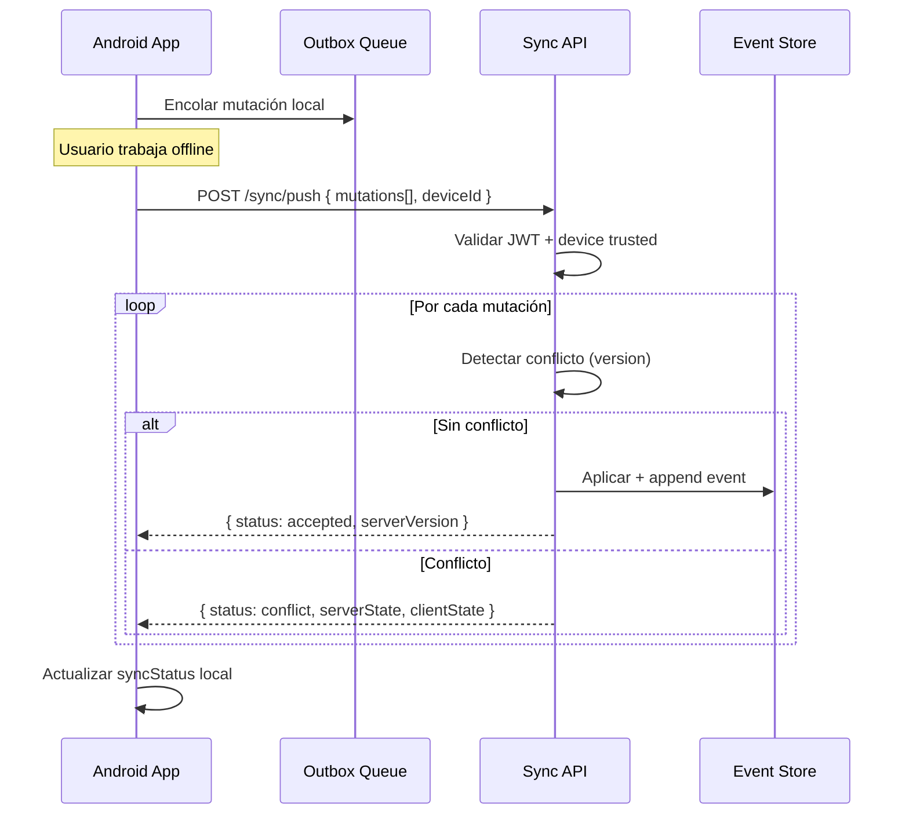
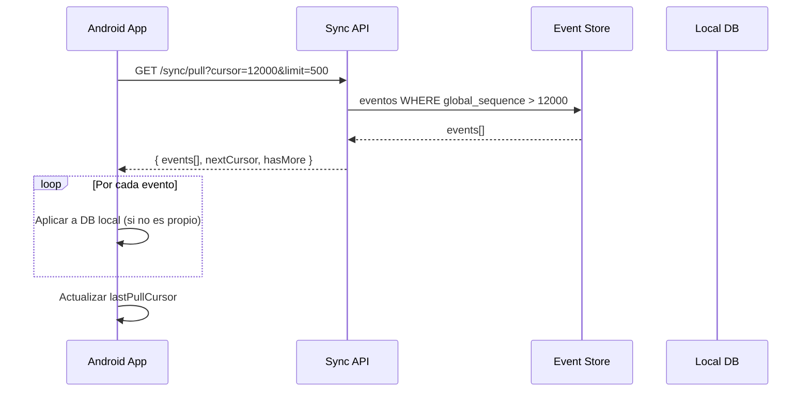

# AGROERP — Estrategia Offline-First y Sincronización

## Principio fundamental

> La app Android es la fuente de verdad local. El servidor es la fuente de verdad global.  
> La sincronización reconcilia ambas de forma determinista y auditable.

## Arquitectura de sincronización

```
┌─────────────────────────────────────────────────────────────────┐
│                     ANDROID (Offline-First)                       │
│                                                                 │
│  ┌──────────┐  ┌──────────────┐  ┌─────────────┐  ┌──────────┐ │
│  │ UI Layer │─▶│ Repository   │─▶│ Local DB    │  │ Sync     │ │
│  │ Compose  │  │ (abstracción)│  │ Room/SQLite │◀─│ Engine   │ │
│  └──────────┘  └──────────────┘  └─────────────┘  └────┬─────┘ │
│                                                         │       │
│  ┌──────────────┐  ┌──────────────┐  ┌─────────────────┘       │
│  │ Outbox Queue │  │ File Queue   │  │ WorkManager             │
│  │ (mutations)  │  │ (uploads)    │  │ (background sync)       │
│  └──────────────┘  └──────────────┘  └─────────────────────────┘
└────────────────────────────┬────────────────────────────────────┘
                             │ HTTPS (cuando hay red)
┌────────────────────────────┼────────────────────────────────────┐
│                     SYNC API (Backend)                          │
│                                                                 │
│  POST /sync/push    ← Cambios del cliente (batch)              │
│  GET  /sync/pull    → Eventos desde cursor                     │
│  POST /sync/resolve → Resolución de conflictos                 │
│  GET  /sync/status  → Estado y cursor del servidor             │
└────────────────────────────┬────────────────────────────────────┘
                             │
                    ┌────────┴────────┐
                    │   Event Store   │
                    │  (global_seq)   │
                    └─────────────────┘
```

## Modelo local Android (Room)

### Tablas espejo del servidor

Cada entidad sincronizable tiene tabla local con campos adicionales:

```kotlin
@Entity(tableName = "resources")
data class ResourceEntity(
    @PrimaryKey val id: String,           // UUID v7 (server) o local UUID
    val externalId: String?,               // ID generado offline
    val organizationId: String,
    val resourceType: String,
    val attributes: String,                // JSON
    val status: String,
    val version: Int,
    val serverVersion: Int?,               // Versión confirmada por servidor
    val syncStatus: SyncStatus,            // SYNCED | PENDING | CONFLICT
    val createdAt: Long,
    val updatedAt: Long,
    val deletedAt: Long?
)

enum class SyncStatus { SYNCED, PENDING_CREATE, PENDING_UPDATE, PENDING_DELETE, CONFLICT }
```

### Outbox (cola de mutaciones)

```kotlin
@Entity(tableName = "sync_outbox")
data class SyncOutboxEntry(
    @PrimaryKey val id: String,
    val entityType: String,
    val entityId: String,
    val operation: SyncOperation,          // CREATE | UPDATE | DELETE
    val payload: String,                   // JSON del cambio
    val clientTimestamp: Long,
    val retryCount: Int = 0,
    val lastError: String? = null
)
```

### Sync cursor

```kotlin
@Entity(tableName = "sync_state")
data class SyncState(
    @PrimaryKey val id: Int = 1,
    val lastPullCursor: Long,              // global_sequence del servidor
    val lastPushAt: Long?,
    val lastPullAt: Long?
)
```

## Flujo de sincronización

### Push (cliente → servidor)



**Request:**
```json
{
  "deviceId": "dev_789",
  "mutations": [
    {
      "id": "mut_001",
      "entityType": "FormSubmission",
      "entityId": "local_uuid_abc",
      "externalId": "local_uuid_abc",
      "operation": "CREATE",
      "payload": {
        "formId": "form_xyz",
        "data": { "yield_kg": 150 },
        "location": { "lat": 4.6097, "lng": -74.0817 }
      },
      "clientVersion": 1,
      "clientTimestamp": "2026-07-01T08:00:00Z"
    }
  ]
}
```

**Response:**
```json
{
  "results": [
    {
      "mutationId": "mut_001",
      "status": "accepted",
      "serverId": "sub_server_id",
      "serverVersion": 1,
      "globalSequence": 12345
    }
  ],
  "cursor": 12345
}
```

### Pull (servidor → cliente)



**Filtros de pull:**
- Por `organizationId` (automático del JWT)
- Por tipos de entidad (configurable por módulo)
- Por fecha (sync incremental)

### Resolución de conflictos

**Estrategia por defecto: Last-Write-Wins con detección**

| Escenario | Estrategia |
|-----------|------------|
| Mismo campo, server wins | Configurable por `resourceType` |
| Creación offline duplicada | Merge por `externalId` |
| Delete vs Update | Delete gana si `deletedAt` más reciente |
| Conflicto complejo | Escalar a `sync_conflicts` para resolución manual |

**Reglas configurables por organización:**
```json
{
  "syncPolicy": {
    "default": "server_wins",
    "overrides": {
      "FormSubmission": "client_wins",
      "Resource.farm": "manual"
    }
  }
}
```

**Flujo de conflicto manual:**
```
1. Servidor detecta conflicto → status: conflict
2. Cliente muestra UI de comparación (server vs local)
3. Usuario elige o merge
4. POST /sync/resolve { conflictId, resolution, mergedData }
5. Servidor aplica y emite SyncConflictResolved event
```

## Sincronización de archivos

Los archivos (fotos, videos, firmas) siguen un flujo separado:

```
1. Captura offline → almacenar en filesystem local
2. Registrar en file_queue con referencia local
3. Al tener red → upload multipart a /files/upload
4. Servidor retorna fileId + storageKey
5. Actualizar referencia en FormSubmission/Resource
6. Push mutation con fileId del servidor
```

**Upload resumible:** protocolo tus (tus.io) para archivos grandes (videos de visitas técnicas).

## WorkManager (Android)

```kotlin
class SyncWorker(context: Context, params: WorkerParameters) : CoroutineWorker(context, params) {
    override suspend fun doWork(): Result {
        val syncEngine = SyncEngine.getInstance(applicationContext)

        return try {
            syncEngine.pushPendingMutations()
            syncEngine.pullServerChanges()
            syncEngine.uploadPendingFiles()
            Result.success()
        } catch (e: NetworkException) {
            Result.retry()  // Backoff exponencial
        }
    }
}

// Programar sync periódico + inmediato al recuperar red
```

**Triggers de sync:**
- Cada 15 min (periódico, solo con red)
- Al detectar conectividad (ConnectivityManager)
- Manual (pull-to-sync en UI)
- Después de cada mutación (si hay red)

## Idempotencia

- Cada mutación tiene `mutationId` único (UUID)
- Servidor deduplica por `(deviceId, mutationId)`
- Reintentos seguros sin duplicados

## Datos precargados (bootstrap)

Al primer login o sync completo:

```
GET /sync/bootstrap
→ schemas, catalogs, forms publicados, permisos, configuración org
```

Esto permite trabajar offline desde el primer día en campo.

## Web PWA (futuro)

Misma estrategia con IndexedDB + Service Worker.  
El protocolo sync es idéntico; solo cambia el storage local.

## Métricas de sync

| Métrica | Descripción |
|---------|-------------|
| `sync_push_duration_ms` | Latencia de push |
| `sync_pull_events_count` | Eventos por pull |
| `sync_conflicts_total` | Conflictos detectados |
| `sync_outbox_pending` | Mutaciones pendientes (por device) |
| `sync_last_success` | Timestamp último sync exitoso |

## Límites y consideraciones

| Aspecto | Valor |
|---------|-------|
| Batch size push | 100 mutaciones |
| Batch size pull | 500 eventos |
| Tamaño max payload | 5 MB por batch |
| Retención eventos | 90 días mínimo (configurable) |
| Full resync | Si cursor > retención → bootstrap completo |
