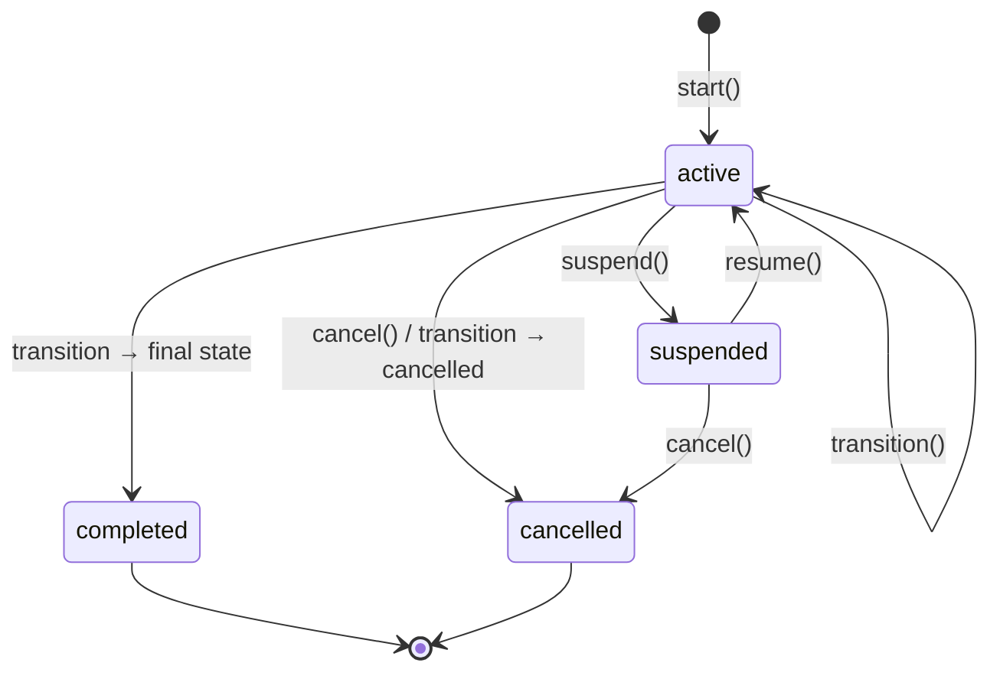

# Enterprise Workflow Engine

Motor empresarial de flujos de trabajo configurable. **No es un módulo de negocio** — es infraestructura reutilizable por todos los dominios de AGROERP (contratos, compras, calidad, visitas, aprobaciones, etc.).

Cumple **AEPS** (`docs/AEPS.md`).

## Concepto

| Principio | Descripción |
|-----------|-------------|
| **Metadata-driven** | Estados, transiciones y reglas definidos en JSON — sin cambiar código |
| **Versionado** | Cada workflow tiene versiones; instancias usan snapshot de versión publicada |
| **Event-driven** | Toda transición emite eventos; acciones desacopladas vía Event Engine |
| **RBAC + asignación** | Participantes por usuario, rol, grupo, equipo, org unit o expresión dinámica |
| **Offline-first** | Transiciones en cola con `externalId` para sync Android |
| **Auditoría total** | Historial inmutable por transición con IP, dispositivo, comentarios |

## Arquitectura

```
workflows/
├── application/
│   ├── workflow-definitions.service.ts   # CRUD, versionado, publish
│   ├── workflow-instances.service.ts     # Start, transition, suspend, cancel
│   ├── workflow-rule.engine.ts           # IF/THEN/ELSE, condiciones
│   ├── workflow-assignment.resolver.ts   # Participantes → userIds
│   ├── workflow-action.executor.ts       # Acciones post-transición
│   └── workflow-metrics.service.ts       # KPIs operativos
└── presentation/
    ├── workflows.controller.ts
    └── workflows.dto.ts
```

Integración obligatoria:

```
WorkflowInstancesService
    → CoreEngineService (eventos + auditoría + sync)
    → AccessControlService (permisos de transición)
    → ResourcesService (acción update_resource)
    → Identity Engine (roles, grupos, equipos, org units)
    → Form Engine (formularios por estado — vía formKey en definición)
```

## Modelo de datos

### Entidades persistentes

| Entidad | Tabla | Rol |
|---------|-------|-----|
| **WorkflowDefinition** | `workflow_definitions` | Identidad estable (`workflowKey`) |
| **WorkflowVersion** | `workflow_versions` | Definición versionada (JSON) |
| **WorkflowInstance** | `workflow_instances` | Ejecución en curso o cerrada |
| **WorkflowHistory** | `workflow_history` | Auditoría de cada transición |
| **WorkflowComment** | `workflow_comments` | Comentarios en instancia |
| **WorkflowAttachment** | `workflow_attachments` | Documentos vinculados |
| **WorkflowAssignment** | `workflow_assignments` | Tareas pendientes por usuario |
| **WorkflowNotification** | `workflow_notifications` | Cola de notificaciones |
| **WorkflowTransitionQueue** | `workflow_transition_queue` | Transiciones offline pendientes |

### Entidades lógicas (en JSON `definition`)

| Entidad lógica | Ubicación | Descripción |
|----------------|-----------|-------------|
| WorkflowState | `definition.states[]` | Estado configurable |
| WorkflowTransition | `definition.transitions[]` | Arista entre estados |
| WorkflowRule | `definition.rules[]` | Reglas globales |
| WorkflowAction | `transition.actions[]` | Acciones post-transición |
| WorkflowParticipant | `transition.participants[]` | Quién puede ejecutar |

**El motor NO tiene estados fijos.** Cada organización define los suyos.

## Schema de definición

```json
{
  "version": 1,
  "settings": {
    "defaultSlaHours": 48,
    "allowParallelAssignments": true,
    "autoArchiveDays": 90
  },
  "states": [
    {
      "key": "draft",
      "name": "Borrador",
      "type": "initial",
      "forms": {
        "required": ["intake-form"],
        "requireSignature": false,
        "requireGps": false
      },
      "slaHours": 24
    },
    {
      "key": "pending_review",
      "name": "En revisión",
      "type": "intermediate"
    },
    {
      "key": "approved",
      "name": "Aprobado",
      "type": "final"
    },
    {
      "key": "cancelled",
      "name": "Cancelado",
      "type": "cancelled"
    }
  ],
  "transitions": [
    {
      "key": "submit",
      "name": "Enviar",
      "from": "draft",
      "to": "pending_review",
      "permissions": ["workflow:execute"],
      "conditions": {
        "all": [
          { "type": "condition", "field": "variables.amount", "operator": "gt", "value": 0 }
        ]
      },
      "requirements": {
        "comment": false,
        "signature": false,
        "gps": false,
        "documents": false
      },
      "participants": [{ "type": "role", "ref": "field_agent" }],
      "dueInHours": 24,
      "priority": "normal",
      "actions": [
        { "type": "emit_event", "config": { "eventType": "CustomSubmitted" } },
        { "type": "update_resource", "config": { "status": "pending_review" } }
      ],
      "notifications": [
        {
          "channel": "internal",
          "template": "workflow_submitted",
          "recipients": [{ "type": "role", "ref": "manager" }]
        }
      ]
    }
  ],
  "rules": [
    {
      "key": "auto_escalate",
      "name": "Escalar si SLA vencido",
      "scope": "state",
      "scopeRef": "pending_review",
      "rule": {
        "if": { "type": "condition", "field": "instance.dueAt", "operator": "lt", "value": "{{now}}" },
        "then": { "type": "condition", "field": "variables.escalated", "operator": "eq", "value": true }
      }
    }
  ]
}
```

### Tipos de estado (`type`)

| Tipo | Comportamiento |
|------|----------------|
| `initial` | Exactamente uno por workflow; estado al iniciar instancia |
| `intermediate` | Estados de proceso |
| `final` | Cierra instancia como `completed` |
| `cancelled` | Cierra instancia como `cancelled` |

### Transiciones

| Campo | Descripción |
|-------|-------------|
| `from` | Estado origen o `*` (wildcard) |
| `to` | Estado destino |
| `participants` | Quién puede ejecutar (además de permisos) |
| `permissions` | Permisos RBAC requeridos (default: `workflow:execute`) |
| `conditions` | Reglas para permitir la transición |
| `validations` | Reglas que deben cumplirse o falla con 422 |
| `requirements` | Firma, GPS, comentario, documentos |
| `dueInHours` | SLA de la transición |
| `actions` | Acciones post-transición |
| `notifications` | Notificaciones a encolar |

## Motor de reglas

Soporta:

- **IF / THEN / ELSE**
- **ALL / ANY** (AND / OR)
- Comparaciones: `eq`, `neq`, `gt`, `gte`, `lt`, `lte`, `in`, `not_in`, `empty`, `not_empty`, `contains`, `matches`
- Referencias de campo: `instance.*`, `resource.*`, `variables.*`, `actor.*`, `context.*`
- Eventos recientes: `{ "type": "event", "eventType": "ResourceUpdated" }`

```json
{
  "if": {
    "type": "condition",
    "field": "variables.priority",
    "operator": "eq",
    "value": "urgent"
  },
  "then": {
    "all": [
      { "type": "condition", "field": "actor.roles", "operator": "contains", "value": "manager" }
    ]
  },
  "else": {
    "type": "condition",
    "field": "variables.approved", "operator": "eq", "value": true
  }
}
```

## Participantes

| Tipo | Resolución |
|------|------------|
| `user` | `ref` = userId |
| `role` | `ref` = role slug → todos los usuarios con ese rol |
| `group` | `ref` = group slug |
| `team` | `ref` = team slug |
| `department` / `org_unit` / `region` / `branch` | `ref` = org unit code → userScopes |
| `dynamic` | `dynamic` = `resource.ownerId`, `context.startedBy`, `variables.assigneeId` |

## Acciones (desacopladas)

| Tipo | Comportamiento |
|------|----------------|
| `emit_event` | Emite `WorkflowActionExecuted` + evento custom |
| `update_resource` | Actualiza Resource vinculado vía Resource Engine |
| `send_notification` | Encola notificación |
| `create_audit` | Registro explícito en auditoría |
| `create_task` | Evento diferido (handler futuro) |
| `webhook` | Evento diferido para integración |
| `generate_pdf` | Evento diferido |
| `call_api` | Evento diferido |
| `run_ai` | Evento diferido (Future AI Engine) |

Todas las acciones `deferred` publican `WorkflowActionExecuted` con `deferred: true` para procesamiento asíncrono.

## Notificaciones

Canales soportados:

| Canal | Estado |
|-------|--------|
| `internal` | Implementado (cola en BD) |
| `email` | Cola preparada |
| `push` | Cola preparada |
| `sms` | Preparado (roadmap) |
| `whatsapp` | Preparado (roadmap) |
| `webhook` | Evento diferido |

## Ciclo de vida de instancia



## APIs

### Definiciones

| Método | Ruta | Permiso | Descripción |
|--------|------|---------|-------------|
| GET | `/workflows/definitions` | `workflow:read` | Listar definiciones |
| GET | `/workflows/definitions/bootstrap` | `workflow:read` | Versiones publicadas (Android) |
| GET | `/workflows/definitions/published/:workflowKey` | `workflow:read` | Última versión publicada |
| GET | `/workflows/definitions/:id` | `workflow:read` | Detalle con versiones |
| POST | `/workflows/definitions` | `workflow:create` | Crear definición + v1 draft |
| POST | `/workflows/definitions/:id/versions` | `workflow:create` | Nueva versión draft |
| PATCH | `/workflows/definitions/versions/:versionId` | `workflow:update` | Editar draft |
| POST | `/workflows/definitions/versions/:versionId/publish` | `workflow:publish` | Publicar versión |

### Instancias

| Método | Ruta | Permiso | Descripción |
|--------|------|---------|-------------|
| GET | `/workflows/instances` | `workflow:read` | Listar instancias |
| GET | `/workflows/instances/metrics` | `workflow:read` | Dashboard KPIs |
| GET | `/workflows/instances/:id` | `workflow:read` | Detalle + historial |
| POST | `/workflows/instances` | `workflow:execute` | Iniciar instancia |
| POST | `/workflows/instances/:id/transitions` | `workflow:execute` | Ejecutar transición |
| POST | `/workflows/instances/:id/suspend` | `workflow:admin` | Suspender |
| POST | `/workflows/instances/:id/resume` | `workflow:admin` | Reanudar |
| POST | `/workflows/instances/:id/cancel` | `workflow:cancel` | Cancelar |
| POST | `/workflows/instances/:id/comments` | `workflow:execute` | Agregar comentario |
| POST | `/workflows/instances/sync/transitions` | `workflow:execute` | Batch offline sync |

### Iniciar instancia

```json
POST /workflows/instances
{
  "workflowKey": "generic-approval",
  "resourceId": "uuid-del-resource",
  "context": { "amount": 15000, "assigneeId": "uuid" },
  "priority": "high",
  "externalId": "client-uuid-offline"
}
```

### Ejecutar transición

```json
POST /workflows/instances/{id}/transitions
{
  "transitionKey": "approve",
  "comment": "Documentación completa",
  "variables": { "approvedBy": "manager" },
  "gpsLocation": { "lat": 4.61, "lng": -74.08, "accuracy": 12 },
  "signatureFileId": "uuid-file",
  "externalId": "transition-uuid-offline"
}
```

### Sync offline (Android)

```json
POST /workflows/instances/sync/transitions
{
  "transitions": [
    {
      "externalId": "offline-start-001",
      "start": {
        "workflowKey": "generic-approval",
        "resourceId": "...",
        "externalId": "offline-start-001"
      }
    },
    {
      "externalId": "offline-approve-001",
      "instanceId": "...",
      "transitionKey": "approve",
      "comment": "OK desde campo"
    }
  ]
}
```

## Eventos

| Evento | Aggregate | Cuándo |
|--------|-----------|--------|
| `WorkflowDefinitionCreated` | Workflow | Nueva definición |
| `WorkflowVersionCreated` | Workflow | Nueva versión draft |
| `WorkflowVersionPublished` | Workflow | Publicación |
| `WorkflowStarted` | WorkflowInstance | Instancia iniciada |
| `WorkflowStateChanged` | WorkflowInstance | Cada transición |
| `WorkflowTransitionExecuted` | WorkflowInstance | (alias en payload) |
| `WorkflowCompleted` | WorkflowInstance | Estado final |
| `WorkflowCancelled` | WorkflowInstance | Cancelación |
| `WorkflowSuspended` | WorkflowInstance | Suspensión |
| `WorkflowResumed` | WorkflowInstance | Reanudación |
| `WorkflowAssignmentCreated` | WorkflowInstance | Nueva asignación |
| `WorkflowNotificationQueued` | WorkflowInstance | Notificación encolada |
| `WorkflowActionExecuted` | WorkflowInstance | Acción ejecutada/diferida |

## Permisos

| Permiso | Uso |
|---------|-----|
| `workflow:create` | Crear definiciones y versiones |
| `workflow:read` | Consultar definiciones e instancias |
| `workflow:update` | Editar drafts |
| `workflow:publish` | Publicar versiones |
| `workflow:execute` | Iniciar y transicionar (default) |
| `workflow:approve` | Transiciones de aprobación |
| `workflow:cancel` | Cancelar instancias |
| `workflow:admin` | Suspender/reanudar, override |

## Auditoría

Cada transición registra en `workflow_history`:

- Estado anterior / nuevo
- `transitionKey`
- `actorId`, `deviceId`, `ipAddress`, `userAgent`
- Comentario y payload (variables, GPS, firma)
- Evento vinculado en Event Store

Además: Audit Engine automático vía `CoreEngineService`.

## Versionado y migración

| Regla | Descripción |
|-------|-------------|
| Instancias usan `versionId` + `versionNumber` snapshot | No cambian al publicar nueva versión |
| Publicar depreca versiones anteriores | Solo una `published` activa por definición |
| Nuevas instancias usan última publicada | Por `workflowKey` |
| Migración de instancias activas | Roadmap — requiere mapa de estados |

## Reportes / KPIs

`GET /workflows/instances/metrics` retorna:

| Indicador | Descripción |
|-----------|-------------|
| `activeProcesses` | Instancias activas |
| `overdueProcesses` | Con `dueAt` vencido |
| `averageCompletionHours` | Tiempo promedio hasta completar |
| `bottlenecks` | Conteo por `currentState` |
| `workloadByUser` | Asignaciones pendientes por usuario |
| `sla.onTrack` / `sla.overdue` | Cumplimiento SLA |

## Integración con Form Engine

En `state.forms`:

```json
{
  "forms": {
    "required": ["field-inspection"],
    "optional": ["notes-form"],
    "requireSignature": true,
    "requireGps": true,
    "requirePhoto": true
  }
}
```

Validación de formularios en transición: roadmap — actualmente `requirements` valida firma/GPS/comentario.

## Android offline

1. `GET /workflows/definitions/bootstrap` — cache de workflows publicados
2. Operaciones locales en `WorkflowTransitionQueue` (cliente)
3. `POST /workflows/instances/sync/transitions` — batch con `externalId`
4. Idempotencia por `externalId` único por organización

## Demo

Tras `pnpm setup:db`:

- **workflowKey**: `generic-approval`
- Estados: draft → pending_review → approved/rejected/cancelled
- Plantilla genérica — **no es flujo de negocio específico**

Probar en Swagger:
1. Login `admin@demo.agroerp.com` / `Admin123!`
2. `GET /workflows/definitions/bootstrap`
3. `POST /workflows/instances` con `workflowKey: generic-approval`
4. `POST /workflows/instances/{id}/transitions` con `transitionKey: submit`

## Roadmap

| Feature | Estado |
|---------|--------|
| Notification Engine delivery (email/push) | Cola creada, delivery pendiente |
| Timer / SLA jobs automáticos | Diseñado en reglas |
| Migración de instancias entre versiones | Documentado |
| Form validation en transición | Integración Form Engine |
| BPMN import/export | Futuro |
| Parallel gateways / forks | `allowParallelAssignments` preparado |

## Casos de uso por dominio (sin implementar flujos)

| Dominio | workflowKey sugerido | Estados ejemplo |
|---------|---------------------|-----------------|
| Contratos | `contract-approval` | draft → legal_review → signed |
| Compras | `purchase-approval` | requested → approved → ordered |
| Calidad | `quality-hold` | sampled → testing → released |
| Visitas | `field-visit` | scheduled → in_progress → completed |

Estos se crean como **definiciones JSON** por cada organización — el motor permanece genérico.
