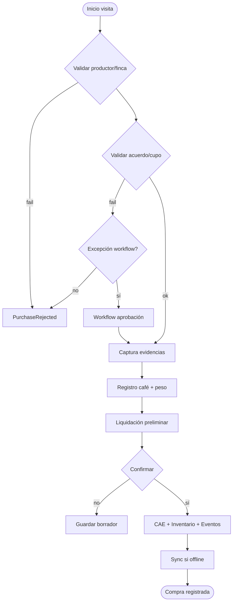

# Especificación Funcional — Coffee Procurement Engine

| Campo | Valor |
|-------|-------|
| **Código módulo** | CPE |
| **Nombre comercial** | Compras de Café |
| **Nombre arquitectónico** | Coffee Procurement Engine |
| **Versión documento** | 1.0 |
| **Estado** | Aprobado para implementación |
| **Product Owner** | AGROERP Product |
| **Release objetivo** | R2 — Commercial Chain |
| **Documentos referencia** | `COFFEE_PROCUREMENT_ENGINE.md`, `CAE_FUNCTIONAL_SPEC.md`, `COFFEE_DOMAIN.md`, `PRM_FUNCTIONAL_SPEC.md`, `FTIP_FUNCTIONAL_SPEC.md`, `FMDT_FUNCTIONAL_SPEC.md`, `AGROERP_MASTER_SPECIFICATION.md` |

---

## 1. Objetivo del módulo

Administrar **todo el proceso de compra de café** desde la recepción del productor en origen hasta la **generación del ingreso a inventario** y la **liquidación preliminar**, convirtiéndose en el **núcleo operativo de abastecimiento** de AGROERP.

CPE orquesta la sesión de compra (`ProcurementSession`) en **34 pasos** validados: contexto productor/finca/acuerdo, evidencias de campo, pesaje, calidad preliminar, liquidación preliminar, confirmación, consumo de cupo (CAE), entrada inventario (CITE) y trazabilidad completa. La liquidación **definitiva** y el **pago** son responsabilidad de **CSFE**.

---

## 2. Alcance

| # | Funcionalidad incluida |
|---|------------------------|
| A-01 | Tipos compra: con contrato, sin contrato, con cupo, libre, por calidad, especial, emergencia, programada, campaña, cooperativa, asociación |
| A-02 | Recepción productor: centro acopio, turno, vehículo, conductor, origen, finca, lote, contrato |
| A-03 | Registro producto: presentación, peso, humedad, impurezas, factor, calidad preliminar |
| A-04 | Pesaje: bruto, tara, neto, re-pesaje, múltiples pesajes, historial |
| A-05 | Liquidación preliminar parametrizable: precio, primas, descuentos, retenciones, impuestos |
| A-06 | Integración calidad CQIE: muestras, dictámenes asociados |
| A-07 | Validación y consumo cupo CAE |
| A-08 | Generación automática entrada inventario CITE + kardex + lote trazable |
| A-09 | Documentos: fotos, video, facturas, remisiones, firmas, PDF comprobante |
| A-10 | Workflow configurable: recepción → pesaje → calidad → liquidación → aprobación → inventario |
| A-11 | Android offline completo con sync inteligente |
| A-12 | Integración GIS geocerca compra |
| A-13 | IA: anomalías, fraude, predicción precios |
| A-14 | Reportes y KPIs operativos |
| A-15 | Multi-tenant, multi-país, multi-commodity |

---

## 3. Exclusiones

| # | Exclusión | Módulo responsable |
|---|-----------|-------------------|
| E-01 | Gestión acuerdos y cupos | CAE |
| E-02 | Liquidación definitiva y pago | CSFE |
| E-03 | Dictamen laboratorio formal | CQIE |
| E-04 | Stock post-recepción bodega avanzada | CITE (operación) |
| E-05 | Lifecycle productor | PRM |
| E-06 | Diseño UI | Fuera de spec |
| E-07 | Transformación beneficio/trilla | CITE futuro |
| E-08 | Contratos venta exportación | Futuro |

---

## 4. Actores

### 4.1 Comprador

| Campo | Valor |
|-------|-------|
| **Rol** | `buyer` |
| **Responsabilidades** | Ejecutar compra en campo, capturar evidencias, confirmar |
| **Permisos** | `procurement:create`, `procurement:confirm`, `procurement:read` |

### 4.2 Supervisor comercial

| Campo | Valor |
|-------|-------|
| **Rol** | `supervisor` |
| **Responsabilidades** | Aprobar excepciones, anular, resolver conflictos sync |
| **Permisos** | `procurement:approve`, `procurement:void` |

### 4.3 Auxiliar de bodega / Recepción

| Campo | Valor |
|-------|-------|
| **Rol** | `warehouse_operator` |
| **Responsabilidades** | Re-pesaje báscula, recepción formal Fase 2 |
| **Permisos** | `procurement:receive` |

### 4.4 Analista de calidad

| Campo | Valor |
|-------|-------|
| **Rol** | `quality_analyst` |
| **Responsabilidades** | Vincular dictamen CQIE, validar tolerancias |
| **Permisos** | `quality:read`, `procurement:read` |

### 4.5 Productor

| Campo | Valor |
|-------|-------|
| **Rol** | `producer` |
| **Responsabilidades** | Entregar café, firmar comprobante |
| **Permisos** | `procurement:sign`, `procurement:read` (propias) |

### 4.6 Transportador

| Campo | Valor |
|-------|-------|
| **Rol** | `driver` (futuro) |
| **Responsabilidades** | Datos vehículo y conductor |
| **Permisos** | `procurement:read` limitado |

### 4.7 Administrador operaciones

| Campo | Valor |
|-------|-------|
| **Rol** | `admin`, `procurement_admin` |
| **Responsabilidades** | Políticas, umbrales, centros acopio |
| **Permisos** | `procurement:admin` |

### 4.8 Auditor

| Campo | Valor |
|-------|-------|
| **Rol** | `auditor` |
| **Responsabilidades** | Trazabilidad compra → inventario → pago |
| **Permisos** | `procurement:read`, `audit:read` |

---

## 5. Roles involucrados (sistema)

| Rol slug | Uso CPE |
|----------|---------|
| `buyer` | Compra campo |
| `supervisor` | Aprobación/excepción |
| `warehouse_operator` | Recepción bodega |
| `quality_analyst` | Calidad |
| `procurement_admin` | Configuración |
| `auditor` | Auditoría |
| `viewer` | Consulta |

---

## 6. Historias de Usuario

### US-CPE-001 — Compra en finca offline completa

| Campo | Contenido |
|-------|-----------|
| **Como** | comprador |
| **Quiero** | registrar compra completa sin internet |
| **Para** | operar en zona rural |
| **Prioridad** | Crítica |

**Criterios:** 34 pasos, externalId, sync sin duplicados, `PurchaseConfirmed`.

---

### US-CPE-002 — Validar cupo antes de confirmar

| Campo | Contenido |
|-------|-----------|
| **Como** | sistema |
| **Quiero** | validar saldo CAE antes de confirmar |
| **Para** | respetar contrato |
| **Prioridad** | Crítica |

**Criterios:** CAE validate → reserve → consume; rechazo si insuficiente.

---

### US-CPE-003 — Liquidación preliminar automática

| Campo | Contenido |
|-------|-----------|
| **Como** | comprador |
| **Quiero** | ver desglose precio, primas y descuentos |
| **Para** | informar al productor en campo |
| **Prioridad** | Crítica |

**Criterios:** LPE con formulaTrace; PDF comprobante.

---

### US-CPE-004 — Generar inventario al aprobar

| Campo | Contenido |
|-------|-----------|
| **Como** | sistema |
| **Quiero** | crear lote CITE al confirmar compra |
| **Para** | trazabilidad inmediata |
| **Prioridad** | Crítica |

**Criterios:** InventoryLot + Movement entrada; link purchaseId.

---

### US-CPE-005 — Compra sin contrato (spot)

| Campo | Contenido |
|-------|-----------|
| **Como** | comprador |
| **Quiero** | compra libre si política org lo permite |
| **Para** | emergencias |
| **Prioridad** | Alta |

**Criterios:** `purchaseType=spot`; workflow si política exige.

---

### US-CPE-006 — Geocerca GPS finca

| Campo | Contenido |
|-------|-----------|
| **Como** | sistema |
| **Quiero** | validar GPS dentro polígono finca |
| **Para** | prevenir fraude |
| **Prioridad** | Crítica |

**Criterios:** GTIP geofence; bloqueo si falla.

---

### US-CPE-007 — Re-pesaje en bodega

| Campo | Contenido |
|-------|-----------|
| **Como** | auxiliar bodega |
| **Quiero** | registrar peso báscula industrial |
| **Para** | conciliar con peso campo |
| **Prioridad** | Media |

**Criterios:** WeighingRecord adicional; alerta si diff > tolerancia.

---

### US-CPE-008 — Asociar dictamen CQIE

| Campo | Contenido |
|-------|-----------|
| **Como** | analista calidad |
| **Quiero** | vincular laboratorio a compra |
| **Para** | ajuste liquidación CSFE |
| **Prioridad** | Alta |

---

### US-CPE-009 — Anulación con reversión

| Campo | Contenido |
|-------|-----------|
| **Como** | supervisor |
| **Quiero** | anular compra confirmada con motivo |
| **Para** | corregir errores |
| **Prioridad** | Alta |

**Criterios:** Revierte cupo CAE + movimiento inventario; audit.

---

### US-CPE-010 — IA detección fraude peso/precio

| Campo | Contenido |
|-------|-----------|
| **Como** | supervisor |
| **Quiero** | alerta compras anómalas |
| **Prioridad** | Media |

---

### US-CPE-011 — Compra cooperativa/asociación

| Campo | Contenido |
|-------|-----------|
| **Como** | comprador |
| **Quiero** | compra a cooperativa con múltiples productores |
| **Prioridad** | Media |

---

### US-CPE-012 — Reporte compras del día

| Campo | Contenido |
|-------|-----------|
| **Como** | gerente |
| **Quiero** | kg y valor por centro acopio |
| **Prioridad** | Alta |

**Criterios:** CPE-RPT-01.

---

## 7. Casos de Uso

| ID | Caso de uso | Actor | Resultado |
|----|-------------|-------|-----------|
| CU-CPE-01 | Iniciar sesión compra | Comprador | ProcurementSession iniciada |
| CU-CPE-02 | Validar contexto PRM/FTIP/CAE | Sistema | OK o error |
| CU-CPE-03 | Capturar evidencias | Comprador | EvidenceBundle |
| CU-CPE-04 | Registrar pesaje | Comprador | WeighingRecord |
| CU-CPE-05 | Calcular liquidación preliminar | Sistema | PreliminarySettlement |
| CU-CPE-06 | Confirmar compra | Comprador | confirmada |
| CU-CPE-07 | Consumir cupo CAE | Sistema | QuotaMovement |
| CU-CPE-08 | Crear lote inventario | Sistema | InventoryLot CITE |
| CU-CPE-09 | Sync offline Android | Comprador | sincronizada |
| CU-CPE-10 | Aprobar excepción sobrecupo | Supervisor | Workflow OK |
| CU-CPE-11 | Re-pesaje bodega | Bodega | Conciliación |
| CU-CPE-12 | Vincular CQIE | Calidad | qualitySampleId |
| CU-CPE-13 | Anular compra | Supervisor | anulada + reversión |
| CU-CPE-14 | Devolución productor | Supervisor | Return record |
| CU-CPE-15 | Consultar cupo offline | Comprador | Cache CAE |

---

## 8. Reglas de Negocio

### 8.1 Validación y cupo

| ID | Regla |
|----|-------|
| RN-CPE-001 | Toda compra confirmada valida CAE si `agreementId` presente |
| RN-CPE-002 | No superar cupo disponible sin workflow excepción |
| RN-CPE-003 | Compra sin contrato solo si `agreement.spot.without.contract=true` o emergencia aprobada |
| RN-CPE-004 | Productor PRM debe estar `active` |
| RN-CPE-005 | Finca FTIP `active`; lote FMDT si scope |
| RN-CPE-006 | Presentación coherente con acuerdo CAE |
| RN-CPE-007 | Consumo cupo = peso neto (UOM convertida a kg base) |

### 8.2 Pesaje

| ID | Regla |
|----|-------|
| RN-CPE-010 | netWeight = grossWeight − tareWeight − descuentos peso |
| RN-CPE-011 | Pesos > 0 obligatorios |
| RN-CPE-012 | Re-pesaje no elimina historial |
| RN-CPE-013 | Diff campo vs bodega > tolerancia → workflow o `observed` |
| RN-CPE-014 | Múltiples pesajes suman líneas o reemplazan según política |

### 8.3 Calidad preliminar

| ID | Regla |
| RN-CPE-020 | Humedad fuera rango → bloqueo o workflow (configurable) |
| RN-CPE-021 | Impurezas/pasilla aplican descuento LPE |
| RN-CPE-022 | Factor rendimiento registrado si presentación cereza |
| RN-CPE-023 | Dictamen CQIE puede ajustar liquidación CSFE, no reescribe CPE confirmado |

### 8.4 Liquidación preliminar

| ID | Regla |
| RN-CPE-030 | LPE es estimación; CSFE es definitiva |
| RN-CPE-031 | Precio base de CAE PEM o lista spot org |
| RN-CPE-032 | Primas/descuentos según tablas parametrizables |
| RN-CPE-033 | Retenciones/impuestos por país (GECL) |

### 8.5 Inventario

| ID | Regla |
| RN-CPE-040 | Compra `confirmada` genera InventoryLot + Movement entrada |
| RN-CPE-041 | Lote inventario traza: producerId, farmUnitId, fieldLotId, purchaseId |
| RN-CPE-042 | Anulación genera movimiento reversión |

### 8.6 Estados

| ID | Regla |
| RN-CPE-050 | Solo `confirmada`/`sincronizada` afectan cupo e inventario |
| RN-CPE-051 | Anulación requiere supervisor + sin despacho CITE posterior |
| RN-CPE-052 | Rechazo no consume cupo definitivo (libera reserva) |

---

## 9. Flujo principal — Pipeline operativo (34 pasos)

El flujo se implementa como **máquina de estados** dentro de `ProcurementSession`. Pasos skippables solo si `ProcurementPolicy` lo permite.

### Fase A — Inicio y contexto (pasos 1–10)

| Paso | Acción | Integración | Offline |
|------|--------|-------------|---------|
| 1 | Inicio visita compra | CPE PSM | Sí — `PurchaseStarted` |
| 2 | Validación productor | PRM | Cache + stale indicator |
| 3 | Validación finca | FTIP | Cache |
| 4 | Validación acuerdo | CAE | Snapshot descargado |
| 5 | Consulta cupo disponible | CAE QEM | Saldo cache; reserva soft local |
| 6 | Historial compras productor | PRM proyección | Cache últimas N |
| 7 | Alertas productor | OCC / CAE | Cache |
| 8 | Registro GPS check-in | GTIP | Obligatorio |
| 9 | Fecha y hora | Device + skew correction | Sí |
| 10 | Captura dispositivo | deviceId, model, appVersion | Sí |

**Salida fase A:** contexto validado o bloqueado (`PRODUCER_SUSPENDED`, `AGREEMENT_EXPIRED`, `QUOTA_INSUFFICIENT`, etc.)

### Fase B — Evidencias (pasos 11–15)

| Paso | Acción | Obligatorio default |
|------|--------|---------------------|
| 11 | Fotografías (mín. 2: café, balanza/contexto) | Sí |
| 12 | Videos | Configurable |
| 13 | Audio | Opcional |
| 14 | Firma digital productor | Sí |
| 15 | Documentos adicionales (remisión, cédula) | Según política |

Eventos: `MediaCaptured`, `MediaUploaded`, `GPSCaptured`, `SignatureCaptured`

### Fase C — Registro del café (pasos 16–24)

| Paso | Acción | Validación |
|------|--------|------------|
| 16 | Café ofrecido — inicio línea | — |
| 17 | Tipo presentación (`trade.coffee_presentation`) | Coherente con acuerdo |
| 18 | Variedad | Coherente con lote/finca |
| 19 | Cosecha | Dentro ventana acuerdo |
| 20 | Peso bruto / tara / neto | > 0 |
| 21 | Humedad | Rango configurable |
| 22 | Impurezas / pasilla | ≥ 0 |
| 23 | Defectos preliminares | Catálogo `quality.defect` |
| 24 | Calidad preliminar | Grado / score estimado |

Evento: `PurchaseValidated` (tras paso 24 completo)

### Fase D — Comercialización (pasos 25–30)

| Paso | Acción | Componente |
|------|--------|------------|
| 25 | Aplicación reglas comerciales | LPE + CAE PEM |
| 26 | Validación cupo hard | CAE QEM |
| 27 | Cálculo saldo restante | CAE proyección |
| 28 | Liquidación preliminar | LPE → `PreliminarySettlementGenerated` |
| 29 | Confirmación compra | Usuario + firma capturada → `PurchaseConfirmed` |
| 30 | Generación eventos batch | Event Engine |

### Fase E — Post-confirmación (pasos 31–34)

| Paso | Acción | Componente |
|------|--------|------------|
| 31 | Actualización acuerdo / cupo | CAE consumo definitivo |
| 32 | Movimiento inventario | CITE → `InventoryCreated` + kardex |
| 33 | Auditoría | Audit Engine bundle completo |
| 34 | Sincronización offline | Sync Foundation si aplica |

| Paso | Resultado clave |
|------|-----------------|
| 29 Confirmación | `PurchaseConfirmed` |
| 31 CAE | `QuotaConsumed` |
| 32 CITE | `InventoryCreated` |



---

## 10. Flujos alternativos

### FA-CPE-01 — Compra spot sin contrato

| Paso | Acción |
|------|--------|
| FA1.1 | Sin agreementId; precio lista spot |
| FA1.2 | Workflow si política org |
| FA1.3 | Sin consumo cupo |

### FA-CPE-02 — Excepción sobrecupo

| Paso | Acción |
|------|--------|
| FA2.1 | CAE validate falla |
| FA2.2 | Workflow `procurement.exception.overdraw` |
| FA2.3 | Supervisor aprueba → confirmación |

### FA-CPE-03 — Borrador y continuar

| Paso | Acción |
|------|--------|
| FA3.1 | Guardar `borrador` offline |
| FA3.2 | Retomar sesión días después |
| FA3.3 | Re-validar cupo al confirmar |

### FA-CPE-04 — Recepción bodega Fase 2

| Paso | Acción |
|------|--------|
| FA4.1 | Compra confirmada en campo |
| FA4.2 | Re-pesaje báscula industrial |
| FA4.3 | Conciliación o incidente |

### FA-CPE-05 — Devolución post-compra

| Paso | Acción |
|------|--------|
| FA5.1 | Supervisor autoriza devolución |
| FA5.2 | Reversión cupo + inventario |
| FA5.3 | Estado `anulada` o `returned` |

---

## 11. Casos de error

| ID | Condición | Mensaje | Comportamiento |
|----|-----------|---------|----------------|
| CE-CPE-01 | Cupo insuficiente | "Saldo cupo {n} kg" | Bloquea confirmación |
| CE-CPE-02 | Productor suspendido | "Productor no habilitado" | Bloquea |
| CE-CPE-03 | GPS fuera finca | "Ubicación fuera de finca" | Bloquea |
| CE-CPE-04 | Humedad excede máximo | "Humedad {n}% supera límite" | Bloqueo/workflow |
| CE-CPE-05 | Evidencias incompletas | "Faltan evidencias obligatorias" | Bloquea |
| CE-CPE-06 | Sin firma productor | "Firma obligatoria" | Bloquea |
| CE-CPE-07 | Acuerdo vencido | "Contrato no vigente" | Bloquea |
| CE-CPE-08 | Precio fuera banda | "Precio fuera de política" | Workflow |
| CE-CPE-09 | Sync duplicado | Idempotente | Retorna existente |
| CE-CPE-10 | Peso neto ≤ 0 | "Peso neto inválido" | Bloquea |

---

## 12. Validaciones

### 12.1 Tipos de compra

| Tipo | Código | Contrato | Cupo |
|------|--------|----------|------|
| Con contrato | `contract` | Sí | Sí |
| Sin contrato | `spot` | No | No |
| Con cupo | `quota` | Sí | Sí |
| Libre | `free` | No | No |
| Por calidad | `quality` | Opcional | Según acuerdo |
| Especial | `special` | Sí/No | Workflow |
| Emergencia | `emergency` | Excepción | Excepción |
| Programada | `scheduled` | Sí | Reserva previa |
| Por campaña | `campaign` | Sí | Por campaña |
| Cooperativa | `cooperative` | Marco coop | Distribuido |
| Asociación | `association` | Institucional | Según convenio |

### 12.2 Recepción del productor

| Campo | Obligatorio | Validación |
|-------|-------------|------------|
| producerId | Sí | PRM active |
| companyEntityId | Sí | Org legal |
| buyerUserId | Sí | User comprador |
| collectionCenterId | Sí | Centro acopio CLSE/CITE |
| receptionDate / receptionTime | Sí | |
| shiftCode | No | Turno |
| vehicleId / plate | No | Transporte |
| driverName / driverId | No | |
| originDescription | No | Origen café |
| farmUnitId | Recomendado | FTIP |
| fieldLotId | No | FMDT |
| agreementId | Según tipo | CAE activo |
| quotaNodeId | Sistema | CAE resuelve |

### 12.3 Información del producto

| Campo | Obligatorio |
|-------|-------------|
| coffeeTypeCode | Sí (arabica, etc.) |
| coffeeStateCode | Sí (cereza, pergamino…) |
| presentationCode | Sí `trade.coffee_presentation` |
| varietyCode | Recomendado |
| quantity / netWeight | Sí |
| uomCode | Sí |
| moisturePercent | Según política |
| impuritiesPercent | No |
| pasillaPercent | No |
| yieldFactor | Si cereza |
| density | No |
| preliminaryQualityGrade | No |
| observations | No |

### 12.4 Pesaje (WeighingRecord)

| Campo | Descripción |
|-------|-------------|
| weighingId | UUID |
| sequenceNumber | Orden múltiples pesajes |
| grossWeight | Bruto |
| tareWeight | Tara |
| netWeight | Calculado |
| scaleType | portable, industrial, manual |
| scaleDeviceId | Futuro IoT báscula |
| weighedAt | Timestamp |
| weighedBy | User |
| isOfficial | Báscula certificada bodega |

---

## 13. Workflow configurable

```
Recepción → Pesaje → Calidad (preliminar/CQIE) → Liquidación preliminar
    → Aprobación (si excepción) → Ingreso inventario → Handoff pago (CSFE) → Cierre
```

| workflowKey | Disparador |
|-------------|------------|
| `procurement.confirm` | Confirmación estándar |
| `procurement.exception.overdraw` | Sobrecupo |
| `procurement.exception.moisture` | Humedad |
| `procurement.exception.spot` | Sin contrato |
| `procurement.exception.price` | Precio fuera banda |
| `procurement.void` | Anulación |
| `procurement.weight_variance` | Diff peso bodega |

Pasos skippables según `ProcurementPolicy` org.

---

## 14. Dependencias

| Módulo | Relación |
|--------|----------|
| **CAE** | Validar/reservar/consumir cupo |
| **PRM** | Productor, cartera |
| **FTIP** | Finca, geocerca |
| **FMDT** | Lote origen |
| **CITE** | InventoryLot, Movement |
| **CQIE** | Dictamen calidad |
| **CSFE** | Liquidación definitiva, pago |
| **GTIP** | Geofence GPS |
| **USFP** | Formularios campo |
| **EDMKP** | Multimedia, PDF |
| **CLSE** | Centro acopio, vehículo |
| **Workflow** | Aprobaciones |
| **AIADP** | Fraude, anomalías |
| **OCC** | Alertas |

---

## 15. Permisos

| Permiso | Roles |
|---------|-------|
| `procurement:read` | Operativos |
| `procurement:create` | buyer |
| `procurement:confirm` | buyer |
| `procurement:approve` | supervisor |
| `procurement:receive` | warehouse_operator |
| `procurement:void` | supervisor |
| `procurement:export` | manager, auditor |
| `procurement:admin` | admin |

---

## 16. Auditoría

| Evento | Datos |
|--------|-------|
| Toda transición estado | Diff session |
| Pesaje | Valores completos |
| Liquidación | formulaTrace |
| Anulación | Motivo obligatorio |
| Sync conflicto | Resolución |
| Excepción aprobada | Aprobador |

---

## 17. Eventos generados

| Evento | Cuándo |
|--------|--------|
| `PurchaseStarted` | Inicio sesión |
| `PurchaseValidated` | Registro café OK |
| `PurchaseConfirmed` | Confirmación |
| `PurchaseRejected` | Rechazo |
| `PurchaseCancelled` / `PurchaseVoided` | Anulación |
| `PurchaseObserved` | Inconsistencia |
| `PreliminarySettlementGenerated` | LPE |
| `QuotaReserved` / `QuotaConsumed` | CAE |
| `InventoryReserved` / `InventoryCreated` | CITE |
| `MediaCaptured` / `GPSCaptured` / `SignatureCaptured` | Evidencias |
| `ProcurementSyncCompleted` / `Conflict` | Sync |
| `WeighingRecorded` | Pesaje |
| `QualityLinked` | CQIE |

Namespace: `procurement.*` + `coffee.purchase.*`

---

## 18. Automatizaciones

| ID | Disparador | Acción |
|----|------------|--------|
| AUT-CPE-01 | PurchaseConfirmed | Crear InventoryLot CITE |
| AUT-CPE-02 | PurchaseConfirmed | Consumir cupo CAE |
| AUT-CPE-03 | PurchaseConfirmed | Generar PDF comprobante EDMKP |
| AUT-CPE-04 | PurchaseConfirmed | Evento PRM lastActivityAt |
| AUT-CPE-05 | PurchaseConfirmed | Actualizar FMDT producción |
| AUT-CPE-06 | Humedad límite | Alerta OCC |
| AUT-CPE-07 | Diff peso bodega | Incidente calidad |
| AUT-CPE-08 | IA fraude score alto | Flag observed |
| AUT-CPE-09 | Sync OK | Notificación supervisor cola |
| AUT-CPE-10 | CQIE dictamen grave | Alerta + CSFE hold |

---

## 19. Integración IA

| Función | Entrada | Salida |
|---------|---------|--------|
| Recomendación compra | Histórico, cupo, precio | Sugerir volumen |
| Predicción precios | Mercado, CAE | Precio estimado |
| Anomalías peso/precio | Sesión vs histórico | Risk score |
| Detección fraude | GPS, duplicados, patrones | Alerta |
| Optimización abastecimiento | Cupos, demanda | Plan compras |
| Proyección compras | Campaña, clima | kg esperados |

---

## 20. Integración Productores (PRM)

| Función | Descripción |
|---------|-------------|
| Validación estado | active required |
| Cartera comprador | Filtro assignedBuyerId |
| Historial compras | Últimas N en sesión |
| Timeline | PurchaseConfirmed en 360° |

---

## 21. Integración Fincas y Lotes (FTIP / FMDT)

| Función | Descripción |
|---------|-------------|
| farmUnitId / fieldLotId | Origen trazabilidad |
| Geocerca | GTIP contains |
| Producción estimada | Validar peso vs capacidad |
| Actualizar entregado | FMDT HarvestRecord |

---

## 22. Integración Contratos (CAE)

| Función | Descripción |
|---------|-------------|
| validatePurchase | Pre-confirmación |
| reserve / consume | Cupo |
| Precio PEM | Base LPE |
| Primas contractuales | LPE |
| Alertas cupo | Post-compra |

---

## 23. Integración Inventario (CITE)

| Función | Descripción |
|---------|-------------|
| InventoryLot | Auto al confirmar |
| Movement IN | Kardex entrada |
| warehouseId | Bodega destino |
| Trazabilidad inversa | Lote → compra → finca |
| Anulación | Movement reversión |

---

## 24. Integración Calidad (CQIE)

| Función | Descripción |
|---------|-------------|
| Muestra vinculada | qualitySampleId |
| Dictamen | Ajuste CSFE |
| Preliminar campo | preliminaryQualityGrade |
| NC grave | Bloqueo pago CSFE |

---

## 25. Integración Finanzas (CSFE)

| Función | Descripción |
|---------|-------------|
| PreliminarySettlement | Handoff |
| Liquidación definitiva | Post CQIE |
| Pago productor | No CPE |
| Retenciones | Parámetros país |

---

## 26. Integración Documental (EDMKP)

| Tipo | Uso |
|------|-----|
| Fotos/video | EvidenceBundle |
| Firma productor | signatureContentId |
| Factura/remisión | Adjunto |
| Comprobante PDF | Auto generado |
| Certificados | Orgánico, etc. |

---

## 27. Integración Formularios (USFP) y GIS (GTIP)

| Función | Descripción |
|---------|-------------|
| Formulario compra campo | USFP → ProcurementSession |
| GPS submission | Validación geocerca GTIP |

---

## 28. Integración Workflow

| workflowKey | Disparador | Pasos |
|-------------|------------|-------|
| `procurement.confirm` | Confirmación estándar | Supervisor opcional según monto |
| `procurement.exception.overdraw` | Sobrecupo CAE | Aprobación supervisor |
| `procurement.exception.moisture` | Humedad fuera rango | Calidad + supervisor |
| `procurement.exception.spot` | Compra sin contrato | Comercial |
| `procurement.exception.price` | Precio fuera banda PEM | Comercial |
| `procurement.exception.gps` | GPS fuera geocerca | Supervisor + motivo |
| `procurement.void` | Anulación post-confirmación | Supervisor + finanzas |
| `procurement.weight_variance` | Diff peso bodega | Bodega + calidad |
| `procurement.return` | Devolución productor | Supervisor |

Variables workflow: `ProcurementSession` completa + `PreliminarySettlement` + diff peso + motivo excepción.

---

## 29. Integración Notificaciones, Auditoría y OCC

| Canal | Evento disparador | Destinatario |
|-------|-------------------|--------------|
| Push Android | Sync conflicto | Comprador |
| Email | Compra anulada | Supervisor, finanzas |
| OCC alerta | Humedad límite, fraude IA | Supervisor |
| OCC alerta | Cupo < umbral post-compra | Comprador, comercial |
| OCC incidente | Diff peso bodega > tolerancia | Calidad, bodega |
| Dashboard | Cola sync pendiente | Admin operaciones |

**Auditoría:** cada transición de estado, pesaje, LPE, consumo cupo, movimiento inventario, anulación y resolución conflicto sync registra diff completo en Audit Engine con `correlationId` = `sessionId`.

---

## 30. Modelo de datos funcional

### 30.1 ProcurementSession (agregado raíz)

| Campo | Tipo | Descripción |
|-------|------|-------------|
| sessionId | UUID | PK |
| externalId | Texto | Idempotencia offline cliente |
| purchaseNumber | Texto | Consecutivo humano post-sync |
| organizationId | UUID | Tenant |
| companyEntityId | Ref | Empresa compradora |
| purchaseTypeCode | Catálogo | contract, spot, quota, free, quality, special, emergency, scheduled, campaign, cooperative, association |
| status | Enum | §30.8 |
| syncStatus | Enum | local, pending, syncing, synced, conflict |
| producerId | Ref PRM | Productor |
| farmUnitId | Ref FTIP | Finca |
| fieldLotId | Ref FMDT | Lote productivo (opcional) |
| harvestCode | Catálogo | Cosecha |
| agreementId | Ref CAE | Acuerdo (opcional según tipo) |
| quotaNodeId | Ref CAE | Nodo cupo consumido |
| campaignCode | Catálogo | Campaña |
| buyerUserId | Ref User | Comprador |
| supervisorUserId | Ref User | Si aprobación |
| collectionCenterId | Ref CLSE/CITE | Centro acopio |
| receptionDate | Fecha | Fecha recepción |
| receptionTime | Hora | Hora recepción |
| shiftCode | Catálogo | Turno |
| vehicleId / vehiclePlate | Ref/Texto | Vehículo |
| driverName / driverDocument | Texto | Conductor |
| originDescription | Texto | Origen del café |
| cooperativeId | Ref | Si compra cooperativa |
| associationId | Ref | Si compra asociación |
| deviceId | Ref | Dispositivo captura |
| startedAt / confirmedAt | Timestamp | Inicio y confirmación |
| timezone | Texto | Zona horaria |
| gpsCheckIn | GeoJSON Point | Check-in + accuracy |
| gpsValidated | Bool | Geocerca OK |
| distanceToFarmMeters | Decimal | Distancia perímetro |
| warehouseId | Ref CITE | Bodega destino |
| inventoryLotId | Ref CITE | Lote generado |
| preliminarySettlementId | Ref | LPE |
| evidenceBundleId | Ref | Paquete evidencias |
| producerSignatureContentId | Ref EDMKP | Firma productor |
| qualitySampleId | Ref CQIE | Muestra laboratorio |
| workflowInstanceId | Ref | Si excepción |
| correlationId | UUID | Trazabilidad eventos |
| flags | Array | observed, duplicate_suspect, fraud_risk, etc. |
| observations | Texto | Observaciones generales |
| version | Entero | Optimistic lock |
| metadata | JSON | Extensión Metadata Engine |

### 30.2 PurchaseLine (línea de producto)

| Campo | Tipo | Descripción |
|-------|------|-------------|
| lineId | UUID | PK |
| sessionId | FK | Sesión padre |
| lineNumber | Entero | Orden |
| coffeeTypeCode | Catálogo | arabica, robusta… |
| coffeeStateCode | Catálogo | cereza, pergamino, oro… |
| presentationCode | Catálogo | `trade.coffee_presentation` |
| varietyCode | Catálogo | Variedad |
| quantity | Decimal | Cantidad declarada |
| netWeight | Decimal | Peso neto base cupo |
| uomCode | Catálogo | kg, lb, carga |
| moisturePercent | Decimal | Humedad |
| impuritiesPercent | Decimal | Impurezas |
| pasillaPercent | Decimal | Pasilla |
| yieldFactor | Decimal | Factor rendimiento (cereza) |
| density | Decimal | Densidad |
| preliminaryQualityGrade | Catálogo | Calidad campo |
| defectsSummary | JSON | Defectos preliminares |
| observations | Texto | |

### 30.3 WeighingRecord

| Campo | Tipo | Descripción |
|-------|------|-------------|
| weighingId | UUID | PK |
| sessionId | FK | |
| lineId | FK | Opcional si pesaje por línea |
| sequenceNumber | Entero | Orden múltiples pesajes |
| weighingPhase | Enum | field, warehouse, reweigh |
| grossWeight | Decimal | Bruto |
| tareWeight | Decimal | Tara |
| netWeight | Decimal | Calculado |
| uomCode | Catálogo | |
| scaleType | Enum | portable, industrial, manual |
| scaleDeviceId | Ref | Futuro IoT báscula |
| isOfficial | Bool | Báscula certificada |
| weighedAt | Timestamp | |
| weighedByUserId | Ref | |
| varianceFromFieldKg | Decimal | Si re-pesaje bodega |
| variancePct | Decimal | % diferencia |
| observations | Texto | |

### 30.4 PreliminarySettlement

| Campo | Tipo | Descripción |
|-------|------|-------------|
| settlementId | UUID | PK |
| sessionId | FK | |
| basePrice | Money | Precio unitario CAE/spot |
| quantity | Decimal | kg netos |
| grossAmount | Money | base × qty |
| transportAmount | Money | Flete si aplica |
| premiums | JSON Array | { typeCode, description, amount } |
| discounts | JSON Array | { typeCode, description, amount } |
| qualityPenalties | JSON Array | Humedad, impurezas, defectos |
| taxes | JSON Array | IVA, etc. |
| withholdings | JSON Array | Retenciones |
| netAmount | Money | Total preliminar |
| currencyCode | Catálogo | |
| quotaRemainingAfter | Decimal | Saldo cupo post-compra |
| formulaTrace | JSON | Explicación cálculo auditable |
| calculatedAt | Timestamp | |
| status | Enum | draft, final, superseded |

### 30.5 EvidenceBundle / EvidenceItem

| Campo | Tipo | Descripción |
|-------|------|-------------|
| bundleId | UUID | PK |
| sessionId | FK | |
| evidenceType | Enum | photo, video, audio, signature, document, qr_scan, barcode, note |
| contentId | Ref EDMKP | Contenido binario |
| captureType | Catálogo | coffee, scale, context, id_document… |
| capturedAt | Timestamp | |
| capturedByUserId | Ref | |
| gpsPoint | GeoJSON | Si aplica |
| mimeType | Texto | |
| hashSha256 | Texto | Integridad |
| signerRole | Enum | producer, buyer (firma) |
| metadata | JSON | EXIF, duración video, etc. |

### 30.6 ProcurementReception (Fase 2 bodega)

| Campo | Tipo | Descripción |
|-------|------|-------------|
| receptionId | UUID | PK |
| sessionId | FK | Compra campo |
| warehouseId | Ref | Bodega recepción |
| receivedAt | Timestamp | |
| receivedByUserId | Ref | Operador bodega |
| officialWeighingId | Ref | Pesaje industrial |
| varianceStatus | Enum | matched, within_tolerance, incident |
| storageLocationCode | Texto | Ubicación provisional |
| status | Enum | pending, completed, incident |

### 30.7 ProcurementPolicy (configuración org)

| Campo | Descripción |
|-------|-------------|
| policyId | UUID |
| organizationId | Tenant |
| allowSpotWithoutContract | Bool |
| allowEmergencyPurchase | Bool |
| moistureMaxPercent | Decimal |
| moistureBlockOrWorkflow | Enum |
| gpsToleranceMeters | Decimal |
| minPhotosRequired | Entero |
| signatureRequired | Bool |
| weightVarianceTolerancePct | Decimal |
| purchaseLimitDailyKg | Decimal |
| purchaseLimitPerProducerKg | Decimal |
| approvalThresholdAmount | Money |
| spotPriceListId | Ref |
| workflowOverrides | JSON | Pasos skippables |

### 30.8 Estados de sesión

| Estado | Descripción | Afecta cupo/inventario |
|--------|-------------|------------------------|
| `iniciada` | Check-in realizado | No |
| `en_validacion` | Validando contexto | No |
| `capturando_evidencias` | Multimedia en curso | No |
| `registrando_cafe` | Peso y calidad preliminar | No |
| `liquidacion_pendiente` | Calculando LPE | No |
| `pendiente_confirmacion` | Esperando OK comprador | No |
| `borrador` | Guardado para continuar | No |
| `pendiente_aprobacion` | Workflow excepción | Reserva soft |
| `confirmada` | Comprometida | Sí |
| `sincronizada` | En servidor global | Sí |
| `en_conflicto` | Sync conflicto | Según resolución |
| `observada` | Marcada para revisión | Sí (bloqueo pago CSFE) |
| `rechazada` | No procedió | No |
| `anulada` | Reversión formal | Revierte |
| `returned` | Devolución productor | Revierte |

### 30.9 Liquidación preliminar — pipeline de cálculo

```
1. Resolver precio base (CAE PEM o lista spot)
2. grossAmount = netWeight × basePrice
3. + Σ primas contractuales (certificación, variedad, calidad)
4. − Σ descuentos contractuales
5. − castigos calidad preliminar (humedad, impurezas, pasilla, defectos)
6. + transportAmount (si parametrizado)
7. + impuestos (finance.tax_rule por país)
8. − retenciones (finance.withholding_rule)
9. = netAmount preliminar
10. quotaRemainingAfter = CAE.available − netWeight
```

Tablas parametrizables: `procurement.moisture_discount`, `procurement.impurity_discount`, `procurement.defect_penalty`, `procurement.premium_rule`, `procurement.discount_rule`, `finance.tax_rule`, `finance.withholding_rule`.

---

## 31. API funcional

**Base path:** `/api/v1/cpe`

| Método | Ruta | Permiso | Descripción |
|--------|------|---------|-------------|
| GET | `/sessions` | `procurement:read` | Listar compras con filtros |
| POST | `/sessions` | `procurement:create` | Iniciar sesión |
| GET | `/sessions/:id` | `procurement:read` | Detalle completo |
| PATCH | `/sessions/:id` | `procurement:create` | Actualizar borrador |
| POST | `/sessions/:id/validate-context` | `procurement:create` | Validar PRM/FTIP/CAE |
| POST | `/sessions/:id/evidence` | `procurement:create` | Adjuntar evidencia |
| POST | `/sessions/:id/weighings` | `procurement:create` | Registrar pesaje |
| GET | `/sessions/:id/weighings` | `procurement:read` | Historial pesajes |
| POST | `/sessions/:id/lines` | `procurement:create` | Línea producto |
| PATCH | `/sessions/:id/lines/:lineId` | `procurement:create` | Editar línea |
| POST | `/sessions/:id/pre-settlement/calculate` | `procurement:create` | Calcular LPE |
| GET | `/sessions/:id/pre-settlement` | `procurement:read` | Ver LPE |
| POST | `/sessions/:id/confirm` | `procurement:confirm` | Confirmar compra |
| POST | `/sessions/:id/reject` | `procurement:confirm` | Rechazar |
| POST | `/sessions/:id/submit-exception` | `procurement:confirm` | Solicitar excepción |
| POST | `/sessions/:id/void` | `procurement:void` | Anular |
| POST | `/sessions/:id/return` | `procurement:void` | Devolución |
| POST | `/sessions/:id/quality-link` | `quality:read` | Vincular CQIE |
| POST | `/sessions/:id/receive` | `procurement:receive` | Recepción bodega Fase 2 |
| POST | `/sessions/:id/reweigh` | `procurement:receive` | Re-pesaje industrial |
| GET | `/sessions/:id/documents` | `procurement:read` | Documentos EDMKP |
| POST | `/sessions/:id/documents` | `procurement:create` | Subir documento |
| GET | `/sessions/:id/traceability` | `procurement:read` | Cadena productor→inventario |
| POST | `/field-capture/sync` | `procurement:create` | Batch sync Android |
| POST | `/field-capture/conflicts/:id/resolve` | `procurement:approve` | Resolver conflicto |
| GET | `/policies` | `procurement:admin` | Políticas org |
| PATCH | `/policies/:id` | `procurement:admin` | Actualizar política |
| GET | `/catalogs/context` | `procurement:read` | Bootstrap offline |
| GET | `/reports/:reportCode` | `procurement:export` | CPE-RPT-* |
| GET | `/kpis/:kpiCode` | `procurement:read` | KPIs dashboard |
| POST | `/internal/inventory-callback` | Sistema CITE | Confirmación lote |
| POST | `/internal/quota-callback` | Sistema CAE | Confirmación cupo |

**Idempotencia:** `POST /sessions` y `POST /field-capture/sync` aceptan header `Idempotency-Key` o `externalId` único por dispositivo.

---

## 32. Interfaz (especificación funcional — sin diseño gráfico)

| ID | Pantalla | Descripción |
|----|----------|-------------|
| UI-CPE-01 | Listado compras | Filtros fecha, comprador, centro, estado, tipo |
| UI-CPE-02 | Detalle compra | Timeline estados, pesajes, LPE, docs, trazabilidad |
| UI-CPE-03 | Wizard compra campo | Flujo 34 pasos guiado |
| UI-CPE-04 | Liquidación preliminar | Desglose primas/descuentos/retenciones |
| UI-CPE-05 | Historial pesajes | Múltiples pesajes y re-pesajes |
| UI-CPE-06 | Cola sync offline | Conflictos y pendientes |
| UI-CPE-07 | Aprobación excepciones | Workflow supervisor |
| UI-CPE-08 | Recepción bodega | Conciliación peso campo vs industrial |
| UI-CPE-09 | Dashboard compras | KPIs volumen, valor, tendencias |
| UI-CPE-10 | Mapa compras | GTIP overlay compras del día |
| UI-CPE-11 | Simulador LPE | ¿Qué pasa si cambio humedad/peso? |
| UI-CPE-12 | Configuración políticas | Umbrales, tolerancias, workflows |
| UI-CPE-13 | Trazabilidad inversa | Lote inventario → compra → finca |

---

## 33. Android (especificación funcional)

| ID | Flujo | Offline | Sync |
|----|-------|---------|------|
| AND-CPE-01 | Iniciar compra en finca | Sí | Push outbox |
| AND-CPE-02 | Validar productor/finca/acuerdo | Cache bootstrap | Pull catálogos |
| AND-CPE-03 | Consultar contratos y cupos | Snapshot CAE | TTL configurable |
| AND-CPE-04 | Captura fotografías georreferenciadas | Sí | Cola media EDMKP |
| AND-CPE-05 | Captura video/audio | Sí | Cola media |
| AND-CPE-06 | Captura firma productor | Sí | PNG → EDMKP |
| AND-CPE-07 | Captura GPS check-in | Sí | Validación GTIP local |
| AND-CPE-08 | Registro peso manual/báscula BT | Sí | Futuro IoT |
| AND-CPE-09 | Calcular y mostrar LPE | Sí | Recalcular al sync |
| AND-CPE-10 | Confirmar compra | Sí | Idempotencia externalId |
| AND-CPE-11 | Guardar borrador multi-día | SQLite local | — |
| AND-CPE-12 | Imprimir recibo Bluetooth | Sí | PDF local |
| AND-CPE-13 | Escanear QR productor/acuerdo | Sí | Pre-carga contexto |
| AND-CPE-14 | Resolver conflicto sync | Parcial | Supervisor remoto |
| AND-CPE-15 | Consulta historial productor | Cache | Últimas N compras |

### 33.1 Bootstrap offline (precarga)

```
- Cartera productores + fincas + lotes (PRM/FTIP/FMDT)
- Acuerdos activos + saldos cupo CAE (timestamp)
- Políticas ProcurementPolicy
- Catálogos: presentación, variedad, defectos, UOM, turnos
- Listas precio spot
- Formularios USFP procurement.*
- Alertas productor OCC
```

### 33.2 Estrategia sync

| Orden | Acción |
|-------|--------|
| 1 | Refresh JWT |
| 2 | Push mutations sesión (sin media) |
| 3 | Upload media paralelo |
| 4 | Link media → sesión |
| 5 | Confirmación servidor → `synced` |
| 6 | Pull eventos cupo actualizados |

| Conflicto | Resolución default |
|-----------|-------------------|
| Cupo excedido al sync | Rechazo o workflow excepción |
| Acuerdo vencido offline | Rechazo salvo `grace_days` |
| Duplicado externalId | Idempotente — retorna existente |
| Heurística duplicado | Flag `duplicate_suspect` |
| Precio PEM cambió | Recalcular LPE; supervisor si diff material |
| Diff peso inventario | Incidente OCC |

---

## 34. Reportes

| ID | Reporte | Descripción |
|----|---------|-------------|
| CPE-RPT-01 | Compras por día | kg, valor, # transacciones por fecha |
| CPE-RPT-02 | Compras por productor | Volumen y valor acumulado |
| CPE-RPT-03 | Compras por comprador | Productividad cartera |
| CPE-RPT-04 | Compras por finca | Origen geográfico |
| CPE-RPT-05 | Compras por lote | fieldLotId FMDT |
| CPE-RPT-06 | Compras por empresa | companyEntityId |
| CPE-RPT-07 | Compras por región | Municipio/zona GTIP |
| CPE-RPT-08 | Compras por calidad | Grado preliminar / CQIE |
| CPE-RPT-09 | Compras por centro acopio | collectionCenterId |
| CPE-RPT-10 | Compras pendientes | Borrador, sync pending, aprobación |
| CPE-RPT-11 | Compras anuladas | Período, motivo, usuario |
| CPE-RPT-12 | Compras rechazadas | Causa rechazo |
| CPE-RPT-13 | Tendencias de compra | Serie temporal kg/valor |
| CPE-RPT-14 | Costos de compra | Precio promedio, primas, descuentos |
| CPE-RPT-15 | Compras por tipo | contract vs spot vs emergency |
| CPE-RPT-16 | Compras por campaña | campaignCode |
| CPE-RPT-17 | Compras cooperativa/asociación | Agrupado entidad |
| CPE-RPT-18 | Diff peso campo vs bodega | Conciliación |
| CPE-RPT-19 | Excepciones aprobadas | Sobrecupo, spot, GPS |
| CPE-RPT-20 | Trazabilidad compra completa | Productor → inventario → pago |

Exportación: CSV, Excel, PDF vía DPAL async para volúmenes altos.

---

## 35. KPIs

| ID | KPI | Fórmula conceptual |
|----|-----|-------------------|
| KPI-CPE-01 | Volumen comprado | SUM netWeight confirmadas período |
| KPI-CPE-02 | Valor comprado | SUM LPE.netAmount |
| KPI-CPE-03 | Precio promedio | valor / volumen |
| KPI-CPE-04 | Cumplimiento metas compra | real / meta org |
| KPI-CPE-05 | Tiempo atención | AVG confirmedAt − startedAt |
| KPI-CPE-06 | Tiempo liquidación | AVG LPE.calculatedAt − startedAt |
| KPI-CPE-07 | Calidad promedio | AVG preliminaryQualityGrade score |
| KPI-CPE-08 | Productividad comprador | # compras / comprador / día |
| KPI-CPE-09 | Productividad centro | kg / collectionCenter / día |
| KPI-CPE-10 | Compras por región | SUM kg GROUP BY región |
| KPI-CPE-11 | Tasa rechazo | rechazadas / iniciadas |
| KPI-CPE-12 | Tasa anulación | anuladas / confirmadas |
| KPI-CPE-13 | Tasa excepción | excepciones / confirmadas |
| KPI-CPE-14 | Diff peso promedio | AVG variancePct re-pesaje |
| KPI-CPE-15 | Compras offline sync | % sync < 24h |
| KPI-CPE-16 | Humedad promedio | AVG moisturePercent |
| KPI-CPE-17 | Spot vs contrato | % por purchaseTypeCode |
| KPI-CPE-18 | Fraude IA flags | COUNT fraud_risk / total |
| KPI-CPE-19 | Cupo consumido vs comprometido | CAE rollup |
| KPI-CPE-20 | Costo logístico compra | transport / valor |

### 35.1 Alertas configurables

| ID | Alerta | Parámetro |
|----|--------|-----------|
| CPE-ALT-01 | Humedad en límite superior | `moisture.warning.threshold` |
| CPE-ALT-02 | Primera compra campaña productor | — |
| CPE-ALT-03 | Peso superior histórico finca | % sobre media |
| CPE-ALT-04 | Compra sin visita técnica 90d | SLA AITAP |
| CPE-ALT-05 | Cupo restante < 10% post-compra | CAE umbral |
| CPE-ALT-06 | Sync pendiente > 48h | — |
| CPE-ALT-07 | Fraude score alto IA | `fraud.score.threshold` |
| CPE-ALT-08 | Diff peso bodega | `weight.variance.tolerance` |
| CPE-ALT-09 | Límite compra diario cercano | `purchase.limit.daily` |
| CPE-ALT-10 | Dictamen CQIE grave | NC bloqueante |

---

## 36. Escalabilidad

### 36.1 Millones de compras

| Aspecto | Requisito |
|---------|-----------|
| ProcurementSession | Particionado `organizationId` + `receptionDate` |
| WeighingRecord / EvidenceItem | Tablas hijas particionadas por sessionId hash |
| Listados | Paginación cursor; índices producerId, buyerUserId, status, date |
| Sync batch | Chunk 50 sesiones; idempotencia externalId |
| LPE | Cálculo stateless; cache reglas por org |
| Reportes | DPAL async; agregados materializados diarios |
| Archivo | Compras > N años → cold storage consultable |

### 36.2 Multiempresa

- Aislamiento `organizationId` en todas las entidades
- `ProcurementPolicy` por org
- Numeración `purchaseNumber` consecutiva por org
- Centros acopio y bodegas scoped org

### 36.3 Multipaís

- Moneda, UOM, TRM por país (GECL)
- Retenciones e impuestos por jurisdicción
- Plantillas comprobante PDF por país
- Validación documento productor por tipo ID país

### 36.4 Multicultivo

- `commodityCode` en ProcurementSession (coffee default)
- Catálogos presentación extensibles Metadata Engine
- Motor pesaje y LPE agnóstico UOM
- Primera implementación: café (`COFFEE_DOMAIN.md`)

---

## 37. Pruebas

### 37.1 Funcionales

| ID | Escenario |
|----|-----------|
| TF-CPE-01 | Happy path 34 pasos → confirmada → inventario |
| TF-CPE-02 | Compra con contrato consume cupo exacto |
| TF-CPE-03 | Compra spot sin contrato con workflow |
| TF-CPE-04 | Bloqueo sobrecupo sin excepción |
| TF-CPE-05 | Excepción sobrecupo aprobada |
| TF-CPE-06 | Humedad excede → bloqueo/workflow |
| TF-CPE-07 | GPS fuera geocerca → bloqueo |
| TF-CPE-08 | Múltiples pesajes historial intacto |
| TF-CPE-09 | Re-pesaje bodega dentro tolerancia |
| TF-CPE-10 | Re-pesaje fuera tolerancia → incidente |
| TF-CPE-11 | LPE con primas, descuentos, retenciones |
| TF-CPE-12 | Anulación revierte cupo e inventario |
| TF-CPE-13 | Rechazo libera reserva cupo |
| TF-CPE-14 | Borrador offline retomado días después |
| TF-CPE-15 | Compra cooperativa múltiples líneas |

### 37.2 Integración

| ID | Escenario |
|----|-----------|
| TI-CPE-01 | CAE validate → reserve → consume |
| TI-CPE-02 | CITE InventoryLot + Movement al confirmar |
| TI-CPE-03 | PRM active required; suspended bloquea |
| TI-CPE-04 | GTIP geofence validation |
| TI-CPE-05 | CQIE quality link + CSFE handoff |
| TI-CPE-06 | EDMKP media upload + PDF comprobante |
| TI-CPE-07 | USFP form submission → session |
| TI-CPE-08 | Workflow excepción completo |
| TI-CPE-09 | Sync Android idempotencia externalId |
| TI-CPE-10 | IA fraude flag → observed |

### 37.3 Carga

| ID | Escenario | Criterio |
|----|-----------|----------|
| TC-CPE-01 | 1M compras list paginado | p95 < 500ms |
| TC-CPE-02 | 100 confirmaciones concurrentes mismo cupo | Sin saldo negativo CAE |
| TC-CPE-03 | Batch sync 500 sesiones Android | < 60s |
| TC-CPE-04 | Reporte anual 500k compras | DPAL < 5min |

---

## 38. Definición de Done

- [ ] US-CPE-001 a 012 críticas/altas aceptadas PO
- [ ] RN-CPE-001 a 052 validadas en QA
- [ ] API `/api/v1/cpe/*` documentada Swagger
- [ ] Pipeline 34 pasos implementado con máquina estados
- [ ] Integración CAE validate/reserve/consume (TI-CPE-01)
- [ ] Integración CITE inventario automático (TI-CPE-02)
- [ ] LPE parametrizable con formulaTrace
- [ ] Android offline completo AND-CPE-01 a 11
- [ ] Workflows procurement.exception.* configurables
- [ ] Reportes CPE-RPT-01 a 14 operativos
- [ ] KPIs KPI-CPE-01 a 12 en dashboard OCC
- [ ] Alertas CPE-ALT-01 a 08 configurables
- [ ] Auditoría completa transiciones y anulaciones

---

## 39. Futuras Mejoras

| ID | Mejora | Release |
|----|--------|---------|
| FM-CPE-01 | Integración básculas IoT Bluetooth/WiFi | R3 |
| FM-CPE-02 | Recepción bodega Fase 2 completa | R3 |
| FM-CPE-03 | Compra multi-productor lote único | R3 |
| FM-CPE-04 | Portal productor consulta compras | R4 |
| FM-CPE-05 | Blockchain hash comprobante | R5 |
| FM-CPE-06 | Hedging precio en compra programada | R5 |
| FM-CPE-07 | Optimización rutas compradores IA+GTIP | R4 |

---

## Control de cambios

| Versión | Fecha | Descripción |
|---------|-------|-------------|
| 1.0 | 2026-07-02 | Emisión inicial especificación funcional CPE |

---

## Aprobaciones

| Rol | Nombre | Fecha |
|-----|--------|-------|
| Product Owner | AGROERP Product | 2026-07-02 |
| Arquitectura | AGROERP Architecture | Pendiente revisión |
| Desarrollo Lead | — | Pendiente |
| QA Lead | — | Pendiente |

---

*Fin del documento — CPE v1.0*
