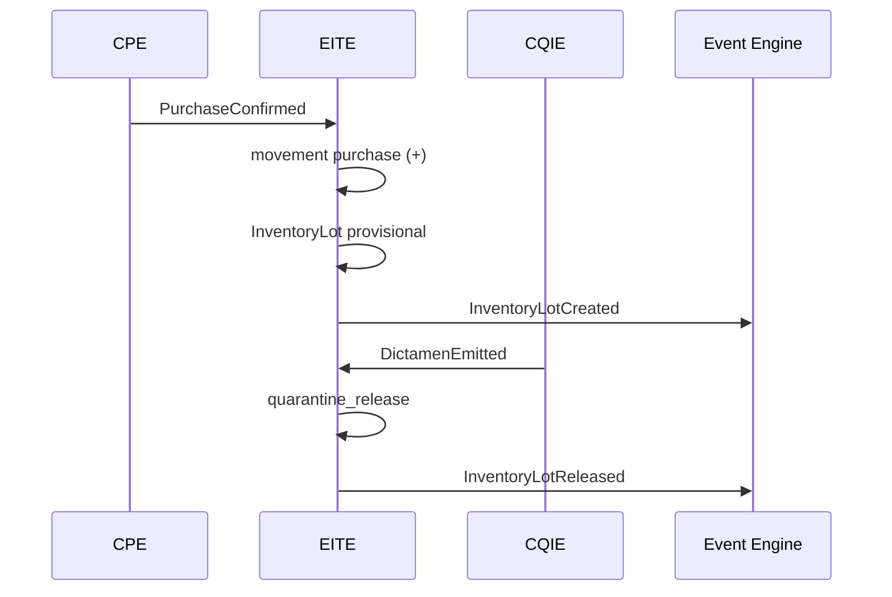

# Especificación Funcional — Enterprise Inventory & Traceability Engine

| Campo | Valor |
|-------|-------|
| **Código módulo** | EITE |
| **Nombre comercial** | Inventario y Trazabilidad Empresarial |
| **Nombre arquitectónico** | Enterprise Inventory & Traceability Engine |
| **Alias dominio café** | CITE — Coffee Inventory & Traceability Engine |
| **Versión documento** | 1.0 |
| **Estado** | Aprobado para implementación |
| **Product Owner** | AGROERP Product |
| **Release objetivo** | R2 — Commercial Chain (núcleo) / R3 — Enterprise WMS |
| **Documentos referencia** | `COFFEE_INVENTORY_TRACEABILITY_ENGINE.md`, `COFFEE_DOMAIN.md`, `CPE_FUNCTIONAL_SPEC.md`, `CAE_FUNCTIONAL_SPEC.md`, `MASTER_DATA_ENGINE.md`, `AGROERP_MASTER_SPECIFICATION.md` |

---

## 1. Objetivo del módulo

Administrar **cualquier tipo de producto** en inventario empresarial con **trazabilidad completa** desde el ingreso hasta la salida, soportando múltiples empresas, múltiples bodegas, múltiples centros de acopio y **millones de movimientos**.

EITE es el **ledger físico y lógico** de AGROERP: catálogo de productos, bodegas, lotes, movimientos, kardex permanente, costos, conteos físicos, alertas y cadena de custodia. La primera implementación de dominio es **café** (alias arquitectónico **CITE**); el núcleo es **commodity-extensible** para fertilizantes, insumos, herramientas, activos, combustibles y productos terminados.

**Regla de oro:** En AGROERP **nunca se modifica cantidad de inventario directamente**. Todo cambio de stock es consecuencia de un **evento de movimiento** (`InventoryMovement`) con auditoría, kardex y trazabilidad asociados.

---

## 2. Alcance

| # | Funcionalidad incluida |
|---|------------------------|
| A-01 | Catálogo productos: código, barras, QR, categorías, UOM, peso, volumen, documentación |
| A-02 | Tipos producto: materias primas, café (pergamino, verde, trillado, tostado), fertilizantes, agroinsumos, herramientas, equipos, activos, repuestos, papelería, combustibles, lubricantes, terminados, en proceso |
| A-03 | Bodegas: acopio, almacén, silo, depósito, cuarto frío, bodega móvil — con responsable, capacidad, ubicación, restricciones |
| A-04 | Jerarquía ubicación: bodega → zona → pasillo → estantería → nivel → posición (bin) |
| A-05 | Movimientos: entrada, salida, traslado, ajuste ±, devolución, reproceso, consumo, transformación, merma, donación, baja, pérdida |
| A-06 | Trazabilidad E2E: usuario, fecha, hora, documento origen/destino, lote, sublote, empresa, bodega, responsable, GPS |
| A-07 | Kardex permanente: existencia anterior, movimiento, existencia final, valor unitario, valor total, auditoría |
| A-08 | Costos parametrizables: PEPS (FIFO), UEPS (LIFO), promedio ponderado, costo específico, costo estándar |
| A-09 | Lotes, sublotes, series, fechas producción/vencimiento, origen, calidad, estado |
| A-10 | Conteos: físico, cíclico, general, reconciliación, diferencias, ajustes con aprobación |
| A-11 | Alertas: stock mín/máx, sobreinventario, vencidos, próximos a vencer, negativo, anómalos, sin rotación |
| A-12 | Reservas para despacho, venta, transformación, muestreo |
| A-13 | Transformaciones: mezcla, fracción, beneficio, empaque, reclasificación |
| A-14 | Cadena de custodia por manipulación física |
| A-15 | Integración CPE, PRM, FTIP, FMDT, CAE, CQIE, CSFE, ventas, contabilidad, EDMKP, USFP, GTIP, IA, Workflow |
| A-16 | Reportes y KPIs operativos y financieros |
| A-17 | Android: consulta, movimientos, escaneo QR/barras, fotos, offline, sync |
| A-18 | IA: agotados, optimización, compras, pérdidas, fraude, logística, traslados |
| A-19 | Multi-tenant, multi-bodega, multi-país, multi-commodity, millones de registros |

---

## 3. Exclusiones

| # | Exclusión | Módulo responsable |
|---|-----------|-------------------|
| E-01 | Compra en finca / recepción productor | CPE |
| E-02 | Dictamen laboratorio formal | CQIE |
| E-03 | Liquidación y pago productor | CSFE |
| E-04 | Transporte entre sitios (guías, rutas) | CLSE |
| E-05 | Contabilidad general / asientos GL | ERP contable / IEL |
| E-06 | Maestro productor y fincas | PRM / FTIP |
| E-07 | Diseño UI / WMS pantallas | Fuera de spec |
| E-08 | Despacho aduanero exportación | Futuro |
| E-09 | Mantenimiento activos fijos (CMMS) | Futuro |

---

## 4. Actores

### 4.1 Jefe de bodega

| Campo | Valor |
|-------|-------|
| **Rol** | `warehouse_manager` |
| **Responsabilidades** | Administrar bodega, aprobar ajustes, conteos, traslados |
| **Permisos** | `inventory:*`, `inventory:approve` |

### 4.2 Auxiliar de bodega / Operario

| Campo | Valor |
|-------|-------|
| **Rol** | `warehouse_operator` |
| **Responsabilidades** | Registrar movimientos, picking, ubicación, escaneo QR |
| **Permisos** | `inventory:movement:create`, `inventory:lot:read`, `inventory:count:create` |

### 4.3 Almacenista / Recepción

| Campo | Valor |
|-------|-------|
| **Rol** | `receiver` |
| **Responsabilidades** | Recepción física, pesaje báscula, conciliación CPE |
| **Permisos** | `inventory:reception:create`, `procurement:receive` |

### 4.4 Analista de inventario

| Campo | Valor |
|-------|-------|
| **Rol** | `inventory_analyst` |
| **Responsabilidades** | Conteos, reconciliación, reportes, KPIs |
| **Permisos** | `inventory:read`, `inventory:count:admin`, `inventory:export` |

### 4.5 Analista de calidad

| Campo | Valor |
|-------|-------|
| **Rol** | `quality_analyst` |
| **Responsabilidades** | Cuarentena, liberación lote, bloqueo por NC |
| **Permisos** | `inventory:lot:block`, `quality:read` |

### 4.6 Comprador / Abastecimiento

| Campo | Valor |
|-------|-------|
| **Rol** | `buyer` |
| **Responsabilidades** | Consultar disponibilidad, solicitar traslados |
| **Permisos** | `inventory:read`, `inventory:transfer:request` |

### 4.7 Contador / Finanzas

| Campo | Valor |
|-------|-------|
| **Rol** | `finance_analyst` |
| **Responsabilidades** | Inventario valorizado, costos, cierre |
| **Permisos** | `inventory:valuation:read`, `inventory:kardex:export` |

### 4.8 Administrador inventario

| Campo | Valor |
|-------|-------|
| **Rol** | `inventory_admin` |
| **Responsabilidades** | Políticas costo, umbrales alertas, catálogos |
| **Permisos** | `inventory:admin` |

### 4.9 Auditor

| Campo | Valor |
|-------|-------|
| **Rol** | `auditor` |
| **Responsabilidades** | Trazabilidad, kardex, cadena custodia |
| **Permisos** | `inventory:read`, `audit:read`, `inventory:trace:read` |

---

## 5. Roles involucrados (sistema)

| Rol slug | Uso EITE |
|----------|----------|
| `warehouse_manager` | Gestión bodega |
| `warehouse_operator` | Operación diaria |
| `receiver` | Recepción |
| `inventory_analyst` | Análisis y conteos |
| `quality_analyst` | Cuarentena |
| `inventory_admin` | Configuración |
| `auditor` | Auditoría |
| `viewer` | Consulta |

---

## 6. Historias de Usuario

### US-EITE-001 — Entrada automática desde compra CPE

| Campo | Contenido |
|-------|-----------|
| **Como** | sistema |
| **Quiero** | crear lote y movimiento entrada al confirmar compra CPE |
| **Para** | trazabilidad inmediata productor → inventario |
| **Prioridad** | Crítica |

**Criterios:** `PurchaseConfirmed` → `InventoryLot` + `InventoryMovement` tipo `purchase`; kardex; evento `InventoryLotCreated`.

---

### US-EITE-002 — Consultar existencias por bodega

| Campo | Contenido |
|-------|-----------|
| **Como** | jefe de bodega |
| **Quiero** | ver existencias por producto, lote y ubicación |
| **Prioridad** | Crítica |

**Criterios:** Filtros bodega, zona, producto, lote; saldo disponible vs reservado.

---

### US-EITE-003 — Traslado inter-bodega

| Campo | Contenido |
|-------|-----------|
| **Como** | operario |
| **Quiero** | trasladar lote entre bodegas con trazabilidad |
| **Prioridad** | Crítica |

**Criterios:** Par `transfer_out` + `transfer_in`; estado `in_transit`; custodia.

---

### US-EITE-004 — Kardex por lote

| Campo | Contenido |
|-------|-----------|
| **Como** | analista inventario |
| **Quiero** | ver kardex completo de un lote |
| **Prioridad** | Crítica |

**Criterios:** balanceBefore, delta, balanceAfter, unitCost, totalCost, documento origen.

---

### US-EITE-005 — Conteo físico con ajuste

| Campo | Contenido |
|-------|-----------|
| **Como** | analista |
| **Quiero** | ejecutar conteo y generar ajuste si hay diferencia |
| **Prioridad** | Crítica |

**Criterios:** CycleCount → varianza → workflow si excede tolerancia → `adjustment_±`.

---

### US-EITE-006 — Transformación café (mezcla/beneficio)

| Campo | Contenido |
|-------|-----------|
| **Como** | operario planta |
| **Quiero** | registrar transformación con lotes padre e hijo |
| **Prioridad** | Alta |

**Criterios:** `InventoryTransformation`; grafo trazabilidad; merma declarada.

---

### US-EITE-007 — Alerta stock mínimo

| Campo | Contenido |
|-------|-----------|
| **Como** | sistema |
| **Quiero** | alertar cuando stock < mínimo parametrizado |
| **Prioridad** | Alta |

**Criterios:** OCC `StockBelowMinimum`; notificación comprador.

---

### US-EITE-008 — Escaneo QR lote Android

| Campo | Contenido |
|-------|-----------|
| **Como** | operario bodega |
| **Quiero** | escanear QR y ver trazabilidad del lote |
| **Prioridad** | Alta |

**Criterios:** Origen, movimientos, ubicación, calidad; offline cache.

---

### US-EITE-009 — Inventario insumos agrícolas

| Campo | Contenido |
|-------|-----------|
| **Como** | almacenista |
| **Quiero** | gestionar fertilizantes y agroinsumos con vencimiento |
| **Prioridad** | Alta |

**Criterios:** Lote con `expiryDate`; alerta próximo vencer; UOM múltiple.

---

### US-EITE-010 — Costo promedio ponderado

| Campo | Contenido |
|-------|-----------|
| **Como** | contador |
| **Quiero** | valorizar inventario con método parametrizado por org |
| **Prioridad** | Alta |

**Criterios:** `InventoryCostPolicy`; kardex con unitCost recalculado.

---

### US-EITE-011 — Bloqueo lote por calidad

| Campo | Contenido |
|-------|-----------|
| **Como** | analista calidad |
| **Quiero** | bloquear lote en cuarentena hasta dictamen CQIE |
| **Prioridad** | Crítica |

**Criterios:** status `quarantine`; sin salida comercial; `quarantine_release` post-dictamen.

---

### US-EITE-012 — Trazabilidad inversa productor

| Campo | Contenido |
|-------|-----------|
| **Como** | auditor |
| **Quiero** | rastrear lote inventario hasta productor, finca y compra |
| **Prioridad** | Crítica |

**Criterios:** TraceLink completo; reporte EITE-RPT-20.

---

### US-EITE-013 — Movimiento offline Android

| Campo | Contenido |
|-------|-----------|
| **Como** | operario |
| **Quiero** | registrar movimiento sin conexión |
| **Prioridad** | Alta |

**Criterios:** externalId; sync idempotente; conflicto resoluble.

---

### US-EITE-014 — IA predicción agotados

| Campo | Contenido |
|-------|-----------|
| **Como** | comprador |
| **Quiero** | ver productos en riesgo de agotarse |
| **Prioridad** | Media |

**Criterios:** Proyección demanda vs stock; recomendación compra.

---

### US-EITE-015 — Inventario valorizado

| Campo | Contenido |
|-------|-----------|
| **Como** | gerente finanzas |
| **Quiero** | reporte inventario valorizado por bodega |
| **Prioridad** | Alta |

**Criterios:** EITE-RPT-05; método costo org.

---

## 7. Casos de Uso

| ID | Caso de uso | Actor | Resultado |
|----|-------------|-------|-----------|
| CU-EITE-01 | Crear producto catálogo | Admin | InventoryProduct |
| CU-EITE-02 | Crear bodega y zonas | Admin | Warehouse + Zones |
| CU-EITE-03 | Entrada por compra CPE | Sistema | Lot + Movement |
| CU-EITE-04 | Recepción bodega Fase 2 | Recepción | Movement reception |
| CU-EITE-05 | Salida / despacho | Operario | dispatch_out |
| CU-EITE-06 | Traslado inter-bodega | Operario | Transfer pair |
| CU-EITE-07 | Ajuste positivo/negativo | Analista | adjustment_± |
| CU-EITE-08 | Conteo físico | Analista | CycleCount |
| CU-EITE-09 | Transformación | Operario | Transformation |
| CU-EITE-10 | Reservar lote | Sistema/Ventas | Reservation |
| CU-EITE-11 | Consultar kardex | Analista | Kardex lines |
| CU-EITE-12 | Consultar trazabilidad QR | Operario | Trace graph |
| CU-EITE-13 | Bloquear/liberar lote | Calidad | block/unblock |
| CU-EITE-14 | Anular movimiento | Supervisor | reversal |
| CU-EITE-15 | Sync movimiento Android | Operario | synced |

---

## 8. Reglas de Negocio

### 8.1 Principios inviolables

| ID | Regla |
|----|-------|
| RN-EITE-001 | **Event-sourced:** saldo = f(movimientos); proyección materializada derivada |
| RN-EITE-002 | **Prohibido** actualizar `quantity` directamente; solo vía `InventoryMovement` |
| RN-EITE-003 | Movimiento `confirmed` es **inmutable**; corrección solo vía `reversal` |
| RN-EITE-004 | Toda manipulación física registra **cadena de custodia** |
| RN-EITE-005 | Soft delete only; histórico kardex inmutable |
| RN-EITE-006 | Trazabilidad **nunca se pierde** — linaje preservado en transformaciones |

### 8.2 Catálogo productos

| ID | Regla |
|----|-------|
| RN-EITE-010 | `productCode` único por `organizationId` |
| RN-EITE-011 | Producto `inactive` no permite nuevos movimientos entrada |
| RN-EITE-012 | UOM base obligatoria; conversiones en `ProductUomConversion` |
| RN-EITE-013 | Productos perecederos requieren `trackExpiry=true` |
| RN-EITE-014 | Productos serializados requieren `trackSerial=true` |
| RN-EITE-015 | Café usa perfiles commodity `coffee.*`; insumos `agroinput.*` |

### 8.3 Bodegas

| ID | Regla |
|----|-------|
| RN-EITE-020 | Cada bodega tiene inventario **independiente** (saldo por warehouseId) |
| RN-EITE-021 | Movimiento no puede exceder `capacityKg` bodega (alerta o bloqueo configurable) |
| RN-EITE-022 | Bodega `inactive` bloquea nuevos movimientos |
| RN-EITE-023 | Restricciones zona (temperatura, commodity) validadas al ubicar |
| RN-EITE-024 | Responsable `managerUserId` recibe alertas capacidad y conteo |

### 8.4 Movimientos

| ID | Regla |
|----|-------|
| RN-EITE-030 | Salida no puede exceder `availableQty` del lote |
| RN-EITE-031 | Transferencia = `transfer_out` + `transfer_in` vinculados o atómico |
| RN-EITE-032 | Lote `quarantine` o `blocked` no permite salida comercial |
| RN-EITE-033 | Mezcla exige ≥2 lotes padre; trazabilidad en hijo vía `parentLotIds` |
| RN-EITE-034 | División: Σ hijos = padre − merma declarada |
| RN-EITE-035 | Inventario negativo **prohibido** salvo política excepción con workflow |
| RN-EITE-036 | Devolución genera `return_in` con referencia documento origen |

### 8.5 Kardex y costos

| ID | Regla |
|----|-------|
| RN-EITE-040 | Cada movimiento `confirmed` genera línea kardex |
| RN-EITE-041 | Método costo por `organizationId` + opcional por `productCategory` |
| RN-EITE-042 | PEPS (FIFO): salida consume capas más antiguas |
| RN-EITE-043 | UEPS (LIFO): solo si legislación país lo permite (`allowLifo`) |
| RN-EITE-044 | Promedio ponderado: recalcula unitCost en cada entrada |
| RN-EITE-045 | Costo específico: lote trazable mantiene costo origen CPE |
| RN-EITE-046 | Costo estándar: varianza en movimiento separado |

### 8.6 Lotes

| ID | Regla |
|----|-------|
| RN-EITE-050 | `quantity` ≥ 0 siempre |
| RN-EITE-051 | Lote `depleted` cuando qty = 0 y sin reservas |
| RN-EITE-052 | QR único por lote activo; división genera QR hijos con linaje |
| RN-EITE-053 | Lote inventario EITE ≠ lote agrícola FMDT — entidades distintas |
| RN-EITE-054 | Vencimiento superado → status `expired`; alerta y bloqueo salida |

### 8.7 Conteos

| ID | Regla |
|----|-------|
| RN-EITE-060 | Varianza < tolerancia → auto-ajuste configurable |
| RN-EITE-061 | Varianza > tolerancia → workflow aprobación |
| RN-EITE-062 | Conteo en progreso puede congelar scope (opcional) |
| RN-EITE-063 | Ajuste post-conteo genera movimiento `adjustment_±` referenciando CycleCount |

### 8.8 Integración dominio café (CITE)

| ID | Regla |
|----|-------|
| RN-EITE-070 | Entrada café desde CPE: lote `provisional` hasta recepción bodega |
| RN-EITE-071 | Dictamen CQIE gobierna `quarantine_release` |
| RN-EITE-072 | Trazabilidad café: producerId, farmUnitId, fieldLotId, purchaseId obligatorios |

---

## 9. Flujo principal — Entrada por compra CPE a stock disponible

| Paso | Actor | Acción | Resultado |
|------|-------|--------|-----------|
| 1 | CPE | `PurchaseConfirmed` evento | Trigger EITE |
| 2 | Sistema | Crear `InventoryLot` status `provisional` | Lote con trazabilidad CPE |
| 3 | Sistema | `InventoryMovement` tipo `purchase` (+) | Kardex línea 1 |
| 4 | Sistema | Publicar `InventoryLotCreated` | Event Engine |
| 5 | Recepción | Llegada física bodega — pesaje | WeighingRecord |
| 6 | Recepción | `InventoryMovement` tipo `reception` | Conciliación CPE |
| 7 | CQIE | Muestra y dictamen | qualityProfile |
| 8 | Calidad | `quarantine_release` o mantener cuarentena | status update |
| 9 | Operario | Ubicar en zona/posición | `transfer` interno |
| 10 | Sistema | status `available` | Stock despachable |



---

## 10. Flujos alternativos

### FA-EITE-01 — Entrada manual sin CPE (insumos)

| Paso | Acción |
|------|--------|
| FA1.1 | Crear movimiento `manual_in` |
| FA1.2 | Workflow si monto > umbral |
| FA1.3 | Lote nuevo o incremento existente |

### FA-EITE-02 — Traslado inter-bodega

| Paso | Acción |
|------|--------|
| FA2.1 | Crear Transfer draft |
| FA2.2 | `transfer_out` origen — status `in_transit` |
| FA2.3 | Recepción destino — `transfer_in` |
| FA2.4 | Custodia en tránsito |

### FA-EITE-03 — Conteo con diferencia

| Paso | Acción |
|------|--------|
| FA3.1 | CycleCount captura countedQty |
| FA3.2 | varianza = counted − expected |
| FA3.3 | Dentro tolerancia → auto `adjustment_±` |
| FA3.4 | Fuera tolerancia → workflow |

### FA-EITE-04 — Transformación mezcla café

| Paso | Acción |
|------|--------|
| FA4.1 | Seleccionar lotes padre |
| FA4.2 | Workflow si certificación orgánica |
| FA4.3 | `transform_consume` padres + `transform_produce` hijo |
| FA4.4 | Grafo TraceLink multi-origen |

### FA-EITE-05 — Anulación movimiento

| Paso | Acción |
|------|--------|
| FA5.1 | Supervisor solicita `reversal` |
| FA5.2 | Workflow `inventory.reversal` |
| FA5.3 | Movimiento inverso + kardex |

---

## 11. Casos de error

| ID | Condición | Mensaje | Comportamiento |
|----|-----------|---------|----------------|
| CE-EITE-01 | Salida > disponible | "Stock insuficiente: {n} disponible" | Bloquea |
| CE-EITE-02 | Bodega inactiva | "Bodega no operativa" | Bloquea |
| CE-EITE-03 | Producto inactivo | "Producto no habilitado" | Bloquea |
| CE-EITE-04 | Lote bloqueado | "Lote en cuarentena/bloqueado" | Bloquea salida |
| CE-EITE-05 | Capacidad excedida | "Capacidad bodega superada" | Bloquea/workflow |
| CE-EITE-06 | Restricción zona | "Producto no permitido en zona" | Bloquea |
| CE-EITE-07 | Vencimiento superado | "Lote vencido" | Bloquea salida |
| CE-EITE-08 | Movimiento duplicado sync | Idempotente | Retorna existente |
| CE-EITE-09 | Sin custodia | "Evidencia custodia obligatoria" | Bloquea confirmación |
| CE-EITE-10 | LIFO no permitido país | "UEPS no habilitado" | Bloquea política costo |

---

## 12. Validaciones

### 12.1 Catálogo producto (InventoryProduct)

| Campo | Obligatorio | Validación |
|-------|-------------|------------|
| productCode | Sí | Único org |
| alternateCode | No | |
| barcode | No | Único si presente |
| qrPayload | No | Generado o manual |
| name | Sí | |
| description | No | |
| categoryCode | Sí | `inventory.product_category` |
| subcategoryCode | No | |
| brandCode | No | |
| baseUomCode | Sí | MDE UOM |
| equivalentUoms | No | Array conversiones |
| weightKg | No | |
| volumeM3 | No | |
| status | Sí | active, inactive, discontinued |
| photoContentId | No | EDMKP |
| commodityCode | Sí | coffee, agroinput, spare_part… |
| trackLot | Sí | Bool |
| trackExpiry | Según categoría | |
| trackSerial | Según categoría | |
| minStockLevel | No | Alerta |
| maxStockLevel | No | Alerta |
| standardCost | No | Si método estándar |
| observations | No | |

### 12.2 Tipos de producto soportados

| Categoría | Código commodity | Trazabilidad lote |
|-----------|------------------|-------------------|
| Materias primas | `raw_material` | Sí |
| Café cereza/pergamino/verde | `coffee` | Sí — perfil CITE |
| Café trillado/tostado | `coffee_processed` | Sí |
| Fertilizantes | `fertilizer` | Sí + vencimiento |
| Agroinsumos | `agroinput` | Sí + vencimiento |
| Herramientas | `tool` | Opcional serie |
| Equipos | `equipment` | Serie/activo |
| Activos fijos | `fixed_asset` | Serie |
| Repuestos | `spare_part` | Lote/serie |
| Papelería / oficina | `office_supply` | Opcional |
| Combustibles | `fuel` | Lote |
| Lubricantes | `lubricant` | Lote + vencimiento |
| Producto terminado | `finished_good` | Sí |
| En proceso (WIP) | `wip` | Sí |

### 12.3 Bodega (Warehouse)

| Campo | Obligatorio |
|-------|-------------|
| warehouseCode | Sí |
| name | Sí |
| warehouseTypeCode | Sí — acopio, almacen, silo, deposito, cold_room, mobile |
| companyEntityId | Sí |
| managerUserId | Sí |
| capacityKg / capacityM3 | Recomendado |
| address, municipalityId | Sí |
| gpsLocation | Recomendado GTIP |
| status | Sí |
| restrictions | JSON — commodities, temp |
| operatingHours | No |

### 12.4 Tipos de movimiento

| Tipo | Código | Efecto |
|------|--------|--------|
| Entrada | `purchase`, `reception`, `manual_in`, `return_in`, `transfer_in`, `transform_produce`, `adjustment_plus` | + |
| Salida | `dispatch_out`, `transfer_out`, `consumption`, `transform_consume`, `shrinkage`, `loss`, `donation`, `write_off`, `return_out`, `adjustment_minus` | − |
| Neutro | `reserve`, `release_reserve`, `block`, `unblock`, `cycle_count` | status/qty reservada |
| Reverso | `reversal` | ± opuesto |

---

## 13. Workflow configurable

| workflowKey | Disparador |
|-------------|------------|
| `inventory.adjustment.approval` | Ajuste fuera tolerancia conteo |
| `inventory.transfer.approval` | Traslado inter-regional |
| `inventory.blend.approval` | Mezcla certificada |
| `inventory.loss.report` | Pérdida > umbral |
| `inventory.block` | Bloqueo lote |
| `inventory.reversal` | Anulación movimiento |
| `inventory.cyclecount.variance` | Varianza conteo |
| `inventory.manual_in.approval` | Entrada manual alto valor |
| `inventory.negative_stock.exception` | Política stock negativo |

---

## 14. Dependencias

| Módulo | Relación |
|--------|----------|
| **CPE** | Entrada compra café |
| **CAE** | Trazabilidad contrato |
| **PRM** | Origen productor |
| **FTIP / FMDT** | Finca, lote agrícola |
| **CQIE** | Cuarentena, perfil calidad |
| **CSFE** | Costo adquisición, valorización |
| **CLSE** | Despacho logístico (futuro) |
| **MDE** | Catálogos inventory.* |
| **EDMKP** | Fotos, guías, etiquetas |
| **USFP** | Formularios inspección |
| **GTIP** | Ubicación bodegas, GPS |
| **Workflow** | Aprobaciones |
| **OCC** | Alertas operativas |
| **AIADP** | Predicciones, fraude |
| **IEL** | Contabilidad externa |

---

## 15. Permisos

| Permiso | Roles |
|---------|-------|
| `inventory:product:read` | Todos operativos |
| `inventory:product:create` | inventory_admin |
| `inventory:warehouse:read` | Operativos |
| `inventory:warehouse:admin` | inventory_admin |
| `inventory:lot:read` | Operativos |
| `inventory:lot:create` | warehouse_operator |
| `inventory:lot:block` | quality_analyst, supervisor |
| `inventory:movement:create` | warehouse_operator |
| `inventory:movement:confirm` | warehouse_operator, manager |
| `inventory:movement:reverse` | warehouse_manager |
| `inventory:transfer:create` | warehouse_operator |
| `inventory:transfer:approve` | warehouse_manager |
| `inventory:count:create` | inventory_analyst |
| `inventory:count:approve` | warehouse_manager |
| `inventory:adjustment:approve` | warehouse_manager |
| `inventory:valuation:read` | finance_analyst |
| `inventory:trace:read` | auditor |
| `inventory:export` | analyst, auditor |
| `inventory:admin` | inventory_admin |

---

## 16. Auditoría

| Evento | Datos |
|--------|-------|
| Creación/edición producto | Diff completo |
| Movimiento confirmado | Valores kardex, custodia |
| Ajuste conteo | Varianza, aprobador |
| Bloqueo/desbloqueo lote | Motivo, CQIE ref |
| Reversal | Movimiento original + inverso |
| Consulta trazabilidad | Quién consultó QR |
| Transformación | Padres, hijos, merma |
| Sync conflicto Android | Resolución |

Retención: mínimo 7 años (GECL); kardex **permanente**.

---

## 17. Eventos generados

| Evento | Cuándo |
|--------|--------|
| `InventoryProductCreated` | Alta producto |
| `InventoryLotCreated` | Nuevo lote |
| `InventoryLotSplit` | División |
| `InventoryLotBlended` | Mezcla |
| `InventoryLotBlocked` / `InventoryLotReleased` | Bloqueo/liberación |
| `InventoryLotDepleted` | Saldo cero |
| `InventoryMovementRecorded` | Movimiento pendiente |
| `InventoryMovementConfirmed` | Stock actualizado |
| `InventoryMovementReversed` | Reverso |
| `InventoryReserved` / `InventoryReservationReleased` | Reserva |
| `InventoryTransferred` | Traslado completado |
| `InventoryTransformed` | Transformación |
| `InventoryShrinkageRecorded` / `InventoryLossRecorded` | Merma/pérdida |
| `InventoryAdjusted` | Ajuste conteo |
| `CycleCountStarted` / `CycleCountReconciled` | Conteo |
| `CustodyEventRecorded` | Cadena custodia |
| `InventoryQRGenerated` | Etiqueta |
| `StockBelowMinimum` / `StockAboveMaximum` | Alertas |
| `ProductExpiring` / `ProductExpired` | Vencimiento |
| `TraceabilityQueryExecuted` | Consulta QR |
| `InventorySyncCompleted` / `InventorySyncConflict` | Sync Android |

Namespace: `inventory.*` + alias CDP español.

---

## 18. Automatizaciones

| ID | Disparador | Acción |
|----|------------|--------|
| AUT-EITE-01 | PurchaseConfirmed CPE | Crear lote + movimiento purchase |
| AUT-EITE-02 | Dictamen CQIE positivo | quarantine_release |
| AUT-EITE-03 | stock < minStockLevel | Alerta OCC + notificación |
| AUT-EITE-04 | expiryDate − N días | Alerta próximo vencer |
| AUT-EITE-05 | capacity > 90% | Alerta capacidad bodega |
| AUT-EITE-06 | Varianza conteo < umbral | Auto adjustment |
| AUT-EITE-07 | Sin movimiento > N días | Alerta sin rotación |
| AUT-EITE-08 | IA fraude movimiento | Flag observed |
| AUT-EITE-09 | Reserva TTL expirada | Liberar reserva |
| AUT-EITE-10 | Lote depleted | Archivar + cerrar trazabilidad activa |

---

## 19. Integración IA

| Función | Entrada | Salida |
|---------|---------|--------|
| Predicción agotados | Histórico salidas, estacionalidad | Lista productos riesgo |
| Optimización inventario | Stock, demanda, lead time | Niveles min/max sugeridos |
| Recomendación compras | Agotados + CPE/CAE | Sugerencia reorden |
| Detección pérdidas | Mermas, varianzas conteo | Anomalías |
| Detección fraude | Patrones movimiento, GPS | Risk score |
| Optimización logística | Ubicación bodegas, demanda | Rutas traslado |
| Recomendación traslados | Desbalance inter-bodega | Transfer proposals |

---

## 20. Integración Compras (CPE)

| Función | Descripción |
|---------|-------------|
| Entrada automática | `PurchaseConfirmed` → lot + movement |
| Trazabilidad | producerId, farmUnitId, fieldLotId, purchaseId |
| Conciliación peso | reception vs peso CPE |
| Anulación compra | reversal movimiento + lote |

---

## 21. Integración Productores y Fincas (PRM / FTIP / FMDT)

| Función | Descripción |
|---------|-------------|
| Origen trazable | Enlaces TraceLink |
| Vista 360° PRM | Entregas que alimentaron lotes |
| Roll-up por productor | Kardex agregado origen |
| Distinción | Lote inventario ≠ LotUnit FMDT |

---

## 22. Integración Contratos (CAE)

| Función | Descripción |
|---------|-------------|
| agreementId en lote café | Trazabilidad contractual |
| Cumplimiento | kg inventario vs cupo entregado |

---

## 23. Integración Calidad (CQIE)

| Función | Descripción |
|---------|-------------|
| Cuarentena | status `quarantine` al crear |
| dictamenId | Perfil calidad lote |
| Liberación | `quarantine_release` |
| Bloqueo NC grave | `block` sin despacho |

---

## 24. Integración Finanzas y Contabilidad (CSFE / IEL)

| Función | Descripción |
|---------|-------------|
| Costo adquisición | Desde CPE/CSFE → capa costo |
| Inventario valorizado | qty × unitCost |
| Evento costo movimiento | Para asiento contable IEL |
| Cierre período | Snapshot valorizado |

---

## 25. Integración Documental (EDMKP)

| Tipo | Uso |
|------|-----|
| Foto producto | Catálogo |
| Guía despacho | Movimiento salida |
| Ticket báscula | Recepción |
| Etiqueta QR PDF | Impresión lote |
| Acta conteo | CycleCount |
| Acta merma/pérdida | shrinkage/loss |

---

## 26. Integración Formularios (USFP) y GIS (GTIP)

| Función | Descripción |
|---------|-------------|
| Inspección bodega | USFP → CycleCount |
| Mapa bodegas | GTIP overlay stock |
| GPS custodia | Movimiento móvil |

---

## 27. Integración Ventas (futuro)

| Función | Descripción |
|---------|-------------|
| Reserva stock | Reservation para orden venta |
| Despacho | dispatch_out vinculado |
| Devolución cliente | return_in |

---

## 28. Integración Workflow y Auditoría

- Workflow Engine: todos los `inventory.*` approval keys
- Audit Engine: diff automático; kardex inmutable
- OCC: proyección `InventoryAlertProjection`

---

## 29. Modelo de datos funcional

### 29.1 InventoryProduct

| Campo | Tipo | Descripción |
|-------|------|-------------|
| productId | UUID | PK |
| organizationId | UUID | Tenant |
| productCode | Texto | Código único |
| alternateCode | Texto | Código alterno |
| barcode | Texto | EAN/UPC |
| qrPayload | Texto | QR estático producto |
| name / description | Texto | |
| categoryCode / subcategoryCode | Catálogo | |
| brandCode | Catálogo | |
| commodityCode | Catálogo | coffee, fertilizer… |
| baseUomCode | Catálogo | UOM base |
| uomConversions | JSON | Unidades equivalentes |
| weightKg / volumeM3 | Decimal | |
| status | Enum | active, inactive, discontinued |
| photoContentId | Ref EDMKP | |
| documentIds | Array | Fichas técnicas |
| trackLot / trackExpiry / trackSerial | Bool | |
| minStockLevel / maxStockLevel | Decimal | Alertas |
| standardCost | Money | Costo estándar |
| costMethodOverride | Enum | Opcional por producto |
| shelfLifeDays | Entero | Vencimiento default |
| metadata | JSON | |

### 29.2 Warehouse

| Campo | Descripción |
|-------|-------------|
| warehouseId | UUID |
| warehouseCode | Único org |
| name | |
| organizationId | Tenant |
| companyEntityId | Empresa legal |
| warehouseTypeCode | acopio, almacen, silo, cold_room, mobile… |
| managerUserId | Responsable |
| capacityKg / capacityM3 | |
| currentUtilizationKg | Proyección |
| address, municipalityId | |
| gpsLocation | GeoJSON |
| status | active, inactive, maintenance |
| restrictions | JSON commodities, temp |
| certifications | Array | |
| operatingHours | JSON |

### 29.3 WarehouseZone / WarehousePosition

Jerarquía: `Warehouse` → `Zone` → `[Aisle]` → `[Rack]` → `[Level]` → `Position (bin)`

| Campo Zone | Descripción |
|------------|-------------|
| zoneId | UUID |
| zoneTypeCode | storage, quarantine, rejected, dispatch_staging, processing, cold |
| capacityKg | |
| temperatureControlled | Bool |

| Campo Position | Descripción |
|----------------|-------------|
| positionId | UUID |
| fullLocationCode | WH01-ZA-A03-R02-L04-B17 |
| maxWeightKg | |
| occupied | Proyección |

### 29.4 InventoryLot

| Campo | Descripción |
|-------|-------------|
| lotId | UUID |
| lotNumber | Humano único org |
| productId | FK catálogo |
| lotTypeCode | single_origin, blend, transformed |
| commodityCode | |
| status | §29.10 |
| quantity | Decimal proyección — **no editable** |
| reservedQty / availableQty | Proyección |
| baseUomCode | |
| warehouseId, zoneId, positionId | Ubicación |
| productionDate / expiryDate | |
| qualityGradeCode | CQIE / preliminar |
| dictamenId | CQIE |
| serialNumber | Si aplica |
| **Trazabilidad café** | |
| producerId, farmUnitId, fieldLotId | PRM/FTIP/FMDT |
| purchaseId, agreementId | CPE/CAE |
| parentLotIds | Transformaciones |
| qrCode / barcode | |
| unitCost | Costo capa |
| blockedReason | |
| createdAt, createdBy | |

### 29.5 InventoryBatch (sublote)

| Campo | Descripción |
|-------|-------------|
| batchId | UUID |
| lotId | Padre |
| batchNumber | |
| quantity | |
| packageId | Saco, contenedor |
| labelId | Etiqueta física |

### 29.6 InventoryMovement

| Campo | Descripción |
|-------|-------------|
| movementId | UUID |
| externalId | Offline idempotencia |
| movementTypeCode | §12.4 |
| movementStatus | pending, confirmed, reversed, rejected |
| productId / lotId | |
| quantity | Delta (+/−) |
| baseUomCode | |
| balanceBefore / balanceAfter | Kardex |
| unitCost / totalCost | |
| fromWarehouseId / toWarehouseId | |
| fromPositionId / toPositionId | |
| referenceType / referenceId | purchase, cycle_count… |
| documentNumber | Origen/destino |
| performedBy / deviceId | |
| performedAt | Fecha + hora |
| gpsLocation | Si aplica |
| correlationId / eventId | |
| workflowInstanceId | |
| reasonCode / notes | |

### 29.7 KardexLine

| Campo | Descripción |
|-------|-------------|
| kardexLineId | UUID |
| lotId / productId / warehouseId | |
| movementId | FK |
| movementDate | |
| balanceBefore | Existencia anterior |
| quantityDelta | Movimiento |
| balanceAfter | Existencia final |
| unitCost | Valor unitario |
| totalCost | Valor movimiento |
| accumulatedValue | Valor saldo post |
| referenceType / referenceId | Documento origen |
| userId | |
| auditHash | Integridad |

### 29.8 InventoryCostLayer (PEPS/UEPS)

| Campo | Descripción |
|-------|-------------|
| layerId | UUID |
| lotId / productId / warehouseId | |
| quantityRemaining | |
| unitCost | |
| receivedAt | FIFO ordering |
| sourceMovementId | |

### 29.9 InventoryCostPolicy

| Campo | Descripción |
|-------|-------------|
| policyId | UUID |
| organizationId | |
| defaultCostMethod | fifo, lifo, weighted_avg, specific, standard |
| allowLifo | Bool — legislación |
| categoryOverrides | JSON por categoría |
| varianceAccountCode | Costo estándar varianza |

### 29.10 Estados InventoryLot

| Estado | Descripción | Despacho |
|--------|-------------|----------|
| `provisional` | Creado CPE | No |
| `quarantine` | CQIE pendiente | No |
| `available` | Disponible | Sí |
| `reserved` | Reservado | Solo reserva |
| `blocked` | Investigación | No |
| `in_transit` | Entre bodegas | No |
| `in_transformation` | Proceso | No |
| `rejected` | No comercial | No |
| `expired` | Vencido | No |
| `depleted` | Qty cero | No |
| `archived` | Histórico | No |

### 29.11 InventoryCycleCount

| Campo | Descripción |
|-------|-------------|
| cycleCountId | UUID |
| countTypeCode | physical, cyclic, general |
| scopeType | warehouse, zone, lot, product |
| scopeId | |
| scheduledAt / completedAt | |
| status | planned, in_progress, reconciled, closed |
| lines | { lotId, expectedQty, countedQty, varianceQty } |
| freezeMovements | Bool |

### 29.12 InventoryTransformation

| Campo | Descripción |
|-------|-------------|
| transformationId | UUID |
| transformationType | blend, split, benefit, package, reprocess |
| inputLotIds | Padres |
| outputLotIds | Hijos |
| yieldPct / lossQty | |
| workflowInstanceId | |

### 29.13 CustodyEvent

| Campo | Descripción |
|-------|-------------|
| custodyEventId | UUID |
| lotId | |
| action | received, moved, weighed, sampled, dispatched |
| who / when / where | Usuario, timestamp, ubicación+GPS |
| deviceId | |
| signatureContentId | |
| photoEvidenceIds | |

### 29.14 TraceLink (grafo trazabilidad)

| Campo | Descripción |
|-------|-------------|
| traceLinkId | UUID |
| lotId | |
| linkType | producer, farm, purchase, quality, movement |
| linkedEntityType / linkedEntityId | |
| metadata | JSON |

---

## 30. API funcional

**Base path:** `/api/v1/inventory` (superficie EITE; alias café `/api/v1/cite` proxy compatible)

| Método | Ruta | Permiso | Descripción |
|--------|------|---------|-------------|
| GET | `/products` | `inventory:product:read` | Catálogo |
| POST | `/products` | `inventory:product:create` | Crear producto |
| GET | `/products/:id` | `inventory:product:read` | Detalle |
| PATCH | `/products/:id` | `inventory:product:create` | Editar |
| GET | `/warehouses` | `inventory:warehouse:read` | Listar bodegas |
| POST | `/warehouses` | `inventory:warehouse:admin` | Crear bodega |
| GET | `/warehouses/:id` | `inventory:warehouse:read` | Detalle + zonas |
| POST | `/warehouses/:id/zones` | `inventory:warehouse:admin` | Crear zona |
| GET | `/warehouses/:id/stock` | `inventory:lot:read` | Existencias |
| GET | `/lots` | `inventory:lot:read` | Listar lotes |
| GET | `/lots/:id` | `inventory:lot:read` | Detalle lote |
| GET | `/lots/:id/kardex` | `inventory:lot:read` | Kardex lote |
| GET | `/lots/:id/traceability` | `inventory:trace:read` | Grafo trazabilidad |
| POST | `/lots/:id/block` | `inventory:lot:block` | Bloquear |
| POST | `/lots/:id/unblock` | `inventory:lot:block` | Desbloquear |
| POST | `/lots/:id/split` | `inventory:movement:create` | Fraccionar |
| POST | `/movements` | `inventory:movement:create` | Crear movimiento |
| POST | `/movements/:id/confirm` | `inventory:movement:confirm` | Confirmar |
| POST | `/movements/:id/reverse` | `inventory:movement:reverse` | Reversar |
| GET | `/movements` | `inventory:lot:read` | Historial |
| POST | `/transfers` | `inventory:transfer:create` | Traslado |
| POST | `/transfers/:id/ship` | `inventory:transfer:create` | Despachar origen |
| POST | `/transfers/:id/receive` | `inventory:transfer:create` | Recibir destino |
| POST | `/transformations` | `inventory:movement:create` | Transformar |
| POST | `/reservations` | `inventory:movement:create` | Reservar |
| POST | `/reservations/:id/release` | `inventory:movement:create` | Liberar |
| POST | `/cycle-counts` | `inventory:count:create` | Planificar conteo |
| POST | `/cycle-counts/:id/lines` | `inventory:count:create` | Capturar línea |
| POST | `/cycle-counts/:id/reconcile` | `inventory:count:approve` | Conciliar |
| GET | `/stock/summary` | `inventory:lot:read` | Existencias consolidadas |
| GET | `/valuation` | `inventory:valuation:read` | Inventario valorizado |
| GET | `/alerts` | `inventory:read` | Alertas activas |
| POST | `/labels/:lotId/print` | `inventory:lot:read` | Generar QR/PDF |
| GET | `/scan/:qrPayload` | `inventory:trace:read` | Consulta QR |
| POST | `/field/sync` | `inventory:movement:create` | Batch Android |
| POST | `/internal/procurement/receive` | Sistema CPE | Entrada compra |
| GET | `/reports/:reportCode` | `inventory:export` | EITE-RPT-* |
| GET | `/kpis/:kpiCode` | `inventory:read` | KPIs |
| GET | `/policies/cost` | `inventory:admin` | Política costos |
| PATCH | `/policies/cost` | `inventory:admin` | Actualizar |

---

## 31. Interfaz (especificación funcional — sin diseño gráfico)

| ID | Pantalla | Descripción |
|----|----------|-------------|
| UI-EITE-01 | Dashboard inventario | KPIs, alertas, capacidad |
| UI-EITE-02 | Catálogo productos | CRUD, categorías, UOM |
| UI-EITE-03 | Detalle producto | Stock, lotes, kardex |
| UI-EITE-04 | Bodegas y zonas | Jerarquía ubicaciones |
| UI-EITE-05 | Mapa bodegas | GTIP overlay |
| UI-EITE-06 | Existencias | Filtros multi-dimensión |
| UI-EITE-07 | Detalle lote | Trazabilidad, QR, movimientos |
| UI-EITE-08 | Registrar movimiento | Wizard entrada/salida |
| UI-EITE-09 | Traslados | Origen → tránsito → destino |
| UI-EITE-10 | Transformaciones | Padres → hijos |
| UI-EITE-11 | Kardex | Por lote/producto/bodega |
| UI-EITE-12 | Conteo físico | Planificar, capturar, conciliar |
| UI-EITE-13 | Inventario valorizado | Por método costo |
| UI-EITE-14 | Alertas stock | Mín/máx/vencimiento |
| UI-EITE-15 | Trazabilidad grafo | Visualización linaje |
| UI-EITE-16 | Configuración políticas | Costos, tolerancias |

---

## 32. Android (especificación funcional)

| ID | Flujo | Offline |
|----|-------|---------|
| AND-EITE-01 | Consultar existencias bodega | Cache sync |
| AND-EITE-02 | Escanear QR lote | Sí — trazabilidad cache |
| AND-EITE-03 | Escanear código barras producto | Sí |
| AND-EITE-04 | Registrar entrada manual | Outbox |
| AND-EITE-05 | Registrar salida/consumo | Outbox |
| AND-EITE-06 | Traslado interno posición | Outbox |
| AND-EITE-07 | Conteo cíclico por QR | Sí — reconciliar al sync |
| AND-EITE-08 | Captura fotografía evidencia | Cola media |
| AND-EITE-09 | Captura GPS custodia | Sí |
| AND-EITE-10 | Recepción compra CPE | Parcial — confirma online |
| AND-EITE-11 | Consulta kardex lote | Cache |
| AND-EITE-12 | Imprimir etiqueta Bluetooth | Sí |

### 32.1 Bootstrap offline

```
- Catálogo productos activos (MDE cache)
- Bodegas asignadas al usuario
- Lotes en bodega (snapshot)
- Políticas tolerancia conteo
- Formularios USFP inventory.*
```

### 32.2 Sync

| Conflicto | Resolución |
|-----------|------------|
| Stock insuficiente al sync | Rechazo movimiento |
| Duplicado externalId | Idempotente |
| Versión lote desactualizada | Refresh + reintentar |
| Conteo vs movimiento concurrente | Supervisor |

---

## 33. Reportes

| ID | Reporte | Descripción |
|----|---------|-------------|
| EITE-RPT-01 | Existencias | Por bodega, producto, lote |
| EITE-RPT-02 | Kardex | Período, lote, producto |
| EITE-RPT-03 | Rotación | Días en stock, FEFO/FIFO |
| EITE-RPT-04 | Productos sin movimiento | > N días |
| EITE-RPT-05 | Inventario valorizado | Método costo org |
| EITE-RPT-06 | Ajustes | Período, motivo, usuario |
| EITE-RPT-07 | Diferencias conteo | Varianzas CycleCount |
| EITE-RPT-08 | Costos | Por capa, producto, bodega |
| EITE-RPT-09 | Lotes | Estado, origen, vencimiento |
| EITE-RPT-10 | Vencimientos | Próximos y vencidos |
| EITE-RPT-11 | Bodegas | Capacidad, utilización |
| EITE-RPT-12 | Centros acopio | Café por acopio |
| EITE-RPT-13 | Mermas y pérdidas | Por causa, período |
| EITE-RPT-14 | Traslados | En tránsito, completados |
| EITE-RPT-15 | Transformaciones | Rendimiento, merma |
| EITE-RPT-16 | Trazabilidad lote | Grafo completo |
| EITE-RPT-17 | Cadena custodia | Por lote/período |
| EITE-RPT-18 | Stock negativo / excepciones | |
| EITE-RPT-19 | Comparativo conteo | Teórico vs físico |
| EITE-RPT-20 | Origen productor café | PRM → lote → stock |

---

## 34. KPIs

| ID | KPI | Fórmula conceptual |
|----|-----|-------------------|
| KPI-EITE-01 | Rotación inventario | Costo salidas / inventario promedio |
| KPI-EITE-02 | Exactitud inventario | 1 − (Σ varianza / Σ esperado) |
| KPI-EITE-03 | Valor inventario | Σ qty × unitCost |
| KPI-EITE-04 | Cobertura días | stock / demanda diaria promedio |
| KPI-EITE-05 | Tiempo permanencia | AVG días en bodega por lote |
| KPI-EITE-06 | Costo inventario | Σ costos almacenamiento |
| KPI-EITE-07 | Diferencias conteo | Σ abs(varianza) / período |
| KPI-EITE-08 | Nivel servicio | Pedidos sin quiebre / total |
| KPI-EITE-09 | Utilización bodega | currentUtilization / capacity |
| KPI-EITE-10 | Merma % | shrinkage / entradas |
| KPI-EITE-11 | Lotes en cuarentena | COUNT status=quarantine |
| KPI-EITE-12 | Productos sin rotación | COUNT sin mov > N días |
| KPI-EITE-13 | Agotados | COUNT stock < min |
| KPI-EITE-14 | Vencimientos 30d | COUNT expiry próximo |
| KPI-EITE-15 | Productividad bodega | movimientos / operario / día |
| KPI-EITE-16 | Tiempo ciclo conteo | AVG reconciled − scheduled |
| KPI-EITE-17 | Transferencias en tránsito | COUNT in_transit |
| KPI-EITE-18 | Costo logístico / kg | costo interno / kg movido |
| KPI-EITE-19 | Trazabilidad completa % | lotes con TraceLink completo |
| KPI-EITE-20 | Predicción agotados IA | COUNT riesgo alto |

### 34.1 Alertas configurables

| ID | Alerta | Parámetro |
|----|--------|-----------|
| EITE-ALT-01 | Stock mínimo | minStockLevel |
| EITE-ALT-02 | Stock máximo | maxStockLevel |
| EITE-ALT-03 | Sobre inventario | max × factor |
| EITE-ALT-04 | Producto vencido | expiryDate < hoy |
| EITE-ALT-05 | Próximo vencer | expiry − N días |
| EITE-ALT-06 | Inventario negativo | qty < 0 |
| EITE-ALT-07 | Movimiento anómalo IA | fraud score |
| EITE-ALT-08 | Sin rotación | días sin movimiento |
| EITE-ALT-09 | Capacidad bodega 90% | utilization |
| EITE-ALT-10 | Varianza conteo pendiente | |

---

## 35. Escalabilidad

### 35.1 Millones de productos y movimientos

| Aspecto | Requisito |
|---------|-----------|
| InventoryProduct | Índice org + category; cache MDE |
| InventoryMovement | Particionado org + fecha; append-only |
| KardexLine | Particionado por lotId hash; archivo histórico |
| Stock projection | Materializada async desde eventos |
| Listados | Paginación cursor; filtros indexados |
| Trazabilidad | Grafo pre-computado TraceLink |
| Reportes | DPAL async; agregados diarios |
| QR scan | CDN + cache lectura |

### 35.2 Multiempresa / multibodega

- Aislamiento `organizationId` estricto
- Saldos independientes por `warehouseId`
- Numeración lotNumber por org
- Políticas costo por org

### 35.3 Multipaís

- UOM, moneda, TRM (GECL)
- LIFO habilitado por país
- Plantillas etiqueta por jurisdicción

### 35.4 Multicultivo

- `commodityCode` extensible Metadata Engine
- Perfiles trazabilidad por commodity (café = CITE profile)
- Movimientos y kardex agnósticos UOM

---

## 36. Pruebas

### 36.1 Funcionales

| ID | Escenario |
|----|-----------|
| TF-EITE-01 | Entrada CPE → lote provisional → available |
| TF-EITE-02 | Salida dentro stock OK |
| TF-EITE-03 | Salida excede stock — bloqueo |
| TF-EITE-04 | Traslado inter-bodega completo |
| TF-EITE-05 | Conteo con auto-ajuste |
| TF-EITE-06 | Conteo varianza → workflow |
| TF-EITE-07 | Transformación blend trazabilidad |
| TF-EITE-08 | Reversal movimiento |
| TF-EITE-09 | Kardex balanceBefore/After correcto |
| TF-EITE-10 | PEPS capas consumidas orden |
| TF-EITE-11 | Promedio ponderado recalculado |
| TF-EITE-12 | Bloqueo cuarentena sin despacho |
| TF-EITE-13 | Alerta stock mínimo |
| TF-EITE-14 | Producto vencido bloqueado |
| TF-EITE-15 | QR trazabilidad completa café |

### 36.2 Integración

| ID | Escenario |
|----|-----------|
| TI-EITE-01 | CPE PurchaseConfirmed → lot + movement |
| TI-EITE-02 | CQIE dictamen → quarantine_release |
| TI-EITE-03 | CSFE costo → capa inventario |
| TI-EITE-04 | Anulación CPE → reversal |
| TI-EITE-05 | Android sync idempotente |
| TI-EITE-06 | GTIP bodega en mapa |
| TI-EITE-07 | OCC alerta capacidad |
| TI-EITE-08 | IEL asiento desde movimiento |

### 36.3 Carga

| ID | Escenario | Criterio |
|----|-----------|----------|
| TC-EITE-01 | 10M movimientos kardex query | p95 < 1s |
| TC-EITE-02 | 100 salidas concurrentes mismo lote | Sin negativo |
| TC-EITE-03 | 1M productos catálogo list | p95 < 500ms |
| TC-EITE-04 | Batch sync 200 movimientos Android | < 45s |

---

## 37. Definición de Done

- [ ] US-EITE-001 a 012 críticas/altas aceptadas PO
- [ ] RN-EITE-001 a 072 validadas
- [ ] API `/api/v1/inventory/*` Swagger
- [ ] Event-sourced movements — sin UPDATE quantity directo
- [ ] Kardex por cada movimiento confirmado
- [ ] Integración CPE entrada automática (TI-EITE-01)
- [ ] Integración CQIE cuarentena (TI-EITE-02)
- [ ] Métodos costo parametrizables (PEPS, promedio mínimo)
- [ ] Conteo físico + ajuste workflow
- [ ] Android consulta + movimiento offline
- [ ] Reportes EITE-RPT-01 a 12
- [ ] KPIs KPI-EITE-01 a 10 dashboard OCC
- [ ] Alertas EITE-ALT-01 a 08 configurables
- [ ] Trazabilidad café productor → lote

---

## 38. Futuras Mejoras

| ID | Mejora | Release |
|----|--------|---------|
| FM-EITE-01 | RFID lectura masiva | R4 |
| FM-EITE-02 | WMS avanzado picking voz | R4 |
| FM-EITE-03 | Integración ventas despacho | R3 |
| FM-EITE-04 | Blockchain hash trazabilidad | R5 |
| FM-EITE-05 | Automatización silos IoT | R4 |
| FM-EITE-06 | CMMS activos fijos | R5 |

---

## Control de cambios

| Versión | Fecha | Descripción |
|---------|-------|-------------|
| 1.0 | 2026-07-02 | Emisión inicial especificación funcional EITE |

---

## Aprobaciones

| Rol | Nombre | Fecha |
|-----|--------|-------|
| Product Owner | AGROERP Product | 2026-07-02 |
| Arquitectura | AGROERP Architecture | Pendiente revisión |
| Desarrollo Lead | — | Pendiente |
| QA Lead | — | Pendiente |

---

*Fin del documento — EITE v1.0*
