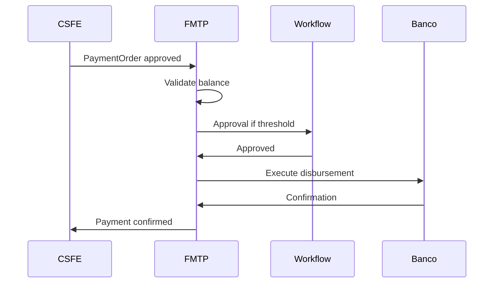

# Especificación Funcional — Financial Management & Treasury Platform

| Campo | Valor |
|-------|-------|
| **Código módulo** | FMTP |
| **Nombre comercial** | Finanzas y Tesorería |
| **Nombre arquitectónico** | Financial Management & Treasury Platform |
| **Módulo relacionado dominio café** | CSFE — Coffee Settlement & Financial Engine (liquidación productor) |
| **Versión documento** | 1.0 |
| **Estado** | Aprobado para implementación |
| **Product Owner** | AGROERP Product |
| **Release objetivo** | R3 — Settlement & Logistics (núcleo tesorería) / evolución contable vía IEL |
| **Documentos referencia** | `COFFEE_SETTLEMENT_FINANCIAL_ENGINE.md`, `CPE_FUNCTIONAL_SPEC.md`, `EITE_FUNCTIONAL_SPEC.md`, `CAE_FUNCTIONAL_SPEC.md`, `QMCL_FUNCTIONAL_SPEC.md`, `MASTER_DATA_ENGINE.md`, `AGROERP_MASTER_SPECIFICATION.md` |

---

## 1. Objetivo del módulo

Administrar los **recursos económicos corporativos** de la empresa: caja general, cajas menores, bancos, cuentas, conciliaciones, flujo de caja, presupuestos, centros de costo, monedas y tasas de cambio, anticipos corporativos y fondos rotatorios.

FMTP es un módulo **financiero modular** que opera inicialmente con funciones de **tesorería operativa** y está preparado para evolucionar hacia **contabilidad completa** (asientos GL vía IEL) sin rediseño del núcleo. Se integra con compras, inventario, contratos, liquidaciones productor (CSFE), ventas y pagos.

**Regla de oro:** Ningún movimiento de saldo en caja o banco se modifica directamente. Todo cambio es consecuencia de un **TreasuryMovement** auditable con documento origen, centro de costo y trazabilidad completa.

**Distinción crítica:**

| Módulo | Responsabilidad |
|--------|-----------------|
| **FMTP** | Tesorería corporativa: cajas, bancos, flujo caja, presupuestos, conciliación |
| **CSFE** | Economía empresa ↔ productor: liquidación, cuenta corriente, pagos productor |
| **IEL** | Integración ERP contable externo (PUC, asientos legales) |
| **CPE** | Liquidación preliminar en campo (no pago) |

---

## 2. Alcance

| # | Funcionalidad incluida |
|---|------------------------|
| A-01 | Caja general y cajas menores: apertura, cierre, arqueo, ingresos, egresos, ajustes, reintegros |
| A-02 | Bancos: entidades, cuentas, saldos, movimientos, transferencias, depósitos, consignaciones |
| A-03 | Pagos electrónicos y órdenes de desembolso (ejecución tesorería) |
| A-04 | Conciliación bancaria configurable |
| A-05 | Flujo de caja real y proyectado |
| A-06 | Presupuestos: anual, proyecto, finca, lote — ejecución y alertas sobrecosto |
| A-07 | Centros de costo y asignación movimientos |
| A-08 | Multimoneda: monedas, tasas de cambio (TRM), conversión |
| A-09 | Anticipos corporativos y fondos rotatorios |
| A-10 | Transferencias entre cajas y entre cuentas bancarias |
| A-11 | Workflow: apertura/cierre caja, anticipos, pagos, transferencias, conciliación |
| A-12 | Integración CPE, EITE, CAE, CSFE, PRM, ventas, EDMKP, IA, Workflow, Auditoría |
| A-13 | Reportes y KPIs financieros/tesorería |
| A-14 | Android: consulta saldos, movimientos autorizados, aprobaciones offline |
| A-15 | Multiempresa, multipaís, multimoneda, millones de transacciones |
| A-16 | Hooks contables preparados para GL (sin implementar PUC completo en F1) |

---

## 3. Exclusiones

| # | Exclusión | Módulo responsable |
|---|-----------|-------------------|
| E-01 | Liquidación definitiva y cuenta corriente productor | CSFE |
| E-02 | Liquidación preliminar compra campo | CPE |
| E-03 | Contabilidad general / PUC / estados financieros legales | ERP externo vía IEL |
| E-04 | Nómina empleados | Futuro / HR |
| E-05 | Facturación venta a clientes | Futuro módulo ventas |
| E-06 | Inventario físico y costo stock | EITE |
| E-07 | Dictamen calidad | QMCL |
| E-08 | Diseño UI financiera | Fuera de spec |
| E-09 | Declaración fiscal empresarial | ERP externo |

---

## 4. Actores

### 4.1 Tesorero / CFO

| Campo | Valor |
|-------|-------|
| **Rol** | `treasurer` |
| **Responsabilidades** | Políticas tesorería, aprobación pagos altos, conciliación |
| **Permisos** | `treasury:*`, `treasury:approve` |

### 4.2 Cajero

| Campo | Valor |
|-------|-------|
| **Rol** | `cashier` |
| **Responsabilidades** | Apertura/cierre caja, ingresos/egresos, arqueo |
| **Permisos** | `treasury:cash:operate`, `treasury:cash:close` |

### 4.3 Analista financiero

| Campo | Valor |
|-------|-------|
| **Rol** | `finance_analyst` |
| **Responsabilidades** | Presupuestos, reportes, flujo de caja |
| **Permisos** | `treasury:budget:manage`, `treasury:report` |

### 4.4 Contador

| Campo | Valor |
|-------|-------|
| **Rol** | `accountant` |
| **Responsabilidades** | Conciliación, revisión movimientos, export IEL |
| **Permisos** | `treasury:reconcile`, `treasury:read`, `treasury:export` |

### 4.5 Aprobador de pagos

| Campo | Valor |
|-------|-------|
| **Rol** | `payment_approver` |
| **Responsabilidades** | Aprobar órdenes según nivel |
| **Permisos** | `treasury:payment:approve` |

### 4.6 Responsable caja menor

| Campo | Valor |
|-------|-------|
| **Rol** | `petty_cash_holder` |
| **Responsabilidades** | Fondo rotatorio, reintegros |
| **Permisos** | `treasury:petty:operate` |

### 4.7 Administrador financiero

| Campo | Valor |
|-------|-------|
| **Rol** | `finance_admin` |
| **Responsabilidades** | Configuración bancos, límites, motivos, políticas |
| **Permisos** | `treasury:admin` |

### 4.8 Auditor

| Campo | Valor |
|-------|-------|
| **Rol** | `auditor` |
| **Responsabilidades** | Trazabilidad movimientos, arqueos, conciliaciones |
| **Permisos** | `treasury:read`, `audit:read` |

---

## 5. Roles involucrados (sistema)

| Rol slug | Uso FMTP |
|----------|----------|
| `treasurer` | Tesorería corporativa |
| `cashier` | Operación caja |
| `finance_analyst` | Presupuesto y análisis |
| `accountant` | Conciliación |
| `payment_approver` | Aprobaciones |
| `petty_cash_holder` | Caja menor |
| `finance_admin` | Configuración |
| `auditor` | Auditoría |

---

## 6. Historias de Usuario

### US-FMTP-001 — Apertura y cierre de caja

| Campo | Contenido |
|-------|-----------|
| **Como** | cajero |
| **Quiero** | abrir y cerrar caja con arqueo |
| **Para** | control diario efectivo |
| **Prioridad** | Crítica |

**Criterios:** CashSession apertura/cierre; diff arqueo → workflow si excede tolerancia.

---

### US-FMTP-002 — Ejecutar pago productor desde CSFE

| Campo | Contenido |
|-------|-----------|
| **Como** | tesorero |
| **Quiero** | desembolsar liquidación CSFE desde cuenta bancaria |
| **Para** | completar ciclo pago |
| **Prioridad** | Crítica |

**Criterios:** PaymentOrder CSFE → TreasuryDisbursement FMTP; movimiento banco/caja.

---

### US-FMTP-003 — Conciliación bancaria

| Campo | Contenido |
|-------|-----------|
| **Como** | contador |
| **Quiero** | conciliar extracto banco vs movimientos sistema |
| **Para** | detectar diferencias |
| **Prioridad** | Crítica |

**Criterios:** BankReconciliation; partidas conciliadas/no conciliadas.

---

### US-FMTP-004 — Presupuesto anual por centro de costo

| Campo | Contenido |
|-------|-----------|
| **Como** | analista financiero |
| **Quiero** | definir presupuesto y ver ejecución |
| **Prioridad** | Alta |

**Criterios:** Budget + BudgetExecution; alerta sobrecosto.

---

### US-FMTP-005 — Presupuesto por finca/lote

| Campo | Contenido |
|-------|-----------|
| **Como** | gerente agrícola |
| **Quiero** | presupuesto operativo por finca FMDT |
| **Prioridad** | Alta |

**Criterios:** farmUnitId / fieldLotId en líneas presupuesto.

---

### US-FMTP-006 — Flujo de caja proyectado

| Campo | Contenido |
|-------|-----------|
| **Como** | CFO |
| **Quiero** | proyección 30/60/90 días |
| **Prioridad** | Alta |

**Criterios:** FMTP-RPT-01; IA opcional.

---

### US-FMTP-007 — Anticipo corporativo con aprobación

| Campo | Contenido |
|-------|-----------|
| **Como** | empleado/comprador |
| **Quiero** | solicitar anticipo con workflow |
| **Prioridad** | Alta |

**Criterios:** CorporateAdvance; política límites; reintegro obligatorio.

---

### US-FMTP-008 — Caja menor / fondo rotatorio

| Campo | Contenido |
|-------|-----------|
| **Como** | responsable caja menor |
| **Quiero** | egresos menores y reintegro a caja general |
| **Prioridad** | Alta |

**Criterios:** PettyCashFund; tope fondo; comprobantes EDMKP.

---

### US-FMTP-009 — Transferencia entre bancos

| Campo | Contenido |
|-------|-----------|
| **Como** | tesorero |
| **Quiero** | transferir entre cuentas propias |
| **Prioridad** | Crítica |

**Criterios:** Par movimientos; estado in_transit si aplica.

---

### US-FMTP-010 — Multimoneda y TRM

| Campo | Contenido |
|-------|-----------|
| **Como** | sistema |
| **Quiero** | registrar movimiento en moneda extranjera con TRM |
| **Prioridad** | Alta |

**Criterios:** ExchangeRate del día; amountBaseCurrency calculado.

---

### US-FMTP-011 — Aprobación pagos por niveles

| Campo | Contenido |
|-------|-----------|
| **Como** | aprobador |
| **Quiero** | aprobar según monto y centro costo |
| **Prioridad** | Crítica |

**Criterios:** ApprovalPolicy por umbral; workflow.

---

### US-FMTP-012 — Consulta saldos Android offline

| Campo | Contenido |
|-------|-----------|
| **Como** | tesorero en campo |
| **Quiero** | ver saldo caja autorizada |
| **Prioridad** | Media |

**Criterios:** Cache sync; solo cajas asignadas.

---

### US-FMTP-013 — IA proyección necesidades efectivo

| Campo | Contenido |
|-------|-----------|
| **Como** | CFO |
| **Quiero** | predicción desembolsos CSFE + operativos |
| **Prioridad** | Media |

**Criterios:** Alerta liquidez; no ejecuta pagos automáticos.

---

### US-FMTP-014 — Integración costo inventario EITE

| Campo | Contenido |
|-------|-----------|
| **Como** | sistema |
| **Quiero** | reflejar pagos compra en centro costo |
| **Prioridad** | Alta |

**Criterios:** referenceType purchase/settlement; costCenterId.

---

### US-FMTP-015 — Export asientos preparatorios IEL

| Campo | Contenido |
|-------|-----------|
| **Como** | contador |
| **Quiero** | export movimientos confirmados a ERP contable |
| **Prioridad** | Media |

**Criterios:** GLPostingPreview; sin duplicar en re-export.

---

## 7. Casos de Uso

| ID | Caso de uso | Actor | Resultado |
|----|-------------|-------|-----------|
| CU-FMTP-01 | Abrir sesión caja | Cajero | CashSession open |
| CU-FMTP-02 | Registrar ingreso caja | Cajero | TreasuryMovement in |
| CU-FMTP-03 | Registrar egreso caja | Cajero | TreasuryMovement out |
| CU-FMTP-04 | Cerrar caja con arqueo | Cajero | CashSession closed |
| CU-FMTP-05 | Crear cuenta bancaria | Admin | BankAccount |
| CU-FMTP-06 | Registrar movimiento banco | Tesorero | BankMovement |
| CU-FMTP-07 | Transferencia inter-bancaria | Tesorero | Transfer pair |
| CU-FMTP-08 | Ejecutar desembolso CSFE | Tesorero | Disbursement |
| CU-FMTP-09 | Conciliar banco | Contador | Reconciliation |
| CU-FMTP-10 | Crear presupuesto | Analista | Budget |
| CU-FMTP-11 | Registrar ejecución presupuestal | Sistema | BudgetMovement |
| CU-FMTP-12 | Solicitar anticipo corporativo | Usuario | CorporateAdvance |
| CU-FMTP-13 | Aprobar pago workflow | Aprobador | Approved |
| CU-FMTP-14 | Reintegro caja menor | Responsable | PettyCashReplenishment |
| CU-FMTP-15 | Consultar flujo de caja | CFO | Reporte |

---

## 8. Reglas de Negocio

### 8.1 Principios inviolables

| ID | Regla |
|----|-------|
| RN-FMTP-001 | Saldo caja/banco = f(TreasuryMovement); prohibido UPDATE directo |
| RN-FMTP-002 | Movimiento `confirmed` es inmutable; corrección vía `reversal` |
| RN-FMTP-003 | Caja cerrada no admite movimientos salvo reapertura workflow |
| RN-FMTP-004 | Pago CSFE solo contra liquidación aprobada (handoff CSFE) |
| RN-FMTP-005 | Toda transacción registra usuario, fecha, hora, documento origen |
| RN-FMTP-006 | Multimoneda: TRM obligatoria para moneda ≠ base org |

### 8.2 Caja

| ID | Regla |
|----|-------|
| RN-FMTP-010 | Una CashSession abierta por caja y cajero (configurable) |
| RN-FMTP-011 | Egreso no puede exceder saldo disponible caja |
| RN-FMTP-012 | Arqueo diff > tolerancia → workflow ajuste |
| RN-FMTP-013 | Límite máximo caja parametrizable por CashRegister |
| RN-FMTP-014 | Transferencia caja→caja genera par movimientos vinculados |
| RN-FMTP-015 | Reintegro caja menor requiere comprobantes según política |

### 8.3 Bancos

| ID | Regla |
|----|-------|
| RN-FMTP-020 | Movimiento banco requiere BankAccount activa |
| RN-FMTP-021 | Transferencia = débito origen + crédito destino (o in_transit) |
| RN-FMTP-022 | Pago electrónico requiere referencia bancaria única |
| RN-FMTP-023 | Conciliación: solo movimientos `confirmed` conciliables |
| RN-FMTP-024 | Saldo banco proyectado ≠ contable GL hasta export IEL |

### 8.4 Presupuestos

| ID | Regla |
|----|-------|
| RN-FMTP-030 | Ejecución acumula contra BudgetLine del período |
| RN-FMTP-031 | Sobrecosto > umbral → alerta OCC |
| RN-FMTP-032 | Presupuesto `approved` no editable; solo versión nueva |
| RN-FMTP-033 | Movimiento puede exigir centro costo según política |
| RN-FMTP-034 | Presupuesto finca/lote requiere farmUnitId/fieldLotId válidos |

### 8.5 Aprobaciones y anticipos

| ID | Regla |
|----|-------|
| RN-FMTP-040 | Monto > umbral nivel N → workflow aprobador nivel N+1 |
| RN-FMTP-041 | Anticipo corporativo: tope por usuario/período |
| RN-FMTP-042 | Anticipo vencido sin reintegro → bloqueo nuevas solicitudes |
| RN-FMTP-043 | Motivos ingreso/egreso/ajuste desde catálogo parametrizable |

### 8.6 Integración CSFE / CPE / EITE

| ID | Regla |
|----|-------|
| RN-FMTP-050 | Desembolso CSFE genera TreasuryMovement + confirma Payment CSFE |
| RN-FMTP-051 | No duplicar pago: idempotencia paymentOrderId |
| RN-FMTP-052 | Costo compra EITE puede alimentar ejecución presupuesto compras |
| RN-FMTP-053 | Retenciones CSFE registradas como movimiento separado si política |

---

## 9. Flujo principal — Desembolso pago productor (CSFE → FMTP)

| Paso | Fase | Acción | Resultado |
|------|------|--------|-----------|
| 1 | CSFE | Liquidación aprobada + PaymentOrder | Orden pendiente pago |
| 2 | FMTP | Validar saldo banco/caja disponible | OK o rechazo |
| 3 | FMTP | Workflow aprobación si monto > umbral | Aprobado |
| 4 | FMTP | Crear TreasuryDisbursement | Movimiento pending |
| 5 | FMTP | Ejecutar pago (transferencia/efectivo) | bankReference |
| 6 | FMTP | Confirmar TreasuryMovement | Saldo actualizado |
| 7 | FMTP | Callback CSFE Payment confirmed | Ciclo cerrado |
| 8 | FMTP | Actualizar ejecución presupuesto | BudgetExecution |
| 9 | FMTP | Evento + auditoría | `TreasuryDisbursementConfirmed` |
| 10 | IEL | Export asiento preparatorio (opcional) | GLPostingPreview |

---

## 10. Flujos alternativos

### FA-FMTP-01 — Apertura y cierre caja diaria

| Paso | Acción |
|------|--------|
| FA1.1 | Abrir CashSession con saldo inicial |
| FA1.2 | Ingresos/egresos del día |
| FA1.3 | Arqueo físico vs sistema |
| FA1.4 | Cerrar o workflow si diff |

### FA-FMTP-02 — Conciliación bancaria mensual

| Paso | Acción |
|------|--------|
| FA2.1 | Importar extracto banco |
| FA2.2 | Match automático referencias |
| FA2.3 | Conciliar manual partidas restantes |
| FA2.4 | Cerrar período conciliación |

### FA-FMTP-03 — Anticipo corporativo

| Paso | Acción |
|------|--------|
| FA3.1 | Solicitud CorporateAdvance |
| FA3.2 | Workflow aprobación |
| FA3.3 | Egreso caja menor o banco |
| FA3.4 | Reintegro con comprobantes |

### FA-FMTP-04 — Transferencia entre cajas

| Paso | Acción |
|------|--------|
| FA4.1 | Crear CashTransfer |
| FA4.2 | Egreso caja origen |
| FA4.3 | Ingreso caja destino |
| FA4.4 | Custodia doble firma si política |

### FA-FMTP-05 — Reversión movimiento

| Paso | Acción |
|------|--------|
| FA5.1 | Supervisor solicita reversal |
| FA5.2 | Workflow treasury.reversal |
| FA5.3 | Movimiento inverso + notifica CSFE si aplica |

---

## 11. Casos de error

| ID | Condición | Mensaje | Comportamiento |
|----|-----------|---------|----------------|
| CE-FMTP-01 | Saldo insuficiente | "Fondos insuficientes" | Bloquea egreso |
| CE-FMTP-02 | Caja cerrada | "Caja no abierta" | Bloquea movimiento |
| CE-FMTP-03 | Sin aprobación | "Pago pendiente aprobación" | Bloquea ejecución |
| CE-FMTP-04 | PaymentOrder ya pagado | Idempotente | Retorna existente |
| CE-FMTP-05 | TRM no disponible | "Tasa cambio no registrada" | Bloquea multimoneda |
| CE-FMTP-06 | Centro costo obligatorio | "Centro de costo requerido" | Bloquea guardar |
| CE-FMTP-07 | Presupuesto excedido | Alerta/workflow | Según política |
| CE-FMTP-08 | Cuenta banco inactiva | "Cuenta no habilitada" | Bloquea |
| CE-FMTP-09 | Arqueo diff crítico | "Diferencia arqueo" | Workflow |
| CE-FMTP-10 | Conciliación cerrada | "Período conciliado" | Solo lectura |

---

## 12. Validaciones

### 12.1 Movimiento financiero (TreasuryMovement)

| Campo | Obligatorio | Validación |
|-------|-------------|------------|
| occurredAt / occurredTime | Sí | Fecha económica |
| performedByUserId | Sí | Usuario |
| companyEntityId | Sí | Empresa legal |
| costCenterId | Según política | Catálogo |
| conceptCode | Sí | `finance.treasury_concept` |
| incomeExpenseReasonCode | Sí | Motivo ingreso/egreso |
| amount | Sí | > 0 |
| currencyCode | Sí | |
| exchangeRate | Si moneda ≠ base | TRM del día |
| amountBaseCurrency | Calculado | |
| referenceType / referenceId | Recomendado | purchase, settlement, payment_order |
| relatedDocumentNumber | No | |
| sourceAccountType | Sí | cash, bank |
| sourceAccountId | Sí | CashRegister o BankAccount |
| status | Sí | pending, confirmed, reversed |
| description | No | |

### 12.2 Caja (CashRegister / CashSession)

| Campo | Obligatorio |
|-------|-------------|
| cashRegisterCode | Sí |
| name | Sí |
| registerType | general, petty |
| companyEntityId | Sí |
| custodianUserId | Sí |
| maxBalanceLimit | Recomendado |
| currencyCode | Sí |
| status | active, inactive |

### 12.3 Cuenta bancaria (BankAccount)

| Campo | Obligatorio |
|-------|-------------|
| bankEntityId | Sí |
| accountNumber | Sí |
| accountType | checking, savings |
| companyEntityId | Sí |
| currencyCode | Sí |
| status | active, inactive, frozen |

### 12.4 Presupuesto (Budget)

| Campo | Obligatorio |
|-------|-------------|
| budgetCode | Sí |
| budgetType | annual, project, farm, lot |
| fiscalYear | Sí |
| companyEntityId | Sí |
| farmUnitId / fieldLotId / projectId | Según tipo |
| lines | Array { costCenterId, accountCode, amount } |
| status | draft, approved, closed |

---

## 13. Workflow configurable

| workflowKey | Disparador |
|-------------|------------|
| `treasury.cash.open` | Apertura caja fuera horario |
| `treasury.cash.close` | Cierre con diff arqueo |
| `treasury.cash.adjustment` | Ajuste caja |
| `treasury.advance.request` | Solicitud anticipo corporativo |
| `treasury.payment.approval` | Pago > umbral |
| `treasury.transfer.approval` | Transferencia inter-banco alta |
| `treasury.reconciliation.approval` | Cierre conciliación con diff |
| `treasury.reversal` | Anulación movimiento |
| `treasury.petty.replenish` | Reintegro caja menor |
| `treasury.budget.override` | Sobrepaso presupuesto |

---

## 14. Dependencias

| Módulo | Relación |
|--------|----------|
| **CSFE** | PaymentOrder, desembolsos productor |
| **CPE** | Referencia compra (indirecto vía CSFE) |
| **EITE** | Costos inventario, presupuesto compras |
| **CAE** | Compromisos contractuales vs ejecución |
| **QMCL** | Retenciones/ajustes calidad vía CSFE |
| **PRM** | Datos bancarios productor (CSFE titular) |
| **EDMKP** | Comprobantes, extractos, recibos |
| **IEL** | Export asientos ERP contable |
| **Workflow** | Aprobaciones |
| **OCC** | Alertas liquidez, presupuesto |
| **AIADP** | Proyecciones, anomalías |
| **MDE** | Catálogos finance.* |

---

## 15. Permisos

| Permiso | Roles |
|---------|-------|
| `treasury:cash:read` | Operativos autorizados |
| `treasury:cash:operate` | cashier, petty_cash_holder |
| `treasury:cash:close` | cashier |
| `treasury:bank:read` | Tesorería, contador |
| `treasury:bank:operate` | treasurer |
| `treasury:payment:create` | treasurer, cashier |
| `treasury:payment:approve` | payment_approver, treasurer |
| `treasury:payment:execute` | treasurer |
| `treasury:reconcile` | accountant |
| `treasury:budget:read` | Analistas |
| `treasury:budget:manage` | finance_analyst |
| `treasury:advance:request` | Usuarios autorizados |
| `treasury:advance:approve` | payment_approver |
| `treasury:transfer:create` | treasurer |
| `treasury:report` | analyst, CFO |
| `treasury:export` | accountant |
| `treasury:admin` | finance_admin |
| `treasury:audit` | auditor |

---

## 16. Auditoría

| Evento | Datos |
|--------|-------|
| Apertura/cierre caja | Arqueo, diff, usuario |
| Movimiento confirmado | Monto, origen, destino, concepto |
| Aprobación/rechazo pago | Aprobador, monto |
| Conciliación | Partidas, diff |
| Reversión | Movimiento original + motivo |
| Cambio política límites | Diff configuración |
| Export IEL | Lote, usuario, timestamp |

Retención: mínimo 7 años (GECL); movimientos financieros **inmutables** post-confirmación.

---

## 17. Eventos generados

| Evento | Cuándo |
|--------|--------|
| `CashSessionOpened` / `CashSessionClosed` | Caja |
| `CashCountRecorded` | Arqueo |
| `TreasuryMovementRecorded` | Movimiento pending |
| `TreasuryMovementConfirmed` | Confirmado |
| `TreasuryMovementReversed` | Reverso |
| `BankTransferInitiated` / `BankTransferCompleted` | Transferencia |
| `TreasuryDisbursementConfirmed` | Pago CSFE ejecutado |
| `BankReconciliationStarted` / `BankReconciliationClosed` | Conciliación |
| `BudgetApproved` | Presupuesto |
| `BudgetThresholdExceeded` | Sobrecosto |
| `CorporateAdvanceApproved` / `CorporateAdvanceSettled` | Anticipo |
| `PettyCashReplenished` | Reintegro |
| `ExchangeRateUpdated` | TRM |
| `LiquidityAlertGenerated` | Umbral liquidez |
| `TreasuryAnomalyDetected` | IA |
| `GLPostingPreviewGenerated` | Export IEL |

---

## 18. Automatizaciones

| ID | Disparador | Acción |
|----|------------|--------|
| AUT-FMTP-01 | PaymentOrder CSFE approved | Crear cola desembolso |
| AUT-FMTP-02 | TreasuryMovement confirmed | Actualizar BudgetExecution |
| AUT-FMTP-03 | Saldo caja < umbral | Alerta OCC |
| AUT-FMTP-04 | Saldo banco < mínimo | Alerta liquidez |
| AUT-FMTP-05 | Ejecución > presupuesto % | Alerta sobrecosto |
| AUT-FMTP-06 | Anticipo vencido | Notificación + bloqueo |
| AUT-FMTP-07 | Match extracto banco | Pre-conciliación automática |
| AUT-FMTP-08 | IA anomalía movimiento | Flag revisión |
| AUT-FMTP-09 | Cierre caja sin movimientos | Recordatorio |
| AUT-FMTP-10 | TRM diaria faltante | Alerta admin |

---

## 19. Integración IA

| Función | Entrada | Salida |
|---------|---------|--------|
| Proyección flujo de caja | Histórico, CSFE pendientes, presupuesto | Serie 30/60/90d |
| Predicción necesidades efectivo | Calendario pagos, estacionalidad | Monto requerido |
| Detección anomalías | Patrones movimiento, usuario, hora | Risk score |
| Alertas sobrecosto | BudgetExecution vs plan | Alerta OCC |
| Optimización financiera | Saldos múltiples cuentas | Sugerencia transferencia |
| Conciliación inteligente | Extracto vs movimientos | Match sugerido |

**Principio:** IA no ejecuta pagos sin aprobación humana.

---

## 20–27. Integraciones detalladas

### 20. CSFE (liquidación y pagos productor)

| Función | Descripción |
|---------|-------------|
| Recibir PaymentOrder | Cola desembolso |
| Ejecutar pago | TreasuryDisbursement |
| Confirmar Payment | Callback CSFE |
| Retenciones | Movimientos separados si política |
| Idempotencia | paymentOrderId único |

### 21. Compras (CPE) e Inventario (EITE)

| Función | Descripción |
|---------|-------------|
| Referencia purchaseId | Trazabilidad costo |
| Valor inventario | Alimenta reportes costo |
| Presupuesto compras | Ejecución por centro costo |

### 22. Contratos (CAE)

| Función | Descripción |
|---------|-------------|
| Compromiso financiero | vs ejecución presupuesto campaña |
| Calendario desembolsos | Proyección flujo caja |

### 23. Productores y proveedores (PRM / futuro AP)

| Función | Descripción |
|---------|-------------|
| Pagos productor | Vía CSFE → FMTP |
| Proveedores | Futuro cuentas por pagar |

### 24. Ventas y clientes (futuro)

| Función | Descripción |
|---------|-------------|
| Cobros | Ingresos banco/caja |
| Cuentas por cobrar | Handoff IEL |

### 25. Documentos (EDMKP)

| Tipo | Uso |
|------|-----|
| Comprobante egreso/ingreso | PDF |
| Extracto bancario importado | Conciliación |
| Soporte anticipo | Reintegro |
| Recibo arqueo | Cierre caja |

### 26. Auditoría y Workflow

- Audit Engine: diff todos los movimientos
- Workflow: todos los treasury.* keys
- OCC: dashboard liquidez y presupuesto

### 27. IEL (contabilidad externa)

| Función | Descripción |
|---------|-------------|
| GLPostingPreview | Asiento preparatorio por movimiento |
| Chart of accounts mapping | Configuración futura |
| Export batch | Sin duplicar re-export |
| Evolución F2+ | Contabilidad nativa opcional |

---

## 28. Modelo de datos funcional

### 28.1 CashRegister

| Campo | Tipo | Descripción |
|-------|------|-------------|
| cashRegisterId | UUID | PK |
| organizationId | UUID | Tenant |
| companyEntityId | Ref | Empresa |
| cashRegisterCode | Texto | Único org |
| name | Texto | |
| registerType | Enum | general, petty |
| custodianUserId | Ref | Responsable |
| currencyCode | Catálogo | |
| maxBalanceLimit | Money | Límite caja |
| currentBalance | Money | Proyección — no editable |
| locationDescription | Texto | |
| status | Enum | active, inactive |
| costCenterId | Ref | Default |

### 28.2 CashSession

| Campo | Descripción |
|-------|-------------|
| sessionId | UUID |
| cashRegisterId | FK |
| openedByUserId | Ref |
| openedAt | Timestamp |
| openingBalance | Money |
| closedByUserId | Ref |
| closedAt | Timestamp |
| expectedBalance | Calculado |
| countedBalance | Arqueo físico |
| varianceAmount | Diff |
| status | open, closed, pending_approval |
| notes | |

### 28.3 BankEntity / BankAccount

| Campo BankEntity | Descripción |
|------------------|-------------|
| bankEntityId | UUID |
| bankCode | Código país |
| name | Nombre banco |
| swiftCode | Opcional |

| Campo BankAccount | Descripción |
|-------------------|-------------|
| bankAccountId | UUID |
| bankEntityId | FK |
| companyEntityId | Ref |
| accountNumber | |
| accountType | checking, savings |
| currencyCode | |
| currentBalance | Proyección |
| status | active, inactive, frozen |
| costCenterId | Default |

### 28.4 TreasuryMovement (agregado raíz saldo)

| Campo | Descripción |
|-------|-------------|
| movementId | UUID |
| externalId | Offline idempotencia |
| movementNumber | Consecutivo |
| organizationId | UUID |
| movementType | cash_in, cash_out, bank_in, bank_out, transfer, adjustment, disbursement |
| direction | in, out |
| amount | Siempre positivo |
| currencyCode | |
| exchangeRate | |
| amountBaseCurrency | |
| balanceBefore / balanceAfter | Kardex tesorería |
| sourceType | cash, bank |
| sourceAccountId | cashRegisterId o bankAccountId |
| destinationType / destinationAccountId | Si transferencia |
| companyEntityId | |
| costCenterId | |
| conceptCode | |
| incomeExpenseReasonCode | Motivo |
| referenceType / referenceId | settlement, payment_order, purchase… |
| relatedDocumentNumber | |
| paymentOrderId | Ref CSFE |
| performedByUserId | |
| occurredAt / postedAt | Fecha + hora |
| status | pending, confirmed, reversed, rejected |
| workflowInstanceId | |
| reversalOfMovementId | |
| glPostingStatus | not_exported, exported, n/a |
| description | |
| correlationId | |

### 28.5 TreasuryDisbursement

| Campo | Descripción |
|-------|-------------|
| disbursementId | UUID |
| paymentOrderId | CSFE |
| settlementId | CSFE |
| producerId | Ref PRM |
| treasuryMovementId | FK |
| paymentMethodCode | transfer, cash, check |
| bankReference | |
| executedAt | |
| status | pending, executed, confirmed, failed |

### 28.6 BankReconciliation

| Campo | Descripción |
|-------|-------------|
| reconciliationId | UUID |
| bankAccountId | FK |
| periodFrom / periodTo | |
| statementOpeningBalance | |
| statementClosingBalance | |
| systemBalance | |
| varianceAmount | |
| status | in_progress, closed |
| lines | { movementId, statementLineId, matched, variance } |
| closedByUserId | |

### 28.7 Budget / BudgetLine / BudgetExecution

| Campo Budget | Descripción |
|--------------|-------------|
| budgetId | UUID |
| budgetCode | |
| budgetType | annual, project, farm, lot |
| fiscalYear | |
| farmUnitId / fieldLotId / projectId | Opcional |
| status | draft, approved, closed |
| version | |

| Campo BudgetLine | Descripción |
|------------------|-------------|
| lineId | UUID |
| costCenterId | |
| accountCode | Preparado GL |
| plannedAmount | |
| currencyCode | |

| Campo BudgetExecution | Descripción |
|-----------------------|-------------|
| executionId | UUID |
| budgetLineId | FK |
| treasuryMovementId | FK |
| executedAmount | |
| executedAt | |
| cumulativePct | Calculado |

### 28.8 CostCenter

| Campo | Descripción |
|-------|-------------|
| costCenterId | UUID |
| costCenterCode | Único org |
| name | |
| parentCostCenterId | Jerarquía |
| companyEntityId | |
| farmUnitId | Opcional |
| status | active, inactive |

### 28.9 CorporateAdvance / PettyCashFund

| Campo CorporateAdvance | Descripción |
|------------------------|-------------|
| advanceId | UUID |
| requestedByUserId | |
| approvedAmount | |
| disbursedMovementId | |
| settlementStatus | pending, partial, settled |
| dueDate | |

| Campo PettyCashFund | Descripción |
|---------------------|-------------|
| fundId | UUID |
| cashRegisterId | FK petty |
| fundLimit | |
| holderUserId | |

### 28.10 ExchangeRate

| Campo | Descripción |
|-------|-------------|
| rateId | UUID |
| fromCurrency / toCurrency | |
| rate | |
| effectiveDate | |
| sourceCode | manual, central_bank, api |
| organizationId | |

### 28.11 TreasuryPolicy

| Campo | Descripción |
|-------|-------------|
| policyId | UUID |
| organizationId | |
| approvalThresholds | JSON niveles monto |
| cashVarianceTolerance | |
| advanceLimits | JSON |
| reconciliationRules | JSON |
| requireCostCenter | Bool |
| budgetAlertThresholdPct | |

### 28.12 GLPostingPreview (preparación contable)

| Campo | Descripción |
|-------|-------------|
| previewId | UUID |
| treasuryMovementId | FK |
| debitAccountCode | |
| creditAccountCode | |
| amount | |
| exportBatchId | IEL |
| exportedAt | |

---

## 29. API funcional

**Base path:** `/api/v1/treasury`

| Método | Ruta | Permiso | Descripción |
|--------|------|---------|-------------|
| GET | `/cash-registers` | `treasury:cash:read` | Listar cajas |
| POST | `/cash-registers` | `treasury:admin` | Crear caja |
| POST | `/cash-registers/:id/sessions/open` | `treasury:cash:operate` | Abrir sesión |
| POST | `/cash-sessions/:id/close` | `treasury:cash:close` | Cerrar + arqueo |
| GET | `/cash-sessions/:id` | `treasury:cash:read` | Detalle sesión |
| GET | `/bank-accounts` | `treasury:bank:read` | Cuentas bancarias |
| POST | `/bank-accounts` | `treasury:admin` | Crear cuenta |
| GET | `/bank-accounts/:id/balance` | `treasury:bank:read` | Saldo |
| GET | `/movements` | `treasury:bank:read` | Movimientos |
| POST | `/movements` | `treasury:payment:create` | Crear movimiento |
| POST | `/movements/:id/confirm` | `treasury:payment:execute` | Confirmar |
| POST | `/movements/:id/reverse` | `treasury:admin` | Reversar |
| POST | `/transfers/cash` | `treasury:transfer:create` | Transferencia cajas |
| POST | `/transfers/bank` | `treasury:transfer:create` | Transferencia bancos |
| POST | `/disbursements` | `treasury:payment:execute` | Desembolso CSFE |
| POST | `/disbursements/:id/confirm` | `treasury:payment:execute` | Confirmar pago |
| GET | `/reconciliations` | `treasury:reconcile` | Listar |
| POST | `/reconciliations` | `treasury:reconcile` | Iniciar |
| POST | `/reconciliations/:id/match` | `treasury:reconcile` | Conciliar línea |
| POST | `/reconciliations/:id/close` | `treasury:reconcile` | Cerrar |
| POST | `/reconciliations/import-statement` | `treasury:reconcile` | Importar extracto |
| GET | `/budgets` | `treasury:budget:read` | Presupuestos |
| POST | `/budgets` | `treasury:budget:manage` | Crear |
| POST | `/budgets/:id/approve` | `treasury:budget:manage` | Aprobar |
| GET | `/budgets/:id/execution` | `treasury:budget:read` | Ejecución |
| GET | `/cost-centers` | `treasury:budget:read` | Centros costo |
| POST | `/advances` | `treasury:advance:request` | Anticipo corporativo |
| POST | `/advances/:id/approve` | `treasury:advance:approve` | Aprobar |
| POST | `/advances/:id/settle` | `treasury:advance:request` | Reintegro |
| GET | `/exchange-rates` | `treasury:bank:read` | TRM |
| POST | `/exchange-rates` | `treasury:admin` | Registrar TRM |
| GET | `/cash-flow` | `treasury:report` | Flujo caja |
| GET | `/cash-flow/projection` | `treasury:report` | Proyección |
| POST | `/field/sync` | `treasury:cash:operate` | Android batch |
| POST | `/internal/csfe/payment-order` | Sistema CSFE | Recibir orden pago |
| POST | `/internal/gl-export` | `treasury:export` | Export IEL |
| GET | `/reports/:reportCode` | `treasury:report` | FMTP-RPT-* |
| GET | `/kpis/:kpiCode` | `treasury:report` | KPIs |
| GET | `/policies` | `treasury:admin` | Políticas |
| PATCH | `/policies/:id` | `treasury:admin` | Actualizar |

---

## 30. Interfaz (especificación funcional — sin diseño gráfico)

| ID | Pantalla | Descripción |
|----|----------|-------------|
| UI-FMTP-01 | Dashboard tesorería | Liquidez, alertas, KPIs |
| UI-FMTP-02 | Cajas y sesiones | Apertura, cierre, arqueo |
| UI-FMTP-03 | Movimientos caja | Ingresos, egresos |
| UI-FMTP-04 | Cuentas bancarias | Saldos, movimientos |
| UI-FMTP-05 | Órdenes de pago | Cola CSFE + otros |
| UI-FMTP-06 | Ejecutar desembolso | Wizard pago |
| UI-FMTP-07 | Conciliación bancaria | Match extracto |
| UI-FMTP-08 | Flujo de caja | Real y proyectado |
| UI-FMTP-09 | Presupuestos | Crear, ejecutar, alertas |
| UI-FMTP-10 | Centros de costo | Jerarquía |
| UI-FMTP-11 | Anticipos corporativos | Solicitud, reintegro |
| UI-FMTP-12 | Caja menor | Fondo rotatorio |
| UI-FMTP-13 | Transferencias | Cajas y bancos |
| UI-FMTP-14 | TRM / multimoneda | Tasas del día |
| UI-FMTP-15 | Configuración políticas | Límites, motivos, aprobaciones |
| UI-FMTP-16 | Export contable IEL | Lotes asientos |

---

## 31. Android (especificación funcional)

| ID | Flujo | Offline |
|----|-------|---------|
| AND-FMTP-01 | Consultar saldo caja asignada | Cache sync |
| AND-FMTP-02 | Consultar saldo banco autorizado | Online preferido |
| AND-FMTP-03 | Registrar egreso caja autorizado | Outbox |
| AND-FMTP-04 | Registrar ingreso caja | Outbox |
| AND-FMTP-05 | Aprobar solicitud anticipo | Online |
| AND-FMTP-06 | Aprobar pago según permiso | Online |
| AND-FMTP-07 | Captura comprobante foto | Cola EDMKP |
| AND-FMTP-08 | Arqueo cierre caja | Sí — sync |
| AND-FMTP-09 | Consultar cola pagos pendientes | Cache |
| AND-FMTP-10 | Firma conformidad egreso | Sí |

### 31.1 Sync

| Conflicto | Resolución |
|-----------|------------|
| Saldo insuficiente al sync | Rechazo movimiento |
| Caja cerrada en servidor | Rechazo |
| Duplicado externalId | Idempotente |
| Sesión caja conflictiva | Supervisor |

---

## 32. Reportes

| ID | Reporte | Descripción |
|----|---------|-------------|
| FMTP-RPT-01 | Flujo de caja | Entradas/salidas período |
| FMTP-RPT-02 | Proyección tesorería | 30/60/90 días |
| FMTP-RPT-03 | Estado de bancos | Saldos por cuenta |
| FMTP-RPT-04 | Estado de cajas | Saldos y sesiones |
| FMTP-RPT-05 | Ejecución presupuestal | Plan vs real |
| FMTP-RPT-06 | Anticipos pendientes | Corporativos abiertos |
| FMTP-RPT-07 | Movimientos financieros | Detalle filtrable |
| FMTP-RPT-08 | Conciliaciones | Histórico y diff |
| FMTP-RPT-09 | Pagos productor período | CSFE desembolsos |
| FMTP-RPT-10 | Arqueos caja | Diff por sesión |
| FMTP-RPT-11 | Transferencias | Inter-caja/banco |
| FMTP-RPT-12 | Caja menor | Gastos y reintegros |
| FMTP-RPT-13 | Por centro de costo | Consolidado |
| FMTP-RPT-14 | Por finca/lote | Presupuesto agrícola |
| FMTP-RPT-15 | Multimoneda | Posición FX |
| FMTP-RPT-16 | Libro movimientos tesorería | Auditoría |
| FMTP-RPT-17 | Pagos pendientes aprobación | Cola workflow |
| FMTP-RPT-18 | Retenciones período | CSFE separado |
| FMTP-RPT-19 | Disponibilidad diaria | Snapshot |
| FMTP-RPT-20 | Export contable IEL | Lote asientos |

---

## 33. KPIs

| ID | KPI | Fórmula conceptual |
|----|-----|-------------------|
| KPI-FMTP-01 | Liquidez | (Caja + Bancos) / obligaciones 30d |
| KPI-FMTP-02 | Flujo de caja neto | Entradas − salidas período |
| KPI-FMTP-03 | Ejecución presupuestal % | ejecutado / planificado |
| KPI-FMTP-04 | Rotación de efectivo | Ventas / efectivo promedio |
| KPI-FMTP-05 | Disponibilidad bancaria | Σ saldos bancos |
| KPI-FMTP-06 | Tiempo aprobación pago | AVG approvedAt − createdAt |
| KPI-FMTP-07 | Desviación presupuestal | (real − plan) / plan |
| KPI-FMTP-08 | Días caja sin cerrar | COUNT sesiones abiertas > 1d |
| KPI-FMTP-09 | % conciliado banco | partidas matched / total |
| KPI-FMTP-10 | Anticipos vencidos | COUNT overdue |
| KPI-FMTP-11 | Pagos productor período | SUM disbursements |
| KPI-FMTP-12 | Varianza arqueo promedio | AVG abs(variance) |
| KPI-FMTP-13 | Costo financiero oportunidad | IA opcional |
| KPI-FMTP-14 | Cobertura presupuesto compras | vs CPE/CSFE |
| KPI-FMTP-15 | Posición multimoneda | Por moneda |
| KPI-FMTP-16 | Backlog pagos CSFE | COUNT pending |
| KPI-FMTP-17 | Tiempo conciliación | AVG close − start |
| KPI-FMTP-18 | Movimientos anómalos IA | COUNT flags |
| KPI-FMTP-19 | Reintegros caja menor pendientes | COUNT |
| KPI-FMTP-20 | Ratio efectivo vs banco | % en caja |

### 33.1 Alertas configurables

| ID | Alerta | Parámetro |
|----|--------|-----------|
| FMTP-ALT-01 | Saldo banco bajo mínimo | min.bank.balance |
| FMTP-ALT-02 | Caja supera límite | max.cash.balance |
| FMTP-ALT-03 | Presupuesto sobrecosto | budget.alert.threshold |
| FMTP-ALT-04 | Liquidez crítica | liquidity.ratio.min |
| FMTP-ALT-05 | Pago pendiente SLA | payment.sla.hours |
| FMTP-ALT-06 | Arqueo diff | cash.variance.tolerance |
| FMTP-ALT-07 | Anticipo vencido | — |
| FMTP-ALT-08 | Conciliación atrasada | reconcile.sla.days |
| FMTP-ALT-09 | Anomalía IA movimiento | fraud.score.threshold |
| FMTP-ALT-10 | TRM no actualizada | trm.stale.days |

---

## 34. Escalabilidad

### 34.1 Millones de transacciones

| Aspecto | Requisito |
|---------|-----------|
| TreasuryMovement | Particionado org + fecha |
| Balance projection | Materializada async |
| Listados | Paginación cursor; índices accountId, date |
| Conciliación | Match batch async |
| Reportes | DPAL async |
| Idempotencia | externalId, paymentOrderId únicos |

### 34.2 Multiempresa / multipaís / multimoneda

- Aislamiento `organizationId` + `companyEntityId`
- Moneda base por org; TRM por país
- Políticas aprobación por jurisdicción
- Bancos y catálogos por país (MDE)

### 34.3 Evolución contable sin rediseño

| Fase | Capacidad |
|------|-----------|
| F1 (R3) | Tesorería operativa + GLPostingPreview |
| F2 | Mapping PUC nativo opcional |
| F3 | Contabilidad completa integrada o IEL bidireccional |

Núcleo `TreasuryMovement` permanece; capa GL es extensión.

---

## 35. Pruebas

### 35.1 Funcionales

| ID | Escenario |
|----|-----------|
| TF-FMTP-01 | Apertura → movimientos → cierre caja happy path |
| TF-FMTP-02 | Egreso excede saldo — bloqueo |
| TF-FMTP-03 | Arqueo diff → workflow |
| TF-FMTP-04 | Desembolso CSFE completo |
| TF-FMTP-05 | Idempotencia paymentOrder duplicado |
| TF-FMTP-06 | Transferencia banco par movimientos |
| TF-FMTP-07 | Conciliación match automático |
| TF-FMTP-08 | Presupuesto sobrecosto alerta |
| TF-FMTP-09 | Anticipo corporativo ciclo completo |
| TF-FMTP-10 | Reintegro caja menor |
| TF-FMTP-11 | Multimoneda con TRM |
| TF-FMTP-12 | Reversal movimiento |
| TF-FMTP-13 | Aprobación pago por niveles |
| TF-FMTP-14 | Caja cerrada bloquea movimiento |
| TF-FMTP-15 | Export IEL sin duplicar |

### 35.2 Integración

| ID | Escenario |
|----|-----------|
| TI-FMTP-01 | CSFE PaymentOrder → disbursement → confirm |
| TI-FMTP-02 | BudgetExecution al confirmar movimiento |
| TI-FMTP-03 | EITE costo referencia presupuesto |
| TI-FMTP-04 | Android sync egreso caja |
| TI-FMTP-05 | OCC alerta liquidez |
| TI-FMTP-06 | Workflow aprobación pago |
| TI-FMTP-07 | IEL export batch |
| TI-FMTP-08 | CAE campaña vs ejecución |

### 35.3 Carga

| ID | Escenario | Criterio |
|----|-----------|----------|
| TC-FMTP-01 | 5M movimientos list | p95 < 500ms |
| TC-FMTP-02 | 200 desembolsos concurrentes | Sin saldo negativo |
| TC-FMTP-03 | Conciliación 50k líneas | < 5min |
| TC-FMTP-04 | Batch sync 100 movimientos Android | < 45s |

---

## 36. Definición de Done

- [ ] US-FMTP-001 a 012 críticas/altas aceptadas PO
- [ ] RN-FMTP-001 a 053 validadas
- [ ] API `/api/v1/treasury/*` Swagger
- [ ] Event-sourced TreasuryMovement — sin UPDATE saldo directo
- [ ] Caja apertura/cierre/arqueo operativo
- [ ] Integración CSFE desembolso (TI-FMTP-01)
- [ ] Conciliación bancaria básica
- [ ] Presupuesto + ejecución + alertas
- [ ] Workflows treasury.* configurables
- [ ] Android consulta + egreso autorizado offline
- [ ] Reportes FMTP-RPT-01 a 12
- [ ] KPIs KPI-FMTP-01 a 10 dashboard OCC
- [ ] GLPostingPreview export IEL
- [ ] Multimoneda TRM básica

---

## 37. Futuras Mejoras

| ID | Mejora | Release |
|----|--------|---------|
| FM-FMTP-01 | Contabilidad nativa PUC | F2 |
| FM-FMTP-02 | Cuentas por pagar proveedores | R4 |
| FM-FMTP-03 | Cuentas por cobrar clientes | R4 |
| FM-FMTP-04 | Open banking API bancos | R4 |
| FM-FMTP-05 | Tesorería centralizada multi-empresa | R5 |
| FM-FMTP-06 | Hedge cambiario | R5 |

---

## Control de cambios

| Versión | Fecha | Descripción |
|---------|-------|-------------|
| 1.0 | 2026-07-02 | Emisión inicial especificación funcional FMTP |

---

## Aprobaciones

| Rol | Nombre | Fecha |
|-----|--------|-------|
| Product Owner | AGROERP Product | 2026-07-02 |
| Arquitectura | AGROERP Architecture | Pendiente revisión |
| Desarrollo Lead | — | Pendiente |
| QA Lead | — | Pendiente |

---

*Fin del documento — FMTP v1.0*
