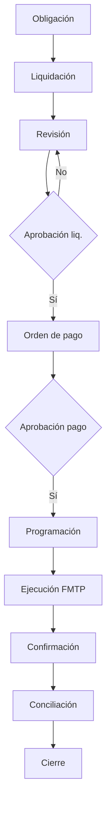

# Especificación Funcional — Payments & Settlement Management Platform

| Campo | Valor |
|-------|-------|
| **Código módulo** | PSMP |
| **Nombre comercial** | Pagos y Liquidaciones |
| **Nombre arquitectónico** | Payments & Settlement Management Platform |
| **Alias dominio café productor** | CSFE — Coffee Settlement & Financial Engine |
| **Versión documento** | 1.0 |
| **Estado** | Aprobado para implementación |
| **Product Owner** | AGROERP Product |
| **Release objetivo** | R3 — Settlement & Logistics |
| **Documentos referencia** | `COFFEE_SETTLEMENT_FINANCIAL_ENGINE.md`, `FMTP_FUNCTIONAL_SPEC.md`, `CPE_FUNCTIONAL_SPEC.md`, `QMCL_FUNCTIONAL_SPEC.md`, `CAE_FUNCTIONAL_SPEC.md`, `EITE_FUNCTIONAL_SPEC.md`, `PRM_FUNCTIONAL_SPEC.md`, `AGROERP_MASTER_SPECIFICATION.md` |

---

## 1. Objetivo del módulo

Administrar **todo el ciclo de pagos y liquidaciones** de la empresa — productores, proveedores, empleados y terceros — con trazabilidad, seguridad, auditoría y parametrización completa.

PSMP orquesta: **generación de obligación** → revisión → aprobación → programación → ejecución (handoff **FMTP**) → confirmación → conciliación → cierre. Soporta liquidaciones de compra de café, anticipos, abonos parciales, pagos múltiples, reembolsos, notas débito/crédito, compensaciones, retenciones, descuentos y bonificaciones.

**Regla de oro:** Ningún **pago** se ejecuta sin **liquidación u obligación aprobada** (salvo anticipo con política explícita). Ningún saldo de beneficiario se modifica directamente; solo vía **SettlementMovement** / **BeneficiaryLedgerEntry** auditable.

**Distinción crítica:**

| Módulo | Responsabilidad |
|--------|-----------------|
| **PSMP** | Liquidaciones, órdenes de pago, ciclo de vida pago, cartera beneficiarios |
| **FMTP** | Ejecución tesorería: caja, banco, TreasuryMovement |
| **CPE** | Liquidación preliminar campo (LPE) |
| **QMCL** | Dictamen calidad → ajustes liquidación |
| **CSFE** | Alias arquitectónico — liquidación/pago **productor café** |

---

## 2. Alcance

| # | Funcionalidad incluida |
|---|------------------------|
| A-01 | Liquidaciones compra café (definitiva post CPE/QMCL/EITE) |
| A-02 | Pagos a productores, proveedores, empleados, terceros |
| A-03 | Anticipos, abonos parciales, pagos múltiples, reembolsos |
| A-04 | Notas débito, notas crédito, compensaciones |
| A-05 | Retenciones, descuentos, bonificaciones parametrizables |
| A-06 | Formas de pago: efectivo, transferencia, cheque, electrónico; billetera digital (futuro) |
| A-07 | Ciclo de vida: obligación → revisión → aprobación → programación → ejecución → confirmación → conciliación → cierre |
| A-08 | Cuenta corriente productor (alias CSFE) y cartera proveedor |
| A-09 | Órdenes de pago, lotes de pago, programación |
| A-10 | Workflow configurable por monto, tipo beneficiario, forma pago |
| A-11 | Integración CPE, QMCL, CAE, EITE, FMTP, PRM, EDMKP, IA |
| A-12 | Reportes y KPIs de pagos y liquidaciones |
| A-13 | Android: consulta, aprobación, confirmación offline |
| A-14 | Multiempresa, multipaís, multimoneda, millones de pagos |

---

## 3. Exclusiones

| # | Exclusión | Módulo responsable |
|---|-----------|-------------------|
| E-01 | Liquidación preliminar compra campo | CPE |
| E-02 | Movimiento físico caja/banco | FMTP |
| E-03 | Conciliación extracto bancario | FMTP |
| E-04 | Contabilidad general / PUC | IEL / ERP externo |
| E-05 | Nómina cálculo | Futuro HR |
| E-06 | Facturación venta | Futuro ventas |
| E-07 | Dictamen calidad | QMCL |
| E-08 | Diseño UI | Fuera de spec |
| E-09 | Presupuesto corporativo | FMTP |

---

## 4. Actores

### 4.1 Analista de liquidaciones

| Campo | Valor |
|-------|-------|
| **Rol** | `settlement_analyst` |
| **Responsabilidades** | Calcular/revisar liquidaciones café y proveedores |
| **Permisos** | `payment:settlement:create`, `payment:settlement:read` |

### 4.2 Tesorero / CFO

| Campo | Valor |
|-------|-------|
| **Rol** | `treasurer` |
| **Responsabilidades** | Aprobar pagos altos, programación, políticas |
| **Permisos** | `payment:approve`, `payment:schedule` |

### 4.3 Cajero / Ejecutor de pagos

| Campo | Valor |
|-------|-------|
| **Rol** | `payment_executor` |
| **Responsabilidades** | Ejecutar pago, capturar referencia, recibo |
| **Permisos** | `payment:execute`, `payment:confirm` |

### 4.4 Comprador

| Campo | Valor |
|-------|-------|
| **Rol** | `buyer` |
| **Responsabilidades** | Consultar liquidaciones productor, solicitar anticipo |
| **Permisos** | `payment:settlement:read`, `payment:advance:request` |

### 4.5 Supervisor financiero

| Campo | Valor |
|-------|-------|
| **Rol** | `finance_supervisor` |
| **Responsabilidades** | Revisión, ajustes, anulaciones |
| **Permisos** | `payment:review`, `payment:void` |

### 4.6 Aprobador de pagos

| Campo | Valor |
|-------|-------|
| **Rol** | `payment_approver` |
| **Responsabilidades** | Aprobar según nivel |
| **Permisos** | `payment:approve` |

### 4.7 Administrador pagos

| Campo | Valor |
|-------|-------|
| **Rol** | `payment_admin` |
| **Responsabilidades** | Formas pago, umbrales, retenciones, reglas |
| **Permisos** | `payment:admin` |

### 4.8 Auditor

| Campo | Valor |
|-------|-------|
| **Rol** | `auditor` |
| **Responsabilidades** | Trazabilidad pago → liquidación → origen |
| **Permisos** | `payment:audit`, `payment:read` |

---

## 5. Roles involucrados (sistema)

| Rol slug | Uso PSMP |
|----------|----------|
| `settlement_analyst` | Liquidaciones |
| `payment_executor` | Ejecución |
| `payment_approver` | Aprobación |
| `finance_supervisor` | Supervisión |
| `payment_admin` | Configuración |
| `treasurer` | Programación |
| `auditor` | Auditoría |

---

## 6. Historias de Usuario

### US-PSMP-001 — Liquidación definitiva compra café

| Campo | Contenido |
|-------|-----------|
| **Como** | analista liquidaciones |
| **Quiero** | generar liquidación desde CPE + QMCL + EITE |
| **Para** | autorizar pago productor |
| **Prioridad** | Crítica |

**Criterios:** Settlement con formulaTrace; comparación LPE CPE; evento `SettlementApproved`.

---

### US-PSMP-002 — Orden de pago con aprobación

| Campo | Contenido |
|-------|-----------|
| **Como** | tesorero |
| **Quiero** | crear orden de pago desde liquidación aprobada |
| **Prioridad** | Crítica |

**Criterios:** PaymentOrder; workflow si monto > umbral.

---

### US-PSMP-003 — Ejecutar pago vía FMTP

| Campo | Contenido |
|-------|-----------|
| **Como** | sistema |
| **Quiero** | handoff FMTP al ejecutar pago |
| **Prioridad** | Crítica |

**Criterios:** TreasuryDisbursement; callback `PaymentConfirmed`.

---

### US-PSMP-004 — Pago parcial productor

| Campo | Contenido |
|-------|-----------|
| **Como** | tesorero |
| **Quiero** | abonar parcialmente liquidación |
| **Prioridad** | Alta |

**Criterios:** Settlement `parcialmente_pagada`; saldo pendiente.

---

### US-PSMP-005 — Anticipo productor

| Campo | Contenido |
|-------|-----------|
| **Como** | comprador |
| **Quiero** | solicitar anticipo contra contrato CAE |
| **Prioridad** | Crítica |

**Criterios:** Advance; workflow; descuento automático en liquidaciones FIFO.

---

### US-PSMP-006 — Retenciones y bonificaciones

| Campo | Contenido |
|-------|-----------|
| **Como** | sistema |
| **Quiero** | aplicar retenciones/descuentos/bonos parametrizados |
| **Prioridad** | Crítica |

**Criterios:** SettlementLine por concepto; certificado retención PDF.

---

### US-PSMP-007 — Nota crédito / débito

| Campo | Contenido |
|-------|-----------|
| **Como** | supervisor |
| **Quiero** | emitir nota que ajuste cartera beneficiario |
| **Prioridad** | Alta |

**Criterios:** FinancialNote; ledger entry; workflow.

---

### US-PSMP-008 — Compensación saldos

| Campo | Contenido |
|-------|-----------|
| **Como** | analista |
| **Quiero** | compensar obligación vs crédito beneficiario |
| **Prioridad** | Media |

**Criterios:** CompensationRecord; sin doble pago.

---

### US-PSMP-009 — Lote pago masivo productores

| Campo | Contenido |
|-------|-----------|
| **Como** | tesorero |
| **Quiero** | agrupar órdenes en PaymentBatch |
| **Prioridad** | Alta |

**Criterios:** Archivo banco futuro; fallos parciales manejados.

---

### US-PSMP-010 — Reversión pago

| Campo | Contenido |
|-------|-----------|
| **Como** | supervisor |
| **Quiero** | reversar pago con motivo |
| **Prioridad** | Alta |

**Criterios:** Workflow; FMTP reversal; Settlement estado actualizado.

---

### US-PSMP-011 — Estado cuenta productor

| Campo | Contenido |
|-------|-----------|
| **Como** | productor / comprador |
| **Quiero** | ver extracto movimientos |
| **Prioridad** | Alta |

**Criterios:** AccountStatement; PRM 360°.

---

### US-PSMP-012 — Aprobar pago Android

| Campo | Contenido |
|-------|-----------|
| **Como** | aprobador |
| **Quiero** | aprobar orden desde móvil |
| **Prioridad** | Media |

**Criterios:** Workflow móvil; auditoría.

---

### US-PSMP-013 — IA predicción flujo pagos

| Campo | Contenido |
|-------|-----------|
| **Como** | CFO |
| **Quiero** | proyección obligaciones 30/60 días |
| **Prioridad** | Media |

**Criterios:** PSMP-RPT flujo; alertas vencimiento.

---

### US-PSMP-014 — Pago proveedor

| Campo | Contenido |
|-------|-----------|
| **Como** | analista AP |
| **Quiero** | liquidar factura proveedor y pagar |
| **Prioridad** | Alta |

**Criterios:** beneficiaryType=supplier; misma máquina estados.

---

### US-PSMP-015 — Reembolso beneficiario

| Campo | Contenido |
|-------|-----------|
| **Como** | supervisor |
| **Quiero** | reembolsar pago erróneo o exceso |
| **Prioridad** | Alta |

**Criterios:** Refund; vinculado Payment original.

---

## 7. Casos de Uso

| ID | Caso de uso | Actor | Resultado |
|----|-------------|-------|-----------|
| CU-PSMP-01 | Generar obligación pago | Sistema/Analista | PaymentObligation |
| CU-PSMP-02 | Calcular liquidación café | Analista | Settlement |
| CU-PSMP-03 | Revisar liquidación | Supervisor | Revisada |
| CU-PSMP-04 | Aprobar liquidación | Aprobador | SettlementApproved |
| CU-PSMP-05 | Crear orden de pago | Tesorero | PaymentOrder |
| CU-PSMP-06 | Aprobar orden pago | Aprobador | Approved |
| CU-PSMP-07 | Programar pago | Tesorero | scheduledDate |
| CU-PSMP-08 | Ejecutar pago | Ejecutor | Payment executed |
| CU-PSMP-09 | Confirmar pago | Sistema/FMTP | PaymentConfirmed |
| CU-PSMP-10 | Conciliar pago | Contador | Reconciled |
| CU-PSMP-11 | Cerrar ciclo | Sistema | Closed |
| CU-PSMP-12 | Solicitar anticipo | Comprador | Advance |
| CU-PSMP-13 | Emitir nota débito/crédito | Supervisor | FinancialNote |
| CU-PSMP-14 | Compensar saldos | Analista | Compensation |
| CU-PSMP-15 | Anular/reversar | Supervisor | Voided/Reversed |

---

## 8. Reglas de Negocio

### 8.1 Principios inviolables

| ID | Regla |
|----|-------|
| RN-PSMP-001 | Pago solo contra liquidación/obligación aprobada (salvo anticipo policy) |
| RN-PSMP-002 | Saldo beneficiario = f(ledger entries); sin UPDATE directo |
| RN-PSMP-003 | Movimiento ledger confirmado es inmutable; reverso vía `reversal` |
| RN-PSMP-004 | Pago idempotente: `externalId` + referencia única |
| RN-PSMP-005 | Toda transacción: usuario, fecha, hora, documento origen |
| RN-PSMP-006 | Ejecución física dinero solo vía FMTP |

### 8.2 Liquidación café (alias CSFE)

| ID | Regla |
|----|-------|
| RN-PSMP-010 | Liquidación definitiva requiere CPE confirmada + peso EITE + dictamen QMCL |
| RN-PSMP-011 | Precio base de CAE PEM; ajustes QMCL en castigos/bonos |
| RN-PSMP-012 | Discrepancia LPE vs definitiva > umbral → `observed` + workflow |
| RN-PSMP-013 | Anticipos descontados FIFO en liquidación |
| RN-PSMP-014 | formulaTrace obligatorio en Settlement |

### 8.3 Pagos

| ID | Regla |
|----|-------|
| RN-PSMP-020 | Pago no excede `amountPayable` liquidación vinculada |
| RN-PSMP-021 | Cuenta bancaria beneficiario verificada (PRM) para transferencia |
| RN-PSMP-022 | Forma de pago según catálogo parametrizado y política org |
| RN-PSMP-023 | Pago parcial: Σ pagos ≤ netAmount liquidación |
| RN-PSMP-024 | Reprogramación requiere estado `programada` o `aprobada` |
| RN-PSMP-025 | Cheque requiere checkNumber único por banco emisor |

### 8.4 Aprobaciones y límites

| ID | Regla |
|----|-------|
| RN-PSMP-030 | Monto > umbral nivel N → aprobador nivel N+1 |
| RN-PSMP-031 | Límite diario por usuario ejecutor parametrizable |
| RN-PSMP-032 | Anticipo no excede % contrato CAE sin excepción |
| RN-PSMP-033 | Motivos anulación/reversión desde catálogo obligatorio |

### 8.5 Retenciones y fiscales

| ID | Regla |
|----|-------|
| RN-PSMP-040 | Retenciones según `finance.withholding_rule` por país |
| RN-PSMP-041 | Certificado retención generado al confirmar pago |
| RN-PSMP-042 | Nota crédito reduce obligación; nota débito incrementa |

### 8.6 Integración FMTP

| ID | Regla |
|----|-------|
| RN-PSMP-050 | PaymentOrder `en_ejecucion` crea TreasuryDisbursement FMTP |
| RN-PSMP-051 | `PaymentConfirmed` solo tras callback FMTP |
| RN-PSMP-052 | Fallo FMTP → Payment `fallido`; reintento o anulación |
| RN-PSMP-053 | Reversión PSMP dispara reversal FMTP |

---

## 9. Flujo principal — Ciclo de vida del pago

| Paso | Fase | Acción | Resultado |
|------|------|--------|-----------|
| 1 | Obligación | Disparador CPE/QMCL/factura → PaymentObligation | Obligación registrada |
| 2 | Liquidación | Calcular Settlement (líneas, retenciones, neto) | `SettlementCalculated` |
| 3 | Revisión | Analista/supervisor revisa | `pendiente_aprobacion` |
| 4 | Aprobación | Workflow liquidación | `SettlementApproved` |
| 5 | Orden pago | Crear PaymentOrder | `PaymentOrderCreated` |
| 6 | Aprobación pago | Workflow si umbral | `PaymentOrderApproved` |
| 7 | Programación | scheduledDate, prioridad | `programada` |
| 8 | Ejecución | Handoff FMTP TreasuryDisbursement | `en_ejecucion` |
| 9 | Confirmación | Callback FMTP acreditación | `PaymentConfirmed` |
| 10 | Conciliación | Match referencia bancaria (FMTP) | `conciliada` |
| 11 | Cierre | Ledger actualizado, documentos PDF | `cerrada` |

---

## 10. Flujos alternativos

### FA-PSMP-01 — Anticipo productor

| Paso | Acción |
|------|--------|
| FA1.1 | Advance requested |
| FA1.2 | Workflow aprobación |
| FA1.3 | PaymentOrder + ejecución FMTP |
| FA1.4 | Ledger débito productor; pendingOffset |
| FA1.5 | Descuento en próximas liquidaciones |

### FA-PSMP-02 — Pago parcial

| Paso | Acción |
|------|--------|
| FA2.1 | Payment < amountPayable |
| FA2.2 | Settlement `parcialmente_pagada` |
| FA2.3 | Saldo pendiente en cuenta |

### FA-PSMP-03 — Pago masivo (batch)

| Paso | Acción |
|------|--------|
| FA3.1 | PaymentBatch agrupa órdenes |
| FA3.2 | Aprobación lote |
| FA3.3 | Ejecución FMTP múltiple |
| FA3.4 | Manejo fallos parciales |

### FA-PSMP-04 — Reversión / anulación

| Paso | Acción |
|------|--------|
| FA4.1 | Workflow payment.reversal |
| FA4.2 | FMTP reversal |
| FA4.3 | Ledger reverso; Settlement estado actualizado |

### FA-PSMP-05 — Compensación sin desembolso

| Paso | Acción |
|------|--------|
| FA5.1 | Crédito y débito mismo beneficiario |
| FA5.2 | CompensationRecord |
| FA5.3 | Cierra obligación parcial/total sin FMTP |

---

## 11. Casos de error

| ID | Condición | Mensaje | Comportamiento |
|----|-----------|---------|----------------|
| CE-PSMP-01 | Liquidación no aprobada | "Liquidación pendiente aprobación" | Bloquea pago |
| CE-PSMP-02 | Monto excede payable | "Monto supera saldo liquidación" | Bloquea |
| CE-PSMP-03 | Cuenta banco no verificada | "Cuenta beneficiario no habilitada" | Bloquea transferencia |
| CE-PSMP-04 | Sin dictamen QMCL | "Calidad pendiente" | Bloquea liquidación café |
| CE-PSMP-05 | FMTP saldo insuficiente | "Fondos tesorería insuficientes" | Falla ejecución |
| CE-PSMP-06 | Pago duplicado | Idempotente | Retorna existente |
| CE-PSMP-07 | Anticipo excede cupo | "Anticipo supera política" | Workflow/bloqueo |
| CE-PSMP-08 | Beneficiario suspendido | "Beneficiario no habilitado" | Bloquea |
| CE-PSMP-09 | Reversión sin motivo | "Motivo obligatorio" | Bloquea |
| CE-PSMP-10 | Límite usuario excedido | "Límite diario excedido" | Bloquea |

---

## 12. Validaciones

### 12.1 Pago (Payment)

| Campo | Obligatorio | Validación |
|-------|-------------|------------|
| paymentCode | Sí | Único org |
| paymentNumber | Sí | Consecutivo |
| companyEntityId | Sí | |
| beneficiaryId | Sí | PRM/proveedor/empleado |
| beneficiaryType | Sí | producer, supplier, employee, third_party |
| sourceDocumentType / sourceDocumentId | Sí | settlement, advance, invoice |
| paymentDate / paymentTime | Sí | |
| grossAmount | Sí | > 0 |
| discountAmount | No | ≥ 0 |
| withholdingAmount | No | ≥ 0 |
| netAmount | Sí | Calculado |
| currencyCode | Sí | |
| paymentMethodCode | Sí | `finance.payment_method` |
| status | Sí | §28.9 |
| responsibleUserId | Sí | |
| paymentOrderId | Sí | |
| bankReference / checkNumber | Según método | |

### 12.2 Liquidación (Settlement)

| Campo | Obligatorio |
|-------|-------------|
| settlementNumber | Sí |
| beneficiaryId / beneficiaryType | Sí |
| purchaseId | Si café | CPE |
| agreementId | Si contrato | CAE |
| dictamenId | Si café | QMCL |
| inventoryLotId | Recomendado | EITE |
| quantity / uomCode | Si café |
| grossAmount, netAmount, amountPayable | Sí |
| lines | Array SettlementLine |
| formulaTrace | Sí |
| status | Sí |

### 12.3 Formas de pago soportadas

| Código | Descripción | Campos adicionales |
|--------|-------------|-------------------|
| `cash` | Efectivo | recibo, firma |
| `bank_transfer` | Transferencia | bankReference, cuenta |
| `check` | Cheque | checkNumber, bank |
| `electronic` | Pago electrónico | providerRef |
| `deposit` | Consignación | reference |
| `mixed` | Mixto | paymentComponents[] |
| `digital_wallet` | Billetera (futuro) | walletTxId |

---

## 13. Workflow configurable

| workflowKey | Disparador |
|-------------|------------|
| `payment.obligation.review` | Revisión obligación |
| `payment.settlement.approval` | Aprobación liquidación |
| `payment.settlement.observed` | Discrepancia LPE/definitiva |
| `payment.order.approval` | Orden pago > umbral |
| `payment.order.rejection` | Rechazo |
| `payment.reschedule` | Reprogramación |
| `payment.execution` | Ejecución manual |
| `payment.reversal` | Reverso |
| `payment.void` | Anulación |
| `payment.advance.approval` | Anticipo |
| `payment.batch.approval` | Lote masivo |
| `payment.compensation.approval` | Compensación |
| `payment.note.approval` | Nota débito/crédito |

---

## 14–27. Dependencias, permisos, eventos, integraciones

### 14. Dependencias

| Módulo | Relación |
|--------|----------|
| **CPE** | Compra, LPE referencia |
| **QMCL** | Dictamen, ajustes calidad |
| **CAE** | Precio, primas, cupo anticipo |
| **EITE** | Peso oficial, costo |
| **FMTP** | Ejecución tesorería |
| **PRM** | Productor, cuenta banco |
| **EDMKP** | PDF liquidación, recibo, certificados |
| **Workflow** | Aprobaciones |
| **IEL** | Export fiscal/contable |
| **AIADP** | Proyecciones, fraude |

### 15. Permisos

| Permiso | Roles |
|---------|-------|
| `payment:settlement:create` | settlement_analyst |
| `payment:settlement:read` | Operativos |
| `payment:settlement:approve` | finance_supervisor |
| `payment:order:create` | treasurer |
| `payment:order:approve` | payment_approver |
| `payment:execute` | payment_executor |
| `payment:confirm` | payment_executor |
| `payment:schedule` | treasurer |
| `payment:advance:request` | buyer |
| `payment:advance:approve` | payment_approver |
| `payment:void` | finance_supervisor |
| `payment:reverse` | finance_supervisor |
| `payment:batch:manage` | treasurer |
| `payment:report` | analyst, auditor |
| `payment:admin` | payment_admin |
| `payment:audit` | auditor |

### 16. Auditoría

Registro completo: liquidación diff, aprobaciones, ejecución, confirmación, reversión, consultas extracto. Retención 7+ años.

### 17. Eventos

`PaymentObligationCreated`, `SettlementCalculated`, `SettlementApproved`, `SettlementPaid`, `PaymentOrderCreated`, `PaymentOrderApproved`, `PaymentScheduled`, `PaymentExecuted`, `PaymentConfirmed`, `PaymentFailed`, `PaymentReversed`, `PaymentVoided`, `AdvanceRequested`, `AdvanceDelivered`, `AdvanceOffsetApplied`, `FinancialNotePosted`, `CompensationApplied`, `RefundIssued`, `PaymentBatchCompleted`, `BeneficiaryAccountSuspended`, `PaymentReconciled`.

### 18. Automatizaciones

| ID | Disparador | Acción |
|----|------------|--------|
| AUT-PSMP-01 | DictamenEmitted QMCL | Iniciar liquidación café |
| AUT-PSMP-02 | SettlementApproved | Crear PaymentOrder borrador |
| AUT-PSMP-03 | PaymentOrderApproved | Cola ejecución FMTP |
| AUT-PSMP-04 | PaymentConfirmed | PDF recibo EDMKP |
| AUT-PSMP-05 | PaymentConfirmed | Actualizar PRM lastPayment |
| AUT-PSMP-06 | Vencimiento programado | Alerta OCC |
| AUT-PSMP-07 | Anticipo en liquidación | Auto offset FIFO |
| AUT-PSMP-08 | IA anomalía | Flag revisión |
| AUT-PSMP-09 | Retención aplicada | Certificado fiscal |
| AUT-PSMP-10 | Fallo FMTP | Notificación tesorero |

### 19. Integración IA

Predicción flujo pagos, anomalías, riesgo beneficiario, programación óptima, alertas vencimiento. Sin ejecución automática sin humano.

### 20. CPE / QMCL / CAE / EITE

Liquidación café: CPE purchaseId, QMCL dictamen, CAE precio/primas, EITE peso oficial.

### 21. FMTP

TreasuryDisbursement, confirmación, reversión, conciliación referencia.

### 22. PRM / Proveedores

ProducerAccount, bank verified, extracto 360°. SupplierAccount futuro.

### 23. Documentos EDMKP

Liquidación PDF, recibo pago, certificado retención, estado cuenta, QR verificación.

---

## 28. Modelo de datos funcional

### 28.1 PaymentObligation

| Campo | Descripción |
|-------|-------------|
| obligationId | UUID |
| obligationNumber | Consecutivo |
| sourceType / sourceId | purchase, invoice, contract |
| beneficiaryId / beneficiaryType | |
| grossAmount / currencyCode | |
| dueDate | |
| status | open, settled, cancelled |

### 28.2 Settlement

| Campo | Descripción |
|-------|-------------|
| settlementId | UUID |
| settlementNumber | |
| obligationId | FK opcional |
| settlementType | coffee_purchase, supplier_invoice, consolidated |
| purchaseId, agreementId, dictamenId, inventoryLotId | Café |
| grossAmount, totalBonuses, totalPenalties, totalDiscounts | |
| totalWithholdings, netAmount, advanceOffset, amountPayable | |
| formulaTrace | JSON |
| status | §28.8 |
| approvedBy / approvedAt | |

### 28.3 SettlementLine

| Campo | Descripción |
|-------|-------------|
| lineId | UUID |
| lineType | base_price, bonus, penalty, discount, withholding, tax, offset |
| conceptCode | |
| amount | |
| ruleId | SettlementRule |

### 28.4 PaymentOrder

| Campo | Descripción |
|-------|-------------|
| paymentOrderId | UUID |
| orderNumber | |
| settlementId / advanceId | Origen |
| beneficiaryId / beneficiaryType | |
| amount / currencyCode | |
| paymentMethodCode | |
| scheduledDate | |
| status | §28.9 |
| workflowInstanceId | |

### 28.5 Payment

| Campo | Descripción |
|-------|-------------|
| paymentId | UUID |
| paymentCode / paymentNumber | |
| paymentOrderId | FK |
| grossAmount, discountAmount, withholdingAmount, netAmount | |
| paymentMethodCode | |
| bankReference, checkNumber | |
| executedAt, confirmedAt | |
| status | pending, executed, confirmed, failed, reversed |
| treasuryDisbursementId | FMTP |
| receiptDocumentId | EDMKP |

### 28.6 Advance

| Campo | Descripción |
|-------|-------------|
| advanceId | UUID |
| beneficiaryId | producer typical |
| requestedAmount, approvedAmount, deliveredAmount | |
| pendingOffset | |
| agreementId | CAE |
| status | solicitado → compensado_total |

### 28.7 FinancialNote

| Campo | Descripción |
|-------|-------------|
| noteId | UUID |
| noteType | credit, debit |
| beneficiaryId | |
| amount, reasonCode | |
| referenceSettlementId | |

### 28.8 CompensationRecord / Refund

Compensación entre movimientos; Refund vinculado a Payment original.

### 28.9 BeneficiaryLedgerEntry

| Campo | Descripción |
|-------|-------------|
| entryId | UUID |
| beneficiaryAccountId | |
| direction | credit, debit |
| amount, balanceAfter | |
| referenceType / referenceId | |

### 28.10 PaymentBatch

| Campo | Descripción |
|-------|-------------|
| batchId | UUID |
| paymentOrderIds | Array |
| totalAmount | |
| status | draft, approved, processing, completed, partial_failure |

### 28.11 Estados PaymentOrder

`borrador` → `pendiente_aprobacion` → `aprobada` → `programada` → `en_ejecucion` → `ejecutada` → `confirmada` | `fallida` | `anulada` | `reversada`

### 28.12 Estados Settlement

`borrador` → `calculada` → `pendiente_aprobacion` → `aprobada` → `parcialmente_pagada` → `pagada` | `anulada` | `observada`

### 28.13 PaymentPolicy

Umbrales aprobación, formas pago, retenciones, límites anticipo, motivos anulación.

---

## 29. API funcional

**Base path:** `/api/v1/payments` (alias café `/api/v1/csfe` compatible liquidación productor)

| Método | Ruta | Permiso | Descripción |
|--------|------|---------|-------------|
| GET | `/obligations` | `payment:settlement:read` | Obligaciones |
| POST | `/obligations` | `payment:settlement:create` | Crear |
| GET | `/settlements` | `payment:settlement:read` | Liquidaciones |
| POST | `/settlements` | `payment:settlement:create` | Crear/calcular |
| GET | `/settlements/:id` | `payment:settlement:read` | Detalle + líneas |
| POST | `/settlements/:id/calculate` | `payment:settlement:create` | Recalcular |
| POST | `/settlements/:id/submit` | `payment:settlement:create` | Enviar aprobación |
| POST | `/settlements/:id/approve` | `payment:settlement:approve` | Aprobar |
| POST | `/settlements/:id/void` | `payment:void` | Anular |
| GET | `/payment-orders` | `payment:settlement:read` | Órdenes |
| POST | `/payment-orders` | `payment:order:create` | Crear |
| POST | `/payment-orders/:id/approve` | `payment:order:approve` | Aprobar |
| POST | `/payment-orders/:id/schedule` | `payment:schedule` | Programar |
| POST | `/payment-orders/:id/execute` | `payment:execute` | Ejecutar → FMTP |
| POST | `/payment-orders/:id/reject` | `payment:order:approve` | Rechazar |
| GET | `/payments` | `payment:settlement:read` | Pagos ejecutados |
| GET | `/payments/:id` | `payment:settlement:read` | Detalle |
| POST | `/payments/:id/confirm` | `payment:confirm` | Confirmar manual |
| POST | `/payments/:id/reverse` | `payment:reverse` | Reversar |
| POST | `/advances` | `payment:advance:request` | Solicitar anticipo |
| POST | `/advances/:id/approve` | `payment:advance:approve` | Aprobar |
| POST | `/notes` | `payment:settlement:create` | Nota débito/crédito |
| POST | `/compensations` | `payment:settlement:create` | Compensar |
| POST | `/refunds` | `payment:void` | Reembolso |
| POST | `/batches` | `payment:batch:manage` | Lote masivo |
| POST | `/batches/:id/approve` | `payment:batch:manage` | Aprobar lote |
| GET | `/accounts/:beneficiaryId/statement` | `payment:settlement:read` | Extracto |
| GET | `/accounts/:beneficiaryId/balance` | `payment:settlement:read` | Saldo |
| POST | `/field/sync` | `payment:order:approve` | Android |
| POST | `/internal/cpe/trigger-settlement` | Sistema | Desde compra |
| POST | `/internal/fmtp/callback` | Sistema FMTP | Confirmación |
| GET | `/reports/:reportCode` | `payment:report` | PSMP-RPT-* |
| GET | `/kpis/:kpiCode` | `payment:report` | KPIs |
| GET | `/policies` | `payment:admin` | Políticas |

---

## 30. Interfaz (especificación funcional — sin diseño gráfico)

| ID | Pantalla | Descripción |
|----|----------|-------------|
| UI-PSMP-01 | Dashboard pagos | KPIs, pendientes, vencidos, alertas |
| UI-PSMP-02 | Cola liquidaciones | Filtros café/proveedor, estado |
| UI-PSMP-03 | Detalle liquidación | Líneas, formulaTrace, comparación LPE |
| UI-PSMP-04 | Wizard liquidación café | CPE + QMCL + EITE contexto |
| UI-PSMP-05 | Órdenes de pago | Cola aprobación y programación |
| UI-PSMP-06 | Ejecutar pago | Método, referencia, recibo |
| UI-PSMP-07 | Anticipos productor | Solicitud, aprobación, saldo offset |
| UI-PSMP-08 | Lotes pago masivo | PaymentBatch gestión |
| UI-PSMP-09 | Extracto beneficiario | Ledger, saldo, documentos |
| UI-PSMP-10 | Notas débito/crédito | Emisión y vinculación |
| UI-PSMP-11 | Compensaciones | Cruce saldos |
| UI-PSMP-12 | Calendario programación | Pagos por fecha |
| UI-PSMP-13 | Configuración políticas | Umbrales, formas pago, retenciones |
| UI-PSMP-14 | Conciliación pagos | Match referencia FMTP |
| UI-PSMP-15 | Simulador liquidación | Preview antes de calcular |

---

## 31. Android (especificación funcional)

| ID | Flujo | Offline |
|----|-------|---------|
| AND-PSMP-01 | Consultar liquidaciones autorizadas | Cache sync |
| AND-PSMP-02 | Consultar órdenes pago pendientes | Cache |
| AND-PSMP-03 | Aprobar orden de pago | Online preferido |
| AND-PSMP-04 | Confirmar pago efectivo + firma productor | Sí — sync |
| AND-PSMP-05 | Solicitar anticipo borrador | Outbox |
| AND-PSMP-06 | Consultar saldo/extracto productor | Cache |
| AND-PSMP-07 | Consultar liquidación por compra | Cache purchaseId |
| AND-PSMP-08 | Recibir notificación pago confirmado | Push |
| AND-PSMP-09 | Captura foto recibo pago | Cola EDMKP |
| AND-PSMP-10 | Rechazar orden con motivo | Online |

### 31.1 Sync Android

| Conflicto | Resolución |
|-----------|------------|
| Orden ya ejecutada | Idempotente |
| Aprobación sin permiso | Rechazo |
| Firma offline duplicada | externalId |

---

## 32. Reportes

| ID | Reporte |
|----|---------|
| PSMP-RPT-01 | Pagos por período |
| PSMP-RPT-02 | Pagos por productor |
| PSMP-RPT-03 | Pagos por proveedor |
| PSMP-RPT-04 | Pagos pendientes |
| PSMP-RPT-05 | Pagos ejecutados |
| PSMP-RPT-06 | Anticipos abiertos |
| PSMP-RPT-07 | Reembolsos |
| PSMP-RPT-08 | Conciliación pagos |
| PSMP-RPT-09 | Flujo de pagos |
| PSMP-RPT-10 | Liquidaciones período |
| PSMP-RPT-11 | Retenciones |
| PSMP-RPT-12 | Notas débito/crédito |
| PSMP-RPT-13 | Lotes pago masivo |
| PSMP-RPT-14 | Vencidos programación |
| PSMP-RPT-15 | Por forma de pago |
| PSMP-RPT-16 | Discrepancia LPE vs definitiva |
| PSMP-RPT-17 | Estado cuenta productor |
| PSMP-RPT-18 | Compensaciones |
| PSMP-RPT-19 | Por empresa legal |
| PSMP-RPT-20 | Auditoría trazabilidad pago |

---

## 33. KPIs

| ID | KPI |
|----|-----|
| KPI-PSMP-01 | Tiempo promedio de pago (obligación → confirmado) |
| KPI-PSMP-02 | Pagos pendientes COUNT |
| KPI-PSMP-03 | Pagos vencidos (scheduled < hoy) |
| KPI-PSMP-04 | Cumplimiento pagos % (a tiempo) |
| KPI-PSMP-05 | Anticipos abiertos SUM pendingOffset |
| KPI-PSMP-06 | Eficiencia proceso (aprobaciones / día) |
| KPI-PSMP-07 | Tiempo aprobación liquidación |
| KPI-PSMP-08 | Tiempo aprobación orden |
| KPI-PSMP-09 | Tasa fallos ejecución |
| KPI-PSMP-10 | Tasa reversión |
| KPI-PSMP-11 | Monto pagado productores período |
| KPI-PSMP-12 | Monto retenido período |
| KPI-PSMP-13 | % pagos parciales |
| KPI-PSMP-14 | Backlog liquidaciones |
| KPI-PSMP-15 | Días promedio anticipo abierto |
| KPI-PSMP-16 | IA riesgo beneficiario alto |
| KPI-PSMP-17 | Throughput batch |
| KPI-PSMP-18 | Costo medio transacción |
| KPI-PSMP-19 | Proyección 30d obligaciones |
| KPI-PSMP-20 | SLA programación cumplido % |

Alertas PSMP-ALT-01 a 10: vencimiento, pendiente SLA, anticipo vencido, fallo pago, anomalía IA, límite aprobación, etc.

---

## 34. Escalabilidad

Particionado org + fecha; idempotencia paymentOrderId/externalId; PaymentBatch async; reportes DPAL; multimoneda TRM (FMTP/GECL); multiempresa companyEntityId.

---

## 35. Pruebas

TF-PSMP-01 happy path liquidación→pago; TF-PSMP-02 parcial; TF-PSMP-03 anticipo offset; TF-PSMP-04 reversión; TF-PSMP-05 batch parcial fail; TI-PSMP-01 CPE→Settlement; TI-PSMP-02 QMCL ajuste; TI-PSMP-03 FMTP callback; TI-PSMP-04 CAE precio; TC-PSMP-01 5M pagos list p95<500ms.

---

## 36. Definición de Done

US-PSMP-001–012; RN-PSMP-001–053; API `/api/v1/payments/*`; ciclo vida completo; FMTP integración; liquidación café; anticipos; workflows; reportes RPT-01–12; KPIs 01–10; Android 01–05; auditoría completa.

---

## 37. Futuras Mejoras

FM-PSMP-01 Billetera digital; FM-PSMP-02 Open banking dispersión; FM-PSMP-03 Nómina empleados; FM-PSMP-04 AP proveedores OCR factura; FM-PSMP-05 Blockchain comprobante.

---

## Control de cambios

| Versión | Fecha | Descripción |
|---------|-------|-------------|
| 1.0 | 2026-07-02 | Emisión inicial PSMP |

---

## Aprobaciones

| Rol | Nombre | Fecha |
|-----|--------|-------|
| Product Owner | AGROERP Product | 2026-07-02 |
| Arquitectura | Pendiente revisión | |
| Desarrollo Lead | Pendiente | |
| QA Lead | Pendiente | |

---

*Fin del documento — PSMP v1.0*
