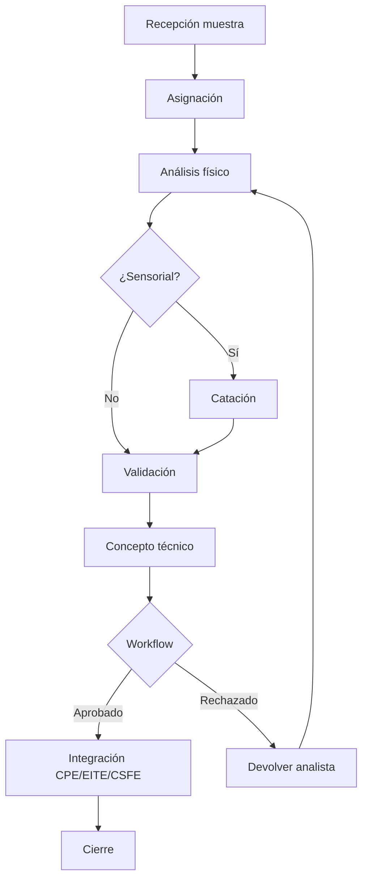

# Especificación Funcional — Quality Management & Coffee Laboratory Platform

| Campo | Valor |
|-------|-------|
| **Código módulo** | QMCL |
| **Nombre comercial** | Laboratorio de Calidad del Café |
| **Nombre arquitectónico** | Quality Management & Coffee Laboratory Platform |
| **Alias dominio café** | CQIE — Coffee Quality Intelligence Engine |
| **Versión documento** | 1.0 |
| **Estado** | Aprobado para implementación |
| **Product Owner** | AGROERP Product |
| **Release objetivo** | R2 — Commercial Chain |
| **Documentos referencia** | `COFFEE_QUALITY_INTELLIGENCE_ENGINE.md`, `COFFEE_DOMAIN.md`, `CPE_FUNCTIONAL_SPEC.md`, `EITE_FUNCTIONAL_SPEC.md`, `CAE_FUNCTIONAL_SPEC.md`, `PRM_FUNCTIONAL_SPEC.md`, `AGROERP_MASTER_SPECIFICATION.md` |

---

## 1. Objetivo del módulo

Administrar **todos los procesos de calidad del café** desde la recepción de la muestra hasta la emisión del **concepto técnico (dictamen)** y su integración con compras, inventario, liquidación y trazabilidad, funcionando como un **LIMS especializado en café** con soporte SCA/CQI y protocolos internos configurables.

QMCL (alias arquitectónico **CQIE**) es el **sistema nervioso de calidad** de AGROERP: muestras, cadena de custodia, análisis físicos y sensoriales, catación, clasificación comercial, dictámenes, no conformidades (NC) y acciones correctivas (CAPA). El CPE captura **calidad preliminar**; QMCL la **valida, amplía o revoca** con autoridad analítica.

**Regla de oro:** Todo **dictamen de calidad** que afecte inventario, liquidación, despacho o certificación debe originarse o consolidarse en QMCL.

---

## 2. Alcance

| # | Funcionalidad incluida |
|---|------------------------|
| A-01 | Recepción de muestras con código único y cadena de custodia |
| A-02 | Registro análisis físicos: humedad, factor rendimiento, pasilla, broca, defectos, impurezas, malla, color, olor, densidad, peso |
| A-03 | Registro análisis sensoriales (catación): fragancia, aroma, acidez, cuerpo, dulzor, balance, uniformidad, limpieza, retrogusto, puntaje |
| A-04 | Clasificación comercial del café y gestión de defectos |
| A-05 | Dictámenes técnicos con efectos operativos (inventario, finanzas) |
| A-06 | Historial de resultados por productor, finca, lote, región |
| A-07 | Protocolos de calidad configurables (SCA, CQI, interno, recepción rápida) |
| A-08 | Workflow: recepción → asignación → físico → sensorial → validación → concepto → integración → cierre |
| A-09 | No conformidades (NC) y CAPA |
| A-10 | Integración CPE, EITE, CSFE, CAE, PRM, FTIP, FMDT, USFP, EDMKP, IA, Workflow |
| A-11 | Reportes y KPIs de calidad |
| A-12 | Android: captura resultados, fotos, firma, protocolos offline |
| A-13 | IA: predicción calidad, anomalías, tendencias, deterioro |
| A-14 | Multi-laboratorio, multiempresa, multipaís, millones de análisis |

---

## 3. Exclusiones

| # | Exclusión | Módulo responsable |
|---|-----------|-------------------|
| E-01 | Calidad preliminar en compra campo | CPE |
| E-02 | Calidad de datos MDM (completitud, duplicados) | DGMP |
| E-03 | Liquidación y pago productor | CSFE |
| E-04 | Stock y movimientos inventario | EITE |
| E-05 | Contratos y cupos comerciales | CAE |
| E-06 | Certificación externa organismo | Registro + verificación QMCL |
| E-07 | Transformación beneficio/trilla operativa | EITE |
| E-08 | Diseño UI laboratorio | Fuera de spec |
| E-09 | Despacho logístico | CLSE |

---

## 4. Actores

### 4.1 Analista de laboratorio

| Campo | Valor |
|-------|-------|
| **Rol** | `lab_analyst` |
| **Responsabilidades** | Análisis físico, humedad, zaranda, defectos |
| **Permisos** | `quality:analysis:physical`, `quality:sample:manage` |

### 4.2 Catador / Q-Grader

| Campo | Valor |
|-------|-------|
| **Rol** | `cupper` |
| **Responsabilidades** | Catación sensorial, puntaje SCA/CQI |
| **Permisos** | `quality:analysis:sensory`, certificación vigente en Identity |

### 4.3 Supervisor de calidad

| Campo | Valor |
|-------|-------|
| **Rol** | `quality_supervisor` |
| **Responsabilidades** | Revisión evaluaciones, aprobar dictámenes, NC |
| **Permisos** | `quality:dictamen:approve`, `quality:evaluation:review` |

### 4.4 Jefe de laboratorio

| Campo | Valor |
|-------|-------|
| **Rol** | `lab_manager` |
| **Responsabilidades** | Asignación muestras, protocolos, SLA laboratorio |
| **Permisos** | `quality:admin`, `quality:nc:manage` |

### 4.5 Recepcionista bodega / Muestreador

| Campo | Valor |
|-------|-------|
| **Rol** | `sampler` |
| **Responsabilidades** | Extracción muestra, custodia inicial, fotos |
| **Permisos** | `quality:sample:manage`, `quality:evaluation:create` |

### 4.6 Comprador

| Campo | Valor |
|-------|-------|
| **Rol** | `buyer` |
| **Responsabilidades** | Consultar calidad preliminar vs formal, disputas |
| **Permisos** | `quality:evaluation:read` |

### 4.7 Auditor de calidad

| Campo | Valor |
|-------|-------|
| **Rol** | `quality_auditor` |
| **Responsabilidades** | Auditoría certificación, trazabilidad NC/CAPA |
| **Permisos** | `quality:audit`, `quality:cert:verify` |

### 4.8 Administrador calidad

| Campo | Valor |
|-------|-------|
| **Rol** | `quality_admin` |
| **Responsabilidades** | Metodologías, parámetros, umbrales, penalizaciones |
| **Permisos** | `quality:admin` |

---

## 5. Roles involucrados (sistema)

| Rol slug | Uso QMCL |
|----------|----------|
| `lab_analyst` | Análisis físico |
| `cupper` | Catación |
| `quality_supervisor` | Aprobación |
| `lab_manager` | Gestión lab |
| `sampler` | Muestras |
| `quality_admin` | Configuración |
| `quality_auditor` | Auditoría |
| `viewer` | Consulta |

---

## 6. Historias de Usuario

### US-QMCL-001 — Recepcionar muestra de compra

| Campo | Contenido |
|-------|-----------|
| **Como** | muestreador |
| **Quiero** | registrar muestra vinculada a compra CPE |
| **Para** | iniciar análisis formal |
| **Prioridad** | Crítica |

**Criterios:** `QualitySample` con purchaseId, producerId, sampleCode único, custodia inicial, fotos.

---

### US-QMCL-002 — Análisis físico completo

| Campo | Contenido |
|-------|-----------|
| **Como** | analista laboratorio |
| **Quiero** | registrar humedad, defectos, zaranda, densidad |
| **Prioridad** | Crítica |

**Criterios:** Parámetros según protocolo; validación rangos; evento `PhysicalAnalysisCompleted`.

---

### US-QMCL-003 — Sesión de catación SCA

| Campo | Contenido |
|-------|-----------|
| **Como** | catador certificado |
| **Quiero** | registrar evaluación sensorial con puntaje |
| **Prioridad** | Crítica |

**Criterios:** Atributos SCA 0–10; `sca_total_score` calculado; catadores participantes.

---

### US-QMCL-004 — Emitir dictamen técnico

| Campo | Contenido |
|-------|-----------|
| **Como** | supervisor calidad |
| **Quiero** | aprobar dictamen con decisión y efectos |
| **Prioridad** | Crítica |

**Criterios:** `DictamenEmitted`; efecto EITE cuarentena/liberación; handoff CSFE.

---

### US-QMCL-005 — Rechazo automático por humedad

| Campo | Contenido |
|-------|-----------|
| **Como** | sistema |
| **Quiero** | rechazar/condicionar si humedad > límite |
| **Prioridad** | Crítica |

**Criterios:** Regla parametrizable `rejectAbove`; dictamen auto o workflow.

---

### US-QMCL-006 — Clasificación comercial

| Campo | Contenido |
|-------|-----------|
| **Como** | analista |
| **Quiero** | asignar perfil comercial según resultados |
| **Prioridad** | Alta |

**Criterios:** `commercialProfileCode`; motor clasificación CCE.

---

### US-QMCL-007 — Registrar no conformidad

| Campo | Contenido |
|-------|-----------|
| **Como** | supervisor |
| **Quiero** | abrir NC con severidad y CAPA |
| **Prioridad** | Alta |

**Criterios:** NC `critical` exige CAPA antes de cierre.

---

### US-QMCL-008 — Historial calidad productor

| Campo | Contenido |
|-------|-----------|
| **Como** | comprador |
| **Quiero** | ver evolución calidad últimas N compras |
| **Prioridad** | Alta |

**Criterios:** Serie temporal; integración PRM 360°.

---

### US-QMCL-009 — Catación offline Android

| Campo | Contenido |
|-------|-----------|
| **Como** | catador |
| **Quiero** | capturar resultados sin conexión |
| **Prioridad** | Media |

**Criterios:** Sync idempotente; firma catador.

---

### US-QMCL-010 — Discrepancia campo vs laboratorio

| Campo | Contenido |
|-------|-----------|
| **Como** | sistema |
| **Quiero** | alertar si diff CPE preliminar vs lab > umbral |
| **Prioridad** | Alta |

**Criterios:** NC automática opcional; OCC alerta.

---

### US-QMCL-011 — Protocolo laboratorio configurable

| Campo | Contenido |
|-------|-----------|
| **Como** | admin calidad |
| **Quiero** | definir metodología y parámetros por org |
| **Prioridad** | Alta |

**Criterios:** SCA, CQI, interno; Metadata Engine extensible.

---

### US-QMCL-012 — IA predicción calidad finca

| Campo | Contenido |
|-------|-----------|
| **Como** | gerente comercial |
| **Quiero** | score esperado próxima compra |
| **Prioridad** | Media |

**Criterios:** Histórico + clima; informativo, no dictamen automático.

---

## 7. Casos de Uso

| ID | Caso de uso | Actor | Resultado |
|----|-------------|-------|-----------|
| CU-QMCL-01 | Recepcionar muestra | Muestreador | QualitySample |
| CU-QMCL-02 | Asignar analista/catador | Jefe lab | Asignación |
| CU-QMCL-03 | Registrar análisis físico | Analista | ParameterResults |
| CU-QMCL-04 | Registrar catación | Catador | Sensory results |
| CU-QMCL-05 | Validar evaluación | Supervisor | Estado aprobada |
| CU-QMCL-06 | Generar dictamen | Sistema/Supervisor | QualityDictamen |
| CU-QMCL-07 | Integrar compra CPE | Sistema | Enlace purchaseId |
| CU-QMCL-08 | Liberar inventario EITE | Sistema | quarantine_release |
| CU-QMCL-09 | Ajustar liquidación CSFE | Sistema | Evento finanzas |
| CU-QMCL-10 | Registrar NC y CAPA | Supervisor | NC + CAPA |
| CU-QMCL-11 | Re-inspección | Supervisor | Evaluación superseded |
| CU-QMCL-12 | Consultar trazabilidad calidad | Auditor | Trace graph |
| CU-QMCL-13 | Captura Android offline | Catador | Sync OK |
| CU-QMCL-14 | Certificación auditoría | Auditor | Checklist cert |
| CU-QMCL-15 | Reporte calidad período | Gerente | QMCL-RPT |

---

## 8. Reglas de Negocio

### 8.1 Principios inviolables

| ID | Regla |
|----|-------|
| RN-QMCL-001 | Dictamen `rejected` **bloquea** liberación inventario comercial |
| RN-QMCL-002 | Catación SCA solo por catador con certificación vigente |
| RN-QMCL-003 | Muestra sin cadena custodia completa no sustenta dictamen formal |
| RN-QMCL-004 | NC `critical` requiere CAPA antes de cierre |
| RN-QMCL-005 | Modificación post-dictamen aprobado requiere re-inspección workflow |
| RN-QMCL-006 | Resultado calidad siempre trazable a origen (productor mínimo) |
| RN-QMCL-007 | Dictamen solo efectivo en estado `vigente` |

### 8.2 Parámetros y umbrales

| ID | Regla |
|----|-------|
| RN-QMCL-010 | Rangos aceptables parametrizables por `QualityParameter` |
| RN-QMCL-011 | Humedad > `rejectAbove` → auto-rechazo/condicionado |
| RN-QMCL-012 | Penalizaciones comerciales vinculadas a `discountFormulaRef` |
| RN-QMCL-013 | Bonificaciones por calidad superior a contractual (tope policy) |
| RN-QMCL-014 | Clasificaciones comerciales según tabla `quality.cup_profile` |
| RN-QMCL-015 | Protocolo laboratorio define parámetros obligatorios |

### 8.3 Operativas laboratorio

| ID | Regla |
|----|-------|
| RN-QMCL-020 | Toda recepción genera al menos una muestra (configurable) |
| RN-QMCL-021 | Tiempo máximo muestra → análisis (`sampleTtlHours`) |
| RN-QMCL-022 | Dictamen pendiente > N días → alerta OCC |
| RN-QMCL-023 | Perfil comercial requiere sensorial si política org |
| RN-QMCL-024 | Segregación física obligatoria si dictamen `conditional` |
| RN-QMCL-025 | Re-muestreo máximo 2 por lote salvo gerencia |

### 8.4 Integración CPE / EITE / CSFE / CAE

| ID | Regla |
|----|-------|
| RN-QMCL-030 | CPE preliminar no reemplaza dictamen; ajusta expectativa |
| RN-QMCL-031 | Calidad bajo mínimo CAE → descuento CSFE automático |
| RN-QMCL-032 | Calidad sobre prima contractual → prima adicional (tope) |
| RN-QMCL-033 | Dictamen `approved` habilita liquidación definitiva CSFE |
| RN-QMCL-034 | Dictamen publica efecto EITE: release, quarantine, segregate, reject_lot |
| RN-QMCL-035 | Discrepancia CPE vs lab > umbral → NC automática (configurable) |

### 8.5 Defectos y clasificación

| ID | Regla |
|----|-------|
| RN-QMCL-040 | Defectos primarios/secundarios según catálogo `quality.defect_type` |
| RN-QMCL-041 | Conteo defectos por 300g estándar (configurable peso base) |
| RN-QMCL-042 | Café orgánico rechazado por mezcla → NC `critical` + bloqueo lote |
| RN-QMCL-043 | Clasificación por mallas: distribución % por `quality.screen_size` |

### 8.6 Catación

| ID | Regla |
|----|-------|
| RN-QMCL-050 | Puntaje SCA = f(atributos, metodología) — fórmula configurable |
| RN-QMCL-051 | Mínimo 1 catador; sesión ciega recomendada (policy) |
| RN-QMCL-052 | Defectos taza (taint/fault) aplican penalización puntaje |
| RN-QMCL-053 | Observaciones y descriptores obligatorios si score < umbral |

---

## 9. Flujo principal — Recepción muestra a cierre

| Paso | Fase | Acción | Resultado |
|------|------|--------|-----------|
| 1 | Recepción | Registrar muestra (`QualitySample`) | `QualitySampleCreated` |
| 2 | Recepción | Vincular compra CPE, productor, finca, lote | TraceLink |
| 3 | Recepción | Custodia inicial + fotos/documentos | CustodyEvent |
| 4 | Asignación | Jefe lab asigna analista/catador | `QualityEvaluationStarted` |
| 5 | Análisis físico | Humedad, defectos, zaranda, densidad, color | `PhysicalAnalysisCompleted` |
| 6 | Análisis sensorial | Catación SCA/CQI (si protocolo exige) | `SensoryAnalysisCompleted` |
| 7 | Validación | Supervisor revisa evaluación | `pendiente_revision` → `aprobada` |
| 8 | Concepto técnico | Generar dictamen borrador | `DictamenDrafted` |
| 9 | Concepto técnico | Workflow aprobación dictamen | `DictamenApproved` |
| 10 | Integración | Publicar dictamen vigente | `DictamenEmitted` |
| 11 | Integración | Efecto EITE + evento CSFE | Inventario/finanzas |
| 12 | Cierre | Evaluación `dictamen_emitido` | Histórico cerrado |



---

## 10. Flujos alternativos

### FA-QMCL-01 — Solo recepción rápida (sin catación)

| Paso | Acción |
|------|--------|
| FA1.1 | Protocolo `reception_screen` |
| FA1.2 | Solo humedad + defectos clave |
| FA1.3 | Dictamen condicionado o aprobado según umbrales |

### FA-QMCL-02 — Herencia calidad preliminar CPE

| Paso | Acción |
|------|--------|
| FA2.1 | `PurchaseConfirmed` crea evaluación stage=purchase |
| FA2.2 | Estado `preliminary` |
| FA2.3 | Recepción supersede con análisis formal |

### FA-QMCL-03 — Re-inspección por disputa

| Paso | Acción |
|------|--------|
| FA3.1 | Workflow `quality.reinspection` |
| FA3.2 | Nueva evaluación `supersedesEvaluationId` |
| FA3.3 | Dictamen reemplaza efectos con reversión controlada |

### FA-QMCL-04 — NC → CAPA → cierre

| Paso | Acción |
|------|--------|
| FA4.1 | `NonConformityRaised` |
| FA4.2 | CAPA asignada |
| FA4.3 | Verificación evidencia → `CAPAClosed` → `NCClosed` |

### FA-QMCL-05 — Muestra perdida

| Paso | Acción |
|------|--------|
| FA5.1 | Status muestra `lost` |
| FA5.2 | NC automática |
| FA5.3 | Re-muestreo si política permite |

---

## 11. Casos de error

| ID | Condición | Mensaje | Comportamiento |
|----|-----------|---------|----------------|
| CE-QMCL-01 | Humedad > rejectAbove | "Humedad {n}% supera límite" | Auto-condicionado/rechazo |
| CE-QMCL-02 | Catador sin certificación | "Catador no habilitado SCA" | Bloquea catación |
| CE-QMCL-03 | Custodia incompleta | "Cadena custodia incompleta" | Bloquea dictamen |
| CE-QMCL-04 | Parámetro obligatorio faltante | "Falta {parametro}" | Bloquea completar |
| CE-QMCL-05 | Muestra TTL expirado | "Muestra fuera de tiempo análisis" | Workflow excepción |
| CE-QMCL-06 | Dictamen sin aprobación | "Dictamen pendiente aprobación" | No efectos EITE |
| CE-QMCL-07 | NC critical sin CAPA | "CAPA obligatoria" | Bloquea cierre NC |
| CE-QMCL-08 | Sync duplicado | Idempotente | Retorna existente |
| CE-QMCL-09 | Compra CPE no encontrada | "Compra no vinculada" | Bloquea o modo manual |
| CE-QMCL-10 | Lote EITE no encontrado | "Lote inventario inválido" | Bloquea vinculación |

---

## 12. Validaciones

### 12.1 Muestra (QualitySample)

| Campo | Obligatorio | Validación |
|-------|-------------|------------|
| sampleCode | Sí | Único org |
| purchaseId | Recomendado | CPE existente |
| producerId | Sí | PRM active |
| farmUnitId | Recomendado | FTIP |
| fieldLotId | No | FMDT |
| receivedAt | Sí | Fecha + hora recepción |
| receivedByUserId | Sí | Responsable |
| status | Sí | §30.8 |
| weightGrams | Sí | > 0 |
| sampleTypeCode | Sí | `quality.sample_type` |
| sourceType / sourceId | Sí | reception, purchase, inventory |
| photoContentIds | Según política | EDMKP |
| documentIds | No | |
| laboratoryId | Sí | Multi-lab |

### 12.2 Análisis físico

| Parámetro | Clave | UOM | Validación |
|-----------|-------|-----|------------|
| Humedad | moisture_pct | % | min/max/rejectAbove |
| Factor rendimiento | yield_factor | ratio | > 0 |
| Pasilla | pasilla_pct | % | ≥ 0 |
| Broca | broca_pct | % | ≥ 0 |
| Defectos primarios | defect_primary_count | count/300g | catálogo |
| Defectos secundarios | defect_secondary_count | count/300g | catálogo |
| Impurezas | impurity_pct | % | ≥ 0 |
| Tamaño grano / mallas | screen_size_distribution | % | Σ = 100% |
| Color | color_class | enum | `quality.color_classification` |
| Olor | odor_notes | enum/text | |
| Densidad | density_g_per_l | g/L | > 0 |
| Peso muestra | sample_weight_g | g | > 0 |

### 12.3 Catación sensorial

| Atributo | Clave | Escala |
|----------|-------|--------|
| Fragancia/Aroma | fragrance_aroma | 0–10 |
| Acidez | acidity | 0–10 |
| Cuerpo | body | 0–10 |
| Dulzor | sweetness | 0–10 |
| Balance | balance | 0–10 |
| Uniformidad | uniformity | 0–10 |
| Limpieza de taza | clean_cup | 0–10 |
| Retrogusto | aftertaste | 0–10 |
| Sabor | flavor | 0–10 |
| Defectos taza | cup_defects | taint/fault |
| Puntaje final SCA | sca_total_score | 0–100 calculado |
| Observaciones | notes | Texto |
| Catadores | cupperUserIds | Array — certificados |

### 12.4 Dictamen

| Campo | Obligatorio |
|-------|-------------|
| decision | Sí — approved, conditional, rejected, homologated |
| commercialProfileCode | Según política |
| inventoryEffect | Sí — release, quarantine, segregate, reject_lot |
| financeEffect | Si aplica CSFE |
| conditions | Si conditional |
| approvedBy | Sí post-workflow |

---

## 13. Workflow configurable

```
Recepción → Asignación → Análisis físico → Análisis sensorial
    → Validación → Concepto técnico → Integración compra/inventario → Cierre
```

| workflowKey | Disparador |
|-------------|------------|
| `quality.dictamen.approval` | Dictamen antes de vigente |
| `quality.evaluation.review` | Revisión supervisor |
| `quality.reinspection` | Segunda muestra / disputa |
| `quality.nc.escalation` | NC major/critical |
| `quality.capa.verification` | Cierre CAPA |
| `quality.dictamen.revocation` | Revocar dictamen publicado |
| `quality.exception.release` | Liberar cuarentena excepcional |
| `quality.sample.lost` | Muestra perdida |

---

## 14. Dependencias

| Módulo | Relación |
|--------|----------|
| **CPE** | Calidad preliminar, purchaseId |
| **EITE** | Cuarentena, liberación lote |
| **CSFE** | Ajustes liquidación |
| **CAE** | Spec calidad contractual |
| **PRM** | Productor, score histórico |
| **FTIP / FMDT** | Finca, lote agrícola |
| **USFP** | Formularios inspección |
| **EDMKP** | Fotos, informes PDF |
| **GTIP** | GPS inspecciones |
| **Workflow** | Aprobaciones |
| **OCC** | SLA lab, backlog |
| **AIADP** | Predicciones |
| **AITAP** | Inspecciones campo |

---

## 15. Permisos

| Permiso | Roles |
|---------|-------|
| `quality:evaluation:create` | sampler, analyst |
| `quality:evaluation:read` | Todos operativos |
| `quality:evaluation:update` | analyst, cupper |
| `quality:sample:manage` | sampler, lab_manager |
| `quality:analysis:physical` | lab_analyst |
| `quality:analysis:sensory` | cupper |
| `quality:dictamen:draft` | supervisor, analyst |
| `quality:dictamen:approve` | quality_supervisor |
| `quality:dictamen:revoke` | lab_manager |
| `quality:nc:create` | supervisor |
| `quality:nc:manage` | lab_manager |
| `quality:cert:verify` | quality_auditor |
| `quality:report` | analyst, manager |
| `quality:admin` | quality_admin |
| `quality:audit` | auditor |

---

## 16. Auditoría

| Evento | Datos |
|--------|-------|
| Creación/edición evaluación | Diff parámetros |
| Custodia muestra | Cadena completa |
| Dictamen emitido/revocado | Decisión, aprobador, efectos |
| NC/CAPA | Ciclo completo |
| Consulta trazabilidad | Quién consultó |
| Modificación post-dictamen | Motivo + workflow |
| Sync Android | Conflictos |

Retención: mínimo 7 años; muestras testigo según protocolo.

---

## 17. Eventos generados

| Evento | Cuándo |
|--------|--------|
| `QualityEvaluationStarted` | Inicio inspección |
| `QualityEvaluationCompleted` | Parámetros completos |
| `QualitySampleCreated` | Nueva muestra |
| `SampleCustodyUpdated` | Custodia |
| `PhysicalAnalysisCompleted` | Cierre físico |
| `SensoryAnalysisCompleted` | Cierre catación |
| `CuppingScoreCalculated` | Puntaje SCA |
| `CommercialProfileAssigned` | Clasificación |
| `DictamenDrafted` | Borrador |
| `DictamenApproved` | Workflow OK |
| `DictamenEmitted` | Vigente — efectos |
| `DictamenRevoked` | Revocación |
| `InventoryQuarantined` / `InventoryReleased` | EITE |
| `NonConformityRaised` / `NonConformityClosed` | NC |
| `CorrectiveActionCreated` / `CorrectiveActionClosed` | CAPA |
| `QualityTraceLinkCreated` | Trazabilidad |
| `QualityAlertGenerated` | Umbral / IA |
| `QualityEvaluationSuperseded` | Re-inspección |

---

## 18. Automatizaciones

| ID | Disparador | Acción |
|----|------------|--------|
| AUT-QMCL-01 | PurchaseConfirmed CPE | Crear evaluación preliminary |
| AUT-QMCL-02 | Humedad > rejectAbove | Dictamen auto-condicionado |
| AUT-QMCL-03 | DictamenEmitted approved | EITE quarantine_release |
| AUT-QMCL-04 | DictamenEmitted rejected | EITE reject_lot / block |
| AUT-QMCL-05 | DictamenEmitted | Evento CSFE ajuste liquidación |
| AUT-QMCL-06 | Diff CPE vs lab > umbral | NC automática |
| AUT-QMCL-07 | sampleTtlHours excedido | Alerta OCC |
| AUT-QMCL-08 | Dictamen pendiente > N días | Alerta SLA |
| AUT-QMCL-09 | Muestra lost | NC automática |
| AUT-QMCL-10 | IA anomalía score | Flag observed |

---

## 19. Integración IA

| Función | Entrada | Salida |
|---------|---------|--------|
| Predicción calidad | Histórico finca, variedad, clima | Score esperado |
| Detección anomalías | Desviación vs histórico productor | Alerta |
| Recomendación clasificación | Parámetros físicos + sensoriales | Perfil sugerido |
| Tendencias | Serie temporal región | Informe tendencia |
| Alertas deterioro | Humedad, tiempo almacén | Riesgo moho/fermentación |
| Optimización laboratorio | Backlog, SLA | Priorización muestras |
| NLP descriptores | Notas catación | Tags SCA |
| Clasificación imagen (futuro) | Foto grano | Defectos estimados |

**Principio:** IA no emite dictamen sin catador humano.

---

## 20–27. Integraciones detalladas

### 20. Compras (CPE)

| Función | Descripción |
|---------|-------------|
| Handoff preliminar | preliminaryQualityGrade, humedad campo |
| Vinculación | purchaseId en muestra/evaluación |
| Discrepancia | Comparación preliminar vs formal |
| Evento | PurchaseConfirmed dispara evaluación |

### 21. Productores (PRM)

| Función | Descripción |
|---------|-------------|
| qualityScore | Promedio dictámenes en 360° |
| Timeline | Evaluaciones en historial |
| Bloqueo prima | NC graves afectan segmento |

### 22. Fincas y Lotes (FTIP / FMDT)

| Función | Descripción |
|---------|-------------|
| Mapa calidad territorial | Roll-up por finca |
| fieldLotId | Trazabilidad L2 |
| Distinción | Lote agrícola ≠ lote inventario EITE |

### 23. Inventario (EITE)

| Función | Descripción |
|---------|-------------|
| inventoryLotId | Vinculación evaluación |
| Cuarentena | Al crear desde CPE |
| Liberación | post-dictamen approved |
| Bloqueo | rejected / NC critical |

### 24. Contratos (CAE)

| Función | Descripción |
|---------|-------------|
| expectedQualityProfile | Comparar vs dictamen |
| Primas/penalizaciones | Reglas contractuales |

### 25. Finanzas (CSFE)

| Función | Descripción |
|---------|-------------|
| financeEffect | Descuentos/bonificaciones |
| Liquidación definitiva | Habilitada post-dictamen |
| formulaTrace | Auditoría ajustes |

### 26. Documentos (EDMKP) y Formularios (USFP)

| Tipo | Uso |
|------|-----|
| Fotos muestra/grano | Evidencia |
| Informe laboratorio PDF | Auto generado |
| Certificado calidad embarque | Pre-despacho |
| Formulario inspección | USFP → evaluación |

### 27. Workflow y Auditoría

- Workflow Engine: aprobaciones dictamen, NC, CAPA, re-inspección
- Audit Engine: trazabilidad completa evaluaciones
- OCC: backlog muestras, SLA dictamen, NC abiertas

---

## 28. Modelo de datos funcional

### 28.1 QualitySample

| Campo | Tipo | Descripción |
|-------|------|-------------|
| sampleId | UUID | PK |
| sampleCode | Texto | Código único / etiqueta |
| organizationId | UUID | Tenant |
| laboratoryId | UUID | Laboratorio |
| sampleTypeCode | Catálogo | |
| status | Enum | §28.8 |
| purchaseId | Ref CPE | Compra asociada |
| producerId | Ref PRM | Productor |
| farmUnitId | Ref FTIP | Finca |
| fieldLotId | Ref FMDT | Lote agrícola |
| inventoryLotId | Ref EITE | Lote inventario |
| agreementId | Ref CAE | Contrato |
| sourceType / sourceId | Enum/UUID | Origen |
| receivedAt | Timestamp | Fecha hora recepción |
| receivedByUserId | Ref | Responsable |
| extractedAt | Timestamp | Extracción |
| extractedByUserId | Ref | |
| weightGrams | Decimal | Peso muestra |
| containerId | Texto | Bolsa, frasco |
| storageLocation | Texto | Lab, archivo |
| retentionUntil | Fecha | Destrucción/archivo |
| isRetainSample | Bool | Muestra testigo |
| parentSampleId | Ref | Sub-muestra |
| photoContentIds | Array | EDMKP |
| documentIds | Array | |
| custodyChain | Array CustodyEvent | |
| externalId | Texto | Offline sync |
| observations | Texto | |

### 28.2 QualityEvaluation

| Campo | Tipo | Descripción |
|-------|------|-------------|
| evaluationId | UUID | PK |
| evaluationNumber | Texto | Consecutivo |
| organizationId | UUID | |
| inspectionTypeCode | Catálogo | visual, lab_physical, cupping… |
| methodologyCode | Catálogo | sca_arabica, cqi, internal… |
| evaluationStage | Enum | farm, purchase, reception, lab, dispatch |
| sampleId | FK | |
| purchaseId / inventoryLotId | Ref | |
| producerId / farmUnitId / fieldLotId | Ref | |
| status | Enum | §28.7 |
| overallScore | Decimal | Agregado |
| commercialProfileCode | Catálogo | |
| inspectorUserId | Ref | Analista |
| reviewerUserId | Ref | Supervisor |
| assignedCupperIds | Array | Catadores |
| deviceId | Ref | |
| startedAt / completedAt | Timestamp | |
| gpsLocation | GeoJSON | |
| parameterResults | JSON Array | { parameterKey, value, uom } |
| notes / internalComments | Texto | |
| workflowInstanceId | Ref | |
| supersedesEvaluationId | Ref | Re-inspección |
| version | Entero | |

### 28.3 ParameterResult

| Campo | Descripción |
|-------|-------------|
| resultId | UUID |
| evaluationId | FK |
| parameterKey | `quality.moisture_pct`, etc. |
| valueNumeric / valueText / valueEnum | |
| uomCode | |
| capturedAt | |
| capturedByUserId | |
| deviceSource | manual, moisture_meter, colorimeter |
| withinSpec | Bool calculado |

### 28.4 CuppingSession (análisis sensorial)

| Campo | Descripción |
|-------|-------------|
| cuppingSessionId | UUID |
| evaluationId | FK |
| protocolCode | sca_arabica, etc. |
| cupperResults | Array { cupperUserId, scores, notes } |
| fragranceAroma / acidity / body… | Decimales 0–10 |
| scaTotalScore | 0–100 calculado |
| cupDefects | taint/fault |
| flavorDescriptors | Tags |
| observations | Texto |

### 28.5 QualityDictamen

| Campo | Descripción |
|-------|-------------|
| dictamenId | UUID |
| evaluationId | FK |
| dictamenNumber | Secuencial |
| dictamenCode | Catálogo |
| decision | approved, conditional, rejected, homologated |
| conditions | Texto si conditional |
| commercialProfileCode | |
| discountsApplied / premiumsApplied | JSON reglas |
| inventoryEffect | release, quarantine, segregate, reject_lot |
| financeEffect | JSON CSFE |
| status | borrador, pendiente_aprobacion, vigente, revocado |
| approvedBy / approvedAt | |
| effectiveFrom | |
| documentContentId | PDF informe EDMKP |

### 28.6 NonConformity (NC)

| Campo | Descripción |
|-------|-------------|
| ncId | UUID |
| ncNumber | Secuencial |
| typeCode | `quality.nc_type` |
| severity | minor, major, critical |
| description | |
| evaluationId / sampleId | Origen |
| traceLinks | Entidades afectadas |
| evidenceIds | EDMKP |
| responsibleUserId | |
| dueDate | |
| status | abierta, en_tratamiento, pendiente_verificacion, cerrada, escalada |

### 28.7 CorrectiveAction (CAPA)

| Campo | Descripción |
|-------|-------------|
| capaId | UUID |
| ncId | FK |
| actionType | immediate, corrective, preventive |
| description | |
| assignedTo | |
| dueDate | |
| status | abierta, en_ejecucion, pendiente_verificacion, cerrada, vencida |
| verificationEvidenceIds | |
| closedBy / closedAt | |

### 28.8 Estados QualitySample

| Estado | Descripción |
|--------|-------------|
| `created` | Extraída |
| `in_transit` | En traslado a lab |
| `at_lab` | En laboratorio |
| `analyzed` | Consumida en análisis |
| `retained` | Archivo testigo |
| `destroyed` | Descartada protocolo |
| `lost` | Pérdida — NC |

### 28.9 Estados QualityEvaluation

| Estado | Descripción |
|--------|-------------|
| `borrador` | Captura iniciada |
| `en_proceso` | Parámetros en ingreso |
| `pendiente_revision` | Workflow supervisor |
| `aprobada` | Lista dictamen |
| `rechazada_revision` | Devuelta analista |
| `dictamen_emitido` | Cerrada |
| `superseded` | Reemplazada |
| `cancelada` | Anulada |

### 28.10 QualityProtocol (configuración)

| Campo | Descripción |
|-------|-------------|
| protocolId | UUID |
| protocolCode | sca_arabica, reception_screen… |
| organizationId | |
| name | |
| inspectionTypeCode | |
| requiredParameters | Array parameterKey |
| scoringFormula | Expresión |
| samplingRules | JSON |
| rejectRules | JSON umbrales |
| penaltyRules | JSON |
| bonusRules | JSON |
| commercialClassifications | JSON mapping |

### 28.11 CustodyEvent

| Campo | Descripción |
|-------|-------------|
| custodyEventId | UUID |
| sampleId | FK |
| eventAt | Timestamp |
| fromCustodian / toCustodian | |
| action | extracted, transported, received_lab, analyzed, archived, destroyed |
| sealIntact | Bool |
| signatureContentId | |
| notes | |

### 28.12 Laboratory

| Campo | Descripción |
|-------|-------------|
| laboratoryId | UUID |
| labCode | Único org |
| name | |
| organizationId | |
| address, gpsLocation | |
| managerUserId | |
| accreditations | Array SCA/CQI |
| status | active, inactive |

---

## 29. API funcional

**Base path:** `/api/v1/quality` (superficie QMCL; alias café `/api/v1/cqie` compatible)

| Método | Ruta | Permiso | Descripción |
|--------|------|---------|-------------|
| GET | `/samples` | `quality:evaluation:read` | Listar muestras |
| POST | `/samples` | `quality:sample:manage` | Recepcionar muestra |
| GET | `/samples/:id` | `quality:evaluation:read` | Detalle + custodia |
| PATCH | `/samples/:id` | `quality:sample:manage` | Actualizar |
| POST | `/samples/:id/custody` | `quality:sample:manage` | Evento custodia |
| GET | `/evaluations` | `quality:evaluation:read` | Listar evaluaciones |
| POST | `/evaluations` | `quality:evaluation:create` | Crear evaluación |
| GET | `/evaluations/:id` | `quality:evaluation:read` | Detalle completo |
| PATCH | `/evaluations/:id` | `quality:evaluation:update` | Editar borrador |
| POST | `/evaluations/:id/assign` | `quality:admin` | Asignar analista |
| POST | `/evaluations/:id/physical` | `quality:analysis:physical` | Registrar físico |
| POST | `/evaluations/:id/cupping` | `quality:analysis:sensory` | Registrar catación |
| POST | `/evaluations/:id/complete` | `quality:evaluation:update` | Completar |
| POST | `/evaluations/:id/submit-review` | `quality:evaluation:update` | Enviar revisión |
| POST | `/evaluations/:id/approve` | `quality:dictamen:approve` | Aprobar evaluación |
| GET | `/evaluations/:id/parameters` | `quality:evaluation:read` | Resultados |
| POST | `/dictamens` | `quality:dictamen:draft` | Crear dictamen |
| GET | `/dictamens/:id` | `quality:evaluation:read` | Detalle |
| POST | `/dictamens/:id/submit` | `quality:dictamen:draft` | Enviar aprobación |
| POST | `/dictamens/:id/approve` | `quality:dictamen:approve` | Aprobar |
| POST | `/dictamens/:id/emit` | Sistema/Workflow | Emitir vigente |
| POST | `/dictamens/:id/revoke` | `quality:dictamen:revoke` | Revocar |
| GET | `/non-conformities` | `quality:nc:manage` | Listar NC |
| POST | `/non-conformities` | `quality:nc:create` | Crear NC |
| POST | `/non-conformities/:id/capa` | `quality:nc:manage` | Crear CAPA |
| POST | `/capa/:id/close` | `quality:nc:manage` | Cerrar CAPA |
| GET | `/protocols` | `quality:evaluation:read` | Protocolos activos |
| GET | `/protocols/:code` | `quality:evaluation:read` | Detalle protocolo |
| PATCH | `/protocols/:id` | `quality:admin` | Configurar |
| GET | `/parameters` | `quality:admin` | Catálogo parámetros |
| GET | `/traceability/:entityType/:id` | `quality:audit` | Grafo calidad |
| GET | `/history/producer/:id` | `quality:evaluation:read` | Histórico productor |
| GET | `/history/farm/:id` | `quality:evaluation:read` | Histórico finca |
| POST | `/field/sync` | `quality:evaluation:create` | Batch Android |
| POST | `/internal/procurement/link` | Sistema CPE | Vincular compra |
| POST | `/internal/inventory/effect` | Sistema EITE | Callback efecto |
| GET | `/reports/:reportCode` | `quality:report` | QMCL-RPT-* |
| GET | `/kpis/:kpiCode` | `quality:evaluation:read` | KPIs |
| GET | `/laboratories` | `quality:evaluation:read` | Laboratorios |

---

## 30. Interfaz (especificación funcional — sin diseño gráfico)

| ID | Pantalla | Descripción |
|----|----------|-------------|
| UI-QMCL-01 | Dashboard laboratorio | Backlog, SLA, NC abiertas |
| UI-QMCL-02 | Recepción muestras | Wizard registro + custodia |
| UI-QMCL-03 | Cola análisis | Asignación pendientes |
| UI-QMCL-04 | Análisis físico | Formulario parametrizado |
| UI-QMCL-05 | Sesión catación | SCA multi-catador |
| UI-QMCL-06 | Revisión evaluación | Supervisor diff |
| UI-QMCL-07 | Dictamen técnico | Decisión y efectos |
| UI-QMCL-08 | Detalle muestra | Custodia, fotos, docs |
| UI-QMCL-09 | NC y CAPA | Gestión no conformidades |
| UI-QMCL-10 | Histórico productor/finca | Gráficos tendencia |
| UI-QMCL-11 | Configuración protocolos | Parámetros, umbrales |
| UI-QMCL-12 | Trazabilidad calidad | Grafo E2E |
| UI-QMCL-13 | Comparativo regiones | Benchmark |
| UI-QMCL-14 | Informe PDF laboratorio | Vista previa |

---

## 31. Android (especificación funcional)

| ID | Flujo | Offline |
|----|-------|---------|
| AND-QMCL-01 | Recepcionar muestra en bodega | Sí — sync |
| AND-QMCL-02 | Captura análisis físico | Sí |
| AND-QMCL-03 | Captura catación simplificada | Sí |
| AND-QMCL-04 | Consultar protocolo activo | Cache |
| AND-QMCL-05 | Fotografías muestra/grano | Cola media |
| AND-QMCL-06 | Firma custodia/catador | Sí → EDMKP |
| AND-QMCL-07 | Escanear código muestra | Sí |
| AND-QMCL-08 | Consultar histórico productor | Cache |
| AND-QMCL-09 | Inspección visual campo | Sí — AITAP handoff |
| AND-QMCL-10 | GPS inspección | Sí — GTIP |

### 31.1 Sync

| Orden | Acción |
|-------|--------|
| 1 | Push evaluaciones/muestras |
| 2 | Upload media |
| 3 | Confirmación servidor |
| 4 | Pull dictámenes actualizados |

---

## 32. Reportes

| ID | Reporte | Descripción |
|----|---------|-------------|
| QMCL-RPT-01 | Calidad por productor | Score medio, tendencia |
| QMCL-RPT-02 | Calidad por finca | Roll-up territorial |
| QMCL-RPT-03 | Calidad por lote agrícola | FMDT link |
| QMCL-RPT-04 | Calidad por región | GIS agregado |
| QMCL-RPT-05 | Calidad por lote inventario | EITE link |
| QMCL-RPT-06 | Tendencias históricas | Serie 12+ meses |
| QMCL-RPT-07 | Histórico inspecciones | Por período |
| QMCL-RPT-08 | Comparativo regiones/variedades | Benchmark |
| QMCL-RPT-09 | Resultados laboratorio | Detalle parámetros |
| QMCL-RPT-10 | Rendimiento exportable | yield_factor agregado |
| QMCL-RPT-11 | Defectos frecuentes | Ranking broca/pasilla |
| QMCL-RPT-12 | Libro NC y CAPA | Auditoría |
| QMCL-RPT-13 | Discrepancia campo vs lab | CPE vs QMCL |
| QMCL-RPT-14 | Certificado calidad embarque | Pre-despacho |
| QMCL-RPT-15 | Backlog muestras | Pendientes análisis |
| QMCL-RPT-16 | SLA dictamen | Tiempo recepción → emitido |
| QMCL-RPT-17 | Cataciones por catador | Productividad |
| QMCL-RPT-18 | Humedad al recibo | Distribución |
| QMCL-RPT-19 | Clasificación comercial | Perfiles asignados |
| QMCL-RPT-20 | Exportación auditor certificadora | |

---

## 33. KPIs

| ID | KPI | Fórmula conceptual |
|----|-----|-------------------|
| KPI-QMCL-01 | Calidad promedio | AVG sca_total_score |
| KPI-QMCL-02 | Tiempo análisis | AVG completedAt − receivedAt |
| KPI-QMCL-03 | Tiempo dictamen | AVG DictamenEmitted − receivedAt |
| KPI-QMCL-04 | % rechazo | rejected / total dictámenes |
| KPI-QMCL-05 | Bonificaciones generadas | SUM premiums CSFE |
| KPI-QMCL-06 | Defectos más frecuentes | TOP defect_type |
| KPI-QMCL-07 | Productores mejor calidad | RANK AVG score |
| KPI-QMCL-08 | Evolución histórica | Serie score período |
| KPI-QMCL-09 | NC abiertas | COUNT por severidad |
| KPI-QMCL-10 | % CAPA a tiempo | cerradas ≤ dueDate |
| KPI-QMCL-11 | Humedad promedio | AVG moisture_pct |
| KPI-QMCL-12 | Backlog muestras | COUNT pendientes |
| KPI-QMCL-13 | Discrepancia campo-lab | AVG abs(delta) |
| KPI-QMCL-14 | Cataciones / catador / mes | Productividad |
| KPI-QMCL-15 | % cumplimiento spec CAE | approved vs contractual |
| KPI-QMCL-16 | Muestras perdidas | COUNT lost |
| KPI-QMCL-17 | Cuarentena prolongada | > SLA CQIE |
| KPI-QMCL-18 | Calidad por región | AVG por municipio |
| KPI-QMCL-19 | Predicción vs real IA | Error modelo |
| KPI-QMCL-20 | Laboratorios activos | COUNT laboratories |

### 33.1 Alertas configurables

| ID | Alerta | Parámetro |
|----|--------|-----------|
| QMCL-ALT-01 | Humedad límite superior | moisture.rejectAbove |
| QMCL-ALT-02 | Muestra TTL excedido | sampleTtlHours |
| QMCL-ALT-03 | Dictamen pendiente SLA | dictamen.sla.days |
| QMCL-ALT-04 | NC critical abierta | — |
| QMCL-ALT-05 | CAPA vencida | — |
| QMCL-ALT-06 | Discrepancia CPE-lab | delta.threshold |
| QMCL-ALT-07 | Deterioro IA | risk.score |
| QMCL-ALT-08 | Backlog muestras alto | backlog.threshold |
| QMCL-ALT-09 | Certificación catador por vencer | — |
| QMCL-ALT-10 | Score bajo contractual | cae.min.score |

---

## 34. Escalabilidad

### 34.1 Millones de análisis

| Aspecto | Requisito |
|---------|-----------|
| QualityEvaluation | Particionado org + fecha |
| ParameterResult | Tabla hija particionada |
| QualitySample | Índice sampleCode, purchaseId |
| Dictamen | Archivo histórico cold storage |
| Trazabilidad | Grafo pre-computado |
| Reportes | DPAL async |
| Multi-laboratorio | laboratoryId scope |

### 34.2 Multiempresa / multipaís

- Aislamiento `organizationId`
- Metodologías SCA/CQI/interno por org y país
- Umbrales humedad por jurisdicción
- i18n etiquetas parámetros

### 34.3 Multicultivo

- Core `QualityEvaluation` commodity-extensible
- Café = primera implementación (CQIE profile)
- Cacao futuro: parámetros fermentación, cut test

---

## 35. Pruebas

### 35.1 Funcionales

| ID | Escenario |
|----|-----------|
| TF-QMCL-01 | Recepción muestra → físico → catación → dictamen happy path |
| TF-QMCL-02 | Rechazo automático humedad |
| TF-QMCL-03 | Catador sin certificación bloqueado |
| TF-QMCL-04 | Custodia incompleta bloquea dictamen |
| TF-QMCL-05 | Dictamen approved libera EITE |
| TF-QMCL-06 | Dictamen rejected bloquea lote |
| TF-QMCL-07 | NC critical exige CAPA |
| TF-QMCL-08 | Re-inspección supersede |
| TF-QMCL-09 | Protocolo recepción rápida sin catación |
| TF-QMCL-10 | Clasificación comercial asignada |
| TF-QMCL-11 | Penalización/bonificación CSFE |
| TF-QMCL-12 | Discrepancia CPE-lab genera NC |
| TF-QMCL-13 | Muestra lost → NC |
| TF-QMCL-14 | Revocación dictamen revierte efectos |
| TF-QMCL-15 | Puntaje SCA calculado correcto |

### 35.2 Integración

| ID | Escenario |
|----|-----------|
| TI-QMCL-01 | CPE PurchaseConfirmed → evaluación preliminary |
| TI-QMCL-02 | DictamenEmitted → EITE quarantine_release |
| TI-QMCL-03 | Dictamen → CSFE ajuste liquidación |
| TI-QMCL-04 | PRM 360 score actualizado |
| TI-QMCL-05 | CAE spec vs dictamen |
| TI-QMCL-06 | Android sync idempotente |
| TI-QMCL-07 | OCC alerta SLA dictamen |
| TI-QMCL-08 | USFP formulario → evaluación |

### 35.3 Carga

| ID | Escenario | Criterio |
|----|-----------|----------|
| TC-QMCL-01 | 5M evaluaciones list | p95 < 500ms |
| TC-QMCL-02 | 500 dictámenes/día concurrentes | Sin corrupción |
| TC-QMCL-03 | Histórico productor 10k evaluaciones | < 2s |
| TC-QMCL-04 | Batch sync 100 evaluaciones Android | < 60s |

---

## 36. Definición de Done

- [ ] US-QMCL-001 a 012 críticas/altas aceptadas PO
- [ ] RN-QMCL-001 a 053 validadas
- [ ] API `/api/v1/quality/*` Swagger
- [ ] Flujo recepción → dictamen → EITE completo
- [ ] Integración CPE preliminary (TI-QMCL-01)
- [ ] Integración EITE cuarentena/liberación (TI-QMCL-02)
- [ ] Integración CSFE ajustes (TI-QMCL-03)
- [ ] Protocolos SCA + recepción rápida configurables
- [ ] NC/CAPA workflow operativo
- [ ] Android captura offline AND-QMCL-01 a 08
- [ ] Reportes QMCL-RPT-01 a 12
- [ ] KPIs KPI-QMCL-01 a 12 dashboard OCC
- [ ] Alertas QMCL-ALT-01 a 08 configurables
- [ ] Cadena custodia muestra auditable

---

## 37. Futuras Mejoras

| ID | Mejora | Release |
|----|--------|---------|
| FM-QMCL-01 | Computer vision clasificación grano | R4 |
| FM-QMCL-02 | Integración equipos lab IoT (higrómetro BT) | R3 |
| FM-QMCL-03 | Catación ciega multi-panel web | R4 |
| FM-QMCL-04 | Perfil cacao (multicultivo) | R5 |
| FM-QMCL-05 | Portal cliente consulta certificado | R5 |
| FM-QMCL-06 | Blockchain hash dictamen | R5 |

---

## Control de cambios

| Versión | Fecha | Descripción |
|---------|-------|-------------|
| 1.0 | 2026-07-02 | Emisión inicial especificación funcional QMCL |

---

## Aprobaciones

| Rol | Nombre | Fecha |
|-----|--------|-------|
| Product Owner | AGROERP Product | 2026-07-02 |
| Arquitectura | AGROERP Architecture | Pendiente revisión |
| Desarrollo Lead | — | Pendiente |
| QA Lead | — | Pendiente |

---

*Fin del documento — QMCL v1.0*
